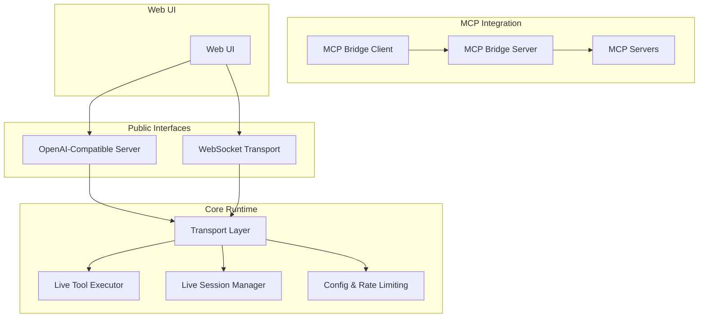
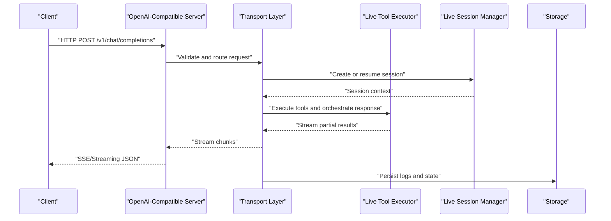
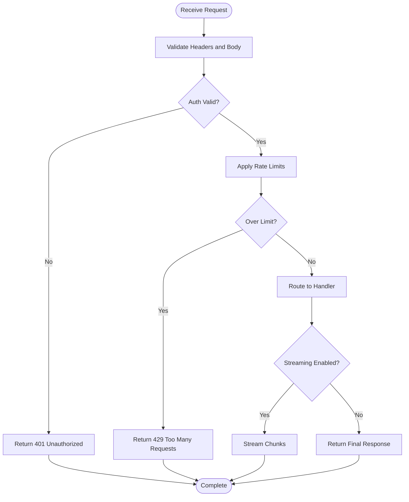
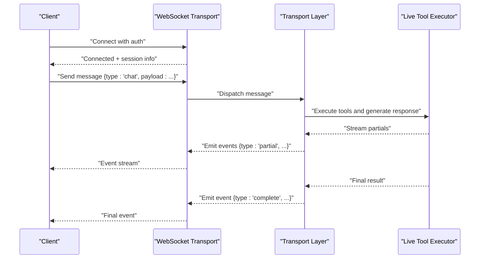
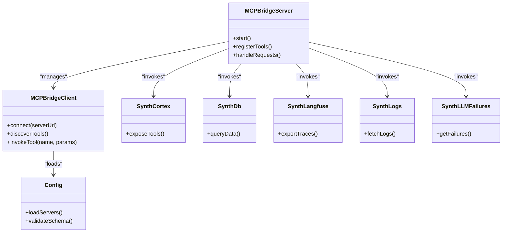
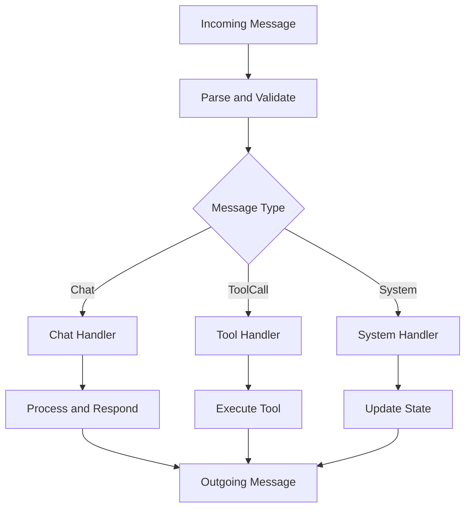
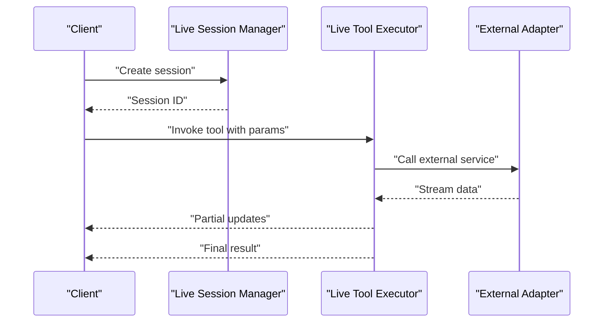
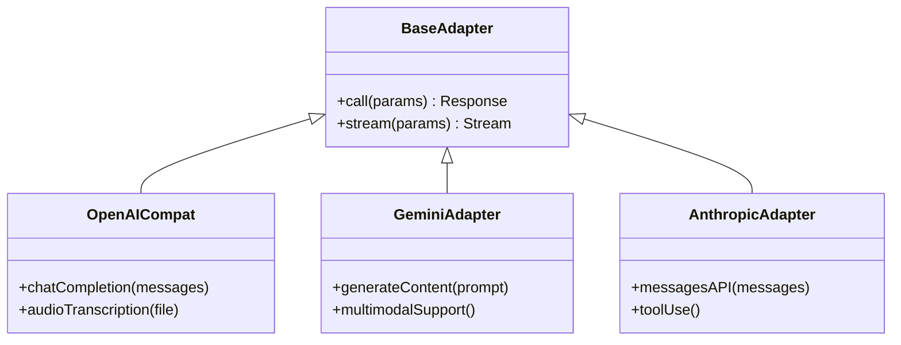
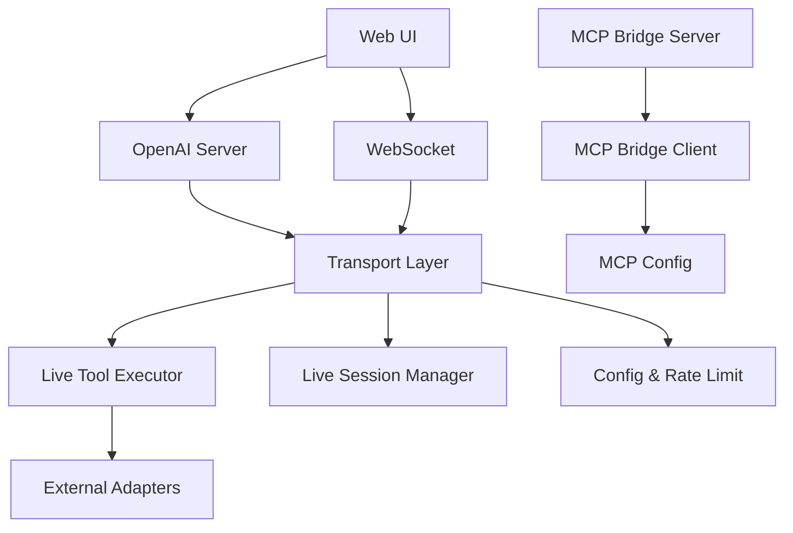

# API Reference

<cite>
**Referenced Files in This Document**
- [main.py](file://main.py)
- [openai_api_server.py](file://interface/openai_api_server/openai_api_server.py)
- [guide.md](file://interface/openai_api_server/guide.md)
- [transport_layer.py](file://core/transport_layer.py)
- [karada_ws_transport.py](file://core/karada_ws_transport.py)
- [rate_limit.py](file://core/rate_limit.py)
- [config.py](file://core/config.py)
- [mcporter.json](file://config/mcporter.json)
- [synth_mcp.json](file://config/synth_mcp.json)
- [client.py](file://core/mcp_bridge/client.py)
- [server.py](file://core/mcp_bridge/server.py)
- [config.py](file://core/mcp_bridge/config.py)
- [__init__.py](file://mcp_servers/synth_cortex.py)
- [__init__.py](file://mcp_servers/synth_db.py)
- [__init__.py](file://mcp_servers/synth_langfuse.py)
- [__init__.py](file://mcp_servers/synth_llm_failures.py)
- [__init__.py](file://mcp_servers/synth_logs.py)
- [openai_compat.py](file://core/external_endpoints/adapters/openai_compat.py)
- [gemini_adapter.py](file://core/external_endpoints/adapters/gemini_adapter.py)
- [anthropic_adapter.py](file://core/external_endpoints/adapters/anthropic_adapter.py)
- [live_tool_executor.py](file://core/live_tool_executor.py)
- [live_session_manager.py](file://core/live_session_manager.py)
- [webui.py](file://core/webui.py)
- [api_endpoints.rst](file://docs/api_endpoints.rst)
</cite>

## Table of Contents
1. [Introduction](#introduction)
2. [Project Structure](#project-structure)
3. [Core Components](#core-components)
4. [Architecture Overview](#architecture-overview)
5. [Detailed Component Analysis](#detailed-component-analysis)
6. [Dependency Analysis](#dependency-analysis)
7. [Performance Considerations](#performance-considerations)
8. [Troubleshooting Guide](#troubleshooting-guide)
9. [Conclusion](#conclusion)
10. [Appendices](#appendices)

## Introduction
This document provides a comprehensive API reference for Synthetic Heart’s public interfaces, covering:
- RESTful endpoints exposed by the OpenAI-compatible server
- WebSocket APIs for real-time interactions and transport
- OpenAI-compatible chat and streaming endpoints
- MCP (Model Context Protocol) server integration
- Internal transport layer protocols
- Authentication, error handling, rate limiting, and versioning
- Client implementation examples and SDK usage patterns
- Security considerations and best practices

The goal is to enable developers to integrate with Synthetic Heart reliably and securely across HTTP and WebSocket transports, while leveraging the OpenAI-compatible interface and MCP tooling.

## Project Structure
Synthetic Heart exposes multiple integration points:
- OpenAI-compatible REST API server under interface/openai_api_server
- WebSocket transport and Karada-specific WS transport under core
- MCP bridge and servers under core/mcp_bridge and mcp_servers
- Web UI and internal utilities under core/webui and docs

**Diagram sources**
- [openai_api_server.py](file://interface/openai_api_server/openai_api_server.py)
- [transport_layer.py](file://core/transport_layer.py)
- [karada_ws_transport.py](file://core/karada_ws_transport.py)
- [live_tool_executor.py](file://core/live_tool_executor.py)
- [live_session_manager.py](file://core/live_session_manager.py)
- [rate_limit.py](file://core/rate_limit.py)
- [config.py](file://core/config.py)
- [server.py](file://core/mcp_bridge/server.py)
- [client.py](file://core/mcp_bridge/client.py)
- [webui.py](file://core/webui.py)

**Section sources**
- [main.py](file://main.py)
- [api_endpoints.rst](file://docs/api_endpoints.rst)

## Core Components
- OpenAI-Compatible API Server: Provides standard chat completions and streaming compatible with OpenAI clients.
- WebSocket Transport: Manages persistent connections, message routing, and real-time events.
- Live Tools and Sessions: Orchestrates live sessions and executes tools in real time.
- MCP Bridge: Exposes and consumes MCP servers for tool invocation and context sharing.
- Configuration and Rate Limiting: Centralized configuration and request throttling.
- Web UI: Frontend that interacts via REST and WebSocket endpoints.

Key responsibilities:
- Request validation and authentication
- Message serialization/deserialization
- Streaming responses for long-running operations
- Error normalization and consistent error schemas
- Versioned endpoints and deprecation policy

**Section sources**
- [openai_api_server.py](file://interface/openai_api_server/openai_api_server.py)
- [transport_layer.py](file://core/transport_layer.py)
- [karada_ws_transport.py](file://core/karada_ws_transport.py)
- [live_tool_executor.py](file://core/live_tool_executor.py)
- [live_session_manager.py](file://core/live_session_manager.py)
- [rate_limit.py](file://core/rate_limit.py)
- [config.py](file://core/config.py)

## Architecture Overview
High-level flow from client to core runtime:

**Diagram sources**
- [openai_api_server.py](file://interface/openai_api_server/openai_api_server.py)
- [transport_layer.py](file://core/transport_layer.py)
- [live_tool_executor.py](file://core/live_tool_executor.py)
- [live_session_manager.py](file://core/live_session_manager.py)

## Detailed Component Analysis

### OpenAI-Compatible REST API
Endpoints follow OpenAI conventions and are served by the OpenAI-compatible server. Typical methods include:
- POST /v1/chat/completions: Standard chat completion with optional streaming
- GET /v1/models: List available models
- POST /v1/audio/transcriptions: Transcribe audio input
- POST /v1/images/generations: Generate images (if enabled)

Authentication:
- Bearer token via Authorization header
- Optional per-route API keys if configured

Request schema highlights:
- model: string identifying the target engine
- messages: array of message objects with role and content
- stream: boolean to enable SSE streaming
- temperature, max_tokens, top_p: generation parameters
- tools/tool_choice: function calling definitions

Response schema highlights:
- id, object, created, model: metadata
- choices: array with message deltas or final message
- usage: token usage statistics
- error: standardized error object when applicable

Error handling:
- Consistent error codes and messages
- Validation errors return 4xx; server errors return 5xx
- Streaming errors terminate the stream with an error event

Rate limiting:
- Per-client or global limits enforced at the transport layer
- Returns 429 with retry-after headers when exceeded

Versioning:
- URL path includes /v1 to support future versions
- Deprecation notices via response headers

**Diagram sources**
- [openai_api_server.py](file://interface/openai_api_server/openai_api_server.py)
- [rate_limit.py](file://core/rate_limit.py)

**Section sources**
- [openai_api_server.py](file://interface/openai_api_server/openai_api_server.py)
- [guide.md](file://interface/openai_api_server/guide.md)
- [api_endpoints.rst](file://docs/api_endpoints.rst)

### WebSocket APIs
WebSocket endpoints provide real-time interaction:
- Connection establishment with handshake and auth
- Bidirectional messaging for chat, tool calls, and system events
- Event types include message, tool_call, tool_result, status, error

Connection handling:
- Upgrade from HTTP to WebSocket
- Authenticate via query parameter or initial message
- Maintain session state and reconnect policies

Message formats:
- JSON payloads with type, payload, and metadata
- Support for binary frames where appropriate (e.g., audio)
- Acknowledgement and sequencing for reliability

Real-time patterns:
- Server-sent events for streaming updates
- Client-initiated control commands
- Heartbeat and keepalive mechanisms

**Diagram sources**
- [karada_ws_transport.py](file://core/karada_ws_transport.py)
- [transport_layer.py](file://core/transport_layer.py)
- [live_tool_executor.py](file://core/live_tool_executor.py)

**Section sources**
- [karada_ws_transport.py](file://core/karada_ws_transport.py)
- [transport_layer.py](file://core/transport_layer.py)

### MCP Server Integration
Synthetic Heart integrates with MCP servers for tool discovery and execution:
- MCP Bridge Server exposes MCP endpoints
- MCP Bridge Client connects to external MCP servers
- Configuration via JSON files for server definitions

Integration points:
- Tool registration and invocation
- Context passing between MCP servers and core runtime
- Error propagation and logging

**Diagram sources**
- [server.py](file://core/mcp_bridge/server.py)
- [client.py](file://core/mcp_bridge/client.py)
- [config.py](file://core/mcp_bridge/config.py)
- [mcporter.json](file://config/mcporter.json)
- [synth_mcp.json](file://config/synth_mcp.json)
- [__init__.py](file://mcp_servers/synth_cortex.py)
- [__init__.py](file://mcp_servers/synth_db.py)
- [__init__.py](file://mcp_servers/synth_langfuse.py)
- [__init__.py](file://mcp_servers/synth_logs.py)
- [__init__.py](file://mcp_servers/synth_llm_failures.py)

**Section sources**
- [client.py](file://core/mcp_bridge/client.py)
- [server.py](file://core/mcp_bridge/server.py)
- [config.py](file://core/mcp_bridge/config.py)
- [mcporter.json](file://config/mcporter.json)
- [synth_mcp.json](file://config/synth_mcp.json)
- [__init__.py](file://mcp_servers/synth_cortex.py)
- [__init__.py](file://mcp_servers/synth_db.py)
- [__init__.py](file://mcp_servers/synth_langfuse.py)
- [__init__.py](file://mcp_servers/synth_logs.py)
- [__init__.py](file://mcp_servers/synth_llm_failures.py)

### Internal Transport Layer Protocols
The transport layer abstracts communication between components:
- Message serialization and deserialization
- Routing and dispatch based on message type
- Error handling and retries
- Backpressure and flow control

Protocols supported:
- JSON over HTTP for REST
- JSON over WebSocket for real-time
- Binary frames for media streams

**Diagram sources**
- [transport_layer.py](file://core/transport_layer.py)

**Section sources**
- [transport_layer.py](file://core/transport_layer.py)

### Live Tools and Sessions
Live tools enable real-time execution within sessions:
- Session lifecycle management
- Tool discovery and invocation
- Streaming results back to clients

**Diagram sources**
- [live_session_manager.py](file://core/live_session_manager.py)
- [live_tool_executor.py](file://core/live_tool_executor.py)

**Section sources**
- [live_tool_executor.py](file://core/live_tool_executor.py)
- [live_session_manager.py](file://core/live_session_manager.py)

### External Endpoint Adapters
Adapters provide compatibility with external AI services:
- OpenAI-compatible adapter for unified interface
- Gemini and Anthropic adapters for specialized features
- Custom TTS adapters for voice synthesis

**Diagram sources**
- [openai_compat.py](file://core/external_endpoints/adapters/openai_compat.py)
- [gemini_adapter.py](file://core/external_endpoints/adapters/gemini_adapter.py)
- [anthropic_adapter.py](file://core/external_endpoints/adapters/anthropic_adapter.py)

**Section sources**
- [openai_compat.py](file://core/external_endpoints/adapters/openai_compat.py)
- [gemini_adapter.py](file://core/external_endpoints/adapters/gemini_adapter.py)
- [anthropic_adapter.py](file://core/external_endpoints/adapters/anthropic_adapter.py)

## Dependency Analysis
Component dependencies and relationships:

**Diagram sources**
- [openai_api_server.py](file://interface/openai_api_server/openai_api_server.py)
- [transport_layer.py](file://core/transport_layer.py)
- [live_tool_executor.py](file://core/live_tool_executor.py)
- [live_session_manager.py](file://core/live_session_manager.py)
- [rate_limit.py](file://core/rate_limit.py)
- [config.py](file://core/config.py)
- [server.py](file://core/mcp_bridge/server.py)
- [client.py](file://core/mcp_bridge/client.py)
- [config.py](file://core/mcp_bridge/config.py)
- [webui.py](file://core/webui.py)

**Section sources**
- [openai_api_server.py](file://interface/openai_api_server/openai_api_server.py)
- [transport_layer.py](file://core/transport_layer.py)
- [rate_limit.py](file://core/rate_limit.py)
- [config.py](file://core/config.py)

## Performance Considerations
- Use streaming responses for long-running operations to reduce latency
- Implement connection pooling for external API calls
- Cache frequently accessed data and configurations
- Monitor memory usage and garbage collection during streaming
- Optimize message serialization for large payloads
- Use async I/O for non-blocking operations
- Implement circuit breakers for external dependencies

[No sources needed since this section provides general guidance]

## Troubleshooting Guide
Common issues and resolutions:
- Authentication failures: Verify token format and permissions
- Rate limiting: Check quota usage and implement exponential backoff
- WebSocket disconnections: Implement reconnection logic with jitter
- Tool execution errors: Inspect tool logs and validate parameters
- Memory leaks: Monitor heap usage and release resources promptly
- Network timeouts: Configure appropriate timeouts and retries

Debugging utilities:
- Enable verbose logging for API requests and responses
- Use health check endpoints to verify service status
- Monitor error rates and latency metrics

**Section sources**
- [rate_limit.py](file://core/rate_limit.py)
- [transport_layer.py](file://core/transport_layer.py)
- [webui.py](file://core/webui.py)

## Conclusion
Synthetic Heart provides a robust set of APIs for integrating AI capabilities through REST and WebSocket interfaces. The OpenAI-compatible server ensures familiarity for existing clients, while the WebSocket transport enables real-time interactions. MCP integration extends tool capabilities, and the internal transport layer ensures reliable communication. By following the security guidelines and best practices outlined here, developers can build secure and efficient integrations.

[No sources needed since this section summarizes without analyzing specific files]

## Appendices

### Authentication Flows
- Bearer token authentication for REST APIs
- Query parameter or initial message authentication for WebSocket
- Token refresh and rotation strategies
- Scope-based authorization for fine-grained access control

### Client Implementation Examples
- Python SDK usage patterns for REST and WebSocket
- JavaScript client examples for browser environments
- Error handling and retry logic implementations
- Streaming response processing techniques

### Security Considerations
- Input validation and sanitization
- Output encoding to prevent XSS
- Secure storage of credentials and tokens
- HTTPS enforcement for all communications
- CORS configuration for web clients

### Best Practices
- Implement proper error handling and logging
- Use versioned endpoints for backward compatibility
- Monitor performance and resource usage
- Test thoroughly with different client types
- Document API changes and deprecations clearly

[No sources needed since this section provides general guidance]