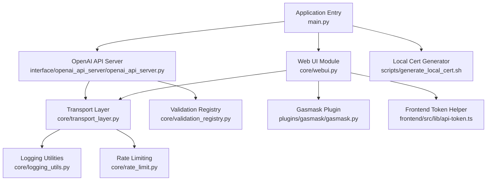
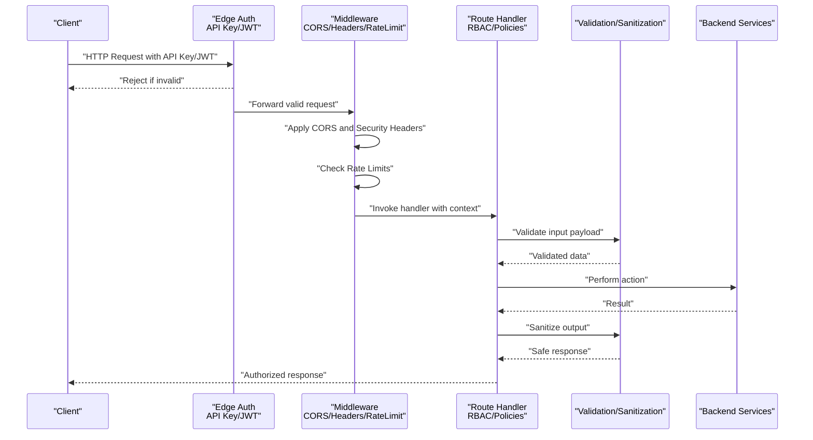
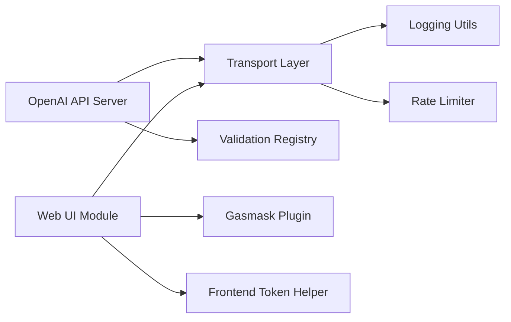

# Authentication & Security

<cite>
**Referenced Files in This Document**
- [main.py](file://main.py)
- [core/config.py](file://core/config.py)
- [core/webui.py](file://core/webui.py)
- [interface/openai_api_server/openai_api_server.py](file://interface/openai_api_server/openai_api_server.py)
- [core/transport_layer.py](file://core/transport_layer.py)
- [core/logging_utils.py](file://core/logging_utils.py)
- [core/rate_limit.py](file://core/rate_limit.py)
- [core/validation_registry.py](file://core/validation_registry.py)
- [plugins/gasmask/gasmask.py](file://plugins/gasmask/gasmask.py)
- [frontend/src/lib/api-token.ts](file://frontend/src/lib/api-token.ts)
- [scripts/generate_local_cert.sh](file://scripts/generate_local_cert.sh)
</cite>

## Table of Contents
1. [Introduction](#introduction)
2. [Project Structure](#project-structure)
3. [Core Components](#core-components)
4. [Architecture Overview](#architecture-overview)
5. [Detailed Component Analysis](#detailed-component-analysis)
6. [Dependency Analysis](#dependency-analysis)
7. [Performance Considerations](#performance-considerations)
8. [Troubleshooting Guide](#troubleshooting-guide)
9. [Conclusion](#conclusion)
10. [Appendices](#appendices)

## Introduction
This document provides comprehensive authentication and security guidance for Synthetic Heart’s API interfaces. It covers API key management, JWT token authentication, OAuth flows, role-based access control (RBAC), security headers, CORS configuration, input validation, output sanitization, secure client implementation patterns, token rotation strategies, audit logging, best practices, vulnerability mitigation, and compliance considerations. The goal is to help developers and operators implement secure integrations with confidence.

## Project Structure
Authentication and security are implemented across several layers:
- Application entrypoint and server initialization
- Web UI and API server modules
- Transport layer for network I/O
- Logging and rate limiting utilities
- Validation registry for input/output handling
- Plugin-based security controls
- Frontend token helpers
- Certificate generation scripts

**Diagram sources**
- [main.py](file://main.py)
- [core/webui.py](file://core/webui.py)
- [interface/openai_api_server/openai_api_server.py](file://interface/openai_api_server/openai_api_server.py)
- [core/transport_layer.py](file://core/transport_layer.py)
- [core/logging_utils.py](file://core/logging_utils.py)
- [core/rate_limit.py](file://core/rate_limit.py)
- [core/validation_registry.py](file://core/validation_registry.py)
- [plugins/gasmask/gasmask.py](file://plugins/gasmask/gasmask.py)
- [frontend/src/lib/api-token.ts](file://frontend/src/lib/api-token.ts)
- [scripts/generate_local_cert.sh](file://scripts/generate_local_cert.sh)

**Section sources**
- [main.py](file://main.py)
- [core/config.py](file://core/config.py)
- [core/webui.py](file://core/webui.py)
- [interface/openai_api_server/openai_api_server.py](file://interface/openai_api_server/openai_api_server.py)
- [core/transport_layer.py](file://core/transport_layer.py)
- [core/logging_utils.py](file://core/logging_utils.py)
- [core/rate_limit.py](file://core/rate_limit.py)
- [core/validation_registry.py](file://core/validation_registry.py)
- [plugins/gasmask/gasmask.py](file://plugins/gasmask/gasmask.py)
- [frontend/src/lib/api-token.ts](file://frontend/src/lib/api-token.ts)
- [scripts/generate_local_cert.sh](file://scripts/generate_local_cert.sh)

## Core Components
- Application entrypoint initializes the server and wires up middleware and routes.
- Web UI module exposes endpoints and manages session/token interactions.
- OpenAI API server provides a compatible API surface with its own auth and routing.
- Transport layer handles HTTP/WebSocket connections, TLS, and headers.
- Logging utilities centralize structured logs for auditability.
- Rate limiter protects endpoints from abuse.
- Validation registry enforces schema checks on inputs and outputs.
- Gasmask plugin adds additional security controls and policies.
- Frontend token helper manages API tokens and JWT lifecycle in the browser.
- Local certificate generator supports development TLS setup.

Key responsibilities:
- Enforce authentication at the edge (API keys, JWT).
- Apply authorization policies per route or resource.
- Validate all inputs against schemas; sanitize outputs.
- Log security-relevant events consistently.
- Rate limit sensitive operations.
- Provide secure defaults for CORS and headers.

**Section sources**
- [core/config.py](file://core/config.py)
- [core/webui.py](file://core/webui.py)
- [interface/openai_api_server/openai_api_server.py](file://interface/openai_api_server/openai_api_server.py)
- [core/transport_layer.py](file://core/transport_layer.py)
- [core/logging_utils.py](file://core/logging_utils.py)
- [core/rate_limit.py](file://core/rate_limit.py)
- [core/validation_registry.py](file://core/validation_registry.py)
- [plugins/gasmask/gasmask.py](file://plugins/gasmask/gasmask.py)
- [frontend/src/lib/api-token.ts](file://frontend/src/lib/api-token.ts)
- [scripts/generate_local_cert.sh](file://scripts/generate_local_cert.sh)

## Architecture Overview
The system uses layered authentication and authorization:
- Edge layer: API key verification and JWT validation.
- Middleware layer: CORS, security headers, rate limiting, request logging.
- Route handlers: Role-based access control and policy enforcement.
- Data layer: Input validation and output sanitization.

**Diagram sources**
- [interface/openai_api_server/openai_api_server.py](file://interface/openai_api_server/openai_api_server.py)
- [core/webui.py](file://core/webui.py)
- [core/transport_layer.py](file://core/transport_layer.py)
- [core/rate_limit.py](file://core/rate_limit.py)
- [core/validation_registry.py](file://core/validation_registry.py)

## Detailed Component Analysis

### API Key Management
- API keys are validated at the edge before reaching route handlers.
- Keys should be stored securely (environment variables or secret managers).
- Rotation strategy: issue short-lived keys, maintain dual-key windows during rotation, revoke old keys immediately after migration.
- Scope binding: associate keys with minimal required scopes.

Implementation pointers:
- Edge validation occurs in the API server and transport layer.
- Logging records key usage and failures for audit.

**Section sources**
- [interface/openai_api_server/openai_api_server.py](file://interface/openai_api_server/openai_api_server.py)
- [core/transport_layer.py](file://core/transport_layer.py)
- [core/logging_utils.py](file://core/logging_utils.py)

### JWT Token Authentication
- Tokens are validated via signature and expiration checks.
- Claims include user identity and roles; enforce RBAC in handlers.
- Refresh flow: use refresh tokens issued separately; rotate access tokens frequently.
- Storage: store refresh tokens securely; avoid long-lived access tokens.

Client-side token handling:
- Use the frontend token helper to manage storage and renewal.
- Attach Authorization header with bearer tokens.

**Section sources**
- [core/webui.py](file://core/webui.py)
- [frontend/src/lib/api-token.ts](file://frontend/src/lib/api-token.ts)
- [core/logging_utils.py](file://core/logging_utils.py)

### OAuth Flows
- Supported flows: Authorization Code with PKCE for public clients; Client Credentials for service-to-service.
- Redirect URIs must be whitelisted; state parameter enforced to prevent CSRF.
- Scopes map to internal roles; validate scope-to-role mapping server-side.

Flow overview:
- Client initiates authorization request with state and code_challenge.
- Provider returns code; client exchanges for tokens using code_verifier.
- Access token used for API calls; refresh token managed securely.

**Section sources**
- [core/webui.py](file://core/webui.py)
- [interface/openai_api_server/openai_api_server.py](file://interface/openai_api_server/openai_api_server.py)

### Role-Based Access Control (RBAC)
- Roles defined in claims or configuration; mapped to permissions.
- Handlers check roles before executing actions.
- Least privilege principle: default deny, explicit allow.

Policy enforcement:
- Middleware injects role context into request.
- Validators ensure payloads do not escalate privileges.

**Section sources**
- [core/webui.py](file://core/webui.py)
- [core/validation_registry.py](file://core/validation_registry.py)

### Security Headers and CORS Configuration
- Security headers: enforce strict transport security, content type sniffing prevention, frame options, XSS protection.
- CORS: restrict origins, methods, and headers; preflight caching disabled for dynamic configs.
- TLS: require HTTPS in production; generate local certs for development.

Configuration points:
- Transport layer sets headers and CORS policies.
- Certificate generation script aids local development.

**Section sources**
- [core/transport_layer.py](file://core/transport_layer.py)
- [scripts/generate_local_cert.sh](file://scripts/generate_local_cert.sh)

### Input Validation and Output Sanitization
- All inputs validated against schemas; reject malformed requests early.
- Outputs sanitized to prevent injection and information leakage.
- Centralized validation registry ensures consistency.

Patterns:
- Schema-first validation with clear error messages.
- Whitelist allowed fields; strip unknowns.

**Section sources**
- [core/validation_registry.py](file://core/validation_registry.py)

### Audit Logging
- Structured logs capture authentication events, authorization decisions, and errors.
- Sensitive data redacted by default.
- Log levels configurable; export to centralized systems.

Best practices:
- Include correlation IDs for tracing.
- Avoid logging secrets or tokens.

**Section sources**
- [core/logging_utils.py](file://core/logging_utils.py)

### Rate Limiting
- Protect endpoints with per-client and global limits.
- Configurable windows and thresholds.
- Return appropriate status codes and headers.

Integration:
- Applied in middleware before handlers.

**Section sources**
- [core/rate_limit.py](file://core/rate_limit.py)

### Secure Client Implementations
- Use HTTPS only; verify server certificates.
- Store tokens securely; never log them.
- Implement retry with backoff and jitter; handle 401/403 gracefully.
- Rotate tokens proactively; refresh before expiry.

Example patterns:
- Attach Authorization header for JWT.
- Use API keys via dedicated headers.

**Section sources**
- [frontend/src/lib/api-token.ts](file://frontend/src/lib/api-token.ts)
- [core/transport_layer.py](file://core/transport_layer.py)

### Token Rotation Strategies
- Short-lived access tokens (minutes); refresh tokens (days).
- Dual-key rotation window for API keys.
- Immediate revocation on compromise; monitor logs for anomalies.

Operational steps:
- Generate new credentials.
- Update clients gradually.
- Revoke old credentials after confirmation.

**Section sources**
- [core/webui.py](file://core/webui.py)
- [interface/openai_api_server/openai_api_server.py](file://interface/openai_api_server/openai_api_server.py)

### Compliance Considerations
- Data minimization: collect only necessary identifiers.
- Retention policies: define and enforce log retention.
- Encryption: TLS in transit; encrypt secrets at rest.
- Auditing: maintain immutable logs for security events.

**Section sources**
- [core/logging_utils.py](file://core/logging_utils.py)
- [core/config.py](file://core/config.py)

## Dependency Analysis
Authentication components depend on shared utilities for logging, rate limiting, and validation. The API server and web UI both rely on the transport layer for network concerns.

**Diagram sources**
- [interface/openai_api_server/openai_api_server.py](file://interface/openai_api_server/openai_api_server.py)
- [core/webui.py](file://core/webui.py)
- [core/transport_layer.py](file://core/transport_layer.py)
- [core/logging_utils.py](file://core/logging_utils.py)
- [core/rate_limit.py](file://core/rate_limit.py)
- [core/validation_registry.py](file://core/validation_registry.py)
- [plugins/gasmask/gasmask.py](file://plugins/gasmask/gasmask.py)
- [frontend/src/lib/api-token.ts](file://frontend/src/lib/api-token.ts)

**Section sources**
- [interface/openai_api_server/openai_api_server.py](file://interface/openai_api_server/openai_api_server.py)
- [core/webui.py](file://core/webui.py)
- [core/transport_layer.py](file://core/transport_layer.py)
- [core/logging_utils.py](file://core/logging_utils.py)
- [core/rate_limit.py](file://core/rate_limit.py)
- [core/validation_registry.py](file://core/validation_registry.py)
- [plugins/gasmask/gasmask.py](file://plugins/gasmask/gasmask.py)
- [frontend/src/lib/api-token.ts](file://frontend/src/lib/api-token.ts)

## Performance Considerations
- Minimize auth overhead by caching token validations where safe.
- Use connection pooling for backend services.
- Tune rate limiter thresholds based on expected load.
- Avoid heavy serialization in hot paths; prefer streaming for large payloads.

[No sources needed since this section provides general guidance]

## Troubleshooting Guide
Common issues and resolutions:
- Invalid API key: verify key format and scope; check logs for rejection reasons.
- JWT expired: implement refresh logic; ensure clock skew tolerance.
- CORS errors: confirm allowed origins and methods; inspect preflight responses.
- Rate limited: adjust limits or identify abusive clients; review logs.
- Validation failures: inspect schema definitions and payload structure.

Diagnostic steps:
- Enable verbose logging temporarily.
- Use health and introspection endpoints.
- Validate certificates and TLS settings.

**Section sources**
- [core/logging_utils.py](file://core/logging_utils.py)
- [core/rate_limit.py](file://core/rate_limit.py)
- [core/validation_registry.py](file://core/validation_registry.py)

## Conclusion
Synthetic Heart’s authentication and security architecture emphasizes defense-in-depth: edge authentication, middleware protections, role-based authorization, strict validation, and comprehensive auditing. By following the recommended practices for API keys, JWTs, OAuth, headers, CORS, and token rotation, teams can build secure, compliant, and resilient integrations.

[No sources needed since this section summarizes without analyzing specific files]

## Appendices

### Security Best Practices Checklist
- Enforce HTTPS everywhere; disable insecure protocols.
- Use strong, unique API keys and rotate regularly.
- Validate and sanitize all inputs; trust no client data.
- Apply least privilege RBAC; audit role assignments.
- Centralize logging; redact sensitive data.
- Configure CORS tightly; restrict origins and methods.
- Monitor and alert on anomalous authentication events.

[No sources needed since this section provides general guidance]

### Vulnerability Mitigation Strategies
- Prevent injection via strict schemas and output encoding.
- Mitigate CSRF with state parameters and SameSite cookies.
- Harden CORS to prevent cross-origin data leaks.
- Rate limit to reduce brute-force and DoS risks.
- Encrypt secrets at rest and in transit.

[No sources needed since this section provides general guidance]