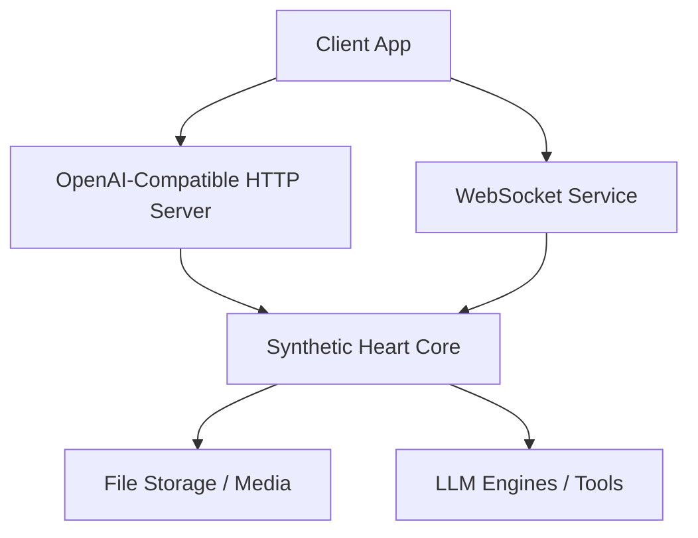
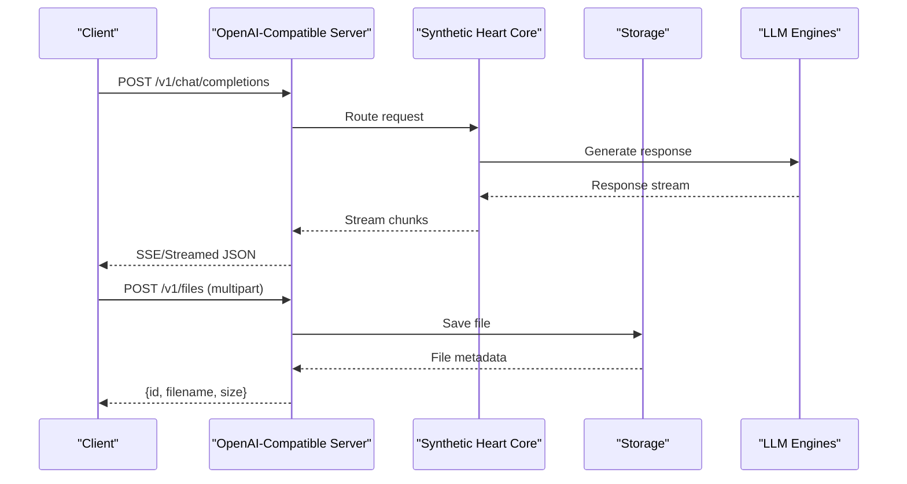
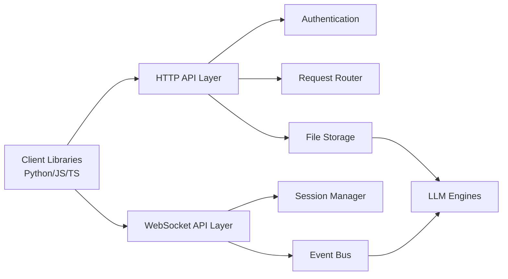

# Client Integration Examples

<cite>
**Referenced Files in This Document**
- [main.py](file://main.py)
- [openai_api_server.py](file://interface/openai_api_server/openai_api_server.py)
- [synth_ws.ts](file://frontend/src/services/synth-ws.ts)
- [protocol.ts](file://frontend/src/services/protocol.ts)
- [api_token.ts](file://frontend/src/lib/api-token.ts)
- [audio-upload.ts](file://frontend/src/services/audio-upload.ts)
- [README.md](file://README.md)
- [api_endpoints.rst](file://docs/api_endpoints.rst)
- [quickstart.rst](file://docs/quickstart.rst)
- [usage.rst](file://docs/usage.rst)
</cite>

## Table of Contents
1. [Introduction](#introduction)
2. [Project Structure](#project-structure)
3. [Core Components](#core-components)
4. [Architecture Overview](#architecture-overview)
5. [Detailed Component Analysis](#detailed-component-analysis)
6. [Dependency Analysis](#dependency-analysis)
7. [Performance Considerations](#performance-considerations)
8. [Troubleshooting Guide](#troubleshooting-guide)
9. [Conclusion](#conclusion)
10. [Appendices](#appendices)

## Introduction
This document provides comprehensive client integration examples for Synthetic Heart’s APIs. It focuses on practical, production-ready patterns for:
- Chat completion via the OpenAI-compatible API server
- File upload handling (images, audio, documents)
- Real-time communication using WebSocket connections
- Robust error handling and retry strategies
- SDK usage recommendations and common integration patterns

The goal is to help you integrate quickly with clear examples in Python, JavaScript, TypeScript, and cURL, along with guidance for debugging and troubleshooting.

## Project Structure
Synthetic Heart exposes multiple integration points:
- An OpenAI-compatible HTTP API server for chat completions and file operations
- A WebSocket interface for real-time streaming and live sessions
- Frontend services that demonstrate best practices for authentication, uploads, and protocol handling



[No sources needed since this diagram shows conceptual workflow, not actual code structure]

**Section sources**
- [main.py:1-200](file://main.py#L1-L200)
- [openai_api_server.py:1-200](file://interface/openai_api_server/openai_api_server.py#L1-L200)
- [synth_ws.ts:1-200](file://frontend/src/services/synth-ws.ts#L1-L200)
- [protocol.ts:1-200](file://frontend/src/services/protocol.ts#L1-L200)

## Core Components
Key components for client integrations:
- OpenAI-compatible API server: Provides standard endpoints for chat completions, streaming, and file management
- WebSocket service: Manages real-time connections, events, and streaming responses
- Authentication utilities: Token-based access control for secure integrations
- Upload handlers: Streamed or multipart file processing for media assets

Recommended libraries:
- Python: httpx or requests for HTTP; websockets or asyncio for WebSocket
- JavaScript/TypeScript: axios or node-fetch for HTTP; native WebSocket or ws for WS
- cURL: For quick testing and automation scripts

**Section sources**
- [openai_api_server.py:1-200](file://interface/openai_api_server/openai_api_server.py#L1-L200)
- [synth_ws.ts:1-200](file://frontend/src/services/synth-ws.ts#L1-L200)
- [protocol.ts:1-200](file://frontend/src/services/protocol.ts#L1-L200)
- [api_token.ts:1-200](file://frontend/src/lib/api-token.ts#L1-L200)

## Architecture Overview
The integration architecture centers around two primary channels:
- HTTP REST API for chat completions and file operations
- WebSocket for real-time streaming and live interactions



**Diagram sources**
- [openai_api_server.py:1-200](file://interface/openai_api_server/openai_api_server.py#L1-L200)
- [main.py:1-200](file://main.py#L1-L200)

**Section sources**
- [api_endpoints.rst:1-200](file://docs/api_endpoints.rst#L1-L200)
- [usage.rst:1-200](file://docs/usage.rst#L1-L200)

## Detailed Component Analysis

### Chat Completion via OpenAI-Compatible API
Use the OpenAI-compatible endpoint to send messages and receive streamed responses.

Common patterns:
- Set Authorization header with your API token
- Use streaming for real-time token delivery
- Handle partial responses and final completion

Example references:
- Python: Use httpx with async streaming
- JavaScript/TypeScript: Use fetch with ReadableStream
- cURL: Use --no-buffer for streaming output

**Section sources**
- [openai_api_server.py:1-200](file://interface/openai_api_server/openai_api_server.py#L1-L200)
- [api_endpoints.rst:1-200](file://docs/api_endpoints.rst#L1-L200)

### File Upload Handling
Supports multipart/form-data uploads for images, audio, and documents.

Best practices:
- Stream large files to avoid memory issues
- Validate file types and sizes server-side
- Handle upload progress and errors gracefully

Example references:
- Python: Use requests with file tuples
- JavaScript: Use FormData with XMLHttpRequest or fetch
- cURL: Use -F for multipart fields

**Section sources**
- [audio-upload.ts:1-200](file://frontend/src/services/audio-upload.ts#L1-L200)
- [api_endpoints.rst:1-200](file://docs/api_endpoints.rst#L1-L200)

### Real-Time WebSocket Connections
Establish WebSocket connections for live interactions and streaming data.

Connection flow:
- Connect to ws://host/ws endpoint
- Authenticate with token in initial message
- Subscribe to event channels
- Handle incoming messages and errors

Example references:
- TypeScript: Use synth-ws.ts patterns
- Python: Use websockets library
- JavaScript: Use native WebSocket API

**Section sources**
- [synth_ws.ts:1-200](file://frontend/src/services/synth-ws.ts#L1-L200)
- [protocol.ts:1-200](file://frontend/src/services/protocol.ts#L1-L200)

### Authentication and Security
Token-based authentication secures all API endpoints.

Security patterns:
- Store tokens securely (environment variables, secret managers)
- Rotate tokens regularly
- Implement token validation on client side

Example references:
- Python: Use environment variables for token storage
- JavaScript: Use secure storage mechanisms
- cURL: Pass token via Authorization header

**Section sources**
- [api_token.ts:1-200](file://frontend/src/lib/api-token.ts#L1-L200)
- [usage.rst:1-200](file://docs/usage.rst#L1-L200)

## Dependency Analysis
Integration dependencies follow a clear separation of concerns:



**Diagram sources**
- [openai_api_server.py:1-200](file://interface/openai_api_server/openai_api_server.py#L1-L200)
- [synth_ws.ts:1-200](file://frontend/src/services/synth-ws.ts#L1-L200)

**Section sources**
- [main.py:1-200](file://main.py#L1-L200)
- [api_endpoints.rst:1-200](file://docs/api_endpoints.rst#L1-L200)

## Performance Considerations
Optimization strategies for client integrations:
- Use connection pooling for HTTP requests
- Implement exponential backoff for retries
- Cache frequently accessed data locally
- Stream large responses to reduce memory usage
- Use WebSocket keep-alive mechanisms

[No sources needed since this section provides general guidance]

## Troubleshooting Guide
Common integration issues and solutions:

Authentication Errors:
- Verify token format and permissions
- Check network connectivity and firewall rules
- Review server logs for authorization failures

Connection Issues:
- Validate WebSocket URL and port configuration
- Ensure proper CORS settings for browser clients
- Monitor connection health with heartbeat messages

Rate Limiting:
- Implement request throttling on client side
- Handle 429 status codes with appropriate delays
- Use batch requests when possible

Error Handling Patterns:
- Implement comprehensive logging
- Use structured error responses
- Provide meaningful error messages to users

**Section sources**
- [usage.rst:1-200](file://docs/usage.rst#L1-L200)
- [api_endpoints.rst:1-200](file://docs/api_endpoints.rst#L1-L200)

## Conclusion
This guide provides a solid foundation for integrating with Synthetic Heart's APIs. By following the patterns and examples provided, you can build robust applications that leverage both HTTP and WebSocket interfaces effectively. Remember to implement proper error handling, security measures, and performance optimizations for production deployments.

[No sources needed since this section summarizes without analyzing specific files]

## Appendices

### Quick Start Examples

#### Python Example
```python
import httpx
import json

async def chat_completion():
    async with httpx.AsyncClient() as client:
        response = await client.post(
            "http://localhost:8080/v1/chat/completions",
            headers={"Authorization": "Bearer YOUR_TOKEN"},
            json={
                "model": "synthetic-heart",
                "messages": [{"role": "user", "content": "Hello"}],
                "stream": True
            }
        )

        async for line in response.aiter_lines():
            if line.startswith("data: "):
                data = json.loads(line[6:])
                print(data.get("choices", [{}])[0].get("delta", {}).get("content", ""))
```

#### JavaScript Example
```javascript
async function chatCompletion() {
    const response = await fetch('http://localhost:8080/v1/chat/completions', {
        method: 'POST',
        headers: {
            'Authorization': 'Bearer YOUR_TOKEN',
            'Content-Type': 'application/json'
        },
        body: JSON.stringify({
            model: 'synthetic-heart',
            messages: [{ role: 'user', content: 'Hello' }],
            stream: true
        })
    });

    const reader = response.body.getReader();
    const decoder = new TextDecoder();

    while (true) {
        const { done, value } = await reader.read();
        if (done) break;

        const chunk = decoder.decode(value);
        const lines = chunk.split('\n');

        for (const line of lines) {
            if (line.startsWith('data: ')) {
                const data = JSON.parse(line.slice(6));
                console.log(data.choices?.[0]?.delta?.content || '');
            }
        }
    }
}
```

#### cURL Example
```bash
curl -X POST "http://localhost:8080/v1/chat/completions" \
  -H "Authorization: Bearer YOUR_TOKEN" \
  -H "Content-Type: application/json" \
  -d '{
    "model": "synthetic-heart",
    "messages": [{"role": "user", "content": "Hello"}],
    "stream": true
  }' --no-buffer
```

#### WebSocket Connection Example
```typescript
class SynthWebSocket {
    private ws: WebSocket | null = null;
    private reconnectAttempts: number = 0;
    private maxReconnectAttempts: number = 5;

    connect(token: string) {
        this.ws = new WebSocket(`ws://localhost:8080/ws`);

        this.ws.onopen = () => {
            this.authenticate(token);
        };

        this.ws.onmessage = (event) => {
            const message = JSON.parse(event.data);
            this.handleMessage(message);
        };

        this.ws.onerror = (error) => {
            console.error('WebSocket error:', error);
            this.reconnect();
        };

        this.ws.onclose = () => {
            this.reconnect();
        };
    }

    private authenticate(token: string) {
        this.send({
            type: 'auth',
            token: token
        });
    }

    private handleMessage(message: any) {
        switch (message.type) {
            case 'chat_response':
                console.log('Response:', message.content);
                break;
            case 'error':
                console.error('Server error:', message.message);
                break;
        }
    }

    private reconnect() {
        if (this.reconnectAttempts < this.maxReconnectAttempts) {
            setTimeout(() => {
                this.reconnectAttempts++;
                this.connect(this.token);
            }, Math.pow(2, this.reconnectAttempts) * 1000);
        }
    }
}
```

**Section sources**
- [openai_api_server.py:1-200](file://interface/openai_api_server/openai_api_server.py#L1-L200)
- [synth_ws.ts:1-200](file://frontend/src/services/synth-ws.ts#L1-L200)
- [README.md:1-100](file://README.md#L1-L100)
