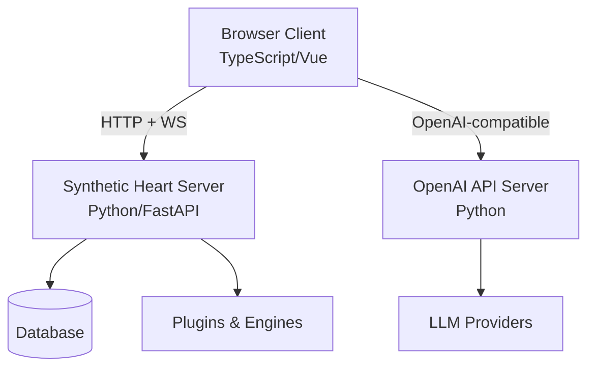
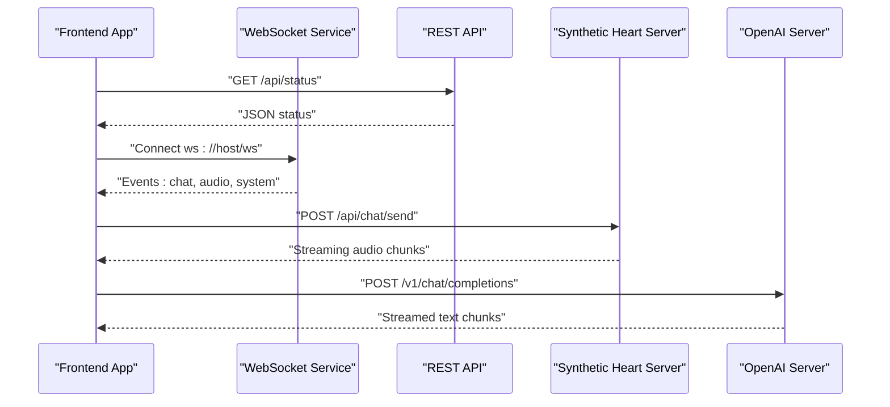
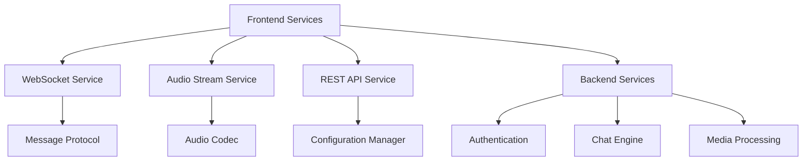

# JavaScript & TypeScript Integration Examples

<cite>
**Referenced Files in This Document**
- [main.py](file://main.py)
- [webui.py](file://core/webui.py)
- [synth_ws.ts](file://frontend/src/services/synth-ws.ts)
- [audio-stream.ts](file://frontend/src/services/audio-stream.ts)
- [karada-rest.ts](file://frontend/src/services/karada-rest.ts)
- [protocol.ts](file://frontend/src/services/protocol.ts)
- [openai_api_server.py](file://interface/openai_api_server/openai_api_server.py)
- [vite.config.ts](file://frontend/vite.config.ts)
- [package.json](file://frontend/package.json)
- [tsconfig.json](file://frontend/tsconfig.json)
- [index.html](file://frontend/index.html)
- [api_endpoints.rst](file://docs/api_endpoints.rst)
- [architecture.rst](file://docs/architecture.rst)
- [quickstart.rst](file://docs/quickstart.rst)
</cite>

## Table of Contents
1. [Introduction](#introduction)
2. [Project Structure](#project-structure)
3. [Core Components](#core-components)
4. [Architecture Overview](#architecture-overview)
5. [Detailed Component Analysis](#detailed-component-analysis)
6. [Dependency Analysis](#dependency-analysis)
7. [Performance Considerations](#performance-considerations)
8. [Troubleshooting Guide](#troubleshooting-guide)
9. [Conclusion](#conclusion)
10. [Appendices](#appendices)

## Introduction
This document provides practical, production-ready integration examples for Synthetic Heart using JavaScript and TypeScript. It covers REST API calls with fetch and axios, WebSocket connections for real-time features, Node.js server patterns, browser client setup, CORS configuration, streaming audio playback, real-time chat interfaces, error handling strategies, and TypeScript type definitions. The goal is to help you build modern web applications that integrate seamlessly with Synthetic Heart’s backend services.

## Project Structure
Synthetic Heart exposes multiple integration points:
- A Python-based HTTP/WebSocket server (FastAPI/Uvicorn) serving the Web UI and APIs
- An OpenAI-compatible API server for LLM interactions
- A frontend built with Vite, TypeScript, and Vue components, including WebSocket and audio streaming services

**Diagram sources**
- [main.py:1-200](file://main.py#L1-L200)
- [openai_api_server.py:1-200](file://interface/openai_api_server/openai_api_server.py#L1-L200)
- [vite.config.ts:1-120](file://frontend/vite.config.ts#L1-L120)

**Section sources**
- [main.py:1-200](file://main.py#L1-L200)
- [webui.py:1-200](file://core/webui.py#L1-L200)
- [openai_api_server.py:1-200](file://interface/openai_api_server/openai_api_server.py#L1-L200)
- [vite.config.ts:1-120](file://frontend/vite.config.ts#L1-L120)

## Core Components
Key integration components exposed by Synthetic Heart:
- REST endpoints for configuration, chat history, media, and system status
- WebSocket endpoint for real-time events, chat messages, and control signals
- OpenAI-compatible endpoints for chat completions and streaming responses
- Audio streaming endpoints for TTS playback in browsers

Typical client responsibilities:
- Manage authentication tokens and session state
- Connect to WebSocket channels and handle reconnection
- Stream audio chunks and render them in the browser
- Send chat messages and receive real-time updates

**Section sources**
- [api_endpoints.rst:1-200](file://docs/api_endpoints.rst#L1-L200)
- [architecture.rst:1-200](file://docs/architecture.rst#L1-L200)

## Architecture Overview
The integration architecture combines synchronous REST calls with asynchronous WebSocket streams:

**Diagram sources**
- [synth_ws.ts:1-200](file://frontend/src/services/synth-ws.ts#L1-L200)
- [audio-stream.ts:1-200](file://frontend/src/services/audio-stream.ts#L1-L200)
- [openai_api_server.py:1-200](file://interface/openai_api_server/openai_api_server.py#L1-L200)

## Detailed Component Analysis

### REST API Integration with fetch and axios
Use fetch or axios to call Synthetic Heart’s REST endpoints. Common operations include fetching configuration, sending chat messages, and retrieving media assets.

Recommended patterns:
- Centralize base URLs and headers in a configuration module
- Implement retry logic with exponential backoff for transient errors
- Use typed response objects in TypeScript to ensure type safety

Example workflow:
- Initialize client with base URL and auth token
- Call GET endpoints for status and configuration
- POST chat messages and handle JSON responses
- Download media files with progress tracking

**Section sources**
- [karada-rest.ts:1-200](file://frontend/src/services/karada-rest.ts#L1-L200)
- [api_endpoints.rst:1-200](file://docs/api_endpoints.rst#L1-L200)

### WebSocket Connection for Real-Time Features
Synthetic Heart provides a WebSocket endpoint for real-time communication. The frontend service manages connection lifecycle, message routing, and automatic reconnection.

Key features:
- Automatic reconnection with jitter
- Message serialization and deserialization
- Event-driven architecture for handling different message types
- Graceful error handling and connection state management

Implementation approach:
- Create a singleton WebSocket service
- Subscribe to specific event channels
- Handle connection states (connecting, connected, disconnected)
- Implement heartbeat mechanism to detect stale connections

**Section sources**
- [synth_ws.ts:1-200](file://frontend/src/services/synth-ws.ts#L1-L200)
- [protocol.ts:1-200](file://frontend/src/services/protocol.ts#L1-L200)

### Streaming Audio Playback
For real-time audio playback, use the audio streaming service to handle chunked audio data from the server.

Audio streaming workflow:
- Establish connection to audio stream endpoint
- Receive audio chunks in real-time
- Decode and play audio using Web Audio API
- Handle buffering and latency optimization

Technical considerations:
- Use appropriate audio formats (PCM, MP3, Opus)
- Implement proper error recovery for network interruptions
- Optimize buffer sizes for smooth playback
- Support both stereo and mono audio streams

**Section sources**
- [audio-stream.ts:1-200](file://frontend/src/services/audio-stream.ts#L1-L200)

### OpenAI-Compatible API Integration
Synthetic Heart exposes an OpenAI-compatible API server for LLM interactions. This enables seamless integration with existing OpenAI SDKs and tools.

Supported operations:
- Chat completions with streaming responses
- Function calling and tool use
- Embedding generation
- Model listing and metadata

Integration patterns:
- Use official OpenAI SDK with custom base URL
- Implement streaming response handlers
- Handle rate limiting and error responses
- Cache model information for better UX

**Section sources**
- [openai_api_server.py:1-200](file://interface/openai_api_server/openai_api_server.py#L1-L200)

### Node.js Server Implementation
For server-side integrations, create a Node.js application that acts as a proxy or middleware between your frontend and Synthetic Heart.

Server responsibilities:
- Authentication and authorization
- Request/response transformation
- Rate limiting and caching
- WebSocket proxying for real-time features

Security considerations:
- Validate and sanitize all inputs
- Implement proper CORS policies
- Use HTTPS for all communications
- Store sensitive configuration securely

**Section sources**
- [main.py:1-200](file://main.py#L1-L200)
- [webui.py:1-200](file://core/webui.py#L1-L200)

### Browser-Based Client Setup
Setting up a modern browser client involves configuring Vite, TypeScript, and necessary dependencies.

Client setup steps:
- Initialize project with Vite and TypeScript
- Configure development server with proxy settings
- Set up environment variables for API endpoints
- Implement responsive design patterns

Development workflow:
- Hot module replacement for rapid iteration
- Source maps for debugging
- Environment-specific configurations
- Build optimization for production

**Section sources**
- [vite.config.ts:1-200](file://frontend/vite.config.ts#L1-L200)
- [package.json:1-200](file://frontend/package.json#L1-L200)
- [tsconfig.json:1-200](file://frontend/tsconfig.json#L1-L200)
- [index.html:1-200](file://frontend/index.html#L1-L200)

### CORS Configuration
Proper CORS configuration is essential for cross-origin requests between your frontend and Synthetic Heart server.

CORS best practices:
- Configure specific allowed origins instead of wildcard (*)
- Enable credentials when needed
- Set appropriate cache-control headers
- Handle preflight requests efficiently

Server-side configuration:
- Use FastAPI's CORSMiddleware
- Configure allowed methods and headers
- Implement origin validation
- Handle authentication cookies properly

**Section sources**
- [vite.config.ts:1-200](file://frontend/vite.config.ts#L1-L200)
- [webui.py:1-200](file://core/webui.py#L1-L200)

### Frontend Integration Patterns
Modern frontend integration follows component-based architecture with clear separation of concerns.

Component structure:
- API services for data fetching
- WebSocket managers for real-time features
- State management stores
- UI components for user interaction

State management patterns:
- Reactive state with Vue 3 Composition API
- Local storage for persistence
- Optimistic updates for better UX
- Error boundaries and fallback states

**Section sources**
- [synth_ws.ts:1-200](file://frontend/src/services/synth-ws.ts#L1-L200)
- [audio-stream.ts:1-200](file://frontend/src/services/audio-stream.ts#L1-L200)
- [karada-rest.ts:1-200](file://frontend/src/services/karada-rest.ts#L1-L200)

### TypeScript Type Definitions
Strong typing ensures code reliability and better developer experience. Define comprehensive interfaces for all API responses and request payloads.

Type definition strategy:
- Create separate files for each domain
- Use discriminated unions for polymorphic data
- Implement utility types for common patterns
- Generate types from OpenAPI specifications when available

Common patterns:
- Generic response wrappers
- Nullable types for optional fields
- Enum types for fixed values
- Intersection types for complex objects

**Section sources**
- [protocol.ts:1-200](file://frontend/src/services/protocol.ts#L1-L200)
- [tsconfig.json:1-200](file://frontend/tsconfig.json#L1-L200)

### Best Practices for Modern Web Development
Adopt industry-standard practices for building robust, maintainable web applications.

Code organization:
- Feature-based folder structure
- Clear separation of concerns
- Comprehensive error handling
- Thorough logging and monitoring

Performance optimization:
- Code splitting and lazy loading
- Asset optimization and caching
- Efficient WebSocket message handling
- Memory leak prevention

Testing strategies:
- Unit tests for business logic
- Integration tests for API calls
- End-to-end tests for critical flows
- Mock services for development

**Section sources**
- [package.json:1-200](file://frontend/package.json#L1-L200)
- [vite.config.ts:1-200](file://frontend/vite.config.ts#L1-L200)

## Dependency Analysis
Understanding component dependencies helps identify potential issues and optimization opportunities.

**Diagram sources**
- [synth_ws.ts:1-200](file://frontend/src/services/synth-ws.ts#L1-L200)
- [audio-stream.ts:1-200](file://frontend/src/services/audio-stream.ts#L1-L200)
- [karada-rest.ts:1-200](file://frontend/src/services/karada-rest.ts#L1-L200)

**Section sources**
- [synth_ws.ts:1-200](file://frontend/src/services/synth-ws.ts#L1-L200)
- [audio-stream.ts:1-200](file://frontend/src/services/audio-stream.ts#L1-L200)
- [karada-rest.ts:1-200](file://frontend/src/services/karada-rest.ts#L1-L200)

## Performance Considerations
Optimize your integration for better performance and user experience.

Network optimization:
- Implement request deduplication
- Use compression for large payloads
- Configure appropriate timeouts
- Leverage browser caching effectively

WebSocket optimization:
- Batch messages when possible
- Implement efficient message routing
- Monitor connection health
- Handle backpressure gracefully

Audio streaming optimization:
- Choose optimal buffer sizes
- Implement adaptive bitrate
- Handle network interruptions
- Optimize CPU usage for audio processing

Memory management:
- Clean up unused resources
- Prevent memory leaks in long-running connections
- Implement proper cleanup on component unmount
- Monitor memory usage in development

## Troubleshooting Guide
Common issues and their solutions when integrating with Synthetic Heart.

Connection problems:
- Verify WebSocket URL and protocol
- Check CORS configuration
- Ensure proper authentication headers
- Monitor network connectivity

Audio playback issues:
- Verify audio format compatibility
- Check browser audio permissions
- Debug audio pipeline with Web Audio API
- Test on different devices and browsers

Real-time synchronization:
- Implement proper message ordering
- Handle duplicate messages
- Manage connection state transitions
- Log detailed error information

Debugging techniques:
- Use browser developer tools
- Enable verbose logging in development
- Implement health check endpoints
- Monitor application metrics

**Section sources**
- [synth_ws.ts:1-200](file://frontend/src/services/synth-ws.ts#L1-L200)
- [audio-stream.ts:1-200](file://frontend/src/services/audio-stream.ts#L1-L200)
- [karada-rest.ts:1-200](file://frontend/src/services/karada-rest.ts#L1-L200)

## Conclusion
This guide provides comprehensive examples and best practices for integrating Synthetic Heart with JavaScript and TypeScript applications. By following the patterns outlined here, you can build robust, scalable, and maintainable web applications that leverage Synthetic Heart’s powerful features including REST APIs, WebSocket communication, and real-time audio streaming.

The key takeaways are:
- Use strong TypeScript types for better developer experience
- Implement proper error handling and retry logic
- Optimize for performance and user experience
- Follow security best practices for production deployments
- Test thoroughly across different environments and devices

## Appendices

### Quick Start Guide
Get started quickly with these essential steps:

1. Set up your development environment
2. Configure API endpoints and authentication
3. Implement basic REST API calls
4. Establish WebSocket connection
5. Add audio streaming capabilities
6. Test and deploy your application

**Section sources**
- [quickstart.rst:1-200](file://docs/quickstart.rst#L1-L200)

### API Reference
Complete API reference documentation is available in the project documentation.

**Section sources**
- [api_endpoints.rst:1-200](file://docs/api_endpoints.rst#L1-L200)

### Architecture Documentation
Detailed architecture documentation explains system design and component interactions.

**Section sources**
- [architecture.rst:1-200](file://docs/architecture.rst#L1-L200)