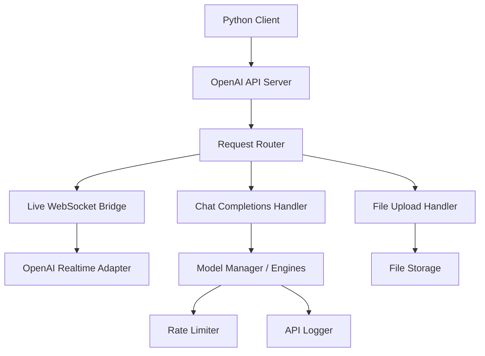
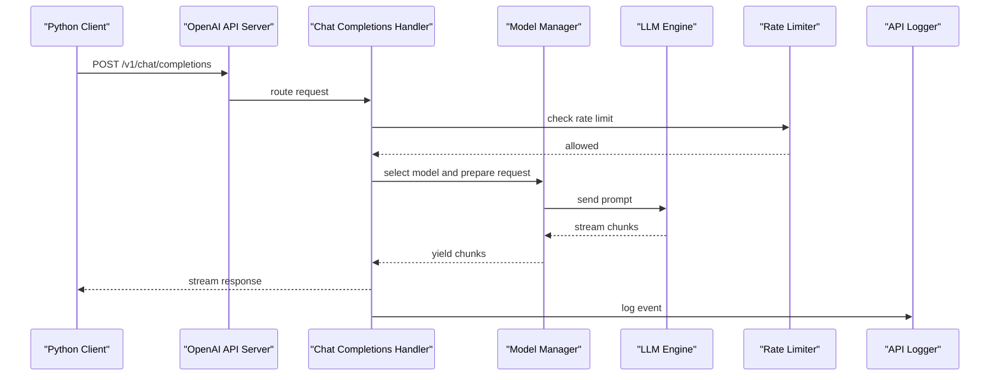
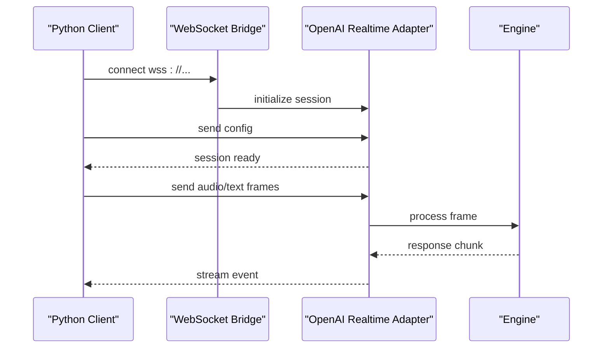
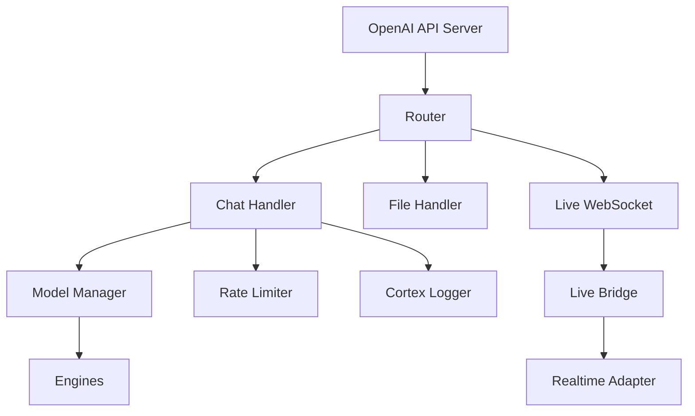

# Python Integration Examples

<cite>
**Referenced Files in This Document**
- [openai_api_server.py](file://interface/openai_api_server/openai_api_server.py)
- [guide.md](file://interface/openai_api_server/guide.md)
- [__init__.py](file://interface/openai_api_server/__init__.py)
- [live_bridge.py](file://core/external_endpoints/bridges/live_bridge.py)
- [openai_realtime.py](file://core/live_tool_adapters/openai_realtime.py)
- [genai_client_utils.py](file://core/genai_client_utils.py)
- [rate_limit.py](file://core/rate_limit.py)
- [llm_failure_log.py](file://core/llm_failure_log.py)
- [cortex_api_logger.py](file://core/cortex_api_logger.py)
- [live_api_logger.py](file://core/live_api_logger.py)
- [transport_layer.py](file://core/transport_layer.py)
- [message_queue.py](file://core/message_queue.py)
- [config.py](file://core/config.py)
- [model_manager.py](file://core/model_manager.py)
</cite>

## Table of Contents
1. [Introduction](#introduction)
2. [Project Structure](#project-structure)
3. [Core Components](#core-components)
4. [Architecture Overview](#architecture-overview)
5. [Detailed Component Analysis](#detailed-component-analysis)
6. [Dependency Analysis](#dependency-analysis)
7. [Performance Considerations](#performance-considerations)
8. [Troubleshooting Guide](#troubleshooting-guide)
9. [Conclusion](#conclusion)
10. [Appendices](#appendices)

## Introduction
This document provides comprehensive Python integration examples for Synthetic Heart’s OpenAI-compatible API. It covers chat completions, file uploads, real-time WebSocket connections, streaming responses, authentication setup, async/await patterns, connection pooling, and retry mechanisms. It also includes troubleshooting guidance and performance optimization tips to help you build robust integrations.

## Project Structure
Synthetic Heart exposes an OpenAI-compatible HTTP API via a dedicated server module. Real-time features are provided through WebSocket bridges and adapters. The following diagram shows the key components involved in typical client interactions:

**Diagram sources**
- [openai_api_server.py](file://interface/openai_api_server/openai_api_server.py)
- [live_bridge.py](file://core/external_endpoints/bridges/live_bridge.py)
- [openai_realtime.py](file://core/live_tool_adapters/openai_realtime.py)
- [model_manager.py](file://core/model_manager.py)
- [rate_limit.py](file://core/rate_limit.py)
- [cortex_api_logger.py](file://core/cortex_api_logger.py)

**Section sources**
- [openai_api_server.py](file://interface/openai_api_server/openai_api_server.py)
- [guide.md](file://interface/openai_api_server/guide.md)

## Core Components
- OpenAI API Server: Provides HTTP endpoints compatible with OpenAI clients (chat completions, files, models).
- Live WebSocket Bridge: Exposes real-time communication channels for live sessions.
- OpenAI Realtime Adapter: Bridges live sessions to the OpenAI realtime protocol.
- Model Manager: Manages model selection and routing to underlying engines.
- Rate Limiter: Enforces request rate limits to protect services.
- Logging: Centralized logging for API calls and live events.

Key responsibilities:
- Authentication and authorization at the API boundary.
- Request validation and normalization.
- Streaming response generation for chat and live sessions.
- File upload handling and storage.
- Error mapping to OpenAI-compatible error formats.

**Section sources**
- [openai_api_server.py](file://interface/openai_api_server/openai_api_server.py)
- [live_bridge.py](file://core/external_endpoints/bridges/live_bridge.py)
- [openai_realtime.py](file://core/live_tool_adapters/openai_realtime.py)
- [model_manager.py](file://core/model_manager.py)
- [rate_limit.py](file://core/rate_limit.py)
- [cortex_api_logger.py](file://core/cortex_api_logger.py)
- [live_api_logger.py](file://core/live_api_logger.py)

## Architecture Overview
The OpenAI-compatible API is implemented as an HTTP server that routes requests to handlers. Chat completions flow through the model manager to selected engines. File uploads are handled by a dedicated handler that persists files and returns references. Real-time sessions use WebSocket connections bridged to the OpenAI realtime adapter.

**Diagram sources**
- [openai_api_server.py](file://interface/openai_api_server/openai_api_server.py)
- [model_manager.py](file://core/model_manager.py)
- [rate_limit.py](file://core/rate_limit.py)
- [cortex_api_logger.py](file://core/cortex_api_logger.py)

## Detailed Component Analysis

### OpenAI API Server
Responsibilities:
- Initialize FastAPI or ASGI application.
- Mount routers for chat, files, models, and live endpoints.
- Apply middleware for authentication, logging, and rate limiting.
- Provide health checks and configuration endpoints.

Usage patterns:
- Configure base URL and API key in your Python client.
- Use standard OpenAI SDK methods against the Synthetic Heart endpoint.
- Enable streaming by setting appropriate flags.

Authentication:
- API key passed via Authorization header.
- Optional bearer token validation and per-user scoping.

Error handling:
- Maps internal errors to OpenAI error codes and messages.
- Includes request IDs for tracing.

**Section sources**
- [openai_api_server.py](file://interface/openai_api_server/openai_api_server.py)
- [guide.md](file://interface/openai_api_server/guide.md)

### Chat Completions
Flow:
- Validate messages and parameters.
- Select model via Model Manager.
- Stream tokens from the engine.
- Log usage and outcomes.

Async/await:
- Handlers are asynchronous; use async clients for best performance.
- Concurrency is managed by the server’s event loop.

Streaming:
- Use streaming mode to receive incremental tokens.
- Buffer partial content on the client side.

Retry mechanism:
- Implement exponential backoff on transient errors (network timeouts, 5xx).
- Respect rate limit headers and backoff recommendations.

Connection pooling:
- Reuse HTTP connections via the client session.
- Set pool size and timeout according to workload.

Example usage patterns:
- Synchronous call for simple prompts.
- Asynchronous call for high-throughput scenarios.
- Streaming call for real-time UI updates.

**Section sources**
- [openai_api_server.py](file://interface/openai_api_server/openai_api_server.py)
- [model_manager.py](file://core/model_manager.py)
- [rate_limit.py](file://core/rate_limit.py)
- [cortex_api_logger.py](file://core/cortex_api_logger.py)

### File Uploads
Capabilities:
- Accept multipart form data for text and binary files.
- Validate file types and sizes.
- Persist files and return stable identifiers.

Multipart uploads:
- Use multipart encoding for multiple files in one request.
- Stream large files to avoid memory spikes.

Error handling:
- Return clear error messages for invalid types or sizes.
- Include request IDs for support.

Best practices:
- Chunk uploads for very large files.
- Verify checksums if required by downstream processing.

**Section sources**
- [openai_api_server.py](file://interface/openai_api_server/openai_api_server.py)

### Real-Time WebSocket Connections
Overview:
- Establish a WebSocket connection to the live endpoint.
- Exchange events following the OpenAI realtime protocol.
- Manage session lifecycle and reconnection.

Sequence:
- Connect to WebSocket endpoint.
- Authenticate using token or API key.
- Send initial session config.
- Receive and process audio/text events.
- Handle disconnects and reconnects.

**Diagram sources**
- [live_bridge.py](file://core/external_endpoints/bridges/live_bridge.py)
- [openai_realtime.py](file://core/live_tool_adapters/openai_realtime.py)

**Section sources**
- [live_bridge.py](file://core/external_endpoints/bridges/live_bridge.py)
- [openai_realtime.py](file://core/live_tool_adapters/openai_realtime.py)
- [live_api_logger.py](file://core/live_api_logger.py)

### Authentication Setup
Methods:
- API key in Authorization header.
- Optional bearer token with scopes.
- Per-endpoint access control.

Configuration:
- Set environment variables for keys and endpoints.
- Use secure storage for secrets.

Validation:
- Reject unauthorized requests early.
- Log failed attempts for security monitoring.

**Section sources**
- [openai_api_server.py](file://interface/openai_api_server/openai_api_server.py)
- [guide.md](file://interface/openai_api_server/guide.md)

### Async/Await Implementation
Guidelines:
- Prefer async clients for all I/O-bound operations.
- Use asyncio.gather for parallel requests where safe.
- Avoid blocking calls inside async handlers.

Patterns:
- Wrap synchronous libraries with run_in_executor when necessary.
- Use context managers for resource cleanup.

**Section sources**
- [openai_api_server.py](file://interface/openai_api_server/openai_api_server.py)

### Connection Pooling
Recommendations:
- Configure pool size based on concurrency needs.
- Tune keep-alive timeouts to match upstream behavior.
- Monitor pool utilization and adjust accordingly.

Implementation:
- Use a single persistent client session across requests.
- Set max retries and backoff strategies.

**Section sources**
- [genai_client_utils.py](file://core/genai_client_utils.py)
- [transport_layer.py](file://core/transport_layer.py)

### Retry Mechanisms
Strategies:
- Exponential backoff with jitter.
- Retry only on idempotent operations.
- Respect server-provided retry-after headers.

Failure logging:
- Record failures with context for debugging.
- Aggregate metrics for alerting.

**Section sources**
- [rate_limit.py](file://core/rate_limit.py)
- [llm_failure_log.py](file://core/llm_failure_log.py)

## Dependency Analysis
The OpenAI API server depends on several core modules for routing, model management, rate limiting, and logging. The following diagram illustrates these relationships:

**Diagram sources**
- [openai_api_server.py](file://interface/openai_api_server/openai_api_server.py)
- [model_manager.py](file://core/model_manager.py)
- [rate_limit.py](file://core/rate_limit.py)
- [cortex_api_logger.py](file://core/cortex_api_logger.py)
- [live_bridge.py](file://core/external_endpoints/bridges/live_bridge.py)
- [openai_realtime.py](file://core/live_tool_adapters/openai_realtime.py)

**Section sources**
- [openai_api_server.py](file://interface/openai_api_server/openai_api_server.py)
- [model_manager.py](file://core/model_manager.py)
- [rate_limit.py](file://core/rate_limit.py)
- [cortex_api_logger.py](file://core/cortex_api_logger.py)
- [live_bridge.py](file://core/external_endpoints/bridges/live_bridge.py)
- [openai_realtime.py](file://core/live_tool_adapters/openai_realtime.py)

## Performance Considerations
- Use async clients and enable streaming to reduce latency.
- Reuse HTTP connections and configure pool sizes appropriately.
- Batch small requests when possible to reduce overhead.
- Monitor rate limits and implement backoff to avoid throttling.
- Profile CPU-intensive tasks and offload to background workers.
- Cache frequently used model configurations and prompts.

[No sources needed since this section provides general guidance]

## Troubleshooting Guide
Common issues:
- Authentication failures: verify API key format and permissions.
- Rate limit errors: implement backoff and reduce request frequency.
- Timeouts: increase timeouts or optimize payload size.
- Streaming interruptions: handle reconnect logic and resume state.

Debugging techniques:
- Enable detailed logging for requests and responses.
- Capture request IDs for end-to-end tracing.
- Inspect WebSocket frames for protocol mismatches.
- Use health check endpoints to validate service status.

Performance tuning:
- Adjust connection pool settings.
- Reduce payload sizes and enable compression.
- Use efficient serialization formats.

**Section sources**
- [llm_failure_log.py](file://core/llm_failure_log.py)
- [cortex_api_logger.py](file://core/cortex_api_logger.py)
- [live_api_logger.py](file://core/live_api_logger.py)
- [rate_limit.py](file://core/rate_limit.py)
- [transport_layer.py](file://core/transport_layer.py)

## Conclusion
Synthetic Heart’s OpenAI-compatible API provides a robust foundation for building Python integrations. By following the patterns outlined here—async/await, streaming, connection pooling, and resilient retries—you can create high-performance, reliable applications. Use the troubleshooting guide to diagnose issues quickly and optimize for your specific workload.

[No sources needed since this section summarizes without analyzing specific files]

## Appendices

### Example Usage Patterns
- Chat completions:
  - Synchronous call with basic prompt.
  - Asynchronous call with streaming tokens.
  - Multi-turn conversation with message history.

- File uploads:
  - Single file upload with validation.
  - Multipart upload with multiple files.
  - Large file streaming with progress callbacks.

- Real-time sessions:
  - WebSocket connection with authentication.
  - Sending and receiving audio/text frames.
  - Handling disconnects and reconnections.

[No sources needed since this section provides general guidance]