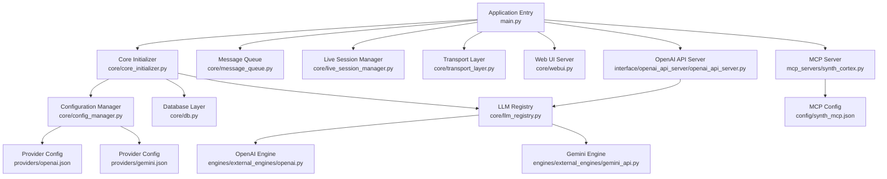
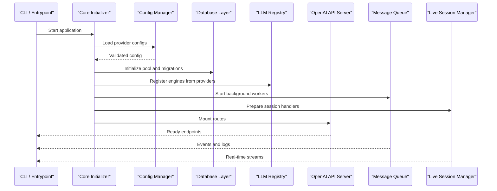
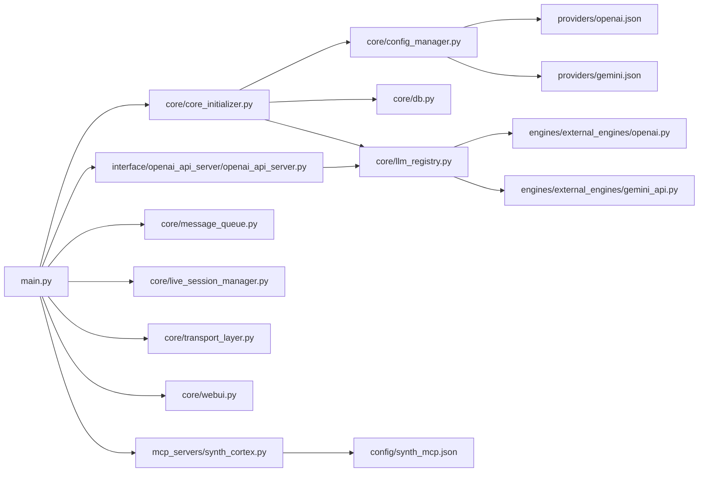

# SDK and Library Usage Patterns

<cite>
**Referenced Files in This Document**
- [main.py](file://main.py)
- [core/config_manager.py](file://core/config_manager.py)
- [core/core_initializer.py](file://core/core_initializer.py)
- [core/db.py](file://core/db.py)
- [core/llm_registry.py](file://core/llm_registry.py)
- [engines/external_engines/openai.py](file://engines/external_engines/openai.py)
- [engines/external_engines/gemini_api.py](file://engines/external_engines/gemini_api.py)
- [interface/openai_api_server/openai_api_server.py](file://interface/openai_api_server/openai_api_server.py)
- [core/message_queue.py](file://core/message_queue.py)
- [core/live_session_manager.py](file://core/live_session_manager.py)
- [plugins/grillo/grillo_llm_failure_recovery/grillo_llm_failure_recovery.py](file://plugins/grillo/grillo_llm_failure_recovery/grillo_llm_failure_recovery.py)
- [core/rate_limit.py](file://core/rate_limit.py)
- [core/logging_utils.py](file://core/logging_utils.py)
- [core/transport_layer.py](file://core/transport_layer.py)
- [core/webui.py](file://core/webui.py)
- [providers/openai.json](file://providers/openai.json)
- [providers/gemini.json](file://providers/gemini.json)
- [config/synth_mcp.json](file://config/synth_mcp.json)
- [mcp_servers/synth_cortex.py](file://mcp_servers/synth_cortex.py)
</cite>

## Table of Contents
1. [Introduction](#introduction)
2. [Project Structure](#project-structure)
3. [Core Components](#core-components)
4. [Architecture Overview](#architecture-overview)
5. [Detailed Component Analysis](#detailed-component-analysis)
6. [Dependency Analysis](#dependency-analysis)
7. [Performance Considerations](#performance-considerations)
8. [Troubleshooting Guide](#troubleshooting-guide)
9. [Conclusion](#conclusion)
10. [Appendices](#appendices)

## Introduction
This document explains how to use Synthetic Heart’s SDK and library patterns for building integrations, configuring services, and managing runtime behavior. It covers official and community-maintained libraries, installation and initialization patterns, configuration management, connection pooling, authentication handling, error recovery, streaming and batch processing, and custom middleware implementation. Guidance is provided for selecting appropriate libraries per use case, performance considerations, and migration strategies between versions.

## Project Structure
Synthetic Heart organizes functionality into core modules, engines, interfaces, plugins, MCP servers, and providers:
- Core: initialization, configuration, database, messaging, transport, and registry layers
- Engines: external LLM integrations (OpenAI, Gemini, etc.)
- Interfaces: OpenAI-compatible API server and other channel adapters
- Plugins: feature extensions (e.g., Grillo memory and failure recovery)
- MCP Servers: tooling and observability endpoints
- Providers: JSON-based provider configurations

**Diagram sources**
- [main.py](file://main.py)
- [core/core_initializer.py](file://core/core_initializer.py)
- [core/config_manager.py](file://core/config_manager.py)
- [core/db.py](file://core/db.py)
- [core/llm_registry.py](file://core/llm_registry.py)
- [engines/external_engines/openai.py](file://engines/external_engines/openai.py)
- [engines/external_engines/gemini_api.py](file://engines/external_engines/gemini_api.py)
- [interface/openai_api_server/openai_api_server.py](file://interface/openai_api_server/openai_api_server.py)
- [core/message_queue.py](file://core/message_queue.py)
- [core/live_session_manager.py](file://core/live_session_manager.py)
- [core/transport_layer.py](file://core/transport_layer.py)
- [core/webui.py](file://core/webui.py)
- [providers/openai.json](file://providers/openai.json)
- [providers/gemini.json](file://providers/gemini.json)
- [mcp_servers/synth_cortex.py](file://mcp_servers/synth_cortex.py)
- [config/synth_mcp.json](file://config/synth_mcp.json)

**Section sources**
- [main.py](file://main.py)
- [core/core_initializer.py](file://core/core_initializer.py)
- [core/config_manager.py](file://core/config_manager.py)
- [core/db.py](file://core/db.py)
- [core/llm_registry.py](file://core/llm_registry.py)
- [interface/openai_api_server/openai_api_server.py](file://interface/openai_api_server/openai_api_server.py)
- [core/message_queue.py](file://core/message_queue.py)
- [core/live_session_manager.py](file://core/live_session_manager.py)
- [core/transport_layer.py](file://core/transport_layer.py)
- [core/webui.py](file://core/webui.py)
- [providers/openai.json](file://providers/openai.json)
- [providers/gemini.json](file://providers/gemini.json)
- [mcp_servers/synth_cortex.py](file://mcp_servers/synth_cortex.py)
- [config/synth_mcp.json](file://config/synth_mcp.json)

## Core Components
- Configuration Management: Centralized loading and validation of provider and runtime settings via the configuration manager.
- Database Layer: Connection pooling and lifecycle management for persistent storage.
- LLM Registry: Dynamic registration and selection of external engine implementations.
- Message Queue: Asynchronous message routing and prioritization across subsystems.
- Live Session Manager: Coordination of real-time sessions and streaming interactions.
- Transport Layer: Abstraction over network protocols for reliable communication.
- Web UI Server: HTTP serving for the web interface and control plane.
- OpenAI API Server: Compatibility layer exposing an OpenAI-like interface.

Key responsibilities and integration points are defined by these components and their registries.

**Section sources**
- [core/config_manager.py](file://core/config_manager.py)
- [core/db.py](file://core/db.py)
- [core/llm_registry.py](file://core/llm_registry.py)
- [core/message_queue.py](file://core/message_queue.py)
- [core/live_session_manager.py](file://core/live_session_manager.py)
- [core/transport_layer.py](file://core/transport_layer.py)
- [core/webui.py](file://core/webui.py)
- [interface/openai_api_server/openai_api_server.py](file://interface/openai_api_server/openai_api_server.py)

## Architecture Overview
The application initializes core services, loads provider configurations, registers LLM engines, and exposes APIs through both the Web UI and OpenAI-compatible server. Messaging and live sessions enable asynchronous and real-time workflows. MCP servers provide additional tooling and observability.

**Diagram sources**
- [main.py](file://main.py)
- [core/core_initializer.py](file://core/core_initializer.py)
- [core/config_manager.py](file://core/config_manager.py)
- [core/db.py](file://core/db.py)
- [core/llm_registry.py](file://core/llm_registry.py)
- [interface/openai_api_server/openai_api_server.py](file://interface/openai_api_server/openai_api_server.py)
- [core/message_queue.py](file://core/message_queue.py)
- [core/live_session_manager.py](file://core/live_session_manager.py)

## Detailed Component Analysis

### Configuration Management
- Provider files define credentials, endpoints, and model parameters.
- The configuration manager validates and merges environment overrides with file-based settings.
- Use provider-specific JSON files under providers/ for each engine.

Best practices:
- Keep secrets out of version control; prefer environment variables or secret managers.
- Validate configuration at startup to fail fast on misconfiguration.
- Centralize defaults and document required keys per provider.

**Section sources**
- [core/config_manager.py](file://core/config_manager.py)
- [providers/openai.json](file://providers/openai.json)
- [providers/gemini.json](file://providers/gemini.json)

### Database Connection Pooling
- The database layer manages connection pools, health checks, and migrations.
- Pools should be sized according to concurrency and workload characteristics.
- Prefer read replicas or separate databases for heavy write vs. read workloads.

Operational guidance:
- Monitor pool utilization and adjust max connections based on observed saturation.
- Implement graceful shutdown to drain active transactions before closing pools.
- Use connection timeouts and retry policies to avoid cascading failures.

**Section sources**
- [core/db.py](file://core/db.py)

### LLM Registry and Engine Selection
- Engines are registered dynamically based on provider configurations.
- The registry supports multiple backends and runtime switching.
- Select engines based on latency, cost, and capability requirements.

Selection criteria:
- Latency-sensitive tasks: choose engines with faster cold starts and optimized inference paths.
- Cost-sensitive tasks: prefer cheaper models or caching strategies where applicable.
- Capability needs: multimodal support, function calling, structured outputs.

**Section sources**
- [core/llm_registry.py](file://core/llm_registry.py)
- [engines/external_engines/openai.py](file://engines/external_engines/openai.py)
- [engines/external_engines/gemini_api.py](file://engines/external_engines/gemini_api.py)

### Authentication Handling
- Authentication is typically handled at the API boundary and propagated to downstream services.
- For OpenAI compatibility, tokens are passed via headers or configuration.
- Ensure token rotation and least-privilege scopes for external services.

Security recommendations:
- Validate and rotate tokens regularly.
- Avoid logging sensitive values.
- Use short-lived tokens where possible.

**Section sources**
- [interface/openai_api_server/openai_api_server.py](file://interface/openai_api_server/openai_api_server.py)
- [providers/openai.json](file://providers/openai.json)

### Error Recovery and Resilience
- Rate limiting prevents overload and respects provider quotas.
- Failure recovery plugins implement retries, fallbacks, and circuit breaking.
- Logging utilities capture context for debugging and observability.

Resilience patterns:
- Exponential backoff with jitter for transient errors.
- Circuit breaker to fail fast when downstream services are unhealthy.
- Fallback engines or cached responses for degraded modes.

**Section sources**
- [core/rate_limit.py](file://core/rate_limit.py)
- [plugins/grillo/grillo_llm_failure_recovery/grillo_llm_failure_recovery.py](file://plugins/grillo/grillo_llm_failure_recovery/grillo_llm_failure_recovery.py)
- [core/logging_utils.py](file://core/logging_utils.py)

### Streaming and Batch Processing
- Live sessions manage streaming interactions and real-time updates.
- Message queue enables asynchronous batch processing and event-driven workflows.
- Transport layer abstracts protocol details for consistent streaming semantics.

Implementation tips:
- Use backpressure-aware queues to prevent memory growth.
- Chunk large payloads and stream incremental results.
- Monitor throughput and latency metrics for tuning.

**Section sources**
- [core/live_session_manager.py](file://core/live_session_manager.py)
- [core/message_queue.py](file://core/message_queue.py)
- [core/transport_layer.py](file://core/transport_layer.py)

### Custom Middleware Implementation
- Middleware can intercept requests, modify payloads, and enforce policies.
- Place middleware near the API boundary for maximum effect.
- Ensure idempotency and proper error propagation.

Guidelines:
- Keep middleware stateless where possible.
- Log request/response metadata without sensitive data.
- Test middleware thoroughly for edge cases and timeouts.

**Section sources**
- [interface/openai_api_server/openai_api_server.py](file://interface/openai_api_server/openai_api_server.py)
- [core/webui.py](file://core/webui.py)

### MCP Integration
- MCP servers expose tools and observability endpoints for external systems.
- Configuration is managed via dedicated JSON files.
- Integrate MCP clients to call tools and monitor system state.

Usage pattern:
- Define tool schemas and handlers in MCP server modules.
- Configure client connections and authentication in MCP config.
- Use standardized response formats for interoperability.

**Section sources**
- [mcp_servers/synth_cortex.py](file://mcp_servers/synth_cortex.py)
- [config/synth_mcp.json](file://config/synth_mcp.json)

## Dependency Analysis
The following diagram shows key dependencies among core components and external engines.

**Diagram sources**
- [main.py](file://main.py)
- [core/core_initializer.py](file://core/core_initializer.py)
- [core/config_manager.py](file://core/config_manager.py)
- [core/db.py](file://core/db.py)
- [core/llm_registry.py](file://core/llm_registry.py)
- [engines/external_engines/openai.py](file://engines/external_engines/openai.py)
- [engines/external_engines/gemini_api.py](file://engines/external_engines/gemini_api.py)
- [interface/openai_api_server/openai_api_server.py](file://interface/openai_api_server/openai_api_server.py)
- [core/message_queue.py](file://core/message_queue.py)
- [core/live_session_manager.py](file://core/live_session_manager.py)
- [core/transport_layer.py](file://core/transport_layer.py)
- [core/webui.py](file://core/webui.py)
- [providers/openai.json](file://providers/openai.json)
- [providers/gemini.json](file://providers/gemini.json)
- [mcp_servers/synth_cortex.py](file://mcp_servers/synth_cortex.py)
- [config/synth_mcp.json](file://config/synth_mcp.json)

**Section sources**
- [main.py](file://main.py)
- [core/core_initializer.py](file://core/core_initializer.py)
- [core/config_manager.py](file://core/config_manager.py)
- [core/db.py](file://core/db.py)
- [core/llm_registry.py](file://core/llm_registry.py)
- [interface/openai_api_server/openai_api_server.py](file://interface/openai_api_server/openai_api_server.py)
- [core/message_queue.py](file://core/message_queue.py)
- [core/live_session_manager.py](file://core/live_session_manager.py)
- [core/transport_layer.py](file://core/transport_layer.py)
- [core/webui.py](file://core/webui.py)
- [providers/openai.json](file://providers/openai.json)
- [providers/gemini.json](file://providers/gemini.json)
- [mcp_servers/synth_cortex.py](file://mcp_servers/synth_cortex.py)
- [config/synth_mcp.json](file://config/synth_mcp.json)

## Performance Considerations
- Connection Pool Sizing: Tune pool sizes based on concurrent requests and database capacity.
- Rate Limiting: Apply per-provider limits to avoid throttling and ensure fair usage.
- Streaming Efficiency: Use chunked transfers and minimize payload sizes.
- Caching: Cache frequent queries and responses where appropriate.
- Backpressure: Implement queue limits and drop policies to protect memory.
- Observability: Track latency, throughput, and error rates to identify bottlenecks.

[No sources needed since this section provides general guidance]

## Troubleshooting Guide
Common issues and resolutions:
- Configuration Errors: Validate provider JSON and environment variables at startup.
- Database Connectivity: Check pool exhaustion, timeouts, and migration status.
- LLM Failures: Inspect rate limits, token validity, and fallback mechanisms.
- Streaming Drops: Verify transport reliability and backpressure handling.
- MCP Tool Calls: Confirm schema definitions and client authentication.

Debugging steps:
- Enable detailed logging and capture request contexts.
- Use health check endpoints to verify service readiness.
- Review error logs and metrics for anomalies.

**Section sources**
- [core/logging_utils.py](file://core/logging_utils.py)
- [core/rate_limit.py](file://core/rate_limit.py)
- [plugins/grillo/grillo_llm_failure_recovery/grillo_llm_failure_recovery.py](file://plugins/grillo/grillo_llm_failure_recovery/grillo_llm_failure_recovery.py)

## Conclusion
Synthetic Heart’s SDK and library patterns provide a robust foundation for building scalable, resilient integrations. By leveraging configuration management, connection pooling, authentication handling, error recovery, streaming, and MCP integration, developers can tailor solutions to diverse use cases. Adhering to best practices ensures performance, security, and maintainability across versions and deployments.

[No sources needed since this section summarizes without analyzing specific files]

## Appendices

### Installation and Initialization Patterns
- Install dependencies using standard package managers.
- Initialize core services via the core initializer.
- Load provider configurations and register engines.
- Start background workers and mount API routes.

**Section sources**
- [main.py](file://main.py)
- [core/core_initializer.py](file://core/core_initializer.py)
- [core/config_manager.py](file://core/config_manager.py)
- [core/llm_registry.py](file://core/llm_registry.py)

### Migration Strategies Between Versions
- Backup configuration and database state before upgrades.
- Validate new provider schemas and update JSON files accordingly.
- Test engine registrations and API endpoints post-migration.
- Rollback plan: retain previous binaries and configurations until stability is confirmed.

**Section sources**
- [providers/openai.json](file://providers/openai.json)
- [providers/gemini.json](file://providers/gemini.json)
- [core/config_manager.py](file://core/config_manager.py)