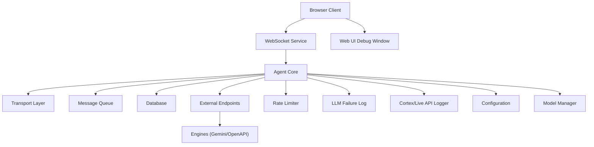
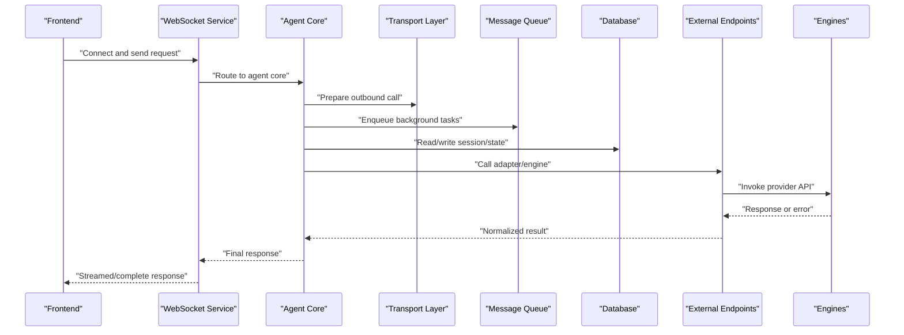
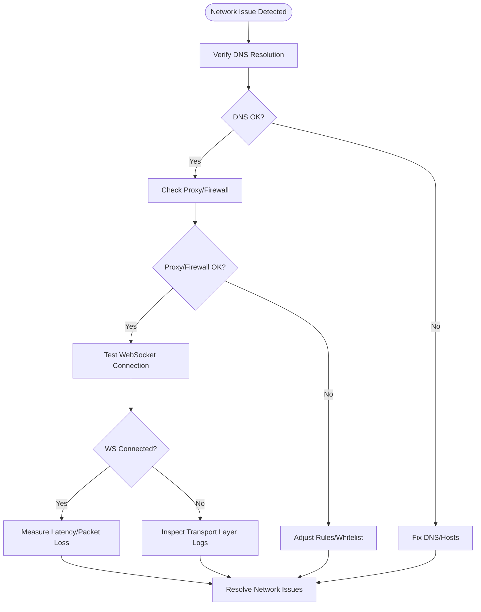
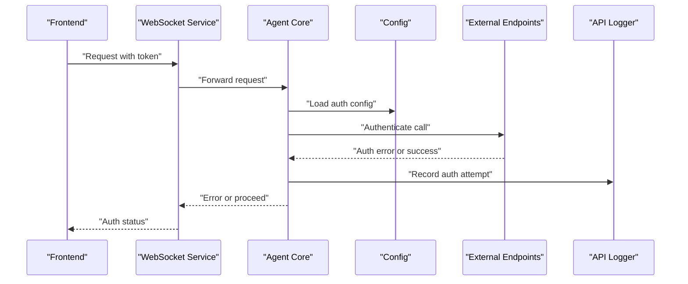
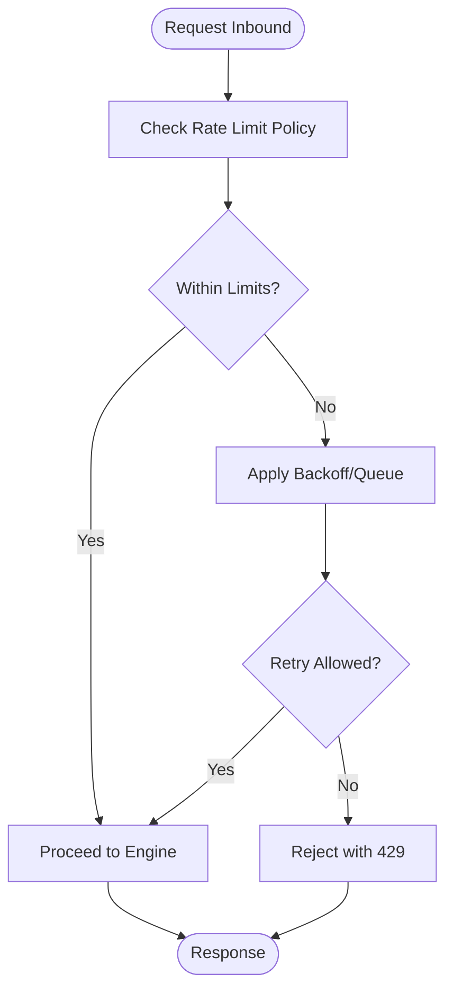
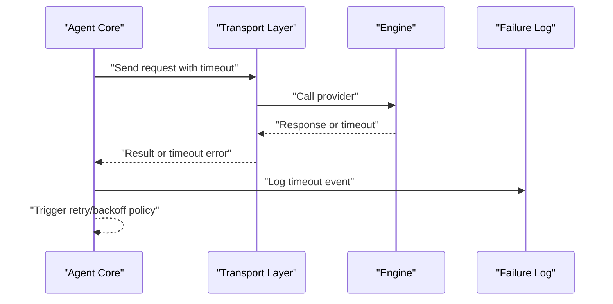
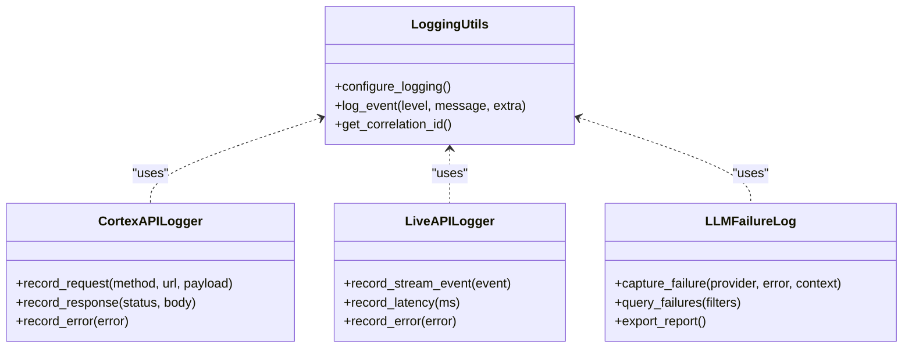
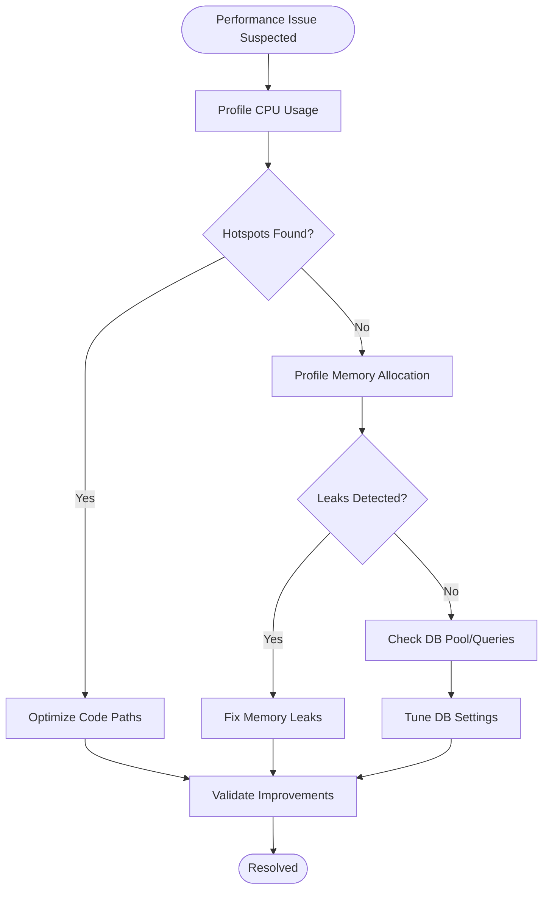
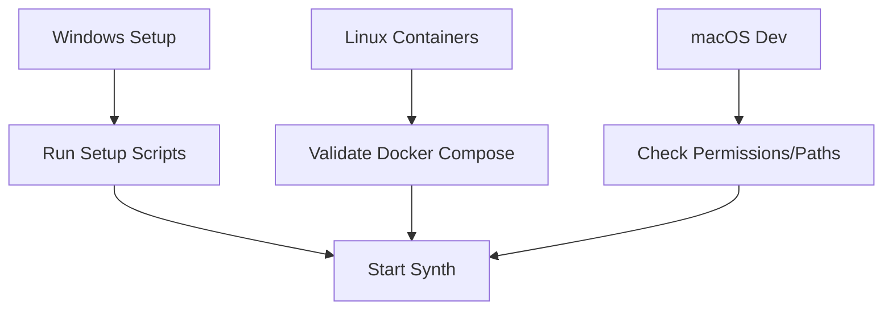
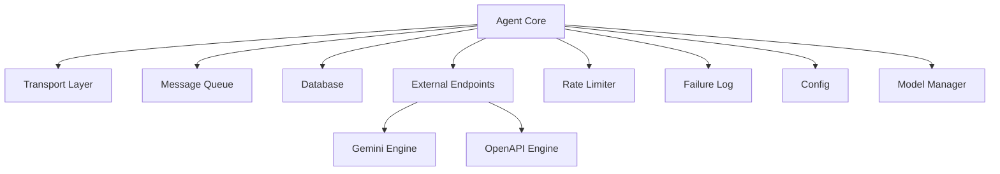

# Troubleshooting and Debugging Guide

<cite>
**Referenced Files in This Document**
- [main.py](file://main.py)
- [core/logging_utils.py](file://core/logging_utils.py)
- [core/config.py](file://core/config.py)
- [core/rate_limit.py](file://core/rate_limit.py)
- [core/llm_failure_log.py](file://core/llm_failure_log.py)
- [core/cortex_api_logger.py](file://core/cortex_api_logger.py)
- [core/live_api_logger.py](file://core/live_api_logger.py)
- [core/webui.py](file://core/webui.py)
- [core/transport_layer.py](file://core/transport_layer.py)
- [core/message_queue.py](file://core/message_queue.py)
- [core/session_meta.py](file://core/session_meta.py)
- [core/model_manager.py](file://core/model_manager.py)
- [core/db.py](file://core/db.py)
- [core/vessel_session_manager.py](file://core/vessel_session_manager.py)
- [core/agent_core.py](file://core/agent_core.py)
- [core/external_endpoints/probe.py](file://core/external_endpoints/probe.py)
- [core/external_endpoints/models.py](file://core/external_endpoints/models.py)
- [core/external_endpoints/registry.py](file://core/external_endpoints/registry.py)
- [engines/external_engines/gemini_api.py](file://engines/external_engines/gemini_api.py)
- [engines/external_engines/openapi.py](file://engines/external_engines/openapi.py)
- [interface/openai_api_server/openai_api_server.py](file://interface/openai_api_server/openai_api_server.py)
- [frontend/src/services/synth-ws.ts](file://frontend/src/services/synth-ws.ts)
- [frontend/src/stores/connection.ts](file://frontend/src/stores/connection.ts)
- [res/synth_webui/js/debug-window.mjs](file://res/synth_webui/js/debug-window.mjs)
- [automation_tools/container_synth.sh](file://automation_tools/container_synth.sh)
- [scripts/run_webui.py](file://scripts/run_webui.py)
- [docker-compose.yml](file://docker-compose.yml)
- [Dockerfile](file://Dockerfile)
</cite>

## Table of Contents
1. [Introduction](#introduction)
2. [Project Structure](#project-structure)
3. [Core Components](#core-components)
4. [Architecture Overview](#architecture-overview)
5. [Detailed Component Analysis](#detailed-component-analysis)
6. [Dependency Analysis](#dependency-analysis)
7. [Performance Considerations](#performance-considerations)
8. [Troubleshooting Guide](#troubleshooting-guide)
9. [Conclusion](#conclusion)
10. [Appendices](#appendices)

## Introduction
This guide provides a comprehensive troubleshooting and debugging reference for Synthetic Heart client integrations. It focuses on diagnosing network issues, authentication failures, rate limiting, timeouts, log analysis, performance profiling, memory leak detection, platform-specific problems, and automated testing strategies. The content is organized to help both new and experienced users quickly identify root causes and apply effective resolutions.

## Project Structure
Synthetic Heart integrates a Python backend with a web-based frontend. Key areas relevant to troubleshooting include:
- Backend core modules for logging, configuration, rate limiting, failure logging, API logging, transport layer, message queue, session metadata, model management, database access, and agent orchestration.
- External endpoint adapters and engines that communicate with third-party services (e.g., Gemini, OpenAPI-compatible APIs).
- Frontend WebSocket client and connection store for real-time communication.
- Web UI debug window for live diagnostics.
- Containerization and deployment scripts for consistent environments.

**Diagram sources**
- [core/agent_core.py](file://core/agent_core.py)
- [core/transport_layer.py](file://core/transport_layer.py)
- [core/message_queue.py](file://core/message_queue.py)
- [core/db.py](file://core/db.py)
- [core/external_endpoints/registry.py](file://core/external_endpoints/registry.py)
- [engines/external_engines/gemini_api.py](file://engines/external_engines/gemini_api.py)
- [engines/external_engines/openapi.py](file://engines/external_engines/openapi.py)
- [core/rate_limit.py](file://core/rate_limit.py)
- [core/llm_failure_log.py](file://core/llm_failure_log.py)
- [core/cortex_api_logger.py](file://core/cortex_api_logger.py)
- [core/live_api_logger.py](file://core/live_api_logger.py)
- [core/config.py](file://core/config.py)
- [core/model_manager.py](file://core/model_manager.py)
- [frontend/src/services/synth-ws.ts](file://frontend/src/services/synth-ws.ts)
- [res/synth_webui/js/debug-window.mjs](file://res/synth_webui/js/debug-window.mjs)

**Section sources**
- [main.py](file://main.py)
- [core/webui.py](file://core/webui.py)
- [docker-compose.yml](file://docker-compose.yml)
- [Dockerfile](file://Dockerfile)

## Core Components
- Logging utilities centralize structured logs and formatting for consistent diagnostics across components.
- Configuration module manages runtime settings, environment variables, and feature toggles affecting behavior and error handling.
- Rate limiter enforces throttling policies to prevent overuse and handle provider limits gracefully.
- LLM failure logger captures and persists errors from external AI services for post-mortem analysis.
- API loggers record Cortex and Live API interactions for end-to-end tracing.
- Transport layer abstracts network protocols and handles reconnection logic.
- Message queue coordinates asynchronous processing and backpressure.
- Session metadata tracks per-session state and context for targeted debugging.
- Model manager handles model selection, caching, and lifecycle events.
- Database access module manages connections, migrations, and query execution.
- Agent core orchestrates request flows, tool calls, and integration points.

**Section sources**
- [core/logging_utils.py](file://core/logging_utils.py)
- [core/config.py](file://core/config.py)
- [core/rate_limit.py](file://core/rate_limit.py)
- [core/llm_failure_log.py](file://core/llm_failure_log.py)
- [core/cortex_api_logger.py](file://core/cortex_api_logger.py)
- [core/live_api_logger.py](file://core/live_api_logger.py)
- [core/transport_layer.py](file://core/transport_layer.py)
- [core/message_queue.py](file://core/message_queue.py)
- [core/session_meta.py](file://core/session_meta.py)
- [core/model_manager.py](file://core/model_manager.py)
- [core/db.py](file://core/db.py)
- [core/agent_core.py](file://core/agent_core.py)

## Architecture Overview
The system follows a layered architecture where the frontend communicates via WebSocket to the backend’s agent core. The agent core delegates to the transport layer for networking, uses the message queue for async tasks, interacts with the database for persistence, and calls external endpoints through registered adapters and engines. Rate limiting and failure logging are integrated at appropriate layers to ensure resilience and observability.

**Diagram sources**
- [core/agent_core.py](file://core/agent_core.py)
- [core/transport_layer.py](file://core/transport_layer.py)
- [core/message_queue.py](file://core/message_queue.py)
- [core/db.py](file://core/db.py)
- [core/external_endpoints/registry.py](file://core/external_endpoints/registry.py)
- [engines/external_engines/gemini_api.py](file://engines/external_engines/gemini_api.py)
- [engines/external_engines/openapi.py](file://engines/external_engines/openapi.py)
- [frontend/src/services/synth-ws.ts](file://frontend/src/services/synth-ws.ts)

## Detailed Component Analysis

### Network and Transport Troubleshooting
- Use the transport layer to inspect connection states, retries, and protocol-level errors.
- Validate WebSocket connectivity from the frontend using the synth-ws service and connection store.
- Check proxy/firewall rules and DNS resolution if requests fail early.
- Monitor latency spikes and packet loss with network tools; correlate with backend logs.

**Diagram sources**
- [core/transport_layer.py](file://core/transport_layer.py)
- [frontend/src/services/synth-ws.ts](file://frontend/src/services/synth-ws.ts)
- [frontend/src/stores/connection.ts](file://frontend/src/stores/connection.ts)

**Section sources**
- [core/transport_layer.py](file://core/transport_layer.py)
- [frontend/src/services/synth-ws.ts](file://frontend/src/services/synth-ws.ts)
- [frontend/src/stores/connection.ts](file://frontend/src/stores/connection.ts)

### Authentication Failures
- Verify credentials and tokens configured in the configuration module.
- Inspect API keys, scopes, and expiration dates for external providers.
- Use the API loggers to capture auth handshake details and error responses.
- Confirm environment variable injection in containerized deployments.

**Diagram sources**
- [core/config.py](file://core/config.py)
- [core/cortex_api_logger.py](file://core/cortex_api_logger.py)
- [core/live_api_logger.py](file://core/live_api_logger.py)
- [core/external_endpoints/registry.py](file://core/external_endpoints/registry.py)

**Section sources**
- [core/config.py](file://core/config.py)
- [core/cortex_api_logger.py](file://core/cortex_api_logger.py)
- [core/live_api_logger.py](file://core/live_api_logger.py)
- [core/external_endpoints/registry.py](file://core/external_endpoints/registry.py)

### Rate Limiting and Throttling
- Review rate limit policies and adjust thresholds based on provider constraints.
- Observe retry/backoff behavior and queue saturation under load.
- Correlate 429 responses with rate limiter logs and upstream provider limits.

**Diagram sources**
- [core/rate_limit.py](file://core/rate_limit.py)
- [core/message_queue.py](file://core/message_queue.py)

**Section sources**
- [core/rate_limit.py](file://core/rate_limit.py)
- [core/message_queue.py](file://core/message_queue.py)

### Timeout Handling
- Configure appropriate timeouts for HTTP/WebSocket calls and engine invocations.
- Implement retry strategies with exponential backoff and jitter.
- Monitor timeout occurrences and correlate with network conditions and provider latency.

**Diagram sources**
- [core/agent_core.py](file://core/agent_core.py)
- [core/transport_layer.py](file://core/transport_layer.py)
- [core/llm_failure_log.py](file://core/llm_failure_log.py)

**Section sources**
- [core/agent_core.py](file://core/agent_core.py)
- [core/transport_layer.py](file://core/transport_layer.py)
- [core/llm_failure_log.py](file://core/llm_failure_log.py)

### Log Analysis and Observability
- Use structured logging to filter by component, severity, and correlation IDs.
- Leverage API loggers for end-to-end tracing across Cortex and Live APIs.
- Archive logs periodically and analyze patterns for recurring issues.

**Diagram sources**
- [core/logging_utils.py](file://core/logging_utils.py)
- [core/cortex_api_logger.py](file://core/cortex_api_logger.py)
- [core/live_api_logger.py](file://core/live_api_logger.py)
- [core/llm_failure_log.py](file://core/llm_failure_log.py)

**Section sources**
- [core/logging_utils.py](file://core/logging_utils.py)
- [core/cortex_api_logger.py](file://core/cortex_api_logger.py)
- [core/live_api_logger.py](file://core/live_api_logger.py)
- [core/llm_failure_log.py](file://core/llm_failure_log.py)

### Performance Profiling and Memory Leak Detection
- Profile CPU and memory usage during high-load scenarios to identify bottlenecks.
- Use heap snapshots and allocation tracking to detect leaks in long-running sessions.
- Monitor database connection pools and query performance to avoid contention.

[No sources needed since this diagram shows conceptual workflow, not actual code structure]

**Section sources**
- [core/model_manager.py](file://core/model_manager.py)
- [core/db.py](file://core/db.py)
- [core/session_meta.py](file://core/session_meta.py)

### Platform-Specific Issues
- Windows: Ensure script paths and environment variables are correctly set; use provided setup scripts.
- Linux containers: Validate Docker images, service definitions, and s6-services configurations.
- macOS: Check file permissions and path separators when running local development.

**Diagram sources**
- [scripts/run_webui.py](file://scripts/run_webui.py)
- [automation_tools/container_synth.sh](file://automation_tools/container_synth.sh)
- [docker-compose.yml](file://docker-compose.yml)
- [Dockerfile](file://Dockerfile)

**Section sources**
- [scripts/run_webui.py](file://scripts/run_webui.py)
- [automation_tools/container_synth.sh](file://automation_tools/container_synth.sh)
- [docker-compose.yml](file://docker-compose.yml)
- [Dockerfile](file://Dockerfile)

## Dependency Analysis
Key dependencies include:
- External engines for AI providers (Gemini, OpenAPI-compatible services).
- Database backends for persistence and session state.
- WebSocket transport for real-time communication.
- Configuration and logging subsystems for runtime control and observability.

**Diagram sources**
- [core/agent_core.py](file://core/agent_core.py)
- [core/transport_layer.py](file://core/transport_layer.py)
- [core/message_queue.py](file://core/message_queue.py)
- [core/db.py](file://core/db.py)
- [core/external_endpoints/registry.py](file://core/external_endpoints/registry.py)
- [engines/external_engines/gemini_api.py](file://engines/external_engines/gemini_api.py)
- [engines/external_engines/openapi.py](file://engines/external_engines/openapi.py)
- [core/rate_limit.py](file://core/rate_limit.py)
- [core/llm_failure_log.py](file://core/llm_failure_log.py)
- [core/config.py](file://core/config.py)
- [core/model_manager.py](file://core/model_manager.py)

**Section sources**
- [core/agent_core.py](file://core/agent_core.py)
- [core/external_endpoints/registry.py](file://core/external_endpoints/registry.py)
- [engines/external_engines/gemini_api.py](file://engines/external_engines/gemini_api.py)
- [engines/external_engines/openapi.py](file://engines/external_engines/openapi.py)

## Performance Considerations
- Tune connection pool sizes and timeouts based on workload characteristics.
- Implement efficient caching for model metadata and frequently accessed data.
- Use asynchronous processing to reduce blocking operations and improve throughput.
- Monitor resource utilization and scale horizontally when necessary.

[No sources needed since this section provides general guidance]

## Troubleshooting Guide

### Common Integration Issues and Solutions
- Network Connectivity:
  - Symptoms: WebSocket disconnects, HTTP timeouts, DNS failures.
  - Actions: Verify hostnames, proxies, firewall rules; test connectivity with diagnostic commands; inspect transport logs.
- Authentication Failures:
  - Symptoms: 401/403 responses, invalid token errors.
  - Actions: Re-validate credentials, check token expiration, review API logger outputs, ensure environment variables are injected.
- Rate Limiting:
  - Symptoms: 429 responses, throttled requests, queue buildup.
  - Actions: Adjust rate limit policies, implement backoff/retry, monitor queue depth, contact provider for quota increases.
- Timeouts:
  - Symptoms: Request timeouts, slow responses, dropped connections.
  - Actions: Increase timeouts judiciously, optimize payloads, enable compression, profile upstream latency.

**Section sources**
- [core/transport_layer.py](file://core/transport_layer.py)
- [core/cortex_api_logger.py](file://core/cortex_api_logger.py)
- [core/live_api_logger.py](file://core/live_api_logger.py)
- [core/rate_limit.py](file://core/rate_limit.py)
- [core/llm_failure_log.py](file://core/llm_failure_log.py)

### Debugging Techniques
- Enable verbose logging and filter by correlation IDs to trace request flows.
- Use the Web UI debug window to inspect live events and errors.
- Capture network traces with tools like curl, wget, or browser dev tools.
- Simulate failures to validate retry and recovery mechanisms.

**Section sources**
- [core/logging_utils.py](file://core/logging_utils.py)
- [res/synth_webui/js/debug-window.mjs](file://res/synth_webui/js/debug-window.mjs)

### Monitoring Setup
- Deploy centralized logging with log aggregation and alerting.
- Set up metrics collection for request rates, error rates, and latency percentiles.
- Configure health checks for critical services and endpoints.

**Section sources**
- [core/cortex_api_logger.py](file://core/cortex_api_logger.py)
- [core/live_api_logger.py](file://core/live_api_logger.py)
- [core/llm_failure_log.py](file://core/llm_failure_log.py)

### Automated Testing Strategies
- Write unit tests for configuration parsing, rate limiting, and failure logging.
- Create integration tests that simulate external API calls and network failures.
- Perform end-to-end tests covering WebSocket connectivity and message flows.

**Section sources**
- [tests/test_logging_fallback.py](file://tests/test_logging_fallback.py)
- [tests/test_rate_limit.py](file://tests/test_rate_limit.py)
- [tests/test_transport_recovery.py](file://tests/test_transport_recovery.py)

### Step-by-Step Resolution Procedures
- For WebSocket disconnections:
  1. Check frontend connection store for error messages.
  2. Inspect backend transport logs for reconnection attempts.
  3. Validate server availability and network path.
  4. Adjust reconnect intervals and backoff strategies.
- For authentication errors:
  1. Verify credentials in configuration files and environment variables.
  2. Review API logger outputs for detailed error responses.
  3. Refresh tokens if expired and update configuration.
  4. Test authentication flow independently before integrating.

**Section sources**
- [frontend/src/stores/connection.ts](file://frontend/src/stores/connection.ts)
- [core/transport_layer.py](file://core/transport_layer.py)
- [core/config.py](file://core/config.py)
- [core/cortex_api_logger.py](file://core/cortex_api_logger.py)

## Conclusion
This guide equips you with the knowledge and techniques to diagnose and resolve common integration issues in Synthetic Heart clients. By leveraging structured logging, API loggers, rate limiting, and robust transport mechanisms, you can build resilient integrations that handle failures gracefully and maintain performance under load.

[No sources needed since this section summarizes without analyzing specific files]

## Appendices

### Diagnostic Commands and Examples
- Test WebSocket connectivity:
  - Use browser developer tools to open WebSocket inspector and monitor frames.
  - Employ curl with upgrade headers to verify server support.
- Inspect logs:
  - Filter logs by severity and component using structured log queries.
  - Export logs for offline analysis and pattern recognition.
- Profile performance:
  - Use built-in profilers to capture CPU and memory snapshots.
  - Analyze database query plans and connection pool metrics.

**Section sources**
- [res/synth_webui/js/debug-window.mjs](file://res/synth_webui/js/debug-window.mjs)
- [core/logging_utils.py](file://core/logging_utils.py)
- [core/db.py](file://core/db.py)