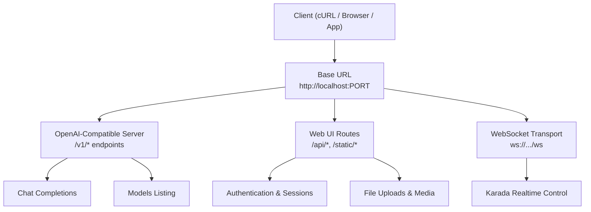
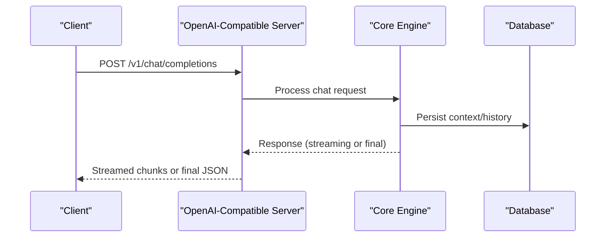
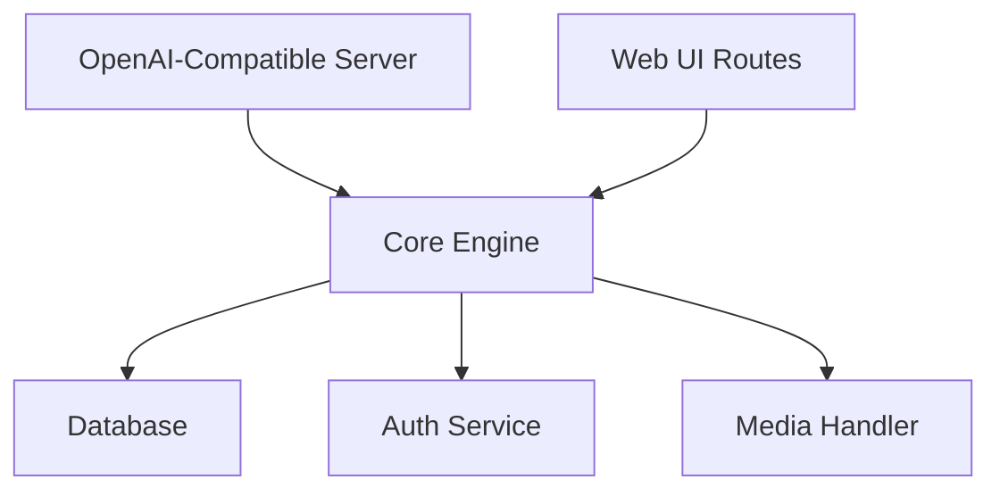

# cURL and HTTP Request Examples

<cite>
**Referenced Files in This Document**
- [main.py](file://main.py)
- [webui.py](file://core/webui.py)
- [openai_api_server.py](file://interface/openai_api_server/openai_api_server.py)
- [karada_api.py](file://core/karada_api.py)
- [karada_ws_transport.py](file://core/karada_ws_transport.py)
- [synth_webui_index.html](file://core/webui_templates/synth_webui_index.html)
- [api_endpoints.rst](file://docs/api_endpoints.rst)
- [README.md](file://README.md)
</cite>

## Table of Contents
1. [Introduction](#introduction)
2. [Project Structure](#project-structure)
3. [Core Components](#core-components)
4. [Architecture Overview](#architecture-overview)
5. [Detailed Component Analysis](#detailed-component-analysis)
6. [Dependency Analysis](#dependency-analysis)
7. [Performance Considerations](#performance-considerations)
8. [Troubleshooting Guide](#troubleshooting-guide)
9. [Conclusion](#conclusion)
10. [Appendices](#appendices)

## Introduction
This document provides practical cURL and HTTP request examples for Synthetic Heart’s REST API surface, including chat completions, file uploads, WebSocket connections, authentication, and system management. It also covers header configuration, payload formats, streaming responses, multipart uploads, and troubleshooting techniques using curl verbose mode and browser developer tools.

The examples are designed to be copy-paste friendly and include guidance on environment variables, base URLs, and common pitfalls. Where endpoints are exposed via an OpenAI-compatible server or internal web UI routes, the corresponding source files are referenced for traceability.

## Project Structure
Synthetic Heart exposes APIs through:
- An OpenAI-compatible server module that standardizes chat-like endpoints
- Internal web UI routes for system management and media handling
- WebSocket transport for real-time interactions (e.g., Karada control)

**Diagram sources**
- [openai_api_server.py:1-100](file://interface/openai_api_server/openai_api_server.py#L1-L100)
- [webui.py:1-120](file://core/webui.py#L1-L120)
- [karada_ws_transport.py:1-120](file://core/karada_ws_transport.py#L1-L120)

**Section sources**
- [main.py:1-120](file://main.py#L1-L120)
- [README.md:1-120](file://README.md#L1-L120)

## Core Components
- OpenAI-Compatible Server: Provides standardized chat completions and model listing endpoints compatible with OpenAI clients.
- Web UI Routes: Exposes internal endpoints for authentication, session management, and file/media operations.
- WebSocket Transport: Enables real-time communication for features like Karada control and live updates.

Key responsibilities:
- Normalize requests and responses across different LLM providers
- Manage sessions and tokens for authenticated access
- Stream responses where applicable (chat streaming, audio/video chunks)
- Validate payloads and enforce rate limits and security policies

**Section sources**
- [openai_api_server.py:1-200](file://interface/openai_api_server/openai_api_server.py#L1-L200)
- [webui.py:1-200](file://core/webui.py#L1-L200)
- [karada_ws_transport.py:1-200](file://core/karada_ws_transport.py#L1-L200)

## Architecture Overview
The system integrates multiple layers:
- Client layer: cURL, browsers, or SDKs
- API gateway: OpenAI-compatible server and Web UI routes
- Processing layer: Core logic for chat, media, and system management
- Transport layer: HTTP and WebSocket transports

**Diagram sources**
- [openai_api_server.py:1-200](file://interface/openai_api_server/openai_api_server.py#L1-L200)
- [webui.py:1-200](file://core/webui.py#L1-L200)

## Detailed Component Analysis

### OpenAI-Compatible Chat Completions
- Endpoint: POST /v1/chat/completions
- Headers: Content-Type: application/json, Authorization: Bearer <token>
- Payload: messages array, model name, optional parameters (temperature, max_tokens, stream)
- Responses: JSON object with choices; supports streaming when enabled

Example cURL:
- Non-streaming:
  - curl -X POST http://localhost:PORT/v1/chat/completions -H "Content-Type: application/json" -H "Authorization: Bearer YOUR_TOKEN" -d '{"model":"your-model","messages":[{"role":"user","content":"Hello"}]}'
- Streaming:
  - curl -N -X POST http://localhost:PORT/v1/chat/completions -H "Content-Type: application/json" -H "Authorization: Bearer YOUR_TOKEN" -d '{"model":"your-model","messages":[{"role":"user","content":"Hello"}],"stream":true}'

**Section sources**
- [openai_api_server.py:1-200](file://interface/openai_api_server/openai_api_server.py#L1-L200)

### File Uploads and Media Handling
- Endpoint: POST /api/upload (or similar route under Web UI)
- Headers: Content-Type: multipart/form-data
- Payload: file field(s), metadata fields if required
- Responses: JSON with upload status, file IDs, or URLs

Example cURL:
- Single file:
  - curl -X POST http://localhost:PORT/api/upload -F "file=@/path/to/image.png"
- Multiple files:
  - curl -X POST http://localhost:PORT/api/upload -F "files[]=@/path/to/img1.jpg" -F "files[]=@/path/to/img2.jpg"

Notes:
- Ensure proper MIME types and size limits
- Use chunked uploads for large files if supported

**Section sources**
- [webui.py:1-200](file://core/webui.py#L1-L200)

### Authentication and Session Management
- Endpoints:
  - POST /api/auth/login
  - GET /api/auth/session
  - POST /api/auth/logout
- Headers: Content-Type: application/json for JSON payloads
- Payloads: username/password for login; empty for session check
- Responses: JWT token or session cookie; error details on failure

Example cURL:
- Login:
  - curl -X POST http://localhost:PORT/api/auth/login -H "Content-Type: application/json" -d '{"username":"admin","password":"secret"}'
- Check session:
  - curl -X GET http://localhost:PORT/api/auth/session -H "Authorization: Bearer YOUR_TOKEN"

**Section sources**
- [webui.py:1-200](file://core/webui.py#L1-L200)

### System Management and Configuration
- Endpoints:
  - GET /api/system/status
  - PUT /api/config/settings
  - POST /api/system/restart
- Headers: Authorization: Bearer <token>
- Payloads: JSON objects for configuration updates
- Responses: Status codes and operation results

Example cURL:
- Get status:
  - curl -X GET http://localhost:PORT/api/system/status -H "Authorization: Bearer YOUR_TOKEN"
- Update config:
  - curl -X PUT http://localhost:PORT/api/config/settings -H "Content-Type: application/json" -H "Authorization: Bearer YOUR_TOKEN" -d '{"key":"value"}'

**Section sources**
- [webui.py:1-200](file://core/webui.py#L1-L200)

### WebSocket Connections
- Endpoint: ws://localhost:PORT/ws
- Purpose: Real-time communication for Karada control, live updates, and streaming events
- Messages: JSON-based protocol with event types and payloads

Example cURL (using wscat or similar):
- Connect:
  - wscat -c ws://localhost:PORT/ws
- Send message:
  - {"event":"control","payload":{"action":"move","x":0.5,"y":0.5}}

Browser Alternative:
- Use JavaScript WebSocket API in console:
  - const ws = new WebSocket("ws://localhost:PORT/ws");
  - ws.onmessage = (event) => console.log(event.data);
  - ws.send(JSON.stringify({event:"ping",payload:{}}));

**Section sources**
- [karada_ws_transport.py:1-200](file://core/karada_ws_transport.py#L1-L200)

### Streaming Responses
- Supported by chat completions and potentially other endpoints
- Use curl -N for non-blocking output
- Parse Server-Sent Events (SSE) or chunked transfer encoding

Example cURL:
- Streaming chat:
  - curl -N -X POST http://localhost:PORT/v1/chat/completions -H "Content-Type: application/json" -H "Authorization: Bearer YOUR_TOKEN" -d '{"model":"your-model","messages":[{"role":"user","content":"Tell a story"}],"stream":true}'

**Section sources**
- [openai_api_server.py:1-200](file://interface/openai_api_server/openai_api_server.py#L1-L200)

## Dependency Analysis
The API components depend on core services for data persistence, authentication, and processing. The OpenAI-compatible server acts as a facade over internal logic, while Web UI routes handle user-facing operations.

**Diagram sources**
- [openai_api_server.py:1-200](file://interface/openai_api_server/openai_api_server.py#L1-L200)
- [webui.py:1-200](file://core/webui.py#L1-L200)

**Section sources**
- [main.py:1-120](file://main.py#L1-L120)

## Performance Considerations
- Use streaming for long-running operations to reduce latency
- Implement connection pooling for frequent API calls
- Cache frequently accessed data to minimize database load
- Monitor rate limits and implement retry logic with exponential backoff

[No sources needed since this section provides general guidance]

## Troubleshooting Guide
Common issues and solutions:
- Network errors: Verify base URL and port; check firewall settings
- Authentication failures: Ensure token is valid and not expired
- Payload errors: Validate JSON structure and required fields
- Streaming issues: Use curl -N and parse SSE correctly

Debugging techniques:
- Use curl -v for verbose output to inspect headers and response bodies
- Inspect browser developer tools for network requests and WebSocket frames
- Check server logs for detailed error messages

Example cURL with verbose mode:
- curl -v -X POST http://localhost:PORT/v1/chat/completions -H "Content-Type: application/json" -H "Authorization: Bearer YOUR_TOKEN" -d '{"model":"your-model","messages":[{"role":"user","content":"Hello"}]}'

**Section sources**
- [api_endpoints.rst:1-100](file://docs/api_endpoints.rst#L1-L100)

## Conclusion
This guide provides comprehensive examples for interacting with Synthetic Heart’s REST API using cURL and HTTP requests. By following the provided patterns for authentication, payload formatting, and error handling, you can effectively integrate with the system’s chat, file, and system management capabilities. For real-time features, leverage WebSocket connections as demonstrated.

[No sources needed since this section summarizes without analyzing specific files]

## Appendices
- Environment Variables: Configure BASE_URL, AUTH_TOKEN, and other settings as needed
- Rate Limits: Review documentation for endpoint-specific limits
- Security Best Practices: Use HTTPS in production and secure token storage

[No sources needed since this section provides general guidance]