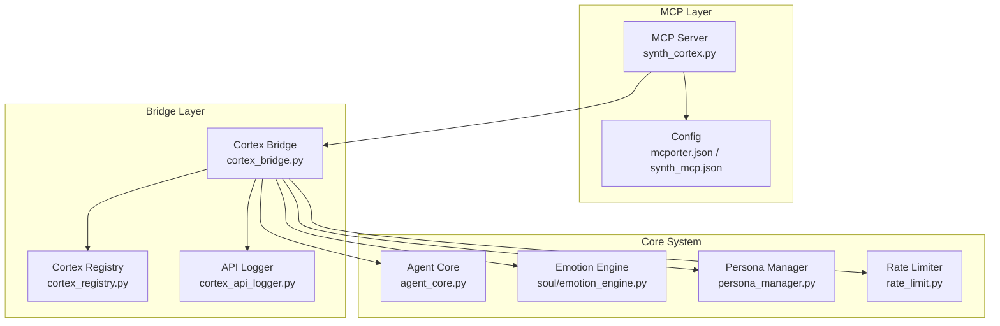
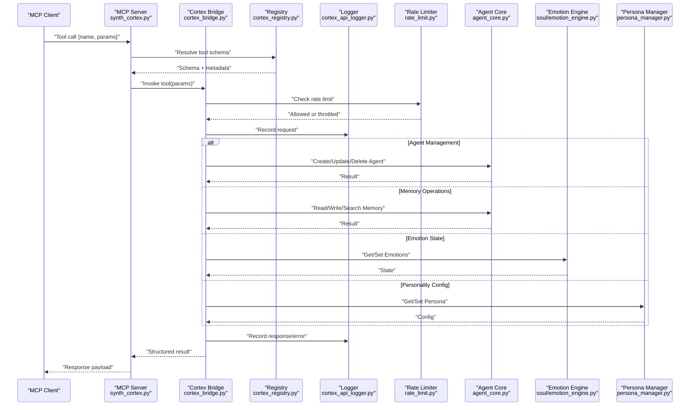
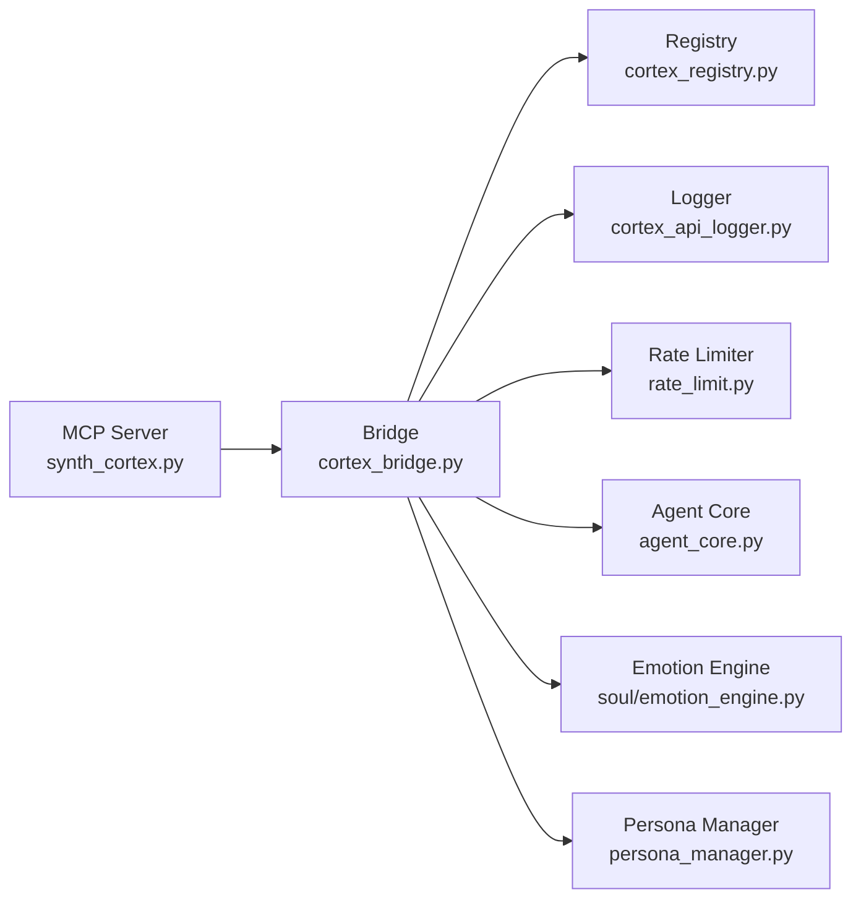

# Cortex Tools

<cite>
**Referenced Files in This Document**
- [synth_cortex.py](file://mcp_servers/synth_cortex.py)
- [cortex_bridge.py](file://core/external_endpoints/bridges/cortex_bridge.py)
- [cortex_registry.py](file://core/cortex_registry.py)
- [cortex_api_logger.py](file://core/cortex_api_logger.py)
- [rate_limit.py](file://core/rate_limit.py)
- [agent_core.py](file://core/agent_core.py)
- [soul_emotion_engine.py](file://core/soul/emotion_engine.py)
- [persona_manager.py](file://core/persona_manager.py)
- [mcporter.json](file://config/mcporter.json)
- [synth_mcp.json](file://config/synth_mcp.json)
</cite>

## Table of Contents
1. [Introduction](#introduction)
2. [Project Structure](#project-structure)
3. [Core Components](#core-components)
4. [Architecture Overview](#architecture-overview)
5. [Detailed Component Analysis](#detailed-component-analysis)
6. [Dependency Analysis](#dependency-analysis)
7. [Performance Considerations](#performance-considerations)
8. [Troubleshooting Guide](#troubleshooting-guide)
9. [Conclusion](#conclusion)
10. [Appendices](#appendices)

## Introduction
This document provides comprehensive documentation for Cortex tools exposed through the MCP interface. It covers agent management, memory operations, emotion state access, and personality configuration capabilities. The guide explains tool parameters, return values, usage examples, integration with the core agent system, real-time access patterns, error handling, rate limiting, and best practices for reliable operation.

## Project Structure
Cortex tools are implemented as an MCP server that bridges to internal components:
- MCP server entrypoint exposes tools over the MCP protocol
- Bridge layer translates MCP calls into internal API calls
- Registry manages available Cortex endpoints and metadata
- Logger captures API interactions for observability
- Rate limiter enforces throttling policies
- Core agent, emotion engine, and persona manager provide runtime data and actions

**Diagram sources**
- [synth_cortex.py](file://mcp_servers/synth_cortex.py)
- [cortex_bridge.py](file://core/external_endpoints/bridges/cortex_bridge.py)
- [cortex_registry.py](file://core/cortex_registry.py)
- [cortex_api_logger.py](file://core/cortex_api_logger.py)
- [agent_core.py](file://core/agent_core.py)
- [soul_emotion_engine.py](file://core/soul/emotion_engine.py)
- [persona_manager.py](file://core/persona_manager.py)
- [rate_limit.py](file://core/rate_limit.py)
- [mcporter.json](file://config/mcporter.json)
- [synth_mcp.json](file://config/synth_mcp.json)

**Section sources**
- [synth_cortex.py](file://mcp_servers/synth_cortex.py)
- [cortex_bridge.py](file://core/external_endpoints/bridges/cortex_bridge.py)
- [cortex_registry.py](file://core/cortex_registry.py)
- [cortex_api_logger.py](file://core/cortex_api_logger.py)
- [agent_core.py](file://core/agent_core.py)
- [soul_emotion_engine.py](file://core/soul/emotion_engine.py)
- [persona_manager.py](file://core/persona_manager.py)
- [rate_limit.py](file://core/rate_limit.py)
- [mcporter.json](file://config/mcporter.json)
- [synth_mcp.json](file://config/synth_mcp.json)

## Core Components
- MCP Server (Cortex): Exposes tools via MCP, parses requests, invokes bridge methods, serializes responses.
- Cortex Bridge: Translates MCP tool calls into internal operations on agent core, emotion engine, and persona manager; applies rate limits and logging.
- Cortex Registry: Discovers and validates available Cortex endpoints and their schemas.
- API Logger: Records request/response pairs and errors for diagnostics.
- Rate Limiter: Enforces per-tool or global throttling to protect downstream services.
- Core Integrations:
  - Agent Core: Manages agent lifecycle, sessions, and execution context.
  - Emotion Engine: Provides current emotion state and updates.
  - Persona Manager: Reads/writes personality configurations.

Key responsibilities:
- Parameter validation against tool schemas
- Consistent error formatting and propagation
- Observability via structured logs
- Safe concurrency and rate limiting

**Section sources**
- [synth_cortex.py](file://mcp_servers/synth_cortex.py)
- [cortex_bridge.py](file://core/external_endpoints/bridges/cortex_bridge.py)
- [cortex_registry.py](file://core/persistence/cortex_registry.py)
- [cortex_api_logger.py](file://core/cortex_api_logger.py)
- [rate_limit.py](file://core/rate_limit.py)
- [agent_core.py](file://core/agent_core.py)
- [soul_emotion_engine.py](file://core/soul/emotion_engine.py)
- [persona_manager.py](file://core/persona_manager.py)

## Architecture Overview
The MCP-to-Cortex flow ensures secure, observable, and rate-limited access to agent capabilities.

**Diagram sources**
- [synth_cortex.py](file://mcp_servers/synth_cortex.py)
- [cortex_bridge.py](file://core/external_endpoints/bridges/cortex_bridge.py)
- [cortex_registry.py](file://core/cortex_registry.py)
- [cortex_api_logger.py](file://core/cortex_api_logger.py)
- [rate_limit.py](file://core/rate_limit.py)
- [agent_core.py](file://core/agent_core.py)
- [soul_emotion_engine.py](file://core/soul/emotion_engine.py)
- [persona_manager.py](file://core/persona_manager.py)

## Detailed Component Analysis

### MCP Server: Cortex Tool Exposure
Responsibilities:
- Register Cortex tools with MCP
- Validate incoming requests against schemas
- Route calls to the bridge
- Serialize results and errors consistently

Typical tool categories:
- Agent Management: create, update, delete, list agents; manage sessions
- Memory Operations: read, write, search, delete memories; batch operations
- Emotion State Access: get current emotions, set emotion levels, subscribe to changes
- Personality Configuration: get/set persona profiles, traits, preferences

Parameters and returns:
- Parameters follow JSON Schema definitions from the registry
- Returns include success payloads, pagination tokens, and standardized error objects

Usage example pattern:
- Client sends a tool call with name and parameters
- Server resolves schema, validates, and forwards to bridge
- Bridge executes and returns a structured result

Error handling:
- Validation errors return parameter-level messages
- Runtime errors return standardized error codes and messages
- Throttling returns retry-after guidance when applicable

**Section sources**
- [synth_cortex.py](file://mcp_servers/synth_cortex.py)
- [cortex_registry.py](file://core/cortex_registry.py)

### Cortex Bridge: Internal Integration
Responsibilities:
- Map MCP tool names to internal functions
- Apply rate limiting and logging
- Translate between MCP payloads and internal models
- Aggregate results from multiple subsystems

Integration points:
- Agent Core: lifecycle and session control
- Emotion Engine: emotion state queries and updates
- Persona Manager: personality profile reads/writes
- Registry: tool discovery and schema enforcement
- Logger: audit trail and diagnostics

Best practices:
- Always wrap external calls with try/except and map exceptions to standard error shapes
- Use idempotency keys for write operations where supported
- Respect rate limits and implement backoff strategies

**Section sources**
- [cortex_bridge.py](file://core/external_endpoints/bridges/cortex_bridge.py)
- [cortex_api_logger.py](file://core/cortex_api_logger.py)
- [rate_limit.py](file://core/rate_limit.py)

### Cortex Registry: Tool Discovery and Schemas
Responsibilities:
- Discover available Cortex tools at startup
- Validate schemas and metadata
- Provide lookup by tool name for the MCP server

Key behaviors:
- Auto-discovery of tool definitions
- Fallback display names when labels are missing
- Rejection of invalid plugin definitions during registration

Operational notes:
- Ensure tool schemas remain consistent across deployments
- Update registry when adding new tools or changing parameters

**Section sources**
- [cortex_registry.py](file://core/cortex_registry.py)

### API Logger: Observability and Diagnostics
Responsibilities:
- Record request/response pairs
- Capture error traces and stack information
- Support toggles for enabling/disabling logging

Operational notes:
- Use structured logging for machine parsing
- Avoid logging sensitive data unless explicitly permitted
- Integrate with centralized log aggregation

**Section sources**
- [cortex_api_logger.py](file://core/cortex_api_logger.py)

### Rate Limiter: Throttling and Backpressure
Responsibilities:
- Enforce per-tool or global rate limits
- Return appropriate error codes when exceeded
- Provide guidance for retries

Configuration:
- Limits defined in configuration files or environment variables
- Supports burst allowances and sliding windows

Best practices:
- Implement exponential backoff with jitter on client side
- Monitor throttle rates and adjust limits accordingly

**Section sources**
- [rate_limit.py](file://core/rate_limit.py)

### Core Integrations: Agent, Emotion, Persona
Agent Core:
- Manages agent instances, sessions, and execution context
- Provides APIs for creating, updating, deleting, and querying agents
- Handles message routing and action execution

Emotion Engine:
- Exposes current emotion state and supports updates
- Enables subscription to emotion changes for real-time feedback
- Integrates with persona-driven emotional baselines

Persona Manager:
- Reads and writes personality profiles
- Supports trait adjustments and preference settings
- Ensures consistency across sessions

**Section sources**
- [agent_core.py](file://core/agent_core.py)
- [soul_emotion_engine.py](file://core/soul/emotion_engine.py)
- [persona_manager.py](file://core/persona_manager.py)

### MCP Configuration
Configuration files define how MCP clients connect and which tools are enabled:
- mcporter.json: MCP transport and connection settings
- synth_mcp.json: Tool enablement and server-specific options

Operational tips:
- Verify connectivity and permissions before enabling tools
- Use separate configs for development and production environments

**Section sources**
- [mcporter.json](file://config/mcporter.json)
- [synth_mcp.json](file://config/synth_mcp.json)

## Dependency Analysis
Cortex tools depend on several internal modules. Understanding these relationships helps diagnose issues and plan enhancements.

**Diagram sources**
- [synth_cortex.py](file://mcp_servers/synth_cortex.py)
- [cortex_bridge.py](file://core/external_endpoints/bridges/cortex_bridge.py)
- [cortex_registry.py](file://core/cortex_registry.py)
- [cortex_api_logger.py](file://core/cortex_api_logger.py)
- [rate_limit.py](file://core/rate_limit.py)
- [agent_core.py](file://core/agent_core.py)
- [soul_emotion_engine.py](file://core/soul/emotion_engine.py)
- [persona_manager.py](file://core/persona_manager.py)

**Section sources**
- [synth_cortex.py](file://mcp_servers/synth_cortex.py)
- [cortex_bridge.py](file://core/external_endpoints/bridges/cortex_bridge.py)
- [cortex_registry.py](file://core/cortex_registry.py)
- [cortex_api_logger.py](file://core/cortex_api_logger.py)
- [rate_limit.py](file://core/rate_limit.py)
- [agent_core.py](file://core/agent_core.py)
- [soul_emotion_engine.py](file://core/soul/emotion_engine.py)
- [persona_manager.py](file://core/persona_manager.py)

## Performance Considerations
- Batch operations: Prefer batched memory writes and searches to reduce overhead
- Caching: Cache frequent reads like persona profiles and emotion baselines
- Pagination: Use pagination tokens for large memory queries
- Concurrency: Limit concurrent tool calls to avoid saturating resources
- Logging: Enable sampling for high-volume logs in production
- Rate limits: Tune limits based on observed usage patterns

[No sources needed since this section provides general guidance]

## Troubleshooting Guide
Common issues and resolutions:
- Tool not found: Verify registry discovery and ensure tool is enabled in MCP config
- Parameter validation errors: Check schema definitions and input types
- Rate limited: Implement backoff and reduce call frequency
- Authentication failures: Confirm credentials and permissions in MCP config
- Emotion state inconsistencies: Ensure proper session context and persistence
- Persona changes not applied: Validate write operations and reload contexts

Diagnostic steps:
- Inspect API logs for request/response details
- Check rate limiter metrics for throttling events
- Validate MCP configuration files for syntax and correctness
- Test tool calls with minimal parameters to isolate issues

**Section sources**
- [cortex_api_logger.py](file://core/cortex_api_logger.py)
- [rate_limit.py](file://core/rate_limit.py)
- [mcporter.json](file://config/mcporter.json)
- [synth_mcp.json](file://config/synth_mcp.json)

## Conclusion
Cortex tools provide a robust, observable, and rate-limited interface to agent management, memory operations, emotion state access, and personality configuration. By following the integration patterns, error handling strategies, and performance recommendations outlined here, developers can build reliable applications that leverage real-time agent capabilities through the MCP interface.

[No sources needed since this section summarizes without analyzing specific files]

## Appendices

### Tool Categories and Typical Parameters
- Agent Management
  - Parameters: agent_id, name, model_config, session_options
  - Returns: agent_status, session_id, timestamps
- Memory Operations
  - Parameters: query, filters, limit, offset, embedding_vector
  - Returns: memories[], pagination_token, match_scores
- Emotion State Access
  - Parameters: emotion_keys, levels, duration
  - Returns: emotion_state{}, change_acknowledgement
- Personality Configuration
  - Parameters: persona_id, traits, preferences
  - Returns: persona_profile{}, validation_errors

[No sources needed since this section provides general guidance]

### Best Practices Summary
- Validate inputs early and fail fast
- Use idempotent operations for writes
- Handle errors gracefully with user-friendly messages
- Implement retries with exponential backoff
- Monitor and alert on error rates and latency
- Keep schemas and configs synchronized across environments

[No sources needed since this section provides general guidance]