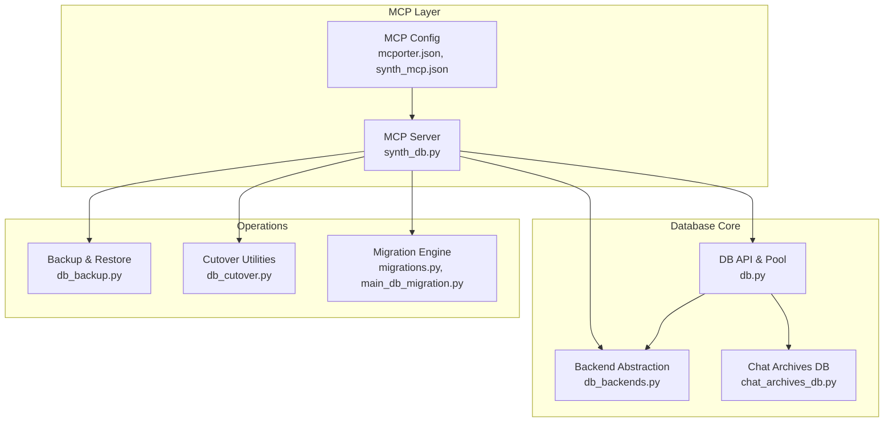
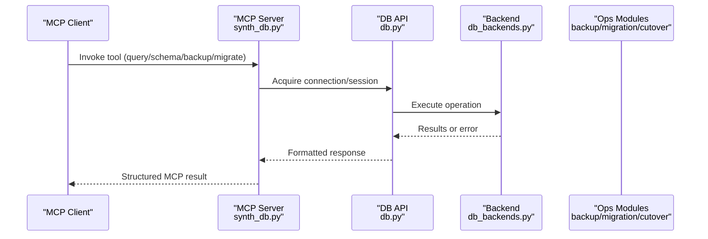
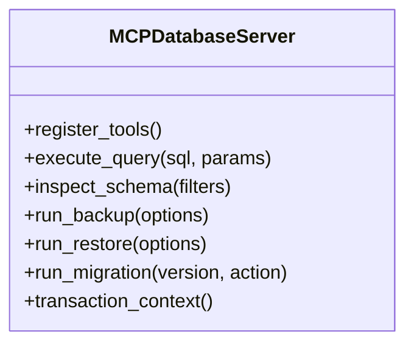
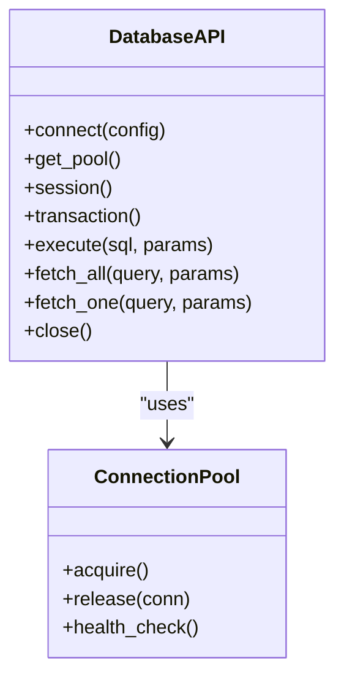
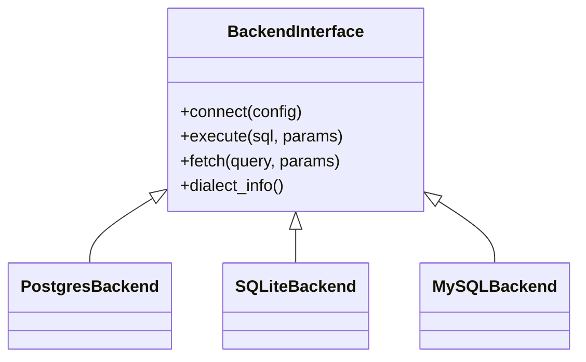
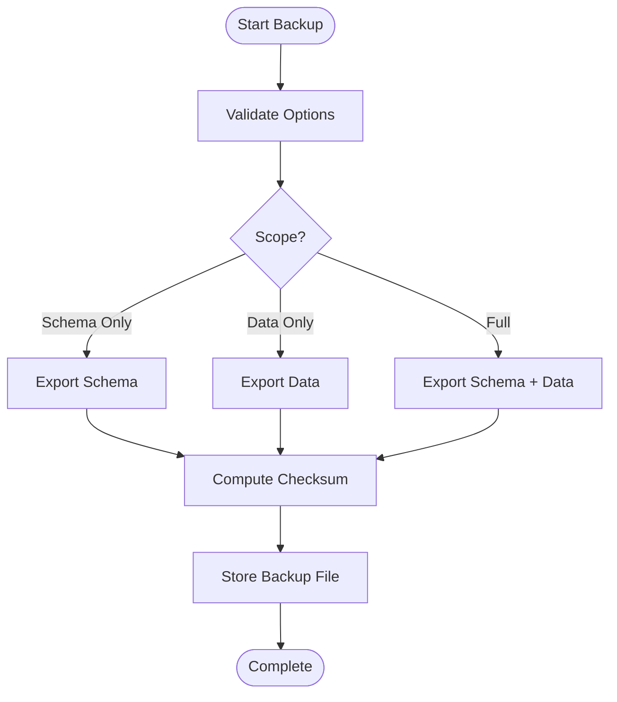
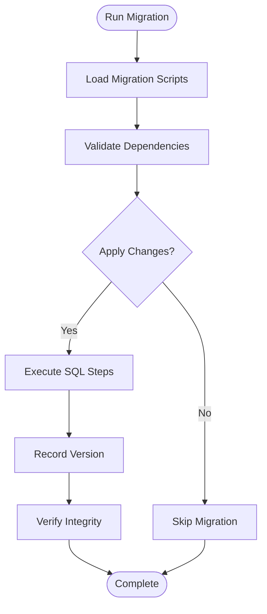
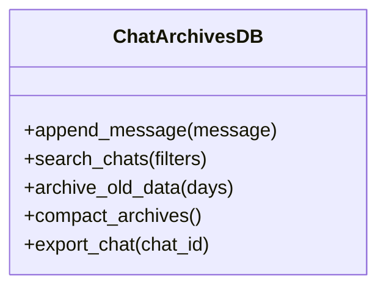
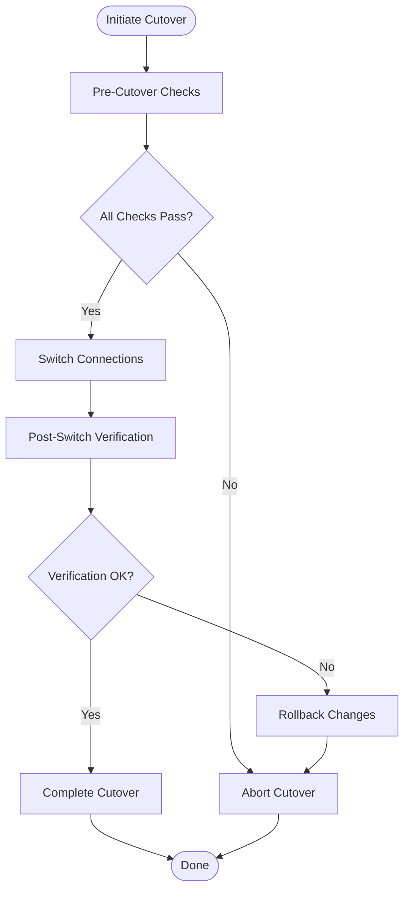
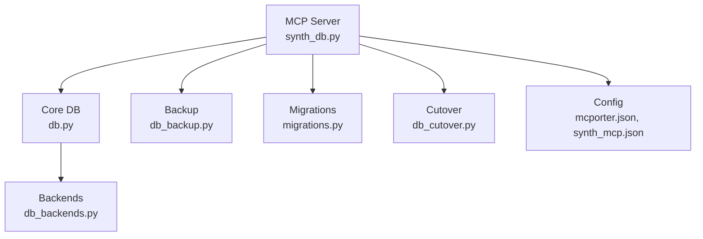

# Database Tools

<cite>
**Referenced Files in This Document**
- [synth_db.py](file://mcp_servers/synth_db.py)
- [db.py](file://core/db.py)
- [db_backends.py](file://core/db_backends.py)
- [db_backup.py](file://core/db_backup.py)
- [db_cutover.py](file://core/db_cutover.py)
- [main_db_migration.py](file://core/main_db_migration.py)
- [migrations.py](file://core/migrations.py)
- [chat_archives_db.py](file://core/chat_archives_db.py)
- [mcporter.json](file://config/mcporter.json)
- [synth_mcp.json](file://config/synth_mcp.json)
- [test_synth_db_mcp.py](file://tests/test_synth_db_mcp.py)
</cite>

## Table of Contents
1. [Introduction](#introduction)
2. [Project Structure](#project-structure)
3. [Core Components](#core-components)
4. [Architecture Overview](#architecture-overview)
5. [Detailed Component Analysis](#detailed-component-analysis)
6. [Dependency Analysis](#dependency-analysis)
7. [Performance Considerations](#performance-considerations)
8. [Troubleshooting Guide](#troubleshooting-guide)
9. [Conclusion](#conclusion)
10. [Appendices](#appendices)

## Introduction
This document provides comprehensive documentation for database tools accessible via the Model Context Protocol (MCP). It covers query execution, schema inspection, backup and restore operations, and data migration utilities. It also explains SQL patterns, parameter binding, result formatting, transaction management, backend abstraction, connection pooling, performance optimization, error handling, and security considerations.

## Project Structure
The MCP database tooling is implemented as an MCP server that exposes database operations to clients. The core database layer abstracts backends and manages connections and transactions. Backup/restore and migration utilities are provided as dedicated modules. Configuration files define MCP server settings and transport options.

**Diagram sources**
- [synth_db.py](file://mcp_servers/synth_db.py)
- [db.py](file://core/db.py)
- [db_backends.py](file://core/db_backends.py)
- [db_backup.py](file://core/db_backup.py)
- [db_cutover.py](file://core/db_cutover.py)
- [migrations.py](file://core/migrations.py)
- [main_db_migration.py](file://core/main_db_migration.py)
- [chat_archives_db.py](file://core/chat_archives_db.py)
- [mcporter.json](file://config/mcporter.json)
- [synth_mcp.json](file://config/synth_mcp.json)

**Section sources**
- [synth_db.py](file://mcp_servers/synth_db.py)
- [db.py](file://core/db.py)
- [db_backends.py](file://core/db_backends.py)
- [db_backup.py](file://core/db_backup.py)
- [db_cutover.py](file://core/db_cutover.py)
- [migrations.py](file://core/migrations.py)
- [main_db_migration.py](file://core/main_db_migration.py)
- [chat_archives_db.py](file://core/chat_archives_db.py)
- [mcporter.json](file://config/mcporter.json)
- [synth_mcp.json](file://config/synth_mcp.json)

## Core Components
- MCP Server: Exposes database tools over MCP with typed parameters and structured results.
- Database API: Centralized connection pool, session/context management, and transaction helpers.
- Backend Abstraction: Pluggable drivers for different database engines.
- Backup/Restore: Safe export/import routines with integrity checks.
- Migration Engine: Versioned migrations with rollback support.
- Chat Archives DB: Specialized persistence for chat history and related metadata.

Key responsibilities:
- Parameterized queries to prevent injection.
- Consistent result formatting for MCP responses.
- Robust error handling and diagnostics.
- Connection lifecycle and pooling configuration.

**Section sources**
- [synth_db.py](file://mcp_servers/synth_db.py)
- [db.py](file://core/db.py)
- [db_backends.py](file://core/db_backends.py)
- [db_backup.py](file://core/db_backup.py)
- [migrations.py](file://core/migrations.py)
- [chat_archives_db.py](file://core/chat_archives_db.py)

## Architecture Overview
The MCP database server acts as a thin orchestration layer over the core database components. Clients invoke MCP tools for querying, schema inspection, backups, and migrations. The core database layer abstracts backend specifics and ensures consistent behavior across engines.

**Diagram sources**
- [synth_db.py](file://mcp_servers/synth_db.py)
- [db.py](file://core/db.py)
- [db_backends.py](file://core/db_backends.py)
- [db_backup.py](file://core/db_backup.py)
- [migrations.py](file://core/migrations.py)

## Detailed Component Analysis

### MCP Database Server
The MCP server registers tools for:
- Query execution with parameter binding
- Schema inspection (tables, columns, indexes)
- Backup and restore
- Migration run/rollback/status
- Transaction control helpers

It validates inputs, enforces safe defaults, and formats outputs consistently for MCP consumption.

**Diagram sources**
- [synth_db.py](file://mcp_servers/synth_db.py)

**Section sources**
- [synth_db.py](file://mcp_servers/synth_db.py)

### Database API and Connection Pool
Responsibilities:
- Initialize and manage connection pools per backend
- Provide context managers for sessions and transactions
- Normalize errors and diagnostics
- Offer helper methods for common operations

**Diagram sources**
- [db.py](file://core/db.py)

**Section sources**
- [db.py](file://core/db.py)

### Backend Abstraction
Provides a unified interface for multiple database engines. Each backend implements:
- Connection initialization
- Parameter binding strategy
- Dialect-specific optimizations
- Error mapping

**Diagram sources**
- [db_backends.py](file://core/db_backends.py)

**Section sources**
- [db_backends.py](file://core/db_backends.py)

### Backup and Restore
Features:
- Export schemas and data with configurable scope
- Incremental and full backups
- Integrity verification and checksums
- Restore with conflict resolution strategies

**Diagram sources**
- [db_backup.py](file://core/db_backup.py)

**Section sources**
- [db_backup.py](file://core/db_backup.py)

### Migration Engine
Capabilities:
- Versioned migration scripts
- Up/down operations with rollback support
- Status tracking and dependency resolution
- Dry-run and validation modes

**Diagram sources**
- [migrations.py](file://core/migrations.py)
- [main_db_migration.py](file://core/main_db_migration.py)

**Section sources**
- [migrations.py](file://core/migrations.py)
- [main_db_migration.py](file://core/main_db_migration.py)

### Chat Archives Database
Specialized module for chat history persistence:
- Optimized schemas for time-series data
- Partitioning and indexing strategies
- Archival and compaction routines
- Search and retrieval APIs

**Diagram sources**
- [chat_archives_db.py](file://core/chat_archives_db.py)

**Section sources**
- [chat_archives_db.py](file://core/chat_archives_db.py)

### Cutover Utilities
Tools for safe database cutover between environments:
- Health checks and readiness probes
- Atomic switch operations
- Rollback procedures
- Monitoring and alerting hooks

**Diagram sources**
- [db_cutover.py](file://core/db_cutover.py)

**Section sources**
- [db_cutover.py](file://core/db_cutover.py)

## Dependency Analysis
The MCP server depends on the core database layer, which abstracts backend implementations. Backup, migration, and cutover modules provide specialized functionality. Configuration files define MCP server settings and transport protocols.

**Diagram sources**
- [synth_db.py](file://mcp_servers/synth_db.py)
- [db.py](file://core/db.py)
- [db_backends.py](file://core/db_backends.py)
- [db_backup.py](file://core/db_backup.py)
- [migrations.py](file://core/migrations.py)
- [db_cutover.py](file://core/db_cutover.py)
- [mcporter.json](file://config/mcporter.json)
- [synth_mcp.json](file://config/synth_mcp.json)

**Section sources**
- [synth_db.py](file://mcp_servers/synth_db.py)
- [db.py](file://core/db.py)
- [db_backends.py](file://core/db_backends.py)
- [db_backup.py](file://core/db_backup.py)
- [migrations.py](file://core/migrations.py)
- [db_cutover.py](file://core/db_cutover.py)
- [mcporter.json](file://config/mcporter.json)
- [synth_mcp.json](file://config/synth_mcp.json)

## Performance Considerations
- Connection Pooling: Configure pool size based on workload characteristics and database capacity limits.
- Query Optimization: Use parameterized queries, avoid SELECT *, and leverage appropriate indexes.
- Batch Operations: Group writes into transactions to reduce overhead.
- Result Streaming: For large datasets, use streaming cursors to minimize memory usage.
- Caching: Implement read-through caches for frequently accessed data.
- Monitoring: Track slow queries and connection metrics for proactive optimization.

## Troubleshooting Guide
Common issues and resolutions:
- Connection failures: Verify network connectivity, credentials, and firewall rules.
- Deadlocks: Analyze transaction boundaries and lock ordering.
- Memory leaks: Ensure proper resource cleanup and connection release.
- Migration conflicts: Review migration dependencies and version consistency.
- Backup corruption: Validate checksums and test restore procedures regularly.

Error handling patterns:
- Graceful degradation with fallback mechanisms
- Comprehensive logging with correlation IDs
- Retry logic with exponential backoff for transient failures
- Circuit breakers for downstream service protection

**Section sources**
- [db.py](file://core/db.py)
- [db_backends.py](file://core/db_backends.py)
- [db_backup.py](file://core/db_backup.py)
- [migrations.py](file://core/migrations.py)

## Conclusion
The MCP database tools provide a robust, secure, and performant interface for database operations. The architecture emphasizes abstraction, safety, and maintainability while supporting diverse database backends. Proper configuration, monitoring, and operational procedures ensure reliable database access through MCP.

## Appendices

### Security Considerations
- Always use parameterized queries to prevent SQL injection
- Implement least-privilege database accounts
- Encrypt sensitive data at rest and in transit
- Audit database access and operations
- Validate and sanitize all user inputs
- Use connection encryption where supported

### SQL Query Patterns
- Parameter binding: Use placeholders instead of string concatenation
- Pagination: Implement efficient cursor-based pagination
- Indexing: Create appropriate indexes for query patterns
- Transactions: Group related operations for consistency
- Read replicas: Route read-heavy queries to replicas when available

### MCP Configuration Examples
Configure MCP server settings and transport options in configuration files to enable database tool access.

**Section sources**
- [synth_db.py](file://mcp_servers/synth_db.py)
- [mcporter.json](file://config/mcporter.json)
- [synth_mcp.json](file://config/synth_mcp.json)
- [test_synth_db_mcp.py](file://tests/test_synth_db_mcp.py)