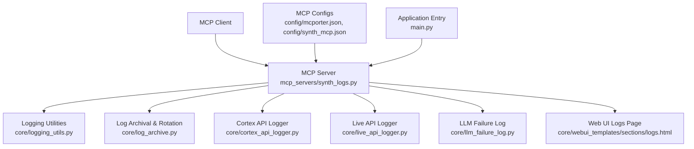
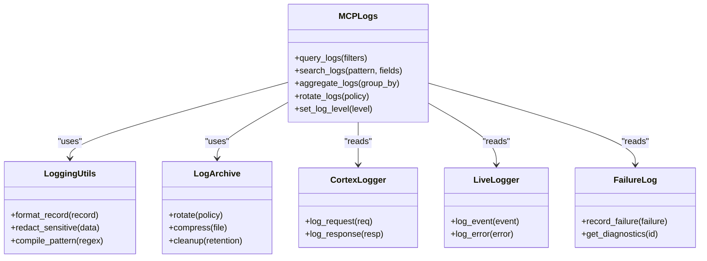

# Logging Tools

<cite>
**Referenced Files in This Document**
- [synth_logs.py](file://mcp_servers/synth_logs.py)
- [logging_utils.py](file://core/logging_utils.py)
- [log_archive.py](file://core/log_archive.py)
- [cortex_api_logger.py](file://core/cortex_api_logger.py)
- [live_api_logger.py](file://core/live_api_logger.py)
- [llm_failure_log.py](file://core/llm_failure_log.py)
- [logs.html](file://core/webui_templates/sections/logs.html)
- [main.py](file://main.py)
- [mcporter.json](file://config/mcporter.json)
- [synth_mcp.json](file://config/synth_mcp.json)
</cite>

## Table of Contents
1. [Introduction](#introduction)
2. [Project Structure](#project-structure)
3. [Core Components](#core-components)
4. [Architecture Overview](#architecture-overview)
5. [Detailed Component Analysis](#detailed-component-analysis)
6. [Dependency Analysis](#dependency-analysis)
7. [Performance Considerations](#performance-considerations)
8. [Troubleshooting Guide](#troubleshooting-guide)
9. [Conclusion](#conclusion)
10. [Appendices](#appendices)

## Introduction
This document explains the logging tools exposed through the MCP interface, focusing on log querying, filtering, and analysis capabilities; log level management; rotation and archival; format specifications; search patterns; aggregation features; monitoring and debugging workflows; performance analysis techniques; and security considerations for accessing logs and handling sensitive data.

## Project Structure
The logging subsystem is implemented across several modules:
- MCP server exposing logging tools to clients
- Core logging utilities and formatters
- Log archival and rotation helpers
- Specialized API and LLM failure loggers
- Web UI templates for browsing logs



**Diagram sources**
- [synth_logs.py](file://mcp_servers/synth_logs.py)
- [logging_utils.py](file://core/logging_utils.py)
- [log_archive.py](file://core/log_archive.py)
- [cortex_api_logger.py](file://core/cortex_api_logger.py)
- [live_api_logger.py](file://core/live_api_logger.py)
- [llm_failure_log.py](file://core/llm_failure_log.py)
- [logs.html](file://core/webui_templates/sections/logs.html)
- [mcporter.json](file://config/mcporter.json)
- [synth_mcp.json](file://config/synth_mcp.json)
- [main.py](file://main.py)

**Section sources**
- [synth_logs.py](file://mcp_servers/synth_logs.py)
- [logging_utils.py](file://core/logging_utils.py)
- [log_archive.py](file://core/log_archive.py)
- [cortex_api_logger.py](file://core/cortex_api_logger.py)
- [live_api_logger.py](file://core/live_api_logger.py)
- [llm_failure_log.py](file://core/llm_failure_log.py)
- [logs.html](file://core/webui_templates/sections/logs.html)
- [mcporter.json](file://config/mcporter.json)
- [synth_mcp.json](file://config/synth_mcp.json)
- [main.py](file://main.py)

## Core Components
- MCP logging tool server: Exposes functions for querying logs, filtering by level/time/source, searching with patterns, aggregating counts, rotating archives, and managing retention.
- Logging utilities: Provides structured formatting, timestamping, context injection, and safe redaction helpers.
- Log archival and rotation: Implements file-based rotation policies, compression, and cleanup based on size or age.
- Specialized loggers: Captures API call traces (Cortex, Live), and LLM failures with diagnostics.
- Web UI logs page: Renders filtered views and provides quick actions for downloading or exporting logs.

Key responsibilities:
- Querying: Retrieve recent entries, paginate results, filter by level, source, time range, and correlation IDs.
- Filtering and search: Support substring matches, regex patterns, and field-level filters.
- Aggregation: Count by level, source, error codes, and compute summary statistics.
- Rotation and archival: Rotate active logs, compress rotated files, enforce retention limits.
- Level management: Adjust runtime log levels per module or global scope.
- Security: Redact secrets, enforce access controls, and sanitize outputs.

**Section sources**
- [synth_logs.py](file://mcp_servers/synth_logs.py)
- [logging_utils.py](file://core/logging_utils.py)
- [log_archive.py](file://core/log_archive.py)
- [cortex_api_logger.py](file://core/cortex_api_logger.py)
- [live_api_logger.py](file://core/live_api_logger.py)
- [llm_failure_log.py](file://core/llm_failure_log.py)
- [logs.html](file://core/webui_templates/sections/logs.html)

## Architecture Overview
The MCP logging tools are invoked by clients via MCP calls. The server routes requests to appropriate handlers that interact with core logging utilities and archival systems. Specialized loggers feed structured events into the central pipeline. The Web UI provides a browsable view and export options.

```mermaid
sequenceDiagram
participant Client as "MCP Client"
participant MCP as "MCP Server<br/>synth_logs.py"
participant Utils as "Logging Utils<br/>logging_utils.py"
participant Archive as "Log Archive<br/>log_archive.py"
participant Cortex as "Cortex Logger<br/>cortex_api_logger.py"
participant Live as "Live Logger<br/>live_api_logger.py"
participant Fail as "Failure Log<br/>llm_failure_log.py"
Client->>MCP : "query_logs(filters, pagination)"
MCP->>Utils : "format_and_filter(entries)"
Utils-->>MCP : "filtered_entries"
MCP-->>Client : "results"
Client->>MCP : "search_logs(pattern, fields)"
MCP->>Utils : "regex_search(pattern)"
Utils-->>MCP : "matches"
MCP-->>Client : "matches"
Client->>MCP : "aggregate_logs(group_by)"
MCP->>Utils : "compute_aggregations(group_by)"
Utils-->>MCP : "aggregations"
MCP-->>Client : "summary"
Client->>MCP : "rotate_logs(policy)"
MCP->>Archive : "apply_rotation(policy)"
Archive-->>MCP : "status"
MCP-->>Client : "rotation_result"
Note over Cortex,Live,Fail : "Structured logs emitted into pipeline"
```

**Diagram sources**
- [synth_logs.py](file://mcp_servers/synth_logs.py)
- [logging_utils.py](file://core/logging_utils.py)
- [log_archive.py](file://core/log_archive.py)
- [cortex_api_logger.py](file://core/cortex_api_logger.py)
- [live_api_logger.py](file://core/live_api_logger.py)
- [llm_failure_log.py](file://core/llm_failure_log.py)

## Detailed Component Analysis

### MCP Logging Tool Server
Responsibilities:
- Expose MCP tools for querying, searching, aggregating, rotating, and managing log levels.
- Validate inputs and enforce rate limits where applicable.
- Coordinate between specialized loggers and archival system.

Typical operations:
- query_logs: Accept filters (level, source, time range, correlation_id), return paginated results.
- search_logs: Apply substring or regex patterns across message fields.
- aggregate_logs: Group by level, source, error_code, or custom keys; return counts and summaries.
- rotate_logs: Trigger rotation based on size or schedule; compress and retain according to policy.
- set_log_level: Update runtime log level for modules or globally.

Security:
- Enforce access control checks before returning logs.
- Redact sensitive fields automatically during serialization.

**Section sources**
- [synth_logs.py](file://mcp_servers/synth_logs.py)

### Logging Utilities
Responsibilities:
- Provide consistent log record structure: timestamp, level, source, message, context fields.
- Implement formatting rules and optional JSON output.
- Offer safe redaction helpers for secrets and tokens.
- Support correlation IDs and trace spans for distributed tracing.

Complexity considerations:
- Formatting overhead minimized by lazy evaluation.
- Regex search uses compiled patterns for repeated queries.

**Section sources**
- [logging_utils.py](file://core/logging_utils.py)

### Log Archival and Rotation
Responsibilities:
- Rotate active logs when thresholds are met (size, time).
- Compress rotated files and manage retention windows.
- Ensure atomic writes and avoid partial reads.

Policies:
- Max file size and max backups count.
- Age-based cleanup and disk space thresholds.

**Section sources**
- [log_archive.py](file://core/log_archive.py)

### Cortex API Logger
Responsibilities:
- Capture request/response metadata for Cortex API calls.
- Include timing, status codes, and payload sizes while redacting secrets.
- Emit structured events for downstream analysis.

Use cases:
- Performance profiling of external API calls.
- Error diagnosis with detailed context.

**Section sources**
- [cortex_api_logger.py](file://core/cortex_api_logger.py)

### Live API Logger
Responsibilities:
- Record live session events, streaming states, and errors.
- Track latency and throughput metrics.
- Preserve minimal payloads to reduce storage costs.

Use cases:
- Real-time debugging of voice or media pipelines.
- Monitoring session lifecycle and anomalies.

**Section sources**
- [live_api_logger.py](file://core/live_api_logger.py)

### LLM Failure Log
Responsibilities:
- Persist structured records of LLM invocation failures.
- Capture error types, retry attempts, and diagnostic context.
- Enable targeted alerting and recovery strategies.

Use cases:
- Post-mortem analysis of model outages.
- Tuning retry/backoff policies.

**Section sources**
- [llm_failure_log.py](file://core/llm_failure_log.py)

### Web UI Logs Page
Responsibilities:
- Render filtered log views with pagination.
- Provide search box, level toggles, and export options.
- Allow downloading compressed archives.

User workflows:
- Filter by level and time range.
- Search with regex patterns.
- Export current view to CSV/JSON.

**Section sources**
- [logs.html](file://core/webui_templates/sections/logs.html)

## Dependency Analysis
The MCP logging server depends on core utilities and specialized loggers. Configuration files define MCP endpoints and behavior. The application entry point initializes the MCP server and wires dependencies.



**Diagram sources**
- [synth_logs.py](file://mcp_servers/synth_logs.py)
- [logging_utils.py](file://core/logging_utils.py)
- [log_archive.py](file://core/log_archive.py)
- [cortex_api_logger.py](file://core/cortex_api_logger.py)
- [live_api_logger.py](file://core/live_api_logger.py)
- [llm_failure_log.py](file://core/llm_failure_log.py)

**Section sources**
- [synth_logs.py](file://mcp_servers/synth_logs.py)
- [logging_utils.py](file://core/logging_utils.py)
- [log_archive.py](file://core/log_archive.py)
- [cortex_api_logger.py](file://core/cortex_api_logger.py)
- [live_api_logger.py](file://core/live_api_logger.py)
- [llm_failure_log.py](file://core/llm_failure_log.py)
- [mcporter.json](file://config/mcporter.json)
- [synth_mcp.json](file://config/synth_mcp.json)
- [main.py](file://main.py)

## Performance Considerations
- Use pagination and limit result sets to avoid large payloads.
- Prefer field-level filters to reduce scanning cost.
- Compile regex patterns once and reuse them.
- Stream responses when possible to reduce memory usage.
- Configure rotation policies to prevent disk pressure.
- Avoid logging large payloads; use checksums or size indicators instead.

[No sources needed since this section provides general guidance]

## Troubleshooting Guide
Common issues and resolutions:
- No logs returned: Verify filters and time ranges; ensure log level includes requested severity.
- Slow searches: Narrow search scope to specific fields; use precompiled patterns.
- Missing rotation: Check disk space and retention settings; verify rotation triggers.
- Sensitive data exposure: Confirm redaction rules are applied; audit log formats.
- Access denied: Review MCP authentication and authorization configuration.

Operational tips:
- Use aggregate queries to identify spikes in error rates.
- Correlate events using correlation IDs across services.
- Export logs for offline analysis when UI is insufficient.

**Section sources**
- [synth_logs.py](file://mcp_servers/synth_logs.py)
- [logging_utils.py](file://core/logging_utils.py)
- [log_archive.py](file://core/log_archive.py)
- [logs.html](file://core/webui_templates/sections/logs.html)

## Conclusion
The MCP logging tools provide a robust framework for querying, filtering, analyzing, and managing logs across the system. With structured formats, powerful search and aggregation, rotation and archival policies, and secure access controls, they support effective monitoring, debugging, and performance analysis. Proper configuration and adherence to best practices ensure reliable and secure log operations.

[No sources needed since this section summarizes without analyzing specific files]

## Appendices

### Log Format Specifications
- Fields typically include timestamp, level, source, message, and contextual metadata.
- Optional structured fields: correlation_id, trace_span, user_id, endpoint, error_code.
- Output modes: plain text for readability, JSON for machine processing.

[No sources needed since this section provides general guidance]

### Search Patterns and Examples
- Substring match: Match exact phrases within messages.
- Regex pattern: Use regular expressions for complex matching across fields.
- Field filters: Combine level, source, and time range filters for precise queries.

[No sources needed since this section provides general guidance]

### Monitoring and Debugging Workflows
- Real-time monitoring: Subscribe to log streams and apply alerts on error thresholds.
- Debugging sessions: Use correlation IDs to trace end-to-end flows.
- Performance analysis: Aggregate latency metrics and identify bottlenecks.

[No sources needed since this section provides general guidance]

### Security Considerations
- Enforce authentication and authorization for MCP log access.
- Apply automatic redaction for secrets, tokens, and personal data.
- Restrict log export permissions and audit access logs.
- Store archives securely with encryption at rest and in transit.

[No sources needed since this section provides general guidance]