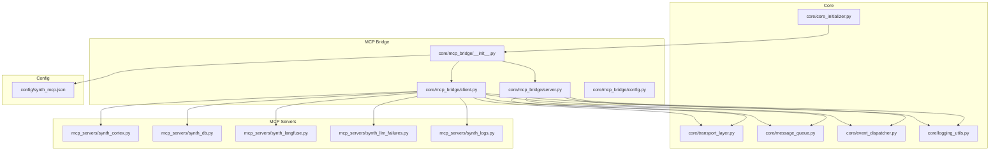
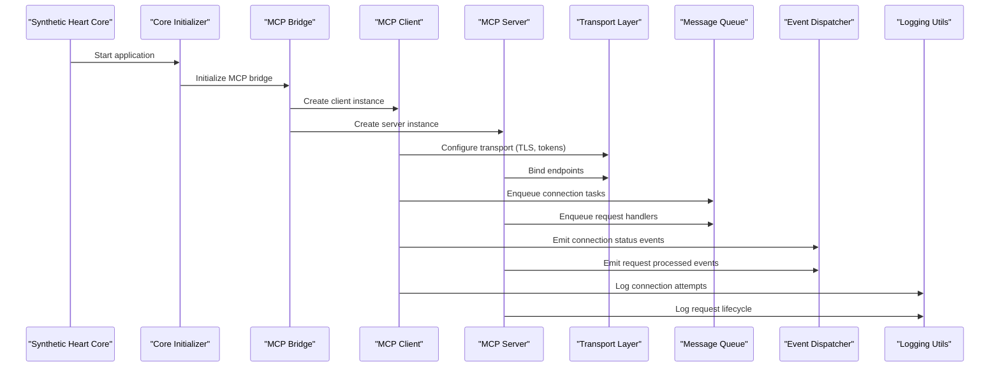
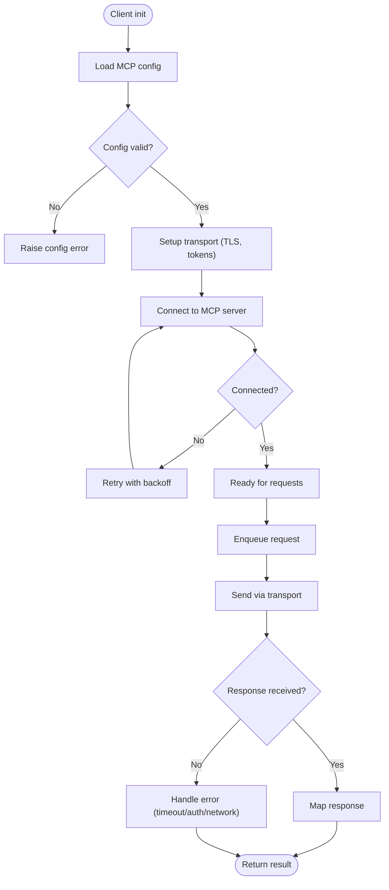
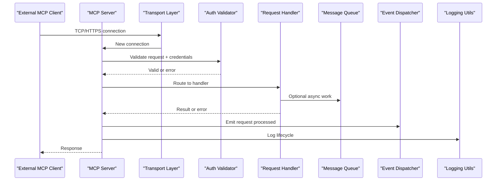
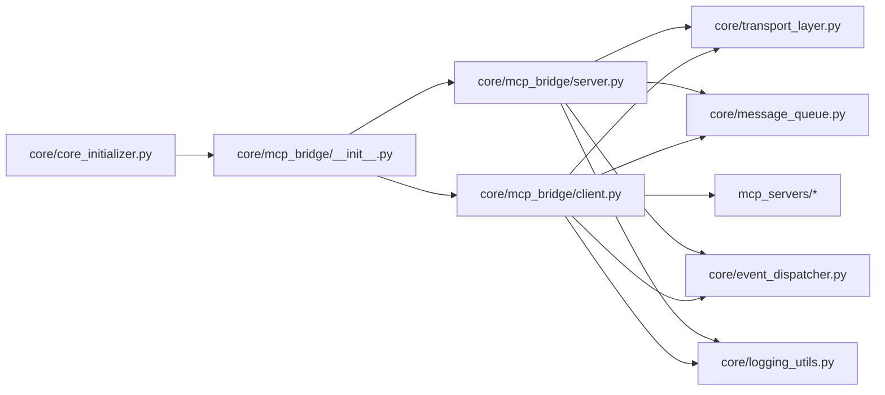
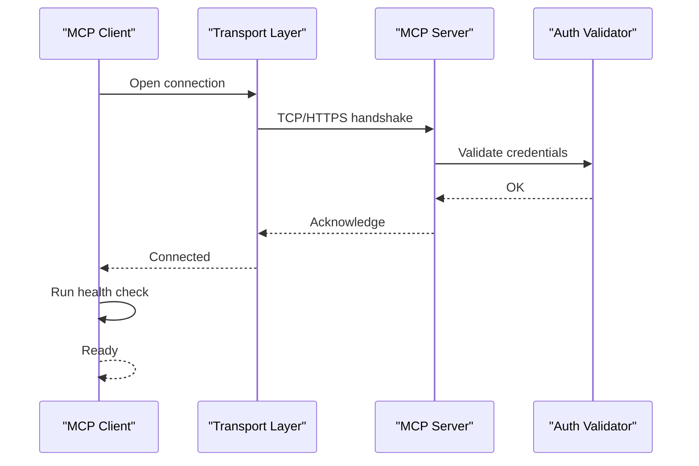

# MCP Core Architecture

<cite>
**Referenced Files in This Document**
- [core/mcp_bridge/__init__.py](file://core/mcp_bridge/__init__.py)
- [core/mcp_bridge/client.py](file://core/mcp_bridge/client.py)
- [core/mcp_bridge/server.py](file://core/mcp_bridge/server.py)
- [core/mcp_bridge/config.py](file://core/mcp_bridge/config.py)
- [config/synth_mcp.json](file://config/synth_mcp.json)
- [mcp_servers/synth_cortex.py](file://mcp_servers/synth_cortex.py)
- [mcp_servers/synth_db.py](file://mcp_servers/synth_db.py)
- [mcp_servers/synth_langfuse.py](file://mcp_servers/synth_langfuse.py)
- [mcp_servers/synth_llm_failures.py](file://mcp_servers/synth_llm_failures.py)
- [mcp_servers/synth_logs.py](file://mcp_servers/synth_logs.py)
- [main.py](file://main.py)
- [core/core_initializer.py](file://core/core_initializer.py)
- [core/transport_layer.py](file://core/transport_layer.py)
- [core/message_queue.py](file://core/message_queue.py)
- [core/event_dispatcher.py](file://core/event_dispatcher.py)
- [core/logging_utils.py](file://core/logging_utils.py)
</cite>

## Table of Contents
1. [Introduction](#introduction)
2. [Project Structure](#project-structure)
3. [Core Components](#core-components)
4. [Architecture Overview](#architecture-overview)
5. [Detailed Component Analysis](#detailed-component-analysis)
6. [Dependency Analysis](#dependency-analysis)
7. [Performance Considerations](#performance-considerations)
8. [Troubleshooting Guide](#troubleshooting-guide)
9. [Conclusion](#conclusion)
10. [Appendices](#appendices)

## Introduction
This document explains the Model Context Protocol (MCP) core architecture within Synthetic Heart. It focuses on client-server communication patterns, connection management, and protocol implementation details. It also documents how the MCP bridge integrates with the core system for message routing, error handling, and lifecycle management, along with configuration options, security considerations, and performance optimization strategies. Practical examples are provided for initializing an MCP client, setting up an MCP server, and establishing connections.

## Project Structure
The MCP subsystem is implemented under core/mcp_bridge and is complemented by external MCP servers under mcp_servers. Configuration is centralized in config/synth_mcp.json. The core initializer orchestrates startup and integration points.

**Diagram sources**
- [core/core_initializer.py](file://core/core_initializer.py)
- [core/transport_layer.py](file://core/transport_layer.py)
- [core/message_queue.py](file://core/message_queue.py)
- [core/event_dispatcher.py](file://core/event_dispatcher.py)
- [core/logging_utils.py](file://core/logging_utils.py)
- [core/mcp_bridge/__init__.py](file://core/mcp_bridge/__init__.py)
- [core/mcp_bridge/client.py](file://core/mcp_bridge/client.py)
- [core/mcp_bridge/server.py](file://core/mcp_bridge/server.py)
- [core/mcp_bridge/config.py](file://core/mcp_bridge/config.py)
- [config/synth_mcp.json](file://config/synth_mcp.json)
- [mcp_servers/synth_cortex.py](file://mcp_servers/synth_cortex.py)
- [mcp_servers/synth_db.py](file://mcp_servers/synth_db.py)
- [mcp_servers/synth_langfuse.py](file://mcp_servers/synth_langfuse.py)
- [mcp_servers/synth_llm_failures.py](file://mcp_servers/synth_llm_failures.py)
- [mcp_servers/synth_logs.py](file://mcp_servers/synth_logs.py)

**Section sources**
- [core/mcp_bridge/__init__.py](file://core/mcp_bridge/__init__.py)
- [core/mcp_bridge/client.py](file://core/mcp_bridge/client.py)
- [core/mcp_bridge/server.py](file://core/mcp_bridge/server.py)
- [core/mcp_bridge/config.py](file://core/mcp_bridge/config.py)
- [config/synth_mcp.json](file://config/synth_mcp.json)
- [core/core_initializer.py](file://core/core_initializer.py)

## Core Components
- MCP Client: Manages outbound connections to MCP servers, handles request/response cycles, retries, timeouts, and error mapping.
- MCP Server: Exposes internal capabilities via MCP endpoints, processes incoming requests, and routes responses back through the transport layer.
- Configuration Loader: Reads synth_mcp.json and validates settings such as endpoints, authentication, timeouts, and logging levels.
- Integration Layer: Connects MCP components to the core transport layer, message queue, event dispatcher, and logging utilities.

Key responsibilities:
- Connection lifecycle: connect, reconnect, disconnect, health checks.
- Message routing: map MCP messages to core events and vice versa.
- Error handling: translate transport errors into domain-specific exceptions and log them consistently.
- Security: enforce TLS, token-based auth, and input validation.

**Section sources**
- [core/mcp_bridge/client.py](file://core/mcp_bridge/client.py)
- [core/mcp_bridge/server.py](file://core/mcp_bridge/server.py)
- [core/mcp_bridge/config.py](file://core/mcp_bridge/config.py)
- [core/transport_layer.py](file://core/transport_layer.py)
- [core/message_queue.py](file://core/message_queue.py)
- [core/event_dispatcher.py](file://core/event_dispatcher.py)
- [core/logging_utils.py](file://core/logging_utils.py)

## Architecture Overview
The MCP bridge sits between Synthetic Heart’s core and external MCP servers. The client initiates outbound calls; the server accepts inbound calls. Both sides use the transport layer for I/O, the message queue for async processing, and the event dispatcher for decoupled notifications.

**Diagram sources**
- [core/core_initializer.py](file://core/core_initializer.py)
- [core/mcp_bridge/__init__.py](file://core/mcp_bridge/__init__.py)
- [core/mcp_bridge/client.py](file://core/mcp_bridge/client.py)
- [core/mcp_bridge/server.py](file://core/mcp_bridge/server.py)
- [core/transport_layer.py](file://core/transport_layer.py)
- [core/message_queue.py](file://core/message_queue.py)
- [core/event_dispatcher.py](file://core/event_dispatcher.py)
- [core/logging_utils.py](file://core/logging_utils.py)

## Detailed Component Analysis

### MCP Client
Responsibilities:
- Establishes and maintains connections to one or more MCP servers.
- Serializes/deserializes MCP messages according to the protocol.
- Implements retry/backoff policies and timeout enforcement.
- Maps transport-level errors to domain exceptions.
- Emits lifecycle events and logs all significant operations.

Connection flow:
- Initialization reads configuration from synth_mcp.json.
- Transport layer is configured with TLS and credentials.
- Connection is established asynchronously and monitored for health.
- Requests are enqueued and dispatched via the message queue.

Error handling:
- Network failures trigger exponential backoff with jitter.
- Authentication errors are surfaced immediately with actionable logs.
- Timeouts are enforced per-request and logged with context.

**Diagram sources**
- [core/mcp_bridge/client.py](file://core/mcp_bridge/client.py)
- [core/mcp_bridge/config.py](file://core/mcp_bridge/config.py)
- [core/transport_layer.py](file://core/transport_layer.py)
- [core/message_queue.py](file://core/message_queue.py)
- [core/logging_utils.py](file://core/logging_utils.py)

**Section sources**
- [core/mcp_bridge/client.py](file://core/mcp_bridge/client.py)
- [core/mcp_bridge/config.py](file://core/mcp_bridge/config.py)
- [core/transport_layer.py](file://core/transport_layer.py)
- [core/message_queue.py](file://core/message_queue.py)
- [core/logging_utils.py](file://core/logging_utils.py)

### MCP Server
Responsibilities:
- Accepts inbound MCP requests over configured endpoints.
- Validates payloads and authenticates callers.
- Routes requests to appropriate handlers and returns structured responses.
- Publishes lifecycle and request events for observability.
- Integrates with logging for consistent audit trails.

Request flow:
- Transport binds endpoints and listens for connections.
- Incoming requests are validated and authenticated.
- Handlers process requests synchronously or enqueue long-running work.
- Responses are serialized and sent back via the transport.

Error handling:
- Validation errors return clear error codes and messages.
- Auth failures are logged and rejected without leaking internals.
- Unhandled exceptions are caught, sanitized, and logged.

**Diagram sources**
- [core/mcp_bridge/server.py](file://core/mcp_bridge/server.py)
- [core/transport_layer.py](file://core/transport_layer.py)
- [core/message_queue.py](file://core/message_queue.py)
- [core/event_dispatcher.py](file://core/event_dispatcher.py)
- [core/logging_utils.py](file://core/logging_utils.py)

**Section sources**
- [core/mcp_bridge/server.py](file://core/mcp_bridge/server.py)
- [core/transport_layer.py](file://core/transport_layer.py)
- [core/message_queue.py](file://core/message_queue.py)
- [core/event_dispatcher.py](file://core/event_dispatcher.py)
- [core/logging_utils.py](file://core/logging_utils.py)

### Configuration Management
- Centralized in config/synth_mcp.json.
- Defines server endpoints, client connection profiles, TLS settings, authentication tokens, timeouts, and logging levels.
- Loaded by the MCP bridge at startup and validated before activation.

Key options typically include:
- Endpoints: URLs or host/port pairs for MCP servers.
- TLS: Enable/disable, certificate paths, hostname verification.
- Authentication: Token types, header names, secret locations.
- Timeouts: Connect, read, write, and idle timeouts.
- Logging: Level, format, and destination.

Security considerations:
- Always enable TLS in production.
- Store secrets securely and avoid hardcoding tokens.
- Validate and sanitize all inputs.
- Restrict endpoints to trusted networks where possible.

**Section sources**
- [core/mcp_bridge/config.py](file://core/mcp_bridge/config.py)
- [config/synth_mcp.json](file://config/synth_mcp.json)

### MCP Servers (External Implementations)
Synthetic Heart ships several MCP server implementations that expose internal capabilities:
- Cortex: AI reasoning and orchestration tools.
- DB: Database query and management tools.
- Langfuse: Observability and tracing integration.
- LLM Failures: Access failure logs and diagnostics.
- Logs: Stream and query application logs.

These servers implement MCP endpoints and integrate with core services via the transport layer and event dispatcher.

**Section sources**
- [mcp_servers/synth_cortex.py](file://mcp_servers/synth_cortex.py)
- [mcp_servers/synth_db.py](file://mcp_servers/synth_db.py)
- [mcp_servers/synth_langfuse.py](file://mcp_servers/synth_langfuse.py)
- [mcp_servers/synth_llm_failures.py](file://mcp_servers/synth_llm_failures.py)
- [mcp_servers/synth_logs.py](file://mcp_servers/synth_logs.py)

## Dependency Analysis
The MCP bridge depends on core infrastructure for transport, messaging, events, and logging. External MCP servers depend on the bridge client to call their endpoints.

**Diagram sources**
- [core/core_initializer.py](file://core/core_initializer.py)
- [core/mcp_bridge/__init__.py](file://core/mcp_bridge/__init__.py)
- [core/mcp_bridge/client.py](file://core/mcp_bridge/client.py)
- [core/mcp_bridge/server.py](file://core/mcp_bridge/server.py)
- [core/transport_layer.py](file://core/transport_layer.py)
- [core/message_queue.py](file://core/message_queue.py)
- [core/event_dispatcher.py](file://core/event_dispatcher.py)
- [core/logging_utils.py](file://core/logging_utils.py)
- [mcp_servers/synth_cortex.py](file://mcp_servers/synth_cortex.py)
- [mcp_servers/synth_db.py](file://mcp_servers/synth_db.py)
- [mcp_servers/synth_langfuse.py](file://mcp_servers/synth_langfuse.py)
- [mcp_servers/synth_llm_failures.py](file://mcp_servers/synth_llm_failures.py)
- [mcp_servers/synth_logs.py](file://mcp_servers/synth_logs.py)

**Section sources**
- [core/core_initializer.py](file://core/core_initializer.py)
- [core/mcp_bridge/__init__.py](file://core/mcp_bridge/__init__.py)
- [core/mcp_bridge/client.py](file://core/mcp_bridge/client.py)
- [core/mcp_bridge/server.py](file://core/mcp_bridge/server.py)
- [core/transport_layer.py](file://core/transport_layer.py)
- [core/message_queue.py](file://core/message_queue.py)
- [core/event_dispatcher.py](file://core/event_dispatcher.py)
- [core/logging_utils.py](file://core/logging_utils.py)
- [mcp_servers/synth_cortex.py](file://mcp_servers/synth_cortex.py)
- [mcp_servers/synth_db.py](file://mcp_servers/synth_db.py)
- [mcp_servers/synth_langfuse.py](file://mcp_servers/synth_langfuse.py)
- [mcp_servers/synth_llm_failures.py](file://mcp_servers/synth_llm_failures.py)
- [mcp_servers/synth_logs.py](file://mcp_servers/synth_logs.py)

## Performance Considerations
- Connection pooling: Reuse persistent connections to reduce handshake overhead.
- Async I/O: Prefer non-blocking transports and queues for high throughput.
- Backpressure: Limit concurrent requests and apply rate limiting where needed.
- Timeouts: Set sensible connect/read/write/idle timeouts to prevent resource leaks.
- Serialization: Minimize payload sizes and avoid unnecessary conversions.
- Caching: Cache frequently accessed data at the server side when safe.
- Monitoring: Use event dispatcher metrics and structured logging for observability.

[No sources needed since this section provides general guidance]

## Troubleshooting Guide
Common issues and resolutions:
- Connection failures: Verify endpoints, TLS certificates, and network reachability. Check logs for handshake errors.
- Authentication errors: Ensure tokens are present and valid. Confirm header names and secret locations.
- Timeouts: Increase timeouts if servers are slow; investigate backend bottlenecks.
- Message drops: Inspect queue depth and consumer lag; scale workers if necessary.
- Event gaps: Confirm event dispatcher is running and listeners are registered.

Operational tips:
- Enable verbose logging during troubleshooting and revert to production levels afterward.
- Use health check endpoints to monitor server liveness.
- Capture request IDs for end-to-end tracing across components.

**Section sources**
- [core/mcp_bridge/client.py](file://core/mcp_bridge/client.py)
- [core/mcp_bridge/server.py](file://core/mcp_bridge/server.py)
- [core/logging_utils.py](file://core/logging_utils.py)
- [core/message_queue.py](file://core/message_queue.py)
- [core/event_dispatcher.py](file://core/event_dispatcher.py)

## Conclusion
The MCP core architecture in Synthetic Heart provides a robust, secure, and observable bridge between the core system and external MCP servers. By leveraging a shared transport layer, asynchronous messaging, and event-driven design, it ensures reliable communication, scalable performance, and maintainable code. Proper configuration, strong security practices, and proactive monitoring are key to operational excellence.

[No sources needed since this section summarizes without analyzing specific files]

## Appendices

### Example: MCP Client Initialization
- Load configuration from synth_mcp.json.
- Instantiate the MCP client with transport settings and credentials.
- Establish a connection and verify readiness.
- Send a test request and handle responses/errors.

Example steps:
- Read config and validate fields.
- Configure TLS and authentication.
- Connect to the target MCP server endpoint.
- Enqueue a simple tool call and await the result.

**Section sources**
- [core/mcp_bridge/client.py](file://core/mcp_bridge/client.py)
- [core/mcp_bridge/config.py](file://core/mcp_bridge/config.py)
- [config/synth_mcp.json](file://config/synth_mcp.json)

### Example: MCP Server Setup
- Define endpoints and bind to interfaces.
- Register request handlers for MCP tools.
- Enable authentication and input validation.
- Start the server and emit lifecycle events.

Example steps:
- Initialize server with transport and auth.
- Map MCP tool names to handler functions.
- Start listening and log readiness.
- Process requests asynchronously via the queue.

**Section sources**
- [core/mcp_bridge/server.py](file://core/mcp_bridge/server.py)
- [core/transport_layer.py](file://core/transport_layer.py)
- [core/message_queue.py](file://core/message_queue.py)
- [core/event_dispatcher.py](file://core/event_dispatcher.py)

### Example: Connection Establishment
- Client connects to server using configured endpoint.
- Transport negotiates TLS and authenticates.
- Health check confirms connectivity.
- Request pipeline is ready for use.

**Diagram sources**
- [core/mcp_bridge/client.py](file://core/mcp_bridge/client.py)
- [core/transport_layer.py](file://core/transport_layer.py)
- [core/mcp_bridge/server.py](file://core/mcp_bridge/server.py)