# MCP Server API

<cite>
**Referenced Files in This Document**
- [core/mcp_bridge/server.py](file://core/mcp_bridge/server.py)
- [core/mcp_bridge/client.py](file://core/mcp_bridge/client.py)
- [core/mcp_bridge/config.py](file://core/mcp_bridge/config.py)
- [mcp_servers/synth_db.py](file://mcp_servers/synth_db.py)
- [mcp_servers/synth_logs.py](file://mcp_servers/synth_logs.py)
- [mcp_servers/synth_cortex.py](file://mcp_servers/synth_cortex.py)
- [mcp_servers/synth_llm_failures.py](file://mcp_servers/synth_llm_failures.py)
- [mcp_servers/synth_langfuse.py](file://mcp_servers/synth_langfuse.py)
- [tools/synth_log_mcp.py](file://tools/synth_log_mcp.py)
- [config/synth_mcp.json](file://config/synth_mcp.json)
- [core/db.py](file://core/db.py)
- [core/cortex_api_logger.py](file://core/cortex_api_logger.py)
- [core/logging_utils.py](file://core/logging_utils.py)
- [tests/test_synth_db_mcp.py](file://tests/test_synth_db_mcp.py)
</cite>

## Table of Contents
1. [Introduction](#introduction)
2. [Project Structure](#project-structure)
3. [Core Components](#core-components)
4. [Architecture Overview](#architecture-overview)
5. [Detailed Component Analysis](#detailed-component-analysis)
6. [Dependency Analysis](#dependency-analysis)
7. [Performance Considerations](#performance-considerations)
8. [Troubleshooting Guide](#troubleshooting-guide)
9. [Conclusion](#conclusion)
10. [Appendices](#appendices)

## Introduction
This document describes the Model Context Protocol (MCP) server integration for Synthetic Heart. It explains how MCP servers are implemented, configured, and consumed by clients to expose tools and resources such as database queries, log analysis, Cortex integration, and system monitoring. It also provides guidance on client usage patterns, error handling, security considerations, and best practices for developing new MCP tools.

## Project Structure
The MCP integration is organized into three primary areas:
- MCP bridge: core runtime that hosts or connects to MCP servers and handles protocol details
- MCP servers: feature-specific modules exposing tools and resources
- Configuration and utilities: JSON configuration for MCP endpoints and helper scripts

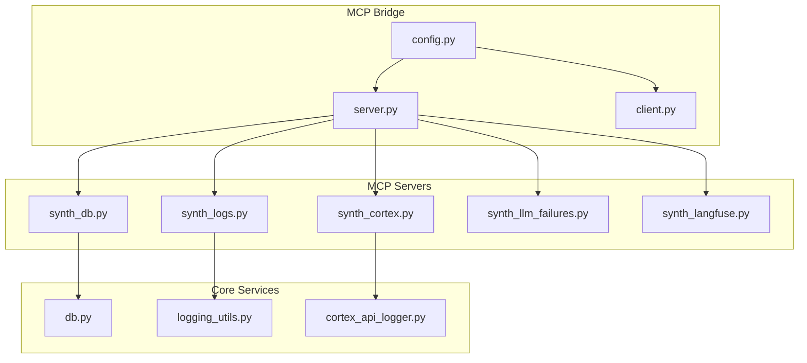

**Diagram sources**
- [core/mcp_bridge/server.py](file://core/mcp_bridge/server.py)
- [core/mcp_bridge/client.py](file://core/mcp_bridge/client.py)
- [core/mcp_bridge/config.py](file://core/mcp_bridge/config.py)
- [mcp_servers/synth_db.py](file://mcp_servers/synth_db.py)
- [mcp_servers/synth_logs.py](file://mcp_servers/synth_logs.py)
- [mcp_servers/synth_cortex.py](file://mcp_servers/synth_cortex.py)
- [mcp_servers/synth_llm_failures.py](file://mcp_servers/synth_llm_failures.py)
- [mcp_servers/synth_langfuse.py](file://mcp_servers/synth_langfuse.py)
- [core/db.py](file://core/db.py)
- [core/logging_utils.py](file://core/logging_utils.py)
- [core/cortex_api_logger.py](file://core/cortex_api_logger.py)

**Section sources**
- [core/mcp_bridge/server.py](file://core/mcp_bridge/server.py)
- [core/mcp_bridge/client.py](file://core/mcp_bridge/client.py)
- [core/mcp_bridge/config.py](file://core/mcp_bridge/config.py)
- [mcp_servers/synth_db.py](file://mcp_servers/synth_db.py)
- [mcp_servers/synth_logs.py](file://mcp_servers/synth_logs.py)
- [mcp_servers/synth_cortex.py](file://mcp_servers/synth_cortex.py)
- [mcp_servers/synth_llm_failures.py](file://mcp_servers/synth_llm_failures.py)
- [mcp_servers/synth_langfuse.py](file://mcp_servers/synth_langfuse.py)
- [core/db.py](file://core/db.py)
- [core/logging_utils.py](file://core/logging_utils.py)
- [core/cortex_api_logger.py](file://core/cortex_api_logger.py)

## Core Components
- MCP Server Runtime: Hosts tool definitions, resource handlers, and prompt templates; manages lifecycle and transport.
- MCP Client: Connects to MCP servers, discovers tools/resources, invokes calls, and processes results/errors.
- MCP Configuration: Centralized settings for server endpoints, authentication, and feature toggles.

Key responsibilities:
- Tool registration and validation
- Resource access control and templating
- Prompt template rendering and injection
- Error mapping and structured responses
- Security boundaries and access controls

**Section sources**
- [core/mcp_bridge/server.py](file://core/mcp_bridge/server.py)
- [core/mcp_bridge/client.py](file://core/mcp_bridge/client.py)
- [core/mcp_bridge/config.py](file://core/mcp_bridge/config.py)

## Architecture Overview
The MCP architecture separates concerns between the bridge layer and domain-specific servers. The bridge abstracts protocol details while each server focuses on a specific capability area.

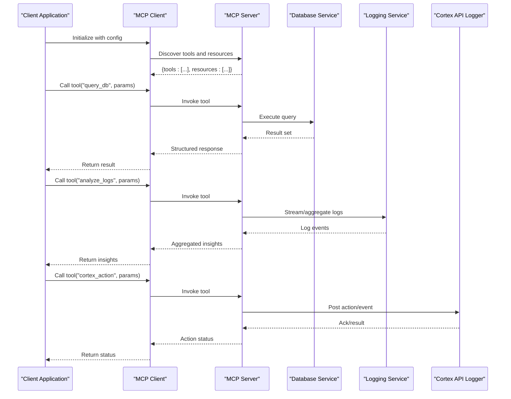

**Diagram sources**
- [core/mcp_bridge/client.py](file://core/mcp_bridge/client.py)
- [core/mcp_bridge/server.py](file://core/mcp_bridge/server.py)
- [mcp_servers/synth_db.py](file://mcp_servers/synth_db.py)
- [mcp_servers/synth_logs.py](file://mcp_servers/synth_logs.py)
- [mcp_servers/synth_cortex.py](file://mcp_servers/synth_cortex.py)
- [core/db.py](file://core/db.py)
- [core/logging_utils.py](file://core/logging_utils.py)
- [core/cortex_api_logger.py](file://core/cortex_api_logger.py)

## Detailed Component Analysis

### MCP Server Runtime
Responsibilities:
- Define and register tools with schemas and descriptions
- Expose resources with URIs and access policies
- Render prompt templates with context variables
- Handle request/response lifecycle and error propagation

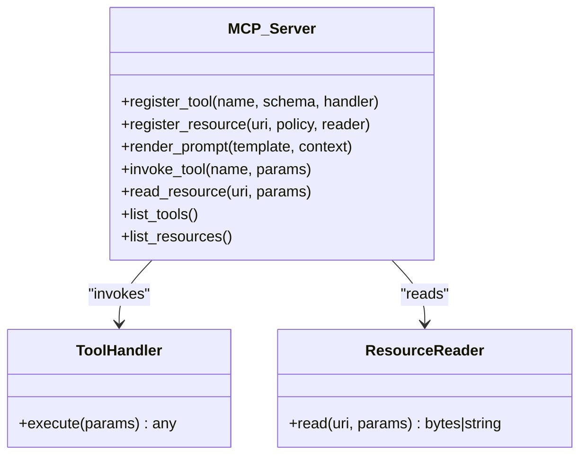

**Diagram sources**
- [core/mcp_bridge/server.py](file://core/mcp_bridge/server.py)

**Section sources**
- [core/mcp_bridge/server.py](file://core/mcp_bridge/server.py)

### MCP Client
Responsibilities:
- Connect to MCP servers using configured endpoints
- Discover available tools and resources
- Serialize/deserialize parameters and results
- Implement retries and timeouts
- Normalize errors into consistent structures

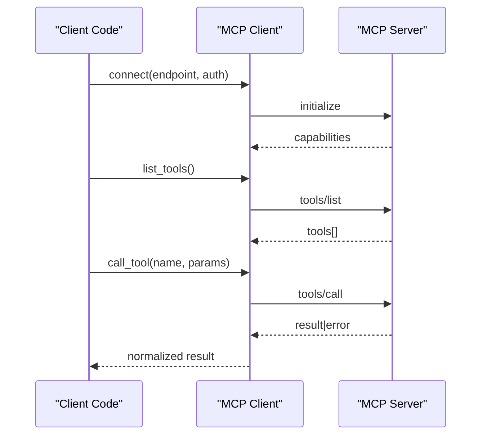

**Diagram sources**
- [core/mcp_bridge/client.py](file://core/mcp_bridge/client.py)
- [core/mcp_bridge/server.py](file://core/mcp_bridge/server.py)

**Section sources**
- [core/mcp_bridge/client.py](file://core/mcp_bridge/client.py)

### MCP Configuration
Responsibilities:
- Define server endpoints, authentication tokens, and scopes
- Toggle features per environment (dev/staging/prod)
- Provide defaults and validation for required fields

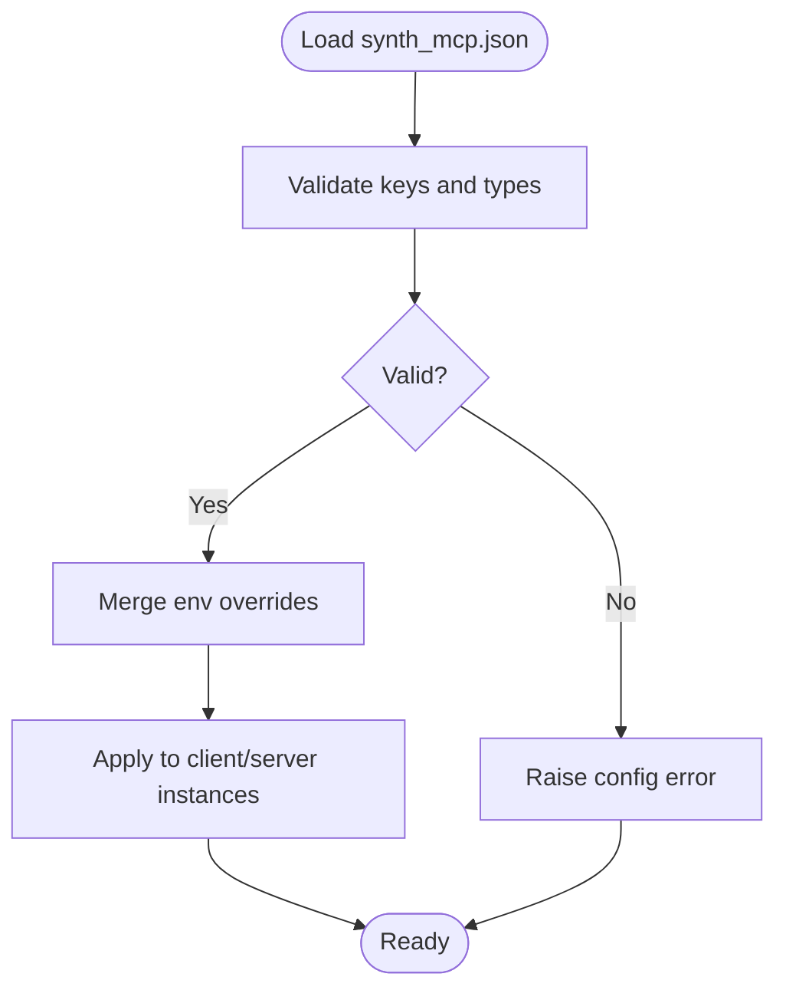

**Diagram sources**
- [config/synth_mcp.json](file://config/synth_mcp.json)
- [core/mcp_bridge/config.py](file://core/mcp_bridge/config.py)

**Section sources**
- [core/mcp_bridge/config.py](file://core/mcp_bridge/config.py)
- [config/synth_mcp.json](file://config/synth_mcp.json)

### Database Query Tools (synth_db)
Capabilities:
- Read-only and write-safe query execution
- Parameterized queries to prevent injection
- Pagination and result size limits
- Schema introspection helpers

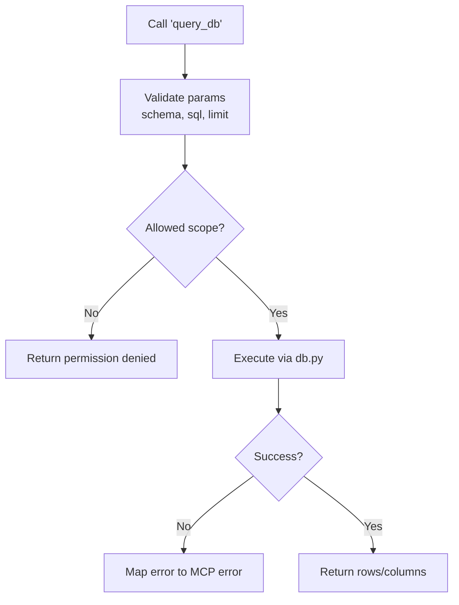

**Diagram sources**
- [mcp_servers/synth_db.py](file://mcp_servers/synth_db.py)
- [core/db.py](file://core/db.py)

**Section sources**
- [mcp_servers/synth_db.py](file://mcp_servers/synth_db.py)
- [core/db.py](file://core/db.py)

### Log Analysis Tools (synth_logs)
Capabilities:
- Filter logs by time range, level, and tags
- Aggregate counts and extract anomalies
- Stream large outputs safely
- Integrate with logging utilities for consistent formatting

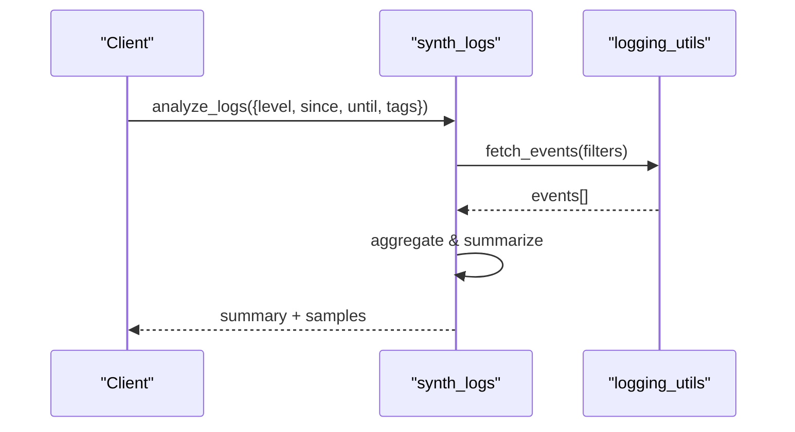

**Diagram sources**
- [mcp_servers/synth_logs.py](file://mcp_servers/synth_logs.py)
- [core/logging_utils.py](file://core/logging_utils.py)

**Section sources**
- [mcp_servers/synth_logs.py](file://mcp_servers/synth_logs.py)
- [core/logging_utils.py](file://core/logging_utils.py)

### Cortex Integration (synth_cortex)
Capabilities:
- Post actions/events to Cortex API logger
- Retrieve recent cortex entries
- Enforce scope-based permissions
- Map errors to user-friendly messages

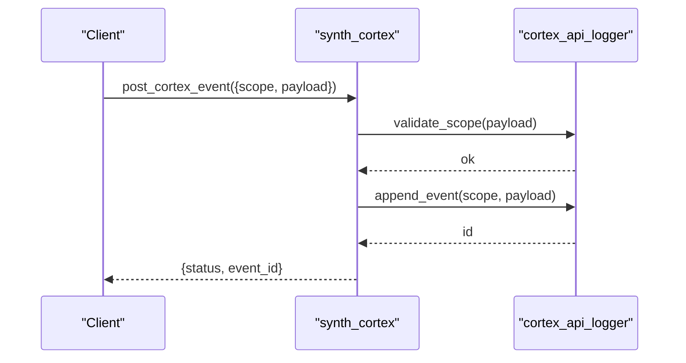

**Diagram sources**
- [mcp_servers/synth_cortex.py](file://mcp_servers/synth_cortex.py)
- [core/cortex_api_logger.py](file://core/cortex_api_logger.py)

**Section sources**
- [mcp_servers/synth_cortex.py](file://mcp_servers/synth_cortex.py)
- [core/cortex_api_logger.py](file://core/cortex_api_logger.py)

### LLM Failure Logging (synth_llm_failures)
Capabilities:
- Record LLM invocation failures with context
- Query failure history by model, endpoint, and error type
- Generate summaries for alerting and dashboards

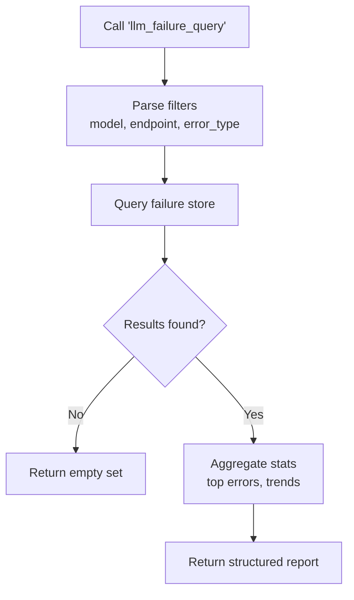

**Diagram sources**
- [mcp_servers/synth_llm_failures.py](file://mcp_servers/synth_llm_failures.py)

**Section sources**
- [mcp_servers/synth_llm_failures.py](file://mcp_servers/synth_llm_failures.py)

### Langfuse Integration (synth_langfuse)
Capabilities:
- Export traces and spans to Langfuse
- Query trace metadata and performance metrics
- Correlate traces with application events

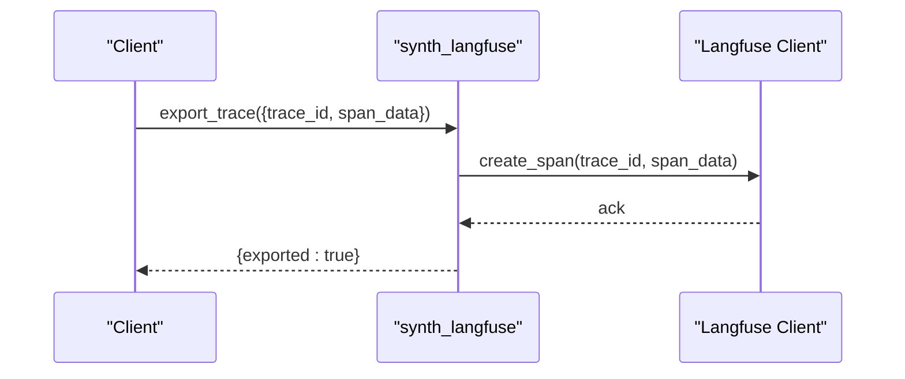

**Diagram sources**
- [mcp_servers/synth_langfuse.py](file://mcp_servers/synth_langfuse.py)

**Section sources**
- [mcp_servers/synth_langfuse.py](file://mcp_servers/synth_langfuse.py)

### Log MCP Utility (tools/synth_log_mcp)
Purpose:
- Standalone utility to interact with MCP log tools from CLI or scripts
- Demonstrates tool calling patterns and error handling

Usage pattern:
- Load MCP client configuration
- Discover log-related tools
- Invoke analyze_logs with filters
- Print structured output

**Section sources**
- [tools/synth_log_mcp.py](file://tools/synth_log_mcp.py)

## Dependency Analysis
The MCP servers depend on core services for data access and logging. The bridge layer ensures decoupling and consistent behavior across all tools.

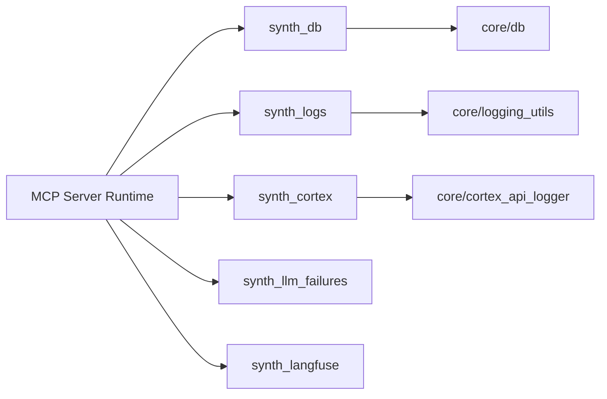

**Diagram sources**
- [core/mcp_bridge/server.py](file://core/mcp_bridge/server.py)
- [mcp_servers/synth_db.py](file://mcp_servers/synth_db.py)
- [mcp_servers/synth_logs.py](file://mcp_servers/synth_logs.py)
- [mcp_servers/synth_cortex.py](file://mcp_servers/synth_cortex.py)
- [mcp_servers/synth_llm_failures.py](file://mcp_servers/synth_llm_failures.py)
- [mcp_servers/synth_langfuse.py](file://mcp_servers/synth_langfuse.py)
- [core/db.py](file://core/db.py)
- [core/logging_utils.py](file://core/logging_utils.py)
- [core/cortex_api_logger.py](file://core/cortex_api_logger.py)

**Section sources**
- [core/mcp_bridge/server.py](file://core/mcp_bridge/server.py)
- [mcp_servers/synth_db.py](file://mcp_servers/synth_db.py)
- [mcp_servers/synth_logs.py](file://mcp_servers/synth_logs.py)
- [mcp_servers/synth_cortex.py](file://mcp_servers/synth_cortex.py)
- [mcp_servers/synth_llm_failures.py](file://mcp_servers/synth_llm_failures.py)
- [mcp_servers/synth_langfuse.py](file://mcp_servers/synth_langfuse.py)
- [core/db.py](file://core/db.py)
- [core/logging_utils.py](file://core/logging_utils.py)
- [core/cortex_api_logger.py](file://core/cortex_api_logger.py)

## Performance Considerations
- Use parameterized queries and enforce strict schemas to avoid expensive parsing and injection risks
- Limit result sets and implement pagination for large datasets
- Stream logs instead of loading entire files into memory
- Cache frequently accessed read-only resources where appropriate
- Set sensible timeouts and retry policies in the MCP client
- Avoid synchronous blocking operations in tool handlers; offload heavy work to background tasks

[No sources needed since this section provides general guidance]

## Troubleshooting Guide
Common issues and resolutions:
- Connection failures: Verify endpoint URLs, authentication tokens, and network reachability
- Permission errors: Check role-based access controls and allowed scopes for tools and resources
- Timeouts: Increase client timeout values or optimize backend queries
- Schema mismatches: Ensure tool parameters match declared schemas exactly
- Log aggregation errors: Validate filter formats and ensure log storage is accessible

Debugging steps:
- Enable verbose logging in the MCP client and server
- Inspect error mappings returned by tools
- Use the log MCP utility to reproduce issues locally
- Review tests for expected behaviors and edge cases

**Section sources**
- [core/mcp_bridge/client.py](file://core/mcp_bridge/client.py)
- [core/mcp_bridge/server.py](file://core/mcp_bridge/server.py)
- [tools/synth_log_mcp.py](file://tools/synth_log_mcp.py)
- [tests/test_synth_db_mcp.py](file://tests/test_synth_db_mcp.py)

## Conclusion
Synthetic Heart’s MCP integration provides a robust, modular framework for exposing tools and resources through a standardized protocol. By separating the bridge layer from domain-specific servers, it enables secure, scalable, and maintainable integrations for database queries, log analysis, Cortex events, and observability. Following the best practices outlined here will help you develop reliable MCP tools and integrate them confidently into your applications.

[No sources needed since this section summarizes without analyzing specific files]

## Appendices

### MCP Client Implementation Examples
- Initialize the client with configuration from synth_mcp.json
- Discover tools and resources
- Invoke tools with validated parameters
- Handle structured errors and retries

Example references:
- Client initialization and discovery: [core/mcp_bridge/client.py](file://core/mcp_bridge/client.py)
- Tool calling patterns: [tools/synth_log_mcp.py](file://tools/synth_log_mcp.py)
- Test-driven examples: [tests/test_synth_db_mcp.py](file://tests/test_synth_db_mcp.py)

**Section sources**
- [core/mcp_bridge/client.py](file://core/mcp_bridge/client.py)
- [tools/synth_log_mcp.py](file://tools/synth_log_mcp.py)
- [tests/test_synth_db_mcp.py](file://tests/test_synth_db_mcp.py)

### Tool Calling Patterns
- Always validate inputs against tool schemas
- Use parameterized queries and safe APIs
- Return structured responses with clear success/error states
- Implement idempotency for write operations

**Section sources**
- [core/mcp_bridge/server.py](file://core/mcp_bridge/server.py)
- [mcp_servers/synth_db.py](file://mcp_servers/synth_db.py)

### Error Handling Strategies
- Map underlying exceptions to MCP error codes
- Include actionable messages and context identifiers
- Provide retry hints when applicable
- Log errors securely without leaking sensitive data

**Section sources**
- [core/mcp_bridge/client.py](file://core/mcp_bridge/client.py)
- [core/mcp_bridge/server.py](file://core/mcp_bridge/server.py)

### Security Considerations and Access Controls
- Enforce least privilege for tool access
- Validate and sanitize all inputs
- Restrict database operations to read-only where possible
- Scope Cortex events to authorized domains
- Rotate and encrypt credentials stored in configuration

**Section sources**
- [core/mcp_bridge/config.py](file://core/mcp_bridge/config.py)
- [mcp_servers/synth_db.py](file://mcp_servers/synth_db.py)
- [mcp_servers/synth_cortex.py](file://mcp_servers/synth_cortex.py)

### Best Practices for MCP Tool Development
- Keep tool handlers small and focused
- Use clear, descriptive names and schemas
- Document parameters and return values
- Add unit tests for edge cases
- Monitor performance and add caching where beneficial

**Section sources**
- [core/mcp_bridge/server.py](file://core/mcp_bridge/server.py)
- [mcp_servers/synth_logs.py](file://mcp_servers/synth_logs.py)
- [mcp_servers/synth_llm_failures.py](file://mcp_servers/synth_llm_failures.py)
- [mcp_servers/synth_langfuse.py](file://mcp_servers/synth_langfuse.py)