# System Monitoring Tools

<cite>
**Referenced Files in This Document**
- [synth_llm_failures.py](file://mcp_servers/synth_llm_failures.py)
- [synth_logs.py](file://mcp_servers/synth_logs.py)
- [synth_db.py](file://mcp_servers/synth_db.py)
- [synth_langfuse.py](file://mcp_servers/synth_langfuse.py)
- [llm_failure_log.py](file://core/llm_failure_log.py)
- [cortex_api_logger.py](file://core/cortex_api_logger.py)
- [live_api_logger.py](file://core/live_api_logger.py)
- [logging_utils.py](file://core/logging_utils.py)
- [soul_observability.py](file://core/soul/observability.py)
- [mcporter.json](file://config/mcporter.json)
- [synth_mcp.json](file://config/synth_mcp.json)
- [monitoring_and_scheduling.rst](file://docs/monitoring_and_scheduling.rst)
- [logging.rst](file://docs/logging.rst)
</cite>

## Table of Contents
1. [Introduction](#introduction)
2. [Project Structure](#project-structure)
3. [Core Components](#core-components)
4. [Architecture Overview](#architecture-overview)
5. [Detailed Component Analysis](#detailed-component-analysis)
6. [Dependency Analysis](#dependency-analysis)
7. [Performance Considerations](#performance-considerations)
8. [Troubleshooting Guide](#troubleshooting-guide)
9. [Conclusion](#conclusion)
10. [Appendices](#appendices)

## Introduction
This document explains the system monitoring tools exposed via MCP (Model Context Protocol). It covers LLM failure tracking, API call logging, performance metrics collection, and system health monitoring. It also documents alerting mechanisms, metric aggregation, reporting capabilities, agent performance monitoring, resource usage tracking, and diagnostic workflows with examples for dashboards, alert configurations, and troubleshooting procedures.

## Project Structure
The monitoring stack is composed of:
- MCP servers that expose monitoring tools to clients
- Core logging and observability modules that capture events and metrics
- Configuration files that wire MCP transport and tool definitions
- Documentation that guides operational use

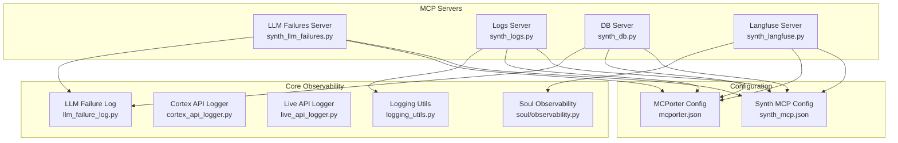

**Diagram sources**
- [synth_llm_failures.py](file://mcp_servers/synth_llm_failures.py)
- [synth_logs.py](file://mcp_servers/synth_logs.py)
- [synth_db.py](file://mcp_servers/synth_db.py)
- [synth_langfuse.py](file://mcp_servers/synth_langfuse.py)
- [llm_failure_log.py](file://core/llm_failure_log.py)
- [cortex_api_logger.py](file://core/cortex_api_logger.py)
- [live_api_logger.py](file://core/live_api_logger.py)
- [soul_observability.py](file://core/soul/observability.py)
- [logging_utils.py](file://core/logging_utils.py)
- [mcporter.json](file://config/mcporter.json)
- [synth_mcp.json](file://config/synth_mcp.json)

**Section sources**
- [monitoring_and_scheduling.rst](file://docs/monitoring_and_scheduling.rst)
- [logging.rst](file://docs/logging.rst)

## Core Components
- LLM Failure Tracking: Centralized capture and querying of LLM errors, including error types, timestamps, payloads, and recovery actions.
- API Call Logging: Structured logs for Cortex and Live API calls, capturing request/response metadata, latency, and status codes.
- Performance Metrics Collection: Aggregation of key performance indicators such as latency percentiles, throughput, and error rates.
- System Health Monitoring: Health checks for services, database connectivity, and external endpoints.
- Alerting and Reporting: Threshold-based alerts and report generation for anomalies and SLA breaches.

Key implementation anchors:
- LLM failure log module for persistent storage and retrieval
- API logger modules for structured event emission
- Observability module for metrics and traces
- MCP server modules exposing query and reporting tools

**Section sources**
- [llm_failure_log.py](file://core/llm_failure_log.py)
- [cortex_api_logger.py](file://core/cortex_api_logger.py)
- [live_api_logger.py](file://core/live_api_logger.py)
- [soul_observability.py](file://core/soul/observability.py)

## Architecture Overview
The monitoring architecture integrates MCP servers with core observability components to provide a unified interface for querying failures, logs, metrics, and health.

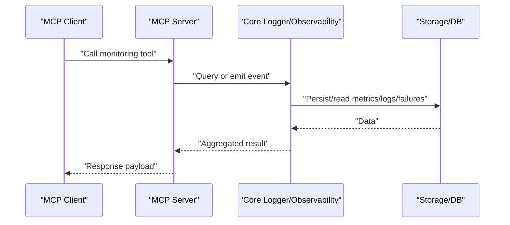

**Diagram sources**
- [synth_llm_failures.py](file://mcp_servers/synth_llm_failures.py)
- [synth_logs.py](file://mcp_servers/synth_logs.py)
- [synth_db.py](file://mcp_servers/synth_db.py)
- [synth_langfuse.py](file://mcp_servers/synth_langfuse.py)
- [llm_failure_log.py](file://core/llm_failure_log.py)
- [cortex_api_logger.py](file://core/cortex_api_logger.py)
- [live_api_logger.py](file://core/live_api_logger.py)
- [soul_observability.py](file://core/soul/observability.py)

## Detailed Component Analysis

### LLM Failure Tracking
Purpose:
- Capture LLM invocation failures with rich context
- Provide query and filtering capabilities via MCP
- Support alerting on recurring or critical failures

Key responsibilities:
- Record failure events with timestamp, model, endpoint, error code, message, and optional payload
- Expose tools to list recent failures, filter by severity, model, or time window
- Aggregate failure counts and trends for reporting

Operational notes:
- Use MCP tools to retrieve failure summaries and drill down into individual incidents
- Integrate with alerting rules based on failure rate thresholds

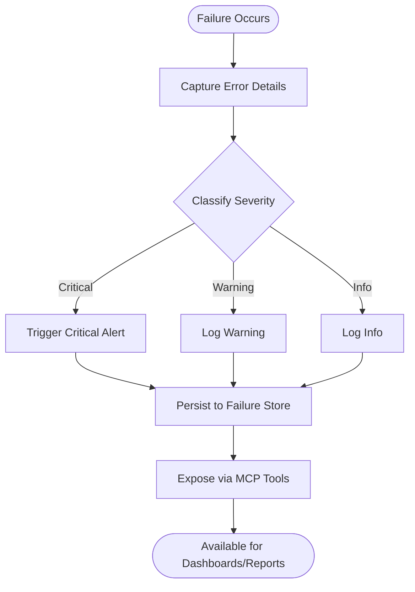

**Diagram sources**
- [synth_llm_failures.py](file://mcp_servers/synth_llm_failures.py)
- [llm_failure_log.py](file://core/llm_failure_log.py)

**Section sources**
- [synth_llm_failures.py](file://mcp_servers/synth_llm_failures.py)
- [llm_failure_log.py](file://core/llm_failure_log.py)

### API Call Logging (Cortex and Live)
Purpose:
- Emit structured logs for API calls across Cortex and Live subsystems
- Include request metadata, response status, latency, and error details
- Enable correlation across distributed components

Key responsibilities:
- Wrap API invocations with logging hooks
- Normalize log schema for consistent analysis
- Expose log queries via MCP for real-time inspection

Operational notes:
- Use MCP tools to filter logs by service, endpoint, status code, or time range
- Combine with failure logs to correlate errors with upstream API issues

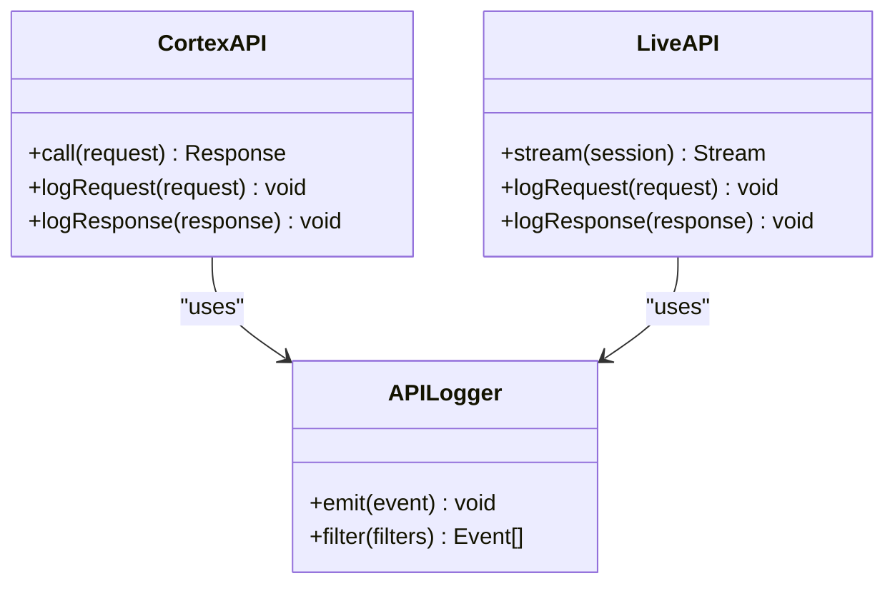

**Diagram sources**
- [cortex_api_logger.py](file://core/cortex_api_logger.py)
- [live_api_logger.py](file://core/live_api_logger.py)

**Section sources**
- [cortex_api_logger.py](file://core/cortex_api_logger.py)
- [live_api_logger.py](file://core/live_api_logger.py)

### Performance Metrics Collection
Purpose:
- Collect and aggregate performance metrics such as latency, throughput, and error rates
- Provide time-series data for dashboards and alerting
- Support percentile calculations and anomaly detection

Key responsibilities:
- Instrument key operations to record timing and outcomes
- Aggregate metrics at configurable intervals
- Expose metrics via MCP for consumption by monitoring systems

Operational notes:
- Configure metric retention and aggregation windows
- Use MCP tools to query current metrics and historical trends

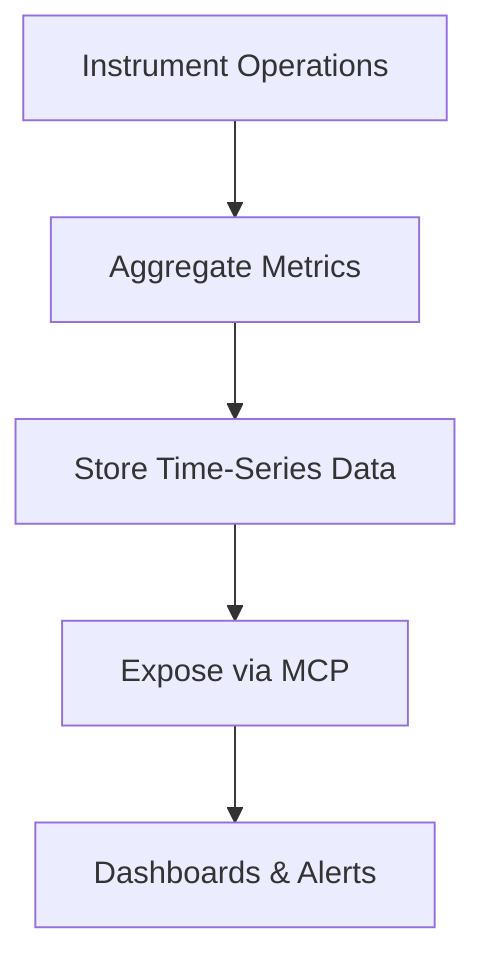

**Diagram sources**
- [soul_observability.py](file://core/soul/observability.py)

**Section sources**
- [soul_observability.py](file://core/soul/observability.py)

### System Health Monitoring
Purpose:
- Monitor service health, database connectivity, and external endpoint availability
- Provide health check endpoints and status aggregation
- Trigger alerts on degraded or failed states

Key responsibilities:
- Implement periodic health probes
- Aggregate health status across components
- Expose health information via MCP for centralized monitoring

Operational notes:
- Define health check intervals and thresholds
- Use MCP tools to retrieve current health status and historical trends

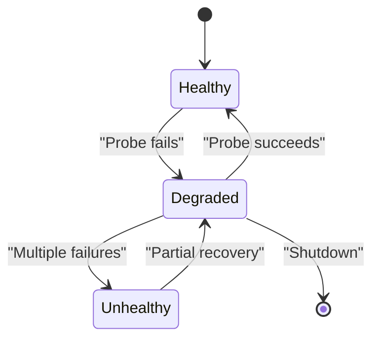

**Diagram sources**
- [synth_db.py](file://mcp_servers/synth_db.py)

**Section sources**
- [synth_db.py](file://mcp_servers/synth_db.py)

### Alerting Mechanisms
Purpose:
- Detect anomalies and threshold breaches in failures, logs, and metrics
- Generate alerts with actionable context
- Integrate with notification channels

Key responsibilities:
- Evaluate conditions against configured thresholds
- Emit alert events with severity and metadata
- Provide MCP tools to query active alerts and history

Operational notes:
- Configure alert rules per component and environment
- Use MCP tools to review alert timelines and resolution status

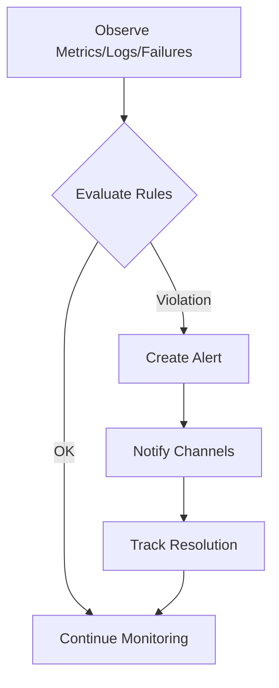

**Diagram sources**
- [synth_llm_failures.py](file://mcp_servers/synth_llm_failures.py)
- [soul_observability.py](file://core/soul/observability.py)

**Section sources**
- [synth_llm_failures.py](file://mcp_servers/synth_llm_failures.py)
- [soul_observability.py](file://core/soul/observability.py)

### Metric Aggregation and Reporting
Purpose:
- Aggregate metrics across services and time windows
- Generate reports for SLA compliance and performance reviews
- Provide MCP tools for ad-hoc queries and exports

Key responsibilities:
- Compute aggregates such as averages, percentiles, and totals
- Format outputs for dashboards and external systems
- Support filtering by tags, models, and endpoints

Operational notes:
- Configure aggregation intervals and retention policies
- Use MCP tools to export reports and integrate with BI tools

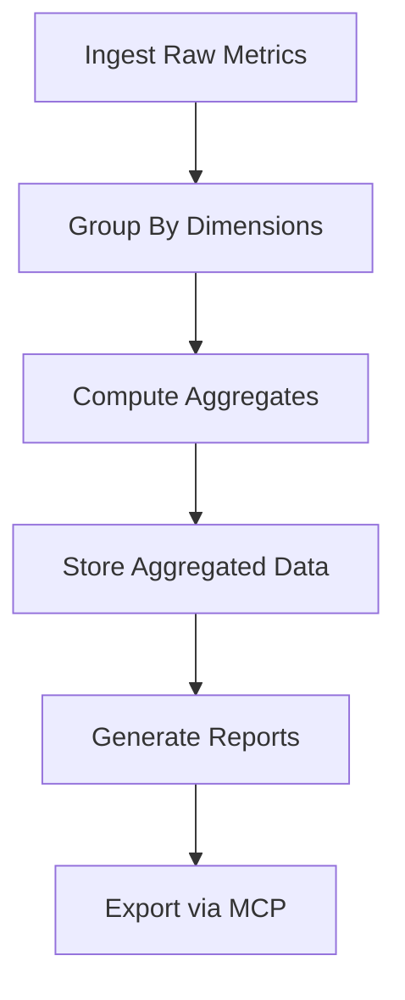

**Diagram sources**
- [soul_observability.py](file://core/soul/observability.py)

**Section sources**
- [soul_observability.py](file://core/soul/observability.py)

### Monitoring Agent Performance
Purpose:
- Track agent execution times, success rates, and error distributions
- Correlate agent performance with underlying API and system health
- Provide insights into bottlenecks and optimization opportunities

Key responsibilities:
- Instrument agent lifecycle events
- Record performance metrics per agent and operation
- Expose agent-specific queries via MCP

Operational notes:
- Use MCP tools to compare agent performance over time
- Investigate correlations with external API latency and failures

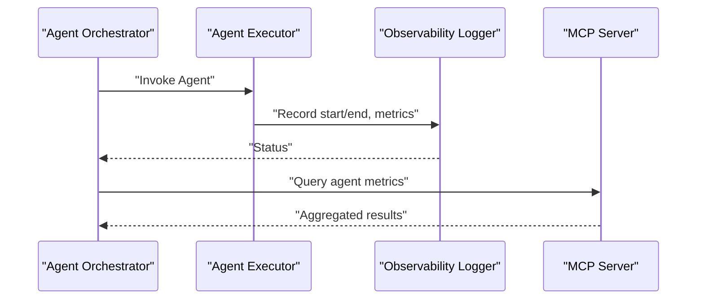

**Diagram sources**
- [soul_observability.py](file://core/soul/observability.py)

**Section sources**
- [soul_observability.py](file://core/soul/observability.py)

### Resource Usage Tracking
Purpose:
- Monitor CPU, memory, and I/O usage for critical components
- Detect resource exhaustion and capacity constraints
- Provide MCP tools for resource utilization queries

Key responsibilities:
- Collect system-level metrics at regular intervals
- Aggregate and store resource usage data
- Expose resource metrics via MCP for dashboards

Operational notes:
- Configure sampling rates to balance accuracy and overhead
- Use MCP tools to identify hotspots and plan scaling

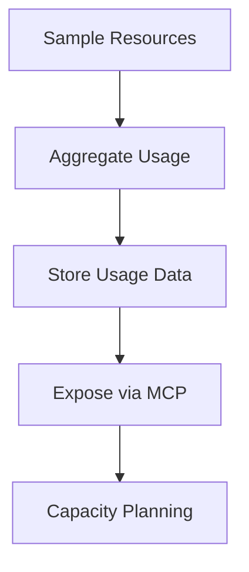

**Diagram sources**
- [soul_observability.py](file://core/soul/observability.py)

**Section sources**
- [soul_observability.py](file://core/soul/observability.py)

### Diagnostic Workflows
Purpose:
- Provide step-by-step procedures to diagnose common issues
- Leverage MCP tools to gather evidence and isolate root causes
- Document remediation steps and preventive measures

Key responsibilities:
- Define diagnostic playbooks for failures, latency spikes, and health degradation
- Integrate MCP queries into automated diagnostics
- Maintain up-to-date troubleshooting guides

Operational notes:
- Use MCP tools to collect logs, metrics, and health status in parallel
- Correlate findings across components to pinpoint issues

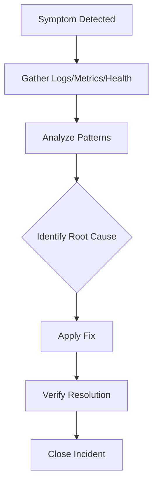

**Diagram sources**
- [synth_logs.py](file://mcp_servers/synth_logs.py)
- [synth_llm_failures.py](file://mcp_servers/synth_llm_failures.py)
- [synth_db.py](file://mcp_servers/synth_db.py)

**Section sources**
- [synth_logs.py](file://mcp_servers/synth_logs.py)
- [synth_llm_failures.py](file://mcp_servers/synth_llm_failures.py)
- [synth_db.py](file://mcp_servers/synth_db.py)

## Dependency Analysis
The MCP servers depend on core observability modules for data ingestion and storage. Configuration files define transport and tool mappings.

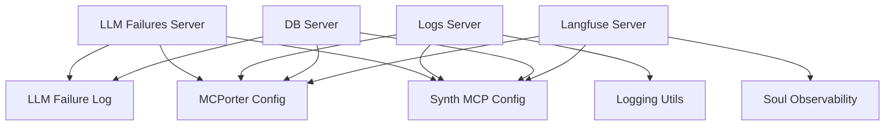

**Diagram sources**
- [synth_llm_failures.py](file://mcp_servers/synth_llm_failures.py)
- [synth_logs.py](file://mcp_servers/synth_logs.py)
- [synth_db.py](file://mcp_servers/synth_db.py)
- [synth_langfuse.py](file://mcp_servers/synth_langfuse.py)
- [llm_failure_log.py](file://core/llm_failure_log.py)
- [logging_utils.py](file://core/logging_utils.py)
- [soul_observability.py](file://core/soul/observability.py)
- [mcporter.json](file://config/mcporter.json)
- [synth_mcp.json](file://config/synth_mcp.json)

**Section sources**
- [mcporter.json](file://config/mcporter.json)
- [synth_mcp.json](file://config/synth_mcp.json)

## Performance Considerations
- Sampling and Batching: Configure appropriate sampling rates for metrics and logs to reduce overhead while maintaining visibility.
- Aggregation Windows: Tune aggregation intervals to balance freshness and storage costs.
- Backpressure: Ensure MCP servers handle high load gracefully with timeouts and retries.
- Storage Retention: Set retention policies for logs and metrics to manage disk usage and query performance.
- Indexing: Optimize indexes on frequently queried fields such as timestamps, error codes, and model names.

[No sources needed since this section provides general guidance]

## Troubleshooting Guide
Common issues and resolutions:
- LLM Failures Spike:
  - Use MCP tools to list recent failures and filter by model and endpoint
  - Check upstream API health and rate limits
  - Review error messages and payloads for actionable clues
- High Latency:
  - Query performance metrics for latency percentiles
  - Correlate with resource usage and external API response times
  - Identify bottlenecks in agent execution paths
- Health Degradation:
  - Inspect health check results for database and external endpoints
  - Validate configuration and connectivity settings
  - Restart affected services if necessary

Operational tips:
- Use MCP tools to gather logs, metrics, and health status in parallel
- Maintain runbooks for frequent incident types
- Automate alerting and escalation for critical failures

**Section sources**
- [synth_llm_failures.py](file://mcp_servers/synth_llm_failures.py)
- [synth_logs.py](file://mcp_servers/synth_logs.py)
- [synth_db.py](file://mcp_servers/synth_db.py)

## Conclusion
The MCP-based monitoring stack provides comprehensive visibility into LLM failures, API calls, performance metrics, and system health. By leveraging the provided tools, teams can implement robust alerting, generate actionable reports, and maintain high availability through proactive monitoring and rapid diagnosis.

[No sources needed since this section summarizes without analyzing specific files]

## Appendices

### Example Monitoring Dashboards
- LLM Failure Trends: Time series of failure counts by model and severity
- API Latency Heatmap: Latency distribution across endpoints and time windows
- System Health Status: Real-time health indicators for services and dependencies
- Resource Utilization: CPU, memory, and I/O usage over time

[No sources needed since this section describes conceptual dashboards]

### Alert Configuration Examples
- Failure Rate Alert: Trigger when failure rate exceeds threshold within a time window
- Latency Alert: Trigger when p95 latency exceeds SLA target
- Health Alert: Trigger when any critical component reports unhealthy status

[No sources needed since this section describes conceptual configurations]

### MCP Tool Usage Examples
- Query Recent Failures: Retrieve last N failures with filters
- Fetch API Logs: Get structured logs for a specific endpoint and time range
- Get System Health: Return aggregated health status across components
- Export Metrics: Download aggregated metrics for analysis

[No sources needed since this section describes conceptual usage]