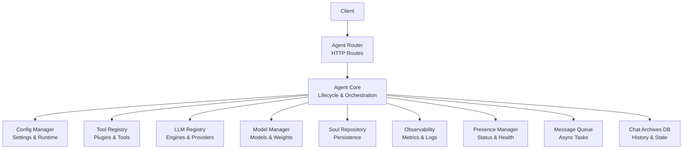
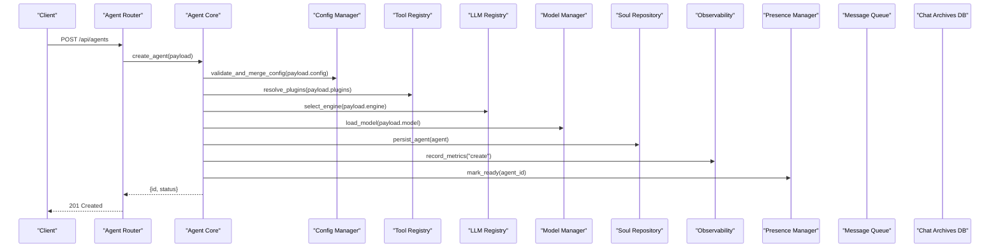
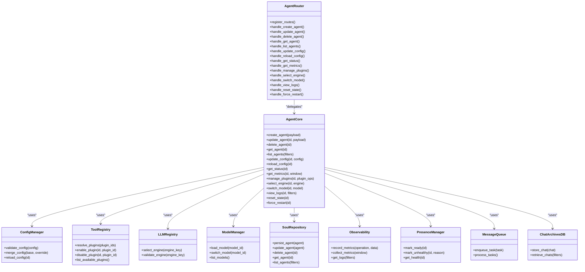

# Agent Management Endpoints

<cite>
**Referenced Files in This Document**
- [main.py](file://main.py)
- [core/agent_core.py](file://core/agent_core.py)
- [core/agent_router.py](file://core/agent_router.py)
- [core/config_manager.py](file://core/config_manager.py)
- [core/webui.py](file://core/webui.py)
- [core/soul/repository.py](file://core/soul/repository.py)
- [core/soul/schemas.py](file://core/soul/schemas.py)
- [core/soul/observability.py](file://core/soul/observability.py)
- [core/tool_registry.py](file://core/tool_registry.py)
- [core/plugin_instance.py](file://core/plugin_instance.py)
- [core/llm_registry.py](file://core/llm_registry.py)
- [core/model_manager.py](file://core/model_manager.py)
- [core/presence_manager.py](file://core/presence_manager.py)
- [core/message_queue.py](file://core/message_queue.py)
- [core/chat_archives_db.py](file://core/chat_archives_db.py)
- [core/db_backends.py](file://core/db_backends.py)
- [core/external_endpoints/models.py](file://core/external_endpoints/models.py)
- [core/external_endpoints/registry.py](file://core/external_endpoints/registry.py)
- [engines/agent/agent_base.py](file://engines/agent/agent_base.py)
- [plugins/agent_plugin/agent_plugin.py](file://plugins/agent_plugin/agent_plugin.py)
- [providers/openai.json](file://providers/openai.json)
- [providers/gemini.json](file://providers/gemini.json)
- [providers/custom.json](file://providers/custom.json)
</cite>

## Table of Contents
1. [Introduction](#introduction)
2. [Project Structure](#project-structure)
3. [Core Components](#core-components)
4. [Architecture Overview](#architecture-overview)
5. [Detailed Component Analysis](#detailed-component-analysis)
6. [Dependency Analysis](#dependency-analysis)
7. [Performance Considerations](#performance-considerations)
8. [Troubleshooting Guide](#troubleshooting-guide)
9. [Conclusion](#conclusion)
10. [Appendices](#appendices)

## Introduction
This document specifies the agent management REST endpoints for creating, updating, deleting, and monitoring AI agents. It covers lifecycle operations, configuration updates, status monitoring, and performance metrics. It also provides parameter specifications for agent creation, plugin configuration, and runtime settings, along with examples for common operations and troubleshooting endpoints.

## Project Structure
The agent management API is implemented as a set of HTTP endpoints exposed by the application server. The routing layer delegates to core services that manage agent lifecycle, configuration, plugins, models, observability, and persistence.

**Diagram sources**
- [core/agent_router.py:1-200](file://core/agent_router.py#L1-L200)
- [core/agent_core.py:1-300](file://core/agent_core.py#L1-L300)
- [core/config_manager.py:1-200](file://core/config_manager.py#L1-L200)
- [core/tool_registry.py:1-200](file://core/tool_registry.py#L1-L200)
- [core/llm_registry.py:1-200](file://core/llm_registry.py#L1-L200)
- [core/model_manager.py:1-200](file://core/model_manager.py#L1-L200)
- [core/soul/repository.py:1-200](file://core/soul/repository.py#L1-L200)
- [core/soul/observability.py:1-200](file://core/soul/observability.py#L1-L200)
- [core/presence_manager.py:1-200](file://core/presence_manager.py#L1-L200)
- [core/message_queue.py:1-200](file://core/message_queue.py#L1-L200)
- [core/chat_archives_db.py:1-200](file://core/chat_archives_db.py#L1-L200)

**Section sources**
- [main.py:1-120](file://main.py#L1-L120)
- [core/agent_router.py:1-200](file://core/agent_router.py#L1-L200)

## Core Components
- Agent Router: Defines HTTP routes for agent management (CRUD, lifecycle, config, status, metrics).
- Agent Core: Implements orchestration logic for agent lifecycle, configuration validation, plugin integration, model selection, and observability hooks.
- Configuration Manager: Manages persistent settings, runtime overrides, and hot-reload behavior.
- Tool Registry: Discovers and manages plugins/tools available to agents.
- LLM Registry: Manages provider configurations and engine instances.
- Model Manager: Handles model metadata, availability, and switching.
- Soul Repository: Persists agent state, memory, and history.
- Observability: Exposes metrics, logs, and traces for monitoring.
- Presence Manager: Tracks agent health and readiness.
- Message Queue: Schedules background tasks for long-running operations.
- Chat Archives DB: Stores chat history and related artifacts.

**Section sources**
- [core/agent_core.py:1-300](file://core/agent_core.py#L1-L300)
- [core/config_manager.py:1-200](file://core/config_manager.py#L1-L200)
- [core/tool_registry.py:1-200](file://core/tool_registry.py#L1-L200)
- [core/llm_registry.py:1-200](file://core/llm_registry.py#L1-L200)
- [core/model_manager.py:1-200](file://core/model_manager.py#L1-L200)
- [core/soul/repository.py:1-200](file://core/soul/repository.py#L1-L200)
- [core/soul/observability.py:1-200](file://core/soul/observability.py#L1-L200)
- [core/presence_manager.py:1-200](file://core/presence_manager.py#L1-L200)
- [core/message_queue.py:1-200](file://core/message_queue.py#L1-L200)
- [core/chat_archives_db.py:1-200](file://core/chat_archives_db.py#L1-L200)

## Architecture Overview
The agent management API follows a layered architecture:
- HTTP Layer: Routes incoming requests to controllers.
- Controller Layer: Validates inputs, handles errors, and orchestrates calls to services.
- Service Layer: Encapsulates business logic for agent lifecycle, configuration, and integrations.
- Data Layer: Persists data via repositories and external stores.
- Observability: Collects metrics and logs across layers.

**Diagram sources**
- [core/agent_router.py:1-200](file://core/agent_router.py#L1-L200)
- [core/agent_core.py:1-300](file://core/agent_core.py#L1-L300)
- [core/config_manager.py:1-200](file://core/config_manager.py#L1-L200)
- [core/tool_registry.py:1-200](file://core/tool_registry.py#L1-L200)
- [core/llm_registry.py:1-200](file://core/llm_registry.py#L1-L200)
- [core/model_manager.py:1-200](file://core/model_manager.py#L1-L200)
- [core/soul/repository.py:1-200](file://core/soul/repository.py#L1-L200)
- [core/soul/observability.py:1-200](file://core/soul/observability.py#L1-L200)
- [core/presence_manager.py:1-200](file://core/presence_manager.py#L1-L200)
- [core/message_queue.py:1-200](file://core/message_queue.py#L1-L200)
- [core/chat_archives_db.py:1-200](file://core/chat_archives_db.py#L1-L200)

## Detailed Component Analysis

### Agent Lifecycle Endpoints
- Create Agent
  - Method: POST
  - Path: /api/agents
  - Request Body:
    - id: string (unique identifier)
    - name: string (display name)
    - description: string (optional)
    - engine: string (provider key from providers)
    - model: string (model identifier)
    - config: object (runtime settings; see Parameter Specifications)
    - plugins: array of objects (plugin configuration; see Plugin Configuration)
  - Response:
    - 201 Created: {id, name, status, created_at}
    - 400 Bad Request: validation error details
    - 500 Internal Server Error: unexpected failure
- Update Agent
  - Method: PUT
  - Path: /api/agents/{id}
  - Request Body: fields to update (subset of create payload)
  - Response:
    - 200 OK: updated agent object
    - 404 Not Found: agent not found
    - 400 Bad Request: validation error
- Delete Agent
  - Method: DELETE
  - Path: /api/agents/{id}
  - Response:
    - 204 No Content: success
    - 404 Not Found: agent not found
- Get Agent
  - Method: GET
  - Path: /api/agents/{id}
  - Response:
    - 200 OK: agent object
    - 404 Not Found: agent not found
- List Agents
  - Method: GET
  - Path: /api/agents
  - Query Parameters:
    - status: string (filter by status)
    - limit: integer (default page size)
    - offset: integer (pagination offset)
  - Response:
    - 200 OK: {items: array, total: integer}

**Section sources**
- [core/agent_router.py:1-200](file://core/agent_router.py#L1-L200)
- [core/agent_core.py:1-300](file://core/agent_core.py#L1-L300)
- [core/soul/schemas.py:1-200](file://core/soul/schemas.py#L1-L200)

### Configuration Updates
- Update Agent Configuration
  - Method: PATCH
  - Path: /api/agents/{id}/config
  - Request Body: partial config object
  - Response:
    - 200 OK: merged config
    - 400 Bad Request: validation error
    - 404 Not Found: agent not found
- Reload Configuration
  - Method: POST
  - Path: /api/agents/{id}/config/reload
  - Response:
    - 200 OK: reload status
    - 500 Internal Server Error: reload failure

**Section sources**
- [core/config_manager.py:1-200](file://core/config_manager.py#L1-L200)
- [core/agent_core.py:1-300](file://core/agent_core.py#L1-L300)

### Status Monitoring
- Get Agent Status
  - Method: GET
  - Path: /api/agents/{id}/status
  - Response:
    - 200 OK: {status, uptime, last_error, metrics_summary}
    - 404 Not Found: agent not found
- Health Check
  - Method: GET
  - Path: /api/health
  - Response:
    - 200 OK: {service_status, components}

**Section sources**
- [core/presence_manager.py:1-200](file://core/presence_manager.py#L1-L200)
- [core/soul/observability.py:1-200](file://core/soul/observability.py#L1-L200)

### Performance Metrics
- Get Metrics
  - Method: GET
  - Path: /api/agents/{id}/metrics
  - Query Parameters:
    - window: string (time window for aggregation)
  - Response:
    - 200 OK: {latency_p50, latency_p95, throughput, error_rate, resource_usage}
    - 404 Not Found: agent not found

**Section sources**
- [core/soul/observability.py:1-200](file://core/soul/observability.py#L1-L200)

### Plugin Configuration
- Enable/Disable Plugins
  - Method: PATCH
  - Path: /api/agents/{id}/plugins
  - Request Body: {enabled: boolean, plugin_id: string}
  - Response:
    - 200 OK: updated plugin state
    - 400 Bad Request: invalid plugin_id
- List Available Plugins
  - Method: GET
  - Path: /api/plugins
  - Response:
    - 200 OK: {plugins: array of plugin metadata}

**Section sources**
- [core/tool_registry.py:1-200](file://core/tool_registry.py:1-L200)
- [plugins/agent_plugin/agent_plugin.py:1-200](file://plugins/agent_plugin/agent_plugin.py#L1-L200)

### Engine and Model Management
- Select Engine
  - Method: PATCH
  - Path: /api/agents/{id}/engine
  - Request Body: {engine: string}
  - Response:
    - 200 OK: updated engine
    - 400 Bad Request: invalid engine
- Switch Model
  - Method: PATCH
  - Path: /api/agents/{id}/model
  - Request Body: {model: string}
  - Response:
    - 200 OK: updated model
    - 400 Bad Request: invalid model

**Section sources**
- [core/llm_registry.py:1-200](file://core/llm_registry.py#L1-L200)
- [core/model_manager.py:1-200](file://core/model_manager.py#L1-L200)

### Parameter Specifications
- Agent Creation Payload
  - id: string (required, unique)
  - name: string (required)
  - description: string (optional)
  - engine: string (required, must exist in providers)
  - model: string (required, must be available)
  - config: object (runtime settings)
    - temperature: float (0.0-2.0)
    - max_tokens: integer (>0)
    - top_p: float (0.0-1.0)
    - frequency_penalty: float (-2.0-2.0)
    - presence_penalty: float (-2.0-2.0)
    - timeout: integer (>0, seconds)
    - retries: integer (>=0)
    - rate_limit: integer (requests per minute)
  - plugins: array of objects
    - plugin_id: string (required)
    - enabled: boolean (default true)
    - settings: object (plugin-specific configuration)
- Example Create Request
  - POST /api/agents
  - Body:
    - id: "agent_001"
    - name: "Research Assistant"
    - engine: "openai"
    - model: "gpt-4o"
    - config: {temperature: 0.7, max_tokens: 2048, timeout: 30}
    - plugins: [{plugin_id: "web_search", enabled: true, settings: {search_depth: 2}}]

**Section sources**
- [core/soul/schemas.py:1-200](file://core/soul/schemas.py#L1-L200)
- [core/agent_core.py:1-300](file://core/agent_core.py#L1-L300)
- [providers/openai.json:1-100](file://providers/openai.json#L1-L100)
- [providers/gemini.json:1-100](file://providers/gemini.json#L1-L100)
- [providers/custom.json:1-100](file://providers/custom.json#L1-L100)

### Examples for Common Operations
- Create an Agent
  - POST /api/agents with payload as specified above
  - Expected Response: 201 Created with agent details
- Update Agent Configuration
  - PATCH /api/agents/{id}/config with partial config
  - Expected Response: 200 OK with merged config
- Monitor Agent Status
  - GET /api/agents/{id}/status
  - Expected Response: 200 OK with current status and metrics summary
- Retrieve Performance Metrics
  - GET /api/agents/{id}/metrics?window=5m
  - Expected Response: 200 OK with aggregated metrics

**Section sources**
- [core/agent_router.py:1-200](file://core/agent_router.py#L1-L200)
- [core/agent_core.py:1-300](file://core/agent_core.py#L1-L300)

### Troubleshooting Endpoints
- View Logs
  - Method: GET
  - Path: /api/agents/{id}/logs
  - Query Parameters:
    - level: string (debug, info, warn, error)
    - limit: integer (max log entries)
  - Response:
    - 200 OK: {logs: array}
- Reset Agent State
  - Method: POST
  - Path: /api/agents/{id}/reset
  - Response:
    - 200 OK: reset confirmation
    - 500 Internal Server Error: reset failure
- Force Restart
  - Method: POST
  - Path: /api/agents/{id}/restart
  - Response:
    - 200 OK: restart initiated
    - 500 Internal Server Error: restart failure

**Section sources**
- [core/soul/observability.py:1-200](file://core/soul/observability.py#L1-L200)
- [core/presence_manager.py:1-200](file://core/presence_manager.py#L1-L200)

## Dependency Analysis
The agent management system depends on several internal modules:
- Agent Router depends on Agent Core for business logic.
- Agent Core depends on Configuration Manager, Tool Registry, LLM Registry, Model Manager, Soul Repository, Observability, Presence Manager, Message Queue, and Chat Archives DB.
- External dependencies include provider configurations and plugin implementations.

**Diagram sources**
- [core/agent_router.py:1-200](file://core/agent_router.py#L1-L200)
- [core/agent_core.py:1-300](file://core/agent_core.py#L1-L300)
- [core/config_manager.py:1-200](file://core/config_manager.py#L1-L200)
- [core/tool_registry.py:1-200](file://core/tool_registry.py#L1-L200)
- [core/llm_registry.py:1-200](file://core/llm_registry.py#L1-L200)
- [core/model_manager.py:1-200](file://core/model_manager.py#L1-L200)
- [core/soul/repository.py:1-200](file://core/soul/repository.py#L1-L200)
- [core/soul/observability.py:1-200](file://core/soul/observability.py#L1-L200)
- [core/presence_manager.py:1-200](file://core/presence_manager.py#L1-L200)
- [core/message_queue.py:1-200](file://core/message_queue.py#L1-L200)
- [core/chat_archives_db.py:1-200](file://core/chat_archives_db.py#L1-L200)

**Section sources**
- [core/agent_router.py:1-200](file://core/agent_router.py#L1-L200)
- [core/agent_core.py:1-300](file://core/agent_core.py#L1-L300)

## Performance Considerations
- Use pagination for list operations to avoid large payloads.
- Implement caching for frequently accessed agent configurations.
- Optimize database queries for chat archives and agent state.
- Monitor resource usage and adjust rate limits accordingly.
- Use asynchronous processing for long-running tasks via the message queue.

[No sources needed since this section provides general guidance]

## Troubleshooting Guide
- Validate Input Payloads: Ensure all required fields are present and valid.
- Check Provider Availability: Verify engine and model configurations.
- Review Logs: Use the logs endpoint to diagnose issues.
- Monitor Health: Use the status endpoint to check agent health.
- Reset State: If necessary, reset or restart the agent to recover from errors.

**Section sources**
- [core/soul/observability.py:1-200](file://core/soul/observability.py#L1-L200)
- [core/presence_manager.py:1-200](file://core/presence_manager.py#L1-L200)

## Conclusion
The agent management REST endpoints provide comprehensive capabilities for creating, updating, deleting, and monitoring AI agents. They support configuration updates, plugin management, engine and model switching, and detailed performance metrics. By following the parameter specifications and examples provided, users can effectively manage their agents and troubleshoot issues.

[No sources needed since this section summarizes without analyzing specific files]

## Appendices
- Provider Configurations: Refer to JSON files under providers for engine-specific settings.
- Plugin Documentation: See plugin guides for detailed configuration options.
- Web UI Integration: The web interface uses these endpoints for agent management.

**Section sources**
- [providers/openai.json:1-100](file://providers/openai.json#L1-L100)
- [providers/gemini.json:1-100](file://providers/gemini.json#L1-L100)
- [providers/custom.json:1-100](file://providers/custom.json#L1-L100)
- [core/webui.py:1-200](file://core/webui.py#L1-L200)