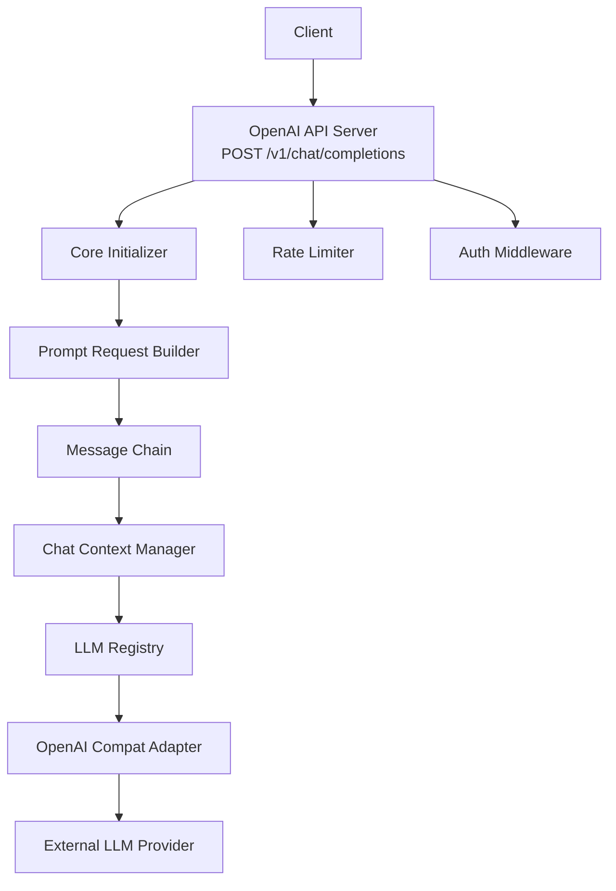
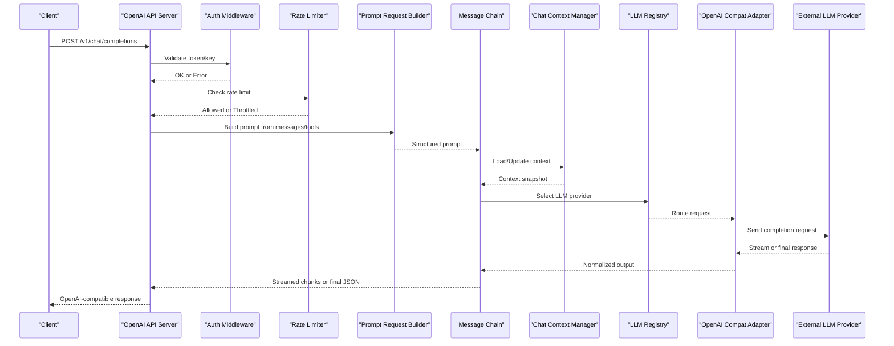
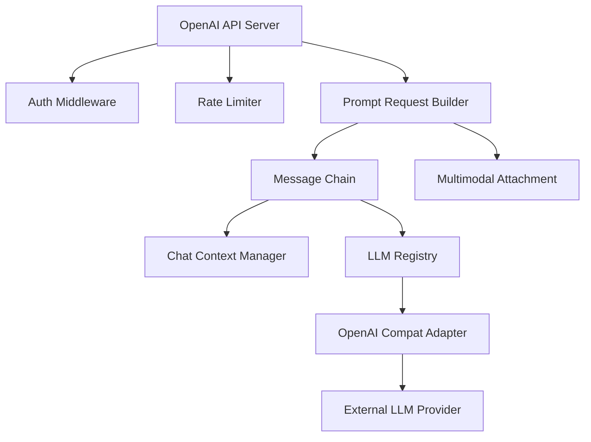

# Chat Endpoints

<cite>
**Referenced Files in This Document**
- [openai_api_server.py](file://interface/openai_api_server/openai_api_server.py)
- [__init__.py](file://interface/openai_api_server/__init__.py)
- [guide.md](file://interface/openai_api_server/guide.md)
- [main.py](file://main.py)
- [core_initializer.py](file://core/core_initializer.py)
- [prompt_request.py](file://core/prompt_request.py)
- [message_chain.py](file://core/message_chain.py)
- [chat_context_manager.py](file://core/chat_context_manager.py)
- [multimodal_attachment.py](file://core/multimodal_attachment.py)
- [llm_registry.py](file://core/llm_registry.py)
- [external_endpoints/openai_compat.py](file://core/external_endpoints/adapters/openai_compat.py)
- [rate_limit.py](file://core/rate_limit.py)
</cite>

## Table of Contents
1. [Introduction](#introduction)
2. [Project Structure](#project-structure)
3. [Core Components](#core-components)
4. [Architecture Overview](#architecture-overview)
5. [Detailed Component Analysis](#detailed-component-analysis)
6. [Dependency Analysis](#dependency-analysis)
7. [Performance Considerations](#performance-considerations)
8. [Troubleshooting Guide](#troubleshooting-guide)
9. [Conclusion](#conclusion)

## Introduction
This document provides detailed API documentation for Synthetic Heart’s OpenAI-compatible chat endpoints, focusing on the POST /v1/chat/completions endpoint. It covers message schemas, system prompts, streaming responses, function calling capabilities, multi-turn conversation handling, authentication requirements, error handling patterns, and context management parameters. The goal is to enable developers to integrate with Synthetic Heart using familiar OpenAI-style requests while leveraging Synthetic Heart’s advanced features such as multimodal attachments, tool/function calling, and persistent chat context.

## Project Structure
The OpenAI-compatible chat server is implemented under the interface layer and integrates with Synthetic Heart’s core engine for prompt processing, message chaining, context management, and LLM routing. Key files include:
- OpenAI API server implementation and entry points
- Core prompt request and message chain handling
- Context manager for multi-turn conversations
- Multimodal attachment support
- LLM registry and external OpenAI compatibility adapter
- Rate limiting and authentication middleware

**Diagram sources**
- [openai_api_server.py](file://interface/openai_api_server/openai_api_server.py)
- [core_initializer.py](file://core/core_initializer.py)
- [prompt_request.py](file://core/prompt_request.py)
- [message_chain.py](file://core/message_chain.py)
- [chat_context_manager.py](file://core/chat_context_manager.py)
- [llm_registry.py](file://core/llm_registry.py)
- [external_endpoints/openai_compat.py](file://core/external_endpoints/adapters/openai_compat.py)
- [rate_limit.py](file://core/rate_limit.py)

**Section sources**
- [openai_api_server.py](file://interface/openai_api_server/openai_api_server.py)
- [__init__.py](file://interface/openai_api_server/__init__.py)
- [guide.md](file://interface/openai_api_server/guide.md)
- [main.py](file://main.py)

## Core Components
- OpenAI API Server: Exposes /v1/chat/completions and related endpoints compatible with OpenAI client libraries. Handles request parsing, authentication, rate limiting, and response formatting.
- Prompt Request Builder: Translates OpenAI-style messages into Synthetic Heart’s internal prompt structures, including system prompts, user/assistant turns, and tool definitions.
- Message Chain: Manages sequential processing of messages through plugins, correctors, and engines, supporting streaming and non-streaming responses.
- Chat Context Manager: Maintains multi-turn conversation state, memory injection, and session-scoped variables.
- LLM Registry and Adapter: Routes requests to configured LLM providers via an OpenAI-compatible adapter, enabling fallbacks and provider-specific options.
- Multimodal Attachment: Supports images, audio, and other media within messages, normalizing payloads for downstream processing.
- Rate Limiting and Authentication: Enforces per-user or per-token limits and validates API keys or session tokens.

**Section sources**
- [openai_api_server.py](file://interface/openai_api_server/openai_api_server.py)
- [prompt_request.py](file://core/prompt_request.py)
- [message_chain.py](file://core/message_chain.py)
- [chat_context_manager.py](file://core/chat_context_manager.py)
- [multimodal_attachment.py](file://core/multimodal_attachment.py)
- [llm_registry.py](file://core/llm_registry.py)
- [external_endpoints/openai_compat.py](file://core/external_endpoints/adapters/openai_compat.py)
- [rate_limit.py](file://core/rate_limit.py)

## Architecture Overview
The chat completions flow begins with an HTTP request to the OpenAI API server, which authenticates and rate-limits the call before delegating to the core prompt pipeline. The prompt builder constructs a structured request that includes messages, tools, and context parameters. The message chain processes the request through plugins and engines, optionally streaming partial responses. The chat context manager persists and enriches multi-turn state. Finally, the LLM registry selects an appropriate provider via the OpenAI compat adapter, returning standardized responses.

**Diagram sources**
- [openai_api_server.py](file://interface/openai_api_server/openai_api_server.py)
- [prompt_request.py](file://core/prompt_request.py)
- [message_chain.py](file://core/message_chain.py)
- [chat_context_manager.py](file://core/chat_context_manager.py)
- [llm_registry.py](file://core/llm_registry.py)
- [external_endpoints/openai_compat.py](file://core/external_endpoints/adapters/openai_compat.py)

## Detailed Component Analysis

### POST /v1/chat/completions Endpoint
- Method: POST
- Path: /v1/chat/completions
- Authentication: Bearer token or API key via Authorization header; optional per-session tokens if enabled by configuration.
- Content-Type: application/json
- Request Body Schema:
  - model: string (optional; defaults to configured engine)
  - messages: array of message objects
    - role: "system", "user", "assistant", or "tool"
    - content: string or array of content parts (text, image_url, audio_url, file_id)
    - name: string (optional; for tool results or named system prompts)
    - tool_calls: array of tool call objects (for assistant messages)
    - tool_call_id: string (for tool result messages)
  - tools: array of tool/function definitions (JSON schema)
  - stream: boolean (enable SSE streaming)
  - temperature, max_tokens, top_p, stop, presence_penalty, frequency_penalty: standard OpenAI parameters
  - function_call: deprecated alias for tools; supported for compatibility
  - functions: deprecated alias for tools; supported for compatibility
  - metadata: object (optional; session tags, user IDs, correlation IDs)
  - context: object (optional; overrides for chat context manager)
    - session_id: string
    - memory_injection: boolean
    - recent_history_count: integer
    - persona_profile: string
    - language: string
    - timezone: string
- Response Formats:
  - Non-streaming: JSON object with choices array, each containing message, finish_reason, usage stats
  - Streaming: Server-Sent Events (SSE) with delta chunks carrying partial content, tool calls, and finish events

Example Request (non-streaming):
- See [openai_api_server.py](file://interface/openai_api_server/openai_api_server.py) for request parsing and validation logic.

Example Response (non-streaming):
- See [openai_api_server.py](file://interface/openai_api_server/openai_api_server.py) for response serialization.

Streaming Example:
- See [openai_api_server.py](file://interface/openai_api_server/openai_api_server.py) for SSE chunk generation and event types.

Function Calling:
- Define tools in the request body; assistant may respond with tool_calls; subsequent messages must include tool_call_id and content to complete the cycle.
- See [prompt_request.py](file://core/prompt_request.py) for tool schema normalization and [message_chain.py](file://core/message_chain.py) for execution flow.

Multi-Turn Conversations:
- Maintain conversation history via messages array; context manager can inject memory and persona data based on session_id and flags.
- See [chat_context_manager.py](file://core/chat_context_manager.py) for context loading and merging.

Attachment Support:
- Messages can include image_url, audio_url, or file_id fields; normalized by multimodal attachment module before prompt construction.
- See [multimodal_attachment.py](file://core/multimodal_attachment.py) for supported formats and preprocessing steps.

Error Handling Patterns:
- 401 Unauthorized: Invalid or missing token
- 403 Forbidden: Insufficient permissions
- 429 Too Many Requests: Rate limit exceeded
- 400 Bad Request: Invalid schema or missing required fields
- 500 Internal Server Error: Unexpected failures in core pipeline or LLM provider
- See [openai_api_server.py](file://interface/openai_api_server/openai_api_server.py) for error mapping and logging.

**Section sources**
- [openai_api_server.py](file://interface/openai_api_server/openai_api_server.py)
- [prompt_request.py](file://core/prompt_request.py)
- [message_chain.py](file://core/message_chain.py)
- [chat_context_manager.py](file://core/chat_context_manager.py)
- [multimodal_attachment.py](file://core/multimodal_attachment.py)
- [llm_registry.py](file://core/llm_registry.py)
- [external_endpoints/openai_compat.py](file://core/external_endpoints/adapters/openai_compat.py)
- [rate_limit.py](file://core/rate_limit.py)

### Message Types and Schemas
- System Messages: Provide global instructions, persona definitions, and constraints.
- User Messages: Primary input from clients; support text and attachments.
- Assistant Messages: Responses from the model; may include tool_calls for function invocation.
- Tool Messages: Results from executed functions; must reference tool_call_id.

Content Parts:
- text: plain string
- image_url: object with url and detail
- audio_url: object with url and format
- file_id: reference to uploaded media

Tool Definitions:
- type: "function"
- function: object with name, description, parameters (JSON schema)

**Section sources**
- [prompt_request.py](file://core/prompt_request.py)
- [message_chain.py](file://core/message_chain.py)
- [multimodal_attachment.py](file://core/multimodal_attachment.py)

### Streaming Responses
- Enable with stream=true; server emits SSE events:
  - event: message_start
  - event: content_delta
  - event: tool_call_delta
  - event: tool_call_complete
  - event: message_end
- Clients should handle partial updates and finalize on message_end.

**Section sources**
- [openai_api_server.py](file://interface/openai_api_server/openai_api_server.py)
- [message_chain.py](file://core/message_chain.py)

### Function Calling Capabilities
- Define tools in request; model responds with tool_calls; execute tools via plugin registry; return results in subsequent messages.
- Supports nested tool calls and parallel execution where applicable.

**Section sources**
- [prompt_request.py](file://core/prompt_request.py)
- [message_chain.py](file://core/message_chain.py)
- [llm_registry.py](file://core/llm_registry.py)

### Multi-Turn Conversation Handling
- Use messages array to maintain history; context manager injects memory, persona, and time-aware data.
- Session persistence via session_id; supports memory compaction and retrieval policies.

**Section sources**
- [chat_context_manager.py](file://core/chat_context_manager.py)
- [prompt_request.py](file://core/prompt_request.py)

### Authentication and Rate Limiting
- Authentication via Authorization header with bearer tokens or API keys; configurable per-user policies.
- Rate limiting enforces per-token or per-user quotas; returns 429 when exceeded.

**Section sources**
- [openai_api_server.py](file://interface/openai_api_server/openai_api_server.py)
- [rate_limit.py](file://core/rate_limit.py)

## Dependency Analysis
The chat endpoint depends on several core modules:
- OpenAI API Server depends on authentication, rate limiting, prompt request builder, message chain, context manager, LLM registry, and OpenAI compat adapter.
- Prompt request builder relies on message chain and multimodal attachment for normalization.
- Message chain interacts with plugins, engines, and context manager.
- LLM registry routes to external providers via adapters.

**Diagram sources**
- [openai_api_server.py](file://interface/openai_api_server/openai_api_server.py)
- [prompt_request.py](file://core/prompt_request.py)
- [message_chain.py](file://core/message_chain.py)
- [chat_context_manager.py](file://core/chat_context_manager.py)
- [llm_registry.py](file://core/llm_registry.py)
- [external_endpoints/openai_compat.py](file://core/external_endpoints/adapters/openai_compat.py)
- [multimodal_attachment.py](file://core/multimodal_attachment.py)
- [rate_limit.py](file://core/rate_limit.py)

**Section sources**
- [openai_api_server.py](file://interface/openai_api_server/openai_api_server.py)
- [prompt_request.py](file://core/prompt_request.py)
- [message_chain.py](file://core/message_chain.py)
- [chat_context_manager.py](file://core/chat_context_manager.py)
- [llm_registry.py](file://core/llm_registry.py)
- [external_endpoints/openai_compat.py](file://core/external_endpoints/adapters/openai_compat.py)
- [multimodal_attachment.py](file://core/multimodal_attachment.py)
- [rate_limit.py](file://core/rate_limit.py)

## Performance Considerations
- Streaming reduces latency for long responses; prefer stream=true for interactive applications.
- Context size impacts performance; use recent_history_count and memory_injection flags judiciously.
- Tool execution can be asynchronous; batch tool calls where possible to minimize round-trips.
- Rate limiting prevents overload; implement client-side retries with exponential backoff.
- Multimodal attachments increase payload size; compress or resize images/audio before sending.

[No sources needed since this section provides general guidance]

## Troubleshooting Guide
Common issues and resolutions:
- Authentication failures: Verify token format and permissions; check authorization headers.
- Rate limit errors: Implement retry logic; reduce request frequency or upgrade quota.
- Invalid message schema: Ensure all required fields are present; validate content parts and tool definitions.
- Streaming interruptions: Handle SSE reconnection; buffer partial responses.
- Tool execution errors: Log tool outputs; validate function signatures and parameter schemas.
- Context not updating: Confirm session_id consistency; check memory injection settings.

**Section sources**
- [openai_api_server.py](file://interface/openai_api_server/openai_api_server.py)
- [rate_limit.py](file://core/rate_limit.py)
- [prompt_request.py](file://core/prompt_request.py)
- [message_chain.py](file://core/message_chain.py)
- [chat_context_manager.py](file://core/chat_context_manager.py)

## Conclusion
Synthetic Heart’s OpenAI-compatible chat endpoints provide a robust and flexible interface for building conversational AI applications. By adhering to the documented schemas, leveraging streaming and function calling, and managing context effectively, developers can create responsive and intelligent chat experiences. Proper authentication, rate limiting, and error handling ensure reliability and scalability in production environments.

[No sources needed since this section summarizes without analyzing specific files]