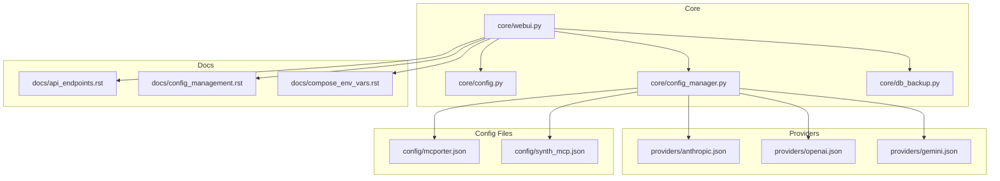
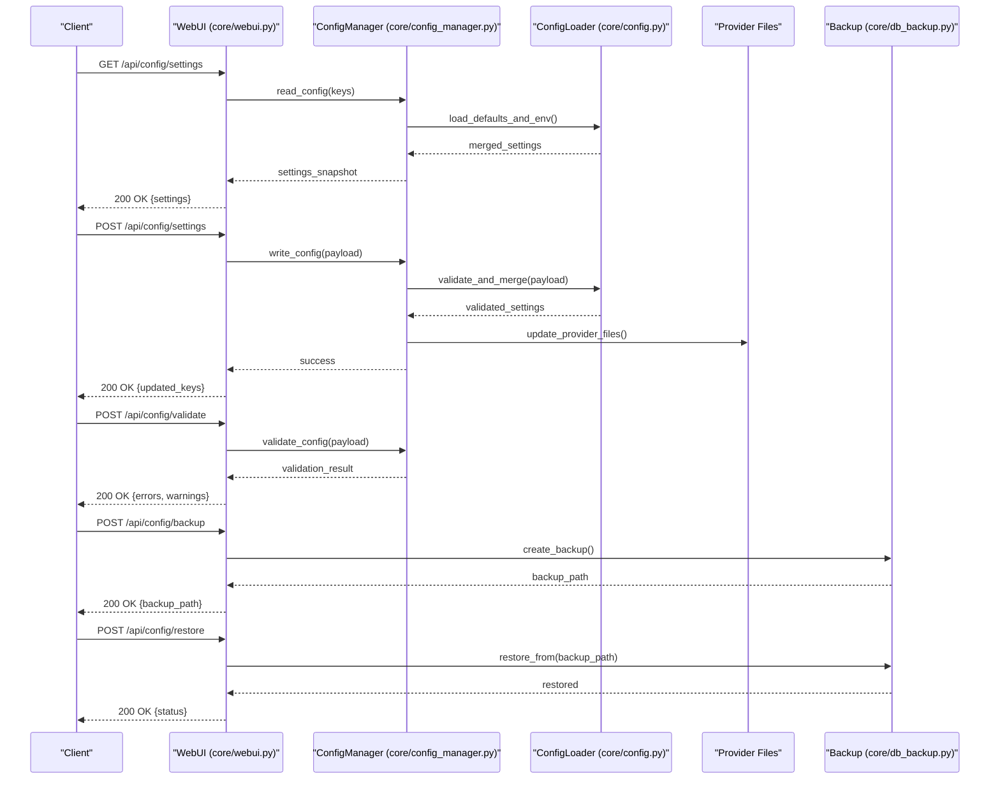
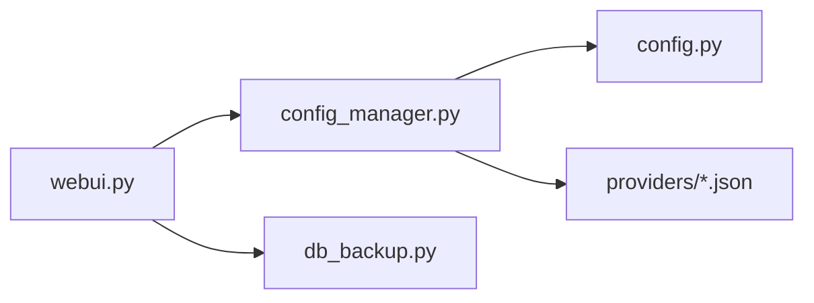

# Configuration Endpoints

<cite>
**Referenced Files in This Document**
- [config.py](file://core/config.py)
- [config_manager.py](file://core/config_manager.py)
- [webui.py](file://core/webui.py)
- [db_backup.py](file://core/db_backup.py)
- [api_endpoints.rst](file://docs/api_endpoints.rst)
- [config_management.rst](file://docs/config_management.rst)
- [compose_env_vars.rst](file://docs/compose_env_vars.rst)
- [mcporter.json](file://config/mcporter.json)
- [synth_mcp.json](file://config/synth_mcp.json)
- [anthropic.json](file://providers/anthropic.json)
- [openai.json](file://providers/openai.json)
- [gemini.json](file://providers/gemini.json)
</cite>

## Table of Contents
1. [Introduction](#introduction)
2. [Project Structure](#project-structure)
3. [Core Components](#core-components)
4. [Architecture Overview](#architecture-overview)
5. [Detailed Component Analysis](#detailed-component-analysis)
6. [Dependency Analysis](#dependency-analysis)
7. [Performance Considerations](#performance-considerations)
8. [Troubleshooting Guide](#troubleshooting-guide)
9. [Conclusion](#conclusion)
10. [Appendices](#appendices)

## Introduction
This document describes the configuration management endpoints and mechanisms for runtime settings, provider configurations, and system preferences. It covers reading and writing configuration values, validating settings, managing external service credentials, dynamic updates, environment variable management, and configuration backup/restore operations. The goal is to provide a clear, accessible guide for both developers and operators who need to interact with or extend the configuration system.

## Project Structure
Configuration-related functionality spans several core modules and documentation files:
- Core configuration loader and manager: config.py, config_manager.py
- Web UI integration and API exposure: webui.py
- Backup/restore utilities: db_backup.py
- Provider configuration files under providers/ and config/
- Documentation on API endpoints and configuration management: docs/api_endpoints.rst, docs/config_management.rst, docs/compose_env_vars.rst

**Diagram sources**
- [config.py](file://core/config.py)
- [config_manager.py](file://core/config_manager.py)
- [webui.py](file://core/webui.py)
- [db_backup.py](file://core/db_backup.py)
- [anthropic.json](file://providers/anthropic.json)
- [openai.json](file://providers/openai.json)
- [gemini.json](file://providers/gemini.json)
- [mcporter.json](file://config/mcporter.json)
- [synth_mcp.json](file://config/synth_mcp.json)
- [api_endpoints.rst](file://docs/api_endpoints.rst)
- [config_management.rst](file://docs/config_management.rst)
- [compose_env_vars.rst](file://docs/compose_env_vars.rst)

**Section sources**
- [config.py](file://core/config.py)
- [config_manager.py](file://core/config_manager.py)
- [webui.py](file://core/webui.py)
- [db_backup.py](file://core/db_backup.py)
- [api_endpoints.rst](file://docs/api_endpoints.rst)
- [config_management.rst](file://docs/config_management.rst)
- [compose_env_vars.rst](file://docs/compose_env_vars.rst)

## Core Components
- Configuration Loader (core/config.py): Loads default and user-provided configuration, merges settings, and exposes typed accessors for runtime values.
- Configuration Manager (core/config_manager.py): Provides CRUD operations for configuration keys, validation hooks, persistence, and hot-reload support.
- Web UI Integration (core/webui.py): Exposes HTTP endpoints for reading/writing configuration, validating settings, and triggering backup/restore workflows.
- Backup/Restore Utilities (core/db_backup.py): Handles database and configuration snapshots for restore scenarios.

Key responsibilities:
- Reading configuration values from multiple sources (defaults, env vars, JSON files).
- Validating settings against schemas or constraints.
- Persisting changes atomically and notifying subscribers for dynamic updates.
- Managing external service credentials securely.

**Section sources**
- [config.py](file://core/config.py)
- [config_manager.py](file://core/config_manager.py)
- [webui.py](file://core/webui.py)
- [db_backup.py](file://core/db_backup.py)

## Architecture Overview
The configuration system follows a layered architecture:
- API Layer (webui.py) exposes endpoints for configuration management.
- Service Layer (config_manager.py) implements business logic for reading, writing, validating, and persisting configuration.
- Data Layer (config.py) handles loading and merging configuration sources.
- External Integrations (providers/*.json, config/*.json) supply provider-specific settings and credentials.
- Backup/Restore (db_backup.py) supports snapshotting and restoring configuration state.

**Diagram sources**
- [webui.py](file://core/webui.py)
- [config_manager.py](file://core/config_manager.py)
- [config.py](file://core/config.py)
- [db_backup.py](file://core/db_backup.py)

## Detailed Component Analysis

### Configuration Loader (core/config.py)
Responsibilities:
- Load default configuration values.
- Merge environment variables into configuration.
- Provide typed accessors for runtime settings.

Complexity considerations:
- Merging strategy ensures deterministic precedence (env > file > defaults).
- Accessor methods minimize overhead by caching resolved values where appropriate.

Error handling:
- Missing keys return safe defaults or raise explicit errors based on context.
- Environment variable parsing failures are logged and ignored gracefully.

**Section sources**
- [config.py](file://core/config.py)

### Configuration Manager (core/config_manager.py)
Responsibilities:
- CRUD operations for configuration keys.
- Validation hooks for settings before persistence.
- Hot-reload notifications to subscribers.
- Atomic writes to prevent partial updates.

Data structures:
- Configuration schema definitions for validation.
- Change event payloads for dynamic updates.

Optimization opportunities:
- Batch updates to reduce I/O overhead.
- Lazy loading of large configuration sections.

**Section sources**
- [config_manager.py](file://core/config_manager.py)

### Web UI Integration (core/webui.py)
Responsibilities:
- Expose REST-like endpoints for configuration management.
- Handle request/response formatting and error responses.
- Coordinate backup/restore operations.

Endpoints overview:
- GET /api/config/settings: Retrieve current configuration.
- POST /api/config/settings: Update configuration values.
- POST /api/config/validate: Validate configuration payload.
- POST /api/config/backup: Create configuration backup.
- POST /api/config/restore: Restore configuration from backup.

Security considerations:
- Sensitive fields (e.g., API keys) are masked in responses.
- Input validation prevents injection attacks.

**Section sources**
- [webui.py](file://core/webui.py)

### Backup/Restore Utilities (core/db_backup.py)
Responsibilities:
- Snapshot current configuration and database state.
- Restore from a specified backup path.
- Ensure data integrity during restore operations.

Operational flow:
- Backup creates timestamped archives with metadata.
- Restore validates archive integrity before applying changes.

**Section sources**
- [db_backup.py](file://core/db_backup.py)

## Dependency Analysis
The configuration system has clear dependency boundaries:
- webui.py depends on config_manager.py for business logic.
- config_manager.py depends on config.py for data loading.
- config_manager.py interacts with provider files for external service credentials.
- webui.py coordinates with db_backup.py for backup/restore operations.

**Diagram sources**
- [webui.py](file://core/webui.py)
- [config_manager.py](file://core/config_manager.py)
- [config.py](file://core/config.py)
- [db_backup.py](file://core/db_backup.py)
- [anthropic.json](file://providers/anthropic.json)
- [openai.json](file://providers/openai.json)
- [gemini.json](file://providers/gemini.json)

**Section sources**
- [webui.py](file://core/webui.py)
- [config_manager.py](file://core/config_manager.py)
- [config.py](file://core/config.py)
- [db_backup.py](file://core/db_backup.py)

## Performance Considerations
- Configuration loading should be cached to avoid repeated I/O operations.
- Batch updates reduce filesystem writes and improve throughput.
- Validation should be efficient and fail fast on invalid inputs.
- Backup/restore operations should use streaming for large datasets.

[No sources needed since this section provides general guidance]

## Troubleshooting Guide
Common issues and resolutions:
- Invalid configuration values: Use the validation endpoint to identify errors.
- Permission denied when writing configuration: Check file system permissions.
- Backup restoration fails: Verify backup integrity and compatibility.
- Dynamic updates not applied: Ensure subscribers are registered and listening.

Debugging tips:
- Enable verbose logging in configuration loader.
- Inspect provider files for syntax errors.
- Monitor configuration change events for unexpected behavior.

**Section sources**
- [config_manager.py](file://core/config_manager.py)
- [webui.py](file://core/webui.py)

## Conclusion
The configuration management system provides a robust foundation for managing runtime settings, provider configurations, and system preferences. Through well-defined endpoints, validation mechanisms, and backup/restore capabilities, it supports both operational flexibility and reliability. Operators can confidently manage configurations dynamically while maintaining security and data integrity.

[No sources needed since this section summarizes without analyzing specific files]

## Appendices

### API Endpoints Reference
- GET /api/config/settings: Retrieve current configuration.
- POST /api/config/settings: Update configuration values.
- POST /api/config/validate: Validate configuration payload.
- POST /api/config/backup: Create configuration backup.
- POST /api/config/restore: Restore configuration from backup.

**Section sources**
- [api_endpoints.rst](file://docs/api_endpoints.rst)

### Configuration Management Best Practices
- Always validate configuration before applying changes.
- Use environment variables for sensitive information.
- Maintain version control for configuration files.
- Test configuration changes in staging environments first.

**Section sources**
- [config_management.rst](file://docs/config_management.rst)

### Environment Variable Management
- Use consistent naming conventions for environment variables.
- Document required and optional environment variables.
- Provide fallback values for non-critical settings.

**Section sources**
- [compose_env_vars.rst](file://docs/compose_env_vars.rst)

### Provider Configuration Examples
- anthropic.json: Configure Anthropic API credentials and settings.
- openai.json: Configure OpenAI API keys and model parameters.
- gemini.json: Configure Google Gemini API settings.

**Section sources**
- [anthropic.json](file://providers/anthropic.json)
- [openai.json](file://providers/openai.json)
- [gemini.json](file://providers/gemini.json)

### System Preferences
- mcporter.json: Configure MCP transport settings.
- synth_mcp.json: Configure Synth MCP server options.

**Section sources**
- [mcporter.json](file://config/mcporter.json)
- [synth_mcp.json](file://config/synth_mcp.json)