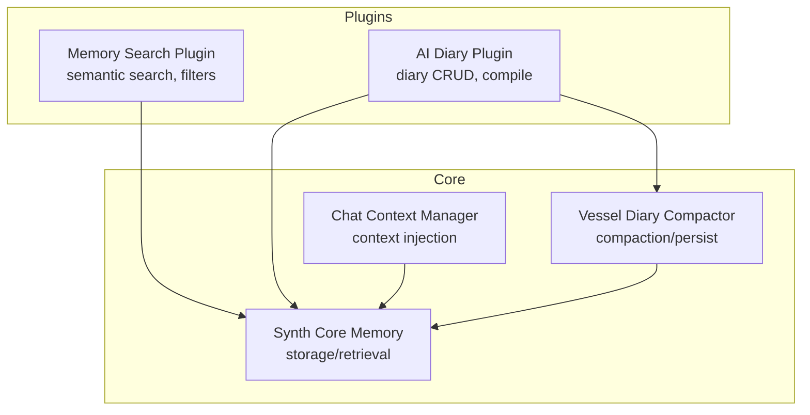
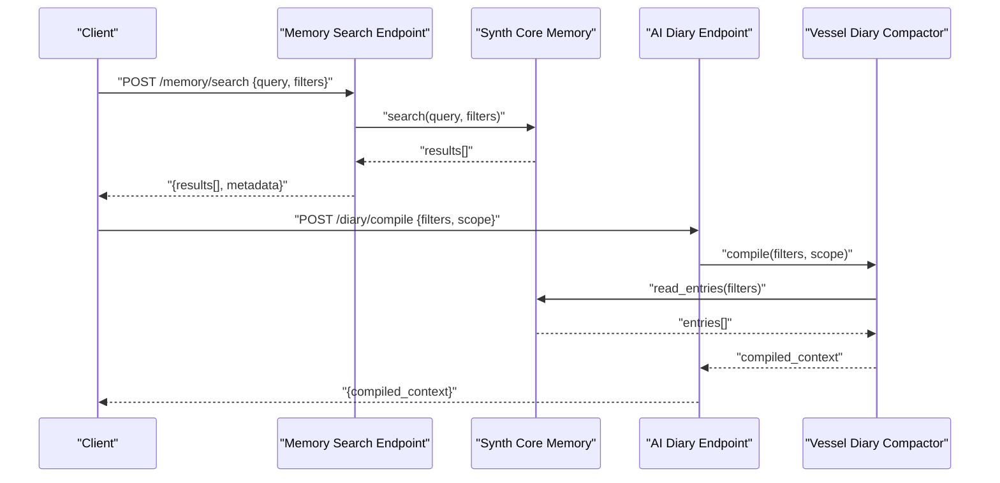
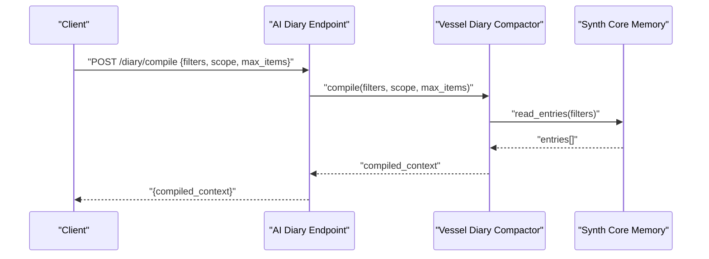
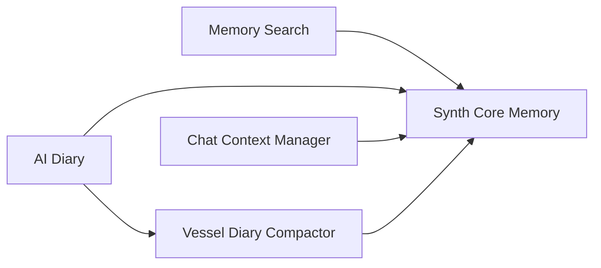

# Memory & Context Endpoints

<cite>
**Referenced Files in This Document**
- [memory_search.py](file://plugins/memory_search/memory_search.py)
- [memory_search.guide.md](file://plugins/memory_search/memory_search.guide.md)
- [ai_diary.py](file://plugins/ai_diary/ai_diary.py)
- [ai_diary.guide.md](file://plugins/ai_diary/ai_diary.guide.md)
- [synth_core_memory.py](file://core/synth_core_memory.py)
- [chat_context_manager.py](file://core/chat_context_manager.py)
- [vessel_diary_compactor.py](file://core/vessel_diary_compactor.py)
- [memory_search_and_management.rst](file://docs/memory_search_and_management.rst)
- [memory_search.rst](file://docs/memory_search.rst)
- [ai_diary_personal_memory.rst](file://docs/ai_diary_personal_memory.rst)
</cite>

## Table of Contents
1. [Introduction](#introduction)
2. [Project Structure](#project-structure)
3. [Core Components](#core-components)
4. [Architecture Overview](#architecture-overview)
5. [Detailed Component Analysis](#detailed-component-analysis)
6. [Dependency Analysis](#dependency-analysis)
7. [Performance Considerations](#performance-considerations)
8. [Troubleshooting Guide](#troubleshooting-guide)
9. [Conclusion](#conclusion)
10. [Appendices](#appendices)

## Introduction
This document provides comprehensive documentation for memory and context management endpoints, focusing on semantic search operations, memory retrieval APIs, diary compilation endpoints, and context persistence. It explains query syntax for semantic search, memory filtering options, batch operations, and practical workflows for memory management, context injection, and historical data access patterns. The content is derived from the project’s memory plugin, AI diary plugin, core memory and context managers, and related documentation.

## Project Structure
The memory and context subsystem spans several modules:
- Memory search plugin exposes endpoints and logic for semantic queries and filtering.
- AI diary plugin manages diary entries and compilation endpoints.
- Core memory module centralizes memory storage and retrieval abstractions.
- Chat context manager handles context injection and session-scoped state.
- Vessel diary compactor orchestrates diary consolidation and persistence.

**Diagram sources**
- [memory_search.py](file://plugins/memory_search/memory_search.py)
- [ai_diary.py](file://plugins/ai_diary/ai_diary.py)
- [synth_core_memory.py](file://core/synth_core_memory.py)
- [chat_context_manager.py](file://core/chat_context_manager.py)
- [vessel_diary_compactor.py](file://core/vessel_diary_compactor.py)

**Section sources**
- [memory_search_and_management.rst](file://docs/memory_search_and_management.rst)
- [memory_search.rst](file://docs/memory_search.rst)
- [ai_diary_personal_memory.rst](file://docs/ai_diary_personal_memory.rst)

## Core Components
- Semantic Search: Provides natural language querying over stored memories with optional filters (time range, tags, source).
- Memory Retrieval API: Returns structured memory items, supports pagination and sorting.
- Diary Compilation: Aggregates recent or filtered diary entries into a compiled context payload.
- Context Persistence: Persists session context and memory references to ensure continuity across interactions.

Key responsibilities:
- Normalize and validate query parameters.
- Execute vector or keyword-based search depending on configuration.
- Apply filters and ranking strategies.
- Persist compiled outputs and context snapshots.

**Section sources**
- [memory_search.py](file://plugins/memory_search/memory_search.py)
- [ai_diary.py](file://plugins/ai_diary/ai_diary.py)
- [synth_core_memory.py](file://core/synth_core_memory.py)
- [chat_context_manager.py](file://core/chat_context_manager.py)
- [vessel_diary_compactor.py](file://core/vessel_diary_compactor.py)

## Architecture Overview
The system composes plugin endpoints with core services:
- Memory Search endpoint receives queries, delegates to Synth Core Memory for retrieval, and returns ranked results.
- AI Diary endpoints manage entry lifecycle and trigger compaction via Vessel Diary Compactor.
- Chat Context Manager injects relevant memories into prompts based on current session context.

**Diagram sources**
- [memory_search.py](file://plugins/memory_search/memory_search.py)
- [ai_diary.py](file://plugins/ai_diary/ai_diary.py)
- [synth_core_memory.py](file://core/synth_core_memory.py)
- [vessel_diary_compactor.py](file://core/vessel_diary_compactor.py)

## Detailed Component Analysis

### Memory Search Plugin
Responsibilities:
- Accept semantic queries and filter parameters.
- Execute search against memory store with ranking.
- Return structured results with metadata (score, source, timestamp).

Query Syntax:
- Natural language text describing desired memories.
- Optional filters: time_range, tags, source, limit, sort_by.
- Example filter keys: start_time, end_time, tag_in, tag_not_in, source_eq, limit, order.

Filtering Options:
- Time-based: start_time, end_time (ISO 8601).
- Tag-based: inclusion/exclusion lists.
- Source-based: exact match or list.
- Pagination: limit, offset.

Batch Operations:
- Batch search: multiple queries in one request.
- Batch delete: remove memories by IDs.
- Batch update: patch fields for selected memories.

**Diagram sources**
- [memory_search.py](file://plugins/memory_search/memory_search.py)

**Section sources**
- [memory_search.guide.md](file://plugins/memory_search/memory_search.guide.md)
- [memory_search.rst](file://docs/memory_search.rst)

### AI Diary Plugin
Responsibilities:
- Manage diary entries (create, read, update, delete).
- Compile entries into a consolidated context payload.
- Support filtering by date ranges, tags, and relevance.

Diary Compilation:
- Inputs: filters (date range, tags), scope (session, global), max_items.
- Process: fetch entries, deduplicate, rank by relevance, summarize if needed.
- Output: compiled context suitable for prompt injection.

Endpoints:
- Create entry: POST /diary/entry
- Read entries: GET /diary/entries?filters...
- Update entry: PATCH /diary/entry/{id}
- Delete entry: DELETE /diary/entry/{id}
- Compile: POST /diary/compile

**Diagram sources**
- [ai_diary.py](file://plugins/ai_diary/ai_diary.py)
- [vessel_diary_compactor.py](file://core/vessel_diary_compactor.py)
- [synth_core_memory.py](file://core/synth_core_memory.py)

**Section sources**
- [ai_diary.guide.md](file://plugins/ai_diary/ai_diary.guide.md)
- [ai_diary_personal_memory.rst](file://docs/ai_diary_personal_memory.rst)

### Synth Core Memory
Responsibilities:
- Provide unified storage and retrieval interface for memories.
- Support vector and keyword search backends.
- Handle persistence, indexing, and metadata management.

Key Methods:
- search(query, filters): execute semantic/keyword search.
- get_by_id(id): retrieve single memory.
- upsert(memory): create or update memory.
- delete(ids): remove memories by identifiers.

Data Model:
- id: unique identifier
- text: primary content
- embedding: optional vector representation
- tags: list of tags
- source: origin system/channel
- created_at: timestamp
- updated_at: timestamp

**Section sources**
- [synth_core_memory.py](file://core/synth_core_memory.py)

### Chat Context Manager
Responsibilities:
- Inject relevant memories into chat context based on current conversation.
- Maintain session-scoped state and memory references.
- Coordinate with memory search to fetch timely context.

Injection Flow:
- On message receive, extract intent and keywords.
- Query memory store for relevant memories.
- Merge into context payload for LLM processing.

**Section sources**
- [chat_context_manager.py](file://core/chat_context_manager.py)

### Vessel Diary Compactor
Responsibilities:
- Consolidate diary entries into a compacted context.
- Apply deduplication and relevance ranking.
- Persist compiled output for reuse.

Compaction Algorithm:
- Fetch entries matching filters.
- Deduplicate by content similarity or ID.
- Rank by recency and relevance.
- Summarize or truncate to fit context limits.
- Persist compiled result.

**Section sources**
- [vessel_diary_compactor.py](file://core/vessel_diary_compactor.py)

## Dependency Analysis
Component relationships:
- Memory Search depends on Synth Core Memory for data access.
- AI Diary depends on Vessel Diary Compactor for compilation and Synth Core Memory for storage.
- Chat Context Manager depends on Synth Core Memory for retrieval and Memory Search for semantic queries.
- Vessel Diary Compactor depends on Synth Core Memory for reading entries.

**Diagram sources**
- [memory_search.py](file://plugins/memory_search/memory_search.py)
- [ai_diary.py](file://plugins/ai_diary/ai_diary.py)
- [synth_core_memory.py](file://core/synth_core_memory.py)
- [chat_context_manager.py](file://core/chat_context_manager.py)
- [vessel_diary_compactor.py](file://core/vessel_diary_compactor.py)

**Section sources**
- [memory_search_and_management.rst](file://docs/memory_search_and_management.rst)

## Performance Considerations
- Indexing: Ensure embeddings are indexed for fast semantic search.
- Pagination: Use limit and offset to avoid large result sets.
- Caching: Cache frequent queries and compiled contexts.
- Batch Operations: Prefer batch requests to reduce overhead.
- Filtering: Apply server-side filters to minimize data transfer.

[No sources needed since this section provides general guidance]

## Troubleshooting Guide
Common issues:
- Empty results: Verify query syntax and filters; check memory store connectivity.
- Slow responses: Review indexing status; consider narrowing filters.
- Compilation failures: Inspect entry validity; check compaction limits.
- Context not injected: Confirm session context alignment; verify memory relevance thresholds.

Debugging steps:
- Log query parameters and execution paths.
- Validate memory schema and timestamps.
- Test with minimal filters to isolate issues.
- Monitor compaction logs for errors.

**Section sources**
- [memory_search.guide.md](file://plugins/memory_search/memory_search.guide.md)
- [ai_diary.guide.md](file://plugins/ai_diary/ai_diary.guide.md)

## Conclusion
The memory and context management system provides robust semantic search, memory retrieval, diary compilation, and context persistence capabilities. By leveraging structured queries, filters, and batch operations, applications can efficiently manage personal memory and enhance conversational context. Proper indexing, caching, and filtering ensure optimal performance and reliability.

[No sources needed since this section summarizes without analyzing specific files]

## Appendices

### Query Syntax Examples
- Semantic search: "memories about project deadlines last week"
- Filtered search: query="meeting notes", filters={tag_in=["work"], start_time="2024-01-01T00:00:00Z"}
- Batch search: [{query:"task updates"}, {query:"feedback received"}]

### Memory Filtering Options
- Time range: start_time, end_time
- Tags: tag_in, tag_not_in
- Source: source_eq
- Pagination: limit, offset
- Sorting: sort_by (recency, relevance)

### Batch Operations
- Batch search: POST /memory/batch_search with array of queries
- Batch delete: POST /memory/batch_delete with array of IDs
- Batch update: POST /memory/batch_update with array of patches

### Historical Data Access Patterns
- Retrieve recent entries: GET /diary/entries?limit=10&sort_by=created_at
- Compile weekly summary: POST /diary/compile with date range filters
- Inject context: Use Chat Context Manager to merge memories into prompts

[No sources needed since this section provides general guidance]