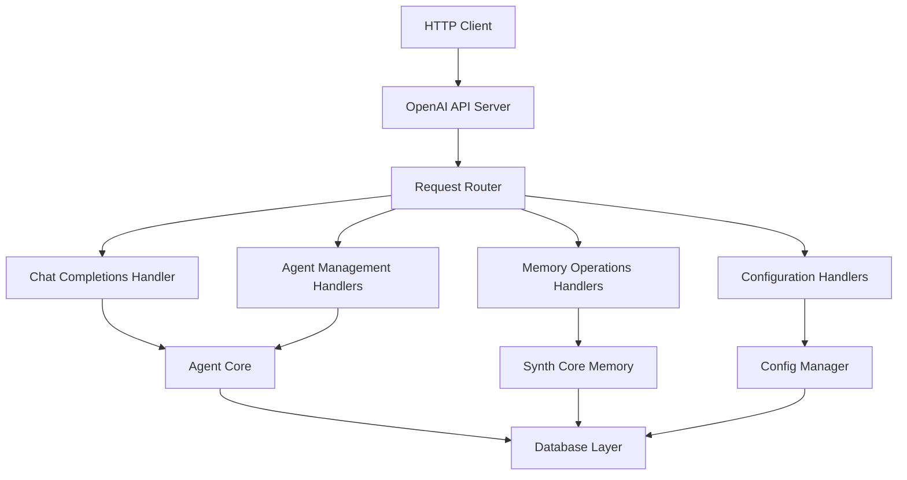
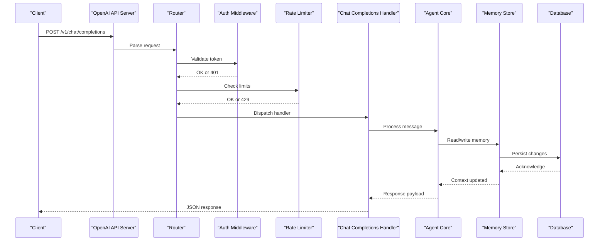
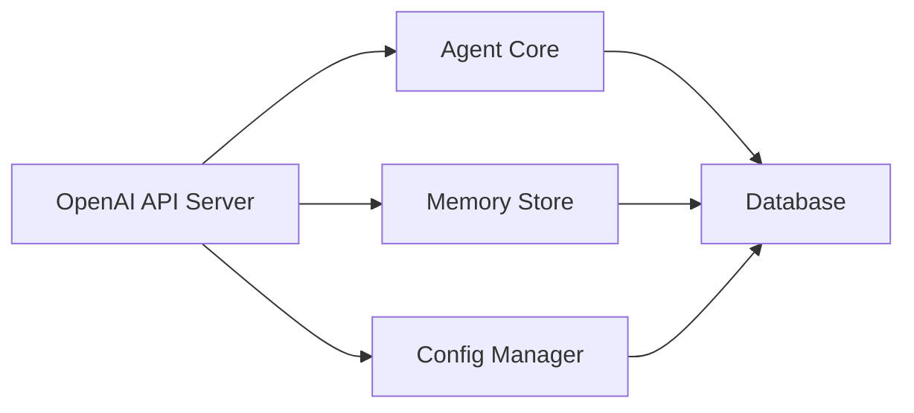

# REST API Endpoints

<cite>
**Referenced Files in This Document**
- [main.py](file://main.py)
- [openai_api_server.py](file://interface/openai_api_server/openai_api_server.py)
- [webui.py](file://core/webui.py)
- [config.py](file://core/config.py)
- [rate_limit.py](file://core/rate_limit.py)
- [agent_core.py](file://core/agent_core.py)
- [synth_core_memory.py](file://core/synth_core_memory.py)
- [chat_archives_db.py](file://core/chat_archives_db.py)
- [db.py](file://core/db.py)
- [models.py](file://core/external_endpoints/models.py)
- [openai_compat.py](file://core/external_endpoints/adapters/openai_compat.py)
</cite>

## Table of Contents
1. [Introduction](#introduction)
2. [Project Structure](#project-structure)
3. [Core Components](#core-components)
4. [Architecture Overview](#architecture-overview)
5. [Detailed Component Analysis](#detailed-component-analysis)
6. [Dependency Analysis](#dependency-analysis)
7. [Performance Considerations](#performance-considerations)
8. [Troubleshooting Guide](#troubleshooting-guide)
9. [Conclusion](#conclusion)
10. [Appendices](#appendices)

## Introduction
This document provides comprehensive REST API documentation for Synthetic Heart’s HTTP endpoints. It covers:
- OpenAI-compatible chat completions endpoint
- Agent management endpoints
- Memory operations and search
- Configuration APIs
- Authentication, rate limiting, pagination, and versioning strategies
- Request/response schemas, status codes, error handling, and practical examples (curl and Python requests)

The goal is to enable both developers and integrators to interact with Synthetic Heart reliably and efficiently via HTTP.

## Project Structure
Synthetic Heart exposes HTTP endpoints primarily through an OpenAI-compatible server module and a WebUI module. Core business logic resides in agent orchestration, memory subsystems, configuration management, and database backends.

**Diagram sources**
- [openai_api_server.py](file://interface/openai_api_server/openai_api_server.py)
- [webui.py](file://core/webui.py)
- [agent_core.py](file://core/agent_core.py)
- [synth_core_memory.py](file://core/synth_core_memory.py)
- [config.py](file://core/config.py)
- [db.py](file://core/db.py)

**Section sources**
- [main.py](file://main.py)
- [openai_api_server.py](file://interface/openai_api_server/openai_api_server.py)
- [webui.py](file://core/webui.py)

## Core Components
- OpenAI-compatible server: Provides the /v1/chat/completions endpoint and related OpenAI-style routes.
- Agent management: Endpoints to create, update, list, and delete agents; manage sessions and execution context.
- Memory operations: Search, read, write, and manage synthetic memory entries; support filtering and pagination.
- Configuration APIs: Read and update runtime configuration; validate settings; expose available engines and providers.
- Database layer: Abstracts persistence for agents, memories, chats, and configuration.

Key responsibilities:
- Validate requests and enforce authentication.
- Route requests to appropriate handlers.
- Execute agent logic and memory operations.
- Persist data and return standardized responses.

**Section sources**
- [openai_api_server.py](file://interface/openai_api_server/openai_api_server.py)
- [webui.py](file://core/webui.py)
- [agent_core.py](file://core/agent_core.py)
- [synth_core_memory.py](file://core/synth_core_memory.py)
- [config.py](file://core/config.py)
- [db.py](file://core/db.py)

## Architecture Overview
The system follows a layered architecture:
- Presentation layer: HTTP endpoints exposed by the OpenAI-compatible server and WebUI.
- Application layer: Request routing, validation, authentication, and rate limiting.
- Domain layer: Agent orchestration, memory management, and configuration services.
- Infrastructure layer: Database access, external LLM adapters, and tool integrations.

**Diagram sources**
- [openai_api_server.py](file://interface/openai_api_server/openai_api_server.py)
- [agent_core.py](file://core/agent_core.py)
- [synth_core_memory.py](file://core/synth_core_memory.py)
- [db.py](file://core/db.py)

## Detailed Component Analysis

### OpenAI-Compatible Chat Completions
- Endpoint: POST /v1/chat/completions
- Purpose: Generate AI responses using configured engines with optional memory context.
- Authentication: Bearer token required unless disabled by configuration.
- Rate Limiting: Enforced per client IP/token; returns 429 when exceeded.
- Pagination: Not applicable for streaming responses; use chunked transfer if supported.
- Versioning: Base path /v1 aligns with OpenAI conventions.

Request schema:
- messages: Array of message objects with role and content fields.
- model: Optional string specifying engine/model identifier.
- temperature, max_tokens, top_p, stop: Standard generation parameters.
- stream: Boolean to enable streaming responses.
- metadata: Optional object for session_id, user_id, tags.

Response schema:
- id: Unique completion ID.
- object: "chat.completion".
- created: Timestamp.
- model: Engine used.
- choices: Array of choice objects with message, finish_reason, index.
- usage: Token usage metrics.

Status codes:
- 200: Success.
- 400: Invalid request body or parameters.
- 401: Missing or invalid authentication.
- 429: Rate limit exceeded.
- 500: Internal server error.

Examples:
- curl:
  - curl -X POST http://localhost:8080/v1/chat/completions -H "Authorization: Bearer YOUR_TOKEN" -H "Content-Type: application/json" -d '{"messages":[{"role":"user","content":"Hello"}]}'
- Python requests:
  - import requests
  - requests.post("http://localhost:8080/v1/chat/completions", headers={"Authorization": "Bearer YOUR_TOKEN"}, json={"messages":[{"role":"user","content":"Hello"}]})

**Section sources**
- [openai_api_server.py](file://interface/openai_api_server/openai_api_server.py)
- [openai_compat.py](file://core/external_endpoints/adapters/openai_compat.py)
- [models.py](file://core/external_endpoints/models.py)

### Agent Management Endpoints
- GET /api/agents: List all agents with metadata.
- POST /api/agents: Create a new agent with configuration.
- GET /api/agents/{id}: Retrieve agent details.
- PUT /api/agents/{id}: Update agent configuration.
- DELETE /api/agents/{id}: Remove an agent.

Authentication:
- Requires valid bearer token.

Rate Limiting:
- Applies globally; check X-RateLimit-* headers.

Pagination:
- Supported via query parameters: page, per_page.

Response schema:
- id: Unique agent identifier.
- name: Display name.
- config: JSON object with engine, prompts, tools.
- created_at, updated_at: Timestamps.

Status codes:
- 200: Success.
- 201: Created.
- 400: Invalid input.
- 404: Agent not found.
- 401: Unauthorized.
- 429: Rate limited.
- 500: Server error.

Examples:
- curl:
  - curl -X POST http://localhost:8080/api/agents -H "Authorization: Bearer YOUR_TOKEN" -H "Content-Type: application/json" -d '{"name":"TestAgent","config":{"engine":"openai"}}'
- Python requests:
  - requests.post("http://localhost:8080/api/agents", headers={"Authorization": "Bearer YOUR_TOKEN"}, json={"name":"TestAgent","config":{"engine":"openai"}})

**Section sources**
- [agent_core.py](file://core/agent_core.py)
- [db.py](file://core/db.py)

### Memory Operations
- GET /api/memory/search: Search memory entries with filters.
- POST /api/memory: Add new memory entry.
- GET /api/memory/{id}: Retrieve specific memory.
- PUT /api/memory/{id}: Update memory entry.
- DELETE /api/memory/{id}: Delete memory entry.

Authentication:
- Bearer token required.

Pagination:
- Supported via page, per_page, sort, order.

Filtering:
- Supports tag, date range, similarity search (vector).

Response schema:
- id: Memory identifier.
- content: Text or structured data.
- tags: Array of strings.
- created_at, updated_at: Timestamps.
- embedding: Optional vector for similarity search.

Status codes:
- 200: Success.
- 201: Created.
- 400: Invalid request.
- 404: Not found.
- 401: Unauthorized.
- 429: Rate limited.
- 500: Server error.

Examples:
- curl:
  - curl -X POST http://localhost:8080/api/memory -H "Authorization: Bearer YOUR_TOKEN" -H "Content-Type: application/json" -d '{"content":"Important note","tags":["note"]}'
- Python requests:
  - requests.post("http://localhost:8080/api/memory", headers={"Authorization": "Bearer YOUR_TOKEN"}, json={"content":"Important note","tags":["note"]})

**Section sources**
- [synth_core_memory.py](file://core/synth_core_memory.py)
- [chat_archives_db.py](file://core/chat_archives_db.py)
- [db.py](file://core/db.py)

### Configuration APIs
- GET /api/config: Get current configuration.
- PUT /api/config: Update configuration.
- GET /api/config/engines: List available engines.
- GET /api/config/providers: List configured providers.

Authentication:
- Admin token required for write operations.

Validation:
- Schema validation on update requests.

Response schema:
- key: Configuration key.
- value: Configuration value.
- type: Data type.
- description: Human-readable description.

Status codes:
- 200: Success.
- 400: Invalid configuration.
- 401: Unauthorized.
- 403: Forbidden.
- 500: Server error.

Examples:
- curl:
  - curl -X PUT http://localhost:8080/api/config -H "Authorization: Bearer ADMIN_TOKEN" -H "Content-Type: application/json" -d '{"key":"llm.engine","value":"openai"}'
- Python requests:
  - requests.put("http://localhost:8080/api/config", headers={"Authorization": "Bearer ADMIN_TOKEN"}, json={"key":"llm.engine","value":"openai"})

**Section sources**
- [config.py](file://core/config.py)
- [db.py](file://core/db.py)

## Dependency Analysis
The API layer depends on core modules for business logic and data persistence.

**Diagram sources**
- [openai_api_server.py](file://interface/openai_api_server/openai_api_server.py)
- [agent_core.py](file://core/agent_core.py)
- [synth_core_memory.py](file://core/synth_core_memory.py)
- [config.py](file://core/config.py)
- [db.py](file://core/db.py)

**Section sources**
- [openai_api_server.py](file://interface/openai_api_server/openai_api_server.py)
- [agent_core.py](file://core/agent_core.py)
- [synth_core_memory.py](file://core/synth_core_memory.py)
- [config.py](file://core/config.py)
- [db.py](file://core/db.py)

## Performance Considerations
- Use connection pooling for database operations.
- Implement caching for frequently accessed configurations.
- Stream large responses where possible.
- Monitor rate limiting to prevent abuse.
- Optimize memory search with proper indexing.

[No sources needed since this section provides general guidance]

## Troubleshooting Guide
Common issues and resolutions:
- 401 Unauthorized: Verify bearer token validity and permissions.
- 429 Too Many Requests: Reduce request frequency or increase rate limit quotas.
- 500 Internal Server Error: Check server logs for stack traces and dependency failures.
- Database connectivity errors: Ensure database service is running and credentials are correct.

**Section sources**
- [rate_limit.py](file://core/rate_limit.py)
- [db.py](file://core/db.py)

## Conclusion
Synthetic Heart’s REST API provides a robust interface for chat completions, agent management, memory operations, and configuration. By following the documented schemas, authentication requirements, and best practices, developers can integrate effectively with the platform.

[No sources needed since this section summarizes without analyzing specific files]

## Appendices

### Authentication Requirements
- All endpoints require a bearer token unless explicitly marked public.
- Tokens should be passed in the Authorization header: Authorization: Bearer YOUR_TOKEN.
- Admin tokens have elevated privileges for configuration updates.

### Rate Limiting Policies
- Global rate limits apply per client IP or token.
- Headers indicate remaining requests and reset time.
- Exceeding limits results in 429 status code.

### Pagination Support
- Query parameters: page (default 1), per_page (default 20).
- Sort options: created_at, updated_at.
- Order: asc, desc.

### Versioning Strategies
- Base path /v1 indicates API version.
- Backward compatibility maintained within major versions.
- Deprecation notices provided in advance.

[No sources needed since this section provides general guidance]