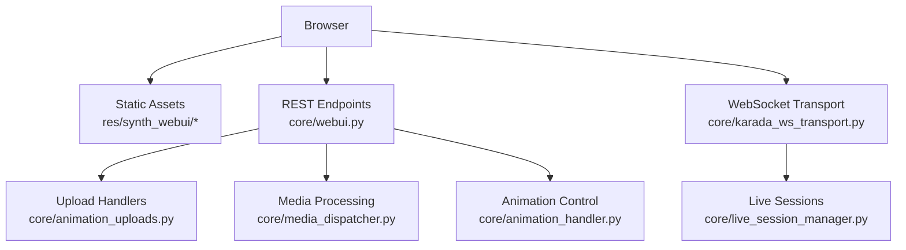
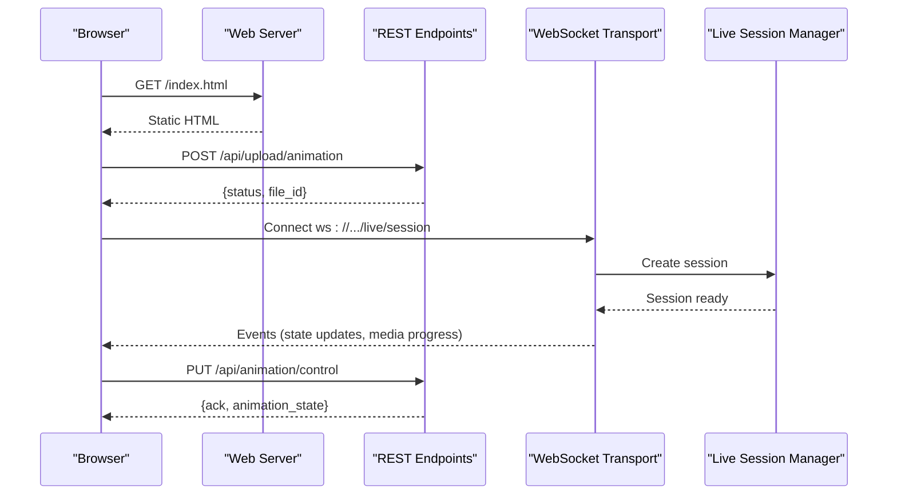
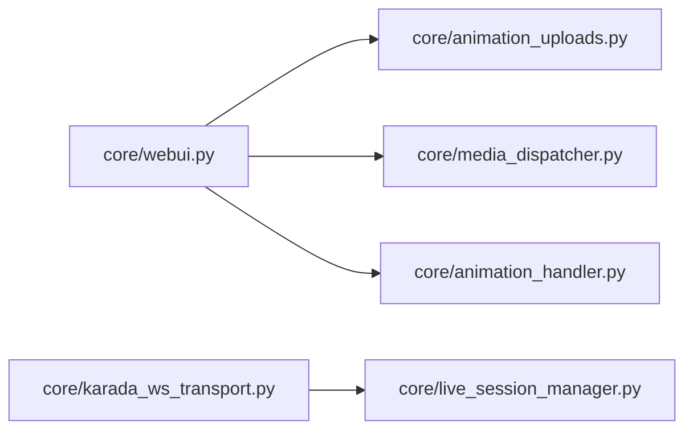

# WebUI Endpoints

<cite>
**Referenced Files in This Document**
- [main.py](file://main.py)
- [core/webui.py](file://core/webui.py)
- [core/animation_handler.py](file://core/animation_handler.py)
- [core/animation_uploads.py](file://core/animation_uploads.py)
- [core/media_dispatcher.py](file://core/media_dispatcher.py)
- [core/live_session_manager.py](file://core/live_session_manager.py)
- [core/karada_ws_transport.py](file://core/karada_ws_transport.py)
- [res/synth_webui/js/main.js](file://res/synth_webui/js/main.js)
- [res/synth_webui/js/vrm-animation-engine.mjs](file://res/synth_webui/js/vrm-animation-engine.mjs)
- [frontend/src/services/synth-ws.ts](file://frontend/src/services/synth-ws.ts)
- [frontend/src/services/audio-upload.ts](file://frontend/src/services/audio-upload.ts)
- [scripts/run_webui.py](file://scripts/run_webui.py)
</cite>

## Table of Contents
1. [Introduction](#introduction)
2. [Project Structure](#project-structure)
3. [Core Components](#core-components)
4. [Architecture Overview](#architecture-overview)
5. [Detailed Component Analysis](#detailed-component-analysis)
6. [Dependency Analysis](#dependency-analysis)
7. [Performance Considerations](#performance-considerations)
8. [Troubleshooting Guide](#troubleshooting-guide)
9. [Conclusion](#conclusion)
10. [Appendices](#appendices)

## Introduction
This document describes the WebUI-specific REST endpoints and real-time communication interfaces exposed by the application for browser-based interactions. It covers file upload endpoints, media processing APIs, animation control endpoints, and WebSocket connections used for live sessions, file management operations, and UI state synchronization. It also provides integration examples and guidance for handling real-time updates from the server to the client.

## Project Structure
The WebUI is served as static assets with dynamic endpoints implemented in Python. The main entry point initializes the web server and mounts routes for both static content and API endpoints. Client-side code resides under the frontend and legacy WebUI JavaScript directories. Real-time communication uses WebSocket transports for live sessions and streaming updates.

**Diagram sources**
- [main.py:1-200](file://main.py#L1-L200)
- [core/webui.py:1-200](file://core/webui.py#L1-L200)
- [core/animation_uploads.py:1-200](file://core/animation_uploads.py#L1-L200)
- [core/media_dispatcher.py:1-200](file://core/media_dispatcher.py#L1-L200)
- [core/animation_handler.py:1-200](file://core/animation_handler.py#L1-L200)
- [core/karada_ws_transport.py:1-200](file://core/karada_ws_transport.py#L1-L200)
- [core/live_session_manager.py:1-200](file://core/live_session_manager.py#L1-L200)

**Section sources**
- [main.py:1-200](file://main.py#L1-L200)
- [scripts/run_webui.py:1-100](file://scripts/run_webui.py#L1-L100)

## Core Components
- REST API layer: Provides HTTP endpoints for uploads, media processing, and animation control.
- Upload handlers: Manage multipart file uploads for animations and skins.
- Media dispatcher: Routes media files through processing pipelines (transcoding, thumbnail generation).
- Animation handler: Controls VRM animations, state transitions, and expression updates.
- WebSocket transport: Manages persistent connections for live sessions and real-time UI state sync.
- Live session manager: Orchestrates session lifecycle, room membership, and event broadcasting.

**Section sources**
- [core/webui.py:1-200](file://core/webui.py#L1-L200)
- [core/animation_uploads.py:1-200](file://core/animation_uploads.py#L1-L200)
- [core/media_dispatcher.py:1-200](file://core/media_dispatcher.py#L1-L200)
- [core/animation_handler.py:1-200](file://core/animation_handler.py#L1-L200)
- [core/karada_ws_transport.py:1-200](file://core/karada_ws_transport.py#L1-L200)
- [core/live_session_manager.py:1-200](file://core/live_session_manager.py#L1-L200)

## Architecture Overview
The WebUI architecture separates static asset serving from dynamic API logic. Clients request HTML/CSS/JS from static paths and interact with REST endpoints for data and operations. WebSocket connections are established for live features such as voice, chat, and animation state synchronization.

**Diagram sources**
- [core/webui.py:1-200](file://core/webui.py#L1-L200)
- [core/animation_uploads.py:1-200](file://core/animation_uploads.py#L1-L200)
- [core/karada_ws_transport.py:1-200](file://core/karada_ws_transport.py#L1-L200)
- [core/live_session_manager.py:1-200](file://core/live_session_manager.py#L1-L200)

## Detailed Component Analysis

### REST Endpoints for File Uploads
Endpoints accept multipart/form-data payloads for animations and skins. They validate file types, sizes, and metadata, then persist files and return identifiers for subsequent operations.

- Typical flow:
  - Client sends a POST request with form fields and file parts.
  - Server validates inputs and writes to storage.
  - Server returns a JSON response containing file IDs and status.

Integration example:
- Use FormData to append files and metadata.
- Send POST to the upload endpoint.
- Handle success or error responses accordingly.

**Section sources**
- [core/animation_uploads.py:1-200](file://core/animation_uploads.py#L1-L200)
- [frontend/src/services/audio-upload.ts:1-200](file://frontend/src/services/audio-upload.ts#L1-L200)

### Media Processing APIs
Media endpoints orchestrate transcoding, thumbnail generation, and format normalization. They expose endpoints to trigger processing jobs and poll for completion.

- Typical flow:
  - Client requests processing via a POST endpoint.
  - Server queues the job and returns a job ID.
  - Client polls a status endpoint until completion.
  - Server responds with processed media URLs.

Integration example:
- Submit a processing request with media URL or uploaded file ID.
- Poll the status endpoint at intervals.
- On success, update the UI with the new media resource.

**Section sources**
- [core/media_dispatcher.py:1-200](file://core/media_dispatcher.py#L1-L200)

### Animation Control Endpoints
Animation endpoints manage VRM model animations, expressions, and state transitions. They support starting, stopping, looping, and blending animations, as well as querying current state.

- Typical flow:
  - Client sends a control command (start/stop/blend) with parameters.
  - Server validates the command and applies it to the animation engine.
  - Server acknowledges the action and may emit state updates over WebSocket.

Integration example:
- Construct a control payload with animation ID and options.
- Send a PUT request to the control endpoint.
- Listen for WebSocket events to reflect changes in the UI.

**Section sources**
- [core/animation_handler.py:1-200](file://core/animation_handler.py#L1-L200)
- [res/synth_webui/js/vrm-animation-engine.mjs:1-200](file://res/synth_webui/js/vrm-animation-engine.mjs#L1-L200)

### WebSocket Connections for Live Sessions
WebSocket endpoints provide persistent connections for live sessions, enabling real-time communication between the browser and server. They handle session creation, message routing, and event broadcasting.

- Typical flow:
  - Client connects to the WebSocket endpoint with authentication tokens if required.
  - Server creates a session and joins the client to a room.
  - Server and client exchange messages and events.
  - Connection is closed gracefully on disconnect.

Integration example:
- Establish a WebSocket connection using the provided URL pattern.
- Subscribe to relevant channels or rooms.
- Handle incoming events to update UI state or trigger actions.

**Section sources**
- [core/karada_ws_transport.py:1-200](file://core/karada_ws_transport.py#L1-L200)
- [core/live_session_manager.py:1-200](file://core/live_session_manager.py#L1-L200)
- [frontend/src/services/synth-ws.ts:1-200](file://frontend/src/services/synth-ws.ts#L1-200)

### File Management Operations
File management endpoints allow listing, deleting, and organizing files within the WebUI context. They support pagination, filtering, and batch operations.

- Typical flow:
  - Client requests a list of files with optional filters.
  - Server returns a paginated response with file metadata.
  - Client can delete or move files via dedicated endpoints.

Integration example:
- Fetch the file list and render in a grid or table.
- Implement delete actions with confirmation prompts.
- Refresh the list after mutations.

**Section sources**
- [core/webui.py:1-200](file://core/webui.py#L1-L200)

### UI State Synchronization
Real-time UI state synchronization is achieved through WebSocket events that push updates to connected clients. This includes animation states, media progress, and session status.

- Typical flow:
  - Server emits events when state changes occur.
  - Client receives events and updates local state.
  - UI reflects the latest state without manual refresh.

Integration example:
- Subscribe to state change events.
- Update component props or store values upon receiving events.
- Debounce frequent updates to optimize performance.

**Section sources**
- [core/karada_ws_transport.py:1-200](file://core/karada_ws_transport.py#L1-L200)
- [res/synth_webui/js/main.js:1-200](file://res/synth_webui/js/main.js#L1-200)

## Dependency Analysis
The WebUI components depend on each other in a layered fashion. REST endpoints call into upload handlers, media processors, and animation controllers. WebSocket transport relies on the live session manager for session orchestration.

**Diagram sources**
- [core/webui.py:1-200](file://core/webui.py#L1-L200)
- [core/animation_uploads.py:1-200](file://core/animation_uploads.py#L1-L200)
- [core/media_dispatcher.py:1-200](file://core/media_dispatcher.py#L1-L200)
- [core/animation_handler.py:1-200](file://core/animation_handler.py#L1-L200)
- [core/karada_ws_transport.py:1-200](file://core/karada_ws_transport.py#L1-L200)
- [core/live_session_manager.py:1-200](file://core/live_session_manager.py#L1-L200)

**Section sources**
- [core/webui.py:1-200](file://core/webui.py#L1-L200)
- [core/live_session_manager.py:1-200](file://core/live_session_manager.py#L1-L200)

## Performance Considerations
- Use chunked uploads for large files to avoid timeouts.
- Implement background processing for media tasks to keep API responses fast.
- Cache frequently accessed metadata and thumbnails.
- Limit WebSocket message frequency with batching or throttling.
- Monitor memory usage during transcoding and animation loading.

[No sources needed since this section provides general guidance]

## Troubleshooting Guide
Common issues and resolutions:
- Upload failures: Check file size limits and MIME type validation.
- Media processing delays: Verify queue health and worker availability.
- WebSocket disconnects: Ensure proper reconnection logic and token refresh.
- Animation playback errors: Validate animation descriptors and VRM compatibility.

**Section sources**
- [core/animation_uploads.py:1-200](file://core/animation_uploads.py#L1-L200)
- [core/media_dispatcher.py:1-200](file://core/media_dispatcher.py#L1-L200)
- [core/karada_ws_transport.py:1-200](file://core/karada_ws_transport.py#L1-L200)

## Conclusion
The WebUI exposes a comprehensive set of REST and WebSocket endpoints to support browser-based interactions. By following the integration patterns and best practices outlined here, developers can build robust clients that leverage file uploads, media processing, animation controls, and real-time communication effectively.

[No sources needed since this section summarizes without analyzing specific files]

## Appendices

### Integration Examples

#### Uploading an Animation
- Create a FormData object and append the animation file along with metadata.
- Send a POST request to the upload endpoint.
- Handle the response to obtain the file ID for further operations.

**Section sources**
- [core/animation_uploads.py:1-200](file://core/animation_uploads.py#L1-L200)
- [frontend/src/services/audio-upload.ts:1-200](file://frontend/src/services/audio-upload.ts#L1-200)

#### Controlling Animations
- Construct a control payload with animation ID and options.
- Send a PUT request to the animation control endpoint.
- Listen for WebSocket events to confirm state changes.

**Section sources**
- [core/animation_handler.py:1-200](file://core/animation_handler.py#L1-L200)
- [res/synth_webui/js/vrm-animation-engine.mjs:1-200](file://res/synth_webui/js/vrm-animation-engine.mjs#L1-L200)

#### Connecting to Live Sessions
- Establish a WebSocket connection using the appropriate URL pattern.
- Authenticate if required and join a session room.
- Subscribe to events and handle incoming messages.

**Section sources**
- [core/karada_ws_transport.py:1-200](file://core/karada_ws_transport.py#L1-L200)
- [frontend/src/services/synth-ws.ts:1-200](file://frontend/src/services/synth-ws.ts#L1-200)