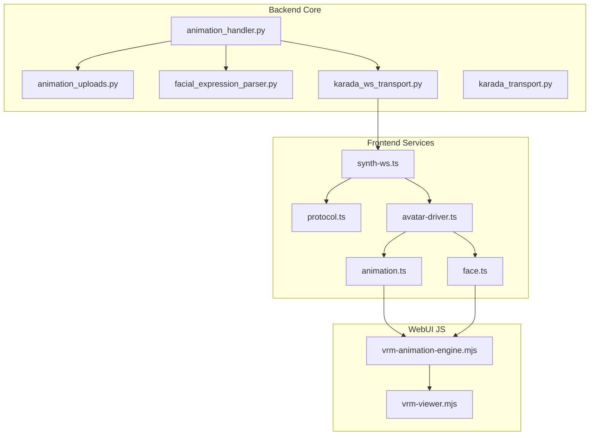
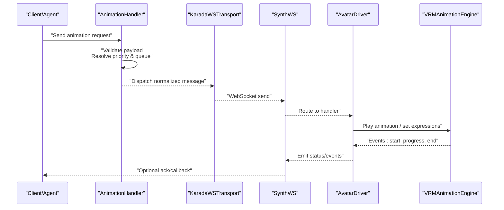
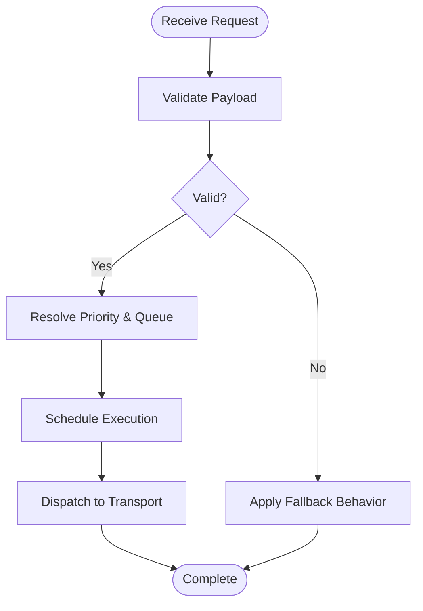
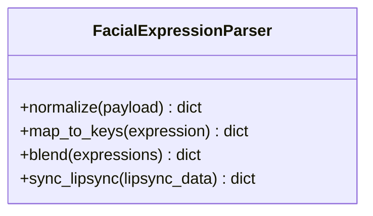
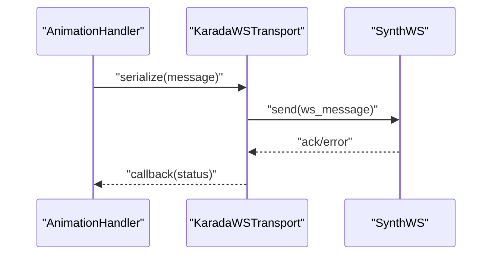
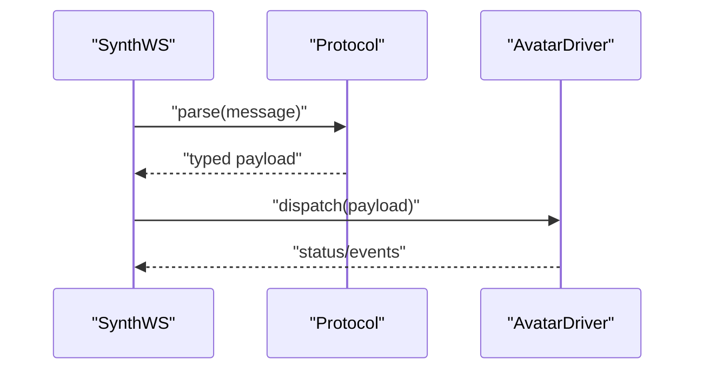
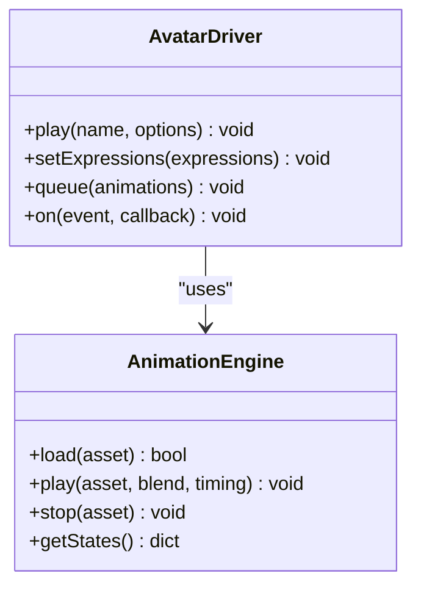
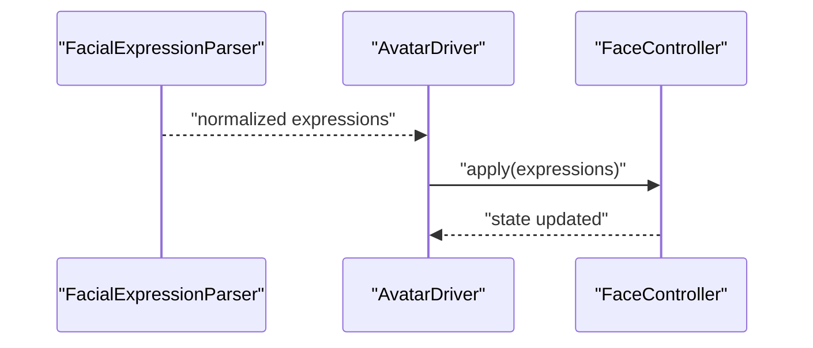
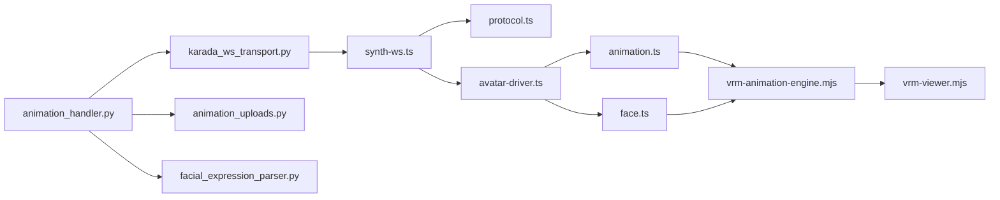

# Animation Control Messages

<cite>
**Referenced Files in This Document**
- [core/animation_handler.py](file://core/animation_handler.py)
- [core/animation_uploads.py](file://core/animation_uploads.py)
- [core/facial_expression_parser.py](file://core/facial_expression_parser.py)
- [core/karada_ws_transport.py](file://core/karada_ws_transport.py)
- [core/karada_transport.py](file://core/karada_transport.py)
- [frontend/src/composables/vrm/animation.ts](file://frontend/src/composables/vrm/animation.ts)
- [frontend/src/composables/vrm/avatar-driver.ts](file://frontend/src/composables/vrm/avatar-driver.ts)
- [frontend/src/composables/vrm/face.ts](file://frontend/src/composables/vrm/face.ts)
- [frontend/src/services/synth-ws.ts](file://frontend/src/services/synth-ws.ts)
- [frontend/src/services/protocol.ts](file://frontend/src/services/protocol.ts)
- [res/synth_webui/js/vrm-animation-engine.mjs](file://res/synth_webui/js/vrm-animation-engine.mjs)
- [res/synth_webui/js/vrm-viewer.mjs](file://res/synth_webui/js/vrm-viewer.mjs)
- [docs/animation_system.rst](file://docs/animation_system.rst)
- [docs/animation_priority_system.md](file://docs/animation_priority_system.md)
- [docs/vrm_animations.rst](file://docs/vrm_animations.rst)
- [tests/test_animation_handler.py](file://tests/test_animation_handler.py)
- [tests/test_animation_handler_fallback.py](file://tests/test_animation_handler_fallback.py)
- [tests/test_animation_handler_timing.py](file://tests/test_animation_handler_timing.py)
- [tests/test_animation_handler_variants.py](file://tests/test_animation_handler_variants.py)
- [tests/test_animation_state_api.py](file://tests/test_animation_state_api.py)
- [tests/test_animation_state_sync.py](file://tests/test_animation_state_sync.py)
- [tests/test_webui_animation_flow.py](file://tests/test_webui_animation_flow.py)
</cite>

## Table of Contents
1. [Introduction](#introduction)
2. [Project Structure](#project-structure)
3. [Core Components](#core-components)
4. [Architecture Overview](#architecture-overview)
5. [Detailed Component Analysis](#detailed-component-analysis)
6. [Dependency Analysis](#dependency-analysis)
7. [Performance Considerations](#performance-considerations)
8. [Troubleshooting Guide](#troubleshooting-guide)
9. [Conclusion](#conclusion)
10. [Appendices](#appendices)

## Introduction
This document explains how animation control is implemented and consumed over the WebSocket protocol in the project. It covers:
- Triggering animations via messages
- Expression controls and facial mapping
- Gesture commands and VRM avatar manipulation
- Animation queuing, priority systems, blending modes, and timing controls
- Lip-sync synchronization and emotion-driven animations
- Programmatic triggering, event handling, customization, error handling, and fallback mechanisms

The goal is to provide both a high-level understanding and actionable details for developers integrating with or extending the animation system.

## Project Structure
Animation control spans backend Python modules, frontend TypeScript composable services, and WebUI JavaScript engines:
- Backend core handles message parsing, validation, scheduling, and transport to the client
- Frontend composable services manage WebSocket communication and state
- WebUI JavaScript drives VRM animation playback and expression updates

**Diagram sources**
- [core/animation_handler.py](file://core/animation_handler.py)
- [core/animation_uploads.py](file://core/animation_uploads.py)
- [core/facial_expression_parser.py](file://core/facial_expression_parser.py)
- [core/karada_ws_transport.py](file://core/karada_ws_transport.py)
- [core/karada_transport.py](file://core/karada_transport.py)
- [frontend/src/services/synth-ws.ts](file://frontend/src/services/synth-ws.ts)
- [frontend/src/services/protocol.ts](file://frontend/src/services/protocol.ts)
- [frontend/src/composables/vrm/avatar-driver.ts](file://frontend/src/composables/vrm/avatar-driver.ts)
- [frontend/src/composables/vrm/animation.ts](file://frontend/src/composables/vrm/animation.ts)
- [frontend/src/composables/vrm/face.ts](file://frontend/src/composables/vrm/face.ts)
- [res/synth_webui/js/vrm-animation-engine.mjs](file://res/synth_webui/js/vrm-animation-engine.mjs)
- [res/synth_webui/js/vrm-viewer.mjs](file://res/synth_webui/js/vrm-viewer.mjs)

**Section sources**
- [docs/animation_system.rst](file://docs/animation_system.rst)
- [docs/animation_priority_system.md](file://docs/animation_priority_system.md)
- [docs/vrm_animations.rst](file://docs/vrm_animations.rst)

## Core Components
- Animation Handler (backend): Parses incoming animation requests, validates payloads, applies priority and queuing rules, and dispatches to transport.
- Facial Expression Parser (backend): Normalizes expression payloads and maps them to target keys for the client.
- Karada Transport (backend): Serializes and sends messages to the client over WebSocket.
- Frontend WebSocket Service: Manages connection lifecycle, message routing, and retries.
- Avatar Driver (frontend): Orchestrates animation and expression updates on the VRM model.
- Animation Engine (WebUI JS): Executes animations with blending, timing, and queue management.

Key responsibilities:
- Message schema enforcement and normalization
- Priority-based scheduling and conflict resolution
- Blending mode selection and transition smoothing
- Event emission for lifecycle hooks and debugging
- Robust fallback when assets or targets are missing

**Section sources**
- [core/animation_handler.py](file://core/animation_handler.py)
- [core/facial_expression_parser.py](file://core/facial_expression_parser.py)
- [core/karada_ws_transport.py](file://core/karada_ws_transport.py)
- [frontend/src/services/synth-ws.ts](file://frontend/src/services/synth-ws.ts)
- [frontend/src/composables/vrm/avatar-driver.ts](file://frontend/src/composables/vrm/avatar-driver.ts)
- [res/synth_webui/js/vrm-animation-engine.mjs](file://res/synth_webui/js/vrm-animation-engine.mjs)

## Architecture Overview
The animation control flow begins with a client or internal component sending an animation request. The backend validates and schedules it, then pushes a normalized message to the frontend. The frontend avatar driver coordinates with the WebUI animation engine to play animations and update expressions.

**Diagram sources**
- [core/animation_handler.py](file://core/animation_handler.py)
- [core/karada_ws_transport.py](file://core/karada_ws_transport.py)
- [frontend/src/services/synth-ws.ts](file://frontend/src/services/synth-ws.ts)
- [frontend/src/composables/vrm/avatar-driver.ts](file://frontend/src/composables/vrm/avatar-driver.ts)
- [res/synth_webui/js/vrm-animation-engine.mjs](file://res/synth_webui/js/vrm-animation-engine.mjs)

## Detailed Component Analysis

### Animation Handler (Backend)
Responsibilities:
- Accepts structured animation descriptors
- Validates fields such as name, priority, blend mode, timing, and variants
- Applies priority and queuing policies to avoid conflicts
- Emits events for lifecycle tracking
- Provides fallback behavior when assets are missing or invalid

Priority and Queuing:
- Higher-priority animations can preempt lower-priority ones based on policy
- Queues ensure ordered execution and prevent race conditions
- Supports immediate, delayed, and duration-based scheduling

Blending Modes:
- Selects blending strategy (e.g., additive, multiplicative, replace)
- Smooth transitions between overlapping animations

Timing Controls:
- Start time offsets, durations, loops, and easing functions
- Supports relative and absolute timing semantics

Error Handling and Fallback:
- Graceful degradation when animations are unavailable
- Default idle or neutral states when errors occur

**Diagram sources**
- [core/animation_handler.py](file://core/animation_handler.py)

**Section sources**
- [core/animation_handler.py](file://core/animation_handler.py)
- [docs/animation_priority_system.md](file://docs/animation_priority_system.md)
- [tests/test_animation_handler.py](file://tests/test_animation_handler.py)
- [tests/test_animation_handler_fallback.py](file://tests/test_animation_handler_fallback.py)
- [tests/test_animation_handler_timing.py](file://tests/test_animation_handler_timing.py)
- [tests/test_animation_handler_variants.py](file://tests/test_animation_handler_variants.py)

### Facial Expression Parser (Backend)
Responsibilities:
- Normalizes expression payloads into a canonical format
- Maps semantic expressions to target keys used by the client
- Supports blends and overrides for complex facial states

Lip-Sync Synchronization:
- Integrates with TTS lip-sync data to drive mouth shapes
- Aligns phoneme timings with animation frames

Emotion-Driven Animations:
- Combines emotion tags with expressions for layered effects
- Ensures consistent blending across face and body animations

**Diagram sources**
- [core/facial_expression_parser.py](file://core/facial_expression_parser.py)

**Section sources**
- [core/facial_expression_parser.py](file://core/facial_expression_parser.py)

### Karada Transport (Backend)
Responsibilities:
- Serializes animation and expression messages
- Sends messages over WebSocket to the frontend
- Handles reconnection and retry logic

Integration Points:
- Bridges animation handler outputs to the client
- Ensures message ordering and reliability

**Diagram sources**
- [core/karada_ws_transport.py](file://core/karada_ws_transport.py)
- [core/karada_transport.py](file://core/karada_transport.py)

**Section sources**
- [core/karada_ws_transport.py](file://core/karada_ws_transport.py)
- [core/karada_transport.py](file://core/karada_transport.py)

### Frontend WebSocket Service and Protocol
Responsibilities:
- Manages WebSocket lifecycle (connect, reconnect, disconnect)
- Routes incoming messages to appropriate handlers
- Implements protocol schemas for animation and expression messages

Protocol Schema:
- Defines message types for animation triggers, expression updates, and gestures
- Includes fields for priority, blending, timing, and metadata

**Diagram sources**
- [frontend/src/services/synth-ws.ts](file://frontend/src/services/synth-ws.ts)
- [frontend/src/services/protocol.ts](file://frontend/src/services/protocol.ts)

**Section sources**
- [frontend/src/services/synth-ws.ts](file://frontend/src/services/synth-ws.ts)
- [frontend/src/services/protocol.ts](file://frontend/src/services/protocol.ts)

### Avatar Driver and Animation Engine (Frontend)
Responsibilities:
- Coordinates animation playback and expression updates on the VRM model
- Manages animation queues, priorities, and blending modes
- Emits lifecycle events for UI and debugging

Animation Engine Features:
- Supports multiple blending strategies
- Handles timing controls (start, duration, loop, easing)
- Provides fallback animations when requested assets are missing

**Diagram sources**
- [frontend/src/composables/vrm/avatar-driver.ts](file://frontend/src/composables/vrm/avatar-driver.ts)
- [frontend/src/composables/vrm/animation.ts](file://frontend/src/composables/vrm/animation.ts)
- [res/synth_webui/js/vrm-animation-engine.mjs](file://res/synth_webui/js/vrm-animation-engine.mjs)

**Section sources**
- [frontend/src/composables/vrm/avatar-driver.ts](file://frontend/src/composables/vrm/avatar-driver.ts)
- [frontend/src/composables/vrm/animation.ts](file://frontend/src/composables/vrm/animation.ts)
- [res/synth_webui/js/vrm-animation-engine.mjs](file://res/synth_webui/js/vrm-animation-engine.mjs)

### Face Controller (Frontend)
Responsibilities:
- Updates facial blendshapes and expression keys
- Syncs with TTS lip-sync data for accurate mouth movement
- Maintains consistency across emotion-driven overlays

**Diagram sources**
- [core/facial_expression_parser.py](file://core/facial_expression_parser.py)
- [frontend/src/composables/vrm/face.ts](file://frontend/src/composables/vrm/face.ts)

**Section sources**
- [frontend/src/composables/vrm/face.ts](file://frontend/src/composables/vrm/face.ts)

## Dependency Analysis
The animation system exhibits clear separation of concerns:
- Backend modules handle validation, scheduling, and transport
- Frontend services manage WebSocket communication and state
- WebUI components execute animations and update the VRM model

**Diagram sources**
- [core/animation_handler.py](file://core/animation_handler.py)
- [core/animation_uploads.py](file://core/animation_uploads.py)
- [core/facial_expression_parser.py](file://core/facial_expression_parser.py)
- [core/karada_ws_transport.py](file://core/karada_ws_transport.py)
- [frontend/src/services/synth-ws.ts](file://frontend/src/services/synth-ws.ts)
- [frontend/src/services/protocol.ts](file://frontend/src/services/protocol.ts)
- [frontend/src/composables/vrm/avatar-driver.ts](file://frontend/src/composables/vrm/avatar-driver.ts)
- [frontend/src/composables/vrm/animation.ts](file://frontend/src/composables/vrm/animation.ts)
- [frontend/src/composables/vrm/face.ts](file://frontend/src/composables/vrm/face.ts)
- [res/synth_webui/js/vrm-animation-engine.mjs](file://res/synth_webui/js/vrm-animation-engine.mjs)
- [res/synth_webui/js/vrm-viewer.mjs](file://res/synth_webui/js/vrm-viewer.mjs)

**Section sources**
- [docs/animation_system.rst](file://docs/animation_system.rst)
- [docs/vrm_animations.rst](file://docs/vrm_animations.rst)

## Performance Considerations
- Minimize redundant animation triggers by coalescing requests
- Use efficient blending modes to reduce CPU/GPU load
- Cache frequently used animations and expressions
- Avoid excessive logging in hot paths; use sampling where appropriate
- Prefer incremental updates for facial expressions to maintain frame rate

[No sources needed since this section provides general guidance]

## Troubleshooting Guide
Common issues and resolutions:
- Missing animation assets: Ensure assets are uploaded and paths are correct; rely on fallback behaviors
- Priority conflicts: Review priority settings and queue policies; adjust to prevent preemption issues
- Timing mismatches: Verify start times and durations; align with TTS lip-sync data
- WebSocket connectivity: Check reconnection logic and network stability; inspect error callbacks
- Expression mapping errors: Validate expression keys and mappings; confirm parser output

Relevant tests and documentation:
- Animation handler behavior and fallbacks
- State synchronization and API contracts
- WebUI animation flow integration

**Section sources**
- [tests/test_animation_handler.py](file://tests/test_animation_handler.py)
- [tests/test_animation_handler_fallback.py](file://tests/test_animation_handler_fallback.py)
- [tests/test_animation_state_api.py](file://tests/test_animation_state_api.py)
- [tests/test_animation_state_sync.py](file://tests/test_animation_state_sync.py)
- [tests/test_webui_animation_flow.py](file://tests/test_webui_animation_flow.py)

## Conclusion
The animation control system provides a robust, extensible framework for managing animations, expressions, and gestures over WebSocket. It supports advanced features like priority-based queuing, blending modes, timing controls, and lip-sync synchronization. By following the documented patterns and leveraging built-in fallback mechanisms, developers can create responsive and reliable avatar interactions.

[No sources needed since this section summarizes without analyzing specific files]

## Appendices

### Example Workflows

#### Triggering Animations Programmatically
- Compose a structured animation descriptor with name, priority, blend mode, and timing
- Send via the WebSocket service to the backend
- Handle lifecycle events for start, progress, and completion

**Section sources**
- [core/animation_handler.py](file://core/animation_handler.py)
- [frontend/src/services/synth-ws.ts](file://frontend/src/services/synth-ws.ts)
- [frontend/src/composables/vrm/avatar-driver.ts](file://frontend/src/composables/vrm/avatar-driver.ts)

#### Handling Animation Events
- Subscribe to event emitters in the avatar driver
- Update UI or trigger side effects based on event payloads
- Implement error boundaries to catch and log failures

**Section sources**
- [frontend/src/composables/vrm/avatar-driver.ts](file://frontend/src/composables/vrm/avatar-driver.ts)
- [res/synth_webui/js/vrm-animation-engine.mjs](file://res/synth_webui/js/vrm-animation-engine.mjs)

#### Customizing Animation Behaviors
- Adjust blending modes and timing parameters per animation
- Override default priorities and queue policies
- Provide custom fallback animations for missing assets

**Section sources**
- [core/animation_handler.py](file://core/animation_handler.py)
- [docs/animation_priority_system.md](file://docs/animation_priority_system.md)