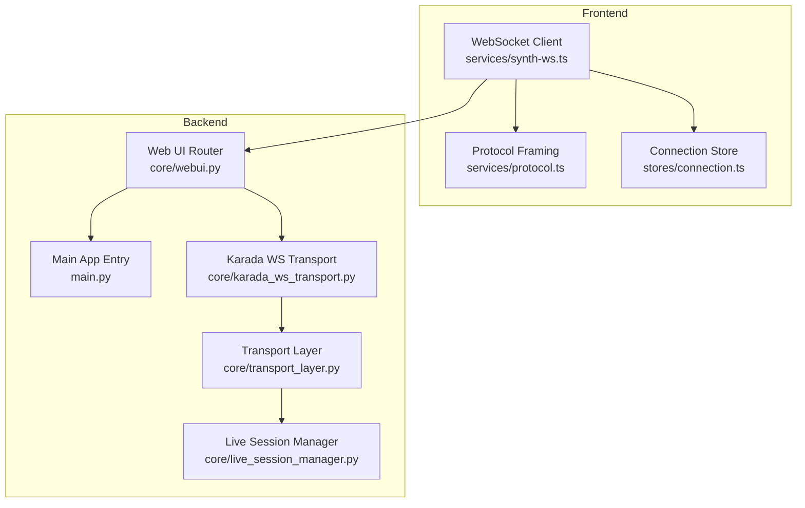
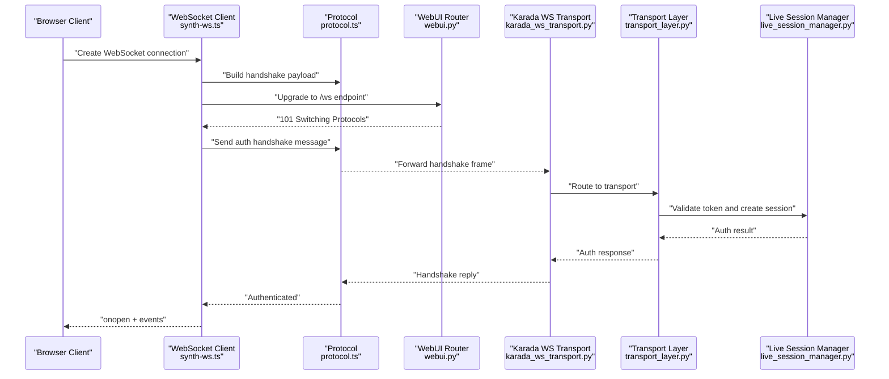
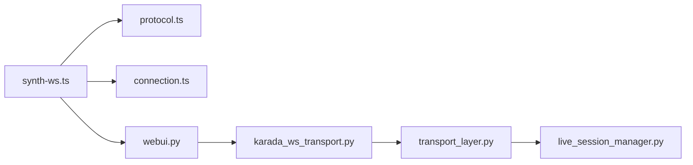

# Connection & Handshake

<cite>
**Referenced Files in This Document**
- [main.py](file://main.py)
- [webui.py](file://core/webui.py)
- [synth_ws.ts](file://frontend/src/services/synth-ws.ts)
- [protocol.ts](file://frontend/src/services/protocol.ts)
- [connection.ts](file://frontend/src/stores/connection.ts)
- [karada_ws_transport.py](file://core/karada_ws_transport.py)
- [transport_layer.py](file://core/transport_layer.py)
- [live_session_manager.py](file://core/live_session_manager.py)
- [api_endpoints.rst](file://docs/api_endpoints.rst)
</cite>

## Table of Contents
1. [Introduction](#introduction)
2. [Project Structure](#project-structure)
3. [Core Components](#core-components)
4. [Architecture Overview](#architecture-overview)
5. [Detailed Component Analysis](#detailed-component-analysis)
6. [Dependency Analysis](#dependency-analysis)
7. [Performance Considerations](#performance-considerations)
8. [Troubleshooting Guide](#troubleshooting-guide)
9. [Conclusion](#conclusion)
10. [Appendices](#appendices)

## Introduction
This document explains how Synthetic Heart establishes WebSocket connections and performs the authentication handshake, from initial connection to an authenticated session. It covers URL patterns, query parameters, token handling, message formats, state management, error handling, timeouts, reconnection strategies, and client examples for JavaScript and Python. It also provides guidance on managing multiple concurrent connections.

## Project Structure
The WebSocket subsystem spans both backend (Python) and frontend (TypeScript) components:
- Backend entry points expose HTTP endpoints and upgrade routes that handle WebSocket upgrades and routing.
- Frontend services implement the WebSocket client, protocol framing, and connection lifecycle management.
- Transport layers abstract transport details and integrate with internal session managers.

**Diagram sources**
- [synth_ws.ts](file://frontend/src/services/synth-ws.ts)
- [protocol.ts](file://frontend/src/services/protocol.ts)
- [connection.ts](file://frontend/src/stores/connection.ts)
- [webui.py](file://core/webui.py)
- [main.py](file://main.py)
- [karada_ws_transport.py](file://core/karada_ws_transport.py)
- [transport_layer.py](file://core/transport_layer.py)
- [live_session_manager.py](file://core/live_session_manager.py)

**Section sources**
- [main.py](file://main.py)
- [webui.py](file://core/webui.py)
- [synth_ws.ts](file://frontend/src/services/synth-ws.ts)
- [protocol.ts](file://frontend/src/services/protocol.ts)
- [connection.ts](file://frontend/src/stores/connection.ts)
- [karada_ws_transport.py](file://core/karada_ws_transport.py)
- [transport_layer.py](file://core/transport_layer.py)
- [live_session_manager.py](file://core/live_session_manager.py)

## Core Components
- WebSocket Client (Frontend): Manages connection lifecycle, reconnection, and event dispatching.
- Protocol Framing (Frontend): Encodes/decodes messages for the handshake and subsequent communication.
- Connection Store (Frontend): Holds connection state, tokens, and active sessions.
- Web UI Router (Backend): Registers WebSocket routes and handles upgrades.
- Karada WS Transport (Backend): Bridges WebSocket frames to internal transports and session managers.
- Transport Layer (Backend): Provides unified transport abstractions and integrates with session management.
- Live Session Manager (Backend): Orchestrates per-session state and lifecycle.

**Section sources**
- [synth_ws.ts](file://frontend/src/services/synth-ws.ts)
- [protocol.ts](file://frontend/src/services/protocol.ts)
- [connection.ts](file://frontend/src/stores/connection.ts)
- [webui.py](file://core/webui.py)
- [karada_ws_transport.py](file://core/karada_ws_transport.py)
- [transport_layer.py](file://core/transport_layer.py)
- [live_session_manager.py](file://core/live_session_manager.py)

## Architecture Overview
The connection lifecycle follows a standard WebSocket flow with an explicit authentication handshake after upgrade:

**Diagram sources**
- [synth_ws.ts](file://frontend/src/services/synth-ws.ts)
- [protocol.ts](file://frontend/src/services/protocol.ts)
- [webui.py](file://core/webui.py)
- [karada_ws_transport.py](file://core/karada_ws_transport.py)
- [transport_layer.py](file://core/transport_layer.py)
- [live_session_manager.py](file://core/live_session_manager.py)

## Detailed Component Analysis

### WebSocket Client (Frontend)
Responsibilities:
- Establishes the WebSocket connection using configured base URLs and environment variables.
- Handles connection states: connecting, open, closed, error.
- Implements reconnection with exponential backoff and jitter.
- Dispatches events for application-level consumers.

Key behaviors:
- On connect, sends an authentication handshake message containing the token and optional session metadata.
- Maintains a heartbeat/ping mechanism to keep the connection alive.
- Emits typed events for open, close, error, and message receipt.

Reconnection strategy:
- Retries on transient errors and network failures.
- Uses configurable max retries and backoff caps.
- Resets state on successful reconnect.

Error handling:
- Distinguishes between authentication failures and network errors.
- Propagates meaningful error codes to the UI layer.

**Section sources**
- [synth_ws.ts](file://frontend/src/services/synth-ws.ts)
- [connection.ts](file://frontend/src/stores/connection.ts)

### Protocol Framing (Frontend)
Responsibilities:
- Defines message types for handshake, authentication, and data frames.
- Serializes/deserializes payloads according to the server’s expected schema.
- Ensures consistent ordering and acknowledgment semantics where applicable.

Message format highlights:
- Handshake includes fields such as client version, capabilities, and token.
- Authentication response contains session identifiers and server capabilities.
- Data frames carry structured payloads for chat, media, or control signals.

**Section sources**
- [protocol.ts](file://frontend/src/services/protocol.ts)

### Connection Store (Frontend)
Responsibilities:
- Centralized state for connection status, tokens, and active sessions.
- Persists tokens securely across page reloads when appropriate.
- Exposes reactive properties for UI updates.

State transitions:
- Idle -> Connecting -> Open -> Closed
- Error paths trigger reconnection attempts based on store configuration.

**Section sources**
- [connection.ts](file://frontend/src/stores/connection.ts)

### Web UI Router (Backend)
Responsibilities:
- Registers WebSocket endpoints and HTTP routes.
- Performs initial request validation and upgrades to WebSocket.
- Routes incoming frames to appropriate handlers.

Authentication integration:
- Validates tokens provided in handshake messages.
- Creates or resumes sessions based on credentials.

**Section sources**
- [webui.py](file://core/webui.py)

### Karada WS Transport (Backend)
Responsibilities:
- Bridges WebSocket frames to internal transport mechanisms.
- Enforces message schemas and security policies.
- Coordinates with session manager for lifecycle operations.

Error handling:
- Maps transport errors to standardized responses.
- Logs diagnostic information for debugging.

**Section sources**
- [karada_ws_transport.py](file://core/karada_ws_transport.py)

### Transport Layer (Backend)
Responsibilities:
- Abstracts underlying transport implementations.
- Provides common utilities for serialization, routing, and metrics.
- Integrates with live session manager for state synchronization.

**Section sources**
- [transport_layer.py](file://core/transport_layer.py)

### Live Session Manager (Backend)
Responsibilities:
- Manages per-client session state and lifecycle.
- Handles authentication, authorization, and capability negotiation.
- Coordinates resource allocation and cleanup.

Timeout and reconnection:
- Enforces idle timeouts and graceful disconnects.
- Supports resuming sessions when possible.

**Section sources**
- [live_session_manager.py](file://core/live_session_manager.py)

## Dependency Analysis
The WebSocket subsystem exhibits clear separation between frontend client logic and backend routing/transport layers. Dependencies are primarily unidirectional: frontend depends on backend endpoints; backend layers depend on session managers and shared transports.

**Diagram sources**
- [synth_ws.ts](file://frontend/src/services/synth-ws.ts)
- [protocol.ts](file://frontend/src/services/protocol.ts)
- [connection.ts](file://frontend/src/stores/connection.ts)
- [webui.py](file://core/webui.py)
- [karada_ws_transport.py](file://core/karada_ws_transport.py)
- [transport_layer.py](file://core/transport_layer.py)
- [live_session_manager.py](file://core/live_session_manager.py)

**Section sources**
- [synth_ws.ts](file://frontend/src/services/synth-ws.ts)
- [protocol.ts](file://frontend/src/services/protocol.ts)
- [connection.ts](file://frontend/src/stores/connection.ts)
- [webui.py](file://core/webui.py)
- [karada_ws_transport.py](file://core/karada_ws_transport.py)
- [transport_layer.py](file://core/transport_layer.py)
- [live_session_manager.py](file://core/live_session_manager.py)

## Performance Considerations
- Minimize handshake payload size by sending only necessary fields.
- Use efficient serialization formats and avoid unnecessary allocations.
- Implement heartbeat intervals tuned to network conditions.
- Cache capabilities and session metadata to reduce repeated negotiations.
- Limit concurrent connections per client to prevent resource exhaustion.

[No sources needed since this section provides general guidance]

## Troubleshooting Guide
Common issues and resolutions:
- Authentication failures: Verify token validity and expiration; ensure correct header/query parameter usage.
- Connection timeouts: Adjust client-side timeout configurations and server idle timeouts.
- Reconnection loops: Check for persistent errors and implement circuit breaker patterns.
- Message framing errors: Validate payload schemas and ensure consistent encoding.

Debugging tips:
- Enable verbose logging on both client and server during development.
- Inspect handshake messages and responses for anomalies.
- Monitor session manager logs for lifecycle events and errors.

**Section sources**
- [synth_ws.ts](file://frontend/src/services/synth-ws.ts)
- [protocol.ts](file://frontend/src/services/protocol.ts)
- [connection.ts](file://frontend/src/stores/connection.ts)
- [webui.py](file://core/webui.py)
- [karada_ws_transport.py](file://core/karada_ws_transport.py)
- [transport_layer.py](file://core/transport_layer.py)
- [live_session_manager.py](file://core/live_session_manager.py)

## Conclusion
Synthetic Heart’s WebSocket subsystem provides a robust, secure, and scalable connection framework. The frontend client manages lifecycle and reconnection, while the backend ensures secure authentication and session management through layered transports. Following the documented patterns ensures reliable connectivity and smooth user experiences.

[No sources needed since this section summarizes without analyzing specific files]

## Appendices

### URL Patterns and Query Parameters
- Base WebSocket URL: Constructed from server host and port with ws/wss scheme.
- Endpoint path: Typically /ws or similar, registered by the Web UI router.
- Query parameters: May include token, client version, and feature flags.

**Section sources**
- [webui.py](file://core/webui.py)
- [api_endpoints.rst](file://docs/api_endpoints.rst)

### Authentication Token Handling
- Tokens are passed in the handshake payload or via query parameters.
- Server validates tokens against configured providers or local stores.
- Successful validation returns session identifiers and capabilities.

**Section sources**
- [protocol.ts](file://frontend/src/services/protocol.ts)
- [webui.py](file://core/webui.py)
- [live_session_manager.py](file://core/live_session_manager.py)

### Handshake Message Formats
- Handshake includes client metadata, capabilities, and authentication token.
- Response contains session ID, server capabilities, and any required follow-up actions.
- Subsequent messages use defined frame types for data exchange.

**Section sources**
- [protocol.ts](file://frontend/src/services/protocol.ts)
- [karada_ws_transport.py](file://core/karada_ws_transport.py)

### Timeout Configurations
- Client-side timeouts: Connect, handshake, and heartbeat intervals.
- Server-side timeouts: Idle session timeouts and maximum connection durations.
- Retry policies: Max retries, backoff strategies, and jitter.

**Section sources**
- [synth_ws.ts](file://frontend/src/services/synth-ws.ts)
- [connection.ts](file://frontend/src/stores/connection.ts)
- [live_session_manager.py](file://core/live_session_manager.py)

### Reconnection Strategies
- Exponential backoff with jitter to avoid thundering herd.
- Circuit breaker to prevent excessive retries on persistent failures.
- State reset and capability refresh upon successful reconnect.

**Section sources**
- [synth_ws.ts](file://frontend/src/services/synth-ws.ts)
- [connection.ts](file://frontend/src/stores/connection.ts)

### Client Examples

#### JavaScript Client
Steps:
- Import the WebSocket client module.
- Configure base URL and authentication token.
- Instantiate the client and listen for connection events.
- Handle reconnection and error scenarios.

Reference implementation locations:
- [synth_ws.ts](file://frontend/src/services/synth-ws.ts)
- [protocol.ts](file://frontend/src/services/protocol.ts)
- [connection.ts](file://frontend/src/stores/connection.ts)

#### Python Client
Steps:
- Use a WebSocket library compatible with the server’s protocol.
- Establish connection to the WebSocket endpoint.
- Send authentication handshake with token and metadata.
- Process incoming messages and manage reconnection.

Note: Specific Python client code is not present in the analyzed files; adapt the frontend TypeScript patterns to Python using equivalent libraries.

**Section sources**
- [synth_ws.ts](file://frontend/src/services/synth-ws.ts)
- [protocol.ts](file://frontend/src/services/protocol.ts)
- [connection.ts](file://frontend/src/stores/connection.ts)

### Managing Multiple Concurrent Connections
- Maintain separate client instances per connection.
- Isolate session state and event handlers.
- Implement connection pooling if needed for performance.
- Monitor resource usage and enforce limits.

**Section sources**
- [synth_ws.ts](file://frontend/src/services/synth-ws.ts)
- [connection.ts](file://frontend/src/stores/connection.ts)
- [live_session_manager.py](file://core/live_session_manager.py)