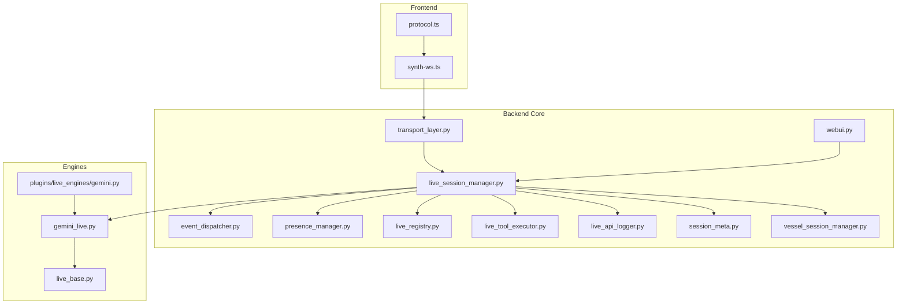
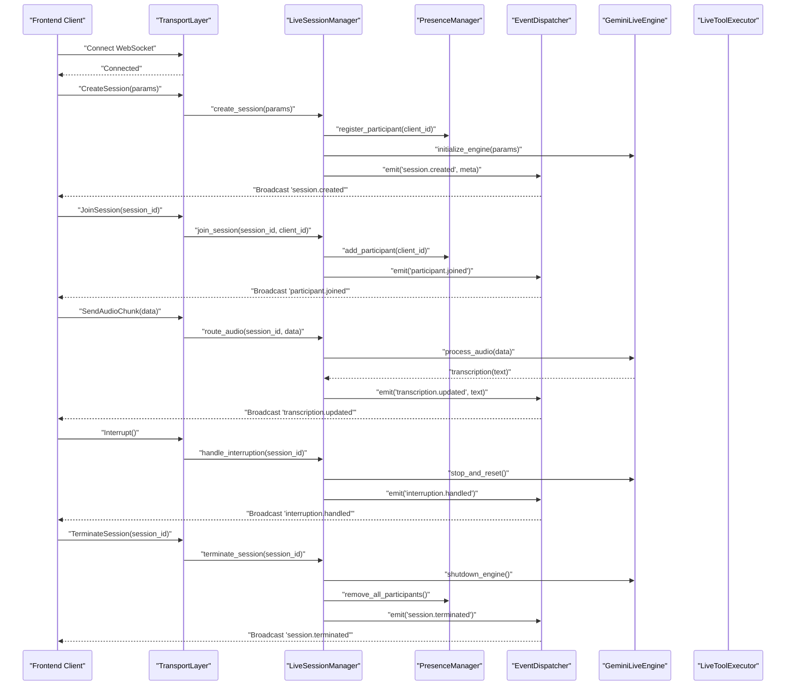
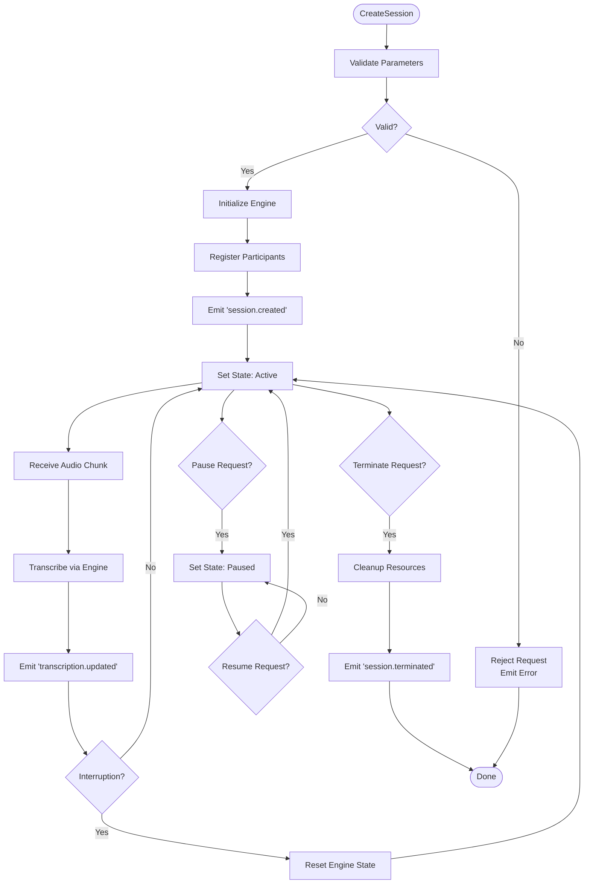
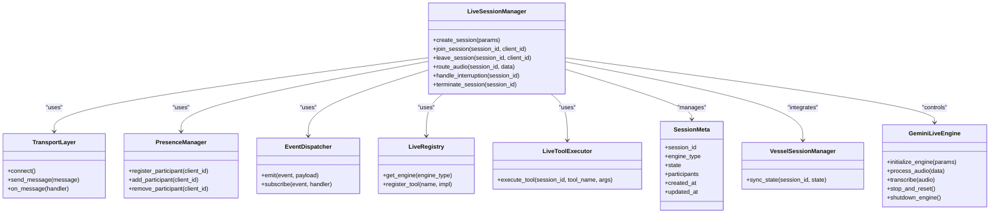

# Live Session Management

<cite>
**Referenced Files in This Document**
- [core/live_session_manager.py](file://core/live_session_manager.py)
- [core/transport_layer.py](file://core/transport_layer.py)
- [core/event_dispatcher.py](file://core/event_dispatcher.py)
- [core/vessel_session_manager.py](file://core/vessel_session_manager.py)
- [core/presence_manager.py](file://core/presence_manager.py)
- [core/live_registry.py](file://core/live_registry.py)
- [core/live_tool_executor.py](file://core/live_tool_executor.py)
- [core/live_api_logger.py](file://core/live_api_logger.py)
- [core/session_meta.py](file://core/session_meta.py)
- [engines/live/gemini_live.py](file://engines/live/gemini_live.py)
- [engines/live/live_base.py](file://engines/live/live_base.py)
- [plugins/live_engines/gemini.py](file://plugins/live_engines/gemini.py)
- [core/webui.py](file://core/webui.py)
- [frontend/src/services/synth-ws.ts](file://frontend/src/services/synth-ws.ts)
- [frontend/src/services/protocol.ts](file://frontend/src/services/protocol.ts)
- [tests/test_live_session_manager.py](file://tests/test_live_session_manager.py)
- [docs/gemini/live-session-management.md](file://docs/gemini/live-session-management.md)
</cite>

## Table of Contents
1. Introduction
2. Project Structure
3. Core Components
4. Architecture Overview
5. Detailed Component Analysis
6. Dependency Analysis
7. Performance Considerations
8. Troubleshooting Guide
9. Conclusion
10. Appendices

## Introduction
This document explains live session management via the WebSocket protocol in the project. It covers how sessions are created, their lifecycle states, participant management, resource allocation, voice conversation handling, real-time transcription, interruption handling, and termination. It also documents persistence and recovery mechanisms, scaling considerations, and provides examples for creating sessions, managing participants, and handling events with robust error handling and cleanup procedures.

## Project Structure
Live session management spans backend Python modules (session manager, transport layer, event dispatcher, presence, registry, tool executor), live engine integrations (Gemini), frontend WebSocket client services, and documentation. The key files involved are:

- Backend core:
  - Session lifecycle and orchestration: core/live_session_manager.py
  - Transport and WebSocket handling: core/transport_layer.py
  - Event bus: core/event_dispatcher.py
  - Presence tracking: core/presence_manager.py
  - Registry of live engines/tools: core/live_registry.py, core/live_tool_executor.py
  - API logging: core/live_api_logger.py
  - Session metadata model: core/session_meta.py
  - Vessel session integration: core/vessel_session_manager.py
  - Web UI endpoints: core/webui.py

- Engines:
  - Base live engine interface: engines/live/live_base.py
  - Gemini live engine implementation: engines/live/gemini_live.py
  - Plugin adapter for Gemini: plugins/live_engines/gemini.py

- Frontend:
  - WebSocket client service: frontend/src/services/synth-ws.ts
  - Protocol definitions: frontend/src/services/protocol.ts

- Tests and docs:
  - Unit tests for session manager: tests/test_live_session_manager.py
  - Documentation: docs/gemini/live-session-management.md

**Diagram sources**
- [core/live_session_manager.py](file://core/live_session_manager.py)
- [core/transport_layer.py](file://core/transport_layer.py)
- [core/event_dispatcher.py](file://core/event_dispatcher.py)
- [core/presence_manager.py](file://core/presence_manager.py)
- [core/live_registry.py](file://core/live_registry.py)
- [core/live_tool_executor.py](file://core/live_tool_executor.py)
- [core/live_api_logger.py](file://core/live_api_logger.py)
- [core/session_meta.py](file://core/session_meta.py)
- [core/vessel_session_manager.py](file://core/vessel_session_manager.py)
- [core/webui.py](file://core/webui.py)
- [engines/live/live_base.py](file://engines/live/live_base.py)
- [engines/live/gemini_live.py](file://engines/live/gemini_live.py)
- [plugins/live_engines/gemini.py](file://plugins/live_engines/gemini.py)
- [frontend/src/services/synth-ws.ts](file://frontend/src/services/synth-ws.ts)
- [frontend/src/services/protocol.ts](file://frontend/src/services/protocol.ts)

**Section sources**
- [core/live_session_manager.py](file://core/live_session_manager.py)
- [core/transport_layer.py](file://core/transport_layer.py)
- [core/event_dispatcher.py](file://core/event_dispatcher.py)
- [core/presence_manager.py](file://core/presence_manager.py)
- [core/live_registry.py](file://core/live_registry.py)
- [core/live_tool_executor.py](file://core/live_tool_executor.py)
- [core/live_api_logger.py](file://core/live_api_logger.py)
- [core/session_meta.py](file://core/session_meta.py)
- [core/vessel_session_manager.py](file://core/vessel_session_manager.py)
- [core/webui.py](file://core/webui.py)
- [engines/live/live_base.py](file://engines/live/live_base.py)
- [engines/live/gemini_live.py](file://engines/live/gemini_live.py)
- [plugins/live_engines/gemini.py](file://plugins/live_engines/gemini.py)
- [frontend/src/services/synth-ws.ts](file://frontend/src/services/synth-ws.ts)
- [frontend/src/services/protocol.ts](file://frontend/src/services/protocol.ts)

## Core Components
- LiveSessionManager: Orchestrates session creation, state transitions, participant lifecycle, resource allocation, and teardown. It coordinates with transport, presence, registries, and engines.
- TransportLayer: Manages WebSocket connections, message routing, and reconnection logic between frontend clients and backend services.
- EventDispatcher: Provides an internal pub/sub mechanism to broadcast session events (join, leave, audio chunks, transcription, interruptions).
- PresenceManager: Tracks active participants per session, handles join/leave events, and enforces limits or policies.
- LiveRegistry and LiveToolExecutor: Discover and execute live tools/calls within a session context (e.g., function calls triggered by voice interactions).
- LiveApiLogger: Records session-related API interactions for observability and debugging.
- SessionMeta: Defines the schema and persistence fields for a live session.
- VesselSessionManager: Integrates live sessions with vessel-level session management and state synchronization.
- Live Engines (Base and Gemini): Implement provider-specific voice and transcription capabilities, exposing standardized interfaces.

Key responsibilities:
- Session creation: Validate parameters, allocate resources, initialize engine, register presence, emit lifecycle events.
- Lifecycle states: Initialize -> Active -> Paused -> Terminated (with transitions enforced).
- Participant management: Join/leave, role assignment, permissions, and resource quotas.
- Voice and transcription: Stream audio, transcribe in real time, handle interruptions, and route responses.
- Termination and cleanup: Graceful shutdown, releasing engine resources, persisting final state, notifying participants.

**Section sources**
- [core/live_session_manager.py](file://core/live_session_manager.py)
- [core/transport_layer.py](file://core/transport_layer.py)
- [core/event_dispatcher.py](file://core/event_dispatcher.py)
- [core/presence_manager.py](file://core/presence_manager.py)
- [core/live_registry.py](file://core/live_registry.py)
- [core/live_tool_executor.py](file://core/live_tool_executor.py)
- [core/live_api_logger.py](file://core/live_api_logger.py)
- [core/session_meta.py](file://core/session_meta.py)
- [core/vessel_session_manager.py](file://core/vessel_session_manager.py)
- [engines/live/live_base.py](file://engines/live/live_base.py)
- [engines/live/gemini_live.py](file://engines/live/gemini_live.py)

## Architecture Overview
The architecture centers around a WebSocket-driven pipeline where the frontend connects to the backend transport layer. The LiveSessionManager orchestrates the session lifecycle, using the presence manager to track participants and the event dispatcher to broadcast state changes. Engine adapters provide voice and transcription capabilities. Tools can be invoked during sessions via the live tool executor.

**Diagram sources**
- [core/transport_layer.py](file://core/transport_layer.py)
- [core/live_session_manager.py](file://core/live_session_manager.py)
- [core/presence_manager.py](file://core/presence_manager.py)
- [core/event_dispatcher.py](file://core/event_dispatcher.py)
- [engines/live/gemini_live.py](file://engines/live/gemini_live.py)
- [core/live_tool_executor.py](file://core/live_tool_executor.py)

## Detailed Component Analysis

### LiveSessionManager
Responsibilities:
- Create sessions with validated parameters and engine initialization.
- Manage lifecycle states: initialized, active, paused, terminated.
- Coordinate participant joins/leaves and enforce policies.
- Route audio and transcription events through the engine.
- Handle interruptions and ensure clean state resets.
- Persist session metadata and trigger teardown routines.

State transitions:
- Created -> Active on first participant join or explicit start.
- Active -> Paused on pause request or idle timeout.
- Paused -> Active on resume.
- Any -> Terminated on explicit termination or fatal error.

Resource allocation:
- Allocates engine instances per session.
- Binds transport channels per participant.
- Maintains queues for audio and transcription streams.

Error handling:
- Validates inputs and rejects invalid requests.
- Catches engine errors and emits error events.
- Ensures cleanup even on failures.

**Diagram sources**
- [core/live_session_manager.py](file://core/live_session_manager.py)
- [engines/live/gemini_live.py](file://engines/live/gemini_live.py)

**Section sources**
- [core/live_session_manager.py](file://core/live_session_manager.py)

### TransportLayer
Responsibilities:
- Establish and maintain WebSocket connections.
- Route messages to appropriate handlers based on session IDs and topics.
- Implement reconnection strategies and heartbeat monitoring.
- Serialize/deserialize payloads according to protocol definitions.

Key behaviors:
- Connection lifecycle: connect, authenticate, subscribe to session channels.
- Message routing: dispatch create/join/leave/audio/interrupt/terminate commands.
- Error propagation: forward engine and session errors back to clients.

**Section sources**
- [core/transport_layer.py](file://core/transport_layer.py)
- [frontend/src/services/synth-ws.ts](file://frontend/src/services/synth-ws.ts)
- [frontend/src/services/protocol.ts](file://frontend/src/services/protocol.ts)

### EventDispatcher
Responsibilities:
- Provide a centralized event bus for session-related events.
- Support broadcasting to all participants or targeted subscribers.
- Ensure ordered delivery and idempotency where applicable.

Common events:
- session.created, session.terminated
- participant.joined, participant.left
- transcription.updated
- interruption.handled
- error occurred

**Section sources**
- [core/event_dispatcher.py](file://core/event_dispatcher.py)

### PresenceManager
Responsibilities:
- Track participants per session with roles and permissions.
- Enforce participant limits and policies.
- Handle join/leave events and notify other participants.

Policies:
- Max participants per session.
- Role-based access control for actions like interrupt or terminate.

**Section sources**
- [core/presence_manager.py](file://core/presence_manager.py)

### LiveRegistry and LiveToolExecutor
Responsibilities:
- Discover available live tools and engines.
- Execute tool calls within session context.
- Map tool names to implementations and manage dependencies.

Usage:
- Triggered by voice interactions or explicit client requests.
- Returns results that can be broadcast to participants.

**Section sources**
- [core/live_registry.py](file://core/live_registry.py)
- [core/live_tool_executor.py](file://core/live_tool_executor.py)

### LiveApiLogger
Responsibilities:
- Log session lifecycle events and API interactions.
- Capture errors and performance metrics.
- Provide structured logs for observability.

**Section sources**
- [core/live_api_logger.py](file://core/live_api_logger.py)

### SessionMeta
Responsibilities:
- Define schema for session metadata (id, engine type, participants, timestamps).
- Support serialization and persistence.

Fields:
- session_id, engine_type, created_at, updated_at, state, participants, config.

**Section sources**
- [core/session_meta.py](file://core/session_meta.py)

### VesselSessionManager
Responsibilities:
- Integrate live sessions with vessel-level session management.
- Synchronize state across components and ensure consistency.

**Section sources**
- [core/vessel_session_manager.py](file://core/vessel_session_manager.py)

### Live Engines (Base and Gemini)
Base interface:
- Standardizes methods for initialize, process_audio, transcribe, stop, shutdown.

Gemini implementation:
- Implements voice and transcription using Gemini APIs.
- Handles streaming audio input and returns transcription updates.

Plugin adapter:
- Bridges plugin configuration to engine usage.

**Section sources**
- [engines/live/live_base.py](file://engines/live/live_base.py)
- [engines/live/gemini_live.py](file://engines/live/gemini_live.py)
- [plugins/live_engines/gemini.py](file://plugins/live_engines/gemini.py)

### WebUI Integration
Responsibilities:
- Expose endpoints for session management from the web UI.
- Render session status and controls.

**Section sources**
- [core/webui.py](file://core/webui.py)

## Dependency Analysis
The LiveSessionManager depends on multiple subsystems:
- TransportLayer for WebSocket communication.
- PresenceManager for participant tracking.
- EventDispatcher for broadcasting events.
- LiveRegistry and LiveToolExecutor for tool invocation.
- Live engines for voice and transcription.
- SessionMeta for persistence.
- VesselSessionManager for cross-component state sync.

**Diagram sources**
- [core/live_session_manager.py](file://core/live_session_manager.py)
- [core/transport_layer.py](file://core/transport_layer.py)
- [core/presence_manager.py](file://core/presence_manager.py)
- [core/event_dispatcher.py](file://core/event_dispatcher.py)
- [core/live_registry.py](file://core/live_registry.py)
- [core/live_tool_executor.py](file://core/live_tool_executor.py)
- [core/session_meta.py](file://core/session_meta.py)
- [core/vessel_session_manager.py](file://core/vessel_session_manager.py)
- [engines/live/gemini_live.py](file://engines/live/gemini_live.py)

**Section sources**
- [core/live_session_manager.py](file://core/live_session_manager.py)
- [core/transport_layer.py](file://core/transport_layer.py)
- [core/presence_manager.py](file://core/presence_manager.py)
- [core/event_dispatcher.py](file://core/event_dispatcher.py)
- [core/live_registry.py](file://core/live_registry.py)
- [core/live_tool_executor.py](file://core/live_tool_executor.py)
- [core/session_meta.py](file://core/session_meta.py)
- [core/vessel_session_manager.py](file://core/vessel_session_manager.py)
- [engines/live/gemini_live.py](file://engines/live/gemini_live.py)

## Performance Considerations
- Audio streaming: Use chunked processing and backpressure to avoid memory spikes.
- Transcription latency: Batch small audio segments and leverage engine-side caching.
- Concurrency: Limit concurrent sessions per worker; use horizontal scaling for high load.
- Resource limits: Enforce participant caps and CPU/memory quotas per session.
- Reconnection: Implement exponential backoff and jitter for resilient connections.
- Logging: Keep logs concise and sample-heavy operations to reduce I/O overhead.

[No sources needed since this section provides general guidance]

## Troubleshooting Guide
Common issues and resolutions:
- WebSocket connection drops: Check heartbeat intervals and network stability; implement retry logic.
- Session creation failures: Validate engine configuration and credentials; inspect logs from LiveApiLogger.
- Missing transcription updates: Verify audio chunk format and engine readiness; check event flow.
- Interruption not handled: Ensure engine reset is called and state transitions are correct.
- Participant limits exceeded: Review PresenceManager policies and adjust quotas.

Debugging steps:
- Enable detailed logging in LiveApiLogger.
- Inspect event logs from EventDispatcher.
- Validate session metadata in SessionMeta.
- Test engine connectivity independently.

**Section sources**
- [core/live_api_logger.py](file://core/live_api_logger.py)
- [core/event_dispatcher.py](file://core/event_dispatcher.py)
- [core/session_meta.py](file://core/session_meta.py)

## Conclusion
Live session management in this project is built around a robust WebSocket pipeline orchestrated by the LiveSessionManager. It integrates presence tracking, event broadcasting, tool execution, and engine-specific voice/transcription capabilities. Proper error handling, persistence, and scaling considerations ensure reliable operation under varying loads.

[No sources needed since this section summarizes without analyzing specific files]

## Appendices

### Example: Creating a Live Session
Steps:
1. Connect WebSocket from frontend.
2. Send CreateSession command with engine type and parameters.
3. Backend validates, initializes engine, registers participants, and emits session.created.
4. Clients receive confirmation and can join the session.

References:
- [core/live_session_manager.py](file://core/live_session_manager.py)
- [core/transport_layer.py](file://core/transport_layer.py)
- [frontend/src/services/synth-ws.ts](file://frontend/src/services/synth-ws.ts)

### Example: Managing Participants
Actions:
- JoinSession: Adds participant to presence map and broadcasts event.
- LeaveSession: Removes participant and notifies others.
- Enforce policies: Check limits and roles before allowing actions.

References:
- [core/presence_manager.py](file://core/presence_manager.py)
- [core/event_dispatcher.py](file://core/event_dispatcher.py)

### Example: Handling Interruptions
Flow:
- Client sends Interrupt signal.
- Session manager stops engine processing and resets state.
- Broadcast interruption.handled to participants.

References:
- [core/live_session_manager.py](file://core/live_session_manager.py)
- [engines/live/gemini_live.py](file://engines/live/gemini_live.py)

### Example: Session Termination and Cleanup
Process:
- TerminateSession triggers engine shutdown and participant removal.
- Persist final session state and emit session.terminated.
- Clean up resources and release engine instances.

References:
- [core/live_session_manager.py](file://core/live_session_manager.py)
- [core/session_meta.py](file://core/session_meta.py)

### Persistence and Recovery
- Session metadata persisted via SessionSchema.
- Recovery mechanisms restore active sessions after restart if supported by engine.
- Use VesselSessionManager to synchronize state across components.

References:
- [core/session_meta.py](file://core/session_meta.py)
- [core/vessel_session_manager.py](file://core/vessel_session_manager.py)

### Scaling Considerations
- Horizontal scaling: Deploy multiple workers behind a load balancer.
- Session affinity: Route WebSocket connections to the same worker for state consistency.
- Resource isolation: Use containers or processes to isolate sessions.
- Monitoring: Track session counts, latency, and error rates.

[No sources needed since this section provides general guidance]

### Testing and Validation
- Unit tests validate session lifecycle and error paths.
- Integration tests verify WebSocket flows and engine interactions.

References:
- [tests/test_live_session_manager.py](file://tests/test_live_session_manager.py)

### Documentation References
- Detailed guide for live session management with Gemini.

References:
- [docs/gemini/live-session-management.md](file://docs/gemini/live-session-management.md)