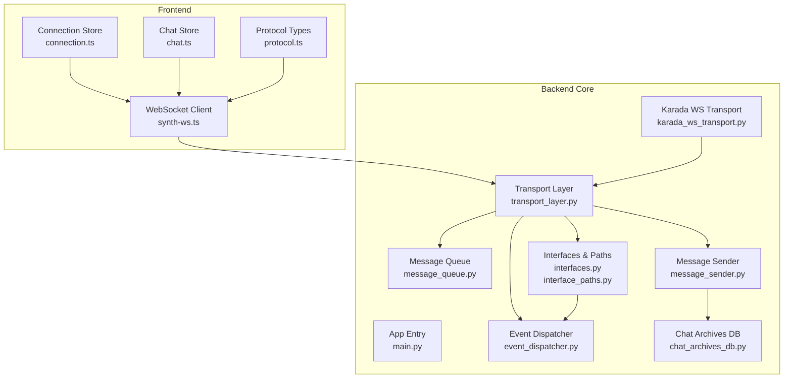
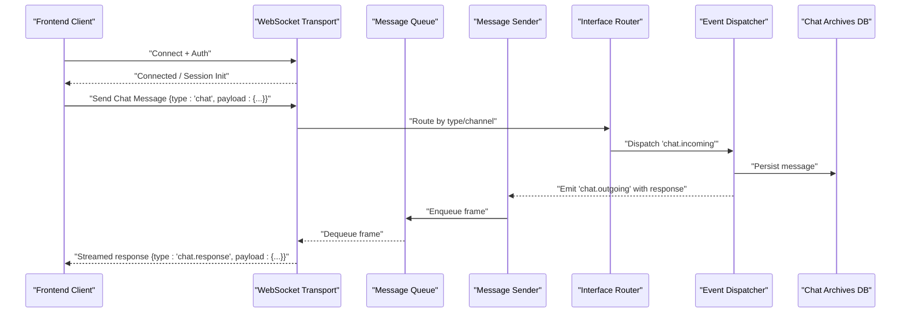
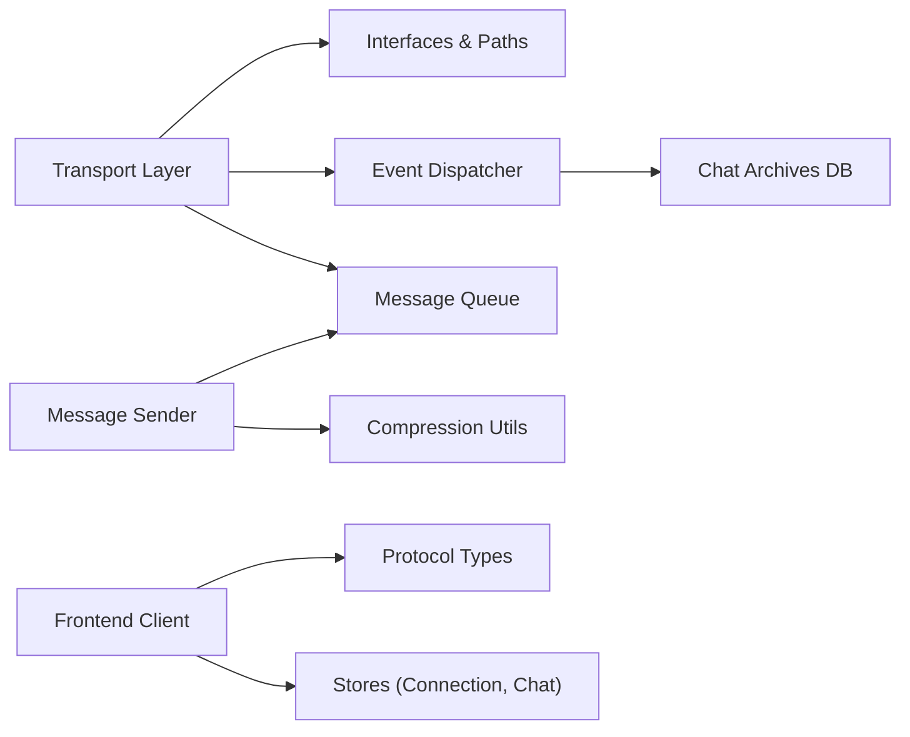
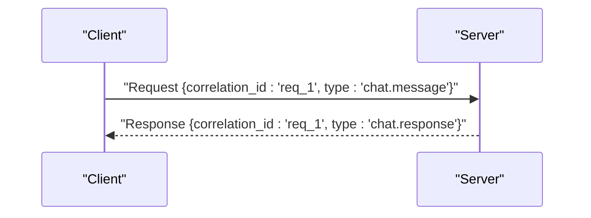

# Message Formats & Schemas

<cite>
**Referenced Files in This Document**
- [main.py](file://main.py)
- [transport_layer.py](file://core/transport_layer.py)
- [message_queue.py](file://core/message_queue.py)
- [message_sender.py](file://core/message_sender.py)
- [interfaces.py](file://core/interfaces.py)
- [interface_paths.py](file://core/interface_paths.py)
- [event_dispatcher.py](file://core/event_dispatcher.py)
- [chat_archives_db.py](file://core/chat_archives_db.py)
- [karada_ws_transport.py](file://core/karada_ws_transport.py)
- [synth-ws.ts](file://frontend/src/services/synth-ws.ts)
- [protocol.ts](file://frontend/src/services/protocol.ts)
- [connection.ts](file://frontend/src/stores/connection.ts)
- [chat.ts](file://frontend/src/stores/chat.ts)
- [api_endpoints.rst](file://docs/api_endpoints.rst)
- [message_handling.rst](file://docs/message_handling.rst)
</cite>

## Table of Contents
1. [Introduction](#introduction)
2. [Project Structure](#project-structure)
3. [Core Components](#core-components)
4. [Architecture Overview](#architecture-overview)
5. [Detailed Component Analysis](#detailed-component-analysis)
6. [Dependency Analysis](#dependency-analysis)
7. [Performance Considerations](#performance-considerations)
8. [Troubleshooting Guide](#troubleshooting-guide)
9. [Conclusion](#conclusion)
10. [Appendices](#appendices)

## Introduction
This document specifies the WebSocket message formats and schemas used by Synthetic Heart for bidirectional communication between the frontend and backend. It covers chat messages, system events, control commands, and status updates, including JSON schema definitions, field requirements, validation rules, routing mechanisms, request-response handling, event streaming formats, and payload compression options. It also provides complete message examples with expected responses and error codes.

## Project Structure
The WebSocket subsystem spans both backend (Python) and frontend (TypeScript/Vue). Key areas include:
- Backend transport layer and message queueing
- Interface path routing and event dispatching
- Chat archives persistence
- Karada WebSocket transport for device integration
- Frontend WebSocket client, protocol definitions, and stores

**Diagram sources**
- [main.py](file://main.py)
- [transport_layer.py](file://core/transport_layer.py)
- [message_queue.py](file://core/message_queue.py)
- [message_sender.py](file://core/message_sender.py)
- [interfaces.py](file://core/interfaces.py)
- [interface_paths.py](file://core/interface_paths.py)
- [event_dispatcher.py](file://core/event_dispatcher.py)
- [chat_archives_db.py](file://core/chat_archives_db.py)
- [karada_ws_transport.py](file://core/karada_ws_transport.py)
- [synth-ws.ts](file://frontend/src/services/synth-ws.ts)
- [protocol.ts](file://frontend/src/services/protocol.ts)
- [connection.ts](file://frontend/src/stores/connection.ts)
- [chat.ts](file://frontend/src/stores/chat.ts)

**Section sources**
- [api_endpoints.rst](file://docs/api_endpoints.rst)
- [message_handling.rst](file://docs/message_handling.rst)

## Core Components
- Transport Layer: Manages WebSocket lifecycle, framing, and routing to handlers.
- Message Queue: Buffers and prioritizes outbound messages; supports backpressure.
- Message Sender: Serializes payloads, applies optional compression, and writes to transports.
- Interfaces & Paths: Defines channel/topic routing and interface-specific adapters.
- Event Dispatcher: Publishes internal events and maps them to WebSocket frames.
- Chat Archives DB: Persists chat messages and metadata for history retrieval.
- Karada WS Transport: Bridges device/control events over WebSocket.
- Frontend Client: Implements reconnection, batching, and typed message handling.

Key responsibilities:
- Validate incoming frames against schemas
- Route messages by type/channel
- Emit standardized events to subscribers
- Persist relevant payloads
- Return structured responses or errors

**Section sources**
- [transport_layer.py](file://core/transport_layer.py)
- [message_queue.py](file://core/message_queue.py)
- [message_sender.py](file://core/message_sender.py)
- [interfaces.py](file://core/interfaces.py)
- [interface_paths.py](file://core/interface_paths.py)
- [event_dispatcher.py](file://core/event_dispatcher.py)
- [chat_archives_db.py](file://core/chat_archives_db.py)
- [karada_ws_transport.py](file://core/karada_ws_transport.py)
- [synth-ws.ts](file://frontend/src/services/synth-ws.ts)
- [protocol.ts](file://frontend/src/services/protocol.ts)
- [connection.ts](file://frontend/src/stores/connection.ts)
- [chat.ts](file://frontend/src/stores/chat.ts)

## Architecture Overview
The WebSocket architecture follows a clear separation of concerns:
- The frontend client connects to the server’s WebSocket endpoint.
- The transport layer validates and routes messages to domain handlers.
- Handlers may interact with the message queue, archives, and external services.
- Responses and events are streamed back to the client using typed frames.

**Diagram sources**
- [transport_layer.py](file://core/transport_layer.py)
- [interfaces.py](file://core/interfaces.py)
- [event_dispatcher.py](file://core/event_dispatcher.py)
- [chat_archives_db.py](file://core/chat_archives_db.py)
- [message_queue.py](file://core/message_queue.py)
- [message_sender.py](file://core/message_sender.py)
- [synth-ws.ts](file://frontend/src/services/synth-ws.ts)

## Detailed Component Analysis

### WebSocket Transport Layer
Responsibilities:
- Accept connections, perform authentication/handshake
- Parse incoming frames into typed messages
- Enforce schema validation and rate limiting
- Route to appropriate handlers based on message type and channel
- Manage connection lifecycle and graceful disconnects

Validation and routing:
- Required fields per message type are enforced before dispatch
- Unknown types or malformed payloads return structured error frames
- Channel-based routing ensures isolation between features

Error handling:
- Returns standardized error objects with code, message, and context
- Logs failures and emits diagnostic events

**Section sources**
- [transport_layer.py](file://core/transport_layer.py)

### Message Queue and Sender
Queue behavior:
- Bounded buffer with priority levels
- Backpressure signaling when consumers lag
- Retry policies for transient failures

Sender behavior:
- Serializes payloads to JSON
- Optional compression (e.g., gzip) for large payloads
- Deduplication and idempotency keys where applicable

**Section sources**
- [message_queue.py](file://core/message_queue.py)
- [message_sender.py](file://core/message_sender.py)

### Interfaces and Path Routing
Routing model:
- Messages carry a type and optional channel
- Interface paths map logical channels to concrete handlers
- Adapters can transform payloads per interface needs

Channel isolation:
- Ensures that chat, system, control, and status messages do not interfere
- Supports scoped subscriptions for efficient streaming

**Section sources**
- [interfaces.py](file://core/interfaces.py)
- [interface_paths.py](file://core/interface_paths.py)

### Event Dispatcher
Event model:
- Internal events follow a consistent naming convention
- Subscribers receive typed payloads without coupling to transport details
- Supports fan-out for multiple listeners

Lifecycle:
- Events are emitted after validation and routing decisions
- Errors in subscribers are isolated to prevent cascading failures

**Section sources**
- [event_dispatcher.py](file://core/event_dispatcher.py)

### Chat Archives Database
Persistence:
- Stores chat messages with metadata (timestamps, user, session)
- Supports queries for history and search
- Ensures consistency across concurrent writes

Archival flow:
- Incoming chat messages are persisted before streaming responses
- Deletion and retention policies apply at archival time

**Section sources**
- [chat_archives_db.py](file://core/chat_archives_db.py)

### Karada WebSocket Transport
Device integration:
- Bridges device state and control events over WebSocket
- Maps device actions to internal events
- Provides heartbeat and liveness checks

Security:
- Requires explicit pairing and authorization
- Rate limits device-originated messages

**Section sources**
- [karada_ws_transport.py](file://core/karada_ws_transport.py)

### Frontend WebSocket Client
Client capabilities:
- Typed message sending and receiving
- Automatic reconnection with exponential backoff
- Batching and throttling for high-frequency events
- Compression negotiation and payload size limits

Stores integration:
- Connection store manages lifecycle and auth
- Chat store handles message streams and UI updates

**Section sources**
- [synth-ws.ts](file://frontend/src/services/synth-ws.ts)
- [protocol.ts](file://frontend/src/services/protocol.ts)
- [connection.ts](file://frontend/src/stores/connection.ts)
- [chat.ts](file://frontend/src/stores/chat.ts)

## Dependency Analysis
The WebSocket subsystem has clear dependencies:
- Transport depends on interfaces and event dispatcher
- Message sender depends on queue and optional compression utilities
- Chat persistence depends on database backends
- Frontend client depends on protocol types and stores

**Diagram sources**
- [transport_layer.py](file://core/transport_layer.py)
- [interfaces.py](file://core/interfaces.py)
- [interface_paths.py](file://core/interface_paths.py)
- [event_dispatcher.py](file://core/event_dispatcher.py)
- [message_queue.py](file://core/message_queue.py)
- [message_sender.py](file://core/message_sender.py)
- [chat_archives_db.py](file://core/chat_archives_db.py)
- [synth-ws.ts](file://frontend/src/services/synth-ws.ts)
- [protocol.ts](file://frontend/src/services/protocol.ts)
- [connection.ts](file://frontend/src/stores/connection.ts)
- [chat.ts](file://frontend/src/stores/chat.ts)

**Section sources**
- [transport_layer.py](file://core/transport_layer.py)
- [interfaces.py](file://core/interfaces.py)
- [interface_paths.py](file://core/interface_paths.py)
- [event_dispatcher.py](file://core/event_dispatcher.py)
- [message_queue.py](file://core/message_queue.py)
- [message_sender.py](file://core/message_sender.py)
- [chat_archives_db.py](file://core/chat_archives_db.py)
- [synth-ws.ts](file://frontend/src/services/synth-ws.ts)
- [protocol.ts](file://frontend/src/services/protocol.ts)
- [connection.ts](file://frontend/src/stores/connection.ts)
- [chat.ts](file://frontend/src/stores/chat.ts)

## Performance Considerations
- Use compression for large payloads to reduce bandwidth
- Implement backpressure in queues to avoid memory spikes
- Batch small messages where possible to reduce overhead
- Prefer streaming for long-running operations to keep UI responsive
- Cache frequently accessed data to minimize DB load
- Monitor latency and throughput metrics for optimization

[No sources needed since this section provides general guidance]

## Troubleshooting Guide
Common issues and resolutions:
- Authentication failures: Verify credentials and token validity
- Schema validation errors: Check required fields and types
- Routing mismatches: Ensure correct message type and channel
- Queue overflow: Increase buffer size or optimize consumer throughput
- Compression errors: Confirm negotiated compression and payload size limits
- Reconnection loops: Adjust backoff parameters and network stability

Diagnostic steps:
- Inspect transport logs for frame parsing errors
- Validate payloads against documented schemas
- Trace event dispatcher subscriptions for missing handlers
- Check database connectivity and query performance

**Section sources**
- [transport_layer.py](file://core/transport_layer.py)
- [message_queue.py](file://core/message_queue.py)
- [event_dispatcher.py](file://core/event_dispatcher.py)
- [chat_archives_db.py](file://core/chat_archives_db.py)

## Conclusion
Synthetic Heart’s WebSocket subsystem provides a robust, typed, and scalable communication layer. By adhering to the defined schemas and routing mechanisms, developers can implement reliable bidirectional communication with clear error handling and performance optimizations.

[No sources needed since this section summarizes without analyzing specific files]

## Appendices

### Message Types and Schemas

#### Chat Messages
Purpose: User-initiated text or media messages within a chat session.

Schema:
- type: string (required) - "chat.message"
- payload: object (required)
  - content: string (required) - message text
  - attachments?: array - optional media references
  - timestamp?: number - epoch milliseconds
  - user_id: string (required) - sender identifier
  - session_id: string (required) - chat session identifier
  - metadata?: object - optional contextual data

Validation rules:
- content must be non-empty
- user_id and session_id must be present
- attachments must reference valid resources

Request example:
{
  "type": "chat.message",
  "payload": {
    "content": "Hello, how are you?",
    "user_id": "user_123",
    "session_id": "session_abc",
    "timestamp": 1710000000000
  }
}

Expected response:
{
  "type": "chat.response",
  "payload": {
    "status": "received",
    "message_id": "msg_456",
    "timestamp": 1710000001000
  }
}

Error codes:
- 400: Invalid payload structure
- 401: Unauthorized user
- 404: Session not found

**Section sources**
- [transport_layer.py](file://core/transport_layer.py)
- [chat_archives_db.py](file://core/chat_archives_db.py)
- [synth-ws.ts](file://frontend/src/services/synth-ws.ts)
- [protocol.ts](file://frontend/src/services/protocol.ts)

#### System Events
Purpose: Background notifications and system-level updates.

Schema:
- type: string (required) - "system.event"
- payload: object (required)
  - event_type: string (required) - specific event category
  - severity: string (optional) - info, warning, error
  - data?: object - event-specific data
  - timestamp: number (required) - epoch milliseconds

Validation rules:
- event_type must be recognized
- severity must be one of allowed values

Request example:
{
  "type": "system.event",
  "payload": {
    "event_type": "model_update",
    "severity": "info",
    "data": {"version": "1.2.3"},
    "timestamp": 1710000000000
  }
}

Expected response:
{
  "type": "system.event_ack",
  "payload": {
    "acknowledged": true,
    "timestamp": 1710000001000
  }
}

Error codes:
- 400: Unknown event_type
- 422: Invalid severity value

**Section sources**
- [event_dispatcher.py](file://core/event_dispatcher.py)
- [transport_layer.py](file://core/transport_layer.py)

#### Control Commands
Purpose: Administrative or operational commands to manage the system.

Schema:
- type: string (required) - "control.command"
- payload: object (required)
  - command: string (required) - action to execute
  - params?: object - command-specific parameters
  - requester_id: string (required) - authorized caller
  - timestamp: number (required) - epoch milliseconds

Validation rules:
- command must be in allowed list
- requester_id must have sufficient privileges

Request example:
{
  "type": "control.command",
  "payload": {
    "command": "restart_service",
    "params": {"graceful": true},
    "requester_id": "admin_001",
    "timestamp": 1710000000000
  }
}

Expected response:
{
  "type": "control.result",
  "payload": {
    "success": true,
    "message": "Service restart initiated",
    "timestamp": 1710000001000
  }
}

Error codes:
- 403: Insufficient permissions
- 400: Invalid command or parameters

**Section sources**
- [interfaces.py](file://core/interfaces.py)
- [transport_layer.py](file://core/transport_layer.py)

#### Status Updates
Purpose: Real-time status information about components or sessions.

Schema:
- type: string (required) - "status.update"
- payload: object (required)
  - component: string (required) - affected component
  - status: string (required) - current state
  - details?: object - additional context
  - timestamp: number (required) - epoch milliseconds

Validation rules:
- component must be registered
- status must be valid for the component

Request example:
{
  "type": "status.update",
  "payload": {
    "component": "tts_engine",
    "status": "ready",
    "details": {"latency_ms": 120},
    "timestamp": 1710000000000
  }
}

Expected response:
{
  "type": "status.ack",
  "payload": {
    "accepted": true,
    "timestamp": 1710000001000
  }
}

Error codes:
- 400: Unregistered component
- 422: Invalid status value

**Section sources**
- [event_dispatcher.py](file://core/event_dispatcher.py)
- [transport_layer.py](file://core/transport_layer.py)

### Bidirectional Communication Patterns

#### Request-Response Handling
Pattern:
- Client sends a request with unique correlation_id
- Server processes and responds with matching correlation_id
- Client matches responses to requests using correlation_id

Example flow:

**Diagram sources**
- [synth-ws.ts](file://frontend/src/services/synth-ws.ts)
- [transport_layer.py](file://core/transport_layer.py)

#### Event Streaming
Pattern:
- Server pushes events to subscribed clients
- Clients subscribe to specific channels or topics
- Events are delivered in real-time with minimal latency

Subscription example:
{
  "type": "subscribe",
  "payload": {
    "channels": ["chat.stream", "system.events"],
    "client_id": "client_789"
  }
}

**Section sources**
- [interfaces.py](file://core/interfaces.py)
- [event_dispatcher.py](file://core/event_dispatcher.py)

### Payload Compression Options
Supported methods:
- gzip: For general text payloads
- deflate: Alternative compression method
- none: No compression for small payloads

Negotiation:
- Compression method specified in handshake
- Dynamic switching based on payload size

Best practices:
- Use compression for payloads > 1KB
- Monitor CPU usage during compression/decompression
- Set maximum payload sizes to prevent abuse

**Section sources**
- [message_sender.py](file://core/message_sender.py)
- [synth-ws.ts](file://frontend/src/services/synth-ws.ts)

### Complete Message Examples

#### Chat Message Flow
Client sends:
{
  "type": "chat.message",
  "payload": {
    "content": "What's the weather today?",
    "user_id": "user_123",
    "session_id": "session_abc",
    "timestamp": 1710000000000
  }
}

Server persists and responds:
{
  "type": "chat.response",
  "payload": {
    "status": "processed",
    "message_id": "msg_456",
    "timestamp": 1710000001000
  }
}

Streaming response:
{
  "type": "chat.stream",
  "payload": {
    "message_id": "msg_456",
    "chunk": "The weather is sunny",
    "is_last": false
  }
}

Final completion:
{
  "type": "chat.complete",
  "payload": {
    "message_id": "msg_456",
    "full_response": "The weather is sunny with a high of 75°F.",
    "timestamp": 1710000005000
  }
}

**Section sources**
- [chat_archives_db.py](file://core/chat_archives_db.py)
- [transport_layer.py](file://core/transport_layer.py)
- [synth-ws.ts](file://frontend/src/services/synth-ws.ts)

#### Error Response Examples
Invalid payload:
{
  "type": "error",
  "payload": {
    "code": 400,
    "message": "Invalid payload structure",
    "details": "Missing required field: content",
    "timestamp": 1710000000000
  }
}

Authentication failure:
{
  "type": "error",
  "payload": {
    "code": 401,
    "message": "Authentication failed",
    "details": "Invalid or expired token",
    "timestamp": 1710000000000
  }
}

Rate limit exceeded:
{
  "type": "error",
  "payload": {
    "code": 429,
    "message": "Rate limit exceeded",
    "details": "Too many requests",
    "retry_after": 30,
    "timestamp": 1710000000000
  }
}

**Section sources**
- [transport_layer.py](file://core/transport_layer.py)