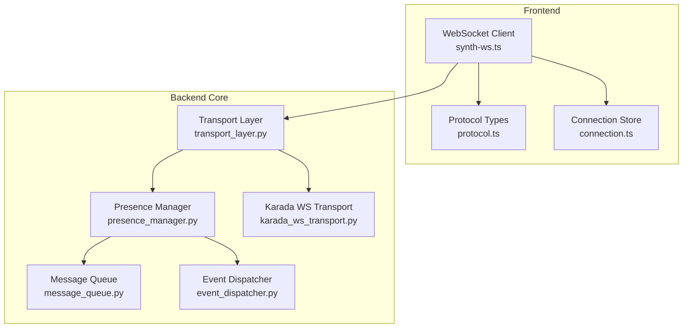
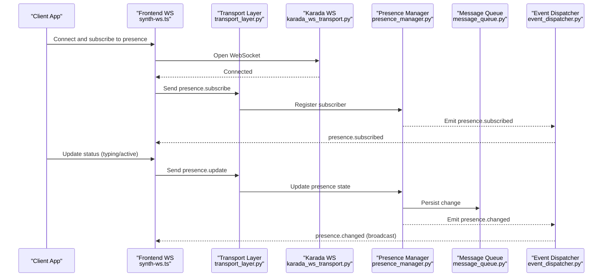
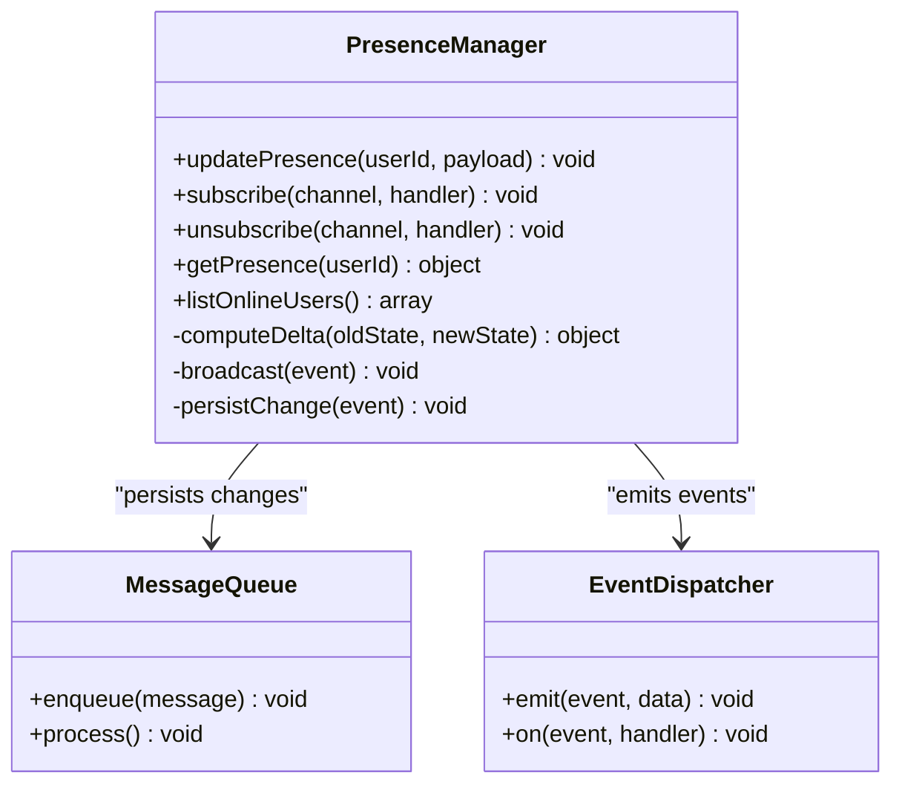
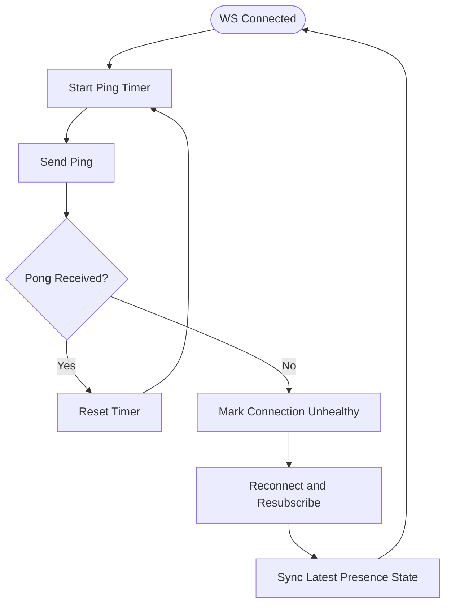
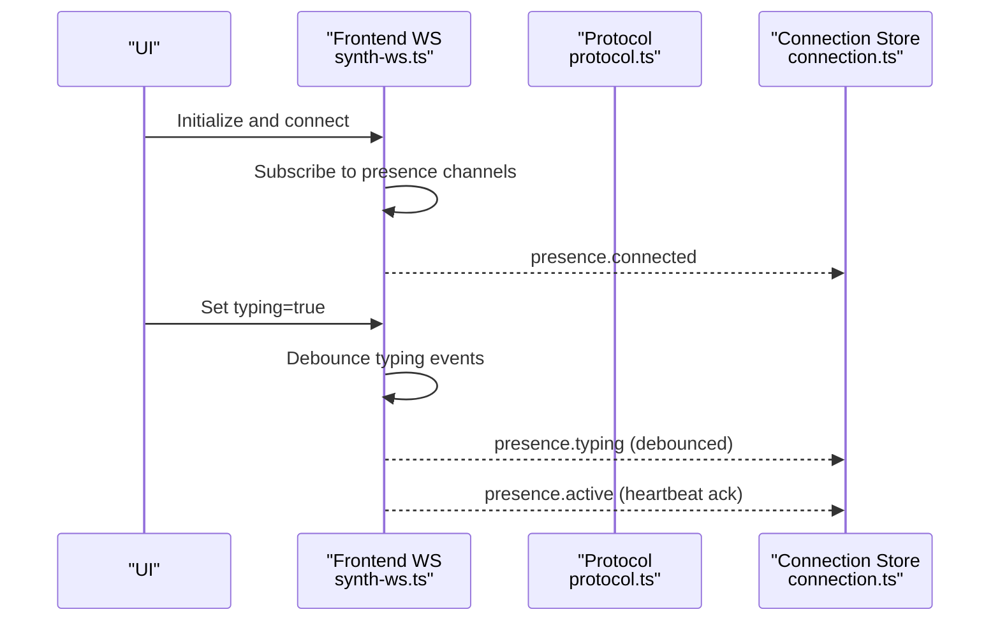
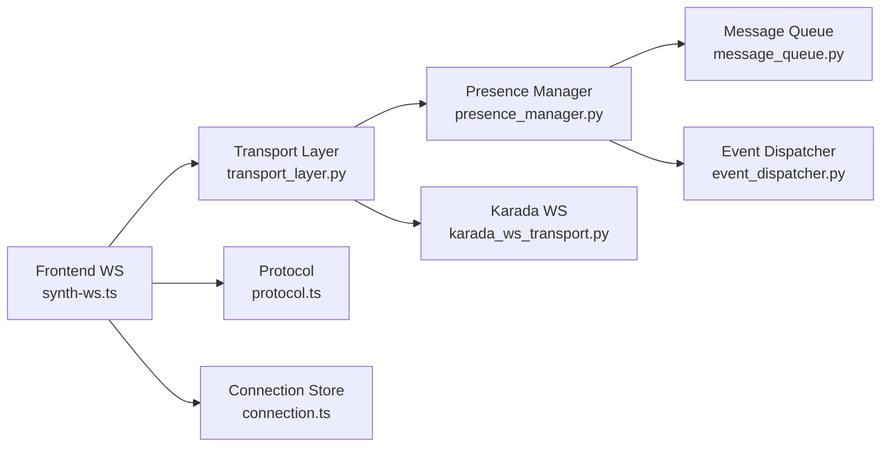

# Presence & Status Events

<cite>
**Referenced Files in This Document**
- [presence_manager.py](file://core/presence_manager.py)
- [transport_layer.py](file://core/transport_layer.py)
- [karada_ws_transport.py](file://core/karada_ws_transport.py)
- [synth-ws.ts](file://frontend/src/services/synth-ws.ts)
- [protocol.ts](file://frontend/src/services/protocol.ts)
- [connection.ts](file://frontend/src/stores/connection.ts)
- [message_queue.py](file://core/message_queue.py)
- [event_dispatcher.py](file://core/event_dispatcher.py)
</cite>

## Table of Contents
1. [Introduction](#introduction)
2. [Project Structure](#project-structure)
3. [Core Components](#core-components)
4. [Architecture Overview](#architecture-overview)
5. [Detailed Component Analysis](#detailed-component-analysis)
6. [Dependency Analysis](#dependency-analysis)
7. [Performance Considerations](#performance-considerations)
8. [Troubleshooting Guide](#troubleshooting-guide)
9. [Conclusion](#conclusion)
10. [Appendices](#appendices)

## Introduction
This document explains presence and status events over the WebSocket protocol used by the application. It covers user presence tracking, online/offline status, typing indicators, activity monitoring, real-time status updates, broadcasting to multiple clients, subscription management, connection health monitoring, heartbeat mechanisms, and cross-client synchronization. It also provides practical examples for subscribing to presence events, updating user status, and handling presence changes with event filtering and performance optimization.

## Project Structure
Presence and status are implemented across backend transport and core modules, and a frontend WebSocket client that subscribes to and emits presence-related messages. The key areas are:
- Backend presence manager and transport layer for message routing and persistence
- WebSocket transport for connection lifecycle, heartbeats, and broadcast
- Frontend WebSocket service for connection management, event subscriptions, and UI state sync

**Diagram sources**
- [presence_manager.py](file://core/presence_manager.py)
- [transport_layer.py](file://core/transport_layer.py)
- [karada_ws_transport.py](file://core/karada_ws_transport.py)
- [synth-ws.ts](file://frontend/src/services/synth-ws.ts)
- [protocol.ts](file://frontend/src/services/protocol.ts)
- [connection.ts](file://frontend/src/stores/connection.ts)
- [message_queue.py](file://core/message_queue.py)
- [event_dispatcher.py](file://core/event_dispatcher.py)

**Section sources**
- [presence_manager.py](file://core/presence_manager.py)
- [transport_layer.py](file://core/transport_layer.py)
- [karada_ws_transport.py](file://core/karada_ws_transport.py)
- [synth-ws.ts](file://frontend/src/services/synth-ws.ts)
- [protocol.ts](file://frontend/src/services/protocol.ts)
- [connection.ts](file://frontend/src/stores/connection.ts)
- [message_queue.py](file://core/message_queue.py)
- [event_dispatcher.py](file://core/event_dispatcher.py)

## Core Components
- Presence Manager: Maintains per-user presence state (online/offline, typing, last active), handles transitions, deduplication, and broadcasts updates to subscribers.
- Transport Layer: Manages WebSocket connections, routes inbound/outbound messages, and coordinates presence events with the presence manager.
- Karada WS Transport: Implements WebSocket-specific features such as heartbeat ping/pong, reconnection logic, and channel-based messaging.
- Frontend WebSocket Service: Establishes and maintains the WebSocket connection, subscribes to presence channels, and exposes typed events for the UI.
- Message Queue and Event Dispatcher: Provide reliable delivery and decoupled event propagation for presence updates across components.

**Section sources**
- [presence_manager.py](file://core/presence_manager.py)
- [transport_layer.py](file://core/transport_layer.py)
- [karada_ws_transport.py](file://core/karada_ws_transport.py)
- [synth-ws.ts](file://frontend/src/services/synth-ws.ts)
- [message_queue.py](file://core/message_queue.py)
- [event_dispatcher.py](file://core/event_dispatcher.py)

## Architecture Overview
The presence system follows a publish-subscribe model over WebSocket:
- Clients connect via the frontend WebSocket service and subscribe to presence channels.
- The backend transport layer receives presence events and delegates to the presence manager.
- The presence manager updates state, persists changes through the message queue, and dispatches events to all relevant subscribers.
- Heartbeat and connection health checks ensure timely detection of disconnects and reconnections.

**Diagram sources**
- [synth-ws.ts](file://frontend/src/services/synth-ws.ts)
- [transport_layer.py](file://core/transport_layer.py)
- [karada_ws_transport.py](file://core/karada_ws_transport.py)
- [presence_manager.py](file://core/presence_manager.py)
- [message_queue.py](file://core/message_queue.py)
- [event_dispatcher.py](file://core/event_dispatcher.py)

## Detailed Component Analysis

### Presence Manager
Responsibilities:
- Track per-user presence fields: online/offline, typing indicator, last active timestamp, and optional custom status metadata.
- Manage presence transitions with idempotency and deduplication to avoid redundant broadcasts.
- Coordinate broadcasting to connected clients and persisting state changes.
- Support subscription lists and selective forwarding based on channels or scopes.

Key behaviors:
- On update, compute delta and emit only changed fields to reduce bandwidth.
- Maintain an internal cache of presence state keyed by user/session identifiers.
- Integrate with the event dispatcher to propagate presence events to listeners.

**Diagram sources**
- [presence_manager.py](file://core/presence_manager.py)
- [message_queue.py](file://core/message_queue.py)
- [event_dispatcher.py](file://core/event_dispatcher.py)

**Section sources**
- [presence_manager.py](file://core/presence_manager.py)
- [message_queue.py](file://core/message_queue.py)
- [event_dispatcher.py](file://core/event_dispatcher.py)

### Transport Layer and Karada WS Transport
Responsibilities:
- Manage WebSocket lifecycle: connect, reconnect, send, receive, and close.
- Implement heartbeat ping/pong to detect dead connections and trigger reconnection.
- Route incoming presence messages to the presence manager and forward outbound presence events to subscribers.
- Handle channel-based subscriptions and scope filtering.

Heartbeat mechanism:
- Periodic ping sent from server; client responds with pong.
- If pong is missing beyond threshold, mark connection as unhealthy and initiate reconnection.
- On reconnect, resubscribe to presence channels and synchronize latest presence state.

**Diagram sources**
- [karada_ws_transport.py](file://core/karada_ws_transport.py)
- [transport_layer.py](file://core/transport_layer.py)

**Section sources**
- [karada_ws_transport.py](file://core/karada_ws_transport.py)
- [transport_layer.py](file://core/transport_layer.py)

### Frontend WebSocket Service and Protocol
Responsibilities:
- Establish and maintain the WebSocket connection with automatic reconnection.
- Subscribe to presence channels and handle presence events for UI updates.
- Emit presence updates (e.g., typing, active status) and manage local presence state.
- Provide typed interfaces for presence events and payloads.

Subscription and event flow:
- On connect, send a subscribe request for presence channels.
- Receive presence events and update the connection store and UI state accordingly.
- Debounce rapid typing events to minimize network traffic.

**Diagram sources**
- [synth-ws.ts](file://frontend/src/services/synth-ws.ts)
- [protocol.ts](file://frontend/src/services/protocol.ts)
- [connection.ts](file://frontend/src/stores/connection.ts)

**Section sources**
- [synth-ws.ts](file://frontend/src/services/synth-ws.ts)
- [protocol.ts](file://frontend/src/services/protocol.ts)
- [connection.ts](file://frontend/src/stores/connection.ts)

### Real-Time Status Updates and Broadcasting
- Presence updates are emitted as discrete events with minimal payloads containing only changed fields.
- Broadcasting uses channel-based routing so only interested clients receive updates.
- Deduplication ensures repeated identical updates do not flood the network.

Typical events:
- presence.connected: Client successfully connected and subscribed.
- presence.disconnected: Client disconnected or heartbeat timeout.
- presence.updated: User status changed (online/offline, typing, active).
- presence.sync: Full presence snapshot after reconnect or initial load.

**Section sources**
- [presence_manager.py](file://core/presence_manager.py)
- [transport_layer.py](file://core/transport_layer.py)
- [karada_ws_transport.py](file://core/karada_ws_transport.py)
- [synth-ws.ts](file://frontend/src/services/synth-ws.ts)
- [protocol.ts](file://frontend/src/services/protocol.ts)
- [connection.ts](file://frontend/src/stores/connection.ts)

### Subscription Management
- Clients subscribe to presence channels upon connection.
- Subscriptions can be scoped by user IDs, groups, or global presence.
- The presence manager maintains subscriber lists and forwards events accordingly.
- Unsubscribe removes handlers and stops receiving updates.

Best practices:
- Use specific channels to limit event volume.
- Clean up subscriptions on component unmount to prevent memory leaks.
- Handle unsubscribe gracefully during reconnection.

**Section sources**
- [presence_manager.py](file://core/presence_manager.py)
- [transport_layer.py](file://core/transport_layer.py)
- [karada_ws_transport.py](file://core/karada_ws_transport.py)
- [synth-ws.ts](file://frontend/src/services/synth-ws.ts)

### Activity Monitoring and Typing Indicators
- Typing indicators are debounced to reduce noise and bandwidth usage.
- Active status is updated via heartbeat acknowledgments and explicit active events.
- Last active timestamps are refreshed on meaningful interactions.

Implementation tips:
- Debounce typing events with a short delay (e.g., 300–500ms).
- Clear typing state when input loses focus or after a timeout.
- Combine heartbeat pongs with active status updates.

**Section sources**
- [presence_manager.py](file://core/presence_manager.py)
- [karada_ws_transport.py](file://core/karada_ws_transport.py)
- [synth-ws.ts](file://frontend/src/services/synth-ws.ts)

### Connection Health Monitoring and Heartbeat Mechanisms
- Server sends periodic pings; clients respond with pongs.
- Missing pongs beyond a threshold mark the connection unhealthy.
- Automatic reconnection triggers resubscription and presence synchronization.

Health metrics:
- Ping interval and pong timeout thresholds.
- Reconnection attempts and backoff strategy.
- Presence sync completeness after reconnect.

**Section sources**
- [karada_ws_transport.py](file://core/karada_ws_transport.py)
- [transport_layer.py](file://core/transport_layer.py)
- [synth-ws.ts](file://frontend/src/services/synth-ws.ts)

### Status Synchronization Across Multiple Clients
- Presence state is centralized in the presence manager and persisted via the message queue.
- On reconnect, clients receive a full presence snapshot to reconcile local state.
- Delta updates ensure efficient synchronization without full refreshes.

Synchronization steps:
- Detect disconnect and mark local presence stale.
- Reconnect and request presence.sync.
- Apply deltas to align with server state.

**Section sources**
- [presence_manager.py](file://core/presence_manager.py)
- [message_queue.py](file://core/message_queue.py)
- [karada_ws_transport.py](file://core/karada_ws_transport.py)
- [synth-ws.ts](file://frontend/src/services/synth-ws.ts)

## Dependency Analysis
Presence depends on transport, queue, and dispatcher layers. Frontend depends on the WebSocket service and protocol types.

**Diagram sources**
- [synth-ws.ts](file://frontend/src/services/synth-ws.ts)
- [transport_layer.py](file://core/transport_layer.py)
- [presence_manager.py](file://core/presence_manager.py)
- [message_queue.py](file://core/message_queue.py)
- [event_dispatcher.py](file://core/event_dispatcher.py)
- [karada_ws_transport.py](file://core/karada_ws_transport.py)
- [protocol.ts](file://frontend/src/services/protocol.ts)
- [connection.ts](file://frontend/src/stores/connection.ts)

**Section sources**
- [presence_manager.py](file://core/presence_manager.py)
- [transport_layer.py](file://core/transport_layer.py)
- [karada_ws_transport.py](file://core/karada_ws_transport.py)
- [synth-ws.ts](file://frontend/src/services/synth-ws.ts)
- [protocol.ts](file://frontend/src/services/protocol.ts)
- [connection.ts](file://frontend/src/stores/connection.ts)
- [message_queue.py](file://core/message_queue.py)
- [event_dispatcher.py](file://core/event_dispatcher.py)

## Performance Considerations
- Minimize payload size by sending only changed fields in presence updates.
- Debounce high-frequency events like typing to reduce network overhead.
- Use channel-based subscriptions to limit event fan-out.
- Implement presence sync snapshots to avoid incremental reconciliation costs after reconnect.
- Monitor heartbeat intervals and timeouts to balance responsiveness and resource usage.

[No sources needed since this section provides general guidance]

## Troubleshooting Guide
Common issues and resolutions:
- Frequent disconnects: Check heartbeat configuration and network stability; increase pong timeout if necessary.
- Stale presence state: Ensure presence.sync is handled on reconnect and that deltas are applied correctly.
- Excessive typing events: Increase debounce delay and verify typing state clearing on blur.
- Missing presence updates: Verify subscription registration and channel scoping; check event dispatcher logs.

Operational checks:
- Validate ping/pong exchange and reconnection attempts.
- Confirm presence manager state consistency and persistence.
- Inspect frontend subscription cleanup to prevent memory leaks.

**Section sources**
- [karada_ws_transport.py](file://core/karada_ws_transport.py)
- [presence_manager.py](file://core/presence_manager.py)
- [synth-ws.ts](file://frontend/src/services/synth-ws.ts)

## Conclusion
The presence and status system provides robust, real-time user tracking over WebSocket with efficient broadcasting, heartbeat-driven health monitoring, and reliable synchronization across clients. By leveraging channel-based subscriptions, delta updates, and debounced events, the system balances responsiveness with performance. Proper subscription management and error handling ensure a stable user experience even under network fluctuations.

[No sources needed since this section summarizes without analyzing specific files]

## Appendices

### Example Workflows

#### Subscribing to Presence Events
- Connect the WebSocket client and subscribe to presence channels.
- Listen for presence.connected, presence.updated, and presence.sync events.
- Update local presence state and UI indicators accordingly.

**Section sources**
- [synth-ws.ts](file://frontend/src/services/synth-ws.ts)
- [protocol.ts](file://frontend/src/services/protocol.ts)
- [connection.ts](file://frontend/src/stores/connection.ts)

#### Updating User Status
- Emit presence.update with typing or active flags.
- Debounce typing updates to reduce traffic.
- Ensure last active timestamp is refreshed on meaningful actions.

**Section sources**
- [presence_manager.py](file://core/presence_manager.py)
- [karada_ws_transport.py](file://core/karada_ws_transport.py)
- [synth-ws.ts](file://frontend/src/services/synth-ws.ts)

#### Handling Presence Changes
- Process presence.updated events and apply deltas to local state.
- On presence.sync, reconcile full state after reconnect.
- Clean up subscriptions on component teardown.

**Section sources**
- [presence_manager.py](file://core/presence_manager.py)
- [transport_layer.py](file://core/transport_layer.py)
- [synth-ws.ts](file://frontend/src/services/synth-ws.ts)