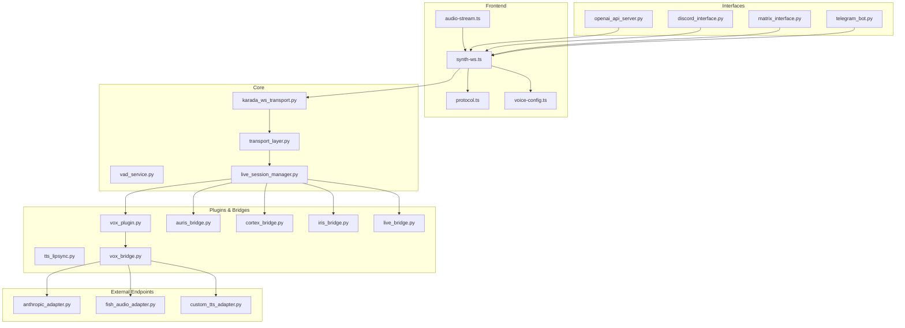
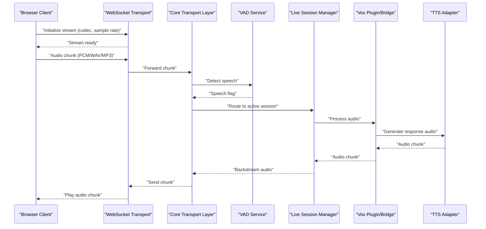
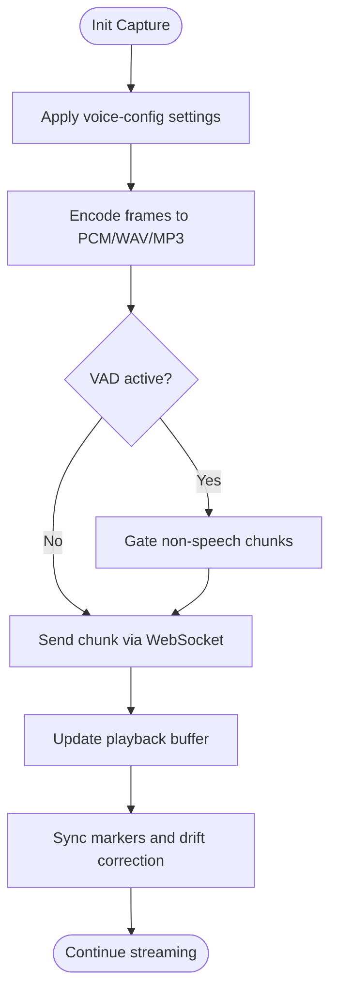
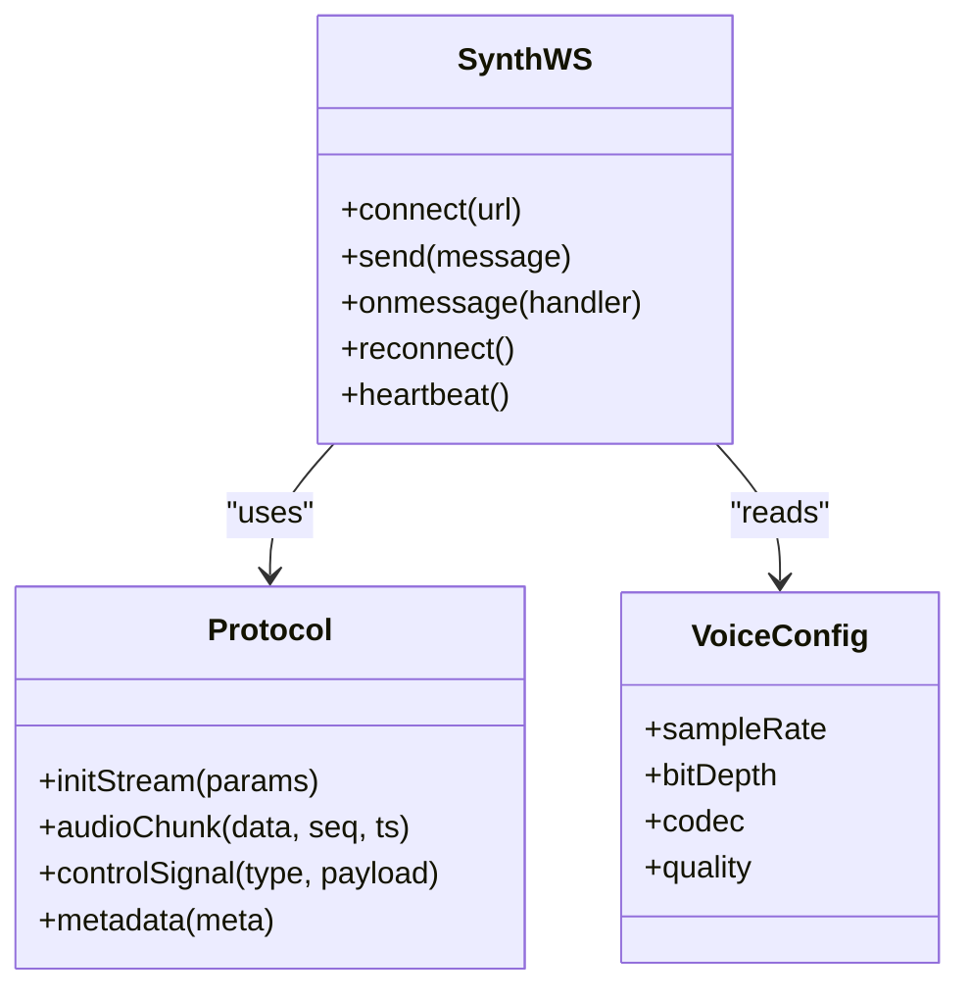
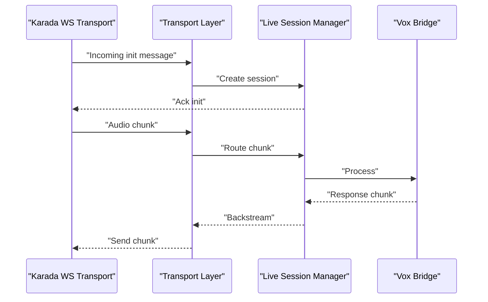
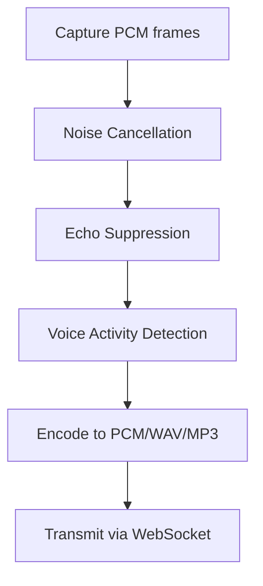
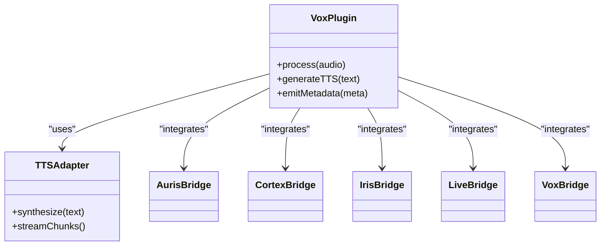
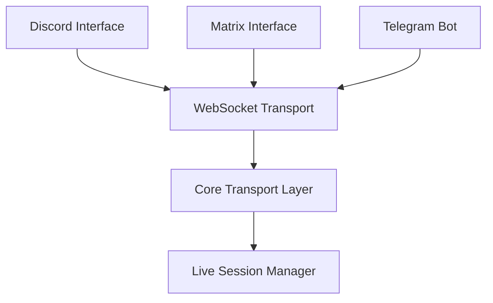
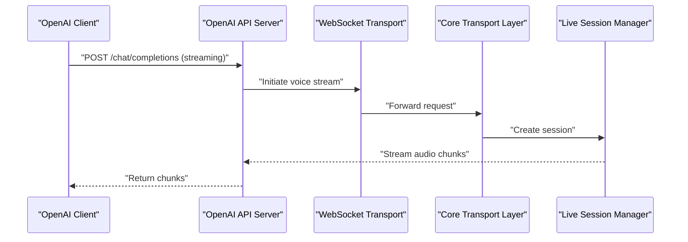
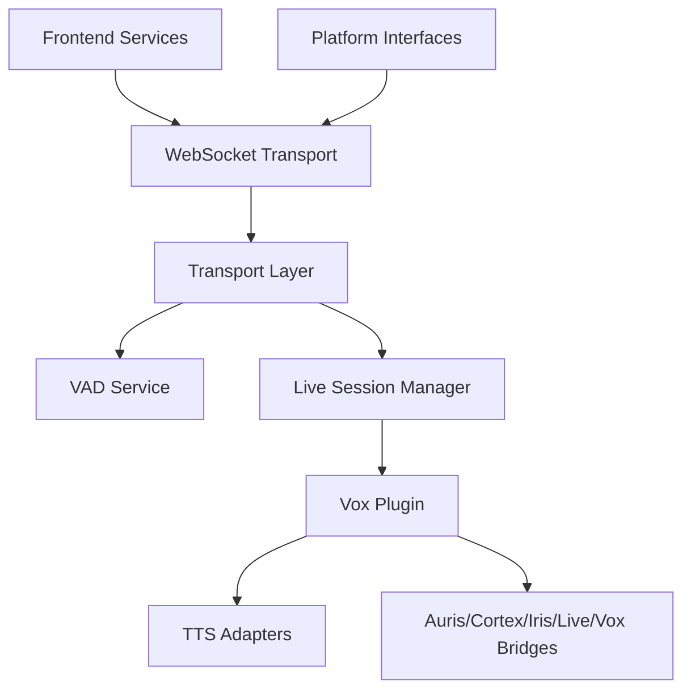

# Voice Streaming Protocol

<cite>
**Referenced Files in This Document**
- [audio-stream.ts](file://frontend/src/services/audio-stream.ts)
- [synth-ws.ts](file://frontend/src/services/synth-ws.ts)
- [protocol.ts](file://frontend/src/services/protocol.ts)
- [voice-config.ts](file://frontend/src/services/voice-config.ts)
- [vad_service.py](file://core/vad_service.py)
- [karada_ws_transport.py](file://core/karada_ws_transport.py)
- [transport_layer.py](file://core/transport_layer.py)
- [live_session_manager.py](file://core/live_session_manager.py)
- [vox_plugin.py](file://plugins/vox_plugin/vox_plugin.py)
- [tts_lipsync.py](file://plugins/tts_lipsync/tts_lipsync.py)
- [openai_api_server.py](file://interface/openai_api_server/openai_api_server.py)
- [discord_interface.py](file://interface/discord_interface/discord_interface.py)
- [matrix_interface.py](file://interface/matrix_interface/matrix_interface.py)
- [telegram_bot.py](file://interface/telegram_bot/telegram_bot.py)
- [gemini_live.py](file://engines/live/gemini_live.py)
- [live_base.py](file://engines/live/live_base.py)
- [anthropic_adapter.py](file://core/external_endpoints/adapters/anthropic_adapter.py)
- [fish_audio_adapter.py](file://core/external_endpoints/adapters/fish_audio_adapter.py)
- [custom_tts_adapter.py](file://core/external_endpoints/adapters/custom_tts_adapter.py)
- [auris_bridge.py](file://core/external_endpoints/bridges/auris_bridge.py)
- [cortex_bridge.py](file://core/external_endpoints/bridges/cortex_bridge.py)
- [iris_bridge.py](file://core/external_endpoints/bridges/iris_bridge.py)
- [live_bridge.py](file://core/external_endpoints/bridges/live_bridge.py)
- [vox_bridge.py](file://core/external_endpoints/bridges/vox_bridge.py)
</cite>

## Table of Contents
1. [Introduction](#introduction)
2. [Project Structure](#project-structure)
3. [Core Components](#core-components)
4. [Architecture Overview](#architecture-overview)
5. [Detailed Component Analysis](#detailed-component-analysis)
6. [Dependency Analysis](#dependency-analysis)
7. [Performance Considerations](#performance-considerations)
8. [Troubleshooting Guide](#troubleshooting-guide)
9. [Conclusion](#conclusion)
10. [Appendices](#appendices)

## Introduction
This document explains voice streaming over WebSocket for real-time, bidirectional audio conversations. It covers stream initialization, chunked audio transmission, format specifications (PCM, WAV, MP3), quality settings, voice activity detection (VAD), noise cancellation, echo suppression, latency optimization, metadata handling, and stream synchronization. It also provides client implementation examples for browser and server-side processing with performance tuning guidelines.

## Project Structure
The voice streaming system spans frontend services, core transport layers, live session management, plugin bridges, and external adapters. The key areas are:
- Frontend WebSocket and audio streaming services
- Core transport and VAD service
- Live session manager coordinating streams
- Vox/TTS plugins and bridges to external engines
- Interface adapters for platforms (Discord, Matrix, Telegram)
- External endpoints for TTS and voice providers

**Diagram sources**
- [audio-stream.ts](file://frontend/src/services/audio-stream.ts)
- [synth-ws.ts](file://frontend/src/services/synth-ws.ts)
- [protocol.ts](file://frontend/src/services/protocol.ts)
- [voice-config.ts](file://frontend/src/services/voice-config.ts)
- [vad_service.py](file://core/vad_service.py)
- [karada_ws_transport.py](file://core/karada_ws_transport.py)
- [transport_layer.py](file://core/transport_layer.py)
- [live_session_manager.py](file://core/live_session_manager.py)
- [vox_plugin.py](file://plugins/vox_plugin/vox_plugin.py)
- [tts_lipsync.py](file://plugins/tts_lipsync/tts_lipsync.py)
- [auris_bridge.py](file://core/external_endpoints/bridges/auris_bridge.py)
- [cortex_bridge.py](file://core/external_endpoints/bridges/cortex_bridge.py)
- [iris_bridge.py](file://core/external_endpoints/bridges/iris_bridge.py)
- [live_bridge.py](file://core/external_endpoints/bridges/live_bridge.py)
- [vox_bridge.py](file://core/external_endpoints/bridges/vox_bridge.py)
- [openai_api_server.py](file://interface/openai_api_server/openai_api_server.py)
- [discord_interface.py](file://interface/discord_interface/discord_interface.py)
- [matrix_interface.py](file://interface/matrix_interface/matrix_interface.py)
- [telegram_bot.py](file://interface/telegram_bot/telegram_bot.py)

**Section sources**
- [audio-stream.ts](file://frontend/src/services/audio-stream.ts)
- [synth-ws.ts](file://frontend/src/services/synth-ws.ts)
- [protocol.ts](file://frontend/src/services/protocol.ts)
- [voice-config.ts](file://frontend/src/services/voice-config.ts)
- [vad_service.py](file://core/vad_service.py)
- [karada_ws_transport.py](file://core/karada_ws_transport.py)
- [transport_layer.py](file://core/transport_layer.py)
- [live_session_manager.py](file://core/live_session_manager.py)
- [vox_plugin.py](file://plugins/vox_plugin/vox_plugin.py)
- [tts_lipsync.py](file://plugins/tts_lipsync/tts_lipsync.py)
- [auris_bridge.py](file://core/external_endpoints/bridges/auris_bridge.py)
- [cortex_bridge.py](file://core/external_endpoints/bridges/cortex_bridge.py)
- [iris_bridge.py](file://core/external_endpoints/bridges/iris_bridge.py)
- [live_bridge.py](file://core/external_endpoints/bridges/live_bridge.py)
- [vox_bridge.py](file://core/external_endpoints/bridges/vox_bridge.py)
- [openai_api_server.py](file://interface/openai_api_server/openai_api_server.py)
- [discord_interface.py](file://interface/discord_interface/discord_interface.py)
- [matrix_interface.py](file://interface/matrix_interface/matrix_interface.py)
- [telegram_bot.py](file://interface/telegram_bot/telegram_bot.py)

## Core Components
- Frontend Audio Stream Service: Captures microphone audio, encodes chunks, and sends via WebSocket. Manages playback buffers and sync markers.
- WebSocket Transport: Establishes and maintains the connection, handles reconnection, heartbeat, and message framing.
- Protocol Layer: Defines message types for stream init, audio chunks, control signals, and metadata.
- Voice Configuration: Encapsulates sample rate, bit depth, codec selection, and quality parameters.
- VAD Service: Detects speech segments to gate upstream transmission and reduce bandwidth.
- Transport Layer: Abstracts WebSocket operations and ensures reliable delivery and ordering.
- Live Session Manager: Orchestrates sessions, coordinates bidirectional streams, and manages lifecycle events.
- Vox Plugin and Bridges: Integrates TTS engines and routes audio to downstream consumers.
- External Adapters: Connect to third-party TTS or voice providers.
- Interfaces: Bridge platform-specific clients (Discord, Matrix, Telegram) into the unified streaming pipeline.

**Section sources**
- [audio-stream.ts](file://frontend/src/services/audio-stream.ts)
- [synth-ws.ts](file://frontend/src/services/synth-ws.ts)
- [protocol.ts](file://frontend/src/services/protocol.ts)
- [voice-config.ts](file://frontend/src/services/voice-config.ts)
- [vad_service.py](file://core/vad_service.py)
- [transport_layer.py](file://core/transport_layer.py)
- [live_session_manager.py](file://core/live_session_manager.py)
- [vox_plugin.py](file://plugins/vox_plugin/vox_plugin.py)
- [auris_bridge.py](file://core/external_endpoints/bridges/auris_bridge.py)
- [cortex_bridge.py](file://core/external_endpoints/bridges/cortex_bridge.py)
- [iris_bridge.py](file://core/external_endpoints/bridges/iris_bridge.py)
- [live_bridge.py](file://core/external_endpoints/bridges/live_bridge.py)
- [vox_bridge.py](file://core/external_endpoints/bridges/vox_bridge.py)
- [anthropic_adapter.py](file://core/external_endpoints/adapters/anthropic_adapter.py)
- [fish_audio_adapter.py](file://core/external_endpoints/adapters/fish_audio_adapter.py)
- [custom_tts_adapter.py](file://core/external_endpoints/adapters/custom_tts_adapter.py)
- [openai_api_server.py](file://interface/openai_api_server/openai_api_server.py)
- [discord_interface.py](file://interface/discord_interface/discord_interface.py)
- [matrix_interface.py](file://interface/matrix_interface/matrix_interface.py)
- [telegram_bot.py](file://interface/telegram_bot/telegram_bot.py)

## Architecture Overview
The system implements a bidirectional WebSocket-based voice pipeline:
- Client captures PCM frames, optionally applies VAD, and transmits chunks.
- Server receives chunks, performs VAD/noise cancellation/echo suppression, and forwards to TTS engines.
- TTS output is streamed back as audio chunks; client plays them with buffering and synchronization.
- Metadata (session IDs, timestamps, codec info) accompanies control messages.

**Diagram sources**
- [synth-ws.ts](file://frontend/src/services/synth-ws.ts)
- [karada_ws_transport.py](file://core/karada_ws_transport.py)
- [transport_layer.py](file://core/transport_layer.py)
- [vad_service.py](file://core/vad_service.py)
- [live_session_manager.py](file://core/live_session_manager.py)
- [vox_plugin.py](file://plugins/vox_plugin/vox_plugin.py)
- [anthropic_adapter.py](file://core/external_endpoints/adapters/anthropic_adapter.py)
- [fish_audio_adapter.py](file://core/external_endpoints/adapters/fish_audio_adapter.py)
- [custom_tts_adapter.py](file://core/external_endpoints/adapters/custom_tts_adapter.py)

## Detailed Component Analysis

### Frontend Audio Stream Service
Responsibilities:
- Initialize capture with desired sample rate and channels
- Encode frames into chosen format (PCM raw, WAV container, or MP3)
- Chunk size and pacing for low latency
- Send control messages and audio chunks via WebSocket
- Manage playback buffer, drift correction, and sync markers

Key behaviors:
- Uses MediaRecorder or AudioWorklet for capture
- Applies VAD gating to avoid sending silence
- Handles reconnection and backpressure

**Diagram sources**
- [audio-stream.ts](file://frontend/src/services/audio-stream.ts)
- [voice-config.ts](file://frontend/src/services/voice-config.ts)
- [vad_service.py](file://core/vad_service.py)

**Section sources**
- [audio-stream.ts](file://frontend/src/services/audio-stream.ts)
- [voice-config.ts](file://frontend/src/services/voice-config.ts)

### WebSocket Transport and Protocol
Responsibilities:
- Maintain persistent WebSocket connections
- Frame messages per protocol definitions
- Handle heartbeats, reconnect logic, and error recovery
- Ensure ordered delivery and backpressure management

Protocol highlights:
- Stream initialization handshake with codec and quality parameters
- Audio chunk messages with sequence numbers and timestamps
- Control messages for mute/unmute, pause/resume, and metadata updates

**Diagram sources**
- [synth-ws.ts](file://frontend/src/services/synth-ws.ts)
- [protocol.ts](file://frontend/src/services/protocol.ts)
- [voice-config.ts](file://frontend/src/services/voice-config.ts)

**Section sources**
- [synth-ws.ts](file://frontend/src/services/synth-ws.ts)
- [protocol.ts](file://frontend/src/services/protocol.ts)
- [voice-config.ts](file://frontend/src/services/voice-config.ts)

### Core Transport Layer and Live Session Manager
Responsibilities:
- Abstract WebSocket I/O and ensure reliability
- Manage session lifecycle, routing, and concurrency
- Coordinate bidirectional streams and state transitions

Session flow:
- Accept incoming stream init
- Validate capabilities and negotiate format
- Route audio chunks to appropriate processors
- Backstream TTS audio with synchronization markers

**Diagram sources**
- [karada_ws_transport.py](file://core/karada_ws_transport.py)
- [transport_layer.py](file://core/transport_layer.py)
- [live_session_manager.py](file://core/live_session_manager.py)
- [vox_bridge.py](file://core/external_endpoints/bridges/vox_bridge.py)

**Section sources**
- [karada_ws_transport.py](file://core/karada_ws_transport.py)
- [transport_layer.py](file://core/transport_layer.py)
- [live_session_manager.py](file://core/live_session_manager.py)

### VAD, Noise Cancellation, Echo Suppression
- VAD: Detects speech segments to gate upstream transmission and reduce bandwidth.
- Noise Cancellation: Filters background noise from captured audio before encoding.
- Echo Suppression: Prevents feedback loops by suppressing reflected audio.

Integration points:
- VAD can be applied on client or server side; server-side allows centralized tuning.
- Noise cancellation and echo suppression typically run in the audio processing pipeline before encoding.

**Diagram sources**
- [vad_service.py](file://core/vad_service.py)

**Section sources**
- [vad_service.py](file://core/vad_service.py)

### Vox Plugin and TTS Bridges
Responsibilities:
- Integrate with TTS engines (e.g., Anthropic, Fish Audio, Custom TTS)
- Convert text or prompts into audio chunks
- Provide lip-sync metadata when applicable

Bridges:
- Auris, Cortex, Iris, Live, and Vox bridges route audio and metadata between components.

**Diagram sources**
- [vox_plugin.py](file://plugins/vox_plugin/vox_plugin.py)
- [tts_lipsync.py](file://plugins/tts_lipsync/tts_lipsync.py)
- [auris_bridge.py](file://core/external_endpoints/bridges/auris_bridge.py)
- [cortex_bridge.py](file://core/external_endpoints/bridges/cortex_bridge.py)
- [iris_bridge.py](file://core/external_endpoints/bridges/iris_bridge.py)
- [live_bridge.py](file://core/external_endpoints/bridges/live_bridge.py)
- [vox_bridge.py](file://core/external_endpoints/bridges/vox_bridge.py)
- [anthropic_adapter.py](file://core/external_endpoints/adapters/anthropic_adapter.py)
- [fish_audio_adapter.py](file://core/external_endpoints/adapters/fish_audio_adapter.py)
- [custom_tts_adapter.py](file://core/external_endpoints/adapters/custom_tts_adapter.py)

**Section sources**
- [vox_plugin.py](file://plugins/vox_plugin/vox_plugin.py)
- [tts_lipsync.py](file://plugins/tts_lipsync/tts_lipsync.py)
- [auris_bridge.py](file://core/external_endpoints/bridges/auris_bridge.py)
- [cortex_bridge.py](file://core/external_endpoints/bridges/cortex_bridge.py)
- [iris_bridge.py](file://core/external_endpoints/bridges/iris_bridge.py)
- [live_bridge.py](file://core/external_endpoints/bridges/live_bridge.py)
- [vox_bridge.py](file://core/external_endpoints/bridges/vox_bridge.py)
- [anthropic_adapter.py](file://core/external_endpoints/adapters/anthropic_adapter.py)
- [fish_audio_adapter.py](file://core/external_endpoints/adapters/fish_audio_adapter.py)
- [custom_tts_adapter.py](file://core/external_endpoints/adapters/custom_tts_adapter.py)

### Platform Interfaces (Discord, Matrix, Telegram)
Responsibilities:
- Bridge platform-specific voice channels into the unified streaming pipeline
- Translate platform audio formats to internal PCM/WAV/MP3
- Manage session lifecycle per platform constraints

**Diagram sources**
- [discord_interface.py](file://interface/discord_interface/discord_interface.py)
- [matrix_interface.py](file://interface/matrix_interface/matrix_interface.py)
- [telegram_bot.py](file://interface/telegram_bot/telegram_bot.py)
- [synth-ws.ts](file://frontend/src/services/synth-ws.ts)
- [transport_layer.py](file://core/transport_layer.py)
- [live_session_manager.py](file://core/live_session_manager.py)

**Section sources**
- [discord_interface.py](file://interface/discord_interface/discord_interface.py)
- [matrix_interface.py](file://interface/matrix_interface/matrix_interface.py)
- [telegram_bot.py](file://interface/telegram_bot/telegram_bot.py)

### OpenAI API Server Integration
Responsibilities:
- Expose voice streaming endpoints compatible with OpenAI-style APIs
- Translate requests into internal WebSocket streams
- Return audio chunks in standard formats

**Diagram sources**
- [openai_api_server.py](file://interface/openai_api_server/openai_api_server.py)
- [synth-ws.ts](file://frontend/src/services/synth-ws.ts)
- [transport_layer.py](file://core/transport_layer.py)
- [live_session_manager.py](file://core/live_session_manager.py)

**Section sources**
- [openai_api_server.py](file://interface/openai_api_server/openai_api_server.py)

## Dependency Analysis
Key dependencies and relationships:
- Frontend depends on WebSocket transport and protocol definitions
- Core transport layer abstracts WebSocket I/O and integrates with VAD
- Live session manager orchestrates flows across plugins and bridges
- Vox plugin connects to TTS adapters and bridges
- Interfaces translate platform audio into internal formats

**Diagram sources**
- [audio-stream.ts](file://frontend/src/services/audio-stream.ts)
- [synth-ws.ts](file://frontend/src/services/synth-ws.ts)
- [transport_layer.py](file://core/transport_layer.py)
- [vad_service.py](file://core/vad_service.py)
- [live_session_manager.py](file://core/live_session_manager.py)
- [vox_plugin.py](file://plugins/vox_plugin/vox_plugin.py)
- [auris_bridge.py](file://core/external_endpoints/bridges/auris_bridge.py)
- [cortex_bridge.py](file://core/external_endpoints/bridges/cortex_bridge.py)
- [iris_bridge.py](file://core/external_endpoints/bridges/iris_bridge.py)
- [live_bridge.py](file://core/external_endpoints/bridges/live_bridge.py)
- [vox_bridge.py](file://core/external_endpoints/bridges/vox_bridge.py)
- [discord_interface.py](file://interface/discord_interface/discord_interface.py)
- [matrix_interface.py](file://interface/matrix_interface/matrix_interface.py)
- [telegram_bot.py](file://interface/telegram_bot/telegram_bot.py)

**Section sources**
- [audio-stream.ts](file://frontend/src/services/audio-stream.ts)
- [synth-ws.ts](file://frontend/src/services/synth-ws.ts)
- [transport_layer.py](file://core/transport_layer.py)
- [vad_service.py](file://core/vad_service.py)
- [live_session_manager.py](file://core/live_session_manager.py)
- [vox_plugin.py](file://plugins/vox_plugin/vox_plugin.py)
- [auris_bridge.py](file://core/external_endpoints/bridges/auris_bridge.py)
- [cortex_bridge.py](file://core/external_endpoints/bridges/cortex_bridge.py)
- [iris_bridge.py](file://core/external_endpoints/bridges/iris_bridge.py)
- [live_bridge.py](file://core/external_endpoints/bridges/live_bridge.py)
- [vox_bridge.py](file://core/external_endpoints/bridges/vox_bridge.py)
- [discord_interface.py](file://interface/discord_interface/discord_interface.py)
- [matrix_interface.py](file://interface/matrix_interface/matrix_interface.py)
- [telegram_bot.py](file://interface/telegram_bot/telegram_bot.py)

## Performance Considerations
- Chunk size: Balance latency vs overhead; smaller chunks reduce latency but increase CPU usage.
- Codec selection: PCM for lowest latency; MP3 for bandwidth efficiency at cost of encoding delay.
- Sample rate: Lower rates reduce bandwidth; ensure compatibility with TTS engines.
- VAD threshold: Tune to minimize false positives/negatives and reduce unnecessary transmissions.
- Buffer sizing: Adjust playback buffer to mitigate jitter while maintaining responsiveness.
- Backpressure: Implement queue limits and drop policies under load.
- Reconnection: Use exponential backoff and graceful degradation.
- Parallelism: Offload encoding/decoding to worker threads or WebAssembly modules.

[No sources needed since this section provides general guidance]

## Troubleshooting Guide
Common issues and resolutions:
- Connection drops: Check heartbeat intervals and network stability; implement retry logic.
- Audio glitches: Verify buffer sizes and drift correction; ensure consistent sample rates.
- High latency: Reduce chunk size, disable heavy processing, and optimize VAD thresholds.
- Echo or feedback: Enable echo suppression and adjust gain levels.
- Format mismatches: Confirm codec negotiation during stream initialization.
- Metadata errors: Validate schema and handle missing fields gracefully.

**Section sources**
- [synth-ws.ts](file://frontend/src/services/synth-ws.ts)
- [protocol.ts](file://frontend/src/services/protocol.ts)
- [vad_service.py](file://core/vad_service.py)

## Conclusion
The voice streaming system provides a robust, bidirectional WebSocket-based pipeline for real-time audio conversations. By combining efficient chunked transmission, flexible codecs, VAD-driven gating, and integrated TTS bridges, it achieves low-latency, high-quality interactions across platforms. Proper configuration and tuning yield optimal performance for both browser and server-side implementations.

[No sources needed since this section summarizes without analyzing specific files]

## Appendices

### Format Specifications
- PCM: Raw uncompressed samples; ideal for minimal latency.
- WAV: Container format with headers; useful for compatibility.
- MP3: Compressed format; reduces bandwidth but adds encoding delay.

Quality settings:
- Sample rate: Commonly 16kHz or 44.1kHz depending on use case.
- Bit depth: 16-bit typical for voice.
- Channels: Mono for voice; stereo if spatial audio required.

**Section sources**
- [voice-config.ts](file://frontend/src/services/voice-config.ts)

### Client Implementation Examples
- Browser: Use MediaRecorder or AudioWorklet to capture PCM, apply VAD, encode to chosen format, and send via WebSocket.
- Server-side: Use libraries like ffmpeg or pydub for encoding/decoding; integrate with asyncio for non-blocking I/O.

Performance tuning:
- Prefer PCM for ultra-low latency; switch to MP3 for constrained networks.
- Tune VAD thresholds and buffer sizes based on device capabilities.
- Monitor CPU and memory usage; offload heavy tasks to workers.

**Section sources**
- [audio-stream.ts](file://frontend/src/services/audio-stream.ts)
- [synth-ws.ts](file://frontend/src/services/synth-ws.ts)
- [voice-config.ts](file://frontend/src/services/voice-config.ts)