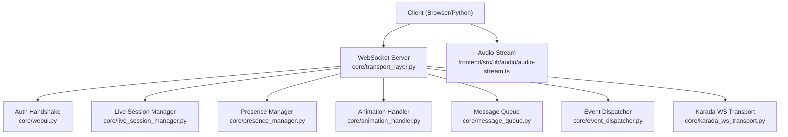
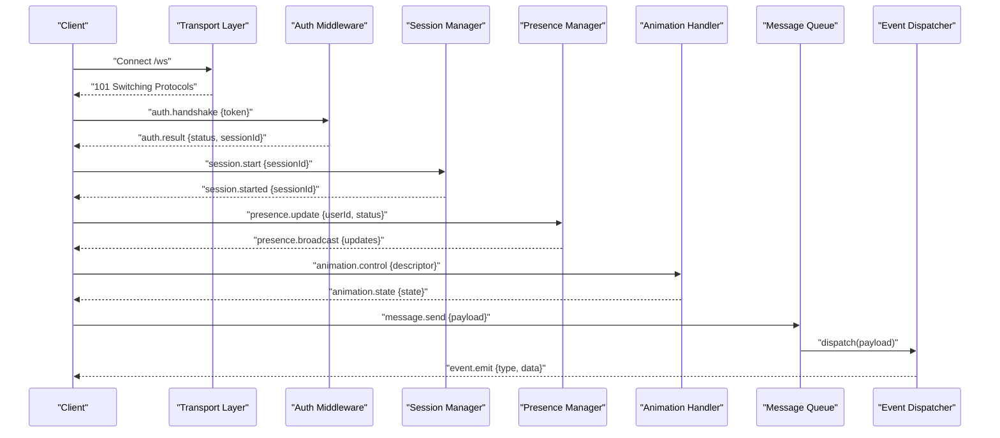
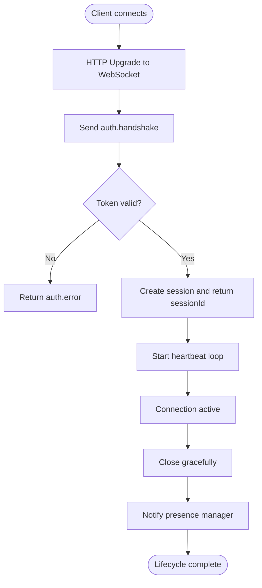
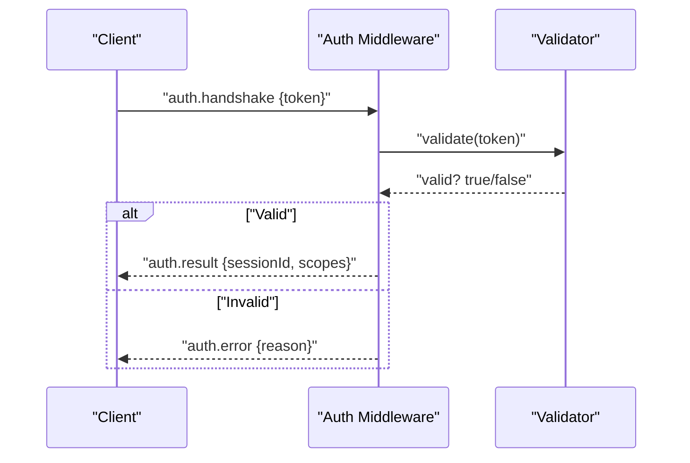
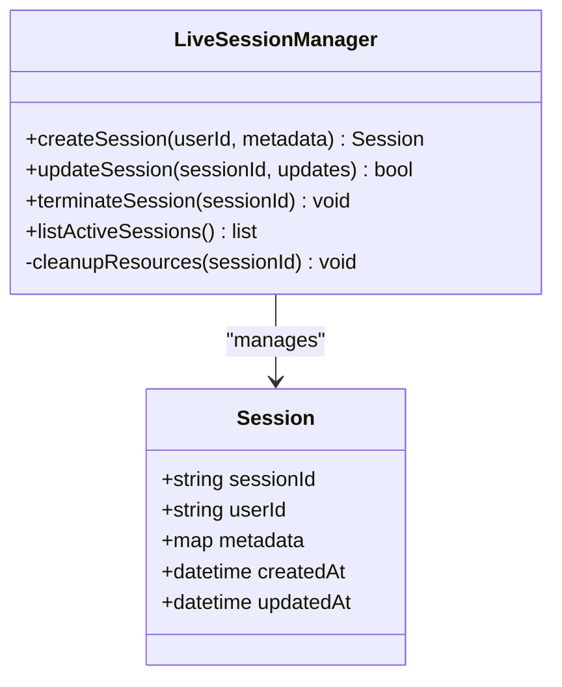
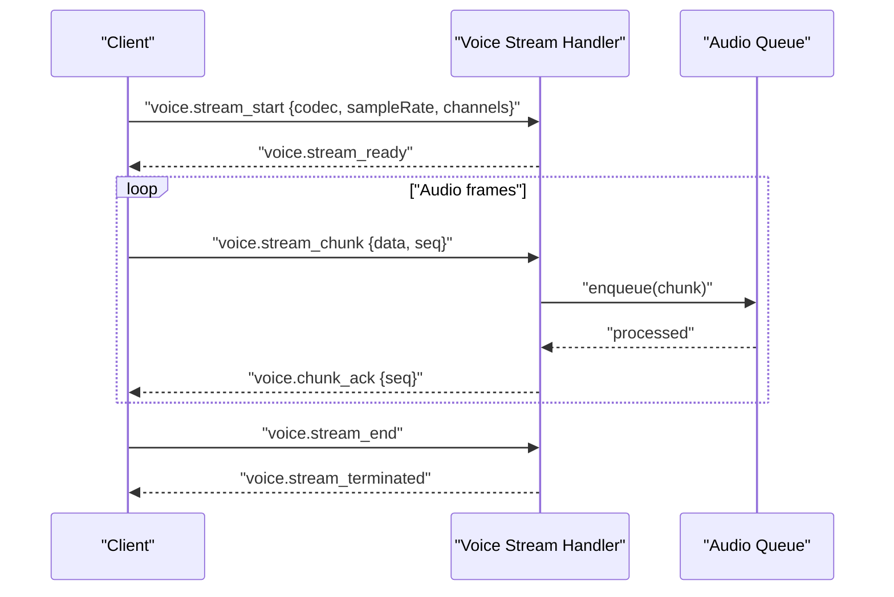
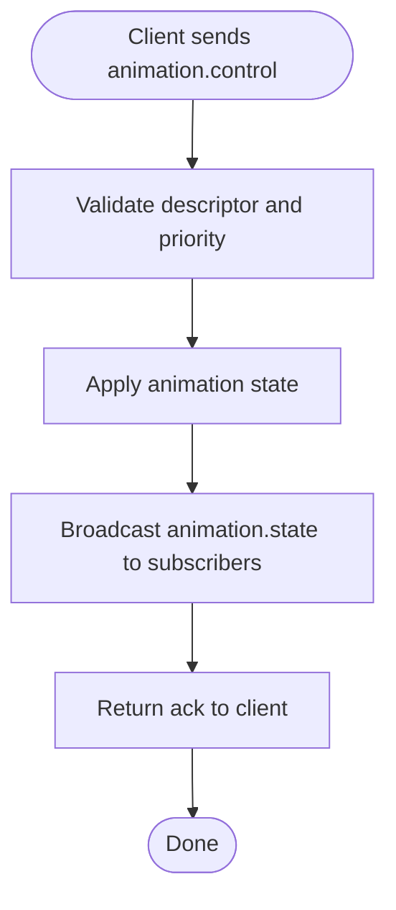
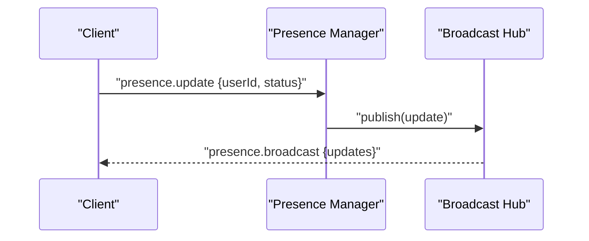
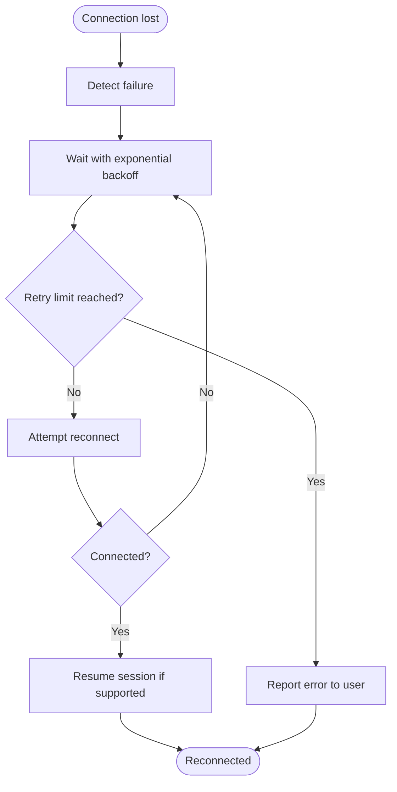
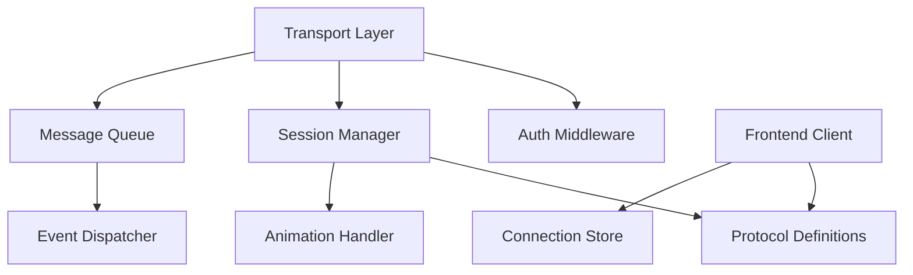

# WebSocket Protocol

<cite>
**Referenced Files in This Document**
- [main.py](file://main.py)
- [core/transport_layer.py](file://core/transport_layer.py)
- [core/live_session_manager.py](file://core/live_session_manager.py)
- [core/presence_manager.py](file://core/presence_manager.py)
- [core/animation_handler.py](file://core/animation_handler.py)
- [core/webui.py](file://core/webui.py)
- [frontend/src/services/synth-ws.ts](file://frontend/src/services/synth-ws.ts)
- [frontend/src/services/protocol.ts](file://frontend/src/services/protocol.ts)
- [frontend/src/stores/connection.ts](file://frontend/src/stores/connection.ts)
- [frontend/src/lib/audio/audio-stream.ts](file://frontend/src/lib/audio/audio-stream.ts)
- [core/karada_ws_transport.py](file://core/karada_ws_transport.py)
- [core/message_queue.py](file://core/message_queue.py)
- [core/event_dispatcher.py](file://core/event_dispatcher.py)
</cite>

## Table of Contents
1. [Introduction](#introduction)
2. [Project Structure](#project-structure)
3. [Core Components](#core-components)
4. [Architecture Overview](#architecture-overview)
5. [Detailed Component Analysis](#detailed-component-analysis)
6. [Dependency Analysis](#dependency-analysis)
7. [Performance Considerations](#performance-considerations)
8. [Troubleshooting Guide](#troubleshooting-guide)
9. [Conclusion](#conclusion)
10. [Appendices](#appendices)

## Introduction
This document specifies the WebSocket protocol used by Synthetic Heart for real-time communication between clients and the server. It covers connection establishment, authentication handshake, message formats, event types, lifecycle management, live session handling, voice streaming, animation control, presence updates, error handling, reconnection strategies, and performance tips. Client implementation examples are provided for JavaScript (browser) and Python using websockets libraries.

## Project Structure
The WebSocket subsystem spans both backend and frontend:
- Backend transport and routing: core/transport_layer.py, core/webui.py
- Live sessions and presence: core/live_session_manager.py, core/presence_manager.py
- Animation control: core/animation_handler.py
- Frontend client: frontend/src/services/synth-ws.ts, frontend/src/services/protocol.ts, frontend/src/stores/connection.ts
- Voice streaming: frontend/src/lib/audio/audio-stream.ts and backend integration via karada_ws_transport.py
- Message dispatching: core/message_queue.py, core/event_dispatcher.py

**Diagram sources**
- [core/transport_layer.py](file://core/transport_layer.py)
- [core/webui.py](file://core/webui.py)
- [core/live_session_manager.py](file://core/live_session_manager.py)
- [core/presence_manager.py](file://core/presence_manager.py)
- [core/animation_handler.py](file://core/animation_handler.py)
- [core/message_queue.py](file://core/message_queue.py)
- [core/event_dispatcher.py](file://core/event_dispatcher.py)
- [core/karada_ws_transport.py](file://core/karada_ws_transport.py)
- [frontend/src/lib/audio/audio-stream.ts](file://frontend/src/lib/audio/audio-stream.ts)

**Section sources**
- [main.py](file://main.py)
- [core/transport_layer.py](file://core/transport_layer.py)
- [core/webui.py](file://core/webui.py)
- [core/live_session_manager.py](file://core/live_session_manager.py)
- [core/presence_manager.py](file://core/presence_manager.py)
- [core/animation_handler.py](file://core/animation_handler.py)
- [core/message_queue.py](file://core/message_queue.py)
- [core/event_dispatcher.py](file://core/event_dispatcher.py)
- [core/karada_ws_transport.py](file://core/karada_ws_transport.py)
- [frontend/src/services/synth-ws.ts](file://frontend/src/services/synth-ws.ts)
- [frontend/src/services/protocol.ts](file://frontend/src/services/protocol.ts)
- [frontend/src/stores/connection.ts](file://frontend/src/stores/connection.ts)
- [frontend/src/lib/audio/audio-stream.ts](file://frontend/src/lib/audio/audio-stream.ts)

## Core Components
- WebSocket Transport Layer: Manages connections, routing, and message framing.
- Authentication Handshake: Validates tokens or credentials before allowing operations.
- Live Session Manager: Creates, tracks, and tears down live sessions with resource cleanup.
- Presence Manager: Publishes and subscribes to presence events across clients.
- Animation Handler: Processes animation control messages and coordinates playback.
- Message Queue and Event Dispatcher: Ensures reliable delivery and decoupled processing.
- Karada WS Transport: Bridges animation and motion data over WebSocket.
- Frontend Client: Implements connection lifecycle, auth, audio streaming, and UI state sync.

**Section sources**
- [core/transport_layer.py](file://core/transport_layer.py)
- [core/webui.py](file://core/webui.py)
- [core/live_session_manager.py](file://core/live_session_manager.py)
- [core/presence_manager.py](file://core/presence_manager.py)
- [core/animation_handler.py](file://core/animation_handler.py)
- [core/message_queue.py](file://core/message_queue.py)
- [core/event_dispatcher.py](file://core/event_dispatcher.py)
- [core/karada_ws_transport.py](file://core/karada_ws_transport.py)
- [frontend/src/services/synth-ws.ts](file://frontend/src/services/synth-ws.ts)
- [frontend/src/services/protocol.ts](file://frontend/src/services/protocol.ts)
- [frontend/src/stores/connection.ts](file://frontend/src/stores/connection.ts)

## Architecture Overview
The WebSocket architecture follows a layered design:
- Transport layer handles raw frames and basic routing.
- Middleware performs authentication and authorization.
- Domain handlers manage live sessions, presence, animations, and voice streams.
- Messaging backbone ensures reliability and decoupling.

**Diagram sources**
- [core/transport_layer.py](file://core/transport_layer.py)
- [core/webui.py](file://core/webui.py)
- [core/live_session_manager.py](file://core/live_session_manager.py)
- [core/presence_manager.py](file://core/presence_manager.py)
- [core/animation_handler.py](file://core/animation_handler.py)
- [core/message_queue.py](file://core/message_queue.py)
- [core/event_dispatcher.py](file://core/event_dispatcher.py)

## Detailed Component Analysis

### Connection Establishment and Lifecycle
- Connect to the WebSocket endpoint.
- Receive 101 Switching Protocols.
- Perform authentication handshake with token or credentials.
- On success, receive session identifier and capabilities.
- Maintain heartbeat; handle ping/pong for liveness.
- Graceful close on disconnect; notify presence manager.

**Diagram sources**
- [core/transport_layer.py](file://core/transport_layer.py)
- [core/webui.py](file://core/webui.py)
- [core/presence_manager.py](file://core/presence_manager.py)

**Section sources**
- [core/transport_layer.py](file://core/transport_layer.py)
- [core/webui.py](file://core/webui.py)
- [frontend/src/services/synth-ws.ts](file://frontend/src/services/synth-ws.ts)
- [frontend/src/stores/connection.ts](file://frontend/src/stores/connection.ts)

### Authentication Handshake
- Client sends an auth.handshake message containing a token or credentials.
- Server validates against configured providers.
- On success, returns auth.result with sessionId and allowed scopes.
- On failure, returns auth.error with reason code.

**Diagram sources**
- [core/webui.py](file://core/webui.py)

**Section sources**
- [core/webui.py](file://core/webui.py)
- [frontend/src/services/protocol.ts](file://frontend/src/services/protocol.ts)

### Message Formats and Event Types
Messages use JSON payloads with a type field and versioned schema. Common categories:
- Session: start, stop, update
- Presence: join, leave, update
- Animation: control, state, variants
- Voice: stream_start, stream_chunk, stream_end
- Chat: send, receive, reaction
- System: heartbeat, error, ack

Schema guidelines:
- All messages include id, type, timestamp, and payload.
- Errors include code, message, and optional details.
- Events may include correlationId to match requests/responses.

Examples of event types:
- session.started, session.stopped
- presence.updated, presence.joined, presence.left
- animation.controlled, animation.state_changed
- voice.stream_started, voice.chunk_received, voice.stream_ended
- chat.message_sent, chat.message_received
- system.heartbeat_ack, system.error

**Section sources**
- [frontend/src/services/protocol.ts](file://frontend/src/services/protocol.ts)
- [core/event_dispatcher.py](file://core/event_dispatcher.py)
- [core/message_queue.py](file://core/message_queue.py)

### Live Session Management
- Create a session with metadata (userId, device, capabilities).
- Track active sessions and enforce limits.
- Handle session updates (e.g., capability changes).
- Clean up resources on session termination.

**Diagram sources**
- [core/live_session_manager.py](file://core/live_session_manager.py)

**Section sources**
- [core/live_session_manager.py](file://core/live_session_manager.py)

### Voice Streaming Protocol
- Initiate stream with stream_start including codec, sample rate, and channels.
- Send stream_chunk frames with encoded audio data and sequence numbers.
- Terminate stream with stream_end and flush buffers.
- Server acknowledges chunks and provides feedback on latency and quality.

**Diagram sources**
- [frontend/src/lib/audio/audio-stream.ts](file://frontend/src/lib/audio/audio-stream.ts)
- [core/karada_ws_transport.py](file://core/karada_ws_transport.py)

**Section sources**
- [frontend/src/lib/audio/audio-stream.ts](file://frontend/src/lib/audio/audio-stream.ts)
- [core/karada_ws_transport.py](file://core/karada_ws_transport.py)

### Animation Control Messages
- Send animation.control with descriptor, priority, and timing.
- Server responds with animation.state reflecting current playback.
- Support variants and transitions; handle fallbacks.

**Diagram sources**
- [core/animation_handler.py](file://core/animation_handler.py)

**Section sources**
- [core/animation_handler.py](file://core/animation_handler.py)

### Presence Updates
- Clients publish presence updates (online, idle, busy).
- Server broadcasts presence changes to relevant subscribers.
- Supports room/channel scoping and filtering.

**Diagram sources**
- [core/presence_manager.py](file://core/presence_manager.py)

**Section sources**
- [core/presence_manager.py](file://core/presence_manager.py)

### Error Handling Patterns
- Use standardized error codes and messages.
- Distinguish between transient and permanent errors.
- Provide retry guidance where applicable.
- Log errors with correlationId for tracing.

Common error codes:
- AUTH_FAILED: Invalid or expired token
- SESSION_LIMIT_EXCEEDED: Too many active sessions
- INVALID_PAYLOAD: Malformed message schema
- STREAM_ERROR: Voice stream issues
- ANIMATION_FAILED: Animation descriptor invalid

**Section sources**
- [core/webui.py](file://core/webui.py)
- [core/transport_layer.py](file://core/transport_layer.py)

### Reconnection Strategies
- Implement exponential backoff with jitter.
- Use session resumption when possible.
- Detect network failures and reconnect automatically.
- Preserve message ordering and deduplicate retries.

**Diagram sources**
- [frontend/src/services/synth-ws.ts](file://frontend/src/services/synth-ws.ts)
- [frontend/src/stores/connection.ts](file://frontend/src/stores/connection.ts)

**Section sources**
- [frontend/src/services/synth-ws.ts](file://frontend/src/services/synth-ws.ts)
- [frontend/src/stores/connection.ts](file://frontend/src/stores/connection.ts)

### Performance Optimization Tips
- Batch small messages to reduce overhead.
- Use binary frames for large payloads like audio.
- Enable compression for text-heavy traffic.
- Implement flow control to prevent queue buildup.
- Cache session capabilities to avoid repeated handshakes.

[No sources needed since this section provides general guidance]

## Dependency Analysis
The WebSocket system depends on several internal modules:
- Transport layer depends on authentication middleware and session manager.
- Live session manager interacts with presence and animation handlers.
- Message queue and event dispatcher provide decoupled messaging.
- Frontend client depends on protocol definitions and stores.

**Diagram sources**
- [core/transport_layer.py](file://core/transport_layer.py)
- [core/webui.py](file://core/webui.py)
- [core/live_session_manager.py](file://core/live_session_manager.py)
- [core/presence_manager.py](file://core/presence_manager.py)
- [core/animation_handler.py](file://core/animation_handler.py)
- [core/message_queue.py](file://core/message_queue.py)
- [core/event_dispatcher.py](file://core/event_dispatcher.py)
- [frontend/src/services/protocol.ts](file://frontend/src/services/protocol.ts)
- [frontend/src/stores/connection.ts](file://frontend/src/stores/connection.ts)

**Section sources**
- [core/transport_layer.py](file://core/transport_layer.py)
- [core/webui.py](file://core/webui.py)
- [core/live_session_manager.py](file://core/live_session_manager.py)
- [core/presence_manager.py](file://core/presence_manager.py)
- [core/animation_handler.py](file://core/animation_handler.py)
- [core/message_queue.py](file://core/message_queue.py)
- [core/event_dispatcher.py](file://core/event_dispatcher.py)
- [frontend/src/services/protocol.ts](file://frontend/src/services/protocol.ts)
- [frontend/src/stores/connection.ts](file://frontend/src/stores/connection.ts)

## Performance Considerations
- Prioritize low-latency paths for voice and animation.
- Use asynchronous processing for heavy tasks.
- Monitor memory usage and garbage collection pauses.
- Implement backpressure mechanisms to handle spikes.
- Profile WebSocket throughput and adjust buffer sizes.

[No sources needed since this section provides general guidance]

## Troubleshooting Guide
Common issues and resolutions:
- Authentication failures: Verify token validity and expiration.
- Session limits: Check concurrent session counts and quotas.
- Voice stream interruptions: Inspect codec compatibility and network stability.
- Animation playback errors: Validate descriptors and fallback chains.
- Presence inconsistencies: Ensure proper subscription filters and broadcast routing.

Debugging steps:
- Enable verbose logging for WebSocket frames.
- Use correlationId to trace request-response cycles.
- Monitor queue depths and event processing times.
- Test with minimal payloads to isolate issues.

**Section sources**
- [core/webui.py](file://core/webui.py)
- [core/transport_layer.py](file://core/transport_layer.py)
- [core/message_queue.py](file://core/message_queue.py)

## Conclusion
The Synthetic Heart WebSocket protocol provides a robust foundation for real-time communication, supporting authentication, live sessions, voice streaming, animation control, and presence updates. By following the documented message schemas, error handling patterns, and reconnection strategies, developers can build reliable clients that integrate seamlessly with the server’s architecture.

[No sources needed since this section summarizes without analyzing specific files]

## Appendices

### Client Implementation Examples

#### JavaScript (Browser) Example
- Establish WebSocket connection to the server endpoint.
- Perform authentication handshake with token.
- Subscribe to events and handle incoming messages.
- Implement reconnection logic with exponential backoff.
- Manage audio streaming using MediaRecorder and binary frames.

Reference paths:
- [synth-ws.ts](file://frontend/src/services/synth-ws.ts)
- [protocol.ts](file://frontend/src/services/protocol.ts)
- [audio-stream.ts](file://frontend/src/lib/audio/audio-stream.ts)

#### Python (websockets) Example
- Connect using websockets library to the WebSocket endpoint.
- Send authentication handshake message with token.
- Listen for events and process them asynchronously.
- Implement reconnection with retry logic.
- Stream audio data using asyncio and binary frames.

Reference paths:
- [synth-ws.ts](file://frontend/src/services/synth-ws.ts)
- [protocol.ts](file://frontend/src/services/protocol.ts)

[No sources needed since this section provides general guidance]