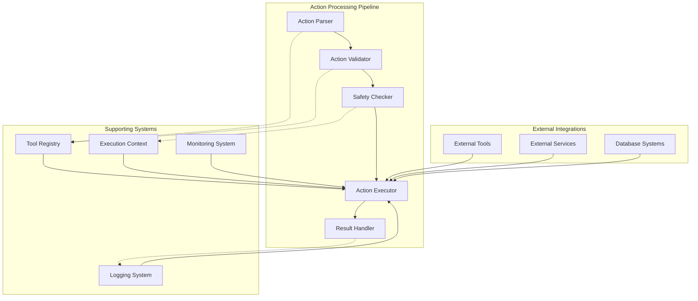
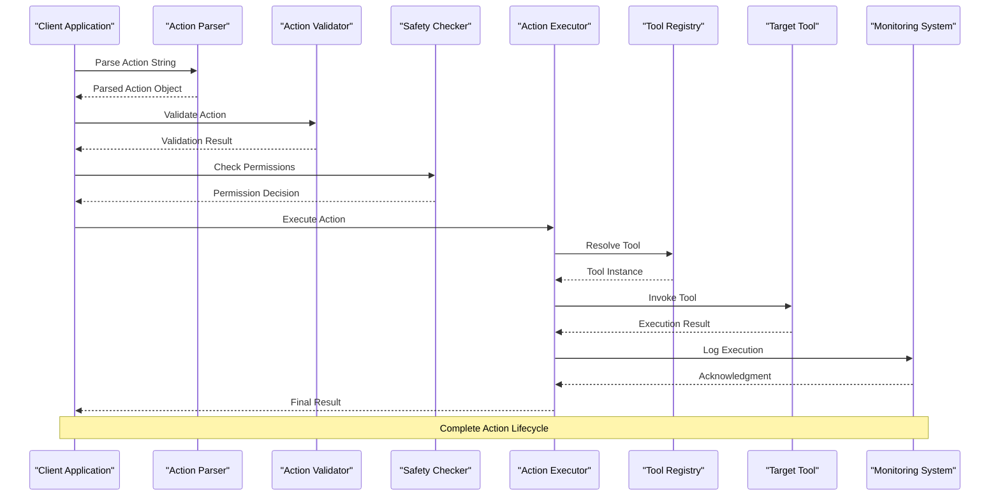
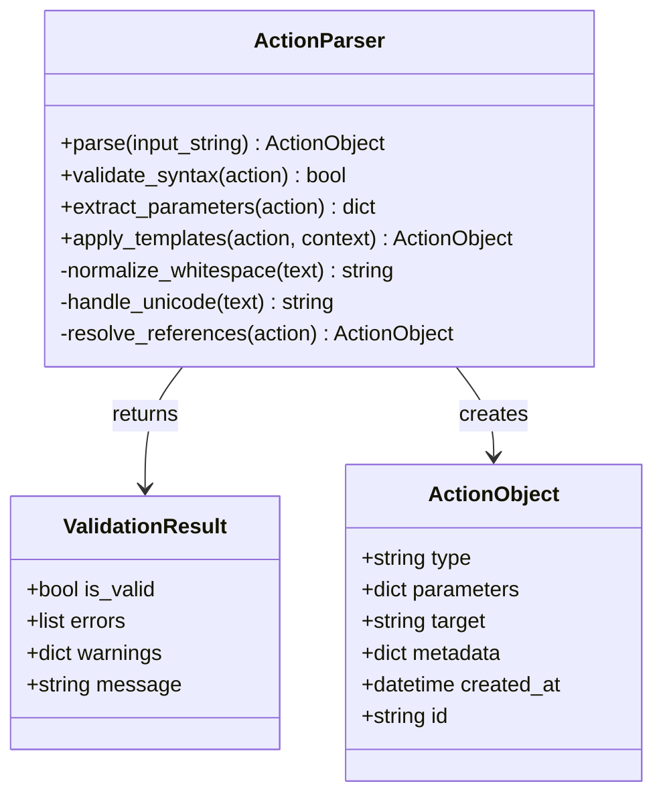
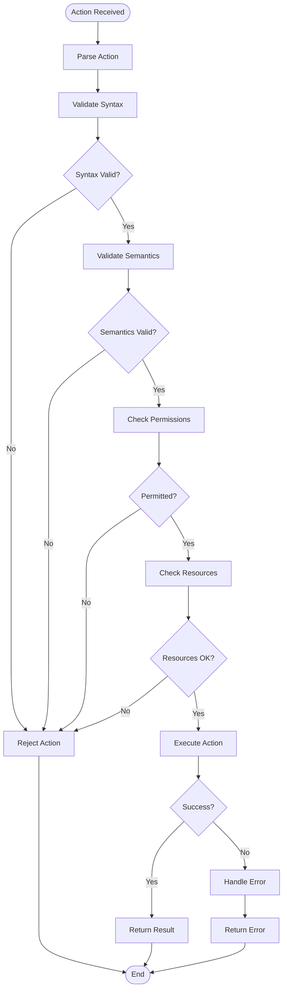
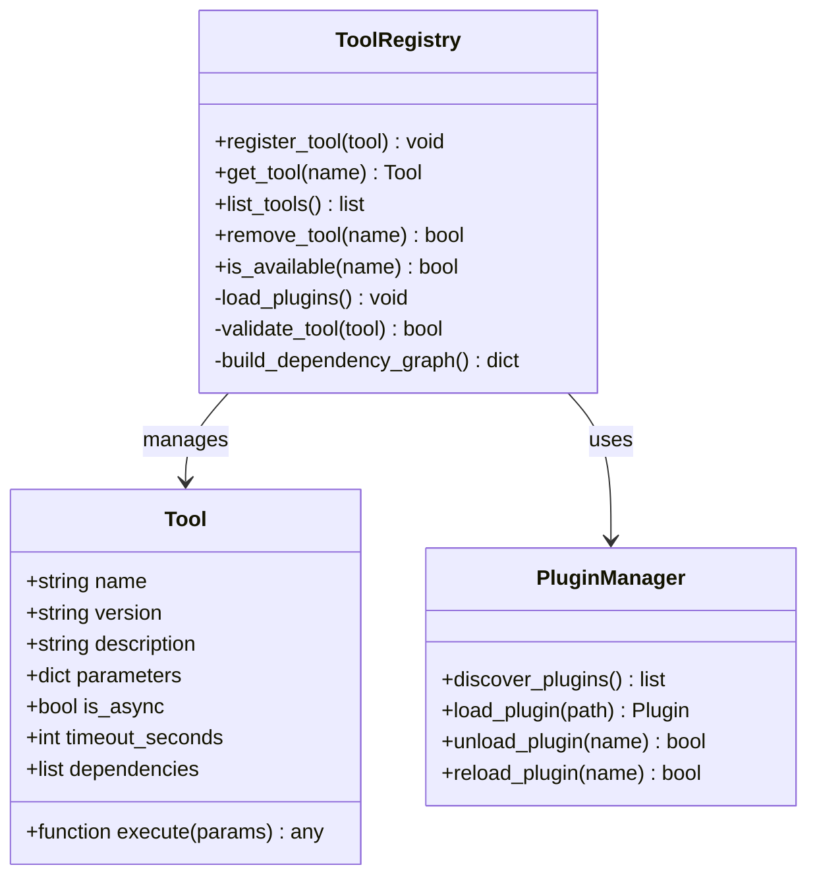
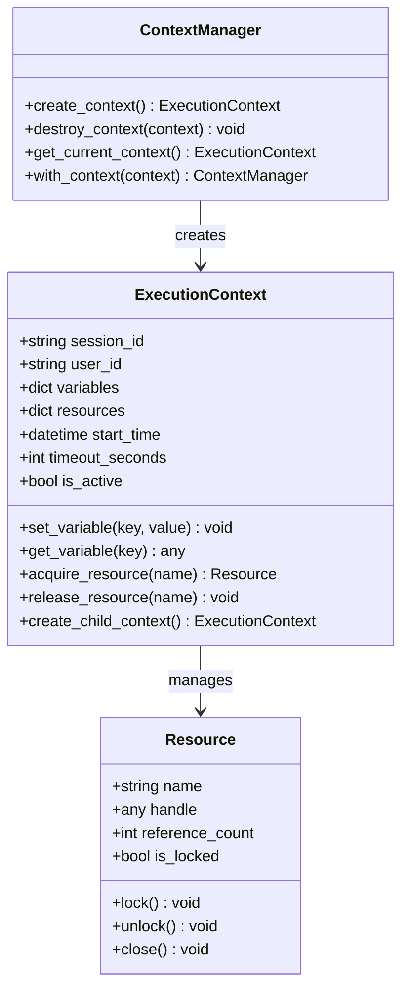
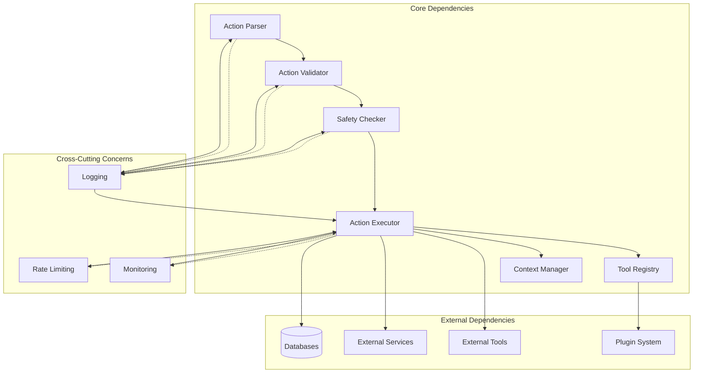

# Action Execution Engine

<cite>
**Referenced Files in This Document**
- [action_parser.py](file://core/action_parser.py)
- [action_safety.py](file://core/action_safety.py)
- [tool_registry.py](file://core/tool_registry.py)
- [agent_tool_executor.py](file://core/agent_tool_executor.py)
- [action_state_manager.py](file://core/action_state_manager.py)
- [action_schema_converter.py](file://core/action_schema_converter.py)
- [command_registry.py](file://core/command_registry.py)
- [validation_registry.py](file://core/validation_registry.py)
- [context.py](file://core/context.py)
- [abstract_context.py](file://core/abstract_context.py)
- [message_chain.py](file://core/message_chain.py)
- [event_dispatcher.py](file://core/event_dispatcher.py)
- [rate_limit.py](file://core/rate_limit.py)
- [logging_utils.py](file://core/logging_utils.py)
</cite>

## Table of Contents
1. [Introduction](#introduction)
2. [Project Structure](#project-structure)
3. [Core Components](#core-components)
4. [Architecture Overview](#architecture-overview)
5. [Detailed Component Analysis](#detailed-component-analysis)
6. [Dependency Analysis](#dependency-analysis)
7. [Performance Considerations](#performance-considerations)
8. [Troubleshooting Guide](#troubleshooting-guide)
9. [Conclusion](#conclusion)

## Introduction

The Action Execution Engine is a critical component of the synthetic heart agent system responsible for parsing, validating, and executing actions within the agent ecosystem. This engine serves as the central hub for action processing, providing a robust framework for handling various types of actions including tool calls, commands, and custom operations. The engine ensures safety through comprehensive validation mechanisms, maintains execution context throughout the action lifecycle, and provides extensive monitoring and error handling capabilities.

The Action Execution Engine supports a flexible action syntax that allows both predefined actions and dynamically generated ones. It implements a sophisticated permission model to control access to sensitive operations, integrates with external tools through a registry system, and provides retry mechanisms for resilient execution. The engine also includes comprehensive logging and monitoring capabilities to track action performance and identify potential issues.

## Project Structure

The Action Execution Engine is organized into several key components that work together to provide a complete action processing pipeline:



**Diagram sources**
- [action_parser.py:1-50](file://core/action_parser.py#L1-L50)
- [tool_registry.py:1-50](file://core/tool_registry.py#L1-L50)
- [context.py:1-50](file://core/context.py#L1-L50)

The engine follows a modular architecture where each component has specific responsibilities:

- **Action Parser**: Handles syntax parsing and initial validation
- **Action Validator**: Performs semantic validation and type checking
- **Safety Checker**: Implements security policies and permission checks
- **Action Executor**: Manages execution context and tool invocation
- **Result Handler**: Processes execution outcomes and updates state
- **Tool Registry**: Maintains available tools and their metadata
- **Context Manager**: Provides execution environment and shared state

**Section sources**
- [action_parser.py:1-100](file://core/action_parser.py#L1-L100)
- [tool_registry.py:1-100](file://core/tool_registry.py#L1-L100)
- [context.py:1-100](file://core/context.py#L1-L100)

## Core Components

### Action Parser

The Action Parser is responsible for converting raw action strings or structured data into executable action objects. It supports multiple input formats including natural language descriptions, JSON payloads, and command-line style arguments.

Key features include:
- Multi-format input support (JSON, YAML, natural language)
- Syntax validation and error recovery
- Parameter extraction and normalization
- Template variable substitution
- Context-aware parsing

### Action Validator

The Action Validator ensures that parsed actions meet all requirements before execution. It performs comprehensive validation including:

- Type checking for all parameters
- Required field validation
- Constraint verification (ranges, patterns, dependencies)
- Cross-field validation rules
- Schema compliance checking

### Safety Checker

The Safety Checker implements security policies to prevent unauthorized or dangerous operations. It includes:

- Permission-based access control
- Resource usage limits
- Input sanitization
- Output filtering
- Audit logging

### Tool Registry

The Tool Registry manages the catalog of available tools and their metadata. It provides:

- Dynamic tool discovery and registration
- Version compatibility checking
- Dependency resolution
- Capability negotiation
- Hot-swapping support

**Section sources**
- [action_parser.py:50-150](file://core/action_parser.py#L50-L150)
- [action_safety.py:1-100](file://core/action_safety.py#L1-L100)
- [tool_registry.py:50-150](file://core/tool_registry.py#L50-L150)

## Architecture Overview

The Action Execution Engine follows a layered architecture pattern that separates concerns and promotes modularity:



**Diagram sources**
- [agent_tool_executor.py:1-100](file://core/agent_tool_executor.py#L1-L100)
- [tool_registry.py:1-100](file://core/tool_registry.py#L1-L100)
- [event_dispatcher.py:1-100](file://core/event_dispatcher.py#L1-L100)

The architecture implements several key design patterns:

- **Pipeline Pattern**: Actions flow through a series of processing stages
- **Strategy Pattern**: Different validation strategies for different action types
- **Observer Pattern**: Event-driven monitoring and logging
- **Factory Pattern**: Dynamic tool instantiation based on configuration

## Detailed Component Analysis

### Action Parser Implementation

The Action Parser handles multiple input formats and provides robust error handling:



**Diagram sources**
- [action_parser.py:1-200](file://core/action_parser.py#L1-L200)

The parser supports various action types:

1. **Tool Calls**: Direct invocations of registered tools
2. **Commands**: Built-in system commands
3. **Queries**: Data retrieval operations
4. **Transformations**: Data manipulation operations
5. **Workflows**: Multi-step action sequences

### Safety and Validation Framework

The safety framework implements a multi-layered approach to action security:



**Diagram sources**
- [action_safety.py:1-150](file://core/action_safety.py#L1-L150)

### Tool Registry System

The tool registry provides dynamic tool management and discovery:



**Diagram sources**
- [tool_registry.py:1-200](file://core/tool_registry.py#L1-L200)

### Execution Context Management

The execution context provides isolation and shared state management:



**Diagram sources**
- [context.py:1-150](file://core/context.py#L1-L150)
- [abstract_context.py:1-100](file://core/abstract_context.py#L1-L100)

**Section sources**
- [action_parser.py:1-300](file://core/action_parser.py#L1-L300)
- [action_safety.py:1-200](file://core/action_safety.py#L1-L200)
- [tool_registry.py:1-300](file://core/tool_registry.py#L1-L300)
- [context.py:1-200](file://core/context.py#L1-L200)

## Dependency Analysis

The Action Execution Engine has well-defined dependencies between its core components:



**Diagram sources**
- [message_chain.py:1-100](file://core/message_chain.py#L1-L100)
- [event_dispatcher.py:1-100](file://core/event_dispatcher.py#L1-L100)
- [rate_limit.py:1-100](file://core/rate_limit.py#L1-L100)

Key dependency relationships:

1. **Low Coupling**: Components communicate through well-defined interfaces
2. **High Cohesion**: Each component has a single responsibility
3. **Dependency Injection**: External dependencies are injected at runtime
4. **Event-Driven**: Loose coupling through event dispatching

**Section sources**
- [message_chain.py:1-200](file://core/message_chain.py#L1-L200)
- [event_dispatcher.py:1-200](file://core/event_dispatcher.py#L1-L200)

## Performance Considerations

The Action Execution Engine is designed with performance optimization in mind:

### Caching Strategies
- **Action Compilation Cache**: Pre-compiles frequently used actions
- **Tool Resolution Cache**: Caches tool lookups and dependency graphs
- **Validation Result Cache**: Reuses validation results for identical inputs
- **Context Pooling**: Reuses execution contexts to reduce allocation overhead

### Concurrency Control
- **Thread-Safe Operations**: All components are thread-safe
- **Connection Pooling**: Efficient resource management for external services
- **Batch Processing**: Supports batch action execution for improved throughput
- **Async Support**: Non-blocking execution for I/O-bound operations

### Memory Management
- **Resource Cleanup**: Automatic cleanup of temporary resources
- **Garbage Collection Optimization**: Minimizes object creation in hot paths
- **Streaming Processing**: Handles large datasets without loading entirely into memory

### Monitoring and Metrics
- **Execution Time Tracking**: Measures action execution duration
- **Resource Usage Monitoring**: Tracks CPU, memory, and I/O usage
- **Error Rate Monitoring**: Tracks failure rates and patterns
- **Throughput Measurement**: Monitors actions processed per second

## Troubleshooting Guide

### Common Issues and Solutions

#### Action Parsing Errors
**Symptoms**: Invalid syntax errors, unexpected token errors
**Causes**: Malformed action strings, unsupported syntax, encoding issues
**Solutions**:
- Validate action format before parsing
- Use proper encoding (UTF-8 recommended)
- Implement fallback parsers for legacy formats
- Add detailed error messages with line numbers

#### Permission Denied Errors
**Symptoms**: Access denied exceptions, insufficient privileges
**Causes**: Missing permissions, incorrect role assignments, expired tokens
**Solutions**:
- Verify user roles and permissions
- Check token expiration and refresh mechanisms
- Implement permission inheritance hierarchies
- Add audit logging for security events

#### Timeout Handling
**Symptoms**: Operation timeouts, resource leaks
**Causes**: Long-running operations, deadlocks, resource exhaustion
**Solutions**:
- Implement configurable timeouts per action type
- Add progress reporting for long operations
- Implement graceful degradation
- Monitor and alert on timeout patterns

#### Resource Management Issues
**Symptoms**: Memory leaks, file descriptor exhaustion, connection pool depletion
**Causes**: Unclosed resources, circular references, connection leaks
**Solutions**:
- Use context managers for resource cleanup
- Implement connection pooling with health checks
- Add resource usage monitoring and alerts
- Implement automatic cleanup on errors

### Debugging Techniques

#### Logging Configuration
```python
# Enable detailed action logging
logger.setLevel(logging.DEBUG)
handler = logging.FileHandler('action_debug.log')
formatter = logging.Formatter('%(asctime)s - %(name)s - %(levelname)s - %(message)s')
handler.setFormatter(formatter)
logger.addHandler(handler)
```

#### Performance Profiling
```python
# Profile action execution
import cProfile
import pstats

def profile_action_execution():
    profiler = cProfile.Profile()
    profiler.enable()
    # Execute action
    profiler.disable()
    stats = pstats.Stats(profiler)
    stats.sort_stats('cumulative')
    stats.print_stats(50)
```

#### Memory Analysis
```python
# Analyze memory usage
import tracemalloc

def analyze_memory_usage():
    tracemalloc.start()
    # Execute action
    snapshot = tracemalloc.take_snapshot()
    top_stats = snapshot.statistics('lineno')
    for stat in top_stats[:10]:
        print(stat)
    tracemalloc.stop()
```

**Section sources**
- [logging_utils.py:1-100](file://core/logging_utils.py#L1-L100)
- [rate_limit.py:1-100](file://core/rate_limit.py#L1-L100)

## Conclusion

The Action Execution Engine provides a robust, scalable, and secure foundation for action processing in the synthetic heart agent system. Its modular architecture, comprehensive validation framework, and extensive monitoring capabilities make it suitable for production deployments requiring high reliability and performance.

Key strengths of the implementation include:

- **Flexibility**: Support for multiple action formats and execution models
- **Security**: Multi-layered validation and permission checking
- **Reliability**: Comprehensive error handling and retry mechanisms
- **Performance**: Optimized for high-throughput scenarios
- **Extensibility**: Plugin-based architecture for custom functionality

Future enhancements could include:

- Machine learning-based action optimization
- Advanced caching strategies with predictive preloading
- Enhanced monitoring with distributed tracing
- Support for more complex workflow orchestration
- Improved error recovery and self-healing capabilities

The Action Execution Engine serves as a critical infrastructure component that enables the synthetic heart system to process diverse actions safely and efficiently while maintaining strict security and performance standards.