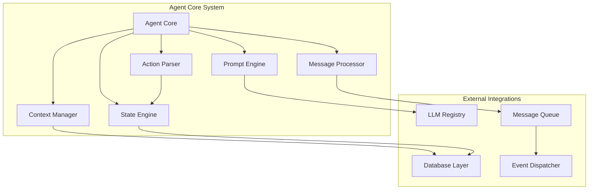
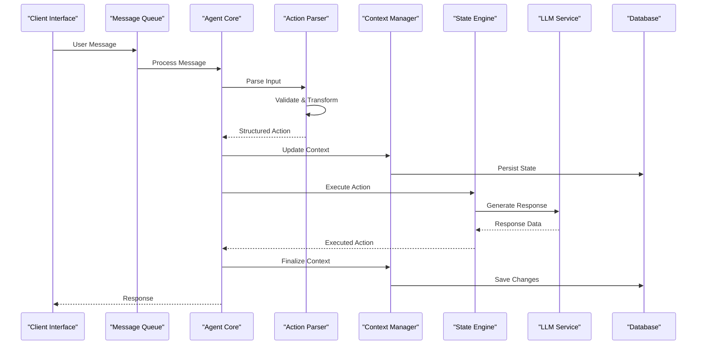
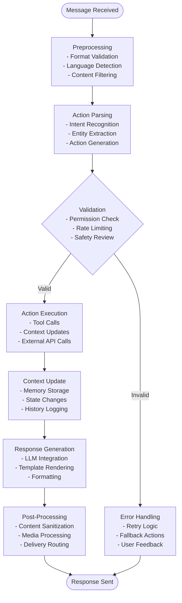
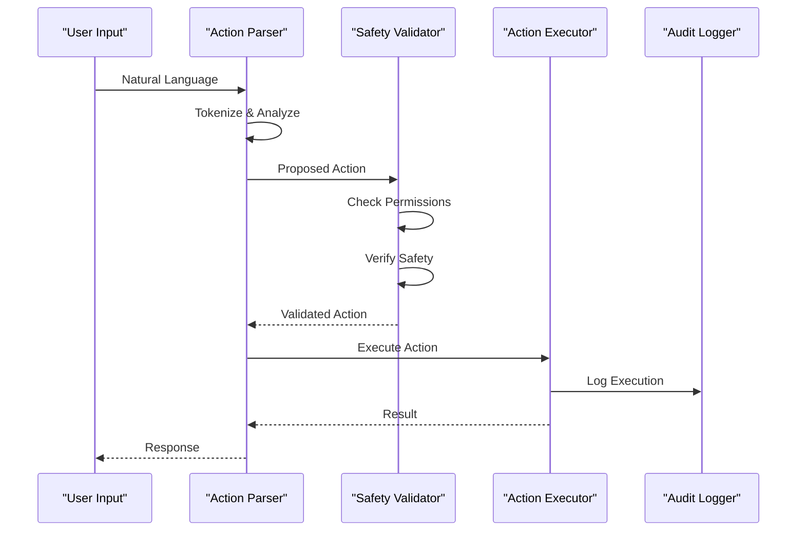
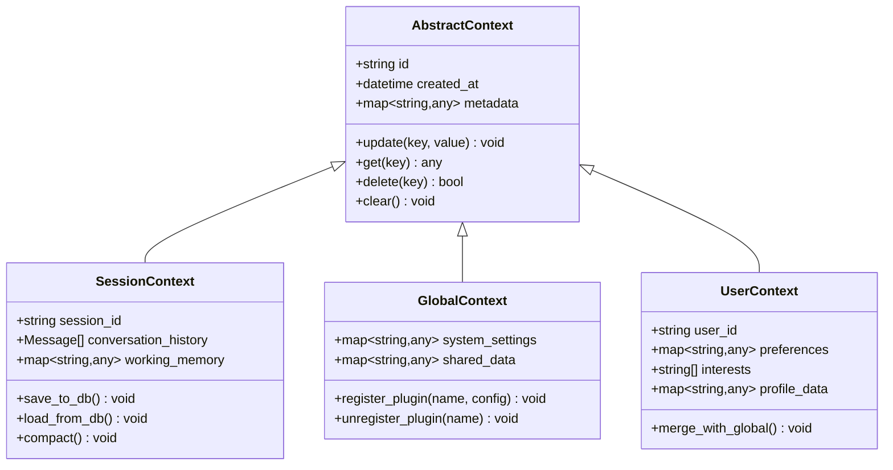
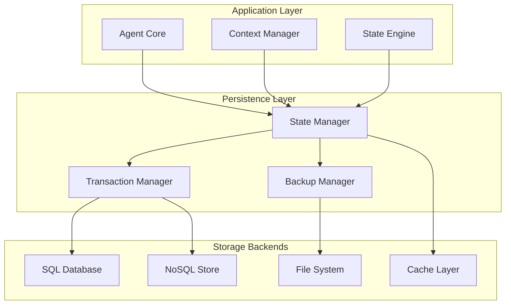
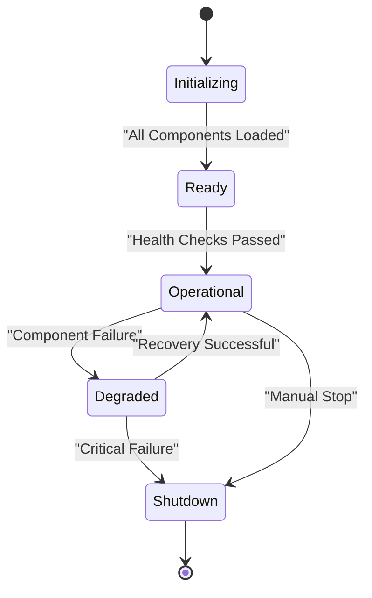
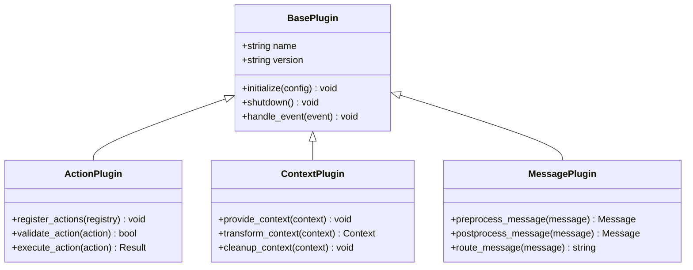

# Agent Core System

<cite>
**Referenced Files in This Document**
- [agent_core.py](file://core/agent_core.py)
- [action_parser.py](file://core/action_parser.py)
- [context.py](file://core/context.py)
- [chat_context_manager.py](file://core/chat_context_manager.py)
- [message_chain.py](file://core/message_chain.py)
- [agent_tool_executor.py](file://core/agent_tool_executor.py)
- [action_state_manager.py](file://core/action_state_manager.py)
- [abstract_context.py](file://core/abstract_context.py)
- [message_queue.py](file://core/message_queue.py)
- [session_meta.py](file://core/session_meta.py)
- [prompt_engine.py](file://core/prompt_engine.py)
- [llm_registry.py](file://core/llm_registry.py)
- [config.py](file://core/config.py)
- [event_dispatcher.py](file://core/event_dispatcher.py)
</cite>

## Table of Contents
1. [Introduction](#introduction)
2. [Project Structure](#project-structure)
3. [Core Components](#core-components)
4. [Architecture Overview](#architecture-overview)
5. [Detailed Component Analysis](#detailed-component-analysis)
6. [Message Processing Pipeline](#message-processing-pipeline)
7. [Action Parsing and Execution](#action-parsing-and-execution)
8. [Context Management](#context-management)
9. [State Persistence](#state-persistence)
10. [Agent Lifecycle](#agent-lifecycle)
11. [Configuration and Performance Tuning](#configuration-and-performance-tuning)
12. [Troubleshooting Guide](#troubleshooting-guide)
13. [Extending Agent Behavior](#extending-agent-behavior)
14. [Conclusion](#conclusion)

## Introduction

The Agent Core System serves as the central processing engine of Synthetic Heart, orchestrating message flow, action execution, context management, and state persistence. It implements a sophisticated pipeline that transforms user inputs into intelligent responses while maintaining conversation continuity and executing complex actions through a robust parsing and execution framework.

The system is designed around several key principles:
- **Modular Architecture**: Clear separation between message processing, action handling, and context management
- **Stateful Conversations**: Persistent context across multiple interactions
- **Extensible Action System**: Pluggable action types with safety mechanisms
- **Performance Optimized**: Efficient memory management and concurrent processing
- **Observable**: Comprehensive logging and debugging capabilities

## Project Structure

The Agent Core System is organized into logical modules within the `core/` directory, each responsible for specific aspects of the agent's functionality:

**Diagram sources**
- [agent_core.py:1-100](file://core/agent_core.py#L1-L100)
- [action_parser.py:1-100](file://core/action_parser.py#L1-L100)
- [context.py:1-100](file://core/context.py#L1-L100)

**Section sources**
- [agent_core.py:1-200](file://core/agent_core.py#L1-L200)
- [config.py:1-150](file://core/config.py#L1-L150)

## Core Components

The Agent Core System consists of several interconnected components that work together to provide intelligent message processing and response generation:

### Agent Core
The main orchestrator that coordinates all subsystems and manages the overall lifecycle of message processing.

### Action Parser
Responsible for parsing natural language inputs into structured actions with validation and safety checks.

### Context Manager
Handles conversation context, memory management, and state persistence across sessions.

### Message Processor
Implements the core message pipeline from input reception to response generation.

### State Engine
Manages agent state transitions, emotion tracking, and behavioral patterns.

### Prompt Engine
Generates contextual prompts for LLM integration with proper formatting and constraints.

**Section sources**
- [agent_core.py:50-150](file://core/agent_core.py#L50-L150)
- [action_parser.py:30-120](file://core/action_parser.py#L30-L120)
- [context.py:40-130](file://core/context.py#L40-L130)

## Architecture Overview

The Agent Core System follows a layered architecture pattern with clear separation of concerns:

**Diagram sources**
- [agent_core.py:100-250](file://core/agent_core.py#L100-L250)
- [message_queue.py:50-150](file://core/message_queue.py#L50-L150)
- [action_parser.py:80-180](file://core/action_parser.py#L80-L180)

## Detailed Component Analysis

### Agent Core Component

The Agent Core serves as the central coordinator for all agent operations. It manages initialization, configuration loading, and the orchestration of message processing workflows.

#### Key Responsibilities:
- **Lifecycle Management**: Handles agent startup, shutdown, and health monitoring
- **Configuration Management**: Loads and validates agent settings
- **Component Orchestration**: Coordinates between parsers, executors, and managers
- **Error Handling**: Implements retry logic and graceful degradation
- **Resource Management**: Manages memory usage and cleanup procedures

#### Configuration Options:
- **Processing Mode**: Batch vs. streaming message processing
- **Memory Limits**: Maximum context size and garbage collection thresholds
- **Concurrency Settings**: Thread pool sizes and queue limits
- **Logging Levels**: Debug, info, warning, error level configurations

**Section sources**
- [agent_core.py:1-200](file://core/agent_core.py#L1-L200)
- [config.py:1-100](file://core/config.py#L1-L100)

### Action Parser Component

The Action Parser transforms natural language inputs into structured, executable actions with comprehensive validation and safety mechanisms.

#### Supported Action Types:
- **Text Actions**: Direct text responses and commands
- **Tool Calls**: Integration with external tools and APIs
- **Context Manipulation**: Memory updates and state changes
- **Media Actions**: Image, audio, and video processing
- **System Commands**: Internal system operations

#### Safety Mechanisms:
- **Input Validation**: Type checking and format verification
- **Permission Controls**: Role-based access control for actions
- **Rate Limiting**: Prevents abuse and resource exhaustion
- **Sanitization**: Removes potentially harmful content

**Section sources**
- [action_parser.py:1-300](file://core/action_parser.py#L1-L300)
- [action_safety.py:1-200](file://core/action_safety.py#L1-L200)

### Context Management Component

The Context Manager provides sophisticated conversation context handling with support for long-term memory, short-term working memory, and session-specific data.

#### Context Hierarchy:
- **Global Context**: System-wide settings and shared data
- **Session Context**: Per-conversation state and history
- **User Context**: Individual user preferences and profile data
- **Task Context**: Temporary data for specific operations

#### Memory Management:
- **Automatic Compaction**: Compresses old memories to save space
- **Priority-Based Retention**: Keeps important information longer
- **Cross-Session Persistence**: Maintains continuity across restarts
- **Selective Loading**: Loads only relevant context for performance

**Section sources**
- [context.py:1-400](file://core/context.py#L1-L400)
- [chat_context_manager.py:1-300](file://core/chat_context_manager.py#L1-L300)
- [abstract_context.py:1-150](file://core/abstract_context.py#L1-L150)

### Message Processing Pipeline

The message processing pipeline implements a multi-stage workflow that transforms raw messages into intelligent responses:

**Diagram sources**
- [message_chain.py:1-250](file://core/message_chain.py#L1-L250)
- [agent_core.py:150-350](file://core/agent_core.py#L150-L350)

**Section sources**
- [message_chain.py:1-300](file://core/message_chain.py#L1-L300)
- [message_queue.py:1-200](file://core/message_queue.py#L1-L200)

## Message Processing Pipeline

The message processing pipeline is the heart of the Agent Core System, implementing a sophisticated multi-stage workflow that ensures reliable and efficient message handling.

### Pipeline Stages:

1. **Message Reception**: Accepts messages from various interfaces (API, WebSocket, queues)
2. **Preprocessing**: Validates format, detects language, applies content filters
3. **Action Parsing**: Converts natural language to structured actions
4. **Validation**: Checks permissions, rate limits, and safety constraints
5. **Execution**: Performs actions including tool calls and context updates
6. **Context Management**: Updates conversation state and memory
7. **Response Generation**: Creates appropriate responses using LLM or templates
8. **Post-Processing**: Formats output, processes media, routes delivery

### Performance Characteristics:
- **Concurrent Processing**: Multiple messages processed simultaneously
- **Queue-Based Architecture**: Decouples message ingestion from processing
- **Caching Layer**: Reduces redundant computations and API calls
- **Memory Management**: Automatic cleanup and garbage collection triggers

**Section sources**
- [message_chain.py:100-400](file://core/message_chain.py#L100-L400)
- [agent_core.py:200-500](file://core/agent_core.py#L200-L500)

## Action Parsing and Execution

The action parsing and execution system provides a robust framework for converting user inputs into safe, validated actions with comprehensive error handling.

### Action Types and Capabilities:

| Action Type | Description | Security Level | Examples |
|-------------|-------------|----------------|----------|
| Text Response | Direct text output | Low | Greetings, information |
| Tool Call | External API integration | Medium | Weather lookup, search |
| Context Update | Memory/state modification | High | Save preference, update bio |
| Media Processing | Image/audio/video handling | Medium | Generate image, transcribe audio |
| System Command | Internal operations | Critical | Restart service, backup data |

### Parsing Workflow:

**Diagram sources**
- [action_parser.py:150-350](file://core/action_parser.py#L150-L350)
- [action_state_manager.py:1-200](file://core/action_state_manager.py#L1-L200)

### Error Handling and Recovery:
- **Graceful Degradation**: Falls back to simpler actions when complex ones fail
- **Retry Logic**: Automatic retries with exponential backoff
- **Fallback Actions**: Alternative implementations for failed operations
- **Audit Trail**: Complete logging of all action attempts and results

**Section sources**
- [action_parser.py:200-500](file://core/action_parser.py#L200-L500)
- [action_state_manager.py:100-300](file://core/action_state_manager.py#L100-L300)

## Context Management

The context management system provides sophisticated memory handling with support for different memory types, automatic compaction, and cross-session persistence.

### Context Architecture:

**Diagram sources**
- [abstract_context.py:1-150](file://core/abstract_context.py#L1-L150)
- [context.py:1-200](file://core/context.py#L1-L200)

### Memory Management Strategies:

1. **Working Memory**: Short-term storage for active conversations
2. **Episodic Memory**: Long-term conversation history with summarization
3. **Semantic Memory**: Knowledge base and learned facts
4. **Procedural Memory**: Skills and learned behaviors

### Context Operations:
- **CRUD Operations**: Create, read, update, delete context entries
- **Query Support**: Advanced filtering and search capabilities
- **Batch Operations**: Efficient bulk updates and queries
- **Transaction Support**: Atomic context modifications

**Section sources**
- [context.py:1-500](file://core/context.py#L1-L500)
- [chat_context_manager.py:1-400](file://core/chat_context_manager.py#L1-L400)

## State Persistence

The state persistence layer ensures reliable storage and retrieval of agent state, conversation history, and configuration data across system restarts and failures.

### Persistence Architecture:

**Diagram sources**
- [db.py:1-200](file://core/db.py#L1-L200)
- [db_backends.py:1-150](file://core/db_backends.py#L1-L150)

### Data Models:
- **Agent State**: Current operational status and configuration
- **Conversation History**: Complete message logs with metadata
- **Context Data**: Structured memory entries with relationships
- **Action Logs**: Audit trail of all executed actions
- **Performance Metrics**: System health and optimization data

### Backup and Recovery:
- **Automated Backups**: Scheduled database snapshots
- **Point-in-Time Recovery**: Restore to specific timestamps
- **Incremental Updates**: Efficient delta backups
- **Cross-Platform Compatibility**: Portable backup formats

**Section sources**
- [db.py:1-300](file://core/db.py#L1-L300)
- [db_backends.py:1-200](file://core/db_backends.py#L1-L200)
- [db_backup.py:1-200](file://core/db_backup.py#L1-L200)

## Agent Lifecycle

The agent lifecycle encompasses the complete journey from initialization through operation to graceful shutdown, with comprehensive health monitoring and recovery mechanisms.

### Lifecycle Stages:

1. **Initialization Phase**:
   - Configuration loading and validation
   - Component registration and dependency resolution
   - Database connection establishment
   - Plugin discovery and loading

2. **Ready Phase**:
   - Health check completion
   - Resource allocation verification
   - Event listener setup
   - Background task initialization

3. **Operational Phase**:
   - Message processing loop
   - Periodic maintenance tasks
   - Performance monitoring
   - Dynamic reconfiguration support

4. **Shutdown Phase**:
   - Graceful message processing completion
   - Resource cleanup and release
   - State persistence and backup
   - Connection termination

### Health Monitoring:

**Diagram sources**
- [agent_core.py:300-600](file://core/agent_core.py#L300-L600)
- [core_initializer.py:1-200](file://core/core_initializer.py#L1-L200)

### Recovery Mechanisms:
- **Automatic Restart**: Failed component self-recovery
- **State Synchronization**: Consistent state across replicas
- **Graceful Degradation**: Reduced functionality during partial failures
- **Emergency Shutdown**: Safe system halt on critical errors

**Section sources**
- [agent_core.py:400-800](file://core/agent_core.py#L400-L800)
- [core_initializer.py:1-300](file://core/core_initializer.py#L1-L300)

## Configuration and Performance Tuning

The Agent Core System provides extensive configuration options and performance tuning parameters to optimize operation for different deployment scenarios.

### Configuration Categories:

| Category | Parameters | Default Values | Description |
|----------|------------|----------------|-------------|
| Processing | max_concurrent_messages | 10 | Maximum parallel message processing |
| Processing | message_timeout_seconds | 30 | Timeout for individual message processing |
| Memory | max_context_size_mb | 100 | Maximum context memory usage |
| Memory | gc_threshold_percent | 70 | Garbage collection trigger threshold |
| Database | connection_pool_size | 5 | Database connection pool size |
| Database | query_timeout_seconds | 10 | Maximum query execution time |
| Logging | log_level | INFO | Minimum log level to record |
| Logging | audit_enabled | true | Enable detailed action auditing |

### Performance Optimization:

1. **Memory Management**:
   - Configurable garbage collection thresholds
   - Automatic memory compaction for large contexts
   - Lazy loading of historical data
   - Memory-mapped file access for large datasets

2. **Concurrency Control**:
   - Adjustable thread pool sizes
   - Queue-based message distribution
   - Priority-based processing for urgent messages
   - Deadlock prevention mechanisms

3. **Database Optimization**:
   - Connection pooling with configurable limits
   - Query caching for frequently accessed data
   - Index optimization recommendations
   - Read replica support for scaling

### Monitoring and Diagnostics:

- **Metrics Collection**: CPU, memory, disk, and network usage
- **Performance Profiling**: Bottleneck identification and analysis
- **Health Checks**: Component-level health monitoring
- **Alerting**: Threshold-based notifications for anomalies

**Section sources**
- [config.py:1-200](file://core/config.py#L1-L200)
- [rate_limit.py:1-150](file://core/rate_limit.py#L1-L150)

## Troubleshooting Guide

This section addresses common issues encountered when operating the Agent Core System, providing diagnostic steps and resolution strategies.

### Common Issues and Solutions:

#### Context Overflow
**Symptoms**: Memory usage spikes, slow response times, context truncation
**Causes**: Excessive conversation history, large media attachments, memory leaks
**Solutions**:
- Configure automatic context compaction thresholds
- Implement message size limits and compression
- Monitor memory usage patterns and adjust GC settings
- Use lazy loading for historical context data

#### Action Conflicts
**Symptoms**: Unexpected behavior, permission errors, conflicting updates
**Causes**: Concurrent action execution, race conditions, insufficient locking
**Solutions**:
- Implement transaction isolation for critical operations
- Add conflict detection and resolution strategies
- Use optimistic locking for concurrent updates
- Provide clear error messages for conflict resolution

#### Memory Management Issues
**Symptoms**: Out-of-memory errors, slow garbage collection, memory leaks
**Causes**: Circular references, unclosed connections, excessive object retention
**Solutions**:
- Enable memory profiling and leak detection
- Implement proper resource cleanup in finally blocks
- Use weak references for circular dependencies
- Monitor heap usage and set appropriate limits

#### Performance Degradation
**Symptoms**: Slow response times, high CPU usage, database timeouts
**Causes**: Inefficient queries, missing indexes, connection pool exhaustion
**Solutions**:
- Profile application performance bottlenecks
- Optimize database queries and add appropriate indexes
- Tune connection pool sizes and timeout values
- Implement caching strategies for frequent operations

### Debugging Techniques:

1. **Enhanced Logging**:
   - Enable debug-level logging for specific components
   - Use structured logging with correlation IDs
   - Implement request tracing across service boundaries

2. **Performance Profiling**:
   - Use memory profilers to identify leaks
   - Profile CPU usage to find hotspots
   - Monitor database query performance

3. **Health Checks**:
   - Implement custom health check endpoints
   - Monitor component dependencies and availability
   - Set up automated alerts for critical failures

**Section sources**
- [logging_utils.py:1-200](file://core/logging_utils.py#L1-L200)
- [cortex_api_logger.py:1-150](file://core/cortex_api_logger.py#L1-L150)

## Extending Agent Behavior

The Agent Core System provides multiple extension points for customizing behavior, integrating new capabilities, and adapting to specific use cases.

### Extension Points:

1. **Custom Action Types**:
   - Implement new action handlers by extending the base action class
   - Register custom actions with the action registry
   - Define action schemas and validation rules
   - Implement error handling and retry logic

2. **Context Providers**:
   - Create custom context sources for dynamic data
   - Implement context transformation pipelines
   - Add custom memory backends for specialized storage
   - Develop context enrichment services

3. **Message Processors**:
   - Build custom preprocessing stages
   - Implement specialized post-processing logic
   - Create message routing and transformation rules
   - Develop custom response formatters

### Plugin Architecture:

**Diagram sources**
- [plugin_base.py:1-200](file://core/plugin_base.py#L1-L200)
- [component_registry.py:1-150](file://core/component_registry.py#L1-L150)

### Integration Examples:

1. **Custom Tool Integration**:
   - Implement tool interface with authentication
   - Define parameter schemas and return types
   - Handle rate limiting and error responses
   - Cache results for performance optimization

2. **External Service Integration**:
   - Create adapter classes for third-party APIs
   - Implement retry logic and circuit breakers
   - Handle authentication and authorization
   - Manage connection pooling and timeouts

3. **Custom Memory Backends**:
   - Implement storage interface for specialized databases
   - Add encryption and compression for sensitive data
   - Provide migration utilities for data format changes
   - Implement backup and restore functionality

**Section sources**
- [plugin_base.py:1-300](file://core/plugin_base.py#L1-L300)
- [component_auto_registration.py:1-200](file://core/component_auto_registration.py#L1-L200)

## Conclusion

The Agent Core System represents a sophisticated and extensible foundation for building intelligent conversational agents. Its modular architecture, comprehensive context management, and robust action execution framework provide the necessary building blocks for creating responsive, stateful, and capable AI assistants.

Key strengths of the system include:

- **Scalable Architecture**: Designed to handle high-throughput message processing with horizontal scaling capabilities
- **Flexible Context Management**: Supports multiple memory types with automatic optimization and persistence
- **Extensible Action System**: Enables easy integration of new tools and capabilities through well-defined interfaces
- **Robust Error Handling**: Comprehensive fault tolerance with graceful degradation and recovery mechanisms
- **Performance Optimization**: Built-in monitoring, profiling, and tuning capabilities for production deployments

The system's design emphasizes maintainability, observability, and extensibility, making it suitable for both development environments and production deployments. With its comprehensive plugin architecture and configuration options, organizations can customize the agent behavior to meet specific requirements while leveraging the core system's proven reliability and performance characteristics.

Future enhancements may include additional AI model integrations, enhanced security features, improved monitoring capabilities, and expanded plugin ecosystems to further extend the system's capabilities and adaptability.