# Agent Lifecycle

<cite>
**Referenced Files in This Document**
- [main.py](file://main.py)
- [core_initializer.py](file://core/core_initializer.py)
- [config_manager.py](file://core/config_manager.py)
- [component_registry.py](file://core/component_registry.py)
- [plugin_base.py](file://core/plugin_base.py)
- [plugin_instance.py](file://core/plugin_instance.py)
- [event_dispatcher.py](file://core/event_dispatcher.py)
- [transport_layer.py](file://core/transport_layer.py)
- [logging_utils.py](file://core/logging_utils.py)
- [interfaces.py](file://core/interfaces.py)
- [agent_core.py](file://core/agent_core.py)
- [two_phase_init_implementation.rst](file://docs/two_phase_init_implementation.rst)
</cite>

## Table of Contents
1. Introduction
2. Project Structure
3. Core Components
4. Architecture Overview
5. Detailed Component Analysis
6. Dependency Analysis
7. Performance Considerations
8. Troubleshooting Guide
9. Conclusion

## Introduction
This document explains the Agent Lifecycle management across initialization, startup, runtime operation, and shutdown. It covers the two-phase initialization pattern, dependency injection, component registration, configuration loading, environment setup, service discovery, plugin loading, graceful shutdown, health checking, monitoring hooks, error recovery strategies, and configuration options for startup parameters, logging levels, and resource limits. The goal is to provide both a high-level understanding and actionable guidance for extending or troubleshooting the agent lifecycle.

## Project Structure
The agent lifecycle spans several core modules:
- Entry point orchestrates bootstrap and lifecycle transitions
- Core initializer manages phases, dependency resolution, and component wiring
- Configuration manager loads settings from files and environment variables
- Component registry provides centralized registration and lookup
- Plugin base and instance manage plugin lifecycle and extension points
- Event dispatcher enables decoupled communication between components
- Transport layer handles I/O and connectivity
- Logging utilities configure structured logging and output targets
- Interfaces define contracts used by lifecycle components
- Agent core coordinates runtime behavior and integration points

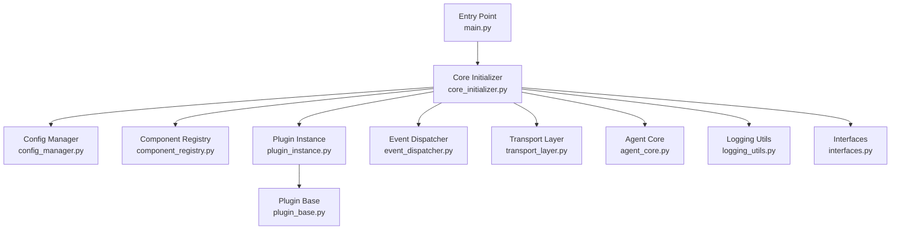

**Diagram sources**
- [main.py](file://main.py)
- [core_initializer.py](file://core/core_initializer.py)
- [config_manager.py](file://core/config_manager.py)
- [component_registry.py](file://core/component_registry.py)
- [plugin_base.py](file://core/plugin_base.py)
- [plugin_instance.py](file://core/plugin_instance.py)
- [event_dispatcher.py](file://core/event_dispatcher.py)
- [transport_layer.py](file://core/transport_layer.py)
- [logging_utils.py](file://core/logging_utils.py)
- [interfaces.py](file://core/interfaces.py)
- [agent_core.py](file://core/agent_core.py)

**Section sources**
- [main.py](file://main.py)
- [core_initializer.py](file://core/core_initializer.py)
- [config_manager.py](file://core/config_manager.py)
- [component_registry.py](file://core/component_registry.py)
- [plugin_base.py](file://core/plugin_base.py)
- [plugin_instance.py](file://core/plugin_instance.py)
- [event_dispatcher.py](file://core/event_dispatcher.py)
- [transport_layer.py](file://core/transport_layer.py)
- [logging_utils.py](file://core/logging_utils.py)
- [interfaces.py](file://core/interfaces.py)
- [agent_core.py](file://core/agent_core.py)

## Core Components
- Entry Point: Initializes logging, loads configuration, starts the core initializer, and manages process signals for graceful shutdown.
- Core Initializer: Implements the two-phase initialization pattern (prepare and start), resolves dependencies via DI, registers components, and wires event-driven interactions.
- Config Manager: Loads configuration from JSON/YAML and environment variables, validates required fields, and exposes typed accessors.
- Component Registry: Centralizes registration and retrieval of components with versioning and capability metadata.
- Plugin System: Provides a base class and instance loader for dynamic plugin discovery, lifecycle hooks, and isolation.
- Event Dispatcher: Publishes and subscribes to events for decoupled communication across subsystems.
- Transport Layer: Manages network connections, message queues, and I/O backends.
- Logging Utilities: Configures loggers, handlers, and formatting; supports rotating files and structured outputs.
- Interfaces: Defines contracts for services like configuration, plugins, transport, and observability.
- Agent Core: Coordinates runtime orchestration, health checks, and integration with external systems.

**Section sources**
- [core_initializer.py](file://core/core_initializer.py)
- [config_manager.py](file://core/config_manager.py)
- [component_registry.py](file://core/component_registry.py)
- [plugin_base.py](file://core/plugin_base.py)
- [plugin_instance.py](file://core/plugin_instance.py)
- [event_dispatcher.py](file://core/event_dispatcher.py)
- [transport_layer.py](file://core/transport_layer.py)
- [logging_utils.py](file://core/logging_utils.py)
- [interfaces.py](file://core/interfaces.py)
- [agent_core.py](file://core/agent_core.py)

## Architecture Overview
The lifecycle follows a clear sequence:
- Bootstrap: Load configuration, set up logging, initialize core initializer.
- Phase 1 (Prepare): Validate config, discover plugins, register components, resolve dependencies.
- Phase 2 (Start): Start transports, event bus, agent core, and background tasks.
- Runtime: Handle requests, process events, run periodic tasks, monitor health.
- Shutdown: Gracefully stop transports, flush logs, release resources, exit cleanly.

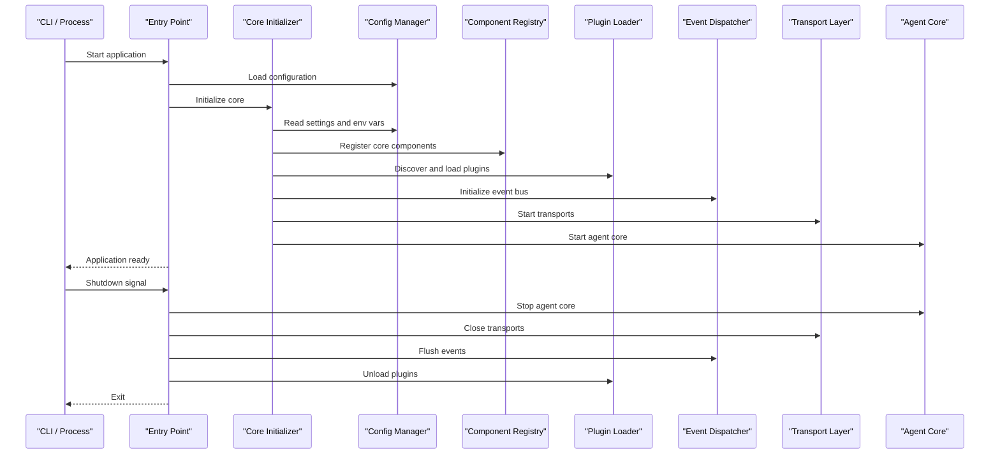

**Diagram sources**
- [main.py](file://main.py)
- [core_initializer.py](file://core/core_initializer.py)
- [config_manager.py](file://core/config_manager.py)
- [component_registry.py](file://core/component_registry.py)
- [plugin_instance.py](file://core/plugin_instance.py)
- [event_dispatcher.py](file://core/event_dispatcher.py)
- [transport_layer.py](file://core/transport_layer.py)
- [agent_core.py](file://core/agent_core.py)

## Detailed Component Analysis

### Two-Phase Initialization Pattern
The two-phase pattern separates preparation from activation:
- Prepare phase: Validates configuration, discovers plugins, registers components, and resolves dependencies without starting long-running services.
- Start phase: Activates transports, event bus, agent core, and background tasks after all dependencies are ready.

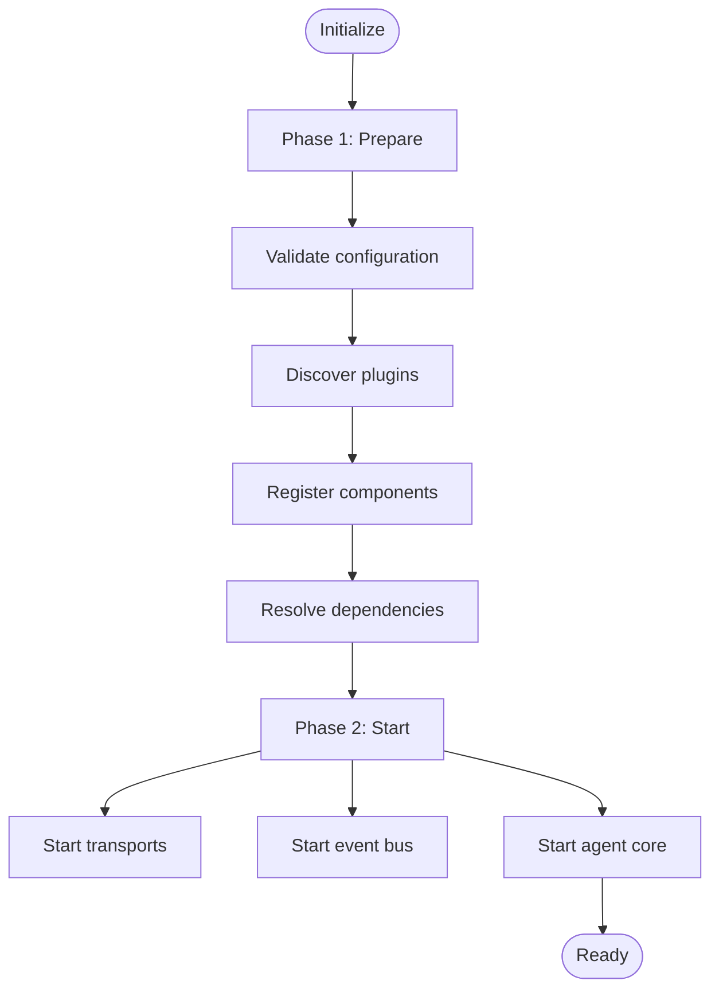

**Diagram sources**
- [core_initializer.py](file://core/core_initializer.py)
- [two_phase_init_implementation.rst](file://docs/two_phase_init_implementation.rst)

**Section sources**
- [core_initializer.py](file://core/core_initializer.py)
- [two_phase_init_implementation.rst](file://docs/two_phase_init_implementation.rst)

### Dependency Injection and Component Registration
- Dependency Injection: The core initializer constructs components with explicit dependencies, ensuring predictable initialization order and testability.
- Component Registration: Components register themselves with capabilities and versions; the registry enforces uniqueness and compatibility.

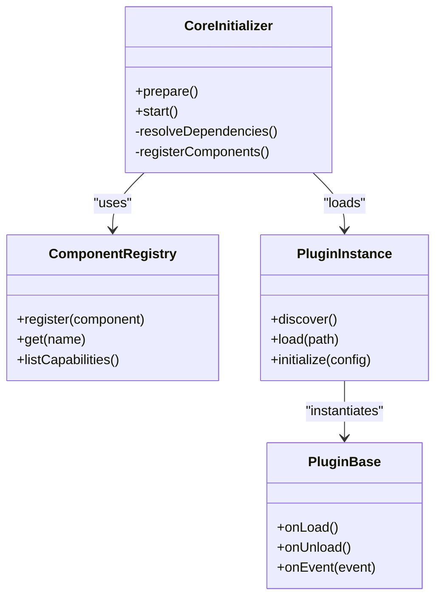

**Diagram sources**
- [core_initializer.py](file://core/core_initializer.py)
- [component_registry.py](file://core/component_registry.py)
- [plugin_base.py](file://core/plugin_base.py)
- [plugin_instance.py](file://core/plugin_instance.py)

**Section sources**
- [core_initializer.py](file://core/core_initializer.py)
- [component_registry.py](file://core/component_registry.py)
- [plugin_base.py](file://core/plugin_base.py)
- [plugin_instance.py](file://core/plugin_instance.py)

### Configuration Loading and Environment Setup
- Configuration Sources: JSON/YAML files and environment variables are merged; environment overrides take precedence.
- Validation: Required keys are enforced; defaults are applied when missing.
- Accessors: Typed getters ensure consistent usage across components.

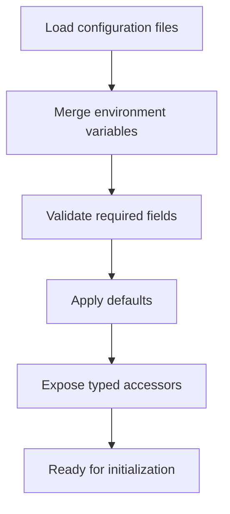

**Diagram sources**
- [config_manager.py](file://core/config_manager.py)

**Section sources**
- [config_manager.py](file://core/config_manager.py)

### Service Discovery Mechanisms
- Plugin Discovery: Scans configured directories for plugin modules and metadata.
- Capability-Based Lookup: Components expose capabilities; consumers query the registry for compatible implementations.
- Version Compatibility: Registry enforces minimum/maximum versions for safe upgrades.

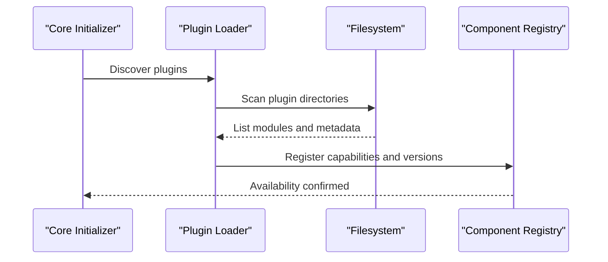

**Diagram sources**
- [plugin_instance.py](file://core/plugin_instance.py)
- [component_registry.py](file://core/component_registry.py)

**Section sources**
- [plugin_instance.py](file://core/plugin_instance.py)
- [component_registry.py](file://core/component_registry.py)

### Plugin Loading and Custom Initialization Logic
- Plugin Base: Defines lifecycle hooks for load, unload, and event handling.
- Plugin Instance: Handles discovery, instantiation, and configuration binding.
- Custom Logic: Plugins can implement pre-start and post-start hooks to perform domain-specific initialization.

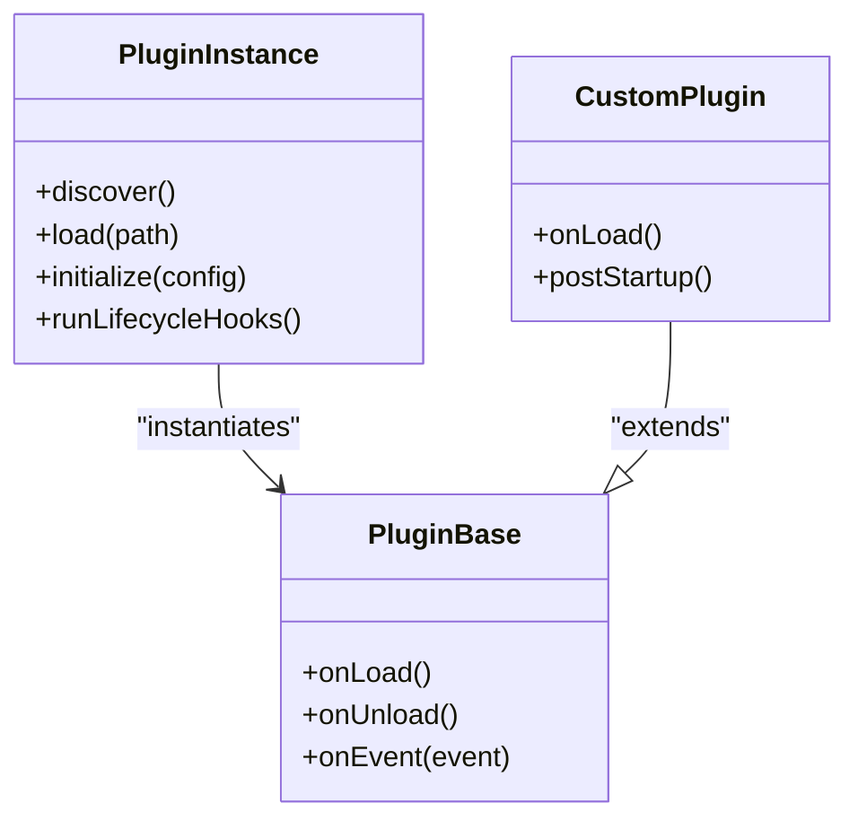

**Diagram sources**
- [plugin_base.py](file://core/plugin_base.py)
- [plugin_instance.py](file://core/plugin_instance.py)

**Section sources**
- [plugin_base.py](file://core/plugin_base.py)
- [plugin_instance.py](file://core/plugin_instance.py)

### Graceful Shutdown Procedures
- Signal Handling: Catches termination signals to initiate shutdown.
- Ordered Teardown: Stops agent core, closes transports, flushes events, unloads plugins, releases resources.
- Finalization: Ensures logs are flushed and temporary files cleaned up.

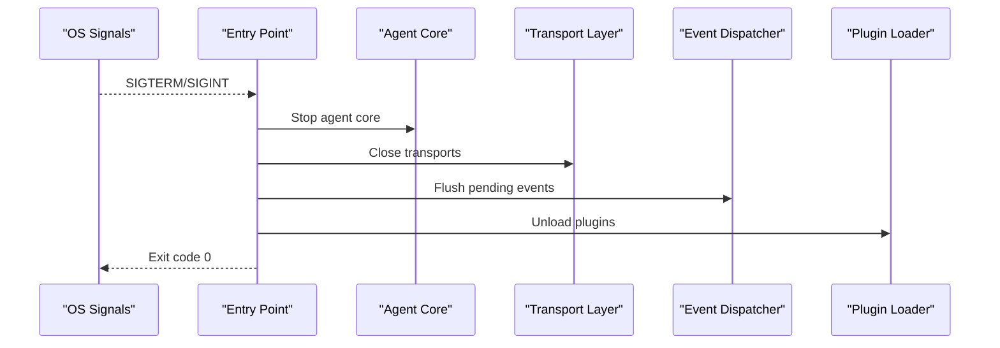

**Diagram sources**
- [main.py](file://main.py)
- [agent_core.py](file://core/agent_core.py)
- [transport_layer.py](file://core/transport_layer.py)
- [event_dispatcher.py](file://core/event_dispatcher.py)
- [plugin_instance.py](file://core/plugin_instance.py)

**Section sources**
- [main.py](file://main.py)
- [agent_core.py](file://core/agent_core.py)
- [transport_layer.py](file://core/transport_layer.py)
- [event_dispatcher.py](file://core/event_dispatcher.py)
- [plugin_instance.py](file://core/plugin_instance.py)

### Health Checking and Monitoring Hooks
- Health Endpoints: Components expose status checks for readiness and liveness.
- Monitoring Hooks: Events emitted on lifecycle transitions and errors for observability.
- Metrics: Optional counters and gauges for performance tracking.

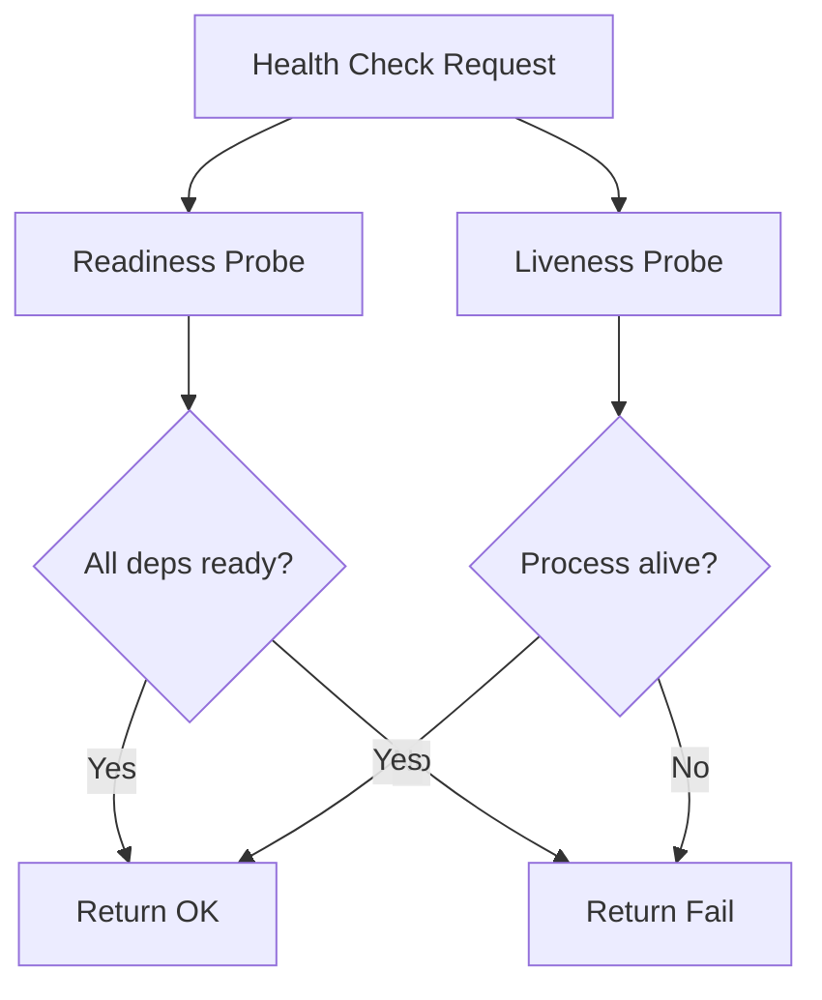

**Diagram sources**
- [agent_core.py](file://core/agent_core.py)
- [event_dispatcher.py](file://core/event_dispatcher.py)

**Section sources**
- [agent_core.py](file://core/agent_core.py)
- [event_dispatcher.py](file://core/event_dispatcher.py)

### Error Recovery Strategies
- Retry Policies: Transient failures trigger exponential backoff retries.
- Fallbacks: Alternative implementations or degraded modes when primary services fail.
- Circuit Breakers: Prevent cascading failures by isolating broken dependencies.
- Audit Logging: Errors are captured with context for diagnostics.

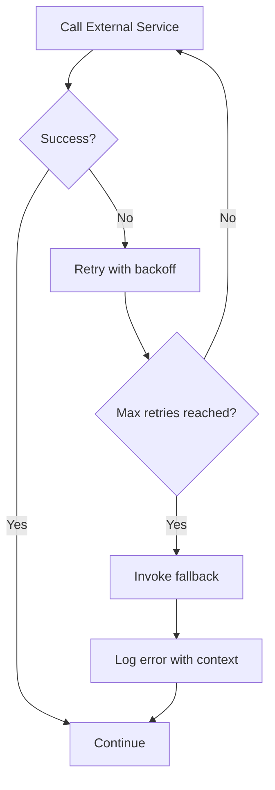

**Diagram sources**
- [transport_layer.py](file://core/transport_layer.py)
- [logging_utils.py](file://core/logging_utils.py)

**Section sources**
- [transport_layer.py](file://core/transport_layer.py)
- [logging_utils.py](file://core/logging_utils.py)

### Configuration Options for Startup Parameters, Logging Levels, and Resource Limits
- Startup Parameters: Flags for enabling features, selecting transports, and setting concurrency.
- Logging Levels: Verbose, info, warning, error; structured JSON output optional.
- Resource Limits: Memory caps, thread pool sizes, and connection limits per backend.

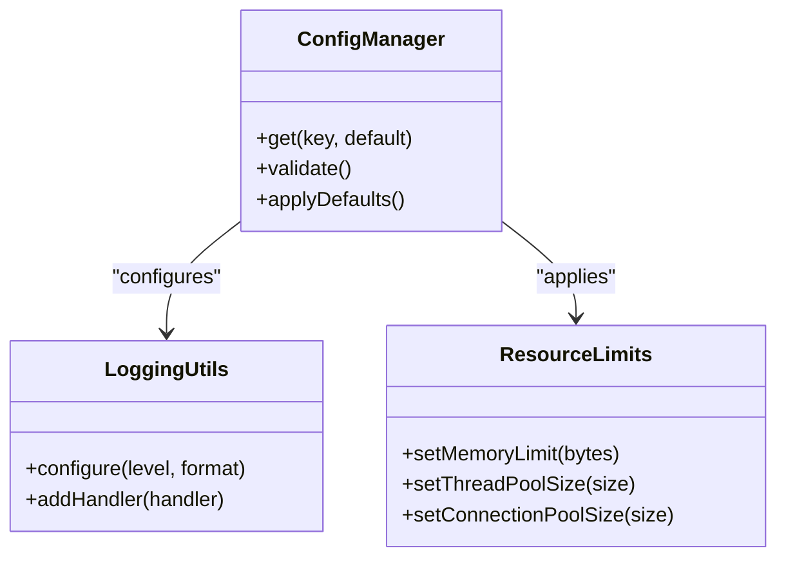

**Diagram sources**
- [config_manager.py](file://core/config_manager.py)
- [logging_utils.py](file://core/logging_utils.py)

**Section sources**
- [config_manager.py](file://core/config_manager.py)
- [logging_utils.py](file://core/logging_utils.py)

## Dependency Analysis
The lifecycle components have well-defined dependencies:
- Core initializer depends on configuration, registry, plugin loader, event bus, transport, and agent core.
- Plugins depend on base interfaces and may use shared utilities.
- Transports depend on networking libraries and configuration.
- Logging is cross-cutting and configured early.

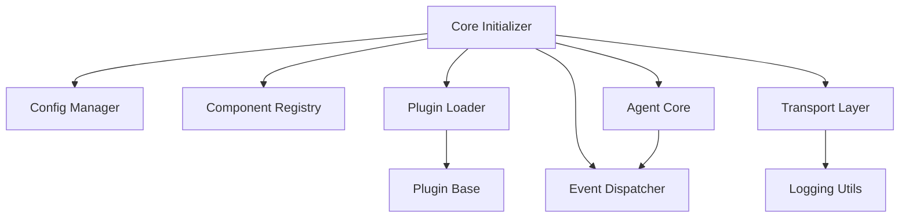

**Diagram sources**
- [core_initializer.py](file://core/core_initializer.py)
- [config_manager.py](file://core/config_manager.py)
- [component_registry.py](file://core/component_registry.py)
- [plugin_instance.py](file://core/plugin_instance.py)
- [plugin_base.py](file://core/plugin_base.py)
- [event_dispatcher.py](file://core/event_dispatcher.py)
- [transport_layer.py](file://core/transport_layer.py)
- [agent_core.py](file://core/agent_core.py)
- [logging_utils.py](file://core/logging_utils.py)

**Section sources**
- [core_initializer.py](file://core/core_initializer.py)
- [config_manager.py](file://core/config_manager.py)
- [component_registry.py](file://core/component_registry.py)
- [plugin_instance.py](file://core/plugin_instance.py)
- [plugin_base.py](file://core/plugin_base.py)
- [event_dispatcher.py](file://core/event_dispatcher.py)
- [transport_layer.py](file://core/transport_layer.py)
- [agent_core.py](file://core/agent_core.py)
- [logging_utils.py](file://core/logging_utils.py)

## Performance Considerations
- Lazy Initialization: Defer expensive operations until needed to reduce startup time.
- Connection Pooling: Reuse connections for databases and external APIs.
- Async I/O: Use non-blocking I/O for high-throughput scenarios.
- Batching: Aggregate events and writes to minimize overhead.
- Resource Tuning: Adjust thread pools and memory limits based on workload.

[No sources needed since this section provides general guidance]

## Troubleshooting Guide
Common issues and resolutions:
- Initialization Failures: Check configuration validation errors and missing dependencies; review logs for stack traces.
- Dependency Resolution Errors: Ensure component versions are compatible; verify registry entries and capability metadata.
- Resource Cleanup Problems: Confirm shutdown hooks execute; check for open file handles or network sockets.
- Plugin Loading Issues: Validate plugin paths and metadata; inspect plugin initialization logs.
- Health Check Failures: Inspect readiness probes and dependency statuses; verify external service availability.

**Section sources**
- [core_initializer.py](file://core/core_initializer.py)
- [config_manager.py](file://core/config_manager.py)
- [component_registry.py](file://core/component_registry.py)
- [plugin_instance.py](file://core/plugin_instance.py)
- [logging_utils.py](file://core/logging_utils.py)

## Conclusion
The Agent Lifecycle is designed around a robust two-phase initialization, strong dependency injection, and modular component registration. Configuration management, service discovery, and plugin loading enable flexible extensibility. Graceful shutdown, health checking, and error recovery ensure reliability. By following the patterns and guidelines outlined here, developers can extend the agent safely and maintain high availability under varying conditions.

[No sources needed since this section summarizes without analyzing specific files]