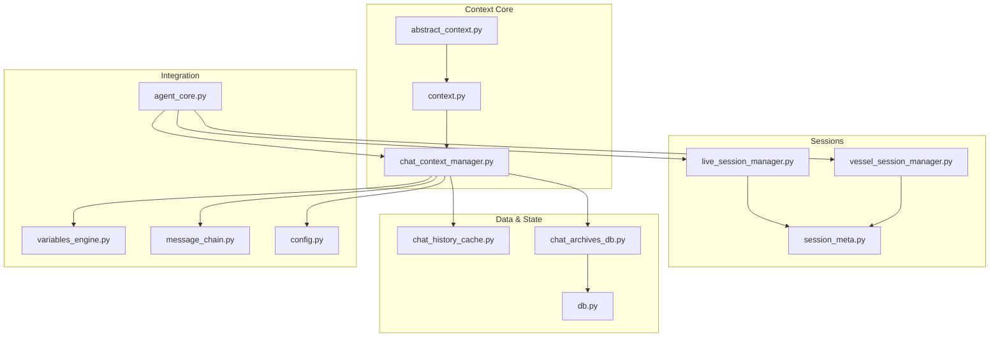
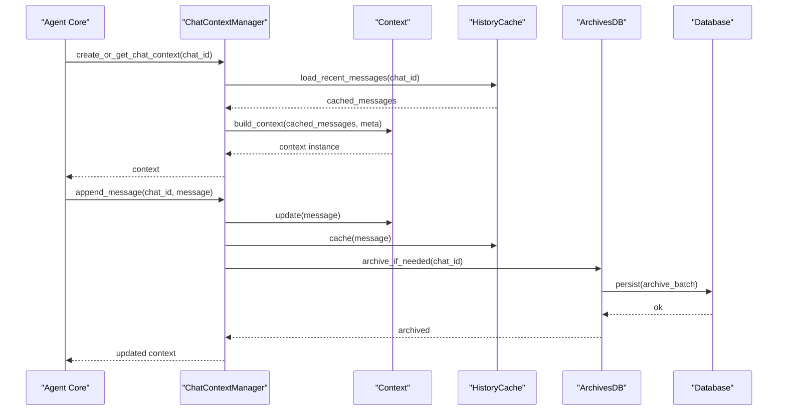
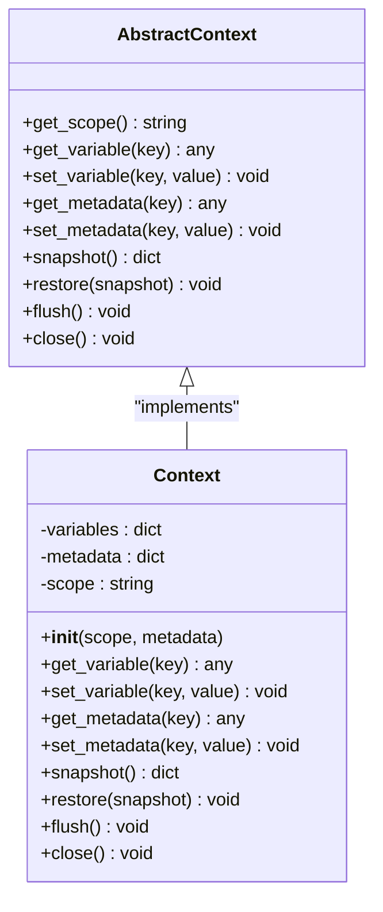
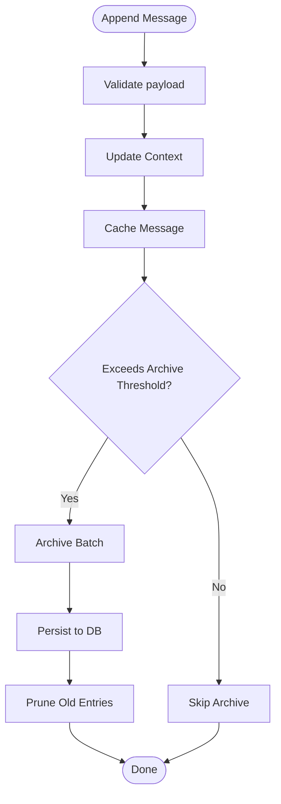
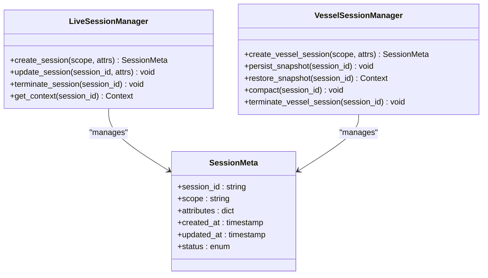
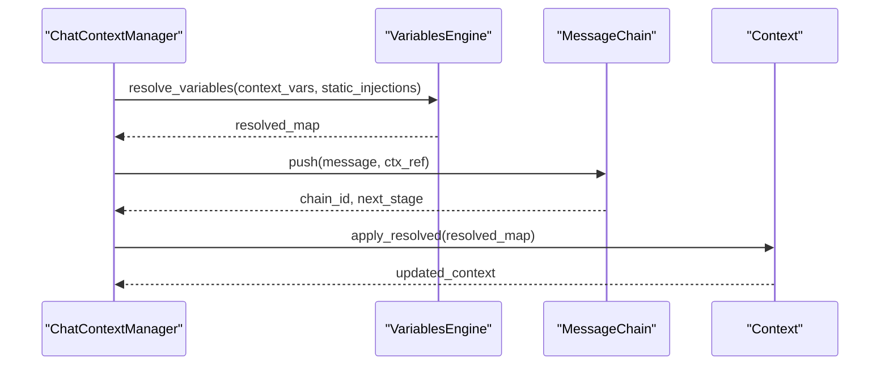
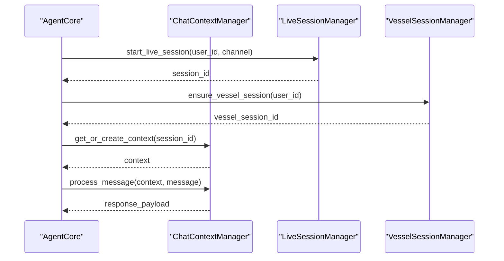
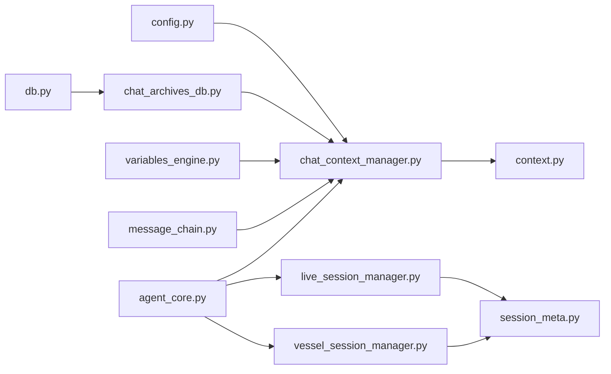

# Context Management

<cite>
**Referenced Files in This Document**
- [abstract_context.py](file://core/abstract_context.py)
- [context.py](file://core/context.py)
- [chat_context_manager.py](file://core/chat_context_manager.py)
- [session_meta.py](file://core/session_meta.py)
- [live_session_manager.py](file://core/live_session_manager.py)
- [vessel_session_manager.py](file://core/vessel_session_manager.py)
- [chat_history_cache.py](file://core/chat_history_cache.py)
- [variables_engine.py](file://core/variables_engine.py)
- [message_chain.py](file://core/message_chain.py)
- [agent_core.py](file://core/agent_core.py)
- [config.py](file://core/config.py)
- [db.py](file://core/db.py)
- [chat_archives_db.py](file://core/chat_archives_db.py)
</cite>

## Table of Contents
1. [Introduction](#introduction)
2. [Project Structure](#project-structure)
3. [Core Components](#core-components)
4. [Architecture Overview](#architecture-overview)
5. [Detailed Component Analysis](#detailed-component-analysis)
6. [Dependency Analysis](#dependency-analysis)
7. [Performance Considerations](#performance-considerations)
8. [Troubleshooting Guide](#troubleshooting-guide)
9. [Conclusion](#conclusion)

## Introduction
This document explains the Context Management system that handles conversation state, user sessions, and contextual information across the agent lifecycle. It covers context hierarchy, session management, data persistence strategies, creation/update/access patterns, variables and metadata handling, cross-session sharing, isolation and security boundaries, memory optimization, configuration for retention and cleanup, and common issues such as leaks, memory overflow, and session synchronization problems.

## Project Structure
The Context Management system is implemented primarily under core/. Key modules include:
- Abstract and concrete context definitions
- Chat-level context manager
- Session metadata and session managers (live and vessel)
- History caching and archives
- Variables engine and message chain utilities
- Agent core integration points
- Configuration and database backends

**Diagram sources**
- [abstract_context.py](file://core/abstract_context.py)
- [context.py](file://core/context.py)
- [chat_context_manager.py](file://core/chat_context_manager.py)
- [session_meta.py](file://core/session_meta.py)
- [live_session_manager.py](file://core/live_session_manager.py)
- [vessel_session_manager.py](file://core/vessel_session_manager.py)
- [chat_history_cache.py](file://core/chat_history_cache.py)
- [chat_archives_db.py](file://core/chat_archives_db.py)
- [db.py](file://core/db.py)
- [variables_engine.py](file://core/variables_engine.py)
- [message_chain.py](file://core/message_chain.py)
- [agent_core.py](file://core/agent_core.py)
- [config.py](file://core/config.py)

**Section sources**
- [abstract_context.py](file://core/abstract_context.py)
- [context.py](file://core/context.py)
- [chat_context_manager.py](file://core/chat_context_manager.py)
- [session_meta.py](file://core/session_meta.py)
- [live_session_manager.py](file://core/live_session_manager.py)
- [vessel_session_manager.py](file://core/vessel_session_manager.py)
- [chat_history_cache.py](file://core/chat_history_cache.py)
- [chat_archives_db.py](file://core/chat_archives_db.py)
- [db.py](file://core/db.py)
- [variables_engine.py](file://core/variables_engine.py)
- [message_chain.py](file://core/message_chain.py)
- [agent_core.py](file://core/agent_core.py)
- [config.py](file://core/config.py)

## Core Components
- Abstract context base: defines the contract for context objects, including scope, lifecycle hooks, and accessors.
- Concrete context: implements default behavior, variable storage, metadata, and persistence helpers.
- Chat context manager: orchestrates per-chat context instances, history caching, and archive operations.
- Session metadata: models and utilities for session identifiers, scopes, and shared attributes.
- Live session manager: manages real-time or streaming sessions with short-lived contexts and fast updates.
- Vessel session manager: manages longer-lived “vessel” sessions with persistent state and compaction.
- Variables engine: provides a typed, scoped variable resolution mechanism used by prompts and tools.
- Message chain: tracks message flow and context propagation through processing stages.
- Agent core: integrates context and session managers into the main agent lifecycle.
- Config: centralizes retention, cleanup, and performance tuning options.
- Database backends: abstracts persistence for chat archives and session state.

**Section sources**
- [abstract_context.py](file://core/abstract_context.py)
- [context.py](file://core/context.py)
- [chat_context_manager.py](file://core/chat_context_manager.py)
- [session_meta.py](file://core/session_meta.py)
- [live_session_manager.py](file://core/live_session_manager.py)
- [vessel_session_manager.py](file://core/vessel_session_manager.py)
- [variables_engine.py](file://core/variables_engine.py)
- [message_chain.py](file://core/message_chain.py)
- [agent_core.py](file://core/agent_core.py)
- [config.py](file://core/config.py)
- [db.py](file://core/db.py)

## Architecture Overview
The system follows a layered architecture:
- Context layer: immutable or mutable context objects encapsulating conversation state, variables, and metadata.
- Session layer: manages lifetimes and scoping of contexts for live and vessel sessions.
- Persistence layer: caches recent messages and archives older content to durable storage.
- Integration layer: exposes APIs to the agent core and plugins for reading/writing context safely.

**Diagram sources**
- [chat_context_manager.py](file://core/chat_context_manager.py)
- [context.py](file://core/context.py)
- [chat_history_cache.py](file://core/chat_history_cache.py)
- [chat_archives_db.py](file://core/chat_archives_db.py)
- [db.py](file://core/db.py)

## Detailed Component Analysis

### Abstract Context and Concrete Context
The abstract context defines the interface for:
- Scope identification (e.g., chat_id, user_id)
- Variable read/write with precedence rules
- Metadata getters/setters
- Lifecycle events (init, flush, close)
- Snapshot and diff capabilities for efficient updates

The concrete context implements defaults:
- In-memory variable store with layered scopes
- Metadata dictionary with validation
- Helpers for serializing/deserializing context snapshots
- Integration points for persistence adapters

**Diagram sources**
- [abstract_context.py](file://core/abstract_context.py)
- [context.py](file://core/context.py)

**Section sources**
- [abstract_context.py](file://core/abstract_context.py)
- [context.py](file://core/context.py)

### Chat Context Manager
Responsibilities:
- Create and retrieve per-chat context instances
- Manage message history cache and archive thresholds
- Apply compaction and pruning policies
- Expose safe mutation methods to prevent direct queue writes
- Coordinate with variables engine and message chain

Key behaviors:
- Lazy loading of recent messages from cache
- Batched archiving when thresholds are exceeded
- Thread-safe updates with clear ownership semantics
- Cleanup on session termination

**Diagram sources**
- [chat_context_manager.py](file://core/chat_context_manager.py)
- [chat_history_cache.py](file://core/chat_history_cache.py)
- [chat_archives_db.py](file://core/chat_archives_db.py)
- [db.py](file://core/db.py)

**Section sources**
- [chat_context_manager.py](file://core/chat_context_manager.py)
- [chat_history_cache.py](file://core/chat_history_cache.py)
- [chat_archives_db.py](file://core/chat_archives_db.py)
- [db.py](file://core/db.py)

### Session Metadata and Managers
Session metadata models:
- Unique session identifiers
- Scopes (user, channel, device)
- Shared attributes (language, timezone, preferences)
- Lifecycle timestamps and status flags

Live session manager:
- Short-lived contexts optimized for low latency
- Fast path updates without heavy persistence
- Automatic cleanup on disconnect or timeout

Vessel session manager:
- Long-lived contexts with periodic compaction
- Persistent state snapshots and restore
- Controlled growth via archival and pruning

**Diagram sources**
- [session_meta.py](file://core/session_meta.py)
- [live_session_manager.py](file://core/live_session_manager.py)
- [vessel_session_manager.py](file://core/vessel_session_manager.py)

**Section sources**
- [session_meta.py](file://core/session_meta.py)
- [live_session_manager.py](file://core/live_session_manager.py)
- [vessel_session_manager.py](file://core/vessel_session_manager.py)

### Variables Engine and Message Chain
Variables engine:
- Scoped variable resolution with inheritance
- Type hints and validation for safety
- Static injection for environment and persona data
- Audit logging for sensitive variables

Message chain:
- Tracks message IDs, parent-child relationships
- Propagates context references through stages
- Ensures consistent ordering and deduplication

**Diagram sources**
- [variables_engine.py](file://core/variables_engine.py)
- [message_chain.py](file://core/message_chain.py)
- [chat_context_manager.py](file://core/chat_context_manager.py)
- [context.py](file://core/context.py)

**Section sources**
- [variables_engine.py](file://core/variables_engine.py)
- [message_chain.py](file://core/message_chain.py)
- [chat_context_manager.py](file://core/chat_context_manager.py)
- [context.py](file://core/context.py)

### Agent Core Integration
Agent core coordinates:
- Initialization of context and session managers
- Routing of incoming messages to appropriate context
- Triggering archival and cleanup tasks
- Exposing APIs for plugins to read/write context safely

**Diagram sources**
- [agent_core.py](file://core/agent_core.py)
- [chat_context_manager.py](file://core/chat_context_manager.py)
- [live_session_manager.py](file://core/live_session_manager.py)
- [vessel_session_manager.py](file://core/vessel_session_manager.py)

**Section sources**
- [agent_core.py](file://core/agent_core.py)
- [chat_context_manager.py](file://core/chat_context_manager.py)
- [live_session_manager.py](file://core/live_session_manager.py)
- [vessel_session_manager.py](file://core/vessel_session_manager.py)

## Dependency Analysis
Context components depend on:
- Configuration for retention and cleanup policies
- Database backends for persistence
- Variables engine for dynamic context population
- Message chain for consistent message flow

**Diagram sources**
- [config.py](file://core/config.py)
- [db.py](file://core/db.py)
- [chat_archives_db.py](file://core/chat_archives_db.py)
- [chat_context_manager.py](file://core/chat_context_manager.py)
- [variables_engine.py](file://core/variables_engine.py)
- [message_chain.py](file://core/message_chain.py)
- [context.py](file://core/context.py)
- [session_meta.py](file://core/session_meta.py)
- [live_session_manager.py](file://core/live_session_manager.py)
- [vessel_session_manager.py](file://core/vessel_session_manager.py)
- [agent_core.py](file://core/agent_core.py)

**Section sources**
- [config.py](file://core/config.py)
- [db.py](file://core/db.py)
- [chat_archives_db.py](file://core/chat_archives_db.py)
- [chat_context_manager.py](file://core/chat_context_manager.py)
- [variables_engine.py](file://core/variables_engine.py)
- [message_chain.py](file://core/message_chain.py)
- [context.py](file://core/context.py)
- [session_meta.py](file://core/session_meta.py)
- [live_session_manager.py](file://core/live_session_manager.py)
- [vessel_session_manager.py](file://core/vessel_session_manager.py)
- [agent_core.py](file://core/agent_core.py)

## Performance Considerations
- Use lazy loading for recent messages to reduce startup time.
- Batch archive operations to minimize database writes.
- Prune old entries aggressively based on configured thresholds.
- Prefer immutable snapshots for read-heavy paths to avoid contention.
- Avoid large metadata payloads; keep only necessary fields.
- Reuse context instances where possible to reduce allocation overhead.
- Tune variables resolution caching to avoid repeated computations.

[No sources needed since this section provides general guidance]

## Troubleshooting Guide
Common issues and resolutions:
- Context leaks: ensure proper close() calls on session termination and implement watchdogs to detect long-lived contexts.
- Memory overflow: configure max message limits, enable compaction, and monitor cache sizes.
- Session synchronization: use atomic updates and versioned snapshots to prevent race conditions.
- Persistence failures: implement retry logic and fallback to in-memory state until recovery.
- Variable conflicts: enforce strict naming conventions and validate types at write time.

**Section sources**
- [chat_context_manager.py](file://core/chat_context_manager.py)
- [chat_history_cache.py](file://core/chat_history_cache.py)
- [chat_archives_db.py](file://core/chat_archives_db.py)
- [db.py](file://core/db.py)
- [variables_engine.py](file://core/variables_engine.py)

## Conclusion
The Context Management system provides a robust foundation for managing conversation state, sessions, and contextual information across the agent lifecycle. By separating concerns between context, sessions, persistence, and integration layers, it achieves scalability, reliability, and maintainability. Proper configuration of retention and cleanup policies, along with vigilant monitoring for leaks and memory usage, ensures optimal performance and stability.

[No sources needed since this section summarizes without analyzing specific files]