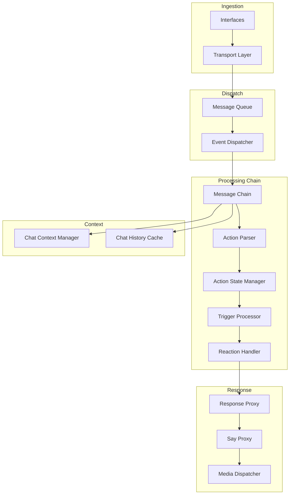
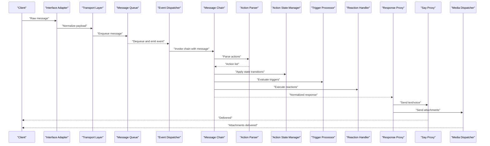
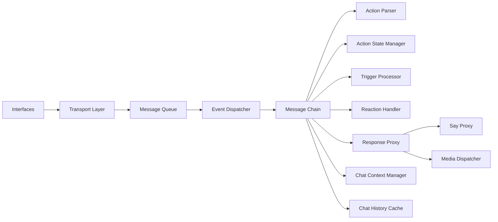
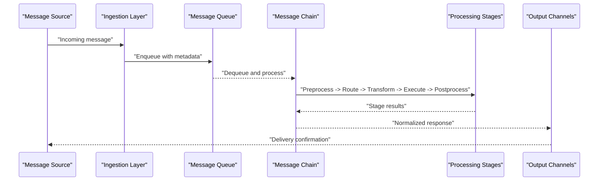

# Message Processing Pipeline

<cite>
**Referenced Files in This Document**
- [message_chain.py](file://core/message_chain.py)
- [message_queue.py](file://core/message_queue.py)
- [message_sender.py](file://core/message_sender.py)
- [agent_core.py](file://core/agent_core.py)
- [agent_router.py](file://core/agent_router.py)
- [transport_layer.py](file://core/transport_layer.py)
- [event_dispatcher.py](file://core/event_dispatcher.py)
- [rate_limit.py](file://core/rate_limit.py)
- [interfaces.py](file://core/interfaces.py)
- [interface_adapters.py](file://core/interface_adapters.py)
- [prompt_engine.py](file://core/prompt_engine.py)
- [response_proxy.py](file://core/response_proxy.py)
- [say_proxy.py](file://core/say_proxy.py)
- [media_dispatcher.py](file://core/media_dispatcher.py)
- [chat_context_manager.py](file://core/chat_context_manager.py)
- [chat_history_cache.py](file://core/chat_history_cache.py)
- [action_parser.py](file://core/action_parser.py)
- [action_state_manager.py](file://core/action_state_manager.py)
- [trigger_processor.py](file://core/trigger_processor.py)
- [reaction_handler.py](file://core/reaction_handler.py)
- [llm_failure_log.py](file://core/llm_failure_log.py)
- [logging_utils.py](file://core/logging_utils.py)
- [config.py](file://core/config.py)
- [config_manager.py](file://core/config_manager.py)
- [main.py](file://main.py)
</cite>

## Table of Contents
1. [Introduction](#introduction)
2. [Project Structure](#project-structure)
3. [Core Components](#core-components)
4. [Architecture Overview](#architecture-overview)
5. [Detailed Component Analysis](#detailed-component-analysis)
6. [Dependency Analysis](#dependency-analysis)
7. [Performance Considerations](#performance-considerations)
8. [Troubleshooting Guide](#troubleshooting-guide)
9. [Conclusion](#conclusion)
10. [Appendices](#appendices)

## Introduction
This document explains the Message Processing Pipeline that powers Synthetic Heart’s core message handling system. It covers how messages are ingested, routed, processed through a chain of stages, and transformed into responses. You will learn about the message chain architecture, preprocessing and post-processing steps, routing mechanisms, and configuration for filtering, rate limiting, and queue management. The guide also includes performance optimization techniques, debugging strategies, and troubleshooting common issues such as message loss or processing delays.

## Project Structure
The pipeline is implemented across several core modules:
- Ingestion and transport: interfaces and transport layer
- Queuing and dispatch: message queue and event dispatcher
- Processing chain: message chain with preprocessors, routers, processors, and postprocessors
- Response delivery: response proxy, say proxy, and media dispatcher
- Context and history: chat context manager and history cache
- Configuration and observability: config, logging, and failure logging

**Diagram sources**
- [interfaces.py](file://core/interfaces.py)
- [transport_layer.py](file://core/transport_layer.py)
- [message_queue.py](file://core/message_queue.py)
- [event_dispatcher.py](file://core/event_dispatcher.py)
- [message_chain.py](file://core/message_chain.py)
- [action_parser.py](file://core/action_parser.py)
- [action_state_manager.py](file://core/action_state_manager.py)
- [trigger_processor.py](file://core/trigger_processor.py)
- [reaction_handler.py](file://core/reaction_handler.py)
- [response_proxy.py](file://core/response_proxy.py)
- [say_proxy.py](file://core/say_proxy.py)
- [media_dispatcher.py](file://core/media_dispatcher.py)
- [chat_context_manager.py](file://core/chat_context_manager.py)
- [chat_history_cache.py](file://core/chat_history_cache.py)

**Section sources**
- [main.py](file://main.py)
- [interfaces.py](file://core/interfaces.py)
- [transport_layer.py](file://core/transport_layer.py)
- [message_queue.py](file://core/message_queue.py)
- [event_dispatcher.py](file://core/event_dispatcher.py)
- [message_chain.py](file://core/message_chain.py)

## Core Components
- Message Queue: Provides bounded queues with priority support, backpressure, and retry semantics. Used to decouple ingestion from processing and ensure resilience under load.
- Event Dispatcher: Routes events to registered handlers based on event types and channels. Supports fan-out and selective subscription.
- Message Chain: Orchestrates a sequence of processing stages (preprocess, route, transform, execute, postprocess). Each stage can mutate the message, short-circuit, or signal errors.
- Action Parser and State Manager: Parse actions embedded in messages and manage their lifecycle and state transitions.
- Trigger Processor and Reaction Handler: Evaluate triggers and reactions to extend behavior based on message content or context.
- Response Proxy and Say Proxy: Normalize and deliver responses to multiple output channels (text, voice, media).
- Media Dispatcher: Handles attachments and multimodal payloads.
- Chat Context Manager and History Cache: Maintain conversation context and efficient access to recent history.
- Rate Limiter: Enforces per-channel or per-user rate limits to protect downstream services.
- Config and Logging: Centralized configuration and structured logging for observability.

**Section sources**
- [message_queue.py](file://core/message_queue.py)
- [event_dispatcher.py](file://core/event_dispatcher.py)
- [message_chain.py](file://core/message_chain.py)
- [action_parser.py](file://core/action_parser.py)
- [action_state_manager.py](file://core/action_state_manager.py)
- [trigger_processor.py](file://core/trigger_processor.py)
- [reaction_handler.py](file://core/reaction_handler.py)
- [response_proxy.py](file://core/response_proxy.py)
- [say_proxy.py](file://core/say_proxy.py)
- [media_dispatcher.py](file://core/media_dispatcher.py)
- [chat_context_manager.py](file://core/chat_context_manager.py)
- [chat_history_cache.py](file://core/chat_history_cache.py)
- [rate_limit.py](file://core/rate_limit.py)
- [config.py](file://core/config.py)
- [config_manager.py](file://core/config_manager.py)
- [logging_utils.py](file://core/logging_utils.py)

## Architecture Overview
The pipeline follows an ingestion-dispatch-process-deliver pattern:
- Ingestion: Interfaces receive raw messages and normalize them via the transport layer.
- Dispatch: Messages are enqueued and dispatched to the processing chain by type/channel.
- Processing: A configurable chain transforms and executes actions, leveraging context and history.
- Delivery: Responses are normalized and sent to appropriate outputs, including text, voice, and media.

**Diagram sources**
- [interfaces.py](file://core/interfaces.py)
- [transport_layer.py](file://core/transport_layer.py)
- [message_queue.py](file://core/message_queue.py)
- [event_dispatcher.py](file://core/event_dispatcher.py)
- [message_chain.py](file://core/message_chain.py)
- [action_parser.py](file://core/action_parser.py)
- [action_state_manager.py](file://core/action_state_manager.py)
- [trigger_processor.py](file://core/trigger_processor.py)
- [reaction_handler.py](file://core/reaction_handler.py)
- [response_proxy.py](file://core/response_proxy.py)
- [say_proxy.py](file://core/say_proxy.py)
- [media_dispatcher.py](file://core/media_dispatcher.py)

## Detailed Component Analysis

### Message Queue
Responsibilities:
- Bounded queues with priority levels and channel isolation
- Backpressure handling and graceful rejection when full
- Retry policies with exponential backoff and dead-letter handling
- Metrics and logging for throughput and latency

Key behaviors:
- Enqueue operations validate payload schema and apply filters
- Dequeue operations respect priority and concurrency constraints
- Error paths log failures and trigger retries or alerts

Configuration options:
- Queue size limits per channel
- Priority weights and scheduling policy
- Retry counts and backoff multipliers
- Dead-letter thresholds and retention

**Section sources**
- [message_queue.py](file://core/message_queue.py)
- [rate_limit.py](file://core/rate_limit.py)
- [logging_utils.py](file://core/logging_utils.py)

### Event Dispatcher
Responsibilities:
- Register handlers for specific event types and channels
- Fan-out to multiple subscribers with ordered delivery guarantees where applicable
- Route messages based on metadata (type, source, target)

Key behaviors:
- Subscription model supports wildcard patterns
- Error isolation prevents one handler failure from affecting others
- Observability hooks for tracing and metrics

Configuration options:
- Handler registration and priority
- Channel routing rules
- Concurrency limits per handler

**Section sources**
- [event_dispatcher.py](file://core/event_dispatcher.py)
- [logging_utils.py](file://core/logging_utils.py)

### Message Chain
Responsibilities:
- Orchestrate a sequence of stages: preprocess, route, transform, execute, postprocess
- Allow short-circuiting and error propagation
- Inject context and history into each stage

Key behaviors:
- Preprocessors normalize and enrich messages
- Routers select processing pipelines based on message attributes
- Transformers modify payloads according to rules
- Executors run business logic and external calls
- Postprocessors format and prepare responses

Configuration options:
- Stage ordering and conditional execution
- Rule-based transformations and filters
- Error handling strategies (retry, fallback, abort)

**Section sources**
- [message_chain.py](file://core/message_chain.py)
- [action_parser.py](file://core/action_parser.py)
- [action_state_manager.py](file://core/action_state_manager.py)
- [trigger_processor.py](file://core/trigger_processor.py)
- [reaction_handler.py](file://core/reaction_handler.py)

### Action Parser and State Manager
Responsibilities:
- Parse action definitions embedded in messages
- Validate schemas and enforce security levels
- Manage state transitions and persistence

Key behaviors:
- Schema validation ensures consistent payloads
- Security checks prevent unsafe actions
- State transitions are idempotent and auditable

Configuration options:
- Allowed action types and scopes
- Security policies and sandboxing
- Persistence backend selection

**Section sources**
- [action_parser.py](file://core/action_parser.py)
- [action_state_manager.py](file://core/action_state_manager.py)

### Trigger Processor and Reaction Handler
Responsibilities:
- Evaluate triggers based on message content and context
- Execute reactions to extend behavior (e.g., notifications, side effects)

Key behaviors:
- Trigger conditions support complex expressions
- Reactions are executed with error isolation
- Results can influence subsequent chain stages

Configuration options:
- Trigger definitions and priorities
- Reaction mappings and parameters
- Fallback behaviors

**Section sources**
- [trigger_processor.py](file://core/trigger_processor.py)
- [reaction_handler.py](file://core/reaction_handler.py)

### Response Proxy and Say Proxy
Responsibilities:
- Normalize responses across different output formats
- Deliver text and voice responses to configured channels
- Handle retries and fallbacks for delivery failures

Key behaviors:
- Response normalization ensures compatibility
- Delivery strategies adapt to channel capabilities
- Failure logging and alerting for undelivered messages

Configuration options:
- Output channel preferences and priorities
- Retry policies and timeouts
- Fallback engines and templates

**Section sources**
- [response_proxy.py](file://core/response_proxy.py)
- [say_proxy.py](file://core/say_proxy.py)
- [logging_utils.py](file://core/logging_utils.py)

### Media Dispatcher
Responsibilities:
- Process and forward attachments and multimodal payloads
- Validate file types and sizes
- Optimize delivery based on channel constraints

Key behaviors:
- Attachment extraction and transformation
- Size and format validation
- Adaptive delivery strategies

Configuration options:
- Supported media types and limits
- Transformation rules
- Delivery backends

**Section sources**
- [media_dispatcher.py](file://core/media_dispatcher.py)

### Chat Context Manager and History Cache
Responsibilities:
- Maintain conversation context and session state
- Provide efficient access to recent history for processing stages

Key behaviors:
- Context enrichment with user and session metadata
- History caching reduces database load
- Consistency guarantees across concurrent accesses

Configuration options:
- Cache size and eviction policies
- Context injection rules
- Persistence settings

**Section sources**
- [chat_context_manager.py](file://core/chat_context_manager.py)
- [chat_history_cache.py](file://core/chat_history_cache.py)

### Prompt Engine
Responsibilities:
- Generate prompts for LLM interactions based on context and actions
- Apply safety and formatting rules

Key behaviors:
- Template rendering with variables
- Safety checks and redaction
- Performance optimizations via caching

Configuration options:
- Prompt templates and variables
- Safety policies
- Cache settings

**Section sources**
- [prompt_engine.py](file://core/prompt_engine.py)

### Agent Core and Router
Responsibilities:
- Coordinate agent lifecycle and message routing
- Select appropriate agents based on message attributes

Key behaviors:
- Agent discovery and registration
- Routing decisions based on intent and context
- Load balancing and failover

Configuration options:
- Agent definitions and capabilities
- Routing rules and priorities
- Health checks and recovery

**Section sources**
- [agent_core.py](file://core/agent_core.py)
- [agent_router.py](file://core/agent_router.py)

### Transport Layer and Interface Adapters
Responsibilities:
- Normalize incoming messages from various interfaces
- Ensure consistent payload structure and metadata

Key behaviors:
- Protocol-specific adapters handle differences
- Validation and sanitization of inputs
- Error mapping and reporting

Configuration options:
- Interface-specific settings
- Validation rules
- Error handling policies

**Section sources**
- [transport_layer.py](file://core/transport_layer.py)
- [interface_adapters.py](file://core/interface_adapters.py)
- [interfaces.py](file://core/interfaces.py)

## Dependency Analysis
The pipeline components have clear dependencies and separation of concerns:
- Ingestion depends on interface adapters and transport layer
- Dispatch depends on message queue and event dispatcher
- Processing chain depends on action parser, state manager, triggers, and reactions
- Response delivery depends on proxies and media dispatcher
- Context and history are shared resources used throughout

**Diagram sources**
- [interfaces.py](file://core/interfaces.py)
- [transport_layer.py](file://core/transport_layer.py)
- [message_queue.py](file://core/message_queue.py)
- [event_dispatcher.py](file://core/event_dispatcher.py)
- [message_chain.py](file://core/message_chain.py)
- [action_parser.py](file://core/action_parser.py)
- [action_state_manager.py](file://core/action_state_manager.py)
- [trigger_processor.py](file://core/trigger_processor.py)
- [reaction_handler.py](file://core/reaction_handler.py)
- [response_proxy.py](file://core/response_proxy.py)
- [say_proxy.py](file://core/say_proxy.py)
- [media_dispatcher.py](file://core/media_dispatcher.py)
- [chat_context_manager.py](file://core/chat_context_manager.py)
- [chat_history_cache.py](file://core/chat_history_cache.py)

**Section sources**
- [message_queue.py](file://core/message_queue.py)
- [event_dispatcher.py](file://core/event_dispatcher.py)
- [message_chain.py](file://core/message_chain.py)

## Performance Considerations
- Queue sizing: Tune queue capacities per channel to balance memory usage and throughput
- Concurrency: Adjust worker pools for CPU-bound vs I/O-bound stages
- Caching: Enable prompt and history caches to reduce latency
- Batch processing: Group small messages to minimize overhead
- Backpressure: Implement flow control to prevent overload
- Monitoring: Track latency percentiles and error rates for proactive tuning

[No sources needed since this section provides general guidance]

## Troubleshooting Guide
Common issues and resolutions:
- Message loss: Check queue health, dead-letter queues, and retry policies
- Processing delays: Monitor worker utilization, queue depths, and external service latency
- Delivery failures: Inspect response proxy logs, channel connectivity, and fallback configurations
- Context inconsistencies: Verify cache coherence and persistence settings
- Rate limit violations: Review limiter configuration and adjust quotas

Debugging strategies:
- Enable detailed logging for pipeline stages
- Trace message IDs through the entire flow
- Use synthetic test messages to isolate issues
- Monitor metrics dashboards for anomalies

**Section sources**
- [llm_failure_log.py](file://core/llm_failure_log.py)
- [logging_utils.py](file://core/logging_utils.py)
- [message_queue.py](file://core/message_queue.py)
- [response_proxy.py](file://core/response_proxy.py)

## Conclusion
The Message Processing Pipeline in Synthetic Heart provides a robust, extensible framework for handling diverse message types across multiple channels. By leveraging queues, dispatchers, and configurable chains, it ensures reliable processing, efficient resource usage, and flexible customization. Proper configuration, monitoring, and debugging practices enable optimal performance and maintainability.

[No sources needed since this section summarizes without analyzing specific files]

## Appendices

### Message Flow Sequence Diagram

**Diagram sources**
- [message_queue.py](file://core/message_queue.py)
- [message_chain.py](file://core/message_chain.py)

### Configuration Options Summary
- Queue Management:
  - Max queue size per channel
  - Priority weights and scheduling
  - Retry policies and backoff strategies
- Rate Limiting:
  - Per-user and per-channel limits
  - Burst allowances and cooldown periods
- Filtering:
  - Message type filters
  - Content-based rules
  - Channel-specific policies
- Processing Stages:
  - Stage ordering and conditions
  - Transformation rules and validators
  - Error handling and fallbacks

**Section sources**
- [config.py](file://core/config.py)
- [config_manager.py](file://core/config_manager.py)
- [rate_limit.py](file://core/rate_limit.py)
- [message_queue.py](file://core/message_queue.py)
- [message_chain.py](file://core/message_chain.py)