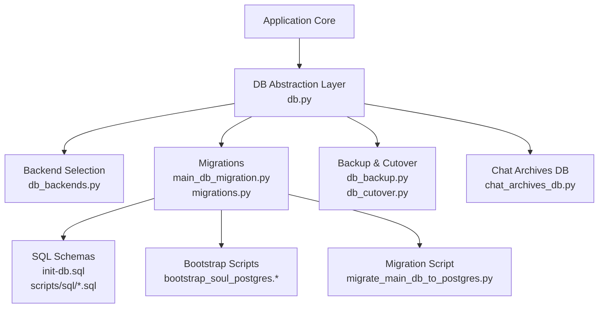
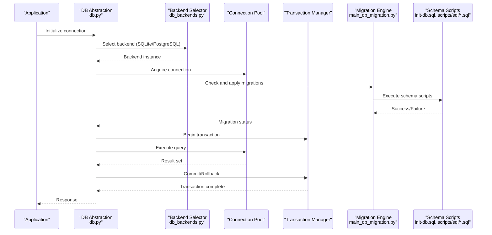
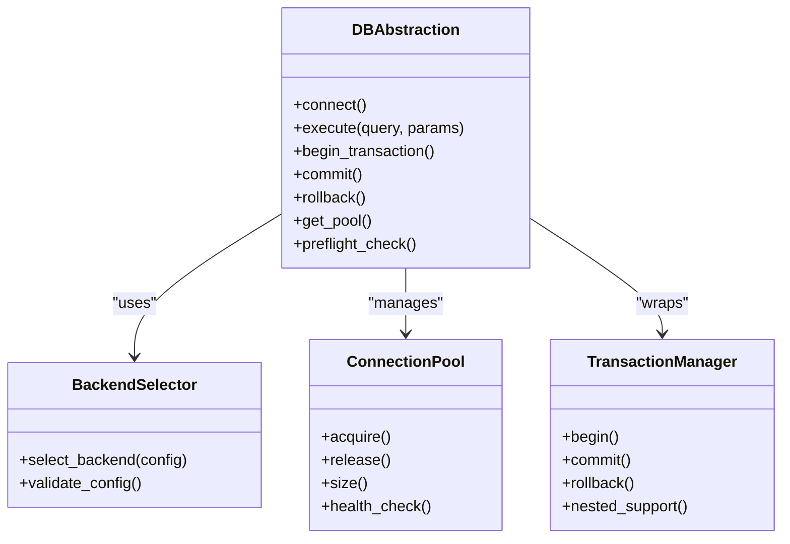
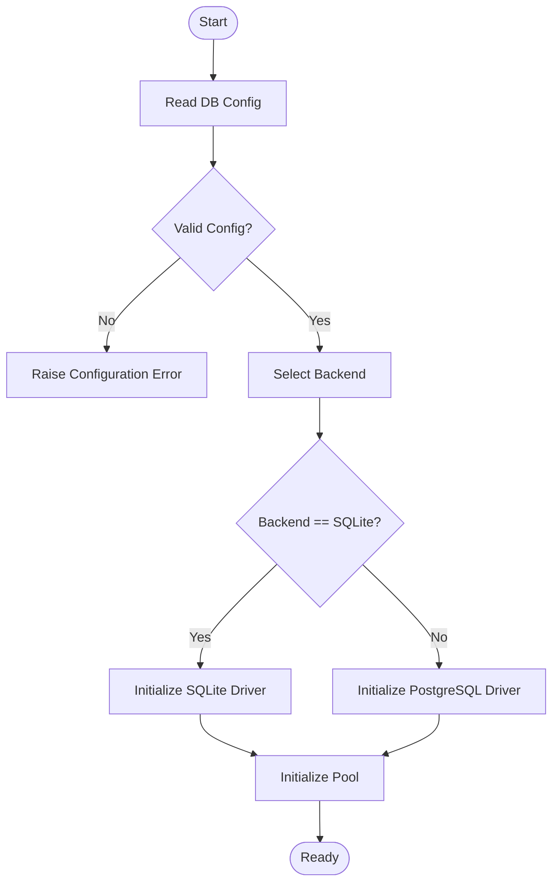
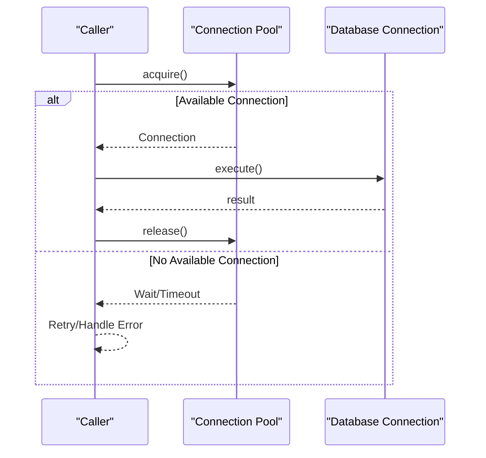
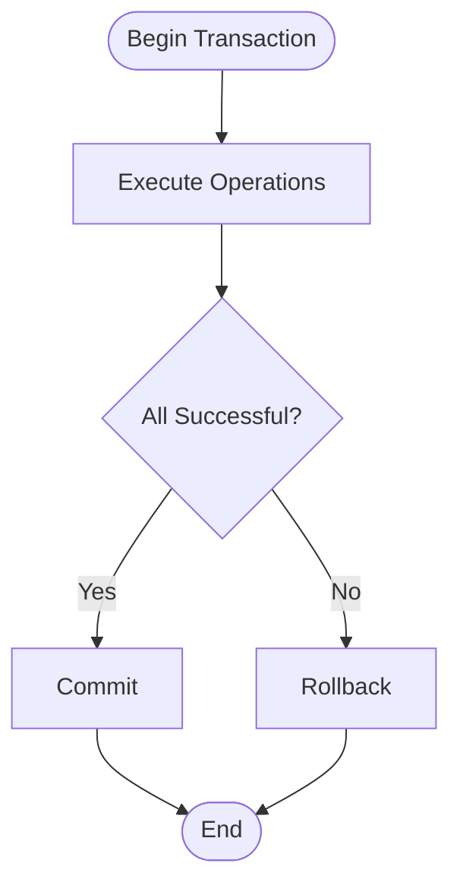
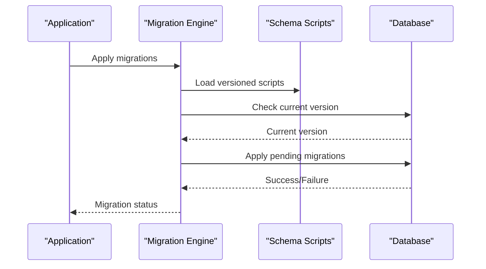
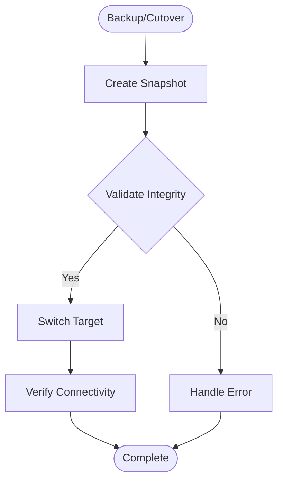
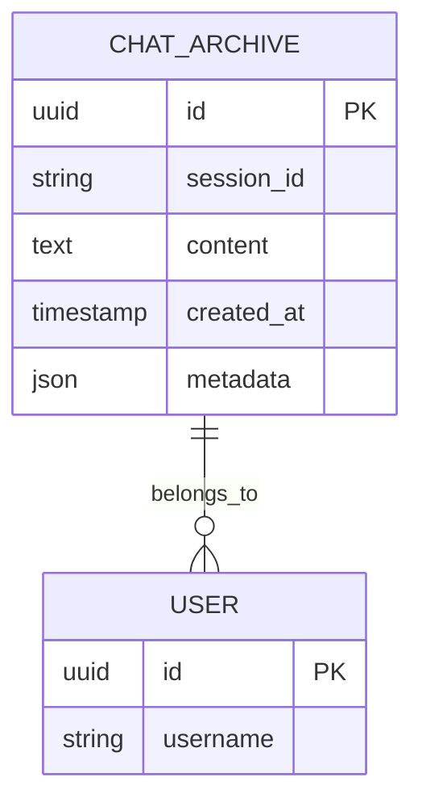
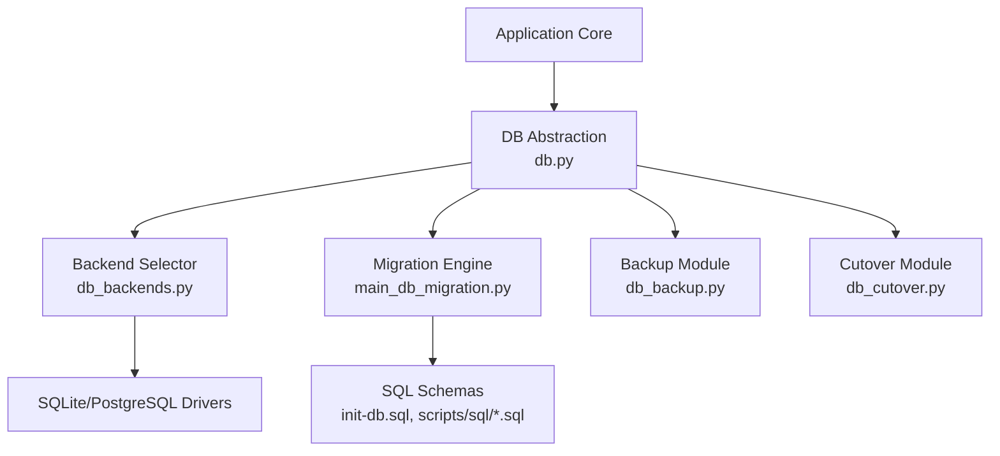

# State Persistence

<cite>
**Referenced Files in This Document**
- [db.py](file://core/db.py)
- [db_backends.py](file://core/db_backends.py)
- [db_backup.py](file://core/db_backup.py)
- [db_cutover.py](file://core/db_cutover.py)
- [main_db_migration.py](file://core/main_db_migration.py)
- [migrations.py](file://core/migrations.py)
- [chat_archives_db.py](file://core/chat_archives_db.py)
- [scripts/migrate_main_db_to_postgres.py](file://scripts/migrate_main_db_to_postgres.py)
- [scripts/bootstrap_soul_postgres.sh](file://scripts/bootstrap_soul_postgres.sh)
- [scripts/bootstrap_soul_postgres.ps1](file://scripts/bootstrap_soul_postgres.ps1)
- [init-db.sql](file://init-db.sql)
- [scripts/sql/app_main_postgres.sql](file://scripts/sql/app_main_postgres.sql)
- [scripts/sql/soul_memory_postgres.sql](file://scripts/sql/soul_memory_postgres.sql)
- [database_connection_management.rst](file://docs/database_connection_management.rst)
</cite>

## Table of Contents
1. [Introduction](#introduction)
2. [Project Structure](#project-structure)
3. [Core Components](#core-components)
4. [Architecture Overview](#architecture-overview)
5. [Detailed Component Analysis](#detailed-component-analysis)
6. [Dependency Analysis](#dependency-analysis)
7. [Performance Considerations](#performance-considerations)
8. [Troubleshooting Guide](#troubleshooting-guide)
9. [Conclusion](#conclusion)
10. [Appendices](#appendices)

## Introduction
This document describes the State Persistence layer responsible for data storage, retrieval, and migration across supported database backends (SQLite and PostgreSQL). It explains the database abstraction layer, connection pooling, transaction management, schema design, migration strategies, backup procedures, caching mechanisms, performance optimization, scalability considerations, configuration options, and common issues with guidance to resolve them.

## Project Structure
The persistence layer is implemented primarily under core/ with supporting scripts and SQL files:
- Abstraction and backend selection: db.py, db_backends.py
- Migration orchestration: main_db_migration.py, migrations.py
- Backup and cutover: db_backup.py, db_cutover.py
- Chat archives persistence: chat_archives_db.py
- Bootstrap and migration scripts: scripts/*
- Schema definitions: init-db.sql, scripts/sql/*.sql
- Documentation: docs/database_connection_management.rst

**Diagram sources**
- [db.py](file://core/db.py)
- [db_backends.py](file://core/db_backends.py)
- [main_db_migration.py](file://core/main_db_migration.py)
- [migrations.py](file://core/migrations.py)
- [db_backup.py](file://core/db_backup.py)
- [db_cutover.py](file://core/db_cutover.py)
- [chat_archives_db.py](file://core/chat_archives_db.py)
- [init-db.sql](file://init-db.sql)
- [scripts/sql/app_main_postgres.sql](file://scripts/sql/app_main_postgres.sql)
- [scripts/sql/soul_memory_postgres.sql](file://scripts/sql/soul_memory_postgres.sql)
- [scripts/bootstrap_soul_postgres.sh](file://scripts/bootstrap_soul_postgres.sh)
- [scripts/bootstrap_soul_postgres.ps1](file://scripts/bootstrap_soul_postgres.ps1)
- [scripts/migrate_main_db_to_postgres.py](file://scripts/migrate_main_db_to_postgres.py)

**Section sources**
- [db.py](file://core/db.py)
- [db_backends.py](file://core/db_backends.py)
- [main_db_migration.py](file://core/main_db_migration.py)
- [migrations.py](file://core/migrations.py)
- [db_backup.py](file://core/db_backup.py)
- [db_cutover.py](file://core/db_cutover.py)
- [chat_archives_db.py](file://core/chat_archives_db.py)
- [init-db.sql](file://init-db.sql)
- [scripts/sql/app_main_postgres.sql](file://scripts/sql/app_main_postgres.sql)
- [scripts/sql/soul_memory_postgres.sql](file://scripts/sql/soul_memory_postgres.sql)
- [scripts/bootstrap_soul_postgres.sh](file://scripts/bootstrap_soul_postgres.sh)
- [scripts/bootstrap_soul_postgres.ps1](file://scripts/bootstrap_soul_postgres.ps1)
- [scripts/migrate_main_db_to_postgres.py](file://scripts/migrate_main_db_to_postgres.py)
- [database_connection_management.rst](file://docs/database_connection_management.rst)

## Core Components
- Database Abstraction Layer: Provides a unified interface for executing queries, managing connections, and handling transactions regardless of backend.
- Backend Selection: Chooses SQLite or PostgreSQL based on configuration and environment.
- Connection Pooling: Manages pooled connections to reduce overhead and improve concurrency.
- Transaction Management: Ensures atomicity and consistency via explicit transaction boundaries.
- Migrations: Applies schema changes safely with version tracking and rollback support where applicable.
- Backup and Cutover: Creates consistent backups and supports switching between backends or versions with minimal downtime.
- Chat Archives Persistence: Dedicated module for storing and retrieving chat history efficiently.

Key responsibilities:
- Centralized configuration for connection settings
- Robust error handling and retry logic
- Observability hooks for logging and metrics
- Backward-compatible schema evolution

**Section sources**
- [db.py](file://core/db.py)
- [db_backends.py](file://core/db_backends.py)
- [migrations.py](file://core/migrations.py)
- [db_backup.py](file://core/db_backup.py)
- [db_cutover.py](file://core/db_cutover.py)
- [chat_archives_db.py](file://core/chat_archives_db.py)

## Architecture Overview
The persistence layer abstracts database operations behind a consistent API while delegating to specific backends. Migrations are applied at startup or on-demand, ensuring schema compatibility. Backup utilities provide point-in-time recovery and cross-backend migration paths.

**Diagram sources**
- [db.py](file://core/db.py)
- [db_backends.py](file://core/db_backends.py)
- [main_db_migration.py](file://core/main_db_migration.py)
- [migrations.py](file://core/migrations.py)
- [init-db.sql](file://init-db.sql)
- [scripts/sql/app_main_postgres.sql](file://scripts/sql/app_main_postgres.sql)
- [scripts/sql/soul_memory_postgres.sql](file://scripts/sql/soul_memory_postgres.sql)

## Detailed Component Analysis

### Database Abstraction Layer
- Unified interface for CRUD operations, raw SQL execution, and batch operations.
- Encapsulates backend-specific differences (dialects, drivers).
- Provides context managers for transactions and cursors.
- Integrates with connection pooling for efficient resource usage.

**Diagram sources**
- [db.py](file://core/db.py)
- [db_backends.py](file://core/db_backends.py)

**Section sources**
- [db.py](file://core/db.py)
- [db_backends.py](file://core/db_backends.py)

### Backend Selection and Support
- Supported backends: SQLite (development/local), PostgreSQL (production).
- Configuration-driven selection with validation of connection parameters.
- Backend-specific optimizations and driver bindings.

**Diagram sources**
- [db_backends.py](file://core/db_backends.py)

**Section sources**
- [db_backends.py](file://core/db_backends.py)

### Connection Pooling
- Pools connections to minimize overhead and handle concurrent requests.
- Configurable pool size, timeouts, and health checks.
- Automatic reconnection and graceful degradation on failures.

**Diagram sources**
- [db.py](file://core/db.py)

**Section sources**
- [db.py](file://core/db.py)

### Transaction Management
- Explicit transaction boundaries ensure data integrity.
- Nested transaction support where applicable.
- Automatic rollback on exceptions; commit on success.

**Diagram sources**
- [db.py](file://core/db.py)

**Section sources**
- [db.py](file://core/db.py)

### Migrations and Schema Design
- Versioned migrations with idempotent scripts.
- Pre-flight checks before applying changes.
- Separate schemas for application main database and soul memory.

**Diagram sources**
- [main_db_migration.py](file://core/main_db_migration.py)
- [migrations.py](file://core/migrations.py)
- [init-db.sql](file://init-db.sql)
- [scripts/sql/app_main_postgres.sql](file://scripts/sql/app_main_postgres.sql)
- [scripts/sql/soul_memory_postgres.sql](file://scripts/sql/soul_memory_postgres.sql)

**Section sources**
- [main_db_migration.py](file://core/main_db_migration.py)
- [migrations.py](file://core/migrations.py)
- [init-db.sql](file://init-db.sql)
- [scripts/sql/app_main_postgres.sql](file://scripts/sql/app_main_postgres.sql)
- [scripts/sql/soul_memory_postgres.sql](file://scripts/sql/soul_memory_postgres.sql)

### Backup and Cutover
- Automated backups with retention policies.
- Cross-backend migration support (e.g., SQLite to PostgreSQL).
- Zero-downtime cutover using dual-write or switch strategies.

**Diagram sources**
- [db_backup.py](file://core/db_backup.py)
- [db_cutover.py](file://core/db_cutover.py)

**Section sources**
- [db_backup.py](file://core/db_backup.py)
- [db_cutover.py](file://core/db_cutover.py)

### Chat Archives Persistence
- Optimized storage for chat history with indexing for fast retrieval.
- Archival strategies to manage growth and performance.
- Query patterns for filtering by time, user, and metadata.

**Diagram sources**
- [chat_archives_db.py](file://core/chat_archives_db.py)

**Section sources**
- [chat_archives_db.py](file://core/chat_archives_db.py)

## Dependency Analysis
The persistence layer depends on configuration, migration scripts, and backend drivers. It provides abstractions that decouple application code from database specifics.

**Diagram sources**
- [db.py](file://core/db.py)
- [db_backends.py](file://core/db_backends.py)
- [main_db_migration.py](file://core/main_db_migration.py)
- [db_backup.py](file://core/db_backup.py)
- [db_cutover.py](file://core/db_cutover.py)
- [init-db.sql](file://init-db.sql)
- [scripts/sql/app_main_postgres.sql](file://scripts/sql/app_main_postgres.sql)
- [scripts/sql/soul_memory_postgres.sql](file://scripts/sql/soul_memory_postgres.sql)

**Section sources**
- [db.py](file://core/db.py)
- [db_backends.py](file://core/db_backends.py)
- [main_db_migration.py](file://core/main_db_migration.py)
- [db_backup.py](file://core/db_backup.py)
- [db_cutover.py](file://core/db_cutover.py)
- [init-db.sql](file://init-db.sql)
- [scripts/sql/app_main_postgres.sql](file://scripts/sql/app_main_postgres.sql)
- [scripts/sql/soul_memory_postgres.sql](file://scripts/sql/soul_memory_postgres.sql)

## Performance Considerations
- Connection Pool Tuning: Adjust pool size based on workload and database capacity.
- Query Optimization: Use indexes, avoid N+1 queries, and leverage batch operations.
- Transaction Boundaries: Keep transactions short to reduce lock contention.
- Caching: Implement read-through caches for frequently accessed data.
- Monitoring: Track slow queries, connection usage, and error rates.

[No sources needed since this section provides general guidance]

## Troubleshooting Guide
Common issues and resolutions:
- Connection Timeouts: Increase timeout settings, verify network connectivity, and check database load.
- Data Corruption: Restore from latest backup, run integrity checks, and validate schema versions.
- Migration Failures: Review migration logs, ensure idempotency, and rollback to previous state if necessary.
- Pool Exhaustion: Monitor pool utilization, increase pool size, and optimize query durations.

**Section sources**
- [database_connection_management.rst](file://docs/database_connection_management.rst)

## Conclusion
The State Persistence layer provides a robust, scalable, and maintainable foundation for data storage and retrieval across SQLite and PostgreSQL. With comprehensive migration, backup, and cutover capabilities, it ensures reliability and flexibility for evolving application needs. Proper configuration, monitoring, and adherence to best practices will maximize performance and resilience.

[No sources needed since this section summarizes without analyzing specific files]

## Appendices

### Configuration Options
- Connection Settings: host, port, database name, credentials, pool size, timeouts.
- Backup Schedule: frequency, retention policy, destination path.
- Recovery Procedures: restore steps, verification checks, rollback plans.

**Section sources**
- [database_connection_management.rst](file://docs/database_connection_management.rst)

### Migration Strategies
- Versioned Scripts: Incremental changes with clear ordering.
- Idempotency: Safe re-execution without side effects.
- Dual-Write: Maintain compatibility during transitions.

**Section sources**
- [main_db_migration.py](file://core/main_db_migration.py)
- [migrations.py](file://core/migrations.py)
- [scripts/migrate_main_db_to_postgres.py](file://scripts/migrate_main_db_to_postgres.py)

### Backup Procedures
- Automated Snapshots: Scheduled backups with integrity validation.
- Retention Policies: Manage storage costs and compliance.
- Cross-Backend Migration: Seamless transition between SQLite and PostgreSQL.

**Section sources**
- [db_backup.py](file://core/db_backup.py)
- [db_cutover.py](file://core/db_cutover.py)
- [scripts/bootstrap_soul_postgres.sh](file://scripts/bootstrap_soul_postgres.sh)
- [scripts/bootstrap_soul_postgres.ps1](file://scripts/bootstrap_soul_postgres.ps1)