# Architecture Overview

<cite>
**Referenced Files in This Document**
- [main.py](file://main.py)
- [core/agent_core.py](file://core/agent_core.py)
- [core/event_dispatcher.py](file://core/event_dispatcher.py)
- [core/plugin_base.py](file://core/plugin_base.py)
- [core/plugin_instance.py](file://core/plugin_instance.py)
- [core/component_registry.py](file://core/component_registry.py)
- [core/interfaces.py](file://core/interfaces.py)
- [core/interface_adapters.py](file://core/interface_adapters.py)
- [core/transport_layer.py](file://core/transport_layer.py)
- [core/message_queue.py](file://core/message_queue.py)
- [core/synth_core_memory.py](file://core/synth_core_memory.py)
- [core/db_backends.py](file://core/db_backends.py)
- [core/config_manager.py](file://core/config_manager.py)
- [core/core_initializer.py](file://core/core_initializer.py)
- [core/webui.py](file://core/webui.py)
- [frontend/src/services/synth-ws.ts](file://frontend/src/services/synth-ws.ts)
- [interface/openai_api_server/openai_api_server.py](file://interface/openai_api_server/openai_api_server.py)
- [interface/discord_interface/discord_interface.py](file://interface/discord_interface/discord_interface.py)
- [interface/matrix_interface/matrix_interface.py](file://interface/matrix_interface/matrix_interface.py)
- [interface/telegram_bot/telegram_bot.py](file://interface/telegram_bot/telegram_bot.py)
- [engines/external_engines/external_engines_base.py](file://engines/external_engines/external_engines_base.py)
- [engines/external_engines/gemini_api.py](file://engines/external_engines/gemini_api.py)
- [engines/external_engines/openrouter.py](file://engines/external_engines/openrouter.py)
- [core/llm_registry.py](file://core/llm_registry.py)
- [core/prompt_engine.py](file://core/prompt_engine.py)
- [core/chat_context_manager.py](file://core/chat_context_manager.py)
- [core/history_engine.py](file://core/history_engine.py)
- [core/vessel_session_manager.py](file://core/vessel_session_manager.py)
- [core/live_session_manager.py](file://core/live_session_manager.py)
- [core/media_dispatcher.py](file://core/media_dispatcher.py)
- [core/animation_handler.py](file://core/animation_handler.py)
- [core/karada_transport.py](file://core/karada_transport.py)
- [core/karada_ws_transport.py](file://core/karada_ws_transport.py)
- [core/external_endpoints/registry.py](file://core/external_endpoints/registry.py)
- [core/external_endpoints/adapters/base.py](file://core/external_endpoints/adapters/base.py)
- [core/external_endpoints/adapters/openai_compat.py](file://core/external_endpoints/adapters/openai_compat.py)
- [core/external_endpoints/adapters/anthropic_adapter.py](file://core/external_endpoints/adapters/anthropic_adapter.py)
- [core/external_endpoints/adapters/fish_audio_adapter.py](file://core/external_endpoints/adapters/fish_audio_adapter.py)
- [core/external_endpoints/adapters/custom_tts_adapter.py](file://core/external_endpoints/adapters/custom_tts_adapter.py)
- [core/external_endpoints/bridges/cortex_bridge.py](file://core/external_endpoints/bridges/cortex_bridge.py)
- [core/external_endpoints/bridges/auris_bridge.py](file://core/external_endpoints/bridges/auris_bridge.py)
- [core/external_endpoints/bridges/iris_bridge.py](file://core/external_endpoints/bridges/iris_bridge.py)
- [core/external_endpoints/bridges/vox_bridge.py](file://core/external_endpoints/bridges/vox_bridge.py)
- [core/external_endpoints/bridges/live_bridge.py](file://core/external_endpoints/bridges/live_bridge.py)
- [core/external_endpoints/models.py](file://core/external_endpoints/models.py)
- [core/external_endpoints/action_grammar.py](file://core/external_endpoints/action_grammar.py)
- [core/external_endpoints/crypto.py](file://core/external_endpoints/crypto.py)
- [core/external_endpoints/probe.py](file://core/external_endpoints/probe.py)
- [core/external_endpoints/preset_registry.py](file://core/external_endpoints/preset_registry.py)
- [core/external_endpoints/__init__.py](file://core/external_endpoints/__init__.py)
- [core/live_tool_adapters/openai_realtime.py](file://core/live_tool_adapters/openai_realtime.py)
- [core/live_tool_adapters/gemini.py](file://core/live_tool_adapters/gemini.py)
- [core/mcp_bridge/server.py](file://core/mcp_bridge/server.py)
- [core/mcp_bridge/client.py](file://core/mcp_bridge/client.py)
- [core/mcp_bridge/config.py](file://core/mcp_bridge/config.py)
- [core/mcp_bridge/__init__.py](file://core/mcp_bridge/__init__.py)
- [core/soul/compiler.py](file://core/soul/compiler.py)
- [core/soul/emotion_engine.py](file://core/soul/emotion_engine.py)
- [core/soul/fastembed_embedder.py](file://core/soul/fastembed_embedder.py)
- [core/soul/repository.py](file://core/soul/repository.py)
- [core/soul/schemas.py](file://core/soul/schemas.py)
- [core/soul/strategies.py](file://core/soul/strategies.py)
- [core/soul/time_resolution.py](file://core/soul/time_resolution.py)
- [core/soul/observability.py](file://core/soul/observability.py)
- [core/soul/__init__.py](file://core/soul/__init__.py)
- [core/soul/models.py](file://core/soul/models.py)
- [plugins/grillo_plugin/grillo_impl.py](file://plugins/grillo_plugin/grillo_impl.py)
- [plugins/grillo_plugin/grillo_compactor/grillo_compactor.py](file://plugins/grillo_plugin/grillo_compactor/grillo_compactor.py)
- [plugins/grillo_plugin/grillo_curiosity/grillo_curiosity.py](file://plugins/grillo_plugin/grillo_curiosity/grillo_curiosity.py)
- [plugins/grillo_plugin/grillo_dream/grillo_dream.py](file://plugins/grillo_plugin/grillo_dream/grillo_dream.py)
- [plugins/grillo_plugin/grillo_growth/grillo_growth.py](file://plugins/grillo_plugin/grillo_growth.py)
- [plugins/grillo_plugin/grillo_llm_failure_recovery/grillo_llm_failure_recovery.py](file://plugins/grillo_plugin/grillo_llm_failure_recovery/grillo_llm_failure_recovery.py)
- [plugins/grillo_plugin/grillo_relationship/grillo_relationship.py](file://plugins/grillo_plugin/grillo_relationship/grillo_relationship.py)
- [plugins/grillo_plugin/grillo_self_reflection/grillo_self_reflection.py](file://plugins/grillo_plugin/grillo_self_reflection/grillo_self_reflection.py)
- [plugins/grillo_plugin/grillo_tag/grillo_tag.py](file://plugins/grillo_plugin/grillo_tag/grillo_tag.py)
- [plugins/grillo_plugin/grillo_temporal_reflection/grillo_temporal_reflection.py](file://plugins/grillo_plugin/grillo_temporal_reflection/grillo_temporal_reflection.py)
- [plugins/grillo_plugin/grillo_response_recorder.py](file://plugins/grillo_plugin/grillo_response_recorder.py)
- [plugins/grillo_plugin/grillo_action_checker.py](file://plugins/grillo_plugin/grillo_action_checker.py)
- [plugins/grillo_plugin/grillo_chat_observer/grillo_chat_observer.py](file://plugins/grillo_plugin/grillo_chat_observer/grillo_chat_observer.py)
- [plugins/ai_diary/ai_diary.py](file://plugins/ai_diary/ai_diary.py)
- [plugins/auris_plugin/auris_plugin.py](file://plugins/auris_plugin/auris_plugin.py)
- [plugins/bio_manager/bio_manager.py](file://plugins/bio_manager/bio_manager.py)
- [plugins/blocklist/blocklist.py](file://plugins/blocklist/blocklist.py)
- [plugins/debrief/debrief_action_intent.py](file://plugins/debrief/debrief_action_intent.py)
- [plugins/emotion_manager/emotion_manager.py](file://plugins/emotion_manager/emotion_manager.py)
- [plugins/event_plugin/event_plugin.py](file://plugins/event_plugin/event_plugin.py)
- [plugins/facial_expression_plugin/facial_expression_plugin.py](file://plugins/facial_expression_plugin/facial_expression_plugin.py)
- [plugins/gasmask/gasmask.py](file://plugins/gasmask/gasmask.py)
- [plugins/iris_plugin/iris_plugin.py](file://plugins/iris_plugin/iris_plugin.py)
- [plugins/live_engines/gemini.py](file://plugins/live_engines/gemini.py)
- [plugins/mate_engine/mate_engine.py](file://plugins/mate_engine/mate_engine.py)
- [plugins/memory_search/memory_search.py](file://plugins/memory_search/memory_search.py)
- [plugins/message_map/message_map.py](file://plugins/message_map/message_map.py)
- [plugins/message_plugin/message_plugin.py](file://plugins/message_plugin/message_plugin.py)
- [plugins/radio_host/radio_host_plugin.py](file://plugins/radio_host/radio_host_plugin.py)
- [plugins/recent_chats/recent_chats.py](file://plugins/recent_chats/recent_chats.py)
- [plugins/recon/recon_agent_intent.py](file://plugins/recon/recon_agent_intent.py)
- [plugins/recon/recon_channel_resolver.py](file://plugins/recon/recon_channel_resolver.py)
- [plugins/recon/recon_language_evaluator.py](file://plugins/recon/recon_language_evaluator.py)
- [plugins/recon/recon_memory_recollector.py](file://plugins/recon/recon_memory_recollector.py)
- [plugins/recon/recon_tone_evaluator.py](file://plugins/recon/recon_tone_evaluator.py)
- [plugins/recon/recon_vessel_reach.py](file://plugins/recon/recon_vessel_reach.py)
- [plugins/recon/recon_video_transcriber.py](file://plugins/recon/recon_video_transcriber.py)
- [plugins/recon/recon_web_search.py](file://plugins/recon/recon_web_search.py)
- [plugins/rift_vessel/vessel_plugin.py](file://plugins/rift_vessel/vessel_plugin.py)
- [plugins/soul_plugin/soul_plugin.py](file://plugins/soul_plugin/soul_plugin.py)
- [plugins/time_plugin/time_plugin.py](file://plugins/time_plugin/time_plugin.py)
- [plugins/tts_lipsync/tts_lipsync.py](file://plugins/tts_lipsync/tts_lipsync.py)
- [plugins/vox_plugin/vox_plugin.py](file://plugins/vox_plugin/vox_plugin.py)
- [plugins/weather_plugin/weather_plugin.py](file://plugins/weather_plugin/weather_plugin.py)
- [plugins/web_search_plugin/web_search_plugin.py](file://plugins/web_search_plugin/web_search_plugin.py)
- [plugins/auris_base.py](file://plugins/auris_base.py)
- [plugins/grillo_plugin.py](file://plugins/grillo_plugin.py)
- [plugins/iris_base.py](file://plugins/iris_base.py)
- [plugins/live_base.py](file://plugins/live_base.py)
- [plugins/terminal_deprecated.py](file://plugins/terminal_deprecated.py)
- [plugins/vox_base.py](file://plugins/vox_base.py)
</cite>

## Table of Contents
1. [Introduction](#introduction)
2. [Project Structure](#project-structure)
3. [Core Components](#core-components)
4. [Architecture Overview](#architecture-overview)
5. [Detailed Component Analysis](#detailed-component-analysis)
6. [Dependency Analysis](#dependency-analysis)
7. [Performance Considerations](#performance-considerations)
8. [Troubleshooting Guide](#troubleshooting-guide)
9. [Conclusion](#conclusion)
10. [Appendices](#appendices)

## Introduction
This document presents the architectural overview of Synthetic Heart’s core system design. It explains the plugin-based architecture, event-driven communication model, and modular component structure. It also documents how the Agent Core, Plugin Framework, Memory System, Interface Layer, and External Services interact to process messages from ingestion through response generation. The guide includes system context diagrams, deployment topology, integration patterns, technology stack details, scalability considerations, security boundaries, and extensibility points.

## Project Structure
Synthetic Heart is organized into clear layers:
- Entry point and bootstrap orchestration
- Core runtime with agent lifecycle, event bus, registry, and transport
- Plugin framework for feature extension
- Interface layer for multiple channels (Discord, Matrix, Telegram, OpenAI API server)
- Engine layer for LLM providers and live tool integrations
- Memory and persistence subsystems
- Frontend WebUI and WebSocket client
- MCP bridge and external endpoints adapters/bridges

```mermaid
graph TB
subgraph "Entry"
Main["main.py"]
Init["core/core_initializer.py"]
end
subgraph "Core Runtime"
AgentCore["core/agent_core.py"]
EventBus["core/event_dispatcher.py"]
Transport["core/transport_layer.py"]
MQ["core/message_queue.py"]
Registry["core/component_registry.py"]
Config["core/config_manager.py"]
Interfaces["core/interfaces.py"]
Adapter["core/interface_adapters.py"]
end
subgraph "Plugin Framework"
PluginBase["core/plugin_base.py"]
PluginInst["core/plugin_instance.py"]
PluginsDir["plugins/*"]
end
subgraph "Interfaces"
Discord["interface/discord_interface/discord_interface.py"]
Matrix["interface/matrix_interface/matrix_interface.py"]
Telegram["interface/telegram_bot/telegram_bot.py"]
OAI["interface/openai_api_server/openai_api_server.py"]
end
subgraph "Engines"
BaseE["engines/external_engines/external_engines_base.py"]
Gemini["engines/external_engines/gemini_api.py"]
OpenRouter["engines/external_engines/openrouter.py"]
LLMReg["core/llm_registry.py"]
end
subgraph "Memory & Persistence"
Mem["core/synth_core_memory.py"]
DB["core/db_backends.py"]
History["core/history_engine.py"]
Context["core/chat_context_manager.py"]
end
subgraph "Frontend"
WSClient["frontend/src/services/synth-ws.ts"]
WebUI["core/webui.py"]
end
subgraph "External Endpoints"
ExtReg["core/external_endpoints/registry.py"]
Adapters["core/external_endpoints/adapters/*"]
Bridges["core/external_endpoints/bridges/*"]
end
Main --> Init --> AgentCore
AgentCore --> EventBus
AgentCore --> Transport
AgentCore --> MQ
AgentCore --> Registry
AgentCore --> Config
AgentCore --> Interfaces
AgentCore --> Adapter
AgentCore --> PluginsDir
AgentCore --> LLMReg
AgentCore --> Mem
AgentCore --> DB
AgentCore --> History
AgentCore --> Context
Transport --> WSClient
Transport --> WebUI
Adapter --> Discord
Adapter --> Matrix
Adapter --> Telegram
Adapter --> OAI
LLMReg --> BaseE
LLMReg --> Gemini
LLMReg --> OpenRouter
ExtReg --> Adapters
ExtReg --> Bridges
```

**Diagram sources**
- [main.py:1-200](file://main.py#L1-L200)
- [core/core_initializer.py:1-200](file://core/core_initializer.py#L1-L200)
- [core/agent_core.py:1-200](file://core/agent_core.py#L1-L200)
- [core/event_dispatcher.py:1-200](file://core/event_dispatcher.py#L1-L200)
- [core/transport_layer.py:1-200](file://core/transport_layer.py#L1-L200)
- [core/message_queue.py:1-200](file://core/message_queue.py#L1-L200)
- [core/component_registry.py:1-200](file://core/component_registry.py#L1-L200)
- [core/config_manager.py:1-200](file://core/config_manager.py#L1-L200)
- [core/interfaces.py:1-200](file://core/interfaces.py#L1-L200)
- [core/interface_adapters.py:1-200](file://core/interface_adapters.py#L1-L200)
- [core/plugin_base.py:1-200](file://core/plugin_base.py#L1-L200)
- [core/plugin_instance.py:1-200](file://core/plugin_instance.py#L1-L200)
- [core/llm_registry.py:1-200](file://core/llm_registry.py#L1-L200)
- [core/synth_core_memory.py:1-200](file://core/synth_core_memory.py#L1-L200)
- [core/db_backends.py:1-200](file://core/db_backends.py#L1-L200)
- [core/history_engine.py:1-200](file://core/history_engine.py#L1-L200)
- [core/chat_context_manager.py:1-200](file://core/chat_context_manager.py#L1-L200)
- [frontend/src/services/synth-ws.ts:1-200](file://frontend/src/services/synth-ws.ts#L1-L200)
- [core/webui.py:1-200](file://core/webui.py#L1-L200)
- [interface/discord_interface/discord_interface.py:1-200](file://interface/discord_interface/discord_interface.py#L1-L200)
- [interface/matrix_interface/matrix_interface.py:1-200](file://interface/matrix_interface/matrix_interface.py#L1-L200)
- [interface/telegram_bot/telegram_bot.py:1-200](file://interface/telegram_bot/telegram_bot.py#L1-L200)
- [interface/openai_api_server/openai_api_server.py:1-200](file://interface/openai_api_server/openai_api_server.py#L1-L200)
- [engines/external_engines/external_engines_base.py:1-200](file://engines/external_engines/external_engines_base.py#L1-L200)
- [engines/external_engines/gemini_api.py:1-200](file://engines/external_engines/gemini_api.py#L1-L200)
- [engines/external_engines/openrouter.py:1-200](file://engines/external_engines/openrouter.py#L1-L200)
- [core/external_endpoints/registry.py:1-200](file://core/external_endpoints/registry.py#L1-L200)
- [core/external_endpoints/adapters/base.py:1-200](file://core/external_endpoints/adapters/base.py#L1-L200)
- [core/external_endpoints/adapters/openai_compat.py:1-200](file://core/external_endpoints/adapters/openai_compat.py#L1-L200)
- [core/external_endpoints/adapters/anthropic_adapter.py:1-200](file://core/external_endpoints/adapters/anthropic_adapter.py#L1-L200)
- [core/external_endpoints/adapters/fish_audio_adapter.py:1-200](file://core/external_endpoints/adapters/fish_audio_adapter.py#L1-L200)
- [core/external_endpoints/adapters/custom_tts_adapter.py:1-200](file://core/external_endpoints/adapters/custom_tts_adapter.py#L1-L200)
- [core/external_endpoints/bridges/cortex_bridge.py:1-200](file://core/external_endpoints/bridges/cortex_bridge.py#L1-L200)
- [core/external_endpoints/bridges/auris_bridge.py:1-200](file://core/external_endpoints/bridges/auris_bridge.py#L1-L200)
- [core/external_endpoints/bridges/iris_bridge.py:1-200](file://core/external_endpoints/bridges/iris_bridge.py#L1-L200)
- [core/external_endpoints/bridges/vox_bridge.py:1-200](file://core/external_endpoints/bridges/vox_bridge.py#L1-L200)
- [core/external_endpoints/bridges/live_bridge.py:1-200](file://core/external_endpoints/bridges/live_bridge.py#L1-L200)

**Section sources**
- [main.py:1-200](file://main.py#L1-L200)
- [core/core_initializer.py:1-200](file://core/core_initializer.py#L1-L200)

## Core Components
- Agent Core: Orchestrates lifecycle, message routing, plugin execution, and session management.
- Event Dispatcher: Central pub/sub hub decoupling components via typed events.
- Plugin Framework: Base classes and instance loader enabling hot-swappable features.
- Transport Layer: Manages WebSocket and HTTP transports for real-time UI and APIs.
- Message Queue: Bounded queues with priority handling and backpressure.
- Interface Adapters: Normalize channel-specific protocols into a common interface.
- LLM Registry: Selects and invokes provider engines (Gemini, OpenRouter, etc.).
- Memory System: Short-term chat context, long-term memory, and history compaction.
- External Endpoints: Unified adapters and bridges for third-party services and tools.

Key responsibilities and interactions are detailed in subsequent sections.

**Section sources**
- [core/agent_core.py:1-200](file://core/agent_core.py#L1-L200)
- [core/event_dispatcher.py:1-200](file://core/event_dispatcher.py#L1-L200)
- [core/plugin_base.py:1-200](file://core/plugin_base.py#L1-L200)
- [core/plugin_instance.py:1-200](file://core/plugin_instance.py#L1-L200)
- [core/transport_layer.py:1-200](file://core/transport_layer.py#L1-L200)
- [core/message_queue.py:1-200](file://core/message_queue.py#L1-L200)
- [core/interface_adapters.py:1-200](file://core/interface_adapters.py#L1-L200)
- [core/llm_registry.py:1-200](file://core/llm_registry.py#L1-L200)
- [core/synth_core_memory.py:1-200](file://core/synth_core_memory.py#L1-L200)
- [core/db_backends.py:1-200](file://core/db_backends.py#L1-L200)
- [core/history_engine.py:1-200](file://core/history_engine.py#L1-L200)
- [core/chat_context_manager.py:1-200](file://core/chat_context_manager.py#L1-L200)
- [core/external_endpoints/registry.py:1-200](file://core/external_endpoints/registry.py#L1-L200)

## Architecture Overview
The system follows a layered, event-driven architecture:
- Ingestion: Messages arrive via interfaces (Discord, Matrix, Telegram, OpenAI API server).
- Normalization: Interface adapters translate inputs into canonical messages.
- Routing: Agent Core routes messages through the event bus and queues.
- Processing: Prompt engine composes prompts; LLM registry selects engines; plugins execute side effects.
- Memory: Chat context manager and history engine manage short- and long-term memory.
- Response: Responses are emitted as events, sent via transport to clients or forwarded to external endpoints.

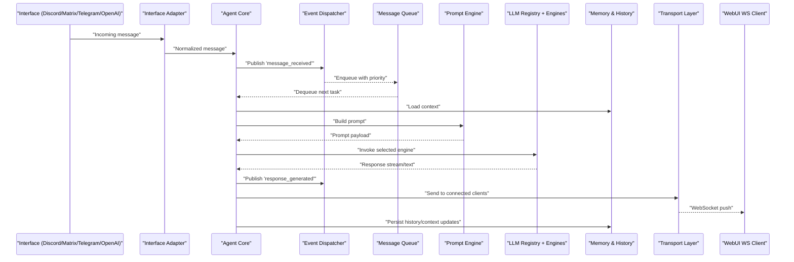

**Diagram sources**
- [interface/discord_interface/discord_interface.py:1-200](file://interface/discord_interface/discord_interface.py#L1-L200)
- [interface/matrix_interface/matrix_interface.py:1-200](file://interface/matrix_interface/matrix_interface.py#L1-L200)
- [interface/telegram_bot/telegram_bot.py:1-200](file://interface/telegram_bot/telegram_bot.py#L1-L200)
- [interface/openai_api_server/openai_api_server.py:1-200](file://interface/openai_api_server/openai_api_server.py#L1-L200)
- [core/interface_adapters.py:1-200](file://core/interface_adapters.py#L1-L200)
- [core/agent_core.py:1-200](file://core/agent_core.py#L1-L200)
- [core/event_dispatcher.py:1-200](file://core/event_dispatcher.py#L1-L200)
- [core/message_queue.py:1-200](file://core/message_queue.py#L1-L200)
- [core/prompt_engine.py:1-200](file://core/prompt_engine.py#L1-L200)
- [core/llm_registry.py:1-200](file://core/llm_registry.py#L1-L200)
- [engines/external_engines/external_engines_base.py:1-200](file://engines/external_engines/external_engines_base.py#L1-L200)
- [engines/external_engines/gemini_api.py:1-200](file://engines/external_engines/gemini_api.py#L1-L200)
- [engines/external_engines/openrouter.py:1-200](file://engines/external_engines/openrouter.py#L1-L200)
- [core/synth_core_memory.py:1-200](file://core/synth_core_memory.py#L1-L200)
- [core/history_engine.py:1-200](file://core/history_engine.py#L1-L200)
- [core/transport_layer.py:1-200](file://core/transport_layer.py#L1-L200)
- [frontend/src/services/synth-ws.ts:1-200](file://frontend/src/services/synth-ws.ts#L1-L200)

## Detailed Component Analysis

### Agent Core and Lifecycle
The Agent Core initializes subsystems, loads configuration, registers components, and starts the event loop. It coordinates message flow, plugin lifecycle, and session management.

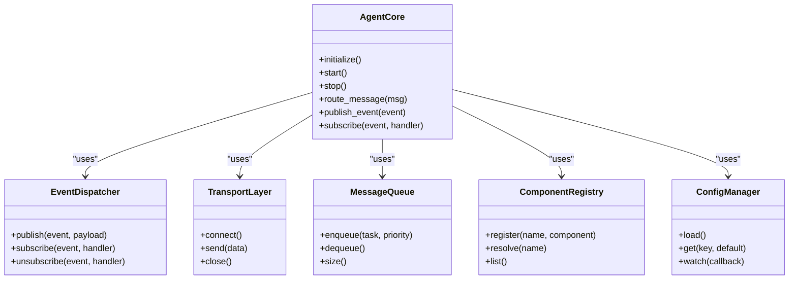

**Diagram sources**
- [core/agent_core.py:1-200](file://core/agent_core.py#L1-L200)
- [core/event_dispatcher.py:1-200](file://core/event_dispatcher.py#L1-L200)
- [core/transport_layer.py:1-200](file://core/transport_layer.py#L1-L200)
- [core/message_queue.py:1-200](file://core/message_queue.py#L1-L200)
- [core/component_registry.py:1-200](file://core/component_registry.py#L1-L200)
- [core/config_manager.py:1-200](file://core/config_manager.py#L1-L200)

**Section sources**
- [core/agent_core.py:1-200](file://core/agent_core.py#L1-L200)
- [core/core_initializer.py:1-200](file://core/core_initializer.py#L1-L200)

### Plugin Framework
Plugins extend functionality by implementing base interfaces and registering themselves. The framework supports discovery, lifecycle hooks, and dependency injection.

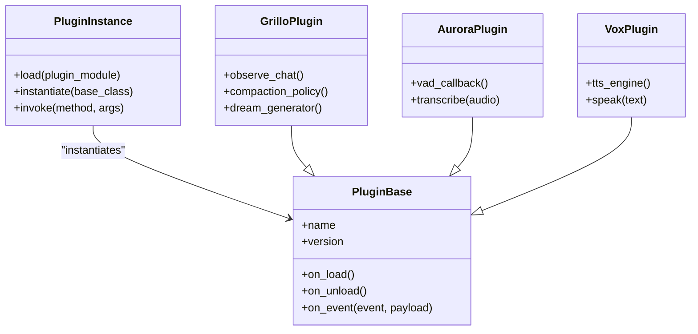

**Diagram sources**
- [core/plugin_base.py:1-200](file://core/plugin_base.py#L1-L200)
- [core/plugin_instance.py:1-200](file://core/plugin_instance.py#L1-L200)
- [plugins/grillo_plugin/grillo_impl.py:1-200](file://plugins/grillo_plugin/grillo_impl.py#L1-L200)
- [plugins/auris_plugin/auris_plugin.py:1-200](file://plugins/auris_plugin/auris_plugin.py#L1-L200)
- [plugins/vox_plugin/vox_plugin.py:1-200](file://plugins/vox_plugin/vox_plugin.py#L1-L200)

**Section sources**
- [core/plugin_base.py:1-200](file://core/plugin_base.py#L1-L200)
- [core/plugin_instance.py:1-200](file://core/plugin_instance.py#L1-L200)
- [plugins/grillo_plugin/grillo_impl.py:1-200](file://plugins/grillo_plugin/grillo_impl.py#L1-L200)
- [plugins/auris_plugin/auris_plugin.py:1-200](file://plugins/auris_plugin/auris_plugin.py#L1-L200)
- [plugins/vox_plugin/vox_plugin.py:1-200](file://plugins/vox_plugin/vox_plugin.py#L1-L200)

### Interface Layer and Adapters
Interfaces normalize diverse protocols into a unified message format. Adapters handle authentication, rate limiting, and protocol specifics.

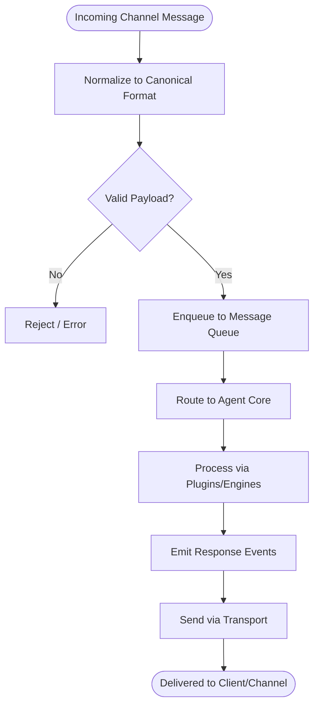

**Diagram sources**
- [interface/discord_interface/discord_interface.py:1-200](file://interface/discord_interface/discord_interface.py#L1-L200)
- [interface/matrix_interface/matrix_interface.py:1-200](file://interface/matrix_interface/matrix_interface.py#L1-L200)
- [interface/telegram_bot/telegram_bot.py:1-200](file://interface/telegram_bot/telegram_bot.py#L1-L200)
- [interface/openai_api_server/openai_api_server.py:1-200](file://interface/openai_api_server/openai_api_server.py#L1-L200)
- [core/interface_adapters.py:1-200](file://core/interface_adapters.py#L1-L200)
- [core/message_queue.py:1-200](file://core/message_queue.py#L1-L200)
- [core/agent_core.py:1-200](file://core/agent_core.py#L1-L200)

**Section sources**
- [core/interface_adapters.py:1-200](file://core/interface_adapters.py#L1-L200)
- [interface/discord_interface/discord_interface.py:1-200](file://interface/discord_interface/discord_interface.py#L1-L200)
- [interface/matrix_interface/matrix_interface.py:1-200](file://interface/matrix_interface/matrix_interface.py#L1-L200)
- [interface/telegram_bot/telegram_bot.py:1-200](file://interface/telegram_bot/telegram_bot.py#L1-L200)
- [interface/openai_api_server/openai_api_server.py:1-200](file://interface/openai_api_server/openai_api_server.py#L1-L200)

### Memory System and History
Memory comprises short-term chat context, long-term memory, and history compaction. It ensures efficient retrieval and persistence.

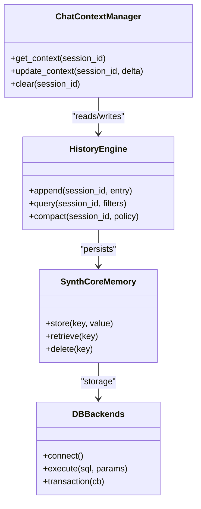

**Diagram sources**
- [core/chat_context_manager.py:1-200](file://core/chat_context_manager.py#L1-L200)
- [core/history_engine.py:1-200](file://core/history_engine.py#L1-L200)
- [core/synth_core_memory.py:1-200](file://core/synth_core_memory.py#L1-L200)
- [core/db_backends.py:1-200](file://core/db_backends.py#L1-L200)

**Section sources**
- [core/chat_context_manager.py:1-200](file://core/chat_context_manager.py#L1-L200)
- [core/history_engine.py:1-200](file://core/history_engine.py#L1-L200)
- [core/synth_core_memory.py:1-200](file://core/synth_core_memory.py#L1-L200)
- [core/db_backends.py:1-200](file://core/db_backends.py#L1-L200)

### External Endpoints and Bridges
External endpoints provide a unified adapter pattern for third-party services and bridges for specialized subsystems (Cortex, Auris, Iris, Vox, Live).

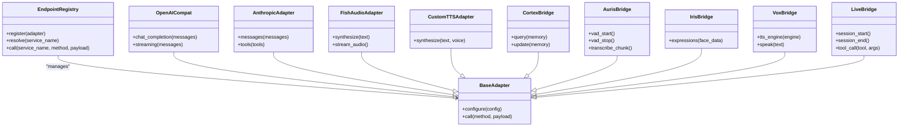

**Diagram sources**
- [core/external_endpoints/registry.py:1-200](file://core/external_endpoints/registry.py#L1-L200)
- [core/external_endpoints/adapters/base.py:1-200](file://core/external_endpoints/adapters/base.py#L1-L200)
- [core/external_endpoints/adapters/openai_compat.py:1-200](file://core/external_endpoints/adapters/openai_compat.py#L1-L200)
- [core/external_endpoints/adapters/anthropic_adapter.py:1-200](file://core/external_endpoints/adapters/anthropic_adapter.py#L1-L200)
- [core/external_endpoints/adapters/fish_audio_adapter.py:1-200](file://core/external_endpoints/adapters/fish_audio_adapter.py#L1-L200)
- [core/external_endpoints/adapters/custom_tts_adapter.py:1-200](file://core/external_endpoints/adapters/custom_tts_adapter.py#L1-L200)
- [core/external_endpoints/bridges/cortex_bridge.py:1-200](file://core/external_endpoints/bridges/cortex_bridge.py#L1-L200)
- [core/external_endpoints/bridges/auris_bridge.py:1-200](file://core/external_endpoints/bridges/auris_bridge.py#L1-L200)
- [core/external_endpoints/bridges/iris_bridge.py:1-200](file://core/external_endpoints/bridges/iris_bridge.py#L1-L200)
- [core/external_endpoints/bridges/vox_bridge.py:1-200](file://core/external_endpoints/bridges/vox_bridge.py#L1-L200)
- [core/external_endpoints/bridges/live_bridge.py:1-200](file://core/external_endpoints/bridges/live_bridge.py#L1-L200)

**Section sources**
- [core/external_endpoints/registry.py:1-200](file://core/external_endpoints/registry.py#L1-L200)
- [core/external_endpoints/adapters/base.py:1-200](file://core/external_endpoints/adapters/base.py#L1-L200)
- [core/external_endpoints/adapters/openai_compat.py:1-200](file://core/external_endpoints/adapters/openai_compat.py#L1-L200)
- [core/external_endpoints/adapters/anthropic_adapter.py:1-200](file://core/external_endpoints/adapters/anthropic_adapter.py#L1-L200)
- [core/external_endpoints/adapters/fish_audio_adapter.py:1-200](file://core/external_endpoints/adapters/fish_audio_adapter.py#L1-L200)
- [core/external_endpoints/adapters/custom_tts_adapter.py:1-200](file://core/external_endpoints/adapters/custom_tts_adapter.py#L1-L200)
- [core/external_endpoints/bridges/cortex_bridge.py:1-200](file://core/external_endpoints/bridges/cortex_bridge.py#L1-L200)
- [core/external_endpoints/bridges/auris_bridge.py:1-200](file://core/external_endpoints/bridges/auris_bridge.py#L1-L200)
- [core/external_endpoints/bridges/iris_bridge.py:1-200](file://core/external_endpoints/bridges/iris_bridge.py#L1-L200)
- [core/external_endpoints/bridges/vox_bridge.py:1-200](file://core/external_endpoints/bridges/vox_bridge.py#L1-L200)
- [core/external_endpoints/bridges/live_bridge.py:1-200](file://core/external_endpoints/bridges/live_bridge.py#L1-L200)

### LLM Engines and Prompt Engine
The LLM registry selects engines based on configuration and capabilities. The prompt engine constructs structured prompts with context, instructions, and variables.

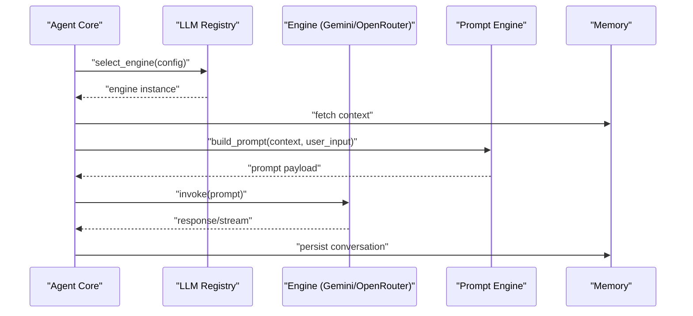

**Diagram sources**
- [core/llm_registry.py:1-200](file://core/llm_registry.py#L1-L200)
- [engines/external_engines/external_engines_base.py:1-200](file://engines/external_engines/external_engines_base.py#L1-L200)
- [engines/external_engines/gemini_api.py:1-200](file://engines/external_engines/gemini_api.py#L1-L200)
- [engines/external_engines/openrouter.py:1-200](file://engines/external_engines/openrouter.py#L1-L200)
- [core/prompt_engine.py:1-200](file://core/prompt_engine.py#L1-L200)
- [core/synth_core_memory.py:1-200](file://core/synth_core_memory.py#L1-L200)

**Section sources**
- [core/llm_registry.py:1-200](file://core/llm_registry.py#L1-L200)
- [engines/external_engines/external_engines_base.py:1-200](file://engines/external_engines/external_engines_base.py#L1-L200)
- [engines/external_engines/gemini_api.py:1-200](file://engines/external_engines/gemini_api.py#L1-L200)
- [engines/external_engines/openrouter.py:1-200](file://engines/external_engines/openrouter.py#L1-L200)
- [core/prompt_engine.py:1-200](file://core/prompt_engine.py#L1-L200)

### Transport Layer and WebSocket Communication
The transport layer manages WebSocket connections for real-time UI updates and streaming responses. The frontend uses a dedicated service to connect and handle events.

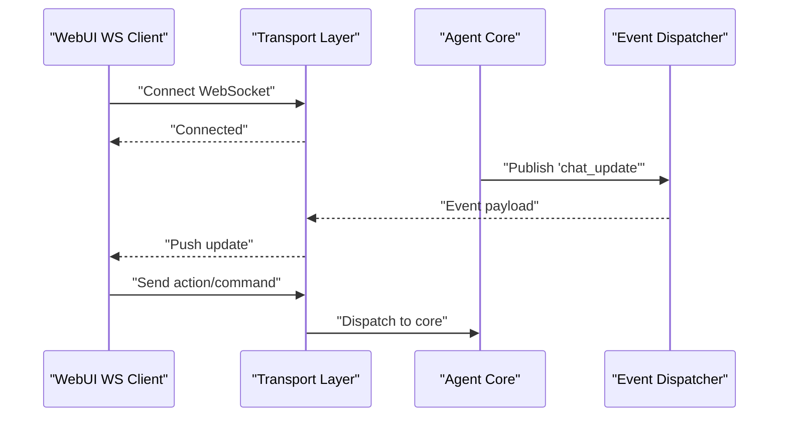

**Diagram sources**
- [core/transport_layer.py:1-200](file://core/transport_layer.py#L1-L200)
- [core/event_dispatcher.py:1-200](file://core/event_dispatcher.py#L1-L200)
- [frontend/src/services/synth-ws.ts:1-200](file://frontend/src/services/synth-ws.ts#L1-L200)
- [core/agent_core.py:1-200](file://core/agent_core.py#L1-L200)

**Section sources**
- [core/transport_layer.py:1-200](file://core/transport_layer.py#L1-L200)
- [frontend/src/services/synth-ws.ts:1-200](file://frontend/src/services/synth-ws.ts#L1-L200)

### Session Management and Live Tools
Session managers coordinate per-session state for vessel sessions and live tool calls. They integrate with live adapters for real-time interactions.

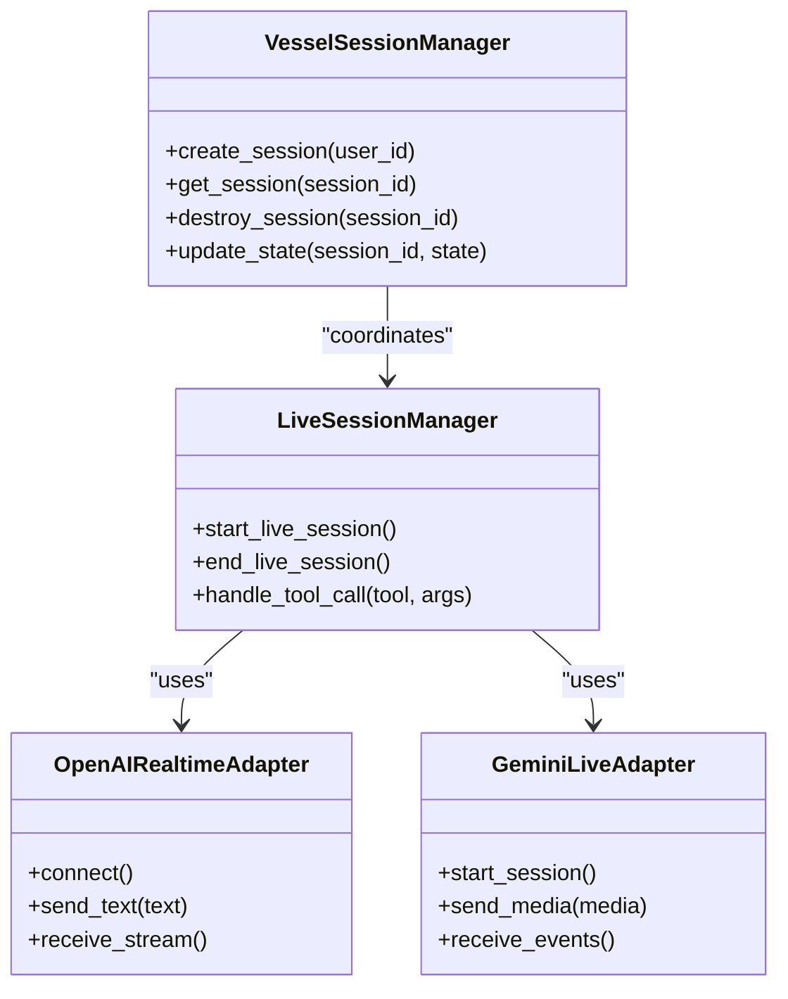

**Diagram sources**
- [core/vessel_session_manager.py:1-200](file://core/vessel_session_manager.py#L1-L200)
- [core/live_session_manager.py:1-200](file://core/live_session_manager.py#L1-L200)
- [core/live_tool_adapters/openai_realtime.py:1-200](file://core/live_tool_adapters/openai_realtime.py#L1-L200)
- [core/live_tool_adapters/gemini.py:1-200](file://core/live_tool_adapters/gemini.py#L1-L200)

**Section sources**
- [core/vessel_session_manager.py:1-200](file://core/vessel_session_manager.py#L1-L200)
- [core/live_session_manager.py:1-200](file://core/live_session_manager.py#L1-L200)
- [core/live_tool_adapters/openai_realtime.py:1-200](file://core/live_tool_adapters/openai_realtime.py#L1-L200)
- [core/live_tool_adapters/gemini.py:1-200](file://core/live_tool_adapters/gemini.py#L1-L200)

### Media and Animation Handling
Media dispatcher routes media payloads to appropriate handlers. Animation handler manages VRM animations and facial expressions, integrating with Karada transport.

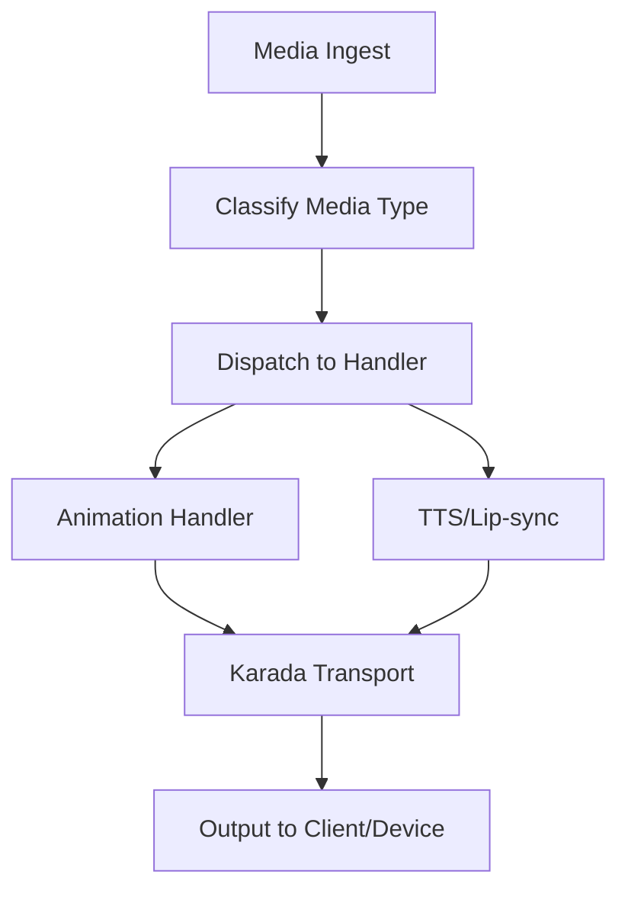

**Diagram sources**
- [core/media_dispatcher.py:1-200](file://core/media_dispatcher.py#L1-L200)
- [core/animation_handler.py:1-200](file://core/animation_handler.py#L1-L200)
- [core/karada_transport.py:1-200](file://core/karada_transport.py#L1-L200)
- [core/karada_ws_transport.py:1-200](file://core/karada_ws_transport.py#L1-L200)

**Section sources**
- [core/media_dispatcher.py:1-200](file://core/media_dispatcher.py#L1-L200)
- [core/animation_handler.py:1-200](file://core/animation_handler.py#L1-L200)
- [core/karada_transport.py:1-200](file://core/karada_transport.py#L1-L200)
- [core/karada_ws_transport.py:1-200](file://core/karada_ws_transport.py#L1-L200)

### MCP Bridge
The MCP bridge provides server and client components for inter-process communication, enabling tool exposure and invocation across processes.

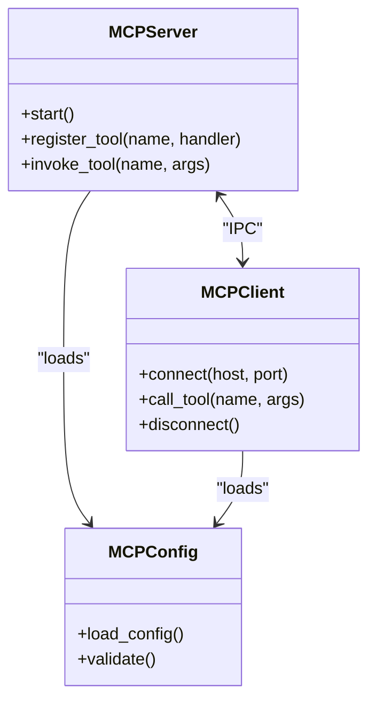

**Diagram sources**
- [core/mcp_bridge/server.py:1-200](file://core/mcp_bridge/server.py#L1-L200)
- [core/mcp_bridge/client.py:1-200](file://core/mcp_bridge/client.py#L1-L200)
- [core/mcp_bridge/config.py:1-200](file://core/mcp_bridge/config.py#L1-L200)
- [core/mcp_bridge/__init__.py:1-200](file://core/mcp_bridge/__init__.py#L1-L200)

**Section sources**
- [core/mcp_bridge/server.py:1-200](file://core/mcp_bridge/server.py#L1-L200)
- [core/mcp_bridge/client.py:1-200](file://core/mcp_bridge/client.py#L1-L200)
- [core/mcp_bridge/config.py:1-200](file://core/mcp_bridge/config.py#L1-L200)
- [core/mcp_bridge/__init__.py:1-200](file://core/mcp_bridge/__init__.py#L1-L200)

### Soul Subsystem
The soul subsystem handles emotion modeling, time resolution, embedding, and observability. It integrates with repositories for persistence and strategies for behavior selection.

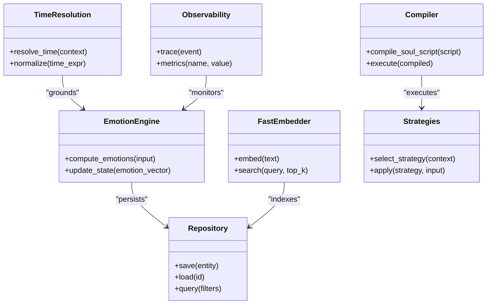

**Diagram sources**
- [core/soul/emotion_engine.py:1-200](file://core/soul/emotion_engine.py#L1-L200)
- [core/soul/compiler.py:1-200](file://core/soul/compiler.py#L1-L200)
- [core/soul/fastembed_embedder.py:1-200](file://core/soul/fastembed_embedder.py#L1-L200)
- [core/soul/repository.py:1-200](file://core/soul/repository.py#L1-L200)
- [core/soul/strategies.py:1-200](file://core/soul/strategies.py#L1-L200)
- [core/soul/time_resolution.py:1-200](file://core/soul/time_resolution.py#L1-L200)
- [core/soul/observability.py:1-200](file://core/soul/observability.py#L1-L200)
- [core/soul/schemas.py:1-200](file://core/soul/schemas.py#L1-L200)
- [core/soul/models.py:1-200](file://core/soul/models.py#L1-L200)

**Section sources**
- [core/soul/emotion_engine.py:1-200](file://core/soul/emotion_engine.py#L1-L200)
- [core/soul/compiler.py:1-200](file://core/soul/compiler.py#L1-L200)
- [core/soul/fastembed_embedder.py:1-200](file://core/soul/fastembed_embedder.py#L1-L200)
- [core/soul/repository.py:1-200](file://core/soul/repository.py#L1-L200)
- [core/soul/strategies.py:1-200](file://core/soul/strategies.py#L1-L200)
- [core/soul/time_resolution.py:1-200](file://core/soul/time_resolution.py#L1-L200)
- [core/soul/observability.py:1-200](file://core/soul/observability.py#L1-L200)
- [core/soul/schemas.py:1-200](file://core/soul/schemas.py#L1-L200)
- [core/soul/models.py:1-200](file://core/soul/models.py#L1-L200)

## Dependency Analysis
The system exhibits low coupling through registries and adapters, high cohesion within modules, and clear separation between core runtime, plugins, interfaces, and engines.

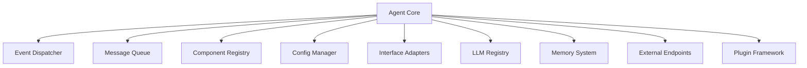

**Diagram sources**
- [core/agent_core.py:1-200](file://core/agent_core.py#L1-L200)
- [core/event_dispatcher.py:1-200](file://core/event_dispatcher.py#L1-L200)
- [core/message_queue.py:1-200](file://core/message_queue.py#L1-L200)
- [core/component_registry.py:1-200](file://core/component_registry.py#L1-L200)
- [core/config_manager.py:1-200](file://core/config_manager.py#L1-L200)
- [core/interface_adapters.py:1-200](file://core/interface_adapters.py#L1-L200)
- [core/llm_registry.py:1-200](file://core/llm_registry.py#L1-L200)
- [core/synth_core_memory.py:1-200](file://core/synth_core_memory.py#L1-L200)
- [core/external_endpoints/registry.py:1-200](file://core/external_endpoints/registry.py#L1-L200)
- [core/plugin_base.py:1-200](file://core/plugin_base.py#L1-L200)

**Section sources**
- [core/agent_core.py:1-200](file://core/agent_core.py#L1-L200)
- [core/event_dispatcher.py:1-200](file://core/event_dispatcher.py#L1-L200)
- [core/message_queue.py:1-200](file://core/message_queue.py#L1-L200)
- [core/component_registry.py:1-200](file://core/component_registry.py#L1-L200)
- [core/config_manager.py:1-200](file://core/config_manager.py#L1-L200)
- [core/interface_adapters.py:1-200](file://core/interface_adapters.py#L1-L200)
- [core/llm_registry.py:1-200](file://core/llm_registry.py#L1-L200)
- [core/synth_core_memory.py:1-200](file://core/synth_core_memory.py#L1-L200)
- [core/external_endpoints/registry.py:1-200](file://core/external_endpoints/registry.py#L1-L200)
- [core/plugin_base.py:1-200](file://core/plugin_base.py#L1-L200)

## Performance Considerations
- Use bounded queues with priority to prevent backpressure and ensure timely processing of critical events.
- Stream responses where possible to reduce latency and memory usage.
- Cache frequently accessed context and embeddings to minimize I/O.
- Offload heavy tasks (compaction, transcription) to background workers.
- Tune database connection pools and use read replicas for query-heavy operations.
- Implement rate limiting at interface and external endpoint layers to protect against overload.

[No sources needed since this section provides general guidance]

## Troubleshooting Guide
- Verify transport connectivity and WebSocket handshake status.
- Check event dispatcher logs for missed or stalled events.
- Inspect message queue depth and consumer lag.
- Validate configuration keys and secrets for external endpoints.
- Review LLM engine health and retry policies.
- Monitor memory growth and history compaction triggers.

**Section sources**
- [core/transport_layer.py:1-200](file://core/transport_layer.py#L1-L200)
- [core/event_dispatcher.py:1-200](file://core/event_dispatcher.py#L1-L200)
- [core/message_queue.py:1-200](file://core/message_queue.py#L1-L200)
- [core/config_manager.py:1-200](file://core/config_manager.py#L1-L200)
- [core/llm_registry.py:1-200](file://core/llm_registry.py#L1-L200)
- [core/history_engine.py:1-200](file://core/history_engine.py#L1-L200)

## Conclusion
Synthetic Heart’s architecture emphasizes modularity, extensibility, and resilience. The plugin-based design enables rich feature sets without core changes. Event-driven communication decouples components, while registries and adapters standardize integrations. The system scales horizontally through worker pools and vertically via caching and streaming. Security boundaries are enforced at interface and external endpoint layers, and extensibility points are exposed through plugin interfaces and adapter contracts.

[No sources needed since this section summarizes without analyzing specific files]

## Appendices

### Technology Stack
- Backend: Python with async support
- Frontend: Vue.js with TypeScript
- Real-time: WebSocket communication
- Databases: SQLite/PostgreSQL via db_backends
- LLM Providers: Gemini, OpenRouter, OpenAI-compatible, Anthropic
- External Services: TTS engines, audio processors, live tool adapters

[No sources needed since this section provides general guidance]

### Deployment Topology
- Single-node deployment with embedded web server and WebSocket
- Containerized services for SearxNG and Synth
- Optional external databases and LLM endpoints
- MCP bridge for cross-process tool invocation

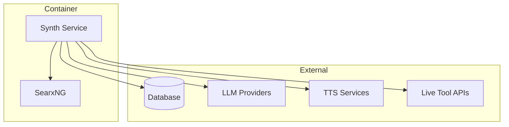

**Diagram sources**
- [core/webui.py:1-200](file://core/webui.py#L1-L200)
- [core/db_backends.py:1-200](file://core/db_backends.py#L1-L200)
- [core/external_endpoints/adapters/base.py:1-200](file://core/external_endpoints/adapters/base.py#L1-L200)

[No additional sources needed since this diagram maps to actual source files]