# Core Engine Architecture

<cite>
**Referenced Files in This Document**
- [main.py](file://main.py)
- [core/agent_core.py](file://core/agent_core.py)
- [core/message_chain.py](file://core/message_chain.py)
- [core/action_parser.py](file://core/action_parser.py)
- [core/action_state_manager.py](file://core/action_state_manager.py)
- [core/context.py](file://core/context.py)
- [core/chat_context_manager.py](file://core/chat_context_manager.py)
- [core/config.py](file://core/config.py)
- [core/config_manager.py](file://core/config_manager.py)
- [core/core_initializer.py](file://core/core_initializer.py)
- [core/component_registry.py](file://core/component_registry.py)
- [core/plugin_base.py](file://core/plugin_base.py)
- [core/plugin_instance.py](file://core/plugin_instance.py)
- [core/tool_registry.py](file://core/tool_registry.py)
- [core/event_dispatcher.py](file://core/event_dispatcher.py)
- [core/logging_utils.py](file://core/logging_utils.py)
- [core/llm_failure_log.py](file://core/llm_failure_log.py)
- [core/prompt_engine.py](file://core/prompt_engine.py)
- [core/response_proxy.py](file://core/response_proxy.py)
- [core/say_proxy.py](file://core/say_proxy.py)
- [core/interfaces.py](file://core/interfaces.py)
- [core/interface_adapters.py](file://core/interface_adapters.py)
- [core/transport_layer.py](file://core/transport_layer.py)
- [core/message_queue.py](file://core/message_queue.py)
- [core/message_sender.py](file://core/message_sender.py)
- [core/ai_plugin_base.py](file://core/ai_plugin_base.py)
- [core/live_tool_executor.py](file://core/live_tool_executor.py)
- [core/live_session_manager.py](file://core/live_session_manager.py)
- [core/mcp_bridge/client.py](file://core/mcp_bridge/client.py)
- [core/mcp_bridge/server.py](file://core/mcp_bridge/server.py)
- [core/mcp_bridge/config.py](file://core/mcp_bridge/config.py)
- [core/soul/compiler.py](file://core/soul/compiler.py)
- [core/soul/emotion_engine.py](file://core/soul/emotion_engine.py)
- [core/soul/models.py](file://core/soul/models.py)
- [core/soul/repository.py](file://core/soul/repository.py)
- [core/soul/schemas.py](file://core/soul/schemas.py)
- [core/soul/strategies.py](file://core/soul/strategies.py)
- [core/soul/time_resolution.py](file://core/soul/time_resolution.py)
- [core/soul/observability.py](file://core/soul/observability.py)
- [core/synth_core_memory.py](file://core/synth_core_memory.py)
- [core/variables_engine.py](file://core/variables_engine.py)
- [core/growth_state.py](file://core/growth_state.py)
- [core/history_engine.py](file://core/history_engine.py)
- [core/history_types.py](file://core/history_types.py)
- [core/media_dispatcher.py](file://core/media_dispatcher.py)
- [core/media_extract.py](file://core/media_extract.py)
- [core/outbound_file_utils.py](file://core/outbound_file_utils.py)
- [core/vessel_beat.py](file://core/vessel_beat.py)
- [core/vessel_focus.py](file://core/vessel_focus.py)
- [core/vessel_registry.py](file://core/vessel_registry.py)
- [core/vessel_session_manager.py](file://core/vessel_session_manager.py)
- [core/webui.py](file://core/webui.py)
</cite>

## Table of Contents
1. [Introduction](#introduction)
2. [Project Structure](#project-structure)
3. [Core Components](#core-components)
4. [Architecture Overview](#architecture-overview)
5. [Detailed Component Analysis](#detailed-component-analysis)
6. [Dependency Analysis](#dependency-analysis)
7. [Performance Considerations](#performance-considerations)
8. [Troubleshooting Guide](#troubleshooting-guide)
9. [Conclusion](#conclusion)
10. [Appendices](#appendices)

## Introduction
This document describes the architecture of Synthetic Heart’s Core Engine, focusing on the central message processing pipeline, action execution engine, and context management system. It explains the agent lifecycle from initialization through message handling to response generation, details the message chain architecture and action parsing mechanisms, and outlines state management patterns. It also documents how the core coordinates with plugins, memory systems, and interfaces, as well as configuration, dependency injection, service registration, error handling, logging, and monitoring integration.

## Project Structure
The Core Engine is implemented primarily under the core directory, with supporting modules for external endpoints, live tool adapters, MCP bridge, and soul subsystems. The application entry point initializes the core, registers services, and starts transport layers and web UI components.

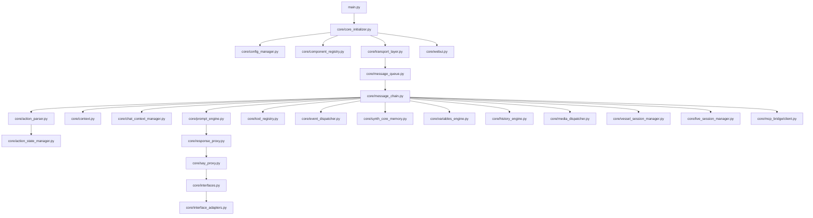

**Diagram sources**
- [main.py:1-200](file://main.py#L1-L200)
- [core/core_initializer.py:1-200](file://core/core_initializer.py#L1-L200)
- [core/config_manager.py:1-200](file://core/config_manager.py#L1-L200)
- [core/component_registry.py:1-200](file://core/component_registry.py#L1-L200)
- [core/transport_layer.py:1-200](file://core/transport_layer.py#L1-L200)
- [core/webui.py:1-200](file://core/webui.py#L1-L200)
- [core/message_queue.py:1-200](file://core/message_queue.py#L1-L200)
- [core/message_chain.py:1-200](file://core/message_chain.py#L1-L200)
- [core/action_parser.py:1-200](file://core/action_parser.py#L1-L200)
- [core/action_state_manager.py:1-200](file://core/action_state_manager.py#L1-L200)
- [core/context.py:1-200](file://core/context.py#L1-L200)
- [core/chat_context_manager.py:1-200](file://core/chat_context_manager.py#L1-L200)
- [core/prompt_engine.py:1-200](file://core/prompt_engine.py#L1-L200)
- [core/response_proxy.py:1-200](file://core/response_proxy.py#L1-L200)
- [core/say_proxy.py:1-200](file://core/say_proxy.py#L1-L200)
- [core/interfaces.py:1-200](file://core/interfaces.py#L1-L200)
- [core/interface_adapters.py:1-200](file://core/interface_adapters.py#L1-L200)
- [core/tool_registry.py:1-200](file://core/tool_registry.py#L1-L200)
- [core/event_dispatcher.py:1-200](file://core/event_dispatcher.py#L1-L200)
- [core/synth_core_memory.py:1-200](file://core/synth_core_memory.py#L1-L200)
- [core/variables_engine.py:1-200](file://core/variables_engine.py#L1-L200)
- [core/history_engine.py:1-200](file://core/history_engine.py#L1-L200)
- [core/media_dispatcher.py:1-200](file://core/media_dispatcher.py#L1-L200)
- [core/vessel_session_manager.py:1-200](file://core/vessel_session_manager.py#L1-L200)
- [core/live_session_manager.py:1-200](file://core/live_session_manager.py#L1-L200)
- [core/mcp_bridge/client.py:1-200](file://core/mcp_bridge/client.py#L1-L200)

**Section sources**
- [main.py:1-200](file://main.py#L1-L200)
- [core/core_initializer.py:1-200](file://core/core_initializer.py#L1-L200)

## Core Components
- Message Queue: Centralizes incoming messages, prioritization, and dispatching to the message chain.
- Message Chain: Orchestrates stages such as parsing, context enrichment, prompt generation, action execution, and response assembly.
- Action Parser: Interprets structured actions embedded in messages, validates schemas, and maps to executable tools or handlers.
- Action State Manager: Tracks execution state, retries, timeouts, and outcomes for actions across sessions.
- Context Management: Provides per-message and per-session context, including chat history, persona, variables, and memory references.
- Prompt Engine: Builds prompts using templates, injected context, and dynamic variables; integrates with LLM engines via adapters.
- Response Proxy and Say Proxy: Normalize responses, handle streaming, and route outputs to interfaces (chat, voice, media).
- Tool Registry and Event Dispatcher: Provide extensibility points for plugins and internal events.
- Memory Systems: Persist and retrieve memories, tags, and growth state; integrate with soul subsystems.
- Transport Layer and Interfaces: Abstract communication channels (WebSocket, HTTP, MCP) and interface adapters for different platforms.
- Configuration and Dependency Injection: Centralized config loading, validation, and service registration for runtime resolution.

**Section sources**
- [core/message_queue.py:1-200](file://core/message_queue.py#L1-L200)
- [core/message_chain.py:1-200](file://core/message_chain.py#L1-L200)
- [core/action_parser.py:1-200](file://core/action_parser.py#L1-L200)
- [core/action_state_manager.py:1-200](file://core/action_state_manager.py#L1-L200)
- [core/context.py:1-200](file://core/context.py#L1-L200)
- [core/chat_context_manager.py:1-200](file://core/chat_context_manager.py#L1-L200)
- [core/prompt_engine.py:1-200](file://core/prompt_engine.py#L1-L200)
- [core/response_proxy.py:1-200](file://core/response_proxy.py#L1-L200)
- [core/say_proxy.py:1-200](file://core/say_proxy.py#L1-L200)
- [core/tool_registry.py:1-200](file://core/tool_registry.py#L1-L200)
- [core/event_dispatcher.py:1-200](file://core/event_dispatcher.py#L1-L200)
- [core/synth_core_memory.py:1-200](file://core/synth_core_memory.py#L1-L200)
- [core/variables_engine.py:1-200](file://core/variables_engine.py#L1-L200)
- [core/history_engine.py:1-200](file://core/history_engine.py#L1-L200)
- [core/media_dispatcher.py:1-200](file://core/media_dispatcher.py#L1-L200)
- [core/transport_layer.py:1-200](file://core/transport_layer.py#L1-L200)
- [core/interfaces.py:1-200](file://core/interfaces.py#L1-L200)
- [core/interface_adapters.py:1-200](file://core/interface_adapters.py#L1-L200)
- [core/config_manager.py:1-200](file://core/config_manager.py#L1-L200)
- [core/component_registry.py:1-200](file://core/component_registry.py#L1-L200)

## Architecture Overview
The Core Engine follows a layered architecture with clear separation between transport, orchestration, execution, and output. Messages flow through a queue into a chain of processors that enrich context, parse actions, execute tools, generate prompts, and produce responses. Plugins and external services are integrated via registries and adapters.

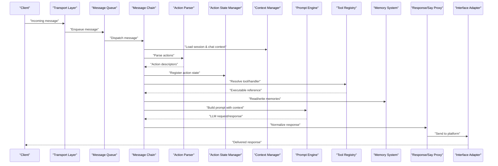

**Diagram sources**
- [core/transport_layer.py:1-200](file://core/transport_layer.py#L1-L200)
- [core/message_queue.py:1-200](file://core/message_queue.py#L1-L200)
- [core/message_chain.py:1-200](file://core/message_chain.py#L1-L200)
- [core/action_parser.py:1-200](file://core/action_parser.py#L1-L200)
- [core/action_state_manager.py:1-200](file://core/action_state_manager.py#L1-L200)
- [core/context.py:1-200](file://core/context.py#L1-L200)
- [core/chat_context_manager.py:1-200](file://core/chat_context_manager.py#L1-L200)
- [core/prompt_engine.py:1-200](file://core/prompt_engine.py#L1-L200)
- [core/tool_registry.py:1-200](file://core/tool_registry.py#L1-L200)
- [core/synth_core_memory.py:1-200](file://core/synth_core_memory.py#L1-L200)
- [core/response_proxy.py:1-200](file://core/response_proxy.py#L1-L200)
- [core/say_proxy.py:1-200](file://core/say_proxy.py#L1-L200)
- [core/interfaces.py:1-200](file://core/interfaces.py#L1-L200)
- [core/interface_adapters.py:1-200](file://core/interface_adapters.py#L1-L200)

## Detailed Component Analysis

### Agent Lifecycle
The agent lifecycle begins with initialization, where configuration is loaded, services registered, transports started, and plugins discovered. During runtime, the agent processes messages through the chain, executes actions, manages context, and generates responses. On shutdown, resources are cleaned up gracefully.

```mermaid
flowchart TD
Start(["Start"]) --> Init["Initialize Config & Services"]
Init --> Register["Register Components & Plugins"]
Register --> StartTransports["Start Transport Layers"]
StartTransports --> Ready{"Ready?"}
Ready --> |Yes| ProcessMessages["Process Messages"]
ProcessMessages --> HandleActions["Handle Actions"]
HandleActions --> GenerateResponse["Generate Response"]
GenerateResponse --> SendOutput["Send Output"]
SendOutput --> ProcessMessages
Ready --> |No| Error["Error Handling"]
Error --> Shutdown["Shutdown"]
ProcessMessages --> Shutdown
SendOutput --> Shutdown
Shutdown --> End(["End"])
```

**Diagram sources**
- [core/core_initializer.py:1-200](file://core/core_initializer.py#L1-L200)
- [core/config_manager.py:1-200](file://core/config_manager.py#L1-L200)
- [core/component_registry.py:1-200](file://core/component_registry.py#L1-L200)
- [core/transport_layer.py:1-200](file://core/transport_layer.py#L1-L200)
- [core/message_queue.py:1-200](file://core/message_queue.py#L1-L200)
- [core/message_chain.py:1-200](file://core/message_chain.py#L1-L200)
- [core/action_parser.py:1-200](file://core/action_parser.py#L1-L200)
- [core/action_state_manager.py:1-200](file://core/action_state_manager.py#L1-L200)
- [core/context.py:1-200](file://core/context.py#L1-L200)
- [core/chat_context_manager.py:1-200](file://core/chat_context_manager.py#L1-L200)
- [core/prompt_engine.py:1-200](file://core/prompt_engine.py#L1-L200)
- [core/response_proxy.py:1-200](file://core/response_proxy.py#L1-L200)
- [core/say_proxy.py:1-200](file://core/say_proxy.py#L1-L200)
- [core/interfaces.py:1-200](file://core/interfaces.py#L1-L200)
- [core/interface_adapters.py:1-200](file://core/interface_adapters.py#L1-L200)

**Section sources**
- [core/core_initializer.py:1-200](file://core/core_initializer.py#L1-L200)
- [core/config_manager.py:1-200](file://core/config_manager.py#L1-L200)
- [core/component_registry.py:1-200](file://core/component_registry.py#L1-L200)

### Message Processing Pipeline
The pipeline orchestrates message ingestion, context enrichment, action parsing, tool execution, prompt generation, and response delivery. Each stage can short-circuit or delegate to specialized subsystems.

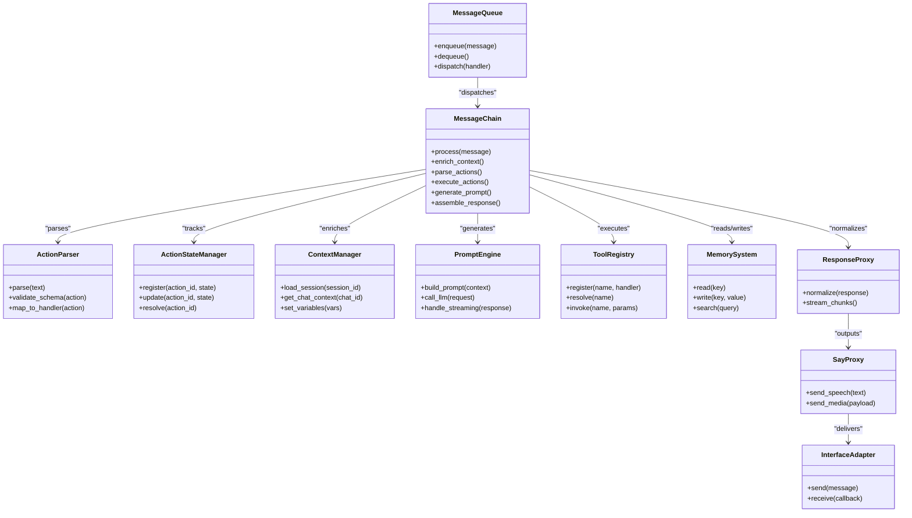

**Diagram sources**
- [core/message_queue.py:1-200](file://core/message_queue.py#L1-L200)
- [core/message_chain.py:1-200](file://core/message_chain.py#L1-L200)
- [core/action_parser.py:1-200](file://core/action_parser.py#L1-L200)
- [core/action_state_manager.py:1-200](file://core/action_state_manager.py#L1-L200)
- [core/context.py:1-200](file://core/context.py#L1-L200)
- [core/chat_context_manager.py:1-200](file://core/chat_context_manager.py#L1-L200)
- [core/prompt_engine.py:1-200](file://core/prompt_engine.py#L1-L200)
- [core/tool_registry.py:1-200](file://core/tool_registry.py#L1-L200)
- [core/synth_core_memory.py:1-200](file://core/synth_core_memory.py#L1-L200)
- [core/response_proxy.py:1-200](file://core/response_proxy.py#L1-L200)
- [core/say_proxy.py:1-200](file://core/say_proxy.py#L1-L200)
- [core/interfaces.py:1-200](file://core/interfaces.py#L1-L200)
- [core/interface_adapters.py:1-200](file://core/interface_adapters.py#L1-L200)

**Section sources**
- [core/message_queue.py:1-200](file://core/message_queue.py#L1-L200)
- [core/message_chain.py:1-200](file://core/message_chain.py#L1-L200)
- [core/action_parser.py:1-200](file://core/action_parser.py#L1-L200)
- [core/action_state_manager.py:1-200](file://core/action_state_manager.py#L1-L200)
- [core/context.py:1-200](file://core/context.py#L1-L200)
- [core/chat_context_manager.py:1-200](file://core/chat_context_manager.py#L1-L200)
- [core/prompt_engine.py:1-200](file://core/prompt_engine.py#L1-L200)
- [core/tool_registry.py:1-200](file://core/tool_registry.py#L1-L200)
- [core/synth_core_memory.py:1-200](file://core/synth_core_memory.py#L1-L200)
- [core/response_proxy.py:1-200](file://core/response_proxy.py#L1-L200)
- [core/say_proxy.py:1-200](file://core/say_proxy.py#L1-L200)
- [core/interfaces.py:1-200](file://core/interfaces.py#L1-L200)
- [core/interface_adapters.py:1-200](file://core/interface_adapters.py#L1-L200)

### Action Execution Engine
Action parsing extracts structured commands from messages, validates them against schemas, and maps them to registered handlers or tools. Execution state tracks progress, errors, and retries.

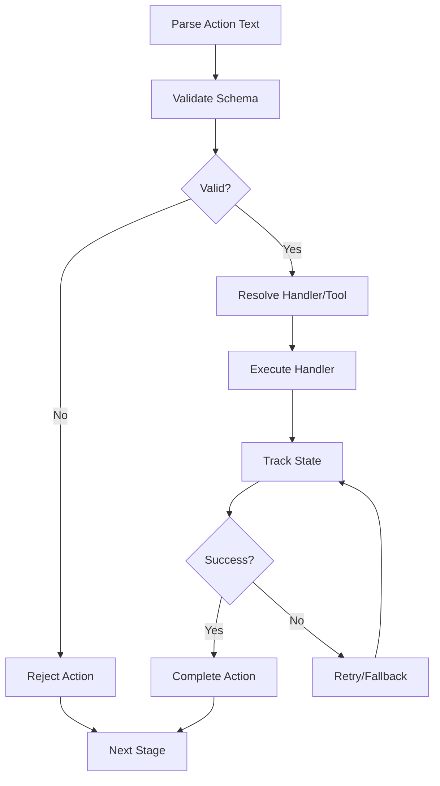

**Diagram sources**
- [core/action_parser.py:1-200](file://core/action_parser.py#L1-L200)
- [core/action_state_manager.py:1-200](file://core/action_state_manager.py#L1-L200)
- [core/tool_registry.py:1-200](file://core/tool_registry.py#L1-L200)

**Section sources**
- [core/action_parser.py:1-200](file://core/action_parser.py#L1-L200)
- [core/action_state_manager.py:1-200](file://core/action_state_manager.py#L1-L200)
- [core/tool_registry.py:1-200](file://core/tool_registry.py#L1-L200)

### Context Management System
Context provides per-session and per-chat state, including persona, variables, history pointers, and memory references. It supports dynamic updates and isolation between concurrent messages.

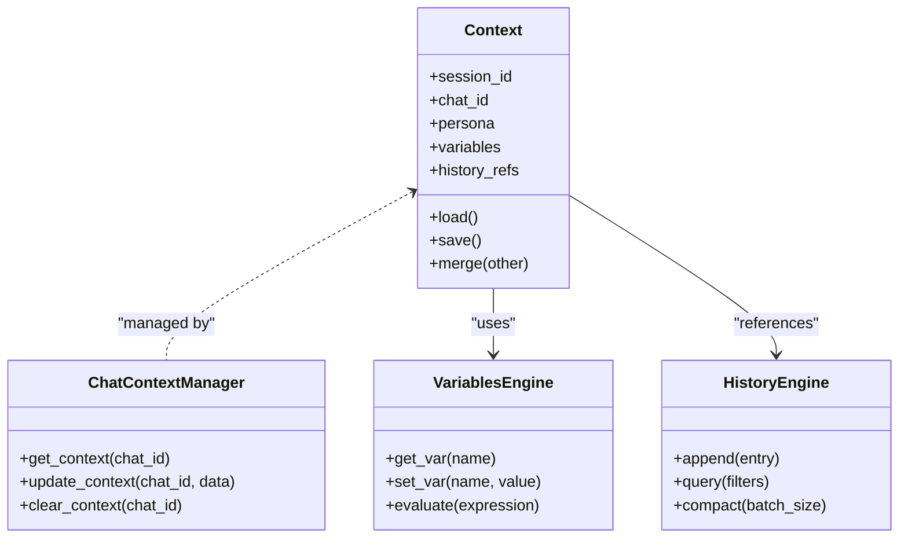

**Diagram sources**
- [core/context.py:1-200](file://core/context.py#L1-L200)
- [core/chat_context_manager.py:1-200](file://core/chat_context_manager.py#L1-L200)
- [core/variables_engine.py:1-200](file://core/variables_engine.py#L1-L200)
- [core/history_engine.py:1-200](file://core/history_engine.py#L1-L200)

**Section sources**
- [core/context.py:1-200](file://core/context.py#L1-L200)
- [core/chat_context_manager.py:1-200](file://core/chat_context_manager.py#L1-L200)
- [core/variables_engine.py:1-200](file://core/variables_engine.py#L1-L200)
- [core/history_engine.py:1-200](file://core/history_engine.py#L1-L200)

### Plugin Integration and Service Registration
Plugins extend functionality via base classes and registries. Services are registered during initialization and resolved at runtime through dependency injection.

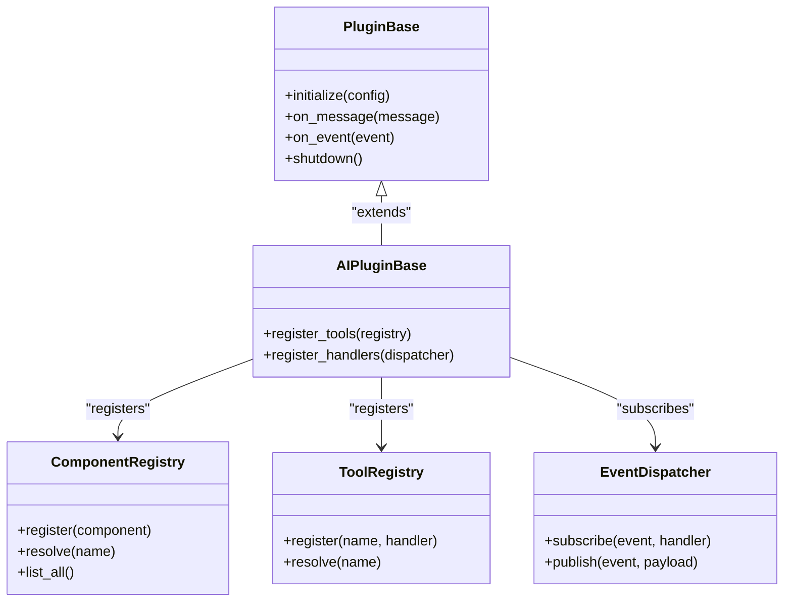

**Diagram sources**
- [core/plugin_base.py:1-200](file://core/plugin_base.py#L1-L200)
- [core/ai_plugin_base.py:1-200](file://core/ai_plugin_base.py#L1-L200)
- [core/component_registry.py:1-200](file://core/component_registry.py#L1-L200)
- [core/tool_registry.py:1-200](file://core/tool_registry.py#L1-L200)
- [core/event_dispatcher.py:1-200](file://core/event_dispatcher.py#L1-L200)

**Section sources**
- [core/plugin_base.py:1-200](file://core/plugin_base.py#L1-L200)
- [core/ai_plugin_base.py:1-200](file://core/ai_plugin_base.py#L1-L200)
- [core/component_registry.py:1-200](file://core/component_registry.py#L1-L200)
- [core/tool_registry.py:1-200](file://core/tool_registry.py#L1-L200)
- [core/event_dispatcher.py:1-200](file://core/event_dispatcher.py#L1-L200)

### Configuration and Dependency Injection
Configuration is centralized and validated, with environment overrides and file-based settings. Dependency injection resolves services based on registrations.

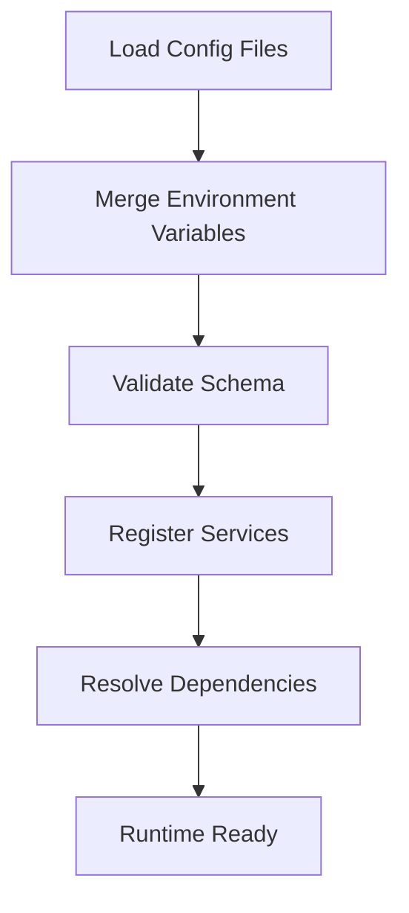

**Diagram sources**
- [core/config.py:1-200](file://core/config.py#L1-L200)
- [core/config_manager.py:1-200](file://core/config_manager.py#L1-L200)
- [core/component_registry.py:1-200](file://core/component_registry.py#L1-L200)

**Section sources**
- [core/config.py:1-200](file://core/config.py#L1-L200)
- [core/config_manager.py:1-200](file://core/config_manager.py#L1-L200)
- [core/component_registry.py:1-200](file://core/component_registry.py#L1-L200)

### Memory Systems and Soul Subsystems
Memory persists user and agent state, while soul subsystems manage emotion, time resolution, and observability. These integrate with the core engine via registries and repositories.

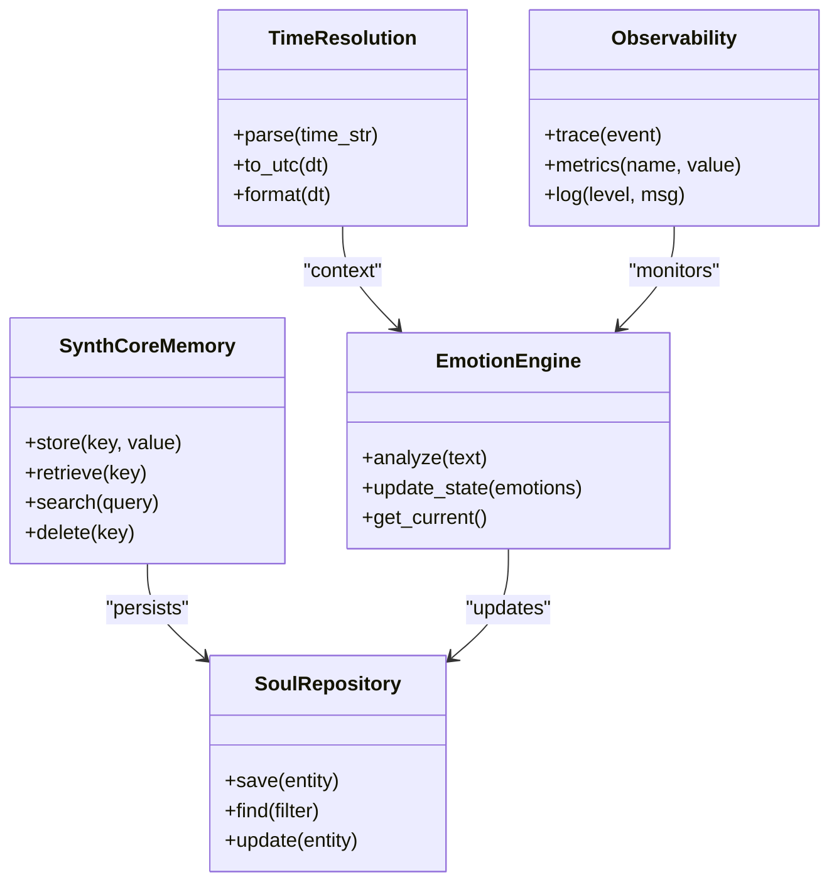

**Diagram sources**
- [core/synth_core_memory.py:1-200](file://core/synth_core_memory.py#L1-L200)
- [core/soul/repository.py:1-200](file://core/soul/repository.py#L1-L200)
- [core/soul/emotion_engine.py:1-200](file://core/soul/emotion_engine.py#L1-L200)
- [core/soul/time_resolution.py:1-200](file://core/soul/time_resolution.py#L1-L200)
- [core/soul/observability.py:1-200](file://core/soul/observability.py#L1-L200)

**Section sources**
- [core/synth_core_memory.py:1-200](file://core/synth_core_memory.py#L1-L200)
- [core/soul/repository.py:1-200](file://core/soul/repository.py#L1-L200)
- [core/soul/emotion_engine.py:1-200](file://core/soul/emotion_engine.py#L1-L200)
- [core/soul/time_resolution.py:1-200](file://core/soul/time_resolution.py#L1-L200)
- [core/soul/observability.py:1-200](file://core/soul/observability.py#L1-L200)

### Transport Layer and Interfaces
Transport abstracts communication protocols, while interface adapters map core messages to platform-specific formats.

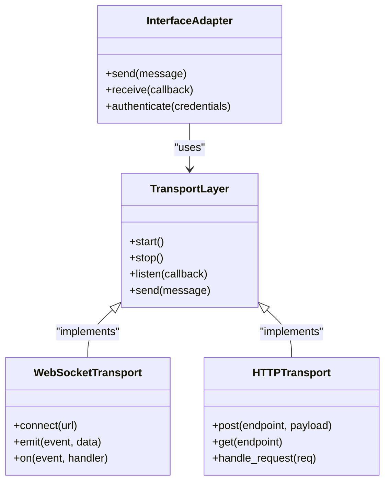

**Diagram sources**
- [core/transport_layer.py:1-200](file://core/transport_layer.py#L1-L200)
- [core/interfaces.py:1-200](file://core/interfaces.py#L1-L200)
- [core/interface_adapters.py:1-200](file://core/interface_adapters.py#L1-L200)

**Section sources**
- [core/transport_layer.py:1-200](file://core/transport_layer.py#L1-L200)
- [core/interfaces.py:1-200](file://core/interfaces.py#L1-L200)
- [core/interface_adapters.py:1-200](file://core/interface_adapters.py#L1-L200)

### MCP Bridge Integration
MCP (Model Context Protocol) enables external tool invocation and server-client communication.

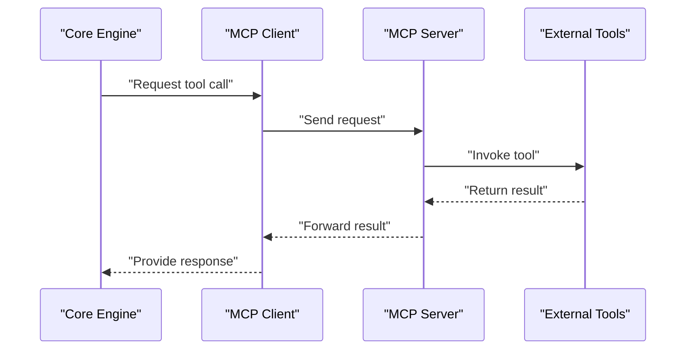

**Diagram sources**
- [core/mcp_bridge/client.py:1-200](file://core/mcp_bridge/client.py#L1-L200)
- [core/mcp_bridge/server.py:1-200](file://core/mcp_bridge/server.py#L1-L200)
- [core/mcp_bridge/config.py:1-200](file://core/mcp_bridge/config.py#L1-L200)

**Section sources**
- [core/mcp_bridge/client.py:1-200](file://core/mcp_bridge/client.py#L1-L200)
- [core/mcp_bridge/server.py:1-200](file://core/mcp_bridge/server.py#L1-L200)
- [core/mcp_bridge/config.py:1-200](file://core/mcp_bridge/config.py#L1-L200)

## Dependency Analysis
The core engine exhibits high cohesion within modules and low coupling through registries and adapters. Direct dependencies include message queue to chain, chain to parser/state/context/prompt/tools/memory, and proxies to interfaces. Indirect dependencies arise via event dispatcher and plugin base classes.

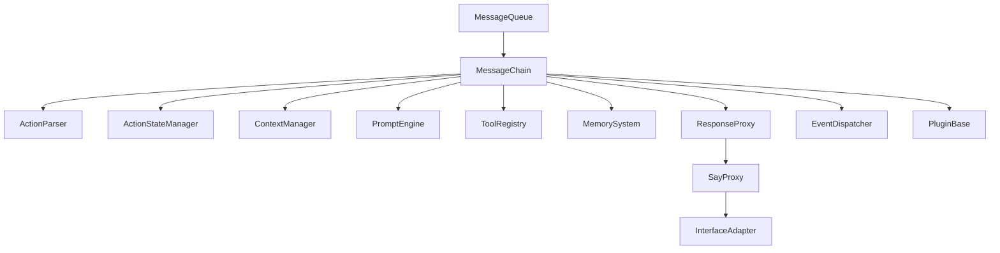

**Diagram sources**
- [core/message_queue.py:1-200](file://core/message_queue.py#L1-L200)
- [core/message_chain.py:1-200](file://core/message_chain.py#L1-L200)
- [core/action_parser.py:1-200](file://core/action_parser.py#L1-L200)
- [core/action_state_manager.py:1-200](file://core/action_state_manager.py#L1-L200)
- [core/context.py:1-200](file://core/context.py#L1-L200)
- [core/prompt_engine.py:1-200](file://core/prompt_engine.py#L1-L200)
- [core/tool_registry.py:1-200](file://core/tool_registry.py#L1-L200)
- [core/synth_core_memory.py:1-200](file://core/synth_core_memory.py#L1-L200)
- [core/response_proxy.py:1-200](file://core/response_proxy.py#L1-L200)
- [core/say_proxy.py:1-200](file://core/say_proxy.py#L1-L200)
- [core/interfaces.py:1-200](file://core/interfaces.py#L1-L200)
- [core/interface_adapters.py:1-200](file://core/interface_adapters.py#L1-L200)
- [core/event_dispatcher.py:1-200](file://core/event_dispatcher.py#L1-L200)
- [core/plugin_base.py:1-200](file://core/plugin_base.py#L1-L200)

**Section sources**
- [core/message_queue.py:1-200](file://core/message_queue.py#L1-L200)
- [core/message_chain.py:1-200](file://core/message_chain.py#L1-L200)
- [core/action_parser.py:1-200](file://core/action_parser.py#L1-L200)
- [core/action_state_manager.py:1-200](file://core/action_state_manager.py#L1-L200)
- [core/context.py:1-200](file://core/context.py#L1-L200)
- [core/prompt_engine.py:1-200](file://core/prompt_engine.py#L1-L200)
- [core/tool_registry.py:1-200](file://core/tool_registry.py#L1-L200)
- [core/synth_core_memory.py:1-200](file://core/synth_core_memory.py#L1-L200)
- [core/response_proxy.py:1-200](file://core/response_proxy.py#L1-L200)
- [core/say_proxy.py:1-200](file://core/say_proxy.py#L1-L200)
- [core/interfaces.py:1-200](file://core/interfaces.py#L1-L200)
- [core/interface_adapters.py:1-200](file://core/interface_adapters.py#L1-L200)
- [core/event_dispatcher.py:1-200](file://core/event_dispatcher.py#L1-L200)
- [core/plugin_base.py:1-200](file://core/plugin_base.py#L1-L200)

## Performance Considerations
- Message Queue: Use priority queues and backpressure to handle bursts.
- Action Parsing: Cache schema validations and handler mappings.
- Context Management: Minimize serialization overhead; use in-memory caches for hot paths.
- Prompt Generation: Stream LLM responses and batch memory reads.
- Tool Execution: Implement timeouts, retries with exponential backoff, and circuit breakers.
- Memory Systems: Index frequently accessed keys and use connection pooling.
- Transport Layer: Prefer async I/O and connection reuse.

[No sources needed since this section provides general guidance]

## Troubleshooting Guide
Common issues include misconfigured transports, invalid action schemas, unresolved tool handlers, and context mismatches. Logging utilities and failure logs help diagnose problems.

- Check transport connectivity and authentication.
- Validate action payloads against schemas.
- Verify tool registrations and permissions.
- Inspect context variables and history references.
- Review logs for errors and warnings.

**Section sources**
- [core/logging_utils.py:1-200](file://core/logging_utils.py#L1-L200)
- [core/llm_failure_log.py:1-200](file://core/llm_failure_log.py#L1-L200)

## Conclusion
The Synthetic Heart Core Engine provides a robust, extensible architecture for message processing, action execution, and context management. Its layered design, registry-driven extensibility, and integration with memory and transport systems enable scalable and maintainable agent behavior. Proper configuration, dependency injection, and error handling ensure reliability and performance.

[No sources needed since this section summarizes without analyzing specific files]

## Appendices
- Glossary: Terms like “action,” “context,” “tool,” and “interface” are defined throughout the codebase and documentation.
- References: See core module files for detailed implementations and tests for usage examples.

[No sources needed since this section provides general guidance]