# Database Architecture

<cite>
**Referenced Files in This Document**
- [db.py](file://core/db.py)
- [db_backends.py](file://core/db_backends.py)
- [migrations.py](file://core/migrations.py)
- [main_db_migration.py](file://core/main_db_migration.py)
- [db_backup.py](file://core/db_backup.py)
- [db_cutover.py](file://core/db_cutover.py)
- [chat_archives_db.py](file://core/chat_archives_db.py)
- [soul/repository.py](file://core/soul/repository.py)
- [scripts/sql/app_main_postgres.sql](file://scripts/sql/app_main_postgres.sql)
- [scripts/sql/soul_memory_postgres.sql](file://scripts/sql/soul_memory_postgres.sql)
- [init-db.sql](file://init-db.sql)
- [database_connection_management.rst](file://docs/database_connection_management.rst)
</cite>

## Table of Contents
1. [Introduction](#introduction)
2. [Project Structure](#project-structure)
3. [Core Components](#core-components)
4. [Architecture Overview](#architecture-overview)
5. [Detailed Component Analysis](#detailed-component-analysis)
6. [Dependency Analysis](#dependency-analysis)
7. [Performance Considerations](#performance-considerations)
8. [Troubleshooting Guide](#troubleshooting-guide)
9. [Conclusion](#conclusion)
10. [Appendices](#appendices)

## Introduction
This document describes Synthetic Heart’s database architecture with a focus on multi-backend support (SQLite and PostgreSQL), schema design for application data, soul memory storage, and chat archives. It also covers the migration system, connection pooling strategies, transaction management, backup and recovery mechanisms, data synchronization patterns, performance optimization techniques, and scaling considerations for production deployments.

## Project Structure
The database layer is implemented under core/ with dedicated modules for:
- Backend abstraction and implementations
- Migration orchestration
- Backup and cutover utilities
- Chat archives persistence
- Soul memory repository

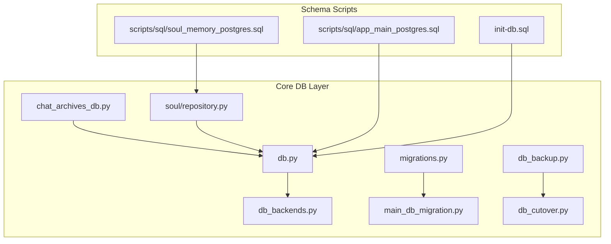

**Diagram sources**
- [db.py](file://core/db.py)
- [db_backends.py](file://core/db_backends.py)
- [migrations.py](file://core/migrations.py)
- [main_db_migration.py](file://core/main_db_migration.py)
- [db_backup.py](file://core/db_backup.py)
- [db_cutover.py](file://core/db_cutover.py)
- [chat_archives_db.py](file://core/chat_archives_db.py)
- [soul/repository.py](file://core/soul/repository.py)
- [scripts/sql/app_main_postgres.sql](file://scripts/sql/app_main_postgres.sql)
- [scripts/sql/soul_memory_postgres.sql](file://scripts/sql/soul_memory_postgres.sql)
- [init-db.sql](file://init-db.sql)

**Section sources**
- [db.py](file://core/db.py)
- [db_backends.py](file://core/db_backends.py)
- [migrations.py](file://core/migrations.py)
- [main_db_migration.py](file://core/main_db_migration.py)
- [db_backup.py](file://core/db_backup.py)
- [db_cutover.py](file://core/db_cutover.py)
- [chat_archives_db.py](file://core/chat_archives_db.py)
- [soul/repository.py](file://core/soul/repository.py)
- [scripts/sql/app_main_postgres.sql](file://scripts/sql/app_main_postgres.sql)
- [scripts/sql/soul_memory_postgres.sql](file://scripts/sql/soul_memory_postgres.sql)
- [init-db.sql](file://init-db.sql)

## Core Components
- Backend Abstraction: Unified interface for SQLite and PostgreSQL backends with consistent cursor/connection semantics.
- Migration System: Versioned migrations applied at startup or via scripts; supports both main app and soul memory schemas.
- Backup and Recovery: Automated backups, integrity checks, and restore workflows.
- Cutover Utilities: Safe switching between databases to enable zero-downtime upgrades.
- Chat Archives DB: Dedicated persistence for chat history and archival operations.
- Soul Memory Repository: Typed accessors and queries for soul memory entities.

Key responsibilities:
- Connection lifecycle and pooling configuration
- Transaction boundaries and error handling
- Schema initialization and migration execution
- Backup scheduling and restoration procedures
- Query routing and backend-specific optimizations

**Section sources**
- [db.py](file://core/db.py)
- [db_backends.py](file://core/db_backends.py)
- [migrations.py](file://core/migrations.py)
- [main_db_migration.py](file://core/main_db_migration.py)
- [db_backup.py](file://core/db_backup.py)
- [db_cutover.py](file://core/db_cutover.py)
- [chat_archives_db.py](file://core/chat_archives_db.py)
- [soul/repository.py](file://core/soul/repository.py)

## Architecture Overview
Synthetic Heart uses a layered database architecture that abstracts backend specifics behind a common interface. The main application interacts with a unified database client, which delegates to backend-specific implementations. Migrations ensure schema consistency across environments, while backup and cutover tools provide operational resilience.

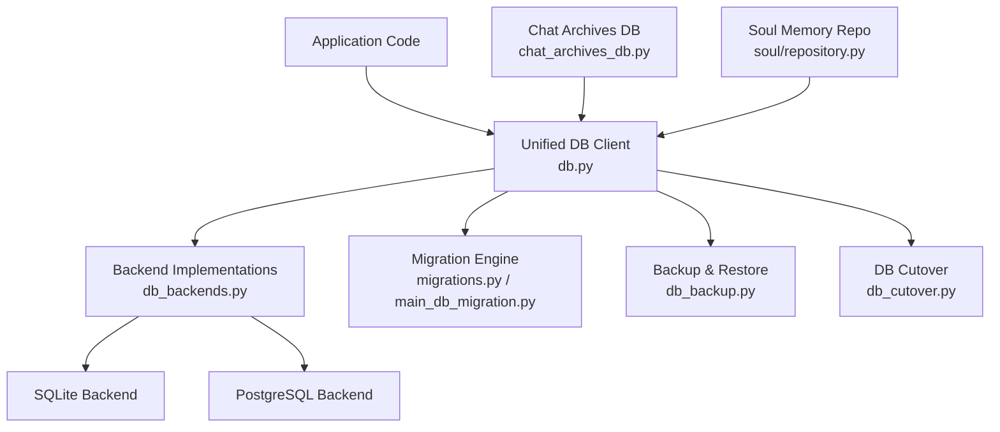

**Diagram sources**
- [db.py](file://core/db.py)
- [db_backends.py](file://core/db_backends.py)
- [migrations.py](file://core/migrations.py)
- [main_db_migration.py](file://core/main_db_migration.py)
- [db_backup.py](file://core/db_backup.py)
- [db_cutover.py](file://core/db_cutover.py)
- [chat_archives_db.py](file://core/chat_archives_db.py)
- [soul/repository.py](file://core/soul/repository.py)

## Detailed Component Analysis

### Multi-Backend Support (SQLite and PostgreSQL)
- Backend Interface: Provides a consistent API for connections, cursors, transactions, and query execution.
- SQLite Backend: Optimized for local/embedded usage with file-based storage and minimal configuration.
- PostgreSQL Backend: Designed for production deployments with connection pooling, prepared statements, and robust transactional guarantees.

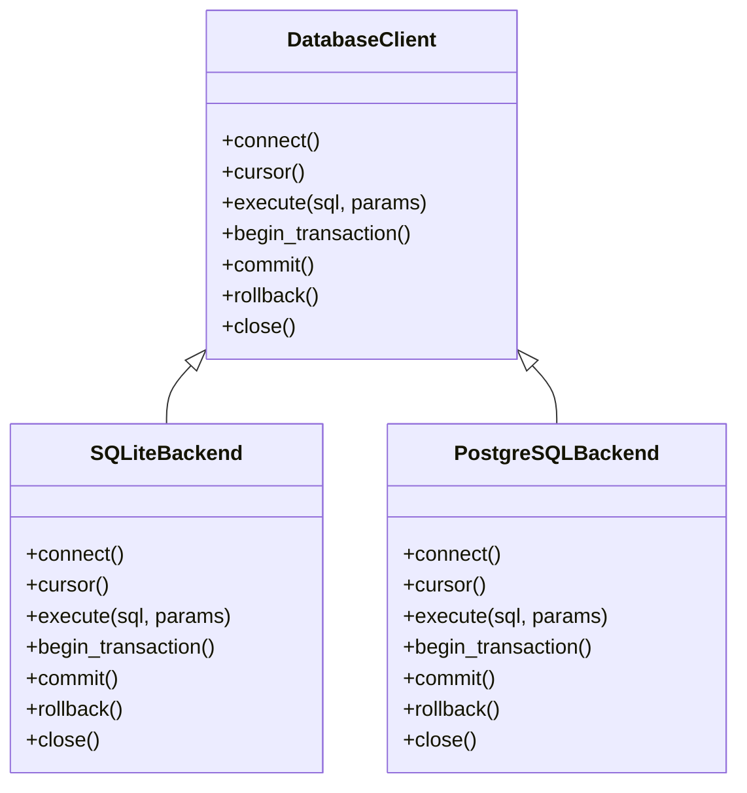

**Diagram sources**
- [db_backends.py](file://core/db_backends.py)
- [db.py](file://core/db.py)

**Section sources**
- [db_backends.py](file://core/db_backends.py)
- [db.py](file://core/db.py)

### Schema Design
- Application Main Schema: Defines tables for core application data, including user sessions, configuration, and runtime state.
- Soul Memory Schema: Stores personality traits, emotional states, memories, and relationship graphs.
- Chat Archives Schema: Persists conversation history, messages, attachments, and metadata.

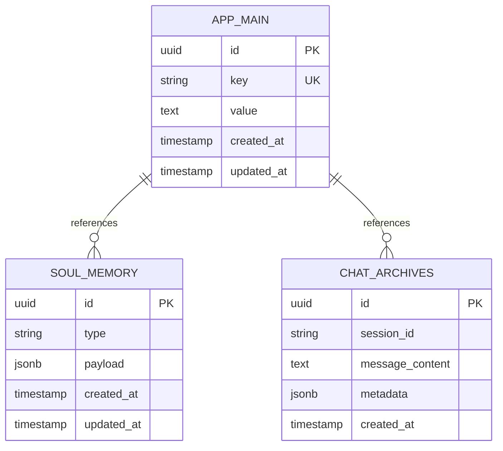

**Diagram sources**
- [scripts/sql/app_main_postgres.sql](file://scripts/sql/app_main_postgres.sql)
- [scripts/sql/soul_memory_postgres.sql](file://scripts/sql/soul_memory_postgres.sql)
- [init-db.sql](file://init-db.sql)

**Section sources**
- [scripts/sql/app_main_postgres.sql](file://scripts/sql/app_main_postgres.sql)
- [scripts/sql/soul_memory_postgres.sql](file://scripts/sql/soul_memory_postgres.sql)
- [init-db.sql](file://init-db.sql)

### Migration System
- Version Control: Migrations are versioned and applied in order to maintain schema consistency.
- Execution Context: Migrations run during application startup or via dedicated scripts.
- Rollback Strategy: Supports rollback to previous versions when necessary.

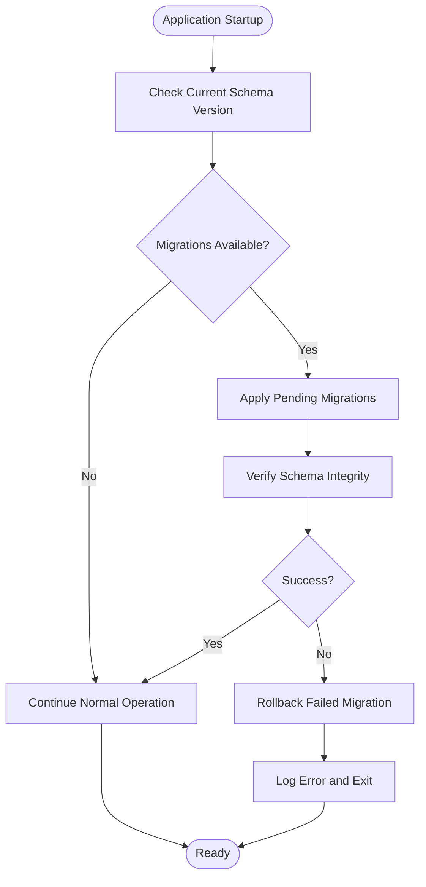

**Diagram sources**
- [migrations.py](file://core/migrations.py)
- [main_db_migration.py](file://core/main_db_migration.py)

**Section sources**
- [migrations.py](file://core/migrations.py)
- [main_db_migration.py](file://core/main_db_migration.py)

### Connection Pooling Strategies
- SQLite: Uses single-connection mode with write serialization and read concurrency through WAL mode.
- PostgreSQL: Configures connection pools with minimum/maximum limits, idle timeouts, and retry logic.
- Health Checks: Periodic validation of connection health and automatic reconnection.

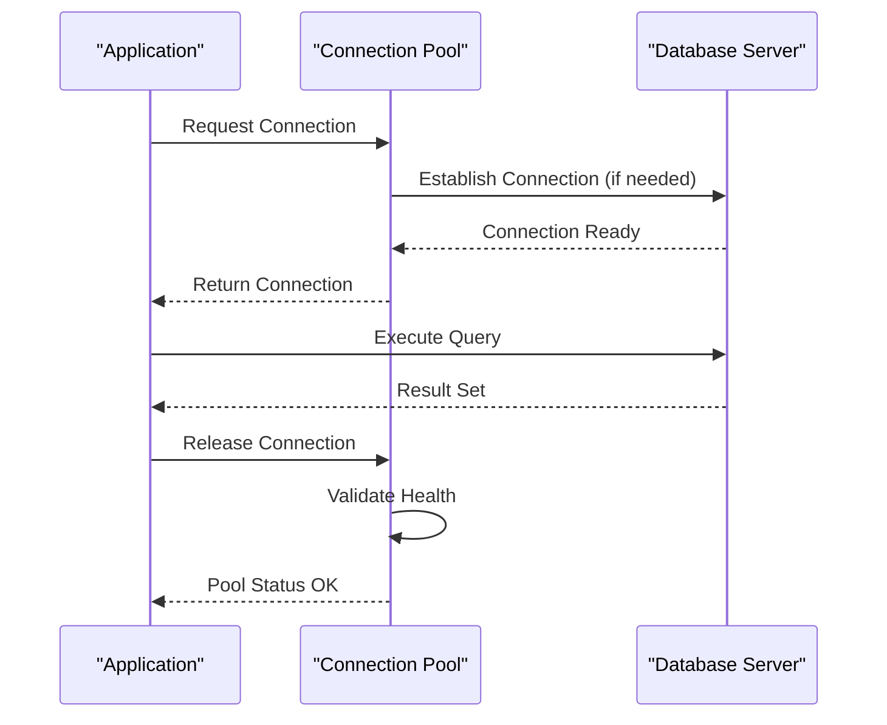

**Diagram sources**
- [db.py](file://core/db.py)
- [db_backends.py](file://core/db_backends.py)

**Section sources**
- [db.py](file://core/db.py)
- [db_backends.py](file://core/db_backends.py)

### Transaction Management
- Explicit Transactions: All write operations wrapped in explicit transaction boundaries.
- Nested Transactions: Support for savepoints within complex operations.
- Error Handling: Automatic rollback on exceptions with detailed error context.

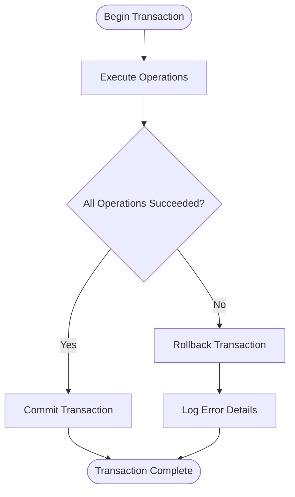

**Diagram sources**
- [db.py](file://core/db.py)

**Section sources**
- [db.py](file://core/db.py)

### Backup and Recovery Mechanisms
- Automated Backups: Scheduled backups with retention policies and compression.
- Integrity Verification: Post-backup validation to ensure data consistency.
- Restore Procedures: Point-in-time recovery with conflict resolution strategies.

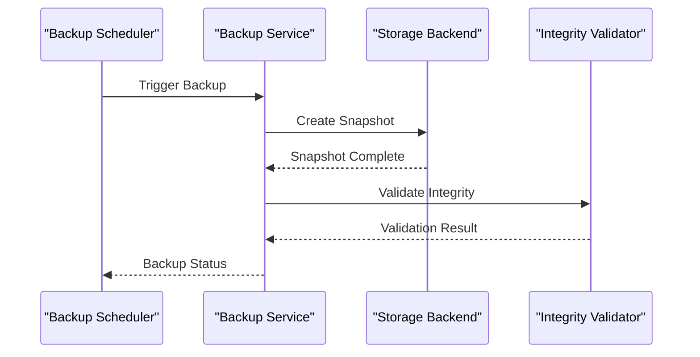

**Diagram sources**
- [db_backup.py](file://core/db_backup.py)

**Section sources**
- [db_backup.py](file://core/db_backup.py)

### Data Synchronization Patterns
- Master-Slave Replication: PostgreSQL streaming replication for read scaling.
- Eventual Consistency: Cache invalidation and background sync jobs.
- Conflict Resolution: Last-write-wins strategy with manual override capabilities.

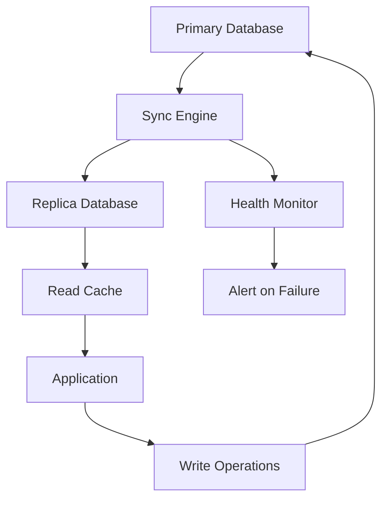

**Diagram sources**
- [db_cutover.py](file://core/db_cutover.py)

**Section sources**
- [db_cutover.py](file://core/db_cutover.py)

### Performance Optimization Techniques
- Query Optimization: Index usage, query plan analysis, and parameter binding.
- Connection Pool Tuning: Optimal pool sizes based on workload characteristics.
- Read/Write Splitting: Separate connections for read-heavy and write-heavy operations.
- Caching Strategies: In-memory caching for frequently accessed data.

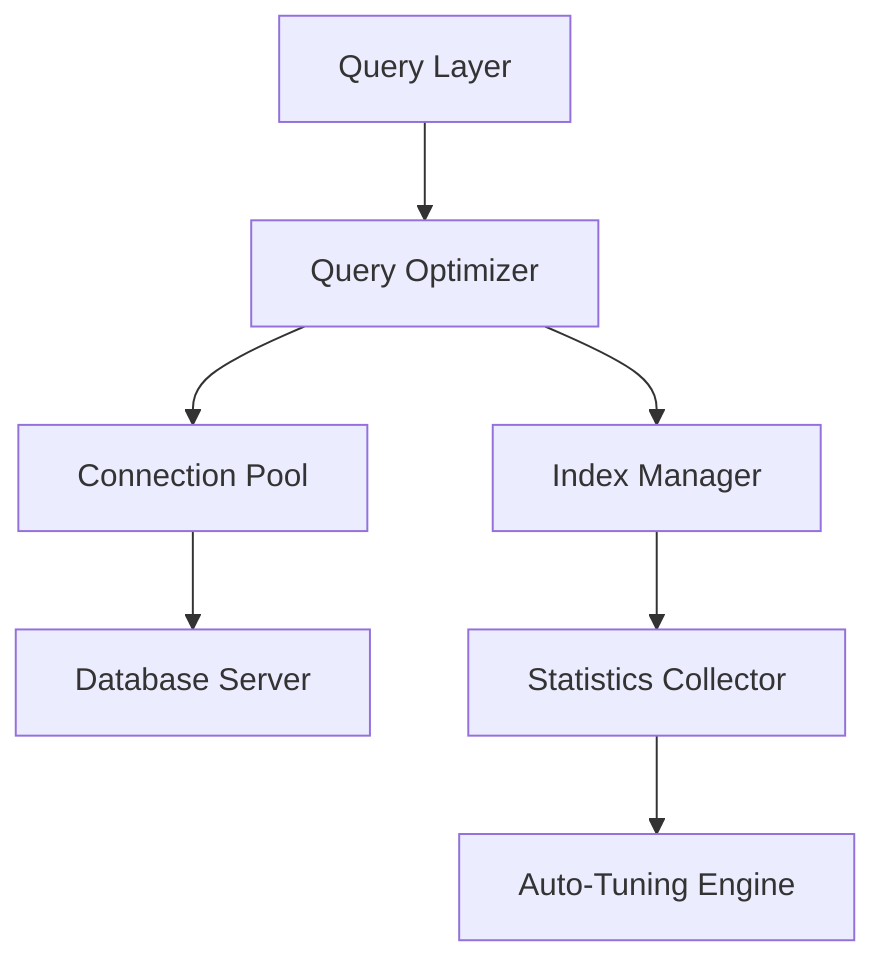

**Diagram sources**
- [db.py](file://core/db.py)
- [db_backends.py](file://core/db_backends.py)

**Section sources**
- [db.py](file://core/db.py)
- [db_backends.py](file://core/db_backends.py)

## Dependency Analysis
The database layer has clear dependencies on schema definitions and utility modules:

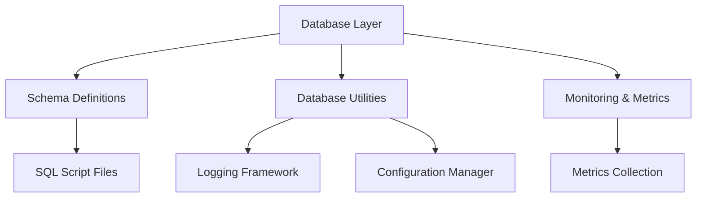

**Diagram sources**
- [db.py](file://core/db.py)
- [db_backends.py](file://core/db_backends.py)
- [scripts/sql/app_main_postgres.sql](file://scripts/sql/app_main_postgres.sql)
- [scripts/sql/soul_memory_postgres.sql](file://scripts/sql/soul_memory_postgres.sql)

**Section sources**
- [db.py](file://core/db.py)
- [db_backends.py](file://core/db_backends.py)
- [scripts/sql/app_main_postgres.sql](file://scripts/sql/app_main_postgres.sql)
- [scripts/sql/soul_memory_postgres.sql](file://scripts/sql/soul_memory_postgres.sql)

## Performance Considerations
- Connection Pool Sizing: Configure based on concurrent request patterns and database capacity.
- Index Strategy: Regularly analyze query patterns and add appropriate indexes.
- Query Optimization: Use EXPLAIN ANALYZE for slow queries and optimize accordingly.
- Memory Management: Monitor memory usage and adjust buffer sizes for optimal performance.
- Disk I/O: Utilize SSD storage and configure appropriate I/O parameters.

[No sources needed since this section provides general guidance]

## Troubleshooting Guide
Common issues and their resolutions:
- Connection Pool Exhaustion: Increase pool size or optimize connection usage patterns.
- Migration Failures: Review migration logs and manually resolve schema conflicts.
- Backup Corruption: Verify backup integrity and restore from last known good state.
- Performance Degradation: Analyze query plans and optimize slow-running queries.

**Section sources**
- [database_connection_management.rst](file://docs/database_connection_management.rst)

## Conclusion
Synthetic Heart’s database architecture provides a robust foundation for scalable and reliable data persistence. The multi-backend support, comprehensive migration system, and operational tools ensure flexibility and resilience in production environments. Proper configuration and monitoring are essential for optimal performance and reliability.

[No sources needed since this section summarizes without analyzing specific files]

## Appendices

### Production Deployment Checklist
- Configure connection pools based on expected load
- Set up automated backups with retention policies
- Enable monitoring and alerting for database metrics
- Test disaster recovery procedures regularly
- Optimize queries and indexes based on actual usage patterns

[No sources needed since this section provides general guidance]