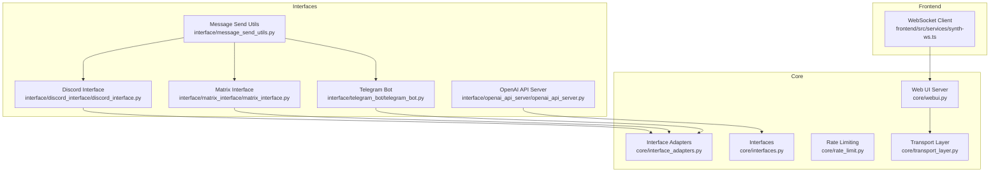
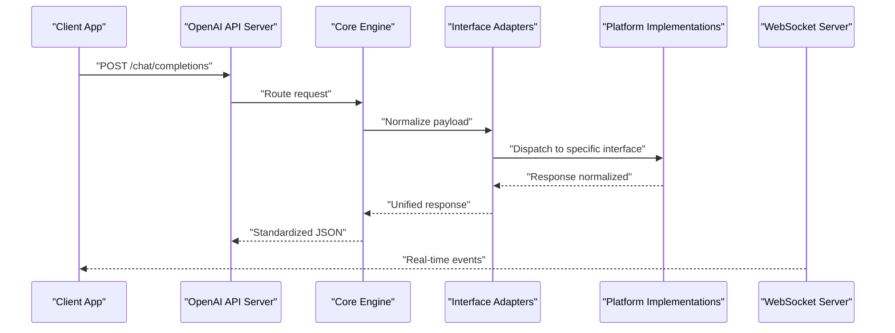
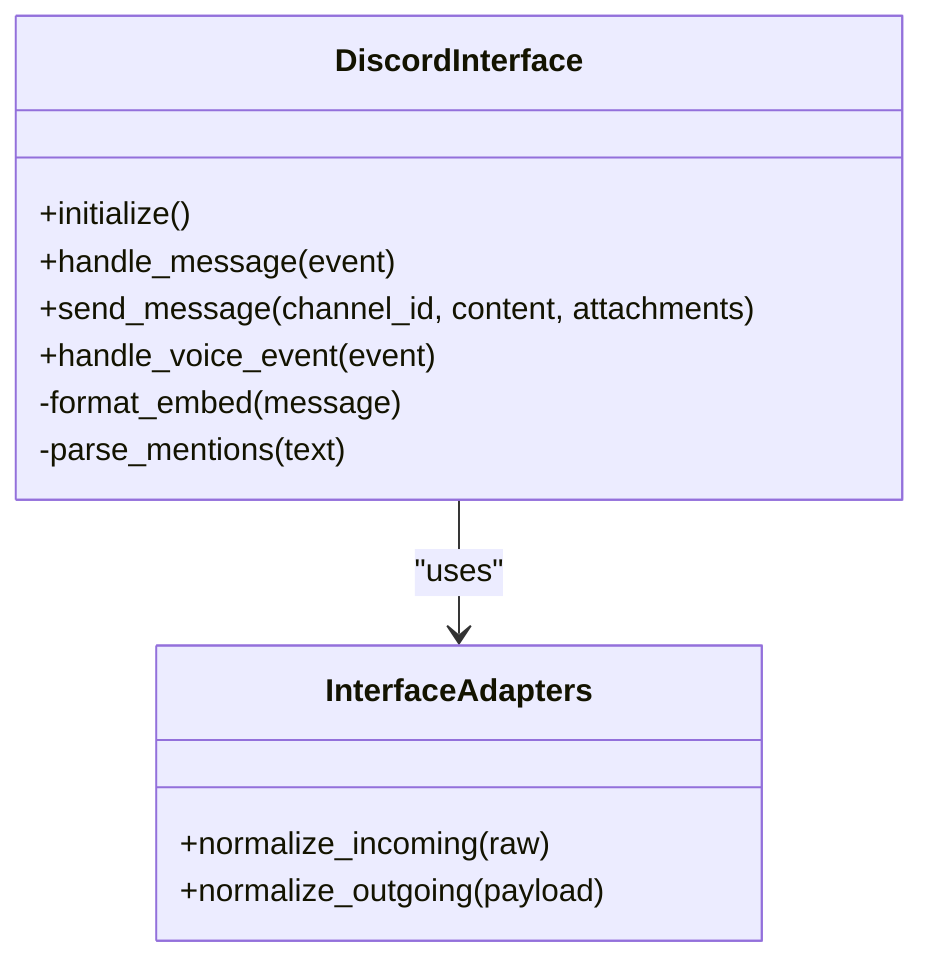
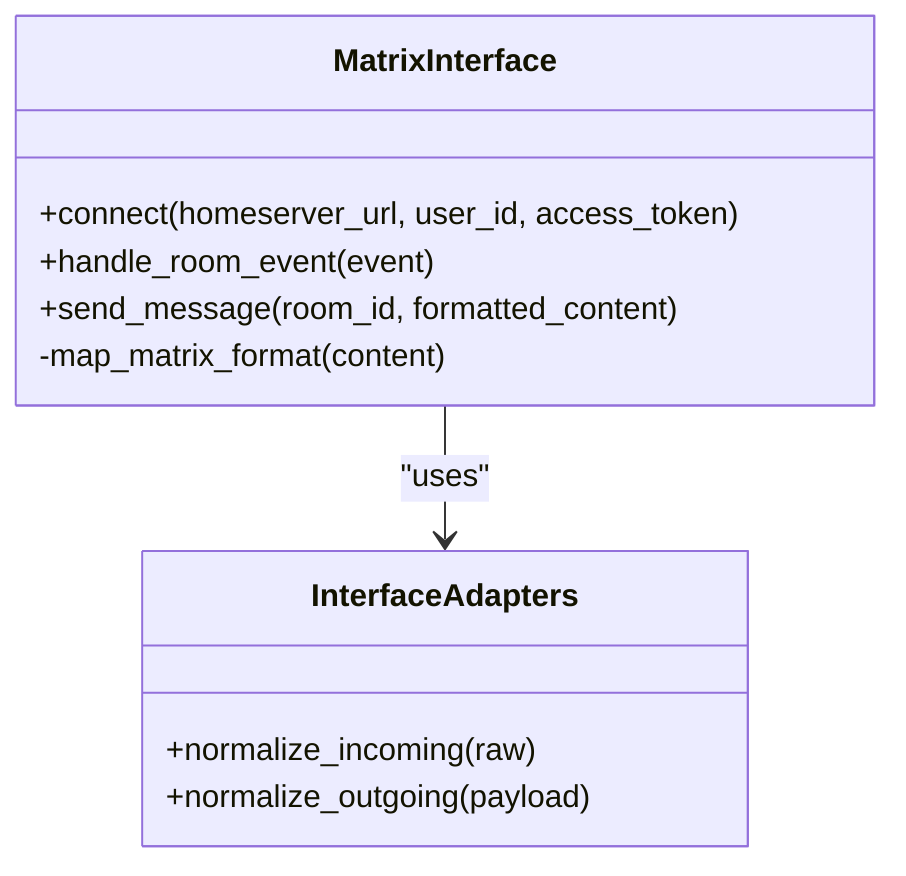
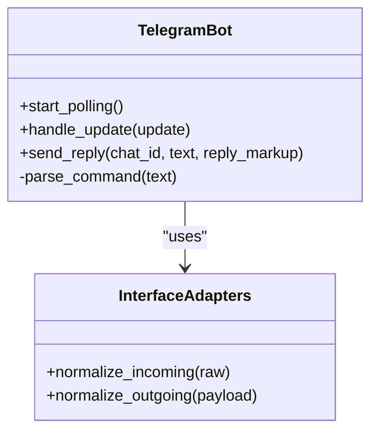
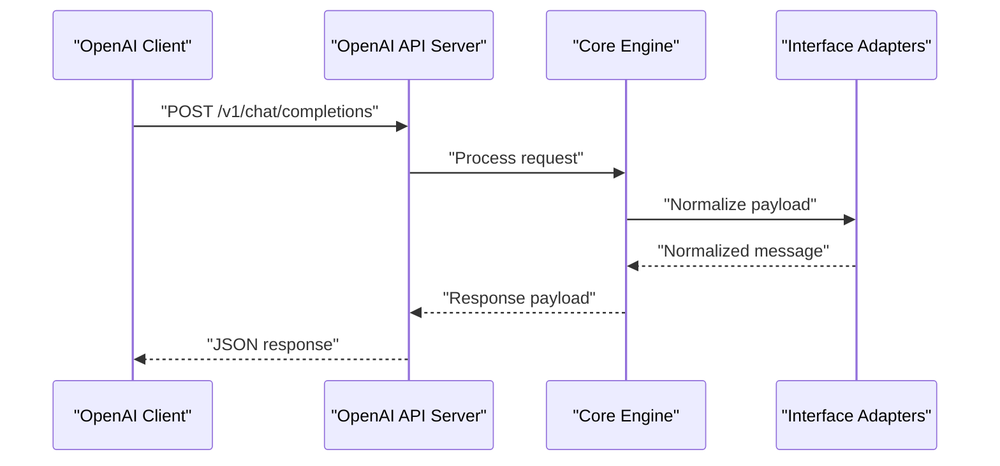
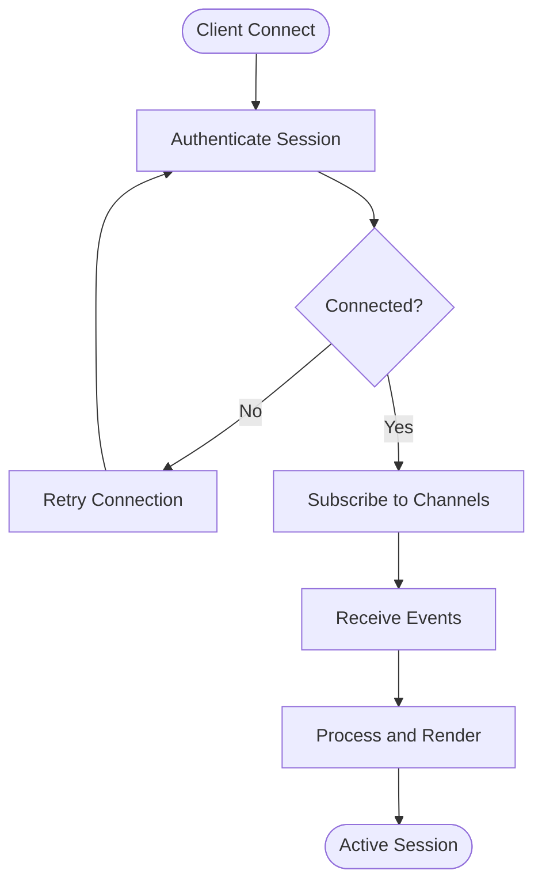
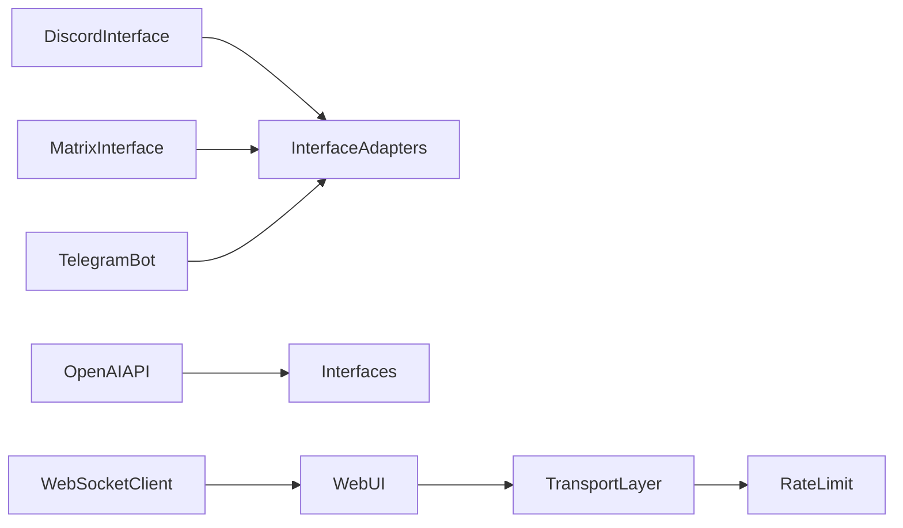

# Interface Layer Architecture

<cite>
**Referenced Files in This Document**
- [interface_adapters.py](file://core/interface_adapters.py)
- [interfaces.py](file://core/interfaces.py)
- [discord_interface.py](file://interface/discord_interface/discord_interface.py)
- [matrix_interface.py](file://interface/matrix_interface/matrix_interface.py)
- [telegram_bot.py](file://interface/telegram_bot/telegram_bot.py)
- [openai_api_server.py](file://interface/openai_api_server/openai_api_server.py)
- [message_send_utils.py](file://interface/message_send_utils.py)
- [rate_limit.py](file://core/rate_limit.py)
- [transport_layer.py](file://core/transport_layer.py)
- [webui.py](file://core/webui.py)
- [synth_ws.ts](file://frontend/src/services/synth-ws.ts)
</cite>

## Table of Contents
1. [Introduction](#introduction)
2. [Project Structure](#project-structure)
3. [Core Components](#core-components)
4. [Architecture Overview](#architecture-overview)
5. [Detailed Component Analysis](#detailed-component-analysis)
6. [Dependency Analysis](#dependency-analysis)
7. [Performance Considerations](#performance-considerations)
8. [Troubleshooting Guide](#troubleshooting-guide)
9. [Conclusion](#conclusion)

## Introduction
This document describes the Interface Layer architecture of Synthetic Heart, focusing on multi-platform communication across Discord, Matrix, Telegram, and web interfaces. It explains the adapter pattern used to unify message handling, authentication mechanisms, rate limiting strategies, error recovery patterns, WebSocket support for real-time communication, and the OpenAI-compatible API server. Platform-specific configuration options, message formatting rules, and integration patterns with external services are also covered.

## Project Structure
The interface layer is organized into:
- Core abstractions and adapters that define a consistent message model and transport interface
- Platform-specific implementations (Discord, Matrix, Telegram)
- An OpenAI-compatible API server exposing REST endpoints
- Web UI integration via WebSocket
- Shared utilities for message sending and rate limiting

**Diagram sources**
- [interface_adapters.py](file://core/interface_adapters.py)
- [interfaces.py](file://core/interfaces.py)
- [discord_interface.py](file://interface/discord_interface/discord_interface.py)
- [matrix_interface.py](file://interface/matrix_interface/matrix_interface.py)
- [telegram_bot.py](file://interface/telegram_bot/telegram_bot.py)
- [openai_api_server.py](file://interface/openai_api_server/openai_api_server.py)
- [message_send_utils.py](file://interface/message_send_utils.py)
- [rate_limit.py](file://core/rate_limit.py)
- [transport_layer.py](file://core/transport_layer.py)
- [webui.py](file://core/webui.py)
- [synth_ws.ts](file://frontend/src/services/synth-ws.ts)

**Section sources**
- [interface_adapters.py](file://core/interface_adapters.py)
- [interfaces.py](file://core/interfaces.py)
- [discord_interface.py](file://interface/discord_interface/discord_interface.py)
- [matrix_interface.py](file://interface/matrix_interface/matrix_interface.py)
- [telegram_bot.py](file://interface/telegram_bot/telegram_bot.py)
- [openai_api_server.py](file://interface/openai_api_server/openai_api_server.py)
- [message_send_utils.py](file://interface/message_send_utils.py)
- [rate_limit.py](file://core/rate_limit.py)
- [transport_layer.py](file://core/transport_layer.py)
- [webui.py](file://core/webui.py)
- [synth_ws.ts](file://frontend/src/services/synth-ws.ts)

## Core Components
- Adapter Pattern: A unified message model and transport abstraction allows each platform implementation to focus on platform-specific details while sharing common logic.
- Interfaces: Define contracts for message types, session context, and transport operations.
- Rate Limiting: Centralized strategy to throttle outbound requests per platform or channel.
- Transport Layer: Manages connection lifecycle, reconnection, and event routing.
- Message Utilities: Helpers for formatting, attachments, and cross-platform compatibility.

Key responsibilities:
- Normalize incoming messages from different platforms into a common schema
- Enforce rate limits before sending responses
- Provide consistent error handling and retry semantics
- Expose real-time updates via WebSocket for the web UI

**Section sources**
- [interface_adapters.py](file://core/interface_adapters.py)
- [interfaces.py](file://core/interfaces.py)
- [rate_limit.py](file://core/rate_limit.py)
- [transport_layer.py](file://core/transport_layer.py)
- [message_send_utils.py](file://interface/message_send_utils.py)

## Architecture Overview
The interface layer uses an adapter pattern to abstract platform differences. Each platform implements a consistent interface for receiving and sending messages. The OpenAI-compatible API server exposes REST endpoints compatible with standard clients. The web UI connects via WebSocket for live updates.

**Diagram sources**
- [openai_api_server.py](file://interface/openai_api_server/openai_api_server.py)
- [interface_adapters.py](file://core/interface_adapters.py)
- [interfaces.py](file://core/interfaces.py)
- [transport_layer.py](file://core/transport_layer.py)
- [synth_ws.ts](file://frontend/src/services/synth-ws.ts)

## Detailed Component Analysis

### Discord Interface
- Handles Discord-specific message parsing, mentions, embeds, and reactions
- Supports voice channels and streaming where applicable
- Uses shared message utilities for consistent formatting

**Diagram sources**
- [discord_interface.py](file://interface/discord_interface/discord_interface.py)
- [interface_adapters.py](file://core/interface_adapters.py)

**Section sources**
- [discord_interface.py](file://interface/discord_interface/discord_interface.py)
- [message_send_utils.py](file://interface/message_send_utils.py)

### Matrix Interface
- Integrates with Matrix homeserver for chat rooms and direct messages
- Supports room events, typing indicators, and rich text
- Adapts Matrix-specific features like tags and state events

**Diagram sources**
- [matrix_interface.py](file://interface/matrix_interface/matrix_interface.py)
- [interface_adapters.py](file://core/interface_adapters.py)

**Section sources**
- [matrix_interface.py](file://interface/matrix_interface/matrix_interface.py)
- [message_send_utils.py](file://interface/message_send_utils.py)

### Telegram Bot
- Manages Telegram bot sessions, commands, and inline keyboards
- Supports media uploads, replies, and forward chains
- Normalizes Telegram payloads to the core message model

**Diagram sources**
- [telegram_bot.py](file://interface/telegram_bot/telegram_bot.py)
- [interface_adapters.py](file://core/interface_adapters.py)

**Section sources**
- [telegram_bot.py](file://interface/telegram_bot/telegram_bot.py)
- [message_send_utils.py](file://interface/message_send_utils.py)

### OpenAI-Compatible API Server
- Provides REST endpoints compatible with OpenAI client libraries
- Routes requests through the core engine and normalizes responses
- Supports streaming responses and structured outputs

**Diagram sources**
- [openai_api_server.py](file://interface/openai_api_server/openai_api_server.py)
- [interface_adapters.py](file://core/interface_adapters.py)

**Section sources**
- [openai_api_server.py](file://interface/openai_api_server/openai_api_server.py)

### WebSocket Support for Real-Time Communication
- The web UI connects via WebSocket for live updates and bidirectional communication
- Events include chat messages, status changes, and system notifications
- Reconnection logic ensures resilience against network interruptions

**Diagram sources**
- [synth_ws.ts](file://frontend/src/services/synth-ws.ts)
- [transport_layer.py](file://core/transport_layer.py)

**Section sources**
- [synth_ws.ts](file://frontend/src/services/synth-ws.ts)
- [transport_layer.py](file://core/transport_layer.py)

## Dependency Analysis
The interface layer components depend on core abstractions and utilities:
- Platform implementations rely on interface adapters for normalization
- Rate limiting is applied at the transport layer before sending messages
- The OpenAI server depends on the core engine and adapters for request processing
- WebSocket communication is managed by the transport layer and frontend client

**Diagram sources**
- [discord_interface.py](file://interface/discord_interface/discord_interface.py)
- [matrix_interface.py](file://interface/matrix_interface/matrix_interface.py)
- [telegram_bot.py](file://interface/telegram_bot/telegram_bot.py)
- [openai_api_server.py](file://interface/openai_api_server/openai_api_server.py)
- [interface_adapters.py](file://core/interface_adapters.py)
- [interfaces.py](file://core/interfaces.py)
- [transport_layer.py](file://core/transport_layer.py)
- [rate_limit.py](file://core/rate_limit.py)
- [synth_ws.ts](file://frontend/src/services/synth-ws.ts)

**Section sources**
- [interface_adapters.py](file://core/interface_adapters.py)
- [interfaces.py](file://core/interfaces.py)
- [rate_limit.py](file://core/rate_limit.py)
- [transport_layer.py](file://core/transport_layer.py)

## Performance Considerations
- Use asynchronous I/O for platform integrations to handle high concurrency
- Implement batching for outgoing messages when possible
- Cache frequently accessed data such as user profiles and channel metadata
- Monitor rate limits and adjust thresholds based on platform constraints
- Optimize WebSocket message serialization to reduce overhead

[No sources needed since this section provides general guidance]

## Troubleshooting Guide
Common issues and resolutions:
- Authentication failures: Verify tokens and permissions for each platform
- Rate limit errors: Adjust throttling settings and implement exponential backoff
- WebSocket disconnections: Check network stability and implement reconnection logic
- Message formatting errors: Validate payloads against the normalized schema
- Integration timeouts: Increase timeout values and monitor external service health

**Section sources**
- [rate_limit.py](file://core/rate_limit.py)
- [transport_layer.py](file://core/transport_layer.py)

## Conclusion
The Interface Layer of Synthetic Heart provides a robust, extensible architecture for multi-platform communication. By leveraging the adapter pattern, centralized rate limiting, and WebSocket support, it ensures consistent message handling across Discord, Matrix, Telegram, and web interfaces. The OpenAI-compatible API server enables seamless integration with existing tools and workflows. Proper configuration and monitoring are essential for optimal performance and reliability.

[No sources needed since this section summarizes without analyzing specific files]