# Memory & Soul System

<cite>
**Referenced Files in This Document**
- [compiler.py](file://core/soul/compiler.py)
- [emotion_engine.py](file://core/soul/emotion_engine.py)
- [repository.py](file://core/soul/repository.py)
- [fastembed_embedder.py](file://core/soul/fastembed_embedder.py)
- [models.py](file://core/soul/models.py)
- [schemas.py](file://core/soul/schemas.py)
- [strategies.py](file://core/soul/strategies.py)
- [time_resolution.py](file://core/soul/time_resolution.py)
- [observability.py](file://core/soul/observability.py)
- [soul_plugin.py](file://plugins/soul_plugin/soul_plugin.py)
- [memory_search.py](file://plugins/memory_search/memory_search.py)
- [ai_diary_personal_memory.rst](file://docs/ai_diary_personal_memory.rst)
- [memory_search.rst](file://docs/memory_search.rst)
- [memory_search_and_management.rst](file://docs/memory_search_and_management.rst)
- [emotion_engine.rst](file://docs/emotion_engine.rst)
- [bootstrap_soul_postgres.sh](file://scripts/bootstrap_soul_postgres.sh)
- [sql/soul_memory_postgres.sql](file://scripts/sql/soul_memory_postgres.sql)
</cite>

## Table of Contents
1. [Introduction](#introduction)
2. [Project Structure](#project-structure)
3. [Core Components](#core-components)
4. [Architecture Overview](#architecture-overview)
5. [Detailed Component Analysis](#detailed-component-analysis)
6. [Dependency Analysis](#dependency-analysis)
7. [Performance Considerations](#performance-considerations)
8. [Troubleshooting Guide](#troubleshooting-guide)
9. [Conclusion](#conclusion)
10. [Appendices](#appendices)

## Introduction
This document explains the architecture and implementation of Synthetic Heart’s Memory and Soul System. It covers the soul compiler, emotion engine, memory repository, semantic search, consolidation strategies, temporal context management, embedding system, and the compilation process for soul expressions. It also clarifies how soul scripts, emotion states, and personality persistence interact to form a coherent, evolving agent identity.

## Project Structure
The Memory & Soul System is implemented primarily under core/soul with supporting plugins and documentation:
- core/soul: Core runtime components (compiler, emotion engine, repository, embedder, models, schemas, strategies, time resolution, observability)
- plugins/soul_plugin: Integration hook that wires soul capabilities into the agent lifecycle
- plugins/memory_search: Semantic memory retrieval plugin exposing search APIs
- docs: Conceptual guides for memory, emotion engine, and memory search
- scripts: Database bootstrap and SQL schema for Postgres-backed memory storage

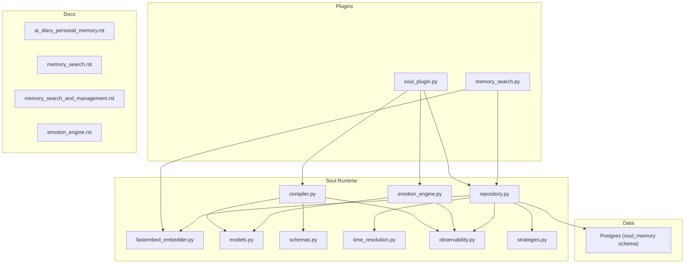

**Diagram sources**
- [compiler.py](file://core/soul/compiler.py)
- [emotion_engine.py](file://core/soul/emotion_engine.py)
- [repository.py](file://core/soul/repository.py)
- [fastembed_embedder.py](file://core/soul/fastembed_embedder.py)
- [models.py](file://core/soul/models.py)
- [schemas.py](file://core/soul/schemas.py)
- [strategies.py](file://core/soul/strategies.py)
- [time_resolution.py](file://core/soul/time_resolution.py)
- [observability.py](file://core/soul/observability.py)
- [soul_plugin.py](file://plugins/soul_plugin/soul_plugin.py)
- [memory_search.py](file://plugins/memory_search/memory_search.py)
- [bootstrap_soul_postgres.sh](file://scripts/bootstrap_soul_postgres.sh)
- [sql/soul_memory_postgres.sql](file://scripts/sql/soul_memory_postgres.sql)

**Section sources**
- [ai_diary_personal_memory.rst](file://docs/ai_diary_personal_memory.rst)
- [memory_search.rst](file://docs/memory_search.rst)
- [memory_search_and_management.rst](file://docs/memory_search_and_management.rst)
- [emotion_engine.rst](file://docs/emotion_engine.rst)

## Core Components
- Soul Compiler: Translates soul script expressions into executable operations and state updates. It validates syntax, resolves references, and emits structured actions consumed by the emotion engine and repository.
- Emotion Engine: Maintains and evolves emotion states over time. It reacts to events, applies personality-driven rules, and persists emotional context as part of the persona.
- Memory Repository: Provides CRUD and query interfaces for episodic and semantic memories. It coordinates embeddings, indexing, and consolidation pipelines.
- Embedding System: Converts textual content into vector representations using a fast local embedder for efficient similarity search.
- Temporal Context Manager: Normalizes timestamps and contextual windows to support time-aware retrieval and consolidation.
- Strategies: Pluggable policies for memory retention, decay, clustering, and consolidation.
- Observability: Metrics, tracing, and logging hooks for debugging and performance tuning.

**Section sources**
- [compiler.py](file://core/soul/compiler.py)
- [emotion_engine.py](file://core/soul/emotion_engine.py)
- [repository.py](file://core/soul/repository.py)
- [fastembed_embedder.py](file://core/soul/fastembed_embedder.py)
- [time_resolution.py](file://core/soul/time_resolution.py)
- [strategies.py](file://core/soul/strategies.py)
- [observability.py](file://core/soul/observability.py)

## Architecture Overview
The Memory & Soul System integrates at the agent layer via a plugin. The compiler transforms soul scripts into structured operations; the emotion engine updates personality-emotion state; the repository stores and indexes memories; and semantic search exposes retrieval APIs.

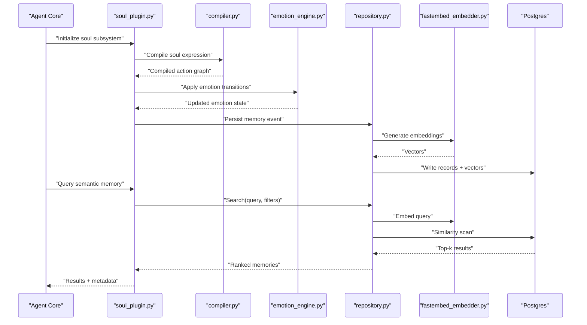

**Diagram sources**
- [soul_plugin.py](file://plugins/soul_plugin/soul_plugin.py)
- [compiler.py](file://core/soul/compiler.py)
- [emotion_engine.py](file://core/soul/emotion_engine.py)
- [repository.py](file://core/soul/repository.py)
- [fastembed_embedder.py](file://core/soul/fastembed_embedder.py)
- [sql/soul_memory_postgres.sql](file://scripts/sql/soul_memory_postgres.sql)

## Detailed Component Analysis

### Soul Compiler
The compiler parses and validates soul expressions, resolves variables and references, and produces an executable plan. It ensures type safety and consistency before emitting actions for downstream systems.

```mermaid
flowchart TD
Start(["Compile Entry"]) --> Parse["Parse Expression"]
Parse --> Validate{"Valid Syntax?"}
Validate --> |No| Error["Return Validation Error"]
Validate --> |Yes| Resolve["Resolve References"]
Resolve --> TypeCheck["Type Check & Constraints"]
TypeCheck --> Emit["Emit Action Plan"]
Emit --> End(["Compiled Plan"])
Error --> End
```

**Diagram sources**
- [compiler.py](file://core/soul/compiler.py)
- [schemas.py](file://core/soul/schemas.py)
- [models.py](file://core/soul/models.py)

**Section sources**
- [compiler.py](file://core/soul/compiler.py)
- [schemas.py](file://core/soul/schemas.py)
- [models.py](file://core/soul/models.py)

### Emotion Engine
The emotion engine maintains a dynamic affective state aligned with personality traits. It processes incoming signals, applies transition rules, and persists emotional context to influence future behavior and responses.

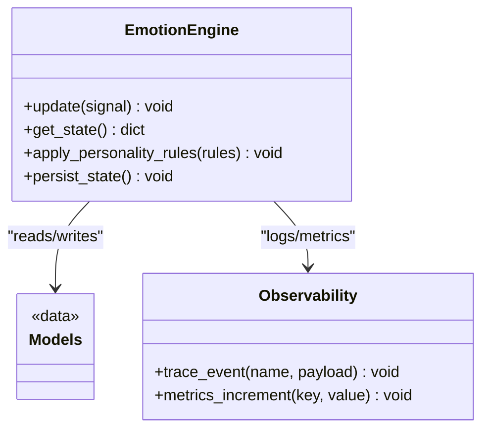

**Diagram sources**
- [emotion_engine.py](file://core/soul/emotion_engine.py)
- [models.py](file://core/soul/models.py)
- [observability.py](file://core/soul/observability.py)

**Section sources**
- [emotion_engine.py](file://core/soul/emotion_engine.py)
- [observability.py](file://core/soul/observability.py)

### Memory Repository
The repository abstracts storage, retrieval, and indexing of memories. It orchestrates embedding generation, similarity search, temporal filtering, and consolidation workflows.

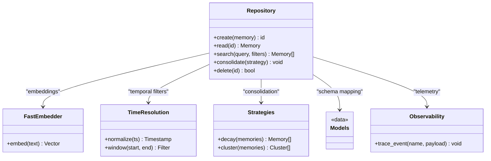

**Diagram sources**
- [repository.py](file://core/soul/repository.py)
- [fastembed_embedder.py](file://core/soul/fastembed_embedder.py)
- [time_resolution.py](file://core/soul/time_resolution.py)
- [strategies.py](file://core/soul/strategies.py)
- [models.py](file://core/soul/models.py)
- [observability.py](file://core/soul/observability.py)

**Section sources**
- [repository.py](file://core/soul/repository.py)
- [fastembed_embedder.py](file://core/soul/fastembed_embedder.py)
- [time_resolution.py](file://core/soul/time_resolution.py)
- [strategies.py](file://core/soul/strategies.py)
- [models.py](file://core/soul/models.py)
- [observability.py](file://core/soul/observability.py)

### Semantic Search Capabilities
Semantic search converts natural language queries into embeddings and performs similarity scans against stored memory vectors. Filters can include temporal windows, tags, and entity scopes.

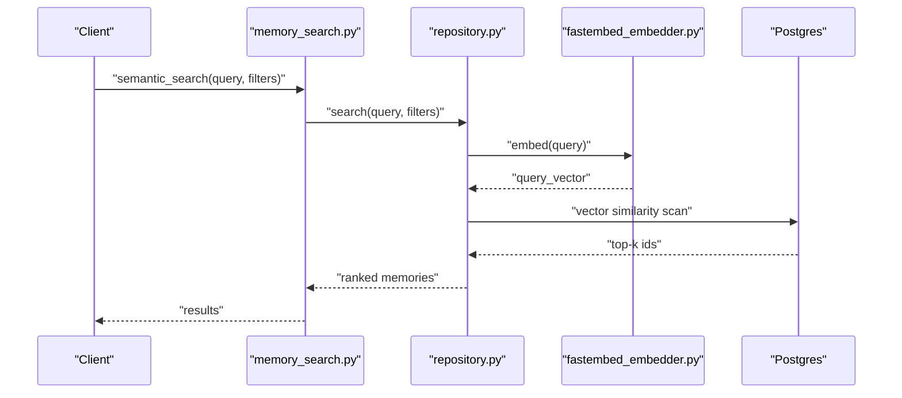

**Diagram sources**
- [memory_search.py](file://plugins/memory_search/memory_search.py)
- [repository.py](file://core/soul/repository.py)
- [fastembed_embedder.py](file://core/soul/fastembed_embedder.py)
- [sql/soul_memory_postgres.sql](file://scripts/sql/soul_memory_postgres.sql)

**Section sources**
- [memory_search.py](file://plugins/memory_search/memory_search.py)
- [memory_search.rst](file://docs/memory_search.rst)
- [memory_search_and_management.rst](file://docs/memory_search_and_management.rst)

### Memory Consolidation Strategies
Consolidation reduces noise, merges related memories, and promotes long-term retention based on importance and recency. Strategies are pluggable and can be tuned per domain.

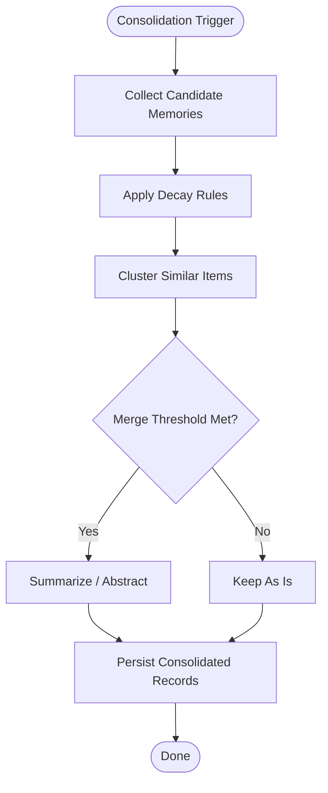

**Diagram sources**
- [strategies.py](file://core/soul/strategies.py)
- [repository.py](file://core/soul/repository.py)

**Section sources**
- [strategies.py](file://core/soul/strategies.py)
- [repository.py](file://core/soul/repository.py)

### Temporal Context Management
Temporal context normalizes timestamps and supports windowed queries. It enables time-aware retrieval and influences consolidation decisions.

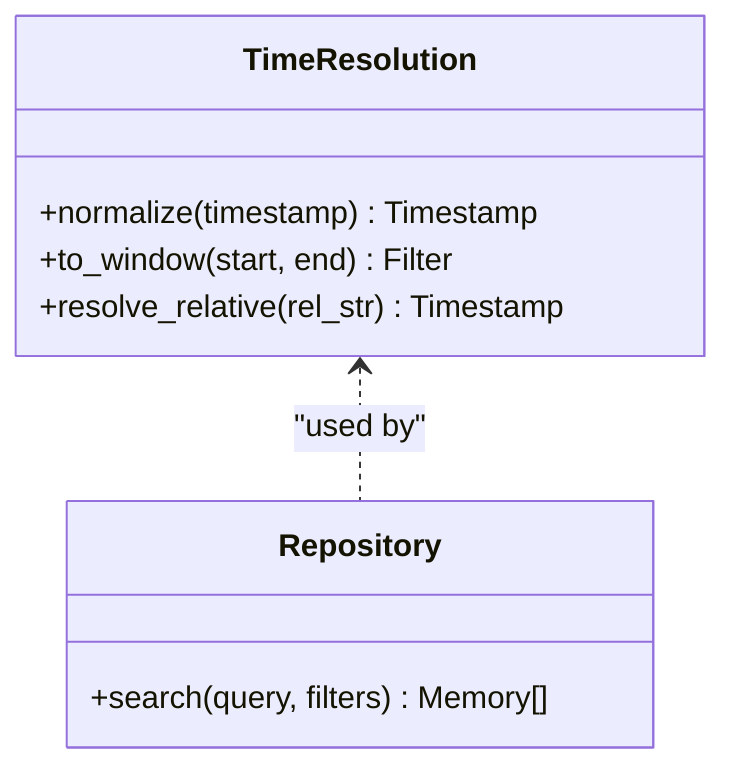

**Diagram sources**
- [time_resolution.py](file://core/soul/time_resolution.py)
- [repository.py](file://core/soul/repository.py)

**Section sources**
- [time_resolution.py](file://core/soul/time_resolution.py)
- [repository.py](file://core/soul/repository.py)

### Relationship Between Soul Scripts, Emotion States, and Personality Persistence
Soul scripts define behavioral intentions and memory triggers. The compiler translates them into actions that update emotion states and persist relevant memories. Personality persistence ensures continuity across sessions by storing emotion baselines and trait modifiers.

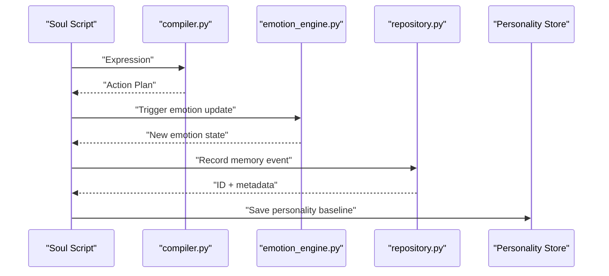

**Diagram sources**
- [compiler.py](file://core/soul/compiler.py)
- [emotion_engine.py](file://core/soul/emotion_engine.py)
- [repository.py](file://core/soul/repository.py)

**Section sources**
- [compiler.py](file://core/soul/compiler.py)
- [emotion_engine.py](file://core/soul/emotion_engine.py)
- [repository.py](file://core/soul/repository.py)

### Data Flow: Creation, Storage, Retrieval, and Consolidation
Memories flow from creation through embedding, storage, retrieval, and periodic consolidation.

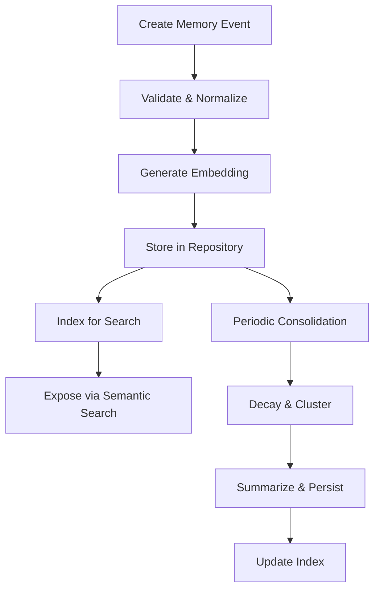

**Diagram sources**
- [repository.py](file://core/soul/repository.py)
- [fastembed_embedder.py](file://core/soul/fastembed_embedder.py)
- [strategies.py](file://core/soul/strategies.py)

**Section sources**
- [repository.py](file://core/soul/repository.py)
- [fastembed_embedder.py](file://core/soul/fastembed_embedder.py)
- [strategies.py](file://core/soul/strategies.py)

## Dependency Analysis
The soul subsystem has clear boundaries:
- Plugins depend on core modules for functionality
- Repository depends on embedder, time resolution, and strategies
- Compiler depends on models and schemas
- Observability is cross-cutting

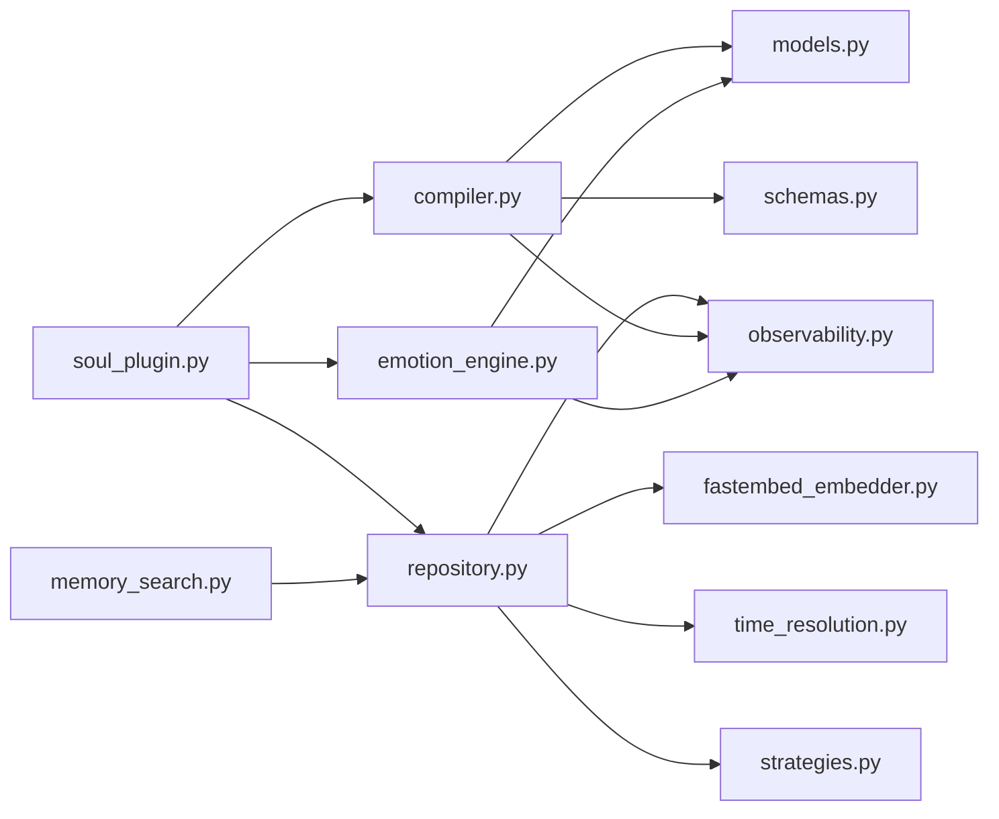

**Diagram sources**
- [soul_plugin.py](file://plugins/soul_plugin/soul_plugin.py)
- [memory_search.py](file://plugins/memory_search/memory_search.py)
- [compiler.py](file://core/soul/compiler.py)
- [emotion_engine.py](file://core/soul/emotion_engine.py)
- [repository.py](file://core/soul/repository.py)
- [fastembed_embedder.py](file://core/soul/fastembed_embedder.py)
- [time_resolution.py](file://core/soul/time_resolution.py)
- [strategies.py](file://core/soul/strategies.py)
- [models.py](file://core/soul/models.py)
- [schemas.py](file://core/soul/schemas.py)
- [observability.py](file://core/soul/observability.py)

**Section sources**
- [soul_plugin.py](file://plugins/soul_plugin/soul_plugin.py)
- [memory_search.py](file://plugins/memory_search/memory_search.py)
- [compiler.py](file://core/soul/compiler.py)
- [emotion_engine.py](file://core/soul/emotion_engine.py)
- [repository.py](file://core/soul/repository.py)
- [fastembed_embedder.py](file://core/soul/fastembed_embedder.py)
- [time_resolution.py](file://core/soul/time_resolution.py)
- [strategies.py](file://core/soul/strategies.py)
- [models.py](file://core/soul/models.py)
- [schemas.py](file://core/soul/schemas.py)
- [observability.py](file://core/soul/observability.py)

## Performance Considerations
- Use batched embedding generation for high-throughput ingestion.
- Configure index size and top-k thresholds to balance latency and recall.
- Apply decay and clustering aggressively during off-peak hours.
- Cache frequent query embeddings and result sets where appropriate.
- Monitor observability metrics to identify bottlenecks in embedding or search paths.

[No sources needed since this section provides general guidance]

## Troubleshooting Guide
Common issues and diagnostics:
- Compilation errors: Inspect validation logs and schema mismatches.
- Search failures: Verify embedding model availability and vector index health.
- Consolidation stalls: Check strategy configuration and database locks.
- Emotion state drift: Review personality rule updates and persistence integrity.

Use observability hooks to trace events and collect metrics for each stage.

**Section sources**
- [observability.py](file://core/soul/observability.py)
- [compiler.py](file://core/soul/compiler.py)
- [repository.py](file://core/soul/repository.py)
- [emotion_engine.py](file://core/soul/emotion_engine.py)

## Conclusion
The Memory & Soul System provides a robust foundation for persistent personality, emotion dynamics, and semantic memory. By separating concerns across compiler, emotion engine, repository, and embedder, it achieves modularity, scalability, and extensibility. Proper configuration of strategies and temporal context ensures meaningful long-term behavior and retrieval quality.

[No sources needed since this section summarizes without analyzing specific files]

## Appendices

### Database Setup and Schema
Bootstrap the Postgres schema for soul memory and ensure vector indexing is enabled.

**Section sources**
- [bootstrap_soul_postgres.sh](file://scripts/bootstrap_soul_postgres.sh)
- [sql/soul_memory_postgres.sql](file://scripts/sql/soul_memory_postgres.sql)

### Documentation References
Conceptual guides provide additional context on memory, emotion engine, and search usage.

**Section sources**
- [ai_diary_personal_memory.rst](file://docs/ai_diary_personal_memory.rst)
- [memory_search.rst](file://docs/memory_search.rst)
- [memory_search_and_management.rst](file://docs/memory_search_and_management.rst)
- [emotion_engine.rst](file://docs/emotion_engine.rst)