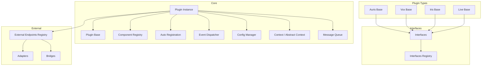
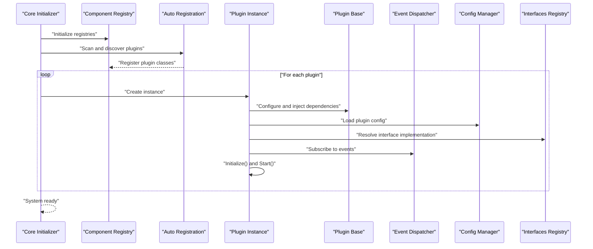
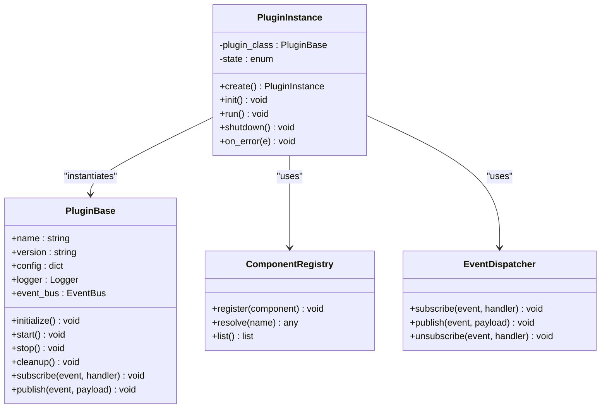
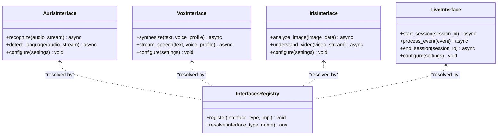
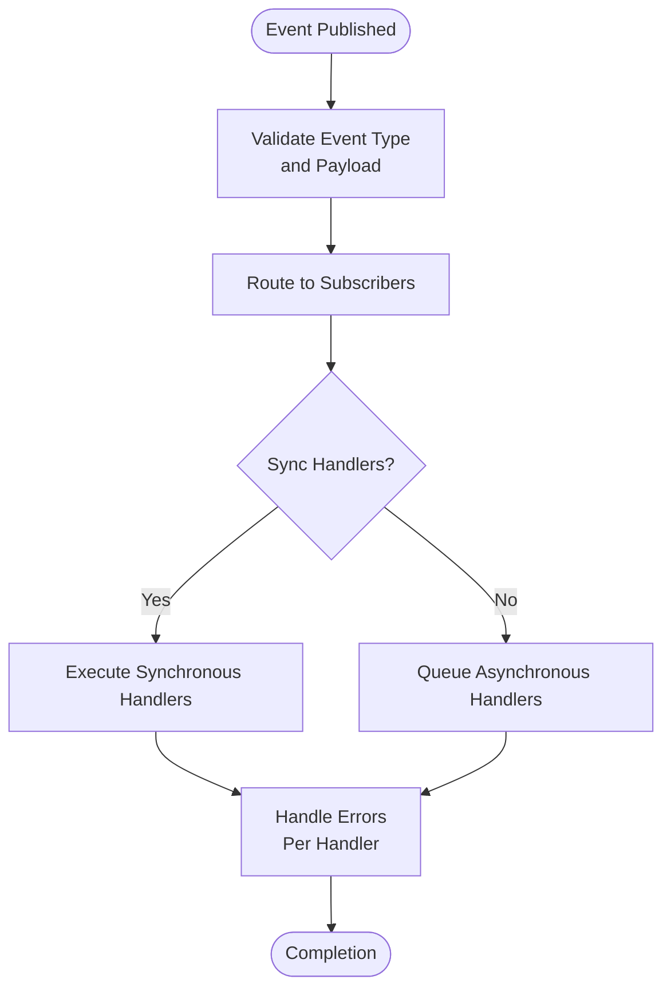
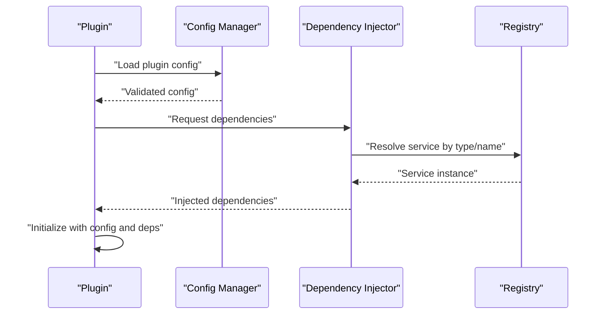
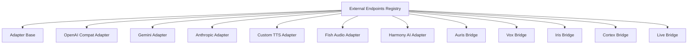

# Plugin System Design

<cite>
**Referenced Files in This Document**
- [core/plugin_base.py](file://core/plugin_base.py)
- [core/plugin_instance.py](file://core/plugin_instance.py)
- [core/component_registry.py](file://core/component_registry.py)
- [core/component_auto_registration.py](file://core/component_auto_registration.py)
- [core/event_dispatcher.py](file://core/event_dispatcher.py)
- [core/ai_plugin_base.py](file://core/ai_plugin_base.py)
- [plugins/auris_base.py](file://plugins/auris_base.py)
- [plugins/vox_base.py](file://plugins/vox_base.py)
- [plugins/iris_base.py](file://plugins/iris_base.py)
- [plugins/live_base.py](file://plugins/live_base.py)
- [core/core_initializer.py](file://core/core_initializer.py)
- [core/config_manager.py](file://core/config_manager.py)
- [core/interfaces.py](file://core/interfaces.py)
- [core/interfaces_registry.py](file://core/interfaces_registry.py)
- [core/transport_layer.py](file://core/transport_layer.py)
- [core/message_queue.py](file://core/message_queue.py)
- [core/rate_limit.py](file://core/rate_limit.py)
- [core/logging_utils.py](file://core/logging_utils.py)
- [core/synth_core_memory.py](file://core/synth_core_memory.py)
- [core/agent_core.py](file://core/agent_core.py)
- [core/agent_router.py](file://core/agent_router.py)
- [core/agent_tool_executor.py](file://core/agent_tool_executor.py)
- [core/tool_registry.py](file://core/tool_registry.py)
- [core/validation_registry.py](file://core/validation_registry.py)
- [core/prompt_engine.py](file://core/prompt_engine.py)
- [core/prompt_renderers.py](file://core/prompt_renderers.py)
- [core/prompt_request.py](file://core/prompt_request.py)
- [core/llm_registry.py](file://core/llm_registry.py)
- [core/model_manager.py](file://core/model_manager.py)
- [core/session_meta.py](file://core/session_meta.py)
- [core/chat_context_manager.py](file://core/chat_context_manager.py)
- [core/external_endpoints/registry.py](file://core/external_endpoints/registry.py)
- [core/external_endpoints/models.py](file://core/external_endpoints/models.py)
- [core/external_endpoints/action_grammar.py](file://core/external_endpoints/action_grammar.py)
- [core/external_endpoints/crypto.py](file://core/external_endpoints/crypto.py)
- [core/external_endpoints/probe.py](file://core/external_endpoints/probe.py)
- [core/external_endpoints/adapters/base.py](file://core/external_endpoints/adapters/base.py)
- [core/external_endpoints/adapters/openai_compat.py](file://core/external_endpoints/adapters/openai_compat.py)
- [core/external_endpoints/adapters/gemini_adapter.py](file://core/external_endpoints/adapters/gemini_adapter.py)
- [core/external_endpoints/adapters/anthropic_adapter.py](file://core/external_endpoints/adapters/anthropic_adapter.py)
- [core/external_endpoints/adapters/custom_tts_adapter.py](file://core/external_endpoints/adapters/custom_tts_adapter.py)
- [core/external_endpoints/adapters/fish_audio_adapter.py](file://core/external_endpoints/adapters/fish_audio_adapter.py)
- [core/external_endpoints/adapters/harmony_ai_adapter.py](file://core/external_endpoints/adapters/harmony_ai_adapter.py)
- [core/external_endpoints/bridges/auris_bridge.py](file://core/external_endpoints/bridges/auris_bridge.py)
- [core/external_endpoints/bridges/vox_bridge.py](file://core/external_endpoints/bridges/vox_bridge.py)
- [core/external_endpoints/bridges/iris_bridge.py](file://core/external_endpoints/bridges/iris_bridge.py)
- [core/external_endpoints/bridges/cortex_bridge.py](file://core/external_endpoints/bridges/cortex_bridge.py)
- [core/external_endpoints/bridges/live_bridge.py](file://core/external_endpoints/bridges/live_bridge.py)
- [core/mcp_bridge/client.py](file://core/mcp_bridge/client.py)
- [core/mcp_bridge/server.py](file://core/mcp_bridge/server.py)
- [core/mcp_bridge/config.py](file://core/mcp_bridge/config.py)
- [core/webui.py](file://core/webui.py)
- [core/abstract_context.py](file://core/abstract_context.py)
- [core/context.py](file://core/context.py)
- [core/variables_engine.py](file://core/variables_engine.py)
- [core/message_chain.py](file://core/message_chain.py)
- [core/message_sender.py](file://core/message_sender.py)
- [core/response_proxy.py](file://core/response_proxy.py)
- [core/say_proxy.py](file://core/say_proxy.py)
- [core/media_dispatcher.py](file://core/media_dispatcher.py)
- [core/karada_transport.py](file://core/karada_transport.py)
- [core/karada_ws_transport.py](file://core/karada_ws_transport.py)
- [core/vessel_beat.py](file://core/vessel_beat.py)
- [core/vessel_focus.py](file://core/vessel_focus.py)
- [core/vessel_session_manager.py](file://core/vessel_session_manager.py)
- [core/vessel_registry.py](file://core/vessel_registry.py)
- [core/vessel_diary_compactor.py](file://core/vessel_diary_compactor.py)
- [core/history_engine.py](file://core/history_engine.py)
- [core/reaction_handler.py](file://core/reaction_handler.py)
- [core/auto_response.py](file://core/auto_response.py)
- [core/trip_processor.py](file://core/trigger_processor.py)
- [core/beat_utils.py](file://core/beat_utils.py)
- [core/calendar_utils.py](file://core/calendar_utils.py)
- [core/chat_archives.py](file://core/chat_archives.py)
- [core/chat_archives_db.py](file://core/chat_archives_db.py)
- [core/chat_attention.py](file://core/chat_attention.py)
- [core/chat_history_cache.py](file://core/chat_history_cache.py)
- [core/chat_update_checker.py](file://core/chat_update_checker.py)
- [core/command_registry.py](file://core/command_registry.py)
- [core/corrector_utils.py](file://core/corrector_utils.py)
- [core/cortex_api_logger.py](file://core/cortex_api_logger.py)
- [core/db.py](file://core/db.py)
- [core/db_backends.py](file://core/db_backends.py)
- [core/db_backup.py](file://core/db_backup.py)
- [core/db_cutover.py](file://core/db_cutover.py)
- [core/debrief.py](file://core/debrief.py)
- [core/external_calendars.py](file://core/external_calendars.py)
- [core/facial_expression_parser.py](file://core/facial_expression_parser.py)
- [core/genai_client_utils.py](file://core/genai_client_utils.py)
- [core/generic_commands.py](file://core/generic_commands.py)
- [core/growth_state.py](file://core/growth_state.py)
- [core/history_types.py](file://core/history_types.py)
- [core/image_processor.py](file://core/image_processor.py)
- [core/interface_adapters.py](file://core/interface_adapters.py)
- [core/interface_path_utils.py](file://core/interface_path_utils.py)
- [core/interface_paths.py](file://core/interface_paths.py)
- [core/json_utils.py](file://core/json_utils.py)
- [core/karada_api.py](file://core/karada_api.py)
- [core/karada_touch_events.py](file://core/karada_touch_events.py)
- [core/languages.py](file://core/languages.py)
- [core/live_api_logger.py](file://core/live_api_logger.py)
- [core/live_registry.py](file://core/live_registry.py)
- [core/live_session_manager.py](file://core/live_session_manager.py)
- [core/live_tool_executor.py](file://core/live_tool_executor.py)
- [core/live_tool_registry.py](file://core/live_tool_registry.py)
- [core/llm_failure_log.py](file://core/llm_failure_log.py)
- [core/log_archive.py](file://core/log_archive.py)
- [core/main_db_migration.py](file://core/main_db_migration.py)
- [core/media_extract.py](file://core/media_extract.py)
- [core/media_url_utils.py](file://core/media_url_utils.py)
- [core/mention_utils.py](file://core/mention_utils.py)
- [core/migrations.py](file://core/migrations.py)
- [core/model_config.json](file://core/model_config.json)
- [core/multimodal_attachment.py](file://core/multimodal_attachment.py)
- [core/notifier.py](file://core/notifier.py)
- [core/outbound_file_utils.py](file://core/outbound_file_utils.py)
- [core/peer_policy.py](file://core/peer_policy.py)
- [core/persona_manager.py](file://core/persona_manager.py)
- [core/presence_manager.py](file://core/presence_manager.py)
- [core/prompt_engine_json_prompt.rst](file://docs/prompt_engine_json_prompt.rst)
- [core/prompt_engine_time.rst](file://docs/prompt_engine_time.rst)
- [core/prompt_pipeline.rst](file://docs/prompt_pipeline.rst)
- [core/plugins.rst](file://docs/plugins.rst)
- [core/architecture.rst](file://docs/architecture.rst)
- [core/grillo_plugin.rst](file://docs/grillo_plugin.rst)
- [core/auris_vox.rst](file://docs/auris_vox.rst)
- [core/fluxer_interface.rst](file://docs/fluxer_interface.rst)
- [core/matrix_interface.rst](file://docs/matrix_interface.rst)
- [core/discord_interface.rst](file://docs/discord_interface.rst)
- [core/telegram_bot.rst](file://docs/telegram_bot.rst)
- [core/openai_api_server.rst](file://docs/openai_api_server.rst)
- [core/llm_engines.rst](file://docs/llm_engines.rst)
- [core/external_endpoints.rst](file://docs/external_endpoints.rst)
- [core/mcp.rst](file://docs/mcp.rst)
- [core/webui_archives.md](file://docs/webui_archives.md)
- [core/webui_controls.rst](file://docs/webui_controls.rst)
- [core/webui_debug.rst](file://docs/webui_debug.rst)
- [core/webui_desktop_iframe.rst](file://docs/webui_desktop_iframe.rst)
- [core/windows.rst](file://docs/windows.rst)
- [core/window_manager.rst](file:///docs/window_manager.rst]
</cite>

## Table of Contents
1. [Introduction](#introduction)
2. [Project Structure](#project-structure)
3. [Core Components](#core-components)
4. [Architecture Overview](#architecture-overview)
5. [Detailed Component Analysis](#detailed-component-analysis)
6. [Dependency Analysis](#dependency-analysis)
7. [Performance Considerations](#performance-considerations)
8. [Troubleshooting Guide](#troubleshooting-guide)
9. [Conclusion](#conclusion)
10. [Appendices](#appendices)

## Introduction
This document describes the architecture and design of Synthetic Heart’s plugin system. It explains how plugins are discovered, loaded, initialized, and cleaned up; how they communicate with the core via an event-driven model; and how interface abstractions enable different plugin types such as Auris (speech-to-text), Vox (text-to-speech), Iris (vision), and Live engines. It also covers dependency injection, configuration management, security and isolation considerations, and performance characteristics.

## Project Structure
The plugin system is implemented across several layers:
- Core plugin infrastructure: base classes, instance lifecycle, registries, and auto-registration
- Interface abstraction layer: typed interfaces for plugin categories (Auris, Vox, Iris, Live)
- Event bus and messaging: asynchronous event dispatching and message queues
- Configuration and context: centralized config access, per-plugin contexts, and shared memory
- External endpoints and bridges: adapters and bridges that integrate third-party services
- Tool and command registries: plugin-provided tools and commands exposed to the agent runtime

**Diagram sources**
- [core/plugin_base.py](file://core/plugin_base.py)
- [core/plugin_instance.py](file://core/plugin_instance.py)
- [core/component_registry.py](file://core/component_registry.py)
- [core/component_auto_registration.py](file://core/component_auto_registration.py)
- [core/event_dispatcher.py](file://core/event_dispatcher.py)
- [core/config_manager.py](file://core/config_manager.py)
- [core/interfaces.py](file://core/interfaces.py)
- [core/interfaces_registry.py](file://core/interfaces_registry.py)
- [plugins/auris_base.py](file://plugins/auris_base.py)
- [plugins/vox_base.py](file://plugins/vox_base.py)
- [plugins/iris_base.py](file://plugins/iris_base.py)
- [plugins/live_base.py](file://plugins/live_base.py)
- [core/external_endpoints/registry.py](file://core/external_endpoints/registry.py)
- [core/external_endpoints/adapters/base.py](file://core/external_endpoints/adapters/base.py)
- [core/external_endpoints/bridges/auris_bridge.py](file://core/external_endpoints/bridges/auris_bridge.py)

**Section sources**
- [core/plugin_base.py](file://core/plugin_base.py)
- [core/plugin_instance.py](file://core/plugin_instance.py)
- [core/component_registry.py](file://core/component_registry.py)
- [core/component_auto_registration.py](file://core/component_auto_registration.py)
- [core/event_dispatcher.py](file://core/event_dispatcher.py)
- [core/config_manager.py](file://core/config_manager.py)
- [core/interfaces.py](file://core/interfaces.py)
- [core/interfaces_registry.py](file://core/interfaces_registry.py)
- [plugins/auris_base.py](file://plugins/auris_base.py)
- [plugins/vox_base.py](file://plugins/vox_base.py)
- [plugins/iris_base.py](file://plugins/iris_base.py)
- [plugins/live_base.py](file://plugins/live_base.py)
- [core/external_endpoints/registry.py](file://core/external_endpoints/registry.py)

## Core Components
- Plugin Base: Defines common lifecycle hooks, configuration access, logging, and event subscription utilities for all plugins.
- Plugin Instance: Manages instantiation, initialization, readiness, shutdown, and resource cleanup.
- Component Registry: Central registry for discovering and accessing components and plugins by type or name.
- Auto Registration: Scans modules and registers plugin classes automatically based on conventions or decorators.
- Event Dispatcher: Publishes and subscribes to events, enabling decoupled communication between plugins and core.
- Interfaces and Interfaces Registry: Typed contracts for plugin categories and a registry to resolve implementations.
- Config Manager: Provides structured configuration access with defaults, validation, and hot-reload support.
- Context and Abstract Context: Per-plugin and global contexts for state sharing and dependency injection.

Key responsibilities:
- Lifecycle phases: discovery, load, initialize, start, run, stop, cleanup
- Dependency injection: inject configs, services, and other plugins into plugin instances
- Event-driven communication: publish domain events and subscribe to core/system events
- Isolation: per-plugin configuration, scoped logging, and controlled access to shared resources

**Section sources**
- [core/plugin_base.py](file://core/plugin_base.py)
- [core/plugin_instance.py](file://core/plugin_instance.py)
- [core/component_registry.py](file://core/component_registry.py)
- [core/component_auto_registration.py](file://core/component_auto_registration.py)
- [core/event_dispatcher.py](file://core/event_dispatcher.py)
- [core/interfaces.py](file://core/interfaces.py)
- [core/interfaces_registry.py](file://core/interfaces_registry.py)
- [core/config_manager.py](file://core/config_manager.py)
- [core/abstract_context.py](file://core/abstract_context.py)
- [core/context.py](file://core/context.py)

## Architecture Overview
The plugin system follows a layered architecture:
- Core Layer: orchestrates lifecycle, provides registries, event bus, configuration, and shared context
- Interface Abstraction: defines contracts for plugin categories (Auris, Vox, Iris, Live)
- Plugin Implementations: concrete plugins implementing category interfaces and integrating with external systems
- External Integration: adapters and bridges connecting to third-party APIs and protocols

**Diagram sources**
- [core/core_initializer.py](file://core/core_initializer.py)
- [core/component_registry.py](file://core/component_registry.py)
- [core/component_auto_registration.py](file://core/component_auto_registration.py)
- [core/plugin_instance.py](file://core/plugin_instance.py)
- [core/plugin_base.py](file://core/plugin_base.py)
- [core/event_dispatcher.py](file://core/event_dispatcher.py)
- [core/config_manager.py](file://core/config_manager.py)
- [core/interfaces_registry.py](file://core/interfaces_registry.py)

## Detailed Component Analysis

### Plugin Base and Instance Lifecycle
The plugin base class standardizes lifecycle methods and utilities:
- Discovery and registration metadata
- Configuration loading and validation
- Logging and observability hooks
- Event subscription and publishing helpers
- Resource acquisition and release patterns

The plugin instance manages:
- Creation and dependency injection
- Initialization sequence (pre-init, init, post-init)
- Startup and shutdown coordination
- Error handling and graceful degradation
- Cleanup of threads, connections, and temporary files

**Diagram sources**
- [core/plugin_base.py](file://core/plugin_base.py)
- [core/plugin_instance.py](file://core/plugin_instance.py)
- [core/component_registry.py](file://core/component_registry.py)
- [core/event_dispatcher.py](file://core/event_dispatcher.py)

**Section sources**
- [core/plugin_base.py](file://core/plugin_base.py)
- [core/plugin_instance.py](file://core/plugin_instance.py)

### Interface Abstraction Layer
Interface definitions provide typed contracts for plugin categories:
- Auris: speech-to-text recognition, language detection, streaming audio input
- Vox: text-to-speech synthesis, voice profiles, streaming audio output
- Iris: vision processing, image/video understanding, multimodal inputs
- Live: real-time interaction sessions, live tool execution, session lifecycle

The interfaces registry resolves implementations by name or capability, enabling dynamic selection and hot-swapping.

**Diagram sources**
- [core/interfaces.py](file://core/interfaces.py)
- [core/interfaces_registry.py](file://core/interfaces_registry.py)
- [plugins/auris_base.py](file://plugins/auris_base.py)
- [plugins/vox_base.py](file://plugins/vox_base.py)
- [plugins/iris_base.py](file://plugins/iris_base.py)
- [plugins/live_base.py](file://plugins/live_base.py)

**Section sources**
- [core/interfaces.py](file://core/interfaces.py)
- [core/interfaces_registry.py](file://core/interfaces_registry.py)
- [plugins/auris_base.py](file://plugins/auris_base.py)
- [plugins/vox_base.py](file://plugins/vox_base.py)
- [plugins/iris_base.py](file://plugins/iris_base.py)
- [plugins/live_base.py](file://plugins/live_base.py)

### Event-Driven Communication Model
Plugins communicate with the core and each other through an event bus:
- Events are typed and include payloads with metadata
- Subscribers can be synchronous or asynchronous handlers
- The dispatcher ensures delivery order and error isolation
- Plugins can publish domain events (e.g., message_received, tts_started) and subscribe to system events (e.g., config_changed, session_started)

**Diagram sources**
- [core/event_dispatcher.py](file://core/event_dispatcher.py)
- [core/message_queue.py](file://core/message_queue.py)

**Section sources**
- [core/event_dispatcher.py](file://core/event_dispatcher.py)
- [core/message_queue.py](file://core/message_queue.py)

### Configuration Management and Dependency Injection
Configuration is managed centrally:
- Structured schemas with defaults and validation
- Environment variable overrides and file-based settings
- Hot-reload support for dynamic updates
- Per-plugin configuration namespaces

Dependency injection is provided via:
- Constructor injection for services and configs
- Contextual access to shared resources
- Lazy initialization of heavy dependencies
- Capability-based resolution through registries

**Diagram sources**
- [core/config_manager.py](file://core/config_manager.py)
- [core/abstract_context.py](file://core/abstract_context.py)
- [core/context.py](file://core/context.py)
- [core/component_registry.py](file://core/component_registry.py)

**Section sources**
- [core/config_manager.py](file://core/config_manager.py)
- [core/abstract_context.py](file://core/abstract_context.py)
- [core/context.py](file://core/context.py)
- [core/component_registry.py](file://core/component_registry.py)

### External Endpoints and Bridges
External integrations are abstracted via:
- Adapters: standardized clients for LLM providers and TTS services
- Bridges: protocol-specific connectors for Auris, Vox, Iris, Cortex, and Live systems
- Crypto utilities: secure handling of tokens and secrets
- Probe utilities: health checks and capability discovery

**Diagram sources**
- [core/external_endpoints/registry.py](file://core/external_endpoints/registry.py)
- [core/external_endpoints/adapters/base.py](file://core/external_endpoints/adapters/base.py)
- [core/external_endpoints/adapters/openai_compat.py](file://core/external_endpoints/adapters/openai_compat.py)
- [core/external_endpoints/adapters/gemini_adapter.py](file://core/external_endpoints/adapters/gemini_adapter.py)
- [core/external_endpoints/adapters/anthropic_adapter.py](file://core/external_endpoints/adapters/anthropic_adapter.py)
- [core/external_endpoints/adapters/custom_tts_adapter.py](file://core/external_endpoints/adapters/custom_tts_adapter.py)
- [core/external_endpoints/adapters/fish_audio_adapter.py](file://core/external_endpoints/adapters/fish_audio_adapter.py)
- [core/external_endpoints/adapters/harmony_ai_adapter.py](file://core/external_endpoints/adapters/harmony_ai_adapter.py)
- [core/external_endpoints/bridges/auris_bridge.py](file://core/external_endpoints/bridges/auris_bridge.py)
- [core/external_endpoints/bridges/vox_bridge.py](file://core/external_endpoints/bridges/vox_bridge.py)
- [core/external_endpoints/bridges/iris_bridge.py](file://core/external_endpoints/bridges/iris_bridge.py)
- [core/external_endpoints/bridges/cortex_bridge.py](file://core/external_endpoints/bridges/cortex_bridge.py)
- [core/external_endpoints/bridges/live_bridge.py](file://core/external_endpoints/bridges/live_bridge.py)

**Section sources**
- [core/external_endpoints/registry.py](file://core/external_endpoints/registry.py)
- [core/external_endpoints/adapters/base.py](file://core/external_endpoints/adapters/base.py)
- [core/external_endpoints/adapters/openai_compat.py](file://core/external_endpoints/adapters/openai_compat.py)
- [core/external_endpoints/adapters/gemini_adapter.py](file://core/external_endpoints/adapters/gemini_adapter.py)
- [core/external_endpoints/adapters/anthropic_adapter.py](file://core/external_endpoints/adapters/anthropic_adapter.py)
- [core/external_endpoints/adapters/custom_tts_adapter.py](file://core/external_endpoints/adapters/custom_tts_adapter.py)
- [core/external_endpoints/adapters/fish_audio_adapter.py](file://core/external_endpoints/adapters/fish_audio_adapter.py)
- [core/external_endpoints/adapters/harmony_ai_adapter.py](file://core/external_endpoints/adapters/harmony_ai_adapter.py)
- [core/external_endpoints/bridges/auris_bridge.py](file://core/external_endpoints/bridges/auris_bridge.py)
- [core/external_endpoints/bridges/vox_bridge.py](file://core/external_endpoints/bridges/vox_bridge.py)
- [core/external_endpoints/bridges/iris_bridge.py](file://core/external_endpoints/bridges/iris_bridge.py)
- [core/external_endpoints/bridges/cortex_bridge.py](file://core/external_endpoints/bridges/cortex_bridge.py)
- [core/external_endpoints/bridges/live_bridge.py](file://core/external_endpoints/bridges/live_bridge.py)

### Plugin Development Patterns
Common patterns for building plugins:
- Inherit from appropriate base class (Auris, Vox, Iris, Live)
- Implement required interface methods with async where needed
- Use configuration manager for settings and validation
- Subscribe to relevant events and publish domain events
- Leverage dependency injection for services and shared state
- Follow lifecycle best practices (initialize, start, stop, cleanup)

Examples of development patterns:
- Streaming audio processing for Auris/Vox
- Session management for Live plugins
- Vision pipeline composition for Iris
- Tool registration and command exposure

**Section sources**
- [plugins/auris_base.py](file://plugins/auris_base.py)
- [plugins/vox_base.py](file://plugins/vox_base.py)
- [plugins/iris_base.py](file://plugins/iris_base.py)
- [plugins/live_base.py](file://plugins/live_base.py)
- [core/tool_registry.py](file://core/tool_registry.py)
- [core/command_registry.py](file://core/command_registry.py)

### Security, Isolation, and Performance
Security considerations:
- Input validation and sanitization for all plugin inputs
- Secure handling of credentials and API keys
- Rate limiting and throttling for external calls
- Permission scoping for plugin capabilities

Isolation strategies:
- Per-plugin configuration namespaces
- Scoped logging and metrics collection
- Controlled access to shared resources via context
- Error boundaries to prevent cascade failures

Performance optimizations:
- Async I/O for network-bound operations
- Connection pooling for database and API clients
- Caching strategies for expensive computations
- Backpressure handling in streaming pipelines
- Resource cleanup and garbage collection awareness

**Section sources**
- [core/rate_limit.py](file://core/rate_limit.py)
- [core/logging_utils.py](file://core/logging_utils.py)
- [core/synth_core_memory.py](file://core/synth_core_memory.py)
- [core/transport_layer.py](file://core/transport_layer.py)

## Dependency Analysis
The plugin system has clear dependency boundaries:
- Core depends on registries, event bus, and configuration
- Plugins depend on interfaces and core services
- External adapters depend on third-party SDKs
- Bridges depend on protocol-specific libraries

```mermaid
graph TB
CORE["Core Initializer"]
REG["Component Registry"]
AUTO["Auto Registration"]
INST["Plugin Instance"]
BASE["Plugin Base"]
IFACE["Interfaces"]
EXT["External Endpoints"]
ADAPT["Adapters"]
BRDG["Bridges"]
CORE --> REG
CORE --> AUTO
CORE --> INST
INST --> BASE
BASE --> IFACE
INST --> EXT
EXT --> ADAPT
EXT --> BRDG
```

**Diagram sources**
- [core/core_initializer.py](file://core/core_initializer.py)
- [core/component_registry.py](file://core/component_registry.py)
- [core/component_auto_registration.py](file://core/component_auto_registration.py)
- [core/plugin_instance.py](file://core/plugin_instance.py)
- [core/plugin_base.py](file://core/plugin_base.py)
- [core/interfaces.py](file://core/interfaces.py)
- [core/external_endpoints/registry.py](file://core/external_endpoints/registry.py)

**Section sources**
- [core/core_initializer.py](file://core/core_initializer.py)
- [core/component_registry.py](file://core/component_registry.py)
- [core/component_auto_registration.py](file://core/component_auto_registration.py)
- [core/plugin_instance.py](file://core/plugin_instance.py)
- [core/plugin_base.py](file://core/plugin_base.py)
- [core/interfaces.py](file://core/interfaces.py)
- [core/external_endpoints/registry.py](file://core/external_endpoints/registry.py)

## Performance Considerations
- Use asynchronous patterns for I/O-bound operations to maximize throughput
- Implement connection pooling for database and HTTP clients
- Cache frequently accessed data with appropriate invalidation strategies
- Monitor memory usage and implement proper cleanup in long-running plugins
- Profile critical paths and optimize hot loops
- Use backpressure mechanisms to handle high-volume event streams
- Implement graceful degradation when external services are unavailable

[No sources needed since this section provides general guidance]

## Troubleshooting Guide
Common issues and solutions:
- Plugin not loading: Check registration and import paths
- Configuration errors: Validate schema and environment variables
- Event not received: Verify subscriptions and event names
- Memory leaks: Ensure proper cleanup in stop/cleanup methods
- Performance bottlenecks: Profile async operations and external calls
- Security violations: Review input validation and credential handling

Debugging utilities:
- Enhanced logging with structured formats
- Health check endpoints for plugin status
- Metrics collection for performance monitoring
- Error tracing and stack capture

**Section sources**
- [core/logging_utils.py](file://core/logging_utils.py)
- [core/event_dispatcher.py](file://core/event_dispatcher.py)
- [core/config_manager.py](file://core/config_manager.py)

## Conclusion
Synthetic Heart’s plugin system provides a robust, extensible architecture for building modular AI capabilities. Through well-defined interfaces, comprehensive lifecycle management, and an event-driven communication model, it enables developers to create powerful plugins for speech, vision, text-to-speech, and real-time interactions. The system emphasizes security, isolation, and performance while maintaining flexibility for future extensions.

[No sources needed since this section summarizes without analyzing specific files]

## Appendices

### Plugin Lifecycle Reference
Discovery → Load → Initialize → Start → Run → Stop → Cleanup

### Interface Categories
- Auris: Speech-to-text recognition
- Vox: Text-to-speech synthesis
- Iris: Vision and multimodal processing
- Live: Real-time session management

### External Integrations
- LLM adapters for OpenAI, Gemini, Anthropic
- TTS adapters for custom and specialized services
- Protocol bridges for hardware and software integrations

[No sources needed since this section provides reference information]
