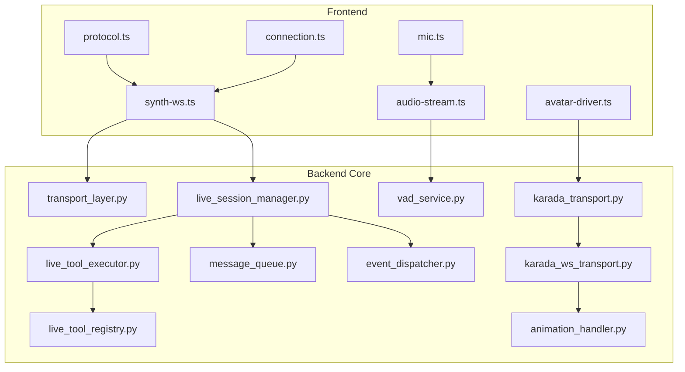
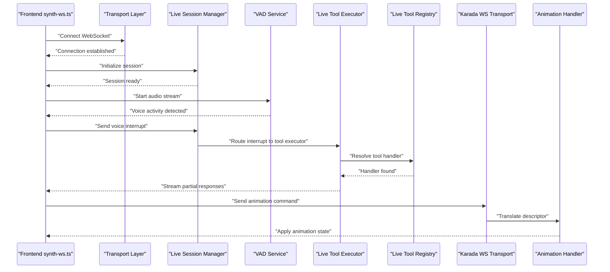
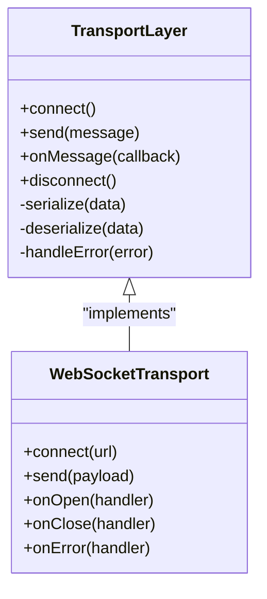
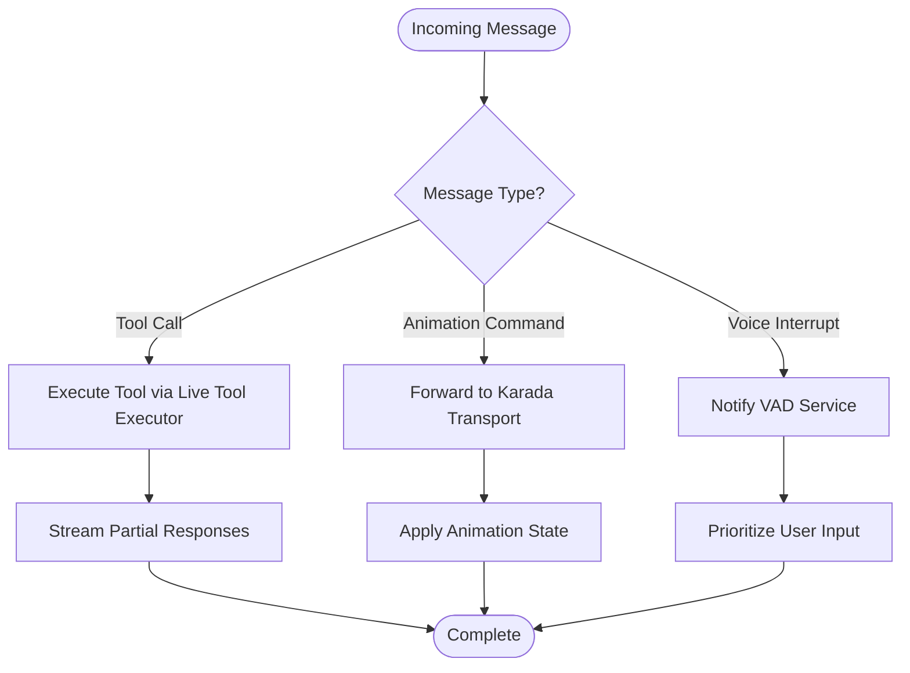
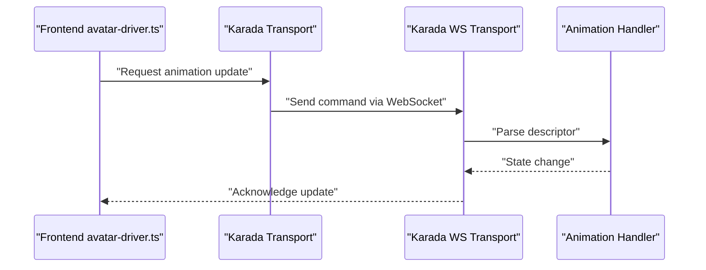
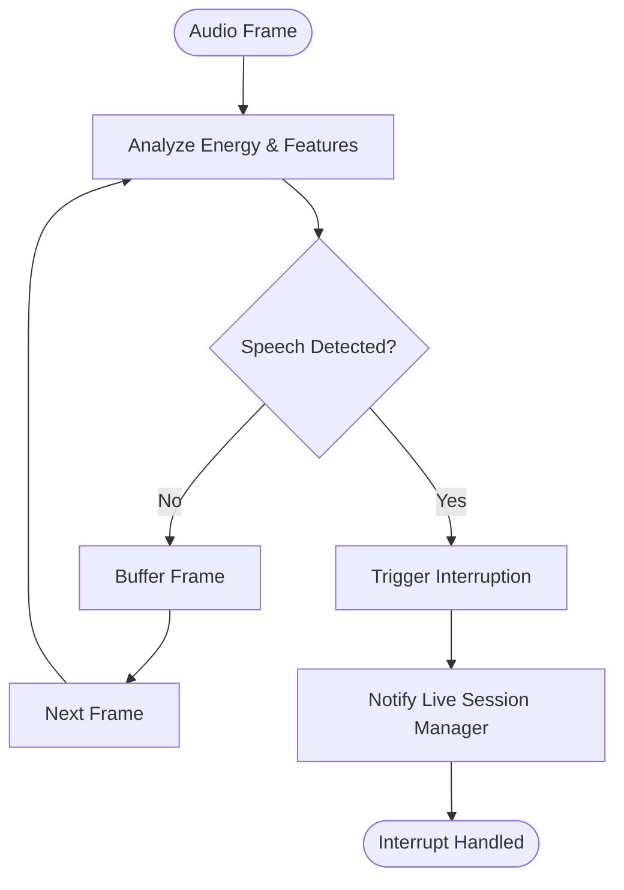
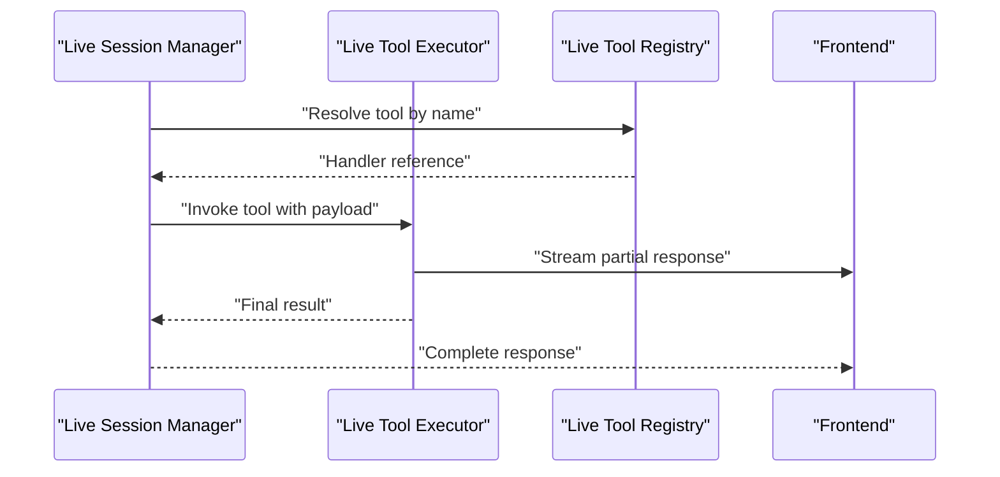
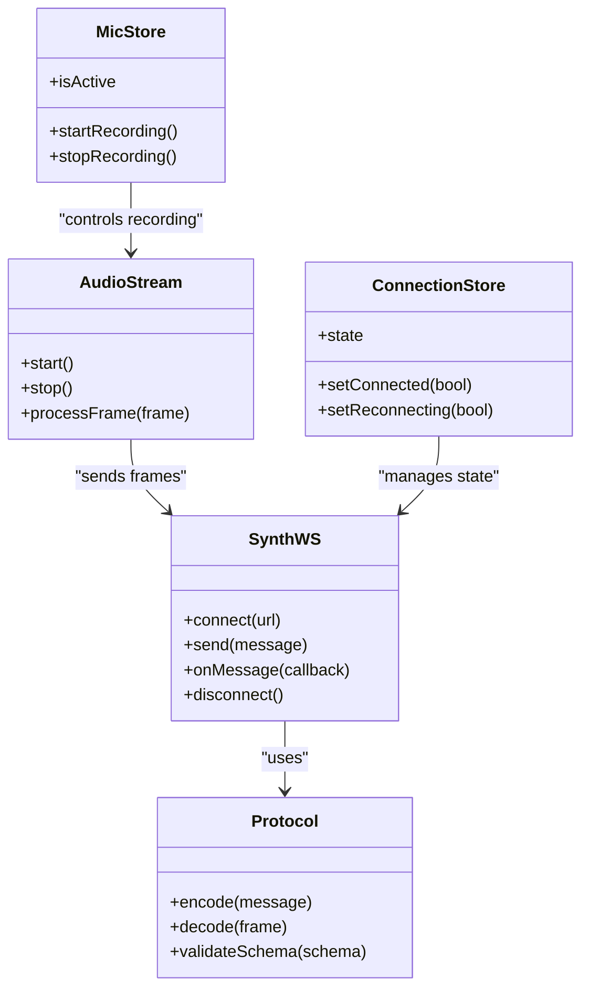
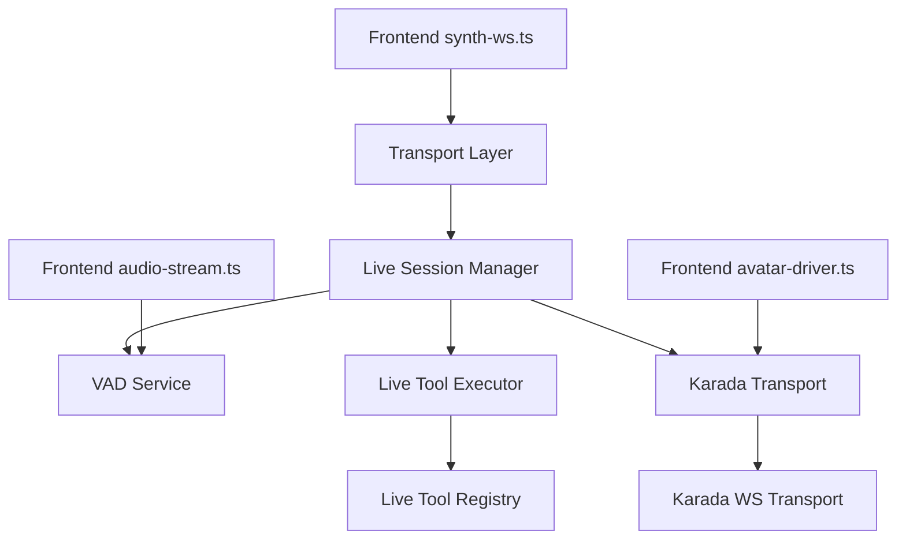

# Real-Time Communication

<cite>
**Referenced Files in This Document**
- [main.py](file://main.py)
- [core/transport_layer.py](file://core/transport_layer.py)
- [core/live_session_manager.py](file://core/live_session_manager.py)
- [core/karada_transport.py](file://core/karada_transport.py)
- [core/karada_ws_transport.py](file://core/karada_ws_transport.py)
- [core/vad_service.py](file://core/vad_service.py)
- [core/live_tool_executor.py](file://core/live_tool_executor.py)
- [core/live_tool_registry.py](file://core/live_tool_registry.py)
- [core/animation_handler.py](file://core/animation_handler.py)
- [core/message_queue.py](file://core/message_queue.py)
- [core/event_dispatcher.py](file://core/event_dispatcher.py)
- [frontend/src/services/synth-ws.ts](file://frontend/src/services/synth-ws.ts)
- [frontend/src/services/protocol.ts](file://frontend/src/services/protocol.ts)
- [frontend/src/services/audio-stream.ts](file://frontend/src/services/audio-stream.ts)
- [frontend/src/stores/connection.ts](file://frontend/src/stores/connection.ts)
- [frontend/src/stores/mic.ts](file://frontend/src/stores/mic.ts)
- [frontend/src/composables/vrm/avatar-driver.ts](file://frontend/src/composables/vrm/avatar-driver.ts)
</cite>

## Table of Contents
1. [Introduction](#introduction)
2. [Project Structure](#project-structure)
3. [Core Components](#core-components)
4. [Architecture Overview](#architecture-overview)
5. [Detailed Component Analysis](#detailed-component-analysis)
6. [Dependency Analysis](#dependency-analysis)
7. [Performance Considerations](#performance-considerations)
8. [Troubleshooting Guide](#troubleshooting-guide)
9. [Conclusion](#conclusion)

## Introduction
This document describes the architecture and implementation details of Synthetic Heart’s Real-Time Communication System. It focuses on live session management, voice activity detection (VAD), transport layer design, WebSocket-based messaging, bidirectional communication patterns, connection lifecycle, the Karada transport system for avatar animation control, VAD service for voice interruption handling, and the real-time tool execution framework with streaming responses. It also includes network topology diagrams, message flow sequences, and performance optimization strategies tailored for low-latency communication.

## Project Structure
The real-time system spans backend Python modules under core/, frontend TypeScript services under frontend/src/services and stores, and integration points between them via WebSocket protocols. Key areas:
- Transport Layer: core/transport_layer.py defines the unified transport abstraction used by live sessions and tools.
- Live Session Management: core/live_session_manager.py orchestrates WebSocket sessions, routing, and lifecycle events.
- Karada Transport: core/karada_transport.py and core/karada_ws_transport.py provide avatar animation control over WebSocket and REST-like channels.
- VAD Service: core/vad_service.py handles voice activity detection and interruption logic.
- Real-Time Tools: core/live_tool_executor.py and core/live_tool_registry.py implement streaming tool calls and response handling.
- Frontend: frontend/src/services/synth-ws.ts, protocol.ts, audio-stream.ts manage WebSocket connections, protocol framing, and audio streams; stores coordinate UI state and device access.

**Diagram sources**
- [core/transport_layer.py](file://core/transport_layer.py)
- [core/live_session_manager.py](file://core/live_session_manager.py)
- [core/karada_transport.py](file://core/karada_transport.py)
- [core/karada_ws_transport.py](file://core/karada_ws_transport.py)
- [core/vad_service.py](file://core/vad_service.py)
- [core/live_tool_executor.py](file://core/live_tool_executor.py)
- [core/live_tool_registry.py](file://core/live_tool_registry.py)
- [core/message_queue.py](file://core/message_queue.py)
- [core/event_dispatcher.py](file://core/event_dispatcher.py)
- [core/animation_handler.py](file://core/animation_handler.py)
- [frontend/src/services/synth-ws.ts](file://frontend/src/services/synth-ws.ts)
- [frontend/src/services/protocol.ts](file://frontend/src/services/protocol.ts)
- [frontend/src/services/audio-stream.ts](file://frontend/src/services/audio-stream.ts)
- [frontend/src/stores/connection.ts](file://frontend/src/stores/connection.ts)
- [frontend/src/stores/mic.ts](file://frontend/src/stores/mic.ts)
- [frontend/src/composables/vrm/avatar-driver.ts](file://frontend/src/composables/vrm/avatar-driver.ts)

**Section sources**
- [main.py](file://main.py)
- [core/transport_layer.py](file://core/transport_layer.py)
- [core/live_session_manager.py](file://core/live_session_manager.py)
- [core/karada_transport.py](file://core/karada_transport.py)
- [core/karada_ws_transport.py](file://core/karada_ws_transport.py)
- [core/vad_service.py](file://core/vad_service.py)
- [core/live_tool_executor.py](file://core/live_tool_executor.py)
- [core/live_tool_registry.py](file://core/live_tool_registry.py)
- [core/animation_handler.py](file://core/animation_handler.py)
- [core/message_queue.py](file://core/message_queue.py)
- [core/event_dispatcher.py](file://core/event_dispatcher.py)
- [frontend/src/services/synth-ws.ts](file://frontend/src/services/synth-ws.ts)
- [frontend/src/services/protocol.ts](file://frontend/src/services/protocol.ts)
- [frontend/src/services/audio-stream.ts](file://frontend/src/services/audio-stream.ts)
- [frontend/src/stores/connection.ts](file://frontend/src/stores/connection.ts)
- [frontend/src/stores/mic.ts](file://frontend/src/stores/mic.ts)
- [frontend/src/composables/vrm/avatar-driver.ts](file://frontend/src/composables/vrm/avatar-driver.ts)

## Core Components
- Transport Layer: Provides a unified interface for sending/receiving messages across transports (WebSocket, HTTP). It abstracts connection management, serialization, and error handling.
- Live Session Manager: Manages per-client WebSocket sessions, routes incoming messages to appropriate handlers, coordinates tool execution, and maintains session state.
- Karada Transport: Encapsulates avatar animation control commands and state synchronization, exposing both WebSocket and REST endpoints for flexibility.
- VAD Service: Processes audio frames to detect speech segments, triggers interruptions, and integrates with live session routing to prioritize user input.
- Live Tool Executor: Executes tools in real time, supports streaming responses, and coordinates with the registry for tool discovery and validation.
- Message Queue and Event Dispatcher: Decouple producers and consumers, ensuring reliable delivery and event-driven updates across components.
- Animation Handler: Translates high-level animation descriptors into concrete actions for the avatar driver.

**Section sources**
- [core/transport_layer.py](file://core/transport_layer.py)
- [core/live_session_manager.py](file://core/live_session_manager.py)
- [core/karada_transport.py](file://core/karada_transport.py)
- [core/karada_ws_transport.py](file://core/karada_ws_transport.py)
- [core/vad_service.py](file://core/vad_service.py)
- [core/live_tool_executor.py](file://core/live_tool_executor.py)
- [core/live_tool_registry.py](file://core/live_tool_registry.py)
- [core/message_queue.py](file://core/message_queue.py)
- [core/event_dispatcher.py](file://core/event_dispatcher.py)
- [core/animation_handler.py](file://core/animation_handler.py)

## Architecture Overview
The system uses a WebSocket-centric architecture where the frontend establishes a persistent connection to the backend. The Live Session Manager routes messages to specialized handlers (tools, animations, VAD). The Karada transport provides a dedicated channel for avatar animation control, while the VAD service processes audio streams to enable natural interruptions. Streaming tool responses are delivered incrementally to keep latency low.

**Diagram sources**
- [core/transport_layer.py](file://core/transport_layer.py)
- [core/live_session_manager.py](file://core/live_session_manager.py)
- [core/vad_service.py](file://core/vad_service.py)
- [core/live_tool_executor.py](file://core/live_tool_executor.py)
- [core/live_tool_registry.py](file://core/live_tool_registry.py)
- [core/karada_ws_transport.py](file://core/karada_ws_transport.py)
- [core/animation_handler.py](file://core/animation_handler.py)
- [frontend/src/services/synth-ws.ts](file://frontend/src/services/synth-ws.ts)

## Detailed Component Analysis

### Transport Layer
The transport layer abstracts WebSocket and other transports behind a consistent API. It manages connection lifecycle, message serialization, retries, and error propagation. It is used by the frontend’s synth-ws.ts to send and receive messages reliably.

**Diagram sources**
- [core/transport_layer.py](file://core/transport_layer.py)
- [frontend/src/services/synth-ws.ts](file://frontend/src/services/synth-ws.ts)

**Section sources**
- [core/transport_layer.py](file://core/transport_layer.py)
- [frontend/src/services/synth-ws.ts](file://frontend/src/services/synth-ws.ts)

### Live Session Manager
The Live Session Manager coordinates per-client sessions, routes incoming messages, and manages tool execution and animation control. It ensures that voice interrupts take precedence and that streaming responses are delivered promptly.

**Diagram sources**
- [core/live_session_manager.py](file://core/live_session_manager.py)
- [core/live_tool_executor.py](file://core/live_tool_executor.py)
- [core/karada_transport.py](file://core/karada_transport.py)
- [core/vad_service.py](file://core/vad_service.py)

**Section sources**
- [core/live_session_manager.py](file://core/live_session_manager.py)
- [core/live_tool_executor.py](file://core/live_tool_executor.py)
- [core/karada_transport.py](file://core/karada_transport.py)
- [core/vad_service.py](file://core/vad_service.py)

### Karada Transport System
Karada transport encapsulates avatar animation control, supporting both WebSocket and REST interfaces. It translates high-level animation descriptors into actionable states for the avatar driver.

**Diagram sources**
- [core/karada_transport.py](file://core/karada_transport.py)
- [core/karada_ws_transport.py](file://core/karada_ws_transport.py)
- [core/animation_handler.py](file://core/animation_handler.py)
- [frontend/src/composables/vrm/avatar-driver.ts](file://frontend/src/composables/vrm/avatar-driver.ts)

**Section sources**
- [core/karada_transport.py](file://core/karada_transport.py)
- [core/karada_ws_transport.py](file://core/karada_ws_transport.py)
- [core/animation_handler.py](file://core/animation_handler.py)
- [frontend/src/composables/vrm/avatar-driver.ts](file://frontend/src/composables/vrm/avatar-driver.ts)

### VAD Service
The VAD service processes audio frames to detect speech segments and triggers interruptions in live sessions. It integrates with the message queue to ensure timely processing without blocking.

**Diagram sources**
- [core/vad_service.py](file://core/vad_service.py)
- [core/message_queue.py](file://core/message_queue.py)
- [core/live_session_manager.py](file://core/live_session_manager.py)

**Section sources**
- [core/vad_service.py](file://core/vad_service.py)
- [core/message_queue.py](file://core/message_queue.py)
- [core/live_session_manager.py](file://core/live_session_manager.py)

### Real-Time Tool Execution Framework
The live tool executor executes tools discovered via the registry, supports streaming responses, and coordinates with the live session manager for prioritization and routing.

**Diagram sources**
- [core/live_tool_executor.py](file://core/live_tool_executor.py)
- [core/live_tool_registry.py](file://core/live_tool_registry.py)
- [core/live_session_manager.py](file://core/live_session_manager.py)

**Section sources**
- [core/live_tool_executor.py](file://core/live_tool_executor.py)
- [core/live_tool_registry.py](file://core/live_tool_registry.py)
- [core/live_session_manager.py](file://core/live_session_manager.py)

### Frontend WebSocket and Protocol
The frontend manages WebSocket connections, protocol framing, and audio streaming. Stores coordinate connection state and microphone access.

**Diagram sources**
- [frontend/src/services/synth-ws.ts](file://frontend/src/services/synth-ws.ts)
- [frontend/src/services/protocol.ts](file://frontend/src/services/protocol.ts)
- [frontend/src/services/audio-stream.ts](file://frontend/src/services/audio-stream.ts)
- [frontend/src/stores/connection.ts](file://frontend/src/stores/connection.ts)
- [frontend/src/stores/mic.ts](file://frontend/src/stores/mic.ts)

**Section sources**
- [frontend/src/services/synth-ws.ts](file://frontend/src/services/synth-ws.ts)
- [frontend/src/services/protocol.ts](file://frontend/src/services/protocol.ts)
- [frontend/src/services/audio-stream.ts](file://frontend/src/services/audio-stream.ts)
- [frontend/src/stores/connection.ts](file://frontend/src/stores/connection.ts)
- [frontend/src/stores/mic.ts](file://frontend/src/stores/mic.ts)

## Dependency Analysis
The real-time system exhibits clear separation of concerns:
- Transport Layer depends on WebSocket implementations and is used by higher-level components.
- Live Session Manager depends on VAD, Tool Executor, and Karada Transport.
- Frontend services depend on protocol definitions and store state.

**Diagram sources**
- [core/transport_layer.py](file://core/transport_layer.py)
- [core/live_session_manager.py](file://core/live_session_manager.py)
- [core/vad_service.py](file://core/vad_service.py)
- [core/live_tool_executor.py](file://core/live_tool_executor.py)
- [core/live_tool_registry.py](file://core/live_tool_registry.py)
- [core/karada_transport.py](file://core/karada_transport.py)
- [core/karada_ws_transport.py](file://core/karada_ws_transport.py)
- [frontend/src/services/synth-ws.ts](file://frontend/src/services/synth-ws.ts)
- [frontend/src/services/audio-stream.ts](file://frontend/src/services/audio-stream.ts)
- [frontend/src/composables/vrm/avatar-driver.ts](file://frontend/src/composables/vrm/avatar-driver.ts)

**Section sources**
- [core/transport_layer.py](file://core/transport_layer.py)
- [core/live_session_manager.py](file://core/live_session_manager.py)
- [core/vad_service.py](file://core/vad_service.py)
- [core/live_tool_executor.py](file://core/live_tool_executor.py)
- [core/live_tool_registry.py](file://core/live_tool_registry.py)
- [core/karada_transport.py](file://core/karada_transport.py)
- [core/karada_ws_transport.py](file://core/karada_ws_transport.py)
- [frontend/src/services/synth-ws.ts](file://frontend/src/services/synth-ws.ts)
- [frontend/src/services/audio-stream.ts](file://frontend/src/services/audio-stream.ts)
- [frontend/src/composables/vrm/avatar-driver.ts](file://frontend/src/composables/vrm/avatar-driver.ts)

## Performance Considerations
- Low-Latency Messaging: Use binary frames for audio and compact JSON for control messages. Minimize serialization overhead by reusing buffers.
- Backpressure Handling: Implement flow control in WebSocket transports to prevent memory spikes during high-volume tool responses.
- Connection Resilience: Add exponential backoff and heartbeat mechanisms to maintain stable connections under network fluctuations.
- VAD Optimization: Run voice activity detection on a separate thread or worker to avoid blocking the main event loop.
- Streaming Responses: Deliver incremental updates to reduce perceived latency and improve user experience.
- Resource Management: Close unused WebSocket connections promptly and release audio resources when not active.

[No sources needed since this section provides general guidance]

## Troubleshooting Guide
- Connection Drops: Check transport layer logs for errors and verify frontend connection state. Ensure heartbeat messages are exchanged.
- Voice Interruptions Not Working: Validate VAD thresholds and ensure audio frames are being processed. Confirm that interrupts are routed to the live session manager.
- Tool Execution Failures: Inspect tool registry for correct handler registration. Verify payload schemas and handle partial failures gracefully.
- Animation Sync Issues: Confirm Karada transport commands are received and parsed correctly. Check animation handler for state conflicts.

**Section sources**
- [core/transport_layer.py](file://core/transport_layer.py)
- [core/vad_service.py](file://core/vad_service.py)
- [core/live_tool_executor.py](file://core/live_tool_executor.py)
- [core/karada_transport.py](file://core/karada_transport.py)
- [core/animation_handler.py](file://core/animation_handler.py)
- [frontend/src/services/synth-ws.ts](file://frontend/src/services/synth-ws.ts)

## Conclusion
Synthetic Heart’s Real-Time Communication System combines a robust transport layer, intelligent session management, and specialized services for voice and animation control. The architecture emphasizes low-latency, resilient communication through WebSocket-based messaging, streaming responses, and efficient resource utilization. By following the outlined patterns and optimizations, developers can extend and maintain a responsive, scalable real-time experience.

[No sources needed since this section summarizes without analyzing specific files]