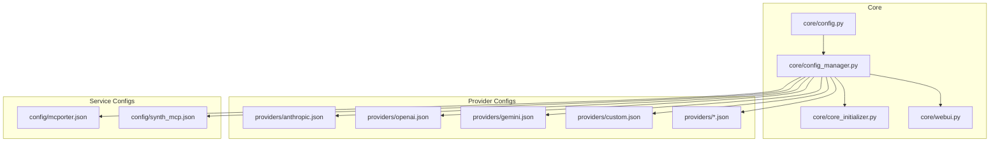
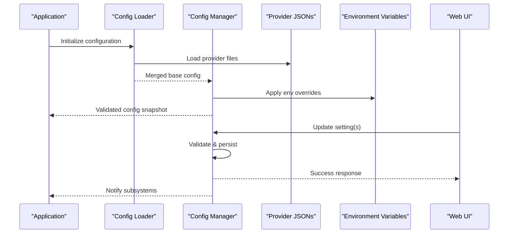
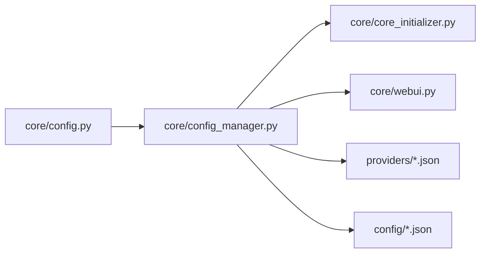

# Configuration Management

<cite>
**Referenced Files in This Document**
- [config.py](file://core/config.py)
- [config_manager.py](file://core/config_manager.py)
- [core_initializer.py](file://core/core_initializer.py)
- [webui.py](file://core/webui.py)
- [mcporter.json](file://config/mcporter.json)
- [synth_mcp.json](file://config/synth_mcp.json)
- [anthropic.json](file://providers/anthropic.json)
- [copilot.json](file://providers/copilot.json)
- [custom.json](file://providers/custom.json)
- [fish_audio.json](file://providers/fish_audio.json)
- [gemini.json](file://providers/gemini.json)
- [harmonyai.json](file://providers/harmonyai.json)
- [ollama.json](file://providers/ollama.json)
- [openai.json](file://providers/openai.json)
- [openrouter.json](file://providers/openrouter.json)
- [selenium_llm_engine.json](file://providers/selenium_llm_engine.json)
- [xai_grok.json](file://providers/xai_grok.json)
- [compose_env_vars.rst](file://docs/compose_env_vars.rst)
- [config_management.rst](file://docs/config_management.rst)
- [test_core_config.py](file://tests/test_core_config.py)
- [test_webui_config_refresh.py](file://tests/test_webui_config_refresh.py)
</cite>

## Table of Contents
1. [Introduction](#introduction)
2. [Project Structure](#project-structure)
3. [Core Components](#core-components)
4. [Architecture Overview](#architecture-overview)
5. [Detailed Component Analysis](#detailed-component-analysis)
6. [Dependency Analysis](#dependency-analysis)
7. [Performance Considerations](#performance-considerations)
8. [Troubleshooting Guide](#troubleshooting-guide)
9. [Conclusion](#conclusion)
10. [Appendices](#appendices)

## Introduction
This document explains Synthetic Heart’s configuration system, including the hierarchical structure, environment variable overrides, runtime updates, and provider/plugin/interface settings. It covers secure management of secrets, validation rules, defaults, file formats, programmatic access, troubleshooting, and performance tuning through configuration.

## Project Structure
Configuration is organized into:
- Core configuration loader and manager modules for loading, merging, validating, and exposing settings at runtime.
- Provider configuration files that define external LLM/TTS endpoints and their credentials.
- MCP and transport configuration files used by internal services.
- Documentation and tests that describe usage patterns and behaviors.

**Diagram sources**
- [config.py](file://core/config.py)
- [config_manager.py](file://core/config_manager.py)
- [core_initializer.py](file://core/core_initializer.py)
- [webui.py](file://core/webui.py)
- [mcporter.json](file://config/mcporter.json)
- [synth_mcp.json](file://config/synth_mcp.json)
- [anthropic.json](file://providers/anthropic.json)
- [openai.json](file://providers/openai.json)
- [gemini.json](file://providers/gemini.json)
- [custom.json](file://providers/custom.json)

**Section sources**
- [config.py](file://core/config.py)
- [config_manager.py](file://core/config_manager.py)
- [core_initializer.py](file://core/core_initializer.py)
- [webui.py](file://core/webui.py)
- [mcporter.json](file://config/mcporter.json)
- [synth_mcp.json](file://config/synth_mcp.json)
- [anthropic.json](file://providers/anthropic.json)
- [openai.json](file://providers/openai.json)
- [gemini.json](file://providers/gemini.json)
- [custom.json](file://providers/custom.json)

## Core Components
- Configuration loader and schema definitions are centralized to provide a single source of truth for core settings.
- A configuration manager handles merging multiple sources (files, environment variables), validation, and hot-reloading.
- The initializer integrates configuration into the application lifecycle, ensuring components receive validated settings.
- The web UI exposes configuration endpoints for viewing and updating settings at runtime.

Key responsibilities:
- Define default values and validation rules for all configuration keys.
- Load JSON-based provider configurations and merge them with core settings.
- Apply environment variable overrides following a strict precedence order.
- Expose getters and setters for programmatic access and runtime updates.
- Persist changes safely and notify dependent subsystems.

**Section sources**
- [config.py](file://core/config.py)
- [config_manager.py](file://core/config_manager.py)
- [core_initializer.py](file://core/core_initializer.py)
- [webui.py](file://core/webui.py)

## Architecture Overview
The configuration architecture follows a layered approach:
- File-based providers and service configs are loaded first.
- Environment variables override file-based values.
- Runtime updates via the web UI or API are validated and merged back into the active configuration.
- Components consume configuration through typed accessors provided by the manager.

**Diagram sources**
- [config_manager.py](file://core/config_manager.py)
- [core_initializer.py](file://core/core_initializer.py)
- [webui.py](file://core/webui.py)
- [anthropic.json](file://providers/anthropic.json)
- [openai.json](file://providers/openai.json)
- [gemini.json](file://providers/gemini.json)
- [custom.json](file://providers/custom.json)

## Detailed Component Analysis

### Hierarchical Configuration Structure
- Core settings include logging levels, database connections, feature toggles, and interface bindings.
- Provider configurations define endpoints, authentication, model selection, and rate limits.
- Plugin parameters are scoped per plugin and can be overridden via environment variables.
- Interface settings control communication protocols, ports, and security policies.

Precedence order (highest to lowest):
1. Runtime updates via API/UI
2. Environment variables
3. Per-provider JSON files
4. Default values defined in core configuration

Validation rules:
- Required fields must be present; missing required keys cause startup errors.
- Type checks enforce numeric ranges, boolean flags, and string formats.
- Cross-field constraints ensure consistency (e.g., endpoint URL matches provider type).

Defaults:
- Conservative defaults enable safe operation out-of-the-box.
- Optional features remain disabled unless explicitly enabled.

**Section sources**
- [config.py](file://core/config.py)
- [config_manager.py](file://core/config_manager.py)

### Environment Variable Overrides
- Environment variables follow a naming convention that maps directly to configuration keys.
- Overrides apply at load time and can be refreshed without restart if supported.
- Sensitive values (API keys, tokens) should be injected via environment variables rather than stored in files.

Common scenarios:
- Switching providers by overriding the active provider key.
- Enabling debug logs by setting the logging level variable.
- Toggling experimental features using dedicated flags.

**Section sources**
- [config_manager.py](file://core/config_manager.py)
- [compose_env_vars.rst](file://docs/compose_env_vars.rst)

### Runtime Configuration Updates
- The web UI and API allow changing non-sensitive settings at runtime.
- Updates are validated before being applied; invalid changes are rejected with clear error messages.
- Some settings require component reloads or restarts; the system indicates which ones do.

Workflow:
- Submit update request with new values.
- System validates against schema and constraints.
- On success, configuration is persisted and subsystems are notified.
- On failure, return detailed validation errors.

**Section sources**
- [webui.py](file://core/webui.py)
- [config_manager.py](file://core/config_manager.py)

### Provider Configurations
- Each provider has a dedicated JSON file defining connection details, authentication, and behavior.
- Supported providers include major LLM and TTS services.
- Custom providers can be added by creating a new JSON file following the schema.

Examples of provider categories:
- LLM engines (OpenAI, Anthropic, Gemini, etc.)
- Voice synthesis engines (Fish Audio, custom HTTP endpoints)
- Specialized engines (Selenium-based LLM engine)

Best practices:
- Keep secrets out of version control; use environment variables or secret managers.
- Use separate files per environment when necessary.
- Validate provider connectivity during startup.

**Section sources**
- [anthropic.json](file://providers/anthropic.json)
- [openai.json](file://providers/openai.json)
- [gemini.json](file://providers/gemini.json)
- [custom.json](file://providers/custom.json)
- [fish_audio.json](file://providers/fish_audio.json)
- [selenium_llm_engine.json](file://providers/selenium_llm_engine.json)
- [xai_grok.json](file://providers/xai_grok.json)
- [harmonyai.json](file://providers/harmonyai.json)
- [ollama.json](file://providers/ollama.json)
- [copilot.json](file://providers/copilot.json)
- [openrouter.json](file://providers/openrouter.json)

### Plugin Parameters
- Plugins accept configuration parameters scoped under their namespace.
- Parameters can be set via JSON files or environment variables.
- Validation ensures plugin-specific requirements are met.

Common plugin settings:
- Feature toggles
- Thresholds and timeouts
- External service endpoints

**Section sources**
- [config_manager.py](file://core/config_manager.py)
- [config.py](file://core/config.py)

### Interface Settings
- Interfaces define how Synthetic Heart communicates with external systems (e.g., Discord, Matrix, Telegram).
- Settings include protocol options, authentication, and routing rules.
- Security policies control message filtering and access controls.

**Section sources**
- [config_manager.py](file://core/config_manager.py)
- [config.py](file://core/config.py)

### Programmatic Configuration Access
- Use typed getters to read configuration values safely.
- Subscribe to configuration change events to react to runtime updates.
- Avoid direct mutation; use the manager’s update methods.

Recommended patterns:
- Cache frequently accessed values where appropriate.
- Handle validation errors gracefully.
- Log configuration changes for auditability.

**Section sources**
- [config_manager.py](file://core/config_manager.py)
- [core_initializer.py](file://core/core_initializer.py)

### Secure Configuration Management
- Store secrets in environment variables or secret managers.
- Mask sensitive values in logs and responses.
- Restrict write access to configuration endpoints.

Secret handling best practices:
- Never log raw secrets.
- Rotate credentials regularly.
- Use least-privilege principles for service accounts.

**Section sources**
- [config_manager.py](file://core/config_manager.py)
- [compose_env_vars.rst](file://docs/compose_env_vars.rst)

### Configuration Migration Procedures
- Schema changes are handled through migration scripts.
- Backward compatibility is maintained where possible.
- Tests verify migration correctness across versions.

Migration steps:
- Detect schema version on startup.
- Apply incremental migrations.
- Validate final configuration state.

**Section sources**
- [config_manager.py](file://core/config_manager.py)
- [test_core_config.py](file://tests/test_core_config.py)

### JSON Schemas and File Formats
- Provider JSON files follow a consistent schema for easy parsing and validation.
- Core configuration uses structured JSON with nested sections.
- Service-specific configs (MCP, McPorter) have their own schemas.

Schema highlights:
- Required fields are enforced.
- Enumerations restrict valid values.
- Nested objects group related settings.

**Section sources**
- [anthropic.json](file://providers/anthropic.json)
- [openai.json](file://providers/openai.json)
- [gemini.json](file://providers/gemini.json)
- [synth_mcp.json](file://config/synth_mcp.json)
- [mcporter.json](file://config/mcporter.json)

### Common Configuration Scenarios
- Switching LLM providers by updating the active provider key and corresponding JSON.
- Enabling debug mode by adjusting logging level.
- Adding a new voice synthesis engine by creating a provider JSON and enabling it.
- Securing an interface by setting authentication and TLS options.

**Section sources**
- [config_manager.py](file://core/config_manager.py)
- [config.py](file://core/config.py)

## Dependency Analysis
Configuration dependencies are managed to avoid circular imports and ensure initialization order:
- Core configuration loads before other subsystems.
- Provider configurations are loaded independently and merged.
- Runtime updates propagate to dependent components via event notifications.

**Diagram sources**
- [config.py](file://core/config.py)
- [config_manager.py](file://core/config_manager.py)
- [core_initializer.py](file://core/core_initializer.py)
- [webui.py](file://core/webui.py)
- [anthropic.json](file://providers/anthropic.json)
- [openai.json](file://providers/openai.json)
- [gemini.json](file://providers/gemini.json)
- [custom.json](file://providers/custom.json)
- [synth_mcp.json](file://config/synth_mcp.json)
- [mcporter.json](file://config/mcporter.json)

**Section sources**
- [config_manager.py](file://core/config_manager.py)
- [core_initializer.py](file://core/core_initializer.py)

## Performance Considerations
- Minimize configuration file sizes to reduce load times.
- Use environment variables for frequently changing values to avoid file I/O.
- Enable caching for static configuration sections.
- Validate configuration once at startup and reuse results.

Tuning recommendations:
- Adjust logging verbosity based on environment.
- Set appropriate timeouts for external services.
- Limit concurrent requests to providers to avoid rate limits.

[No sources needed since this section provides general guidance]

## Troubleshooting Guide
Common issues and resolutions:
- Missing required fields: Check provider JSON files and ensure all mandatory keys are present.
- Invalid types: Verify data types match expected formats (strings, numbers, booleans).
- Environment variable conflicts: Ensure no conflicting values between files and environment.
- Runtime update failures: Review validation error messages and correct input values.

Debugging steps:
- Enable verbose logging to trace configuration loading.
- Inspect configuration snapshots after each update.
- Test provider connectivity separately from configuration changes.

**Section sources**
- [test_core_config.py](file://tests/test_core_config.py)
- [test_webui_config_refresh.py](file://tests/test_webui_config_refresh.py)

## Conclusion
Synthetic Heart’s configuration system provides a robust, secure, and flexible foundation for managing settings across core, providers, plugins, and interfaces. By leveraging hierarchical structures, environment overrides, and runtime updates, users can tailor the system to diverse environments while maintaining security and performance. Proper validation, migration procedures, and troubleshooting practices ensure reliable operation.

[No sources needed since this section summarizes without analyzing specific files]

## Appendices

### Configuration File Formats Reference
- Core configuration: Structured JSON with nested sections for different subsystems.
- Provider configurations: JSON files with standardized schemas for each service.
- Service configurations: Separate JSON files for internal services like MCP and McPorter.

### Example Configuration Scenarios
- Switching LLM providers: Update active provider key and corresponding JSON file.
- Enabling debug mode: Set logging level via environment variable.
- Adding new voice engine: Create provider JSON and enable in core settings.

### Validation Rules Summary
- Required fields must be present and correctly typed.
- Cross-field constraints ensure logical consistency.
- Enumerations restrict values to predefined sets.

### Secret Management Best Practices
- Use environment variables for sensitive data.
- Mask secrets in logs and responses.
- Implement credential rotation policies.

[No sources needed since this section provides general guidance]