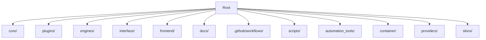
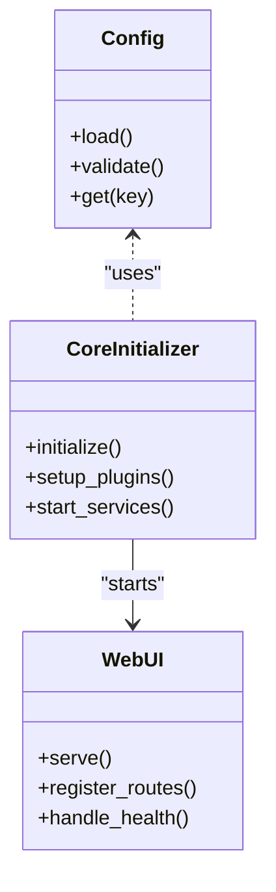
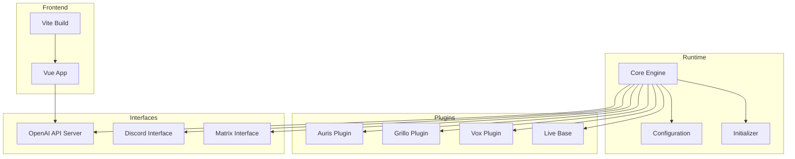
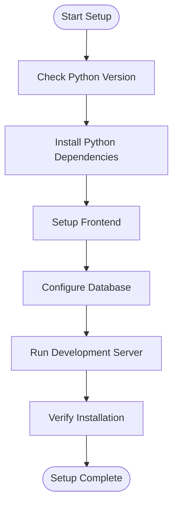
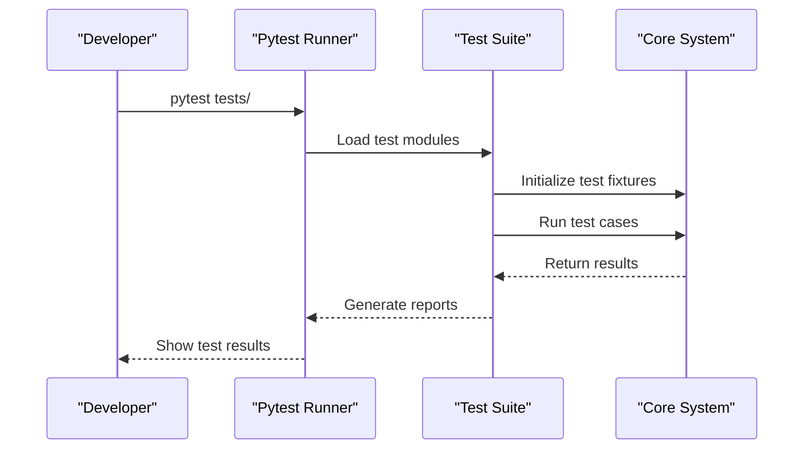
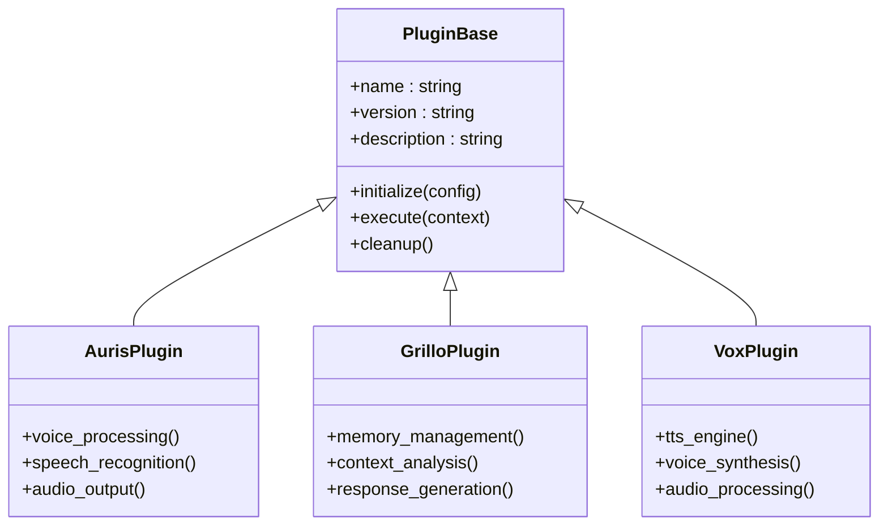
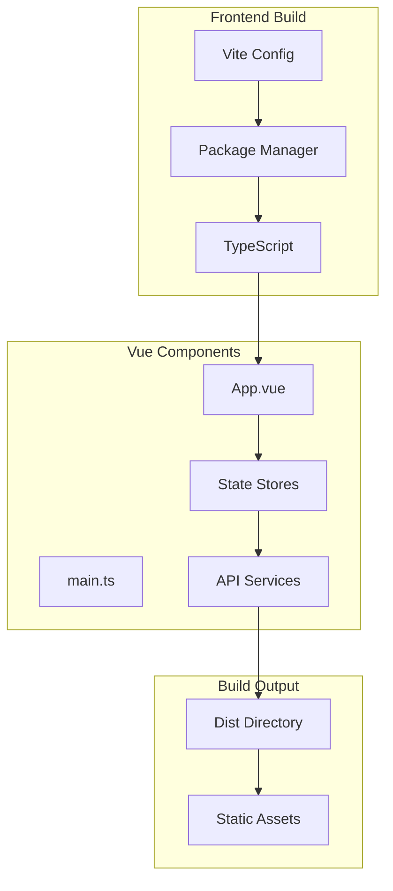
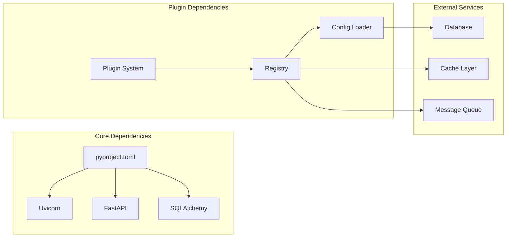

# Contributing Guide

<cite>
**Referenced Files in This Document**
- [README.md](file://README.md)
- [main.py](file://main.py)
- [pyproject.toml](file://pyproject.toml)
- [pytest.ini](file://pytest.ini)
- [run_tests.py](file://run_tests.py)
- [run_tests.sh](file://run_tests.sh)
- [Dockerfile](file://Dockerfile)
- [docker-compose.yml](file://docker-compose.yml)
- [.github/workflows/build-release.yml](file://.github/workflows/build-release.yml)
- [.github/workflows/deploy-pages.yml](file://.github/workflows/deploy-pages.yml)
- [frontend/package.json](file://frontend/package.json)
- [frontend/vite.config.ts](file://frontend/vite.config.ts)
- [core/config.py](file://core/config.py)
- [core/core_initializer.py](file://core/core_initializer.py)
- [core/webui.py](file://core/webui.py)
- [plugins/auris_plugin/auris_plugin.py](file://plugins/auris_plugin/auris_plugin.py)
- [plugins/grillo_plugin.py](file://plugins/grillo_plugin.py)
- [plugins/live_base.py](file://plugins/live_base.py)
- [plugins/vox_plugin/vox_plugin.py](file://plugins/vox_plugin/vox_plugin.py)
- [interface/openai_api_server/openai_api_server.py](file://interface/openai_api_server/openai_api_server.py)
- [scripts/run_webui.py](file://scripts/run_webui.py)
- [automation_tools/container_synth.sh](file://automation_tools/container_synth.sh)
</cite>

## Table of Contents
1. [Introduction](#introduction)
2. [Project Structure](#project-structure)
3. [Core Components](#core-components)
4. [Architecture Overview](#architecture-overview)
5. [Detailed Component Analysis](#detailed-component-analysis)
6. [Dependency Analysis](#dependency-analysis)
7. [Performance Considerations](#performance-considerations)
8. [Troubleshooting Guide](#troubleshooting-guide)
9. [Conclusion](#conclusion)
10. [Appendices](#appendices)

## Introduction
This guide is for contributors to the Synthetic Heart project. It explains how to set up your development environment, follow coding standards, and contribute via pull requests. It also covers architecture guidelines, testing, documentation, release procedures, and community communication channels. Whether you are fixing bugs, adding features, developing plugins, or improving documentation, this guide will help you get started quickly and work effectively with the team.

## Project Structure
Synthetic Heart is a modular Python application with a Vue-based frontend, plugin ecosystem, multiple interfaces, and containerized deployment options. The repository includes:
- Core runtime and services under core/
- Plugin ecosystem under plugins/
- External integrations and engines under engines/ and interface/
- Frontend assets and build configuration under frontend/
- Documentation under docs/
- CI/CD workflows under .github/workflows/
- Containerization and automation scripts at the root level

[No sources needed since this diagram shows conceptual structure, not specific code mappings]

**Section sources**
- [README.md](file://README.md)
- [pyproject.toml](file://pyproject.toml)

## Core Components
The core module provides the main runtime, configuration management, web UI server, and initialization logic. Key responsibilities include:
- Configuration loading and validation
- Core initialization and lifecycle management
- Web UI serving and integration points
- Plugin discovery and registration hooks

**Diagram sources**
- [core/config.py](file://core/config.py)
- [core/core_initializer.py](file://core/core_initializer.py)
- [core/webui.py](file://core/webui.py)

**Section sources**
- [core/config.py](file://core/config.py)
- [core/core_initializer.py](file://core/core_initializer.py)
- [core/webui.py](file://core/webui.py)

## Architecture Overview
Synthetic Heart follows a modular architecture with clear separation between core runtime, plugins, external interfaces, and frontend. The system supports multiple LLM engines, voice processing, live sessions, and various messaging interfaces.

**Diagram sources**
- [core/core_initializer.py](file://core/core_initializer.py)
- [plugins/auris_plugin/auris_plugin.py](file://plugins/auris_plugin/auris_plugin.py)
- [plugins/grillo_plugin.py](file://plugins/grillo_plugin.py)
- [plugins/vox_plugin/vox_plugin.py](file://plugins/vox_plugin/vox_plugin.py)
- [plugins/live_base.py](file://plugins/live_base.py)
- [interface/openai_api_server/openai_api_server.py](file://interface/openai_api_server/openai_api_server.py)
- [frontend/vite.config.ts](file://frontend/vite.config.ts)

## Detailed Component Analysis

### Development Environment Setup
To set up the development environment:
1. Install Python dependencies using the project's dependency manager
2. Set up the frontend development environment
3. Configure database connections and environment variables
4. Run the application in development mode

**Section sources**
- [pyproject.toml](file://pyproject.toml)
- [frontend/package.json](file://frontend/package.json)
- [scripts/run_webui.py](file://scripts/run_webui.py)

### Coding Standards
Follow these coding standards for consistent code quality:
- Use type hints for all function parameters and return values
- Follow PEP 8 style guidelines for Python code
- Write comprehensive docstrings for public APIs
- Include unit tests for new functionality
- Use meaningful variable and function names
- Handle exceptions appropriately with proper error messages

### Testing Framework
The project uses pytest for testing with comprehensive test coverage:
- Unit tests for individual components
- Integration tests for plugin interactions
- End-to-end tests for user workflows
- Performance tests for critical paths

**Diagram sources**
- [pytest.ini](file://pytest.ini)
- [run_tests.py](file://run_tests.py)
- [run_tests.sh](file://run_tests.sh)

**Section sources**
- [pytest.ini](file://pytest.ini)
- [run_tests.py](file://run_tests.py)
- [run_tests.sh](file://run_tests.sh)

### Plugin Development
The plugin system allows extending functionality through well-defined interfaces:

#### Plugin Architecture

**Diagram sources**
- [plugins/auris_plugin/auris_plugin.py](file://plugins/auris_plugin/auris_plugin.py)
- [plugins/grillo_plugin.py](file://plugins/grillo_plugin.py)
- [plugins/vox_plugin/vox_plugin.py](file://plugins/vox_plugin/vox_plugin.py)

#### Plugin Development Workflow
1. Create a new plugin directory under plugins/
2. Implement the base plugin interface
3. Add configuration support
4. Write comprehensive tests
5. Document the plugin API
6. Submit a pull request

**Section sources**
- [plugins/auris_plugin/auris_plugin.py](file://plugins/auris_plugin/auris_plugin.py)
- [plugins/grillo_plugin.py](file://plugins/grillo_plugin.py)
- [plugins/vox_plugin/vox_plugin.py](file://plugins/vox_plugin/vox_plugin.py)

### Frontend Development
The frontend is built with Vue.js and Vite:

#### Frontend Architecture

**Diagram sources**
- [frontend/vite.config.ts](file://frontend/vite.config.ts)
- [frontend/package.json](file://frontend/package.json)

**Section sources**
- [frontend/package.json](file://frontend/package.json)
- [frontend/vite.config.ts](file://frontend/vite.config.ts)

## Dependency Analysis
The project has well-defined dependencies between core components, plugins, and external services:

**Diagram sources**
- [pyproject.toml](file://pyproject.toml)
- [core/config.py](file://core/config.py)

**Section sources**
- [pyproject.toml](file://pyproject.toml)

## Performance Considerations
Key performance considerations for contributors:
- Use async/await patterns for I/O operations
- Implement proper caching strategies
- Optimize database queries with indexing
- Use connection pooling for database connections
- Implement rate limiting for external API calls
- Monitor memory usage in long-running processes
- Profile CPU-intensive operations

## Troubleshooting Guide
Common issues and their solutions:

### Development Issues
- **Import errors**: Ensure all dependencies are installed correctly
- **Database connection failures**: Check connection strings and credentials
- **Port conflicts**: Verify that required ports are available
- **Frontend build errors**: Clear node_modules and reinstall dependencies

### Plugin Issues
- **Plugin loading failures**: Check plugin syntax and imports
- **Configuration errors**: Validate plugin configuration files
- **Runtime errors**: Enable debug logging for detailed error information

### Testing Issues
- **Test failures**: Review test fixtures and mock configurations
- **Integration test timeouts**: Adjust timeout settings for slow operations
- **Database test isolation**: Ensure proper test database cleanup

**Section sources**
- [core/config.py](file://core/config.py)
- [core/core_initializer.py](file://core/core_initializer.py)

## Conclusion
This guide provides a comprehensive foundation for contributing to the Synthetic Heart project. By following the established patterns, coding standards, and contribution workflow, you can make meaningful contributions while maintaining code quality and system stability. Remember to test thoroughly, document changes, and engage with the community through appropriate channels.

## Appendices

### Contribution Workflow
1. Fork the repository
2. Create a feature branch
3. Make your changes
4. Write/update tests
5. Update documentation
6. Submit a pull request
7. Address review feedback
8. Merge when approved

### Code Review Process
- All changes require peer review
- Automated checks must pass
- Documentation updates are required for API changes
- Performance impact should be considered
- Security implications must be evaluated

### Release Procedures
- Version bumping follows semantic versioning
- Changelog entries are required
- Release candidates are tested extensively
- Docker images are rebuilt and published
- Documentation is updated and deployed

### Community Guidelines
- Be respectful and inclusive
- Provide constructive feedback
- Ask questions when unsure
- Share knowledge and experience
- Help newcomers get started

### Communication Channels
- GitHub Issues for bug reports and feature requests
- Pull Requests for code contributions
- Documentation discussions in PR comments
- Community forums for general questions