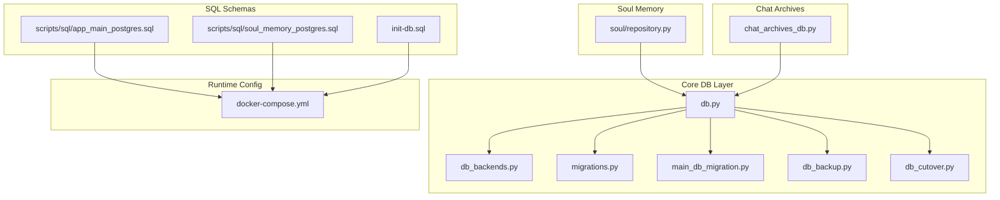
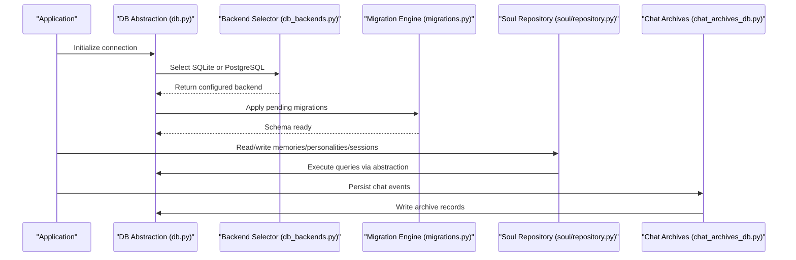
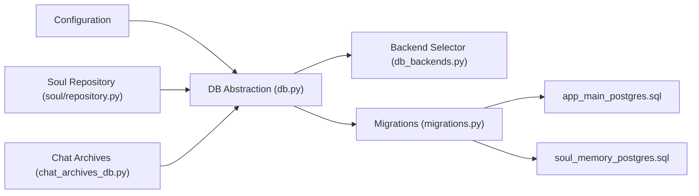
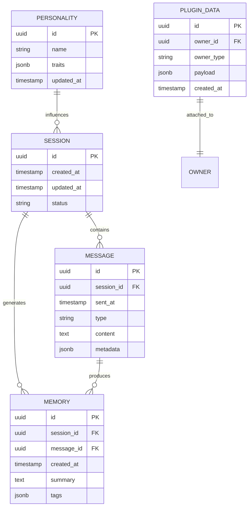

# Database Design

<cite>
**Referenced Files in This Document**
- [db.py](file://core/db.py)
- [db_backends.py](file://core/db_backends.py)
- [db_backup.py](file://core/db_backup.py)
- [db_cutover.py](file://core/db_cutover.py)
- [main_db_migration.py](file://core/main_db_migration.py)
- [migrations.py](file://core/migrations.py)
- [chat_archives_db.py](file://core/chat_archives_db.py)
- [soul/repository.py](file://core/soul/repository.py)
- [scripts/sql/app_main_postgres.sql](file://scripts/sql/app_main_postgres.sql)
- [scripts/sql/soul_memory_postgres.sql](file://scripts/sql/soul_memory_postgres.sql)
- [init-db.sql](file://init-db.sql)
- [docker-compose.yml](file://docker-compose.yml)
</cite>

## Table of Contents
1. [Introduction](#introduction)
2. [Project Structure](#project-structure)
3. [Core Components](#core-components)
4. [Architecture Overview](#architecture-overview)
5. [Detailed Component Analysis](#detailed-component-analysis)
6. [Dependency Analysis](#dependency-analysis)
7. [Performance Considerations](#performance-considerations)
8. [Troubleshooting Guide](#troubleshooting-guide)
9. [Conclusion](#conclusion)
10. [Appendices](#appendices)

## Introduction
This document provides a comprehensive data model and database architecture guide for Synthetic Heart. It explains the dual-database strategy (SQLite for development, PostgreSQL for production), entity relationships across messages, memories, personalities, sessions, and plugin data, and details primary/foreign keys, indexes, constraints, migrations, backups, performance tuning, lifecycle policies, archival rules, cleanup processes, security, encryption, and access control.

## Project Structure
The database layer is implemented under core with dedicated modules for connection management, backends, migration orchestration, backup utilities, and cutover logic. SQL schema definitions are provided for PostgreSQL initialization and bootstrapping scripts exist to set up both application and memory databases.

**Diagram sources**
- [db.py](file://core/db.py)
- [db_backends.py](file://core/db_backends.py)
- [migrations.py](file://core/migrations.py)
- [main_db_migration.py](file://core/main_db_migration.py)
- [db_backup.py](file://core/db_backup.py)
- [db_cutover.py](file://core/db_cutover.py)
- [soul/repository.py](file://core/soul/repository.py)
- [chat_archives_db.py](file://core/chat_archives_db.py)
- [scripts/sql/app_main_postgres.sql](file://scripts/sql/app_main_postgres.sql)
- [scripts/sql/soul_memory_postgres.sql](file://scripts/sql/soul_memory_postgres.sql)
- [init-db.sql](file://init-db.sql)
- [docker-compose.yml](file://docker-compose.yml)

**Section sources**
- [db.py](file://core/db.py)
- [db_backends.py](file://core/db_backends.py)
- [migrations.py](file://core/migrations.py)
- [main_db_migration.py](file://core/main_db_migration.py)
- [db_backup.py](file://core/db_backup.py)
- [db_cutover.py](file://core/db_cutover.py)
- [soul/repository.py](file://core/soul/repository.py)
- [chat_archives_db.py](file://core/chat_archives_db.py)
- [scripts/sql/app_main_postgres.sql](file://scripts/sql/app_main_postgres.sql)
- [scripts/sql/soul_memory_postgres.sql](file://scripts/sql/soul_memory_postgres.sql)
- [init-db.sql](file://init-db.sql)
- [docker-compose.yml](file://docker-compose.yml)

## Core Components
- Connection and backend abstraction: centralizes SQLite and PostgreSQL connectivity, pooling, and dialect differences.
- Migration engine: applies versioned schema changes and ensures consistency across environments.
- Backup and restore: supports consistent snapshots and recovery procedures.
- Cutover utility: enables zero-downtime or controlled switching between backends during maintenance.
- Soul repository: models and persistence for memories, emotions, growth state, and related entities.
- Chat archives DB: persists chat history and archive metadata.

Key responsibilities:
- Provide a unified cursor/connection interface.
- Manage schema versions and idempotent migrations.
- Ensure safe backups and restores with minimal locking.
- Support dual-database runtime selection based on environment configuration.

**Section sources**
- [db.py](file://core/db.py)
- [db_backends.py](file://core/db_backends.py)
- [migrations.py](file://core/migrations.py)
- [main_db_migration.py](file://core/main_db_migration.py)
- [db_backup.py](file://core/db_backup.py)
- [db_cutover.py](file://core/db_cutover.py)
- [soul/repository.py](file://core/soul/repository.py)
- [chat_archives_db.py](file://core/chat_archives_db.py)

## Architecture Overview
Synthetic Heart uses a dual-database strategy:
- Development: SQLite for simplicity and portability.
- Production: PostgreSQL for concurrency, reliability, and advanced features.

The application selects the backend at startup based on configuration. Migrations are applied per backend, and all data access goes through a common abstraction layer that hides dialect differences.

**Diagram sources**
- [db.py](file://core/db.py)
- [db_backends.py](file://core/db_backends.py)
- [migrations.py](file://core/migrations.py)
- [soul/repository.py](file://core/soul/repository.py)
- [chat_archives_db.py](file://core/chat_archives_db.py)

## Detailed Component Analysis

### Dual-Database Strategy and Backends
- Backend selection is driven by configuration and environment variables.
- SQLite is used for local development; PostgreSQL for production deployments.
- The abstraction layer normalizes connections, cursors, and transaction handling.

Operational notes:
- Use connection pooling in production (PostgreSQL).
- Ensure WAL mode and appropriate PRAGMAs for SQLite in dev.
- Validate schema compatibility before cutover.

**Section sources**
- [db_backends.py](file://core/db_backends.py)
- [db.py](file://core/db.py)
- [docker-compose.yml](file://docker-compose.yml)

### Migration System
- Versioned migrations ensure deterministic schema evolution.
- Idempotent operations prevent reapplication issues.
- Separate schemas for application main database and soul memory database.

Best practices:
- Always include rollback-safe patterns where possible.
- Test migrations against both SQLite and PostgreSQL.
- Record migration checksums and enforce ordering.

**Section sources**
- [migrations.py](file://core/migrations.py)
- [main_db_migration.py](file://core/main_db_migration.py)
- [scripts/sql/app_main_postgres.sql](file://scripts/sql/app_main_postgres.sql)
- [scripts/sql/soul_memory_postgres.sql](file://scripts/sql/soul_memory_postgres.sql)

### Backup and Restore
- Supports consistent snapshots and incremental strategies.
- Handles locks and transactions to avoid partial writes.
- Provides restore verification and integrity checks.

Recommended procedures:
- Schedule regular backups offsite.
- Encrypt backups at rest and in transit.
- Validate restore process periodically.

**Section sources**
- [db_backup.py](file://core/db_backup.py)

### Cutover Utility
- Enables switching between backends during maintenance windows.
- Validates target schema and data consistency before cutover.
- Supports rollback if post-cutover checks fail.

Usage guidance:
- Run preflight checks.
- Drain writes during switch.
- Verify read/write paths after cutover.

**Section sources**
- [db_cutover.py](file://core/db_cutover.py)

### Soul Memory Data Model
Entities and relationships:
- Messages: discrete units of conversation content and metadata.
- Memories: persistent knowledge derived from messages and context.
- Personalities: persona profiles influencing behavior and responses.
- Sessions: conversational contexts grouping messages and memories.
- Plugin data: structured key-value or JSON payloads attached to entities.

Relationship overview:
- Sessions contain many Messages.
- Memories are linked to Messages and/or Sessions.
- Personalities influence Session behavior and Memory generation.
- Plugin data associates with Messages, Memories, or Sessions.

Indexes and constraints:
- Primary keys on all entities for fast lookups.
- Foreign keys enforcing referential integrity.
- Indexes on frequently filtered columns (timestamps, session IDs, message types).
- Unique constraints on identifiers and deduplication keys.

Data lifecycle:
- Messages are appended and may be compacted or archived.
- Memories evolve over time with consolidation and pruning.
- Sessions have active and archived states.
- Plugin data follows entity lifecycles.

Security and access:
- Row-level or application-level scoping by user/session.
- Encryption for sensitive fields at rest when required.
- Audit logging for critical mutations.

**Section sources**
- [soul/repository.py](file://core/soul/repository.py)
- [scripts/sql/soul_memory_postgres.sql](file://scripts/sql/soul_memory_postgres.sql)

### Chat Archives Data Model
Purpose:
- Persist chat history and archive metadata for retrieval and analysis.

Key entities:
- Archive entries with timestamps, session references, and payload pointers.
- Metadata tables for indexing and search support.

Indexes and constraints:
- Timestamp-based indexes for range queries.
- Session ID foreign keys linking to sessions.
- Payload size limits and compression where applicable.

Lifecycle:
- Append-only writes with periodic compaction.
- Archival policies move older data to cold storage.

**Section sources**
- [chat_archives_db.py](file://core/chat_archives_db.py)

### SQL Schemas and Initialization
- Application main schema defines core tables for messages, sessions, and system metadata.
- Soul memory schema defines memory-related tables and relationships.
- init-db.sql provides baseline setup for development and testing.

Schema alignment:
- Ensure parity between SQLite dev and PostgreSQL prod.
- Use migration scripts to reconcile differences.

**Section sources**
- [scripts/sql/app_main_postgres.sql](file://scripts/sql/app_main_postgres.sql)
- [scripts/sql/soul_memory_postgres.sql](file://scripts/sql/soul_memory_postgres.sql)
- [init-db.sql](file://init-db.sql)

## Dependency Analysis
The database layer depends on configuration-driven backend selection and is consumed by higher-level components such as the soul repository and chat archives module. Migrations are executed early in the startup sequence to guarantee schema readiness.

**Diagram sources**
- [db.py](file://core/db.py)
- [db_backends.py](file://core/db_backends.py)
- [migrations.py](file://core/migrations.py)
- [soul/repository.py](file://core/soul/repository.py)
- [chat_archives_db.py](file://core/chat_archives_db.py)
- [scripts/sql/app_main_postgres.sql](file://scripts/sql/app_main_postgres.sql)
- [scripts/sql/soul_memory_postgres.sql](file://scripts/sql/soul_memory_postgres.sql)

**Section sources**
- [db.py](file://core/db.py)
- [db_backends.py](file://core/db_backends.py)
- [migrations.py](file://core/migrations.py)
- [soul/repository.py](file://core/soul/repository.py)
- [chat_archives_db.py](file://core/chat_archives_db.py)
- [scripts/sql/app_main_postgres.sql](file://scripts/sql/app_main_postgres.sql)
- [scripts/sql/soul_memory_postgres.sql](file://scripts/sql/soul_memory_postgres.sql)

## Performance Considerations
- Use connection pooling in production (PostgreSQL) to reduce overhead.
- Create indexes on high-cardinality and frequently filtered columns (e.g., timestamps, session IDs, message types).
- Partition large tables by time ranges for archival and query efficiency.
- Enable WAL mode for SQLite in development to improve concurrent reads.
- Avoid N+1 queries by batching operations and using joins where appropriate.
- Monitor slow queries and adjust indexes accordingly.
- Compress large payloads and store binaries externally when feasible.

[No sources needed since this section provides general guidance]

## Troubleshooting Guide
Common issues and resolutions:
- Migration failures: verify schema versioning and idempotency; run preflight checks.
- Connection errors: validate backend configuration and credentials; check network reachability.
- Lock contention: review long-running transactions and optimize queries.
- Backup corruption: verify checksums and test restore procedures regularly.
- Cutover problems: ensure target schema matches expected version; perform rollback if needed.

Diagnostic steps:
- Inspect migration logs and error traces.
- Validate database health with integrity checks.
- Review connection pool metrics and timeouts.
- Confirm encryption settings and key availability.

**Section sources**
- [migrations.py](file://core/migrations.py)
- [db_backup.py](file://core/db_backup.py)
- [db_cutover.py](file://core/db_cutover.py)

## Conclusion
Synthetic Heart’s database architecture balances developer ergonomics with production-grade reliability through a dual-database strategy, robust migration tooling, and clear separation of concerns. By following the outlined data model, indexing strategies, lifecycle policies, and security practices, teams can maintain high performance, safety, and scalability across development and production environments.

[No sources needed since this section summarizes without analyzing specific files]

## Appendices

### Entity Relationship Overview
Conceptual ER diagram illustrating relationships among messages, memories, personalities, sessions, and plugin data.

[No sources needed since this diagram shows conceptual workflow, not actual code structure]

### Sample Queries
- Retrieve recent messages for a session:
  - Select messages ordered by timestamp within a session scope.
- Search memories by tags:
  - Filter memories by tag arrays and return summaries.
- List active sessions:
  - Query sessions by status and sort by last activity.
- Archive old messages:
  - Move messages beyond retention thresholds to archive tables.

[No sources needed since this section provides general guidance]

### Data Lifecycle Policies
- Messages: append-only with optional compaction and archival after retention periods.
- Memories: consolidated periodically; pruned based on relevance and recency.
- Sessions: transition from active to archived; soft delete after extended inactivity.
- Plugin data: follow owner entity lifecycle; purge on deletion.

Cleanup processes:
- Scheduled jobs for compaction and archival.
- Retention policies enforced by background tasks.
- Audit trails for deletions and moves.

[No sources needed since this section provides general guidance]

### Security, Encryption, and Access Control
- Encrypt sensitive fields at rest using application-managed keys.
- Enforce row-level or application-level scoping by user/session.
- Audit critical mutations and access patterns.
- Secure backup storage with encryption and restricted access.

Access control mechanisms:
- Role-based permissions for database operations.
- Token-based authentication for API consumers.
- Least privilege principle for service accounts.

[No sources needed since this section provides general guidance]