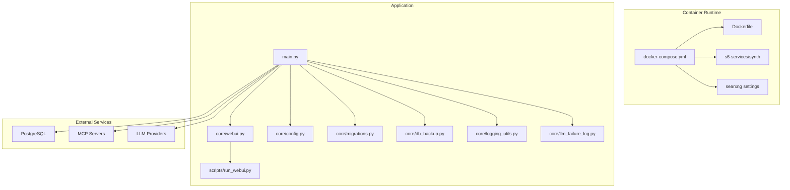
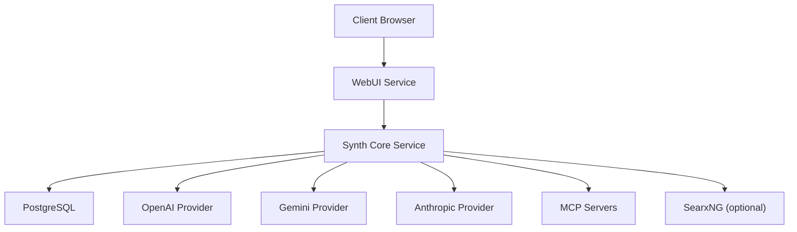
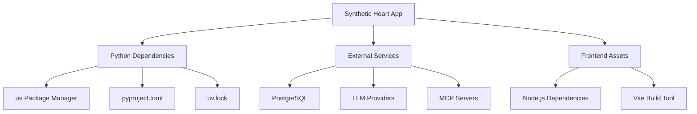

# Deployment Guide

<cite>
**Referenced Files in This Document**
- [docker-compose.yml](file://docker-compose.yml)
- [Dockerfile](file://Dockerfile)
- [.github/workflows/build-release.yml](file://.github/workflows/build-release.yml)
- [.github/workflows/deploy-pages.yml](file://.github/workflows/deploy-pages.yml)
- [synth.sh](file://synth.sh)
- [start_synth.ps1](file://start_synth.ps1)
- [scripts/run_webui.py](file://scripts/run_webui.py)
- [core/webui.py](file://core/webui.py)
- [core/config.py](file://core/config.py)
- [core/db_backup.py](file://core/db_backup.py)
- [core/logging_utils.py](file://core/logging_utils.py)
- [core/llm_failure_log.py](file://core/llm_failure_log.py)
- [core/migrations.py](file://core/migrations.py)
- [core/main_db_migration.py](file://core/main_db_migration.py)
- [init-db.sql](file://init-db.sql)
- [scripts/bootstrap_soul_postgres.sh](file://scripts/bootstrap_soul_postgres.sh)
- [automation_tools/container_synth.sh](file://automation_tools/container_synth.sh)
- [automation_tools/check_webui.sh](file://automation_tools/check_webui.sh)
- [container/s6-services/synth/service](file://container/s6-services/synth/service)
- [container/searxng/settings.yml](file://container/searxng/settings.yml)
- [providers/openai.json](file://providers/openai.json)
- [providers/gemini.json](file://providers/gemini.json)
- [providers/anthropic.json](file://providers/anthropic.json)
- [config/mcporter.json](file://config/mcporter.json)
- [config/synth_mcp.json](file://config/synth_mcp.json)
- [pyproject.toml](file://pyproject.toml)
- [uv.lock](file://uv.lock)
- [frontend/package.json](file://frontend/package.json)
- [frontend/vite.config.ts](file://frontend/vite.config.ts)
- [main.py](file://main.py)
</cite>

## Table of Contents
1. [Introduction](#introduction)
2. [Project Structure](#project-structure)
3. [Core Components](#core-components)
4. [Architecture Overview](#architecture-overview)
5. [Detailed Component Analysis](#detailed-component-analysis)
6. [Dependency Analysis](#dependency-analysis)
7. [Performance Considerations](#performance-considerations)
8. [Troubleshooting Guide](#troubleshooting-guide)
9. [Conclusion](#conclusion)
10. [Appendices](#appendices)

## Introduction
This Deployment Guide provides comprehensive instructions for deploying Synthetic Heart across environments, with a focus on Docker-based deployment using docker-compose, container orchestration, and service management. It covers production considerations such as scaling, monitoring, environment preparation, dependency management, system requirements, backup and recovery, log management, health checks, CI/CD automation, rolling updates, rollback strategies, security hardening, network configuration, and resource optimization.

## Project Structure
Synthetic Heart is a Python application with a web UI, multiple interfaces, plugins, and external integrations. The repository includes:
- Containerization assets (Dockerfile, docker-compose.yml, s6 services)
- CI/CD workflows for building releases and deploying documentation pages
- Configuration files for providers and MCP servers
- Scripts for bootstrapping databases, running the WebUI, and managing containers
- Core modules for database operations, logging, migrations, and backups

**Diagram sources**
- [docker-compose.yml](file://docker-compose.yml)
- [Dockerfile](file://Dockerfile)
- [container/s6-services/synth/service](file://container/s6-services/synth/service)
- [container/searxng/settings.yml](file://container/searxng/settings.yml)
- [main.py](file://main.py)
- [core/webui.py](file://core/webui.py)
- [scripts/run_webui.py](file://scripts/run_webui.py)
- [core/config.py](file://core/config.py)
- [core/migrations.py](file://core/migrations.py)
- [core/db_backup.py](file://core/db_backup.py)
- [core/logging_utils.py](file://core/logging_utils.py)
- [core/llm_failure_log.py](file://core/llm_failure_log.py)

**Section sources**
- [docker-compose.yml](file://docker-compose.yml)
- [Dockerfile](file://Dockerfile)
- [main.py](file://main.py)

## Core Components
- Container orchestration via docker-compose defines services for the Synth application, WebUI, and optional components like SearxNG.
- The Dockerfile builds the runtime image including Python dependencies and frontend assets.
- s6 services manage process supervision within containers.
- Core modules handle configuration, database migrations, backups, logging, and failure logging.
- Provider configurations define external LLM endpoints.
- MCP server configurations enable tool integration.

Key responsibilities:
- Service lifecycle: start, stop, restart, health checks
- Environment variables and secrets management
- Database initialization and migration
- Logging and observability
- Backup and restore procedures

**Section sources**
- [docker-compose.yml](file://docker-compose.yml)
- [Dockerfile](file://Dockerfile)
- [container/s6-services/synth/service](file://container/s6-services/synth/service)
- [core/config.py](file://core/config.py)
- [core/migrations.py](file://core/migrations.py)
- [core/db_backup.py](file://core/db_backup.py)
- [core/logging_utils.py](file://core/logging_utils.py)
- [core/llm_failure_log.py](file://core/llm_failure_log.py)
- [providers/openai.json](file://providers/openai.json)
- [providers/gemini.json](file://providers/gemini.json)
- [providers/anthropic.json](file://providers/anthropic.json)
- [config/synth_mcp.json](file://config/synth_mcp.json)

## Architecture Overview
The deployment architecture comprises:
- Application service (Synth core)
- WebUI service (static assets and WebSocket interface)
- Optional search service (SearxNG)
- PostgreSQL database
- External LLM providers via HTTP APIs
- MCP servers for tool execution

**Diagram sources**
- [docker-compose.yml](file://docker-compose.yml)
- [providers/openai.json](file://providers/openai.json)
- [providers/gemini.json](file://providers/gemini.json)
- [providers/anthropic.json](file://providers/anthropic.json)
- [config/synth_mcp.json](file://config/synth_mcp.json)
- [container/searxng/settings.yml](file://container/searxng/settings.yml)

## Detailed Component Analysis

### Docker Compose Deployment
- Defines services for Synth, WebUI, and optional components
- Configures environment variables, volumes, and networking
- Supports health checks and restart policies
- Enables scaling by adjusting replica counts

Best practices:
- Use separate networks for internal services
- Mount persistent volumes for database and logs
- Configure environment variables securely via .env or secret managers
- Enable health checks for all critical services

**Section sources**
- [docker-compose.yml](file://docker-compose.yml)

### Docker Image Build
- Multi-stage build for optimized image size
- Installs Python dependencies from pyproject.toml and uv.lock
- Builds frontend assets using Vite
- Copies only necessary files to runtime image

Optimization tips:
- Leverage Docker layer caching
- Use .dockerignore to exclude unnecessary files
- Pin dependency versions for reproducibility

**Section sources**
- [Dockerfile](file://Dockerfile)
- [pyproject.toml](file://pyproject.toml)
- [uv.lock](file://uv.lock)
- [frontend/package.json](file://frontend/package.json)
- [frontend/vite.config.ts](file://frontend/vite.config.ts)

### Service Management with s6
- s6-overlay manages process supervision
- Separate services for Synth and WebUI
- Automatic restart on failure
- Structured logging output

Configuration:
- Define startup scripts and shutdown handlers
- Configure log rotation and retention
- Set resource limits per service

**Section sources**
- [container/s6-services/synth/service](file://container/s6-services/synth/service)

### Database Initialization and Migration
- PostgreSQL database initialization via init-db.sql
- Bootstrap script for Soul database setup
- Automated migrations on application startup
- Support for schema versioning and rollback

Operational procedures:
- Initialize database before first run
- Run migrations after upgrades
- Verify schema integrity post-migration

**Section sources**
- [init-db.sql](file://init-db.sql)
- [scripts/bootstrap_soul_postgres.sh](file://scripts/bootstrap_soul_postgres.sh)
- [core/migrations.py](file://core/migrations.py)
- [core/main_db_migration.py](file://core/main_db_migration.py)

### Backup and Recovery
- Automated database backup functionality
- Configurable backup schedules and retention
- Restore procedures for disaster recovery
- Backup verification and integrity checks

Backup strategy:
- Regular full and incremental backups
- Off-site storage for critical data
- Test restoration procedures regularly

**Section sources**
- [core/db_backup.py](file://core/db_backup.py)

### Logging and Monitoring
- Centralized logging with structured format
- Log rotation and retention policies
- Health check endpoints for service monitoring
- Integration with external monitoring systems

Monitoring setup:
- Configure log aggregation (e.g., ELK stack)
- Set up alerts for critical errors
- Monitor resource utilization and performance metrics

**Section sources**
- [core/logging_utils.py](file://core/logging_utils.py)
- [core/llm_failure_log.py](file://core/llm_failure_log.py)

### External Integrations
- LLM provider configurations via JSON files
- MCP server definitions for tool execution
- Search engine integration through SearxNG
- Authentication and authorization mechanisms

Security considerations:
- Secure API key management
- Network isolation for external services
- Input validation and sanitization

**Section sources**
- [providers/openai.json](file://providers/openai.json)
- [providers/gemini.json](file://providers/gemini.json)
- [providers/anthropic.json](file://providers/anthropic.json)
- [config/synth_mcp.json](file://config/synth_mcp.json)
- [container/searxng/settings.yml](file://container/searxng/settings.yml)

## Dependency Analysis
The application has several layers of dependencies:
- Python packages managed via uv
- Frontend dependencies via npm/pnpm
- External services (PostgreSQL, LLM providers, MCP servers)
- System-level dependencies (Python runtime, Node.js for build)

**Diagram sources**
- [pyproject.toml](file://pyproject.toml)
- [uv.lock](file://uv.lock)
- [frontend/package.json](file://frontend/package.json)
- [frontend/vite.config.ts](file://frontend/vite.config.ts)

**Section sources**
- [pyproject.toml](file://pyproject.toml)
- [uv.lock](file://uv.lock)
- [frontend/package.json](file://frontend/package.json)
- [frontend/vite.config.ts](file://frontend/vite.config.ts)

## Performance Considerations
- Optimize database queries and connection pooling
- Implement caching for frequently accessed data
- Configure appropriate resource limits per service
- Use horizontal scaling for high-traffic scenarios
- Monitor and optimize memory usage and CPU consumption

Scaling strategies:
- Horizontal pod autoscaling in Kubernetes
- Load balancing across multiple instances
- Database read replicas for increased throughput
- CDN for static asset delivery

**Section sources**
- [docker-compose.yml](file://docker-compose.yml)
- [Dockerfile](file://Dockerfile)

## Troubleshooting Guide
Common issues and solutions:
- Database connection failures: verify credentials and network connectivity
- LLM provider errors: check API keys and rate limits
- Memory leaks: monitor heap usage and implement garbage collection
- Log rotation problems: configure proper file permissions and disk space

Debugging tools:
- Container logs inspection
- Database query profiling
- Network traffic analysis
- Performance profiling utilities

**Section sources**
- [core/logging_utils.py](file://core/logging_utils.py)
- [core/llm_failure_log.py](file://core/llm_failure_log.py)

## Conclusion
Synthetic Heart provides a robust, containerized deployment solution suitable for various environments. By following this guide, operators can deploy, scale, monitor, and maintain the application effectively in production. The modular architecture allows for flexible customization while maintaining operational reliability.

## Appendices

### Environment Preparation Checklist
- Install Docker and docker-compose
- Prepare PostgreSQL instance
- Configure LLM provider credentials
- Set up network policies and firewall rules
- Allocate sufficient resources (CPU, RAM, storage)

### Security Hardening Recommendations
- Use least privilege principles for service accounts
- Implement TLS encryption for all communications
- Regular security updates and vulnerability scanning
- Audit access logs and implement intrusion detection
- Secure sensitive configuration files and secrets

### CI/CD Pipeline Integration
- Automated testing and validation
- Container image building and pushing
- Deployment automation with rollback capabilities
- Health check verification post-deployment

**Section sources**
- [.github/workflows/build-release.yml](file://.github/workflows/build-release.yml)
- [.github/workflows/deploy-pages.yml](file://.github/workflows/deploy-pages.yml)
- [automation_tools/container_synth.sh](file://automation_tools/container_synth.sh)
- [automation_tools/check_webui.sh](file://automation_tools/check_webui.sh)