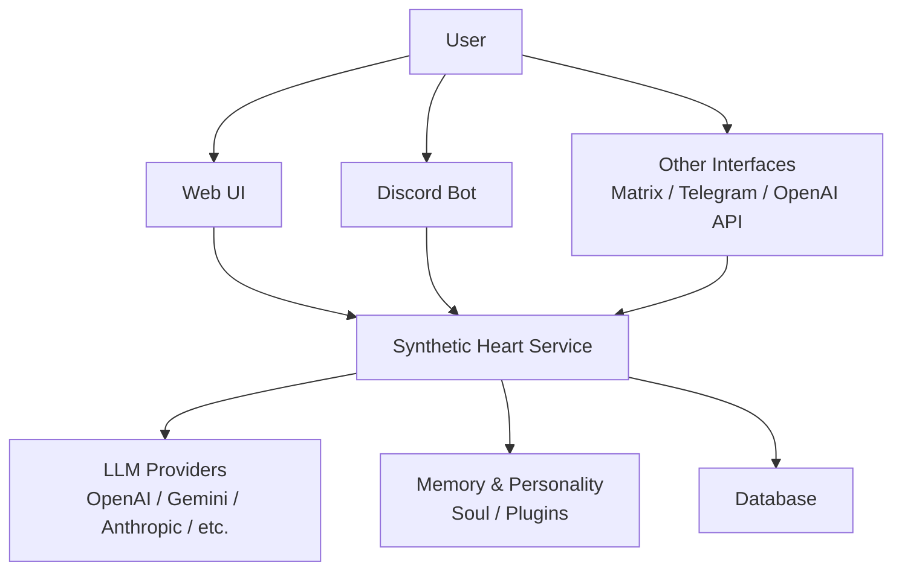
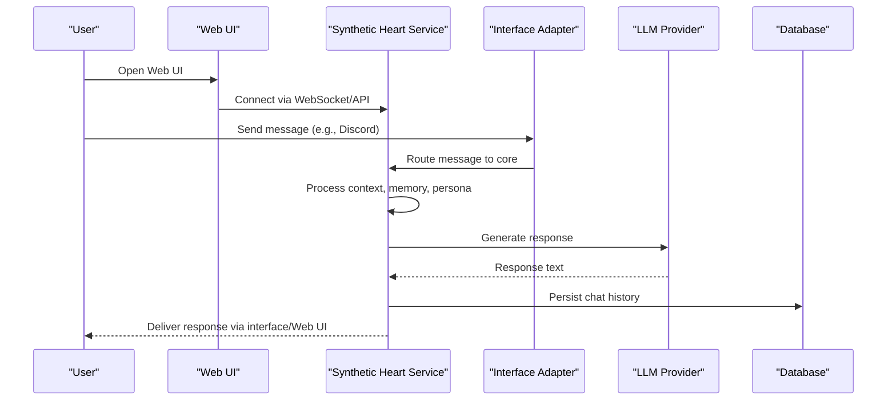
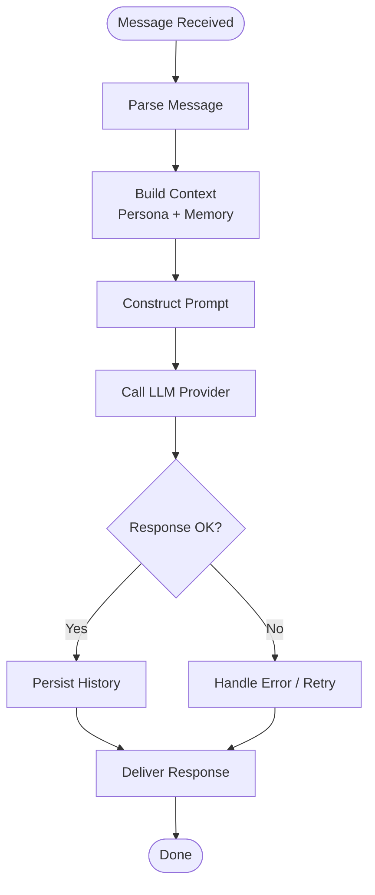
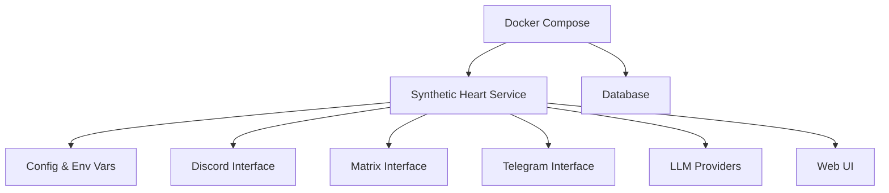

# Getting Started

<cite>
**Referenced Files in This Document**
- [README.md](file://README.md)
- [docker-compose.yml](file://docker-compose.yml)
- [Dockerfile](file://Dockerfile)
- [main.py](file://main.py)
- [core/config.py](file://core/config.py)
- [core/core_initializer.py](file://core/core_initializer.py)
- [interface/discord_interface/guide.md](file://interface/discord_interface/guide.md)
- [docs/quickstart.rst](file://docs/quickstart.rst)
- [docs/installation.rst](file://docs/installation.rst)
- [docs/compose_env_vars.rst](file://docs/compose_env_vars.rst)
- [scripts/run_webui.py](file://scripts/run_webui.py)
- [core/webui.py](file://core/webui.py)
</cite>

## Table of Contents
1. [Introduction](#introduction)
2. [Project Structure](#project-structure)
3. [Core Components](#core-components)
4. [Architecture Overview](#architecture-overview)
5. [Detailed Component Analysis](#detailed-component-analysis)
6. [Dependency Analysis](#dependency-analysis)
7. [Performance Considerations](#performance-considerations)
8. [Troubleshooting Guide](#troubleshooting-guide)
9. [Conclusion](#conclusion)
10. [Appendices](#appendices)

## Introduction
Synthetic Heart is an autonomous AI agent framework that gives your agent a personality, memory, and multi-platform communication capabilities. It runs as a containerized service with a web interface and supports integrations such as Discord, Matrix, Telegram, and OpenAI-compatible APIs. You can quickly spin up the system using Docker Compose, configure environment variables for LLM providers and interfaces, create your first agent persona, and start conversing through the Web UI or connected platforms.

This guide helps beginners get a working Synthetic Heart instance running end-to-end, including prerequisites, installation via Docker Compose, basic configuration, initial agent creation, and common use cases like setting up a Discord bot and accessing the Web UI.

## Project Structure
At a high level, the repository includes:
- Containerization files (Dockerfile, docker-compose.yml)
- Python application entrypoint (main.py)
- Core runtime and configuration modules
- Interface adapters for external platforms (e.g., Discord, Matrix, Telegram)
- Documentation (including quickstart and installation guides)
- Scripts to run the Web UI and utilities

[No sources needed since this diagram shows conceptual workflow, not actual code structure]

## Core Components
- Application entrypoint: The main process initializes the core runtime and services.
- Configuration: Environment-driven configuration controls LLM providers, database connections, feature flags, and interface settings.
- Interfaces: Pluggable adapters connect Synthetic Heart to external platforms (Discord, Matrix, Telegram, OpenAI-compatible servers).
- Web UI: A browser-based interface for managing agents, chats, settings, and logs.
- Memory and personality: The “soul” subsystem manages persona, emotions, and memory plugins.

Key implementation references:
- Entrypoint initialization and startup orchestration
- Configuration loading and validation
- Web UI server bootstrap
- Interface-specific setup guides

**Section sources**
- [main.py:1-100](file://main.py#L1-L100)
- [core/config.py:1-200](file://core/config.py#L1-L200)
- [core/core_initializer.py:1-200](file://core/core_initializer.py#L1-L200)
- [core/webui.py:1-200](file://core/webui.py#L1-L200)
- [scripts/run_webui.py:1-100](file://scripts/run_webui.py#L1-L100)

## Architecture Overview
The system follows a modular architecture:
- The service exposes internal APIs and a Web UI.
- External interfaces (Discord, Matrix, Telegram, OpenAI API server) send messages into the service.
- The core orchestrates prompts, memory, emotion engine, and tool execution.
- LLM providers are configured via environment variables and provider JSON files.
- Persistent state is stored in a database managed by the container stack.

**Diagram sources**
- [core/core_initializer.py:1-200](file://core/core_initializer.py#L1-L200)
- [core/config.py:1-200](file://core/config.py#L1-L200)
- [interface/discord_interface/guide.md:1-200](file://interface/discord_interface/guide.md#L1-L200)

**Section sources**
- [core/core_initializer.py:1-200](file://core/core_initializer.py#L1-L200)
- [core/config.py:1-200](file://core/config.py#L1-L200)
- [interface/discord_interface/guide.md:1-200](file://interface/discord_interface/guide.md#L1-L200)

## Detailed Component Analysis

### Installation and Quick Start with Docker Compose
Prerequisites:
- Python (for local development only; containerized usage requires Docker)
- Docker and Docker Compose installed and running on your machine

Steps:
1. Clone or download the repository.
2. Prepare environment variables for LLM providers and optional features. See the compose environment variables documentation for details.
3. Start the stack using Docker Compose.
4. Access the Web UI at the default port indicated by the compose file.
5. Create your first agent persona and begin chatting.

Common pitfalls:
- Missing or invalid API keys for LLM providers will prevent responses.
- Database connection issues can block startup; ensure the database service is reachable.
- Port conflicts may prevent the Web UI from binding; adjust ports if necessary.

**Section sources**
- [docker-compose.yml:1-200](file://docker-compose.yml#L1-L200)
- [docs/compose_env_vars.rst:1-200](file://docs/compose_env_vars.rst#L1-L200)
- [docs/installation.rst:1-200](file://docs/installation.rst#L1-L200)
- [docs/quickstart.rst:1-200](file://docs/quickstart.rst#L1-L200)

### Basic Configuration
Environment variables control:
- LLM provider selection and credentials
- Database connection strings
- Feature toggles (e.g., enabling specific interfaces)
- Logging levels and debug options

Configuration flow:
- On startup, the service loads environment variables and merges them with defaults.
- Provider configurations can be supplied via JSON files under the providers directory.
- Validation occurs early; missing required keys will raise errors during initialization.

Best practices:
- Use a .env file for local development and secrets management.
- Keep provider keys secure and avoid committing secrets to version control.
- Validate configuration before deploying to production.

**Section sources**
- [core/config.py:1-200](file://core/config.py#L1-L200)
- [core/core_initializer.py:1-200](file://core/core_initializer.py#L1-L200)
- [docs/compose_env_vars.rst:1-200](file://docs/compose_env_vars.rst#L1-L200)

### Initial Agent Creation
After starting the service:
1. Open the Web UI and navigate to the agent/persona section.
2. Define a persona name, description, and behavior instructions.
3. Save the persona and select it as active.
4. Test conversation flows via the Web UI or connected interfaces.

Tips:
- Start with simple instructions and gradually refine persona behavior.
- Use memory plugins to enable persistent context across sessions.
- Monitor logs to understand how prompts are constructed and responses generated.

**Section sources**
- [core/webui.py:1-200](file://core/webui.py#L1-L200)
- [scripts/run_webui.py:1-100](file://scripts/run_webui.py#L1-L100)

### Discord Bot Setup
To integrate with Discord:
1. Follow the Discord interface guide to create a bot and obtain tokens.
2. Configure the Discord interface environment variables (bot token, guild/channel IDs).
3. Restart the service so the interface connects.
4. Invite the bot to your server and test commands.

Common issues:
- Invalid bot token prevents connection.
- Missing permissions cause failed interactions.
- Network/firewall restrictions block outbound requests.

**Section sources**
- [interface/discord_interface/guide.md:1-200](file://interface/discord_interface/guide.md#L1-L200)

### Web Interface Access
Access the Web UI:
- Open http://localhost:<port> (default port defined in compose).
- Log in if authentication is enabled.
- Navigate to agent, chat, settings, and logs sections.

If the Web UI does not load:
- Verify the service is running and the port is open.
- Check CORS and proxy settings if accessed from another host.
- Inspect logs for startup errors.

**Section sources**
- [core/webui.py:1-200](file://core/webui.py#L1-L200)
- [scripts/run_webui.py:1-100](file://scripts/run_webui.py#L1-L100)

### Basic Conversation Flow
Typical flow:
- User sends a message via Web UI or an interface.
- The service parses the message, builds context, and queries memory/persona.
- An LLM generates a response based on prompts and instructions.
- The response is persisted and delivered back to the user.

**Diagram sources**
- [core/core_initializer.py:1-200](file://core/core_initializer.py#L1-L200)
- [core/config.py:1-200](file://core/config.py#L1-L200)

**Section sources**
- [core/core_initializer.py:1-200](file://core/core_initializer.py#L1-L200)
- [core/config.py:1-200](file://core/config.py#L1-L200)

## Dependency Analysis
High-level dependencies:
- Docker Compose orchestrates the service, database, and optional components.
- The Python application depends on environment configuration and provider JSON files.
- Interfaces depend on external platform SDKs and credentials.
- The Web UI depends on the backend APIs exposed by the service.

**Diagram sources**
- [docker-compose.yml:1-200](file://docker-compose.yml#L1-L200)
- [core/config.py:1-200](file://core/config.py#L1-L200)

**Section sources**
- [docker-compose.yml:1-200](file://docker-compose.yml#L1-L200)
- [core/config.py:1-200](file://core/config.py#L1-L200)

## Performance Considerations
- Prefer efficient LLM models for latency-sensitive use cases.
- Enable caching where applicable (e.g., embeddings, search results).
- Tune logging verbosity to reduce overhead in production.
- Monitor database performance and scale resources as needed.

[No sources needed since this section provides general guidance]

## Troubleshooting Guide
Common issues and resolutions:
- LLM provider errors: Verify API keys, quotas, and endpoint URLs.
- Database connectivity: Ensure the database service is healthy and credentials are correct.
- Interface connection failures: Check tokens, permissions, and network access.
- Web UI not loading: Confirm ports, CORS settings, and service health.

Useful logs:
- Service logs for startup and runtime errors.
- Interface logs for platform-specific issues.
- Database logs for connection and query problems.

**Section sources**
- [core/config.py:1-200](file://core/config.py#L1-L200)
- [core/core_initializer.py:1-200](file://core/core_initializer.py#L1-L200)
- [interface/discord_interface/guide.md:1-200](file://interface/discord_interface/guide.md#L1-L200)

## Conclusion
You now have the essentials to install, configure, and run Synthetic Heart with Docker Compose. Start with the Web UI to create your first agent, then extend functionality by connecting interfaces like Discord. Use the provided documentation and troubleshooting tips to resolve common issues and optimize performance.

[No sources needed since this section summarizes without analyzing specific files]

## Appendices

### Prerequisites Checklist
- Docker and Docker Compose installed
- Valid API keys for chosen LLM providers
- Optional: Platform tokens for Discord/Matrix/Telegram

**Section sources**
- [docs/installation.rst:1-200](file://docs/installation.rst#L1-L200)
- [docs/quickstart.rst:1-200](file://docs/quickstart.rst#L1-L200)

### Environment Variables Reference
- LLM provider keys and endpoints
- Database connection strings
- Feature flags and logging levels
- Interface-specific credentials

**Section sources**
- [docs/compose_env_vars.rst:1-200](file://docs/compose_env_vars.rst#L1-L200)
- [core/config.py:1-200](file://core/config.py#L1-L200)

### First-Time Setup Steps Summary
1. Install Docker and Docker Compose.
2. Prepare environment variables.
3. Start the stack with Docker Compose.
4. Access the Web UI and create a persona.
5. Connect an interface (e.g., Discord) and test conversations.

**Section sources**
- [docs/quickstart.rst:1-200](file://docs/quickstart.rst#L1-L200)
- [docker-compose.yml:1-200](file://docker-compose.yml#L1-L200)