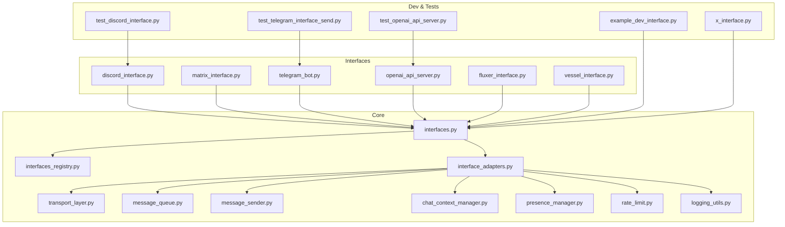
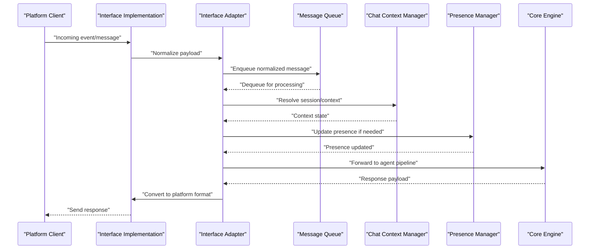
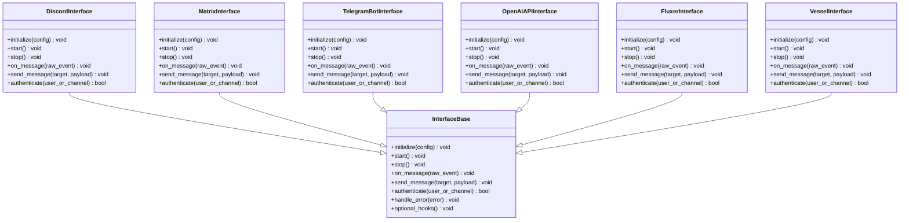
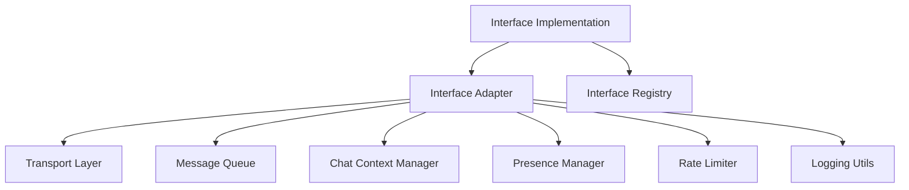

# Custom Interface Development

<cite>
**Referenced Files in This Document**
- [interfaces.py](file://core/interfaces.py)
- [interface_adapters.py](file://core/interface_adapters.py)
- [interfaces_registry.py](file://core/interfaces_registry.py)
- [transport_layer.py](file://core/transport_layer.py)
- [message_queue.py](file://core/message_queue.py)
- [message_sender.py](file://core/message_sender.py)
- [chat_context_manager.py](file://core/chat_context_manager.py)
- [presence_manager.py](file://core/presence_manager.py)
- [rate_limit.py](file://core/rate_limit.py)
- [logging_utils.py](file://core/logging_utils.py)
- [discord_interface.py](file://interface/discord_interface/discord_interface.py)
- [matrix_interface.py](file://interface/matrix_interface/matrix_interface.py)
- [telegram_bot.py](file://interface/telegram_bot/telegram_bot.py)
- [openai_api_server.py](file://interface/openai_api_server/openai_api_server.py)
- [fluxer_interface.py](file://interface/fluxer_interface/fluxer_interface.py)
- [vessel_interface.py](file://interface/vessel_interface.py)
- [example_dev_interface.py](file://interface_dev/example_dev_interface.py)
- [x_interface.py](file://interface_dev/x_interface.py)
- [test_discord_interface.py](file://tests/test_discord_interface.py)
- [test_telegram_interface_send.py](file://tests/test_telegram_interface_send.py)
- [test_openai_api_server.py](file://tests/test_openai_api_server.py)
</cite>

## Table of Contents
1. [Introduction](#introduction)
2. [Project Structure](#project-structure)
3. [Core Components](#core-components)
4. [Architecture Overview](#architecture-overview)
5. [Detailed Component Analysis](#detailed-component-analysis)
6. [Dependency Analysis](#dependency-analysis)
7. [Performance Considerations](#performance-considerations)
8. [Troubleshooting Guide](#troubleshooting-guide)
9. [Conclusion](#conclusion)
10. [Appendices](#appendices)

## Introduction
This document explains how to create custom interfaces for Synthetic Heart. It covers the interface base classes, required and optional methods, message format conversion, authentication patterns, error handling, testing strategies, debugging techniques, integration with the core engine, and deployment considerations. You will find step-by-step guides for implementing new platform integrations and complete examples ranging from simple to complex.

## Project Structure
Synthetic Heart organizes interfaces under a dedicated directory and provides a core interface abstraction that all implementations must follow. The key areas are:
- Core interface abstractions and registry
- Transport layer and messaging utilities
- Existing interface implementations (Discord, Matrix, Telegram, OpenAI API Server, Fluxer, Vessel)
- Developer examples and tests

**Diagram sources**
- [interfaces.py](file://core/interfaces.py)
- [interfaces_registry.py](file://core/interfaces_registry.py)
- [interface_adapters.py](file://core/interface_adapters.py)
- [transport_layer.py](file://core/transport_layer.py)
- [message_queue.py](file://core/message_queue.py)
- [message_sender.py](file://core/message_sender.py)
- [chat_context_manager.py](file://core/chat_context_manager.py)
- [presence_manager.py](file://core/presence_manager.py)
- [rate_limit.py](file://core/rate_limit.py)
- [logging_utils.py](file://core/logging_utils.py)
- [discord_interface.py](file://interface/discord_interface/discord_interface.py)
- [matrix_interface.py](file://interface/matrix_interface/matrix_interface.py)
- [telegram_bot.py](file://interface/telegram_bot/telegram_bot.py)
- [openai_api_server.py](file://interface/openai_api_server/openai_api_server.py)
- [fluxer_interface.py](file://interface/fluxer_interface/fluxer_interface.py)
- [vessel_interface.py](file://interface/vessel_interface.py)
- [example_dev_interface.py](file://interface_dev/example_dev_interface.py)
- [x_interface.py](file://interface_dev/x_interface.py)
- [test_discord_interface.py](file://tests/test_discord_interface.py)
- [test_telegram_interface_send.py](file://tests/test_telegram_interface_send.py)
- [test_openai_api_server.py](file://tests/test_openai_api_server.py)

**Section sources**
- [interfaces.py](file://core/interfaces.py)
- [interfaces_registry.py](file://core/interfaces_registry.py)
- [interface_adapters.py](file://core/interface_adapters.py)
- [transport_layer.py](file://core/transport_layer.py)
- [message_queue.py](file://core/message_queue.py)
- [message_sender.py](file://core/message_sender.py)
- [chat_context_manager.py](file://core/chat_context_manager.py)
- [presence_manager.py](file://core/presence_manager.py)
- [rate_limit.py](file://core/rate_limit.py)
- [logging_utils.py](file://core/logging_utils.py)
- [discord_interface.py](file://interface/discord_interface/discord_interface.py)
- [matrix_interface.py](file://interface/matrix_interface/matrix_interface.py)
- [telegram_bot.py](file://interface/telegram_bot/telegram_bot.py)
- [openai_api_server.py](file://interface/openai_api_server/openai_api_server.py)
- [fluxer_interface.py](file://interface/fluxer_interface/fluxer_interface.py)
- [vessel_interface.py](file://interface/vessel_interface.py)
- [example_dev_interface.py](file://interface_dev/example_dev_interface.py)
- [x_interface.py](file://interface_dev/x_interface.py)
- [test_discord_interface.py](file://tests/test_discord_interface.py)
- [test_telegram_interface_send.py](file://tests/test_telegram_interface_send.py)
- [test_openai_api_server.py](file://tests/test_openai_api_server.py)

## Core Components
The interface system is built around a base class that defines the contract for all platform integrations. Implementations must handle incoming events, send outgoing messages, manage sessions, and integrate with core services like context management, presence, rate limiting, and logging.

Key responsibilities:
- Define lifecycle hooks for initialization and shutdown
- Parse inbound messages into the internal message model
- Convert outbound responses back to platform-specific formats
- Authenticate users or channels as needed
- Handle errors and retries consistently
- Integrate with chat context and presence systems

**Section sources**
- [interfaces.py](file://core/interfaces.py)
- [interface_adapters.py](file://core/interface_adapters.py)
- [interfaces_registry.py](file://core/interfaces_registry.py)

## Architecture Overview
Custom interfaces plug into the core via an adapter layer that normalizes interactions across platforms. The adapter coordinates transport, queueing, context, presence, rate limiting, and logging.

**Diagram sources**
- [interface_adapters.py](file://core/interface_adapters.py)
- [message_queue.py](file://core/message_queue.py)
- [chat_context_manager.py](file://core/chat_context_manager.py)
- [presence_manager.py](file://core/presence_manager.py)
- [transport_layer.py](file://core/transport_layer.py)

## Detailed Component Analysis

### Interface Base Class and Contract
All custom interfaces should subclass the provided base class and implement the required lifecycle and I/O methods. Typical requirements include:
- Initialization and configuration loading
- Start/stop lifecycle hooks
- Inbound event parsing and normalization
- Outbound message sending
- Optional hooks for authentication, rate limiting, and presence updates

**Diagram sources**
- [interfaces.py](file://core/interfaces.py)
- [discord_interface.py](file://interface/discord_interface/discord_interface.py)
- [matrix_interface.py](file://interface/matrix_interface/matrix_interface.py)
- [telegram_bot.py](file://interface/telegram_bot/telegram_bot.py)
- [openai_api_server.py](file://interface/openai_api_server/openai_api_server.py)
- [fluxer_interface.py](file://interface/fluxer_interface/fluxer_interface.py)
- [vessel_interface.py](file://interface/vessel_interface.py)

**Section sources**
- [interfaces.py](file://core/interfaces.py)
- [discord_interface.py](file://interface/discord_interface/discord_interface.py)
- [matrix_interface.py](file://interface/matrix_interface/matrix_interface.py)
- [telegram_bot.py](file://interface/telegram_bot/telegram_bot.py)
- [openai_api_server.py](file://interface/openai_api_server/openai_api_server.py)
- [fluxer_interface.py](file://interface/fluxer_interface/fluxer_interface.py)
- [vessel_interface.py](file://interface/vessel_interface.py)

### Message Format Conversion
Interfaces must convert between platform-specific payloads and the internal message model used by the core. Key steps:
- Normalize inbound fields such as sender identity, timestamp, content type, and attachments
- Map platform-specific metadata to core attributes (e.g., thread IDs, mentions)
- Convert outbound responses to platform-native formats including rich media and structured data

Best practices:
- Validate inputs early and reject malformed messages
- Preserve original identifiers for reply threading
- Use consistent encoding and sanitize user input

**Section sources**
- [interface_adapters.py](file://core/interface_adapters.py)
- [message_queue.py](file://core/message_queue.py)
- [message_sender.py](file://core/message_sender.py)

### Authentication Implementation
Authentication varies by platform but generally involves:
- Verifying tokens or signatures on inbound requests
- Establishing session state per user or channel
- Enforcing access policies before processing messages

Patterns:
- Token-based verification for API endpoints
- Bot-level authentication for chat platforms
- Optional per-user authorization checks

**Section sources**
- [discord_interface.py](file://interface/discord_interface/discord_interface.py)
- [matrix_interface.py](file://interface/matrix_interface/matrix_interface.py)
- [telegram_bot.py](file://interface/telegram_bot/telegram_bot.py)
- [openai_api_server.py](file://interface/openai_api_server/openai_api_server.py)

### Error Handling Patterns
Robust error handling ensures stability and observability:
- Catch and log exceptions with contextual information
- Retry transient failures with backoff where appropriate
- Return meaningful error responses to clients
- Emit metrics or logs for monitoring and alerting

Common strategies:
- Distinguish between client errors and server errors
- Gracefully degrade when dependencies fail
- Provide fallback paths for critical operations

**Section sources**
- [interface_adapters.py](file://core/interface_adapters.py)
- [logging_utils.py](file://core/logging_utils.py)
- [rate_limit.py](file://core/rate_limit.py)

### Integration With Core Engine
Interfaces integrate through the adapter layer which coordinates:
- Transport mechanisms (HTTP, WebSocket, queues)
- Message queuing and ordering
- Chat context resolution and persistence
- Presence updates and status propagation
- Rate limiting and throttling

Integration checklist:
- Register your interface with the registry
- Ensure lifecycle hooks are properly implemented
- Use the adapter for consistent message flow
- Leverage shared utilities for logging and rate limiting

**Section sources**
- [interfaces_registry.py](file://core/interfaces_registry.py)
- [interface_adapters.py](file://core/interface_adapters.py)
- [transport_layer.py](file://core/transport_layer.py)
- [chat_context_manager.py](file://core/chat_context_manager.py)
- [presence_manager.py](file://core/presence_manager.py)
- [rate_limit.py](file://core/rate_limit.py)

### Step-by-Step Guide: Implementing a New Platform Integration
Follow these steps to add a new interface:
1. Create a new module under the interface directory
2. Subclass the interface base class and implement required methods
3. Implement inbound event parsing and outbound message sending
4. Add authentication logic specific to the platform
5. Integrate with the adapter layer for message flow
6. Register the interface in the registry
7. Write unit and integration tests
8. Document configuration and usage

Example references:
- Simple example: minimal interface implementation
- Complex example: full-featured interface with advanced features

**Section sources**
- [example_dev_interface.py](file://interface_dev/example_dev_interface.py)
- [x_interface.py](file://interface_dev/x_interface.py)
- [interfaces_registry.py](file://core/interfaces_registry.py)

### Testing Strategies
Effective testing ensures reliability:
- Unit tests for parsing and conversion logic
- Mock external dependencies for stable test runs
- Integration tests simulating real platform behavior
- Regression tests for edge cases and error conditions

Recommended approaches:
- Use fixtures for common configurations
- Assert message transformations and error paths
- Validate authentication flows and rate limiting behavior

**Section sources**
- [test_discord_interface.py](file://tests/test_discord_interface.py)
- [test_telegram_interface_send.py](file://tests/test_telegram_interface_send.py)
- [test_openai_api_server.py](file://tests/test_openai_api_server.py)

### Debugging Techniques
Debugging custom interfaces benefits from:
- Structured logging with correlation IDs
- Tracing message flows across components
- Inspecting raw payloads and converted models
- Monitoring rate limits and presence updates

Tips:
- Enable verbose logging during development
- Capture network traces for transport issues
- Use test harnesses to reproduce problems quickly

**Section sources**
- [logging_utils.py](file://core/logging_utils.py)
- [interface_adapters.py](file://core/interface_adapters.py)
- [transport_layer.py](file://core/transport_layer.py)

### Complete Examples

#### Simple Custom Interface
A minimal interface demonstrates the essential methods:
- Initialize with configuration
- Start and stop lifecycle
- Parse inbound messages
- Send outbound responses
- Basic authentication check

Reference implementation:
- [example_dev_interface.py](file://interface_dev/example_dev_interface.py)

#### Complex Custom Interface
A more advanced interface includes:
- Rich media handling
- Threaded conversations
- Advanced authentication and authorization
- Presence and status synchronization
- Robust error handling and retries

Reference implementation:
- [x_interface.py](file://interface_dev/x_interface.py)

**Section sources**
- [example_dev_interface.py](file://interface_dev/example_dev_interface.py)
- [x_interface.py](file://interface_dev/x_interface.py)

## Dependency Analysis
Interfaces depend on core services for consistent behavior. The adapter layer centralizes these dependencies to reduce coupling.

**Diagram sources**
- [interface_adapters.py](file://core/interface_adapters.py)
- [transport_layer.py](file://core/transport_layer.py)
- [message_queue.py](file://core/message_queue.py)
- [chat_context_manager.py](file://core/chat_context_manager.py)
- [presence_manager.py](file://core/presence_manager.py)
- [rate_limit.py](file://core/rate_limit.py)
- [logging_utils.py](file://core/logging_utils.py)
- [interfaces_registry.py](file://core/interfaces_registry.py)

**Section sources**
- [interface_adapters.py](file://core/interface_adapters.py)
- [interfaces_registry.py](file://core/interfaces_registry.py)

## Performance Considerations
To ensure scalability and responsiveness:
- Use asynchronous operations for I/O-bound tasks
- Implement efficient message queuing and batching
- Apply rate limiting to prevent overload
- Cache frequently accessed data where appropriate
- Monitor resource usage and tune concurrency settings

Recommendations:
- Profile hot paths in message processing
- Avoid blocking calls in event handlers
- Use connection pooling for external APIs
- Optimize serialization and deserialization

[No sources needed since this section provides general guidance]

## Troubleshooting Guide
Common issues and resolutions:
- Authentication failures: verify tokens and permissions
- Message delivery problems: check transport and queue health
- Rate limit errors: adjust limits or implement backoff
- Context mismatches: validate session identifiers and routing
- Logging gaps: ensure correlation IDs and structured logs

Diagnostic steps:
- Inspect logs for errors and warnings
- Trace message flow from inbound to outbound
- Validate configuration and environment variables
- Reproduce issues with minimal test cases

**Section sources**
- [logging_utils.py](file://core/logging_utils.py)
- [interface_adapters.py](file://core/interface_adapters.py)
- [transport_layer.py](file://core/transport_layer.py)

## Conclusion
Custom interfaces extend Synthetic Heart’s capabilities by integrating diverse platforms through a consistent abstraction. By following the base class contract, leveraging the adapter layer, and adhering to best practices for authentication, error handling, and performance, you can build robust and scalable integrations. Use the provided examples and tests as references to accelerate development and ensure quality.

[No sources needed since this section summarizes without analyzing specific files]

## Appendices

### Configuration and Deployment
- Configure interface-specific settings via environment variables or config files
- Deploy interfaces as separate processes or within the main application depending on scale
- Use containerization for consistent environments and scaling
- Monitor and alert on key metrics such as message throughput and error rates

[No sources needed since this section provides general guidance]