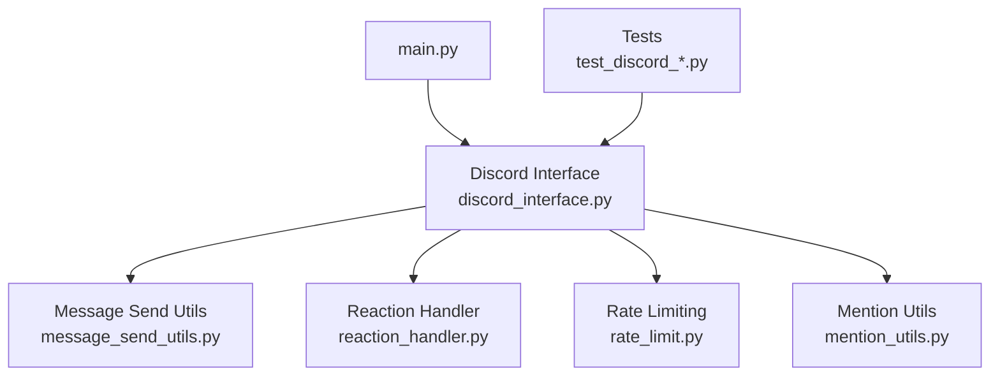
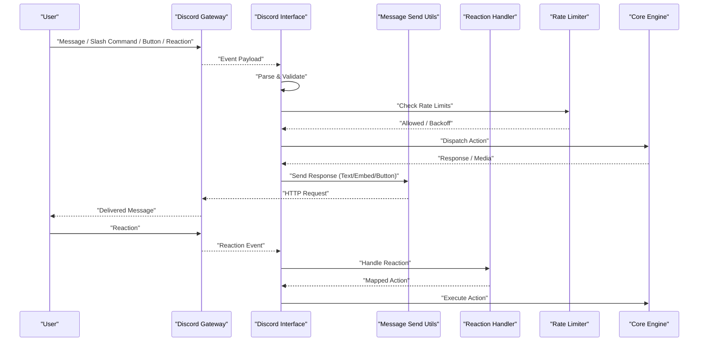
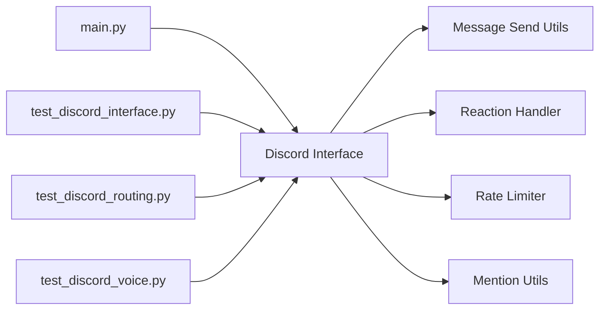

# Discord Bot Integration

<cite>
**Referenced Files in This Document**
- [discord_interface.py](file://interface/discord_interface/discord_interface.py)
- [guide.md](file://interface/discord_interface/guide.md)
- [__init__.py](file://interface/discord_interface/__init__.py)
- [test_discord_interface.py](file://tests/test_discord_interface.py)
- [test_discord_routing.py](file://tests/test_discord_routing.py)
- [test_discord_voice.py](file://tests/test_discord_voice.py)
- [rate_limit.py](file://core/rate_limit.py)
- [message_send_utils.py](file://interface/message_send_utils.py)
- [reaction_handler.py](file://core/reaction_handler.py)
- [mention_utils.py](file://core/mention_utils.py)
- [main.py](file://main.py)
</cite>

## Table of Contents
1. [Introduction](#introduction)
2. [Project Structure](#project-structure)
3. [Core Components](#core-components)
4. [Architecture Overview](#architecture-overview)
5. [Detailed Component Analysis](#detailed-component-analysis)
6. [Dependency Analysis](#dependency-analysis)
7. [Performance Considerations](#performance-considerations)
8. [Troubleshooting Guide](#troubleshooting-guide)
9. [Conclusion](#conclusion)
10. [Appendices](#appendices)

## Introduction
This document explains how Synthetic Heart integrates with Discord as a bot interface. It covers setup, token configuration, permissions, command handling (including slash commands), button interactions, embed formatting, voice channel support and audio streaming, real-time messaging, custom command creation, reaction handling, role-based access control, rate limiting strategies, error recovery, debugging techniques aligned to Discord API limitations, and production deployment considerations.

## Project Structure
The Discord integration is implemented under the interface layer and wired into the application entry point. Key files include:
- The Discord interface implementation and its guide
- Utilities for sending messages and handling reactions
- Rate limiting utilities used by the interface
- Tests that validate routing, voice behavior, and general functionality
- The application entry point that initializes interfaces

**Diagram sources**
- [main.py](file://main.py)
- [discord_interface.py](file://interface/discord_interface/discord_interface.py)
- [message_send_utils.py](file://interface/message_send_utils.py)
- [reaction_handler.py](file://core/reaction_handler.py)
- [rate_limit.py](file://core/rate_limit.py)
- [mention_utils.py](file://core/mention_utils.py)
- [test_discord_interface.py](file://tests/test_discord_interface.py)
- [test_discord_routing.py](file://tests/test_discord_routing.py)
- [test_discord_voice.py](file://tests/test_discord_voice.py)

**Section sources**
- [discord_interface.py](file://interface/discord_interface/discord_interface.py)
- [guide.md](file://interface/discord_interface/guide.md)
- [message_send_utils.py](file://interface/message_send_utils.py)
- [reaction_handler.py](file://core/reaction_handler.py)
- [rate_limit.py](file://core/rate_limit.py)
- [mention_utils.py](file://core/mention_utils.py)
- [main.py](file://main.py)
- [test_discord_interface.py](file://tests/test_discord_interface.py)
- [test_discord_routing.py](file://tests/test_discord_routing.py)
- [test_discord_voice.py](file://tests/test_discord_voice.py)

## Core Components
- Discord Interface Module: Implements the Discord client lifecycle, event listeners, command registration, slash commands, buttons, embeds, voice, and message routing.
- Message Sending Utilities: Centralizes safe message dispatch, retries, and payload formatting.
- Reaction Handler: Provides consistent logic for processing user reactions and mapping them to actions.
- Rate Limiting: Enforces per-endpoint and global limits to respect Discord API quotas.
- Mention Utilities: Normalizes mentions and resolves user/channel context across channels.

Key responsibilities:
- Initialize the Discord client with tokens and intents
- Register slash commands and interactive components
- Route incoming events to internal handlers
- Stream audio in voice channels when enabled
- Format rich responses using embeds and buttons
- Respect rate limits and recover from transient errors

**Section sources**
- [discord_interface.py](file://interface/discord_interface/discord_interface.py)
- [message_send_utils.py](file://interface/message_send_utils.py)
- [reaction_handler.py](file://core/reaction_handler.py)
- [rate_limit.py](file://core/rate_limit.py)
- [mention_utils.py](file://core/mention_utils.py)

## Architecture Overview
The Discord interface sits between the Discord gateway and Synthetic Heart’s core. It translates Discord events into internal actions and publishes responses back through Discord.

**Diagram sources**
- [discord_interface.py](file://interface/discord_interface/discord_interface.py)
- [message_send_utils.py](file://interface/message_send_utils.py)
- [reaction_handler.py](file://core/reaction_handler.py)
- [rate_limit.py](file://core/rate_limit.py)

## Detailed Component Analysis

### Discord Interface Setup and Configuration
- Token configuration: Provide the bot token via environment or configuration; the interface reads it at startup and connects to Discord.
- Intents and permissions: Configure required intents (e.g., guild messages, message content, presence) and bot permissions (e.g., send messages, embed links, manage roles, connect to voice).
- Channel scoping: Optionally restrict commands to specific channels or roles.
- Initialization flow: The interface registers commands, sets up event listeners, and starts the client loop.

Best practices:
- Use least-privilege permissions.
- Separate development and production tokens.
- Log initialization status and failures clearly.

**Section sources**
- [discord_interface.py](file://interface/discord_interface/discord_interface.py)
- [guide.md](file://interface/discord_interface/guide.md)

### Command Handling and Slash Commands
- Text commands: Prefix-based commands are parsed and routed to handlers.
- Slash commands: Registered globally or per-guild; parameters validated before execution.
- Context extraction: Channel, author, and mention resolution are normalized.
- Error handling: Graceful fallbacks on missing permissions or invalid input.

Example flows:
- User invokes a slash command → Interface validates → Core executes → Response sent via embed or text.

**Section sources**
- [discord_interface.py](file://interface/discord_interface/discord_interface.py)
- [test_discord_interface.py](file://tests/test_discord_interface.py)
- [test_discord_routing.py](file://tests/test_discord_routing.py)

### Button Interactions and Embed Formatting
- Buttons: Inline components attached to messages; click events trigger callbacks.
- Embeds: Rich formatting for structured responses, including fields, images, and footers.
- Persistence: Button states can be updated without resending full payloads where supported.

Implementation notes:
- Ensure required permissions for embeds and buttons.
- Keep payloads within Discord size limits.
- Use idempotent handlers to avoid duplicate executions.

**Section sources**
- [discord_interface.py](file://interface/discord_interface/discord_interface.py)
- [message_send_utils.py](file://interface/message_send_utils.py)

### Voice Channel Support and Audio Streaming
- Voice connectivity: Join voice channels, handle join/leave events, and manage session lifecycle.
- Audio streaming: Play streamed audio chunks; support common formats and codecs.
- Real-time messaging: Combine chat with voice sessions for synchronized experiences.

Operational guidance:
- Monitor latency and buffer underruns.
- Gracefully reconnect on network interruptions.
- Respect rate limits for voice-related endpoints.

**Section sources**
- [discord_interface.py](file://interface/discord_interface/discord_interface.py)
- [test_discord_voice.py](file://tests/test_discord_voice.py)

### Reaction Handling
- Listens to add/remove reaction events.
- Maps reactions to predefined actions or dynamic behaviors.
- Supports role-based gating and cooldowns.

Usage patterns:
- Thumbs-up to acknowledge, custom emoji to trigger workflows.
- Debounce rapid reactions to avoid spam.

**Section sources**
- [reaction_handler.py](file://core/reaction_handler.py)
- [discord_interface.py](file://interface/discord_interface/discord_interface.py)

### Role-Based Access Control
- Role checks: Verify user roles before executing sensitive commands.
- Channel-level restrictions: Limit access to specific channels.
- Dynamic policies: Evaluate permissions at runtime based on configuration.

Security tips:
- Avoid hardcoding roles; load from configuration.
- Audit role changes and log permission denials.

**Section sources**
- [discord_interface.py](file://interface/discord_interface/discord_interface.py)

### Custom Command Creation
Steps:
- Define a command handler function.
- Register it with the command registry or slash command table.
- Implement validation, execution, and response formatting.
- Add tests to ensure reliability.

Guidelines:
- Keep handlers small and focused.
- Return structured results for consistent embedding.
- Handle timeouts and partial failures.

**Section sources**
- [discord_interface.py](file://interface/discord_interface/discord_interface.py)
- [test_discord_interface.py](file://tests/test_discord_interface.py)

### Real-Time Messaging Features
- Event-driven architecture: React to messages, reactions, and presence changes.
- Context management: Maintain conversation state per channel or thread.
- Threading: Offload long-running tasks to avoid blocking the event loop.

Reliability:
- Queue outgoing messages during high load.
- Retry failed sends with exponential backoff.

**Section sources**
- [discord_interface.py](file://interface/discord_interface/discord_interface.py)
- [message_send_utils.py](file://interface/message_send_utils.py)

## Dependency Analysis
The Discord interface depends on several core utilities and is initialized by the main application.

**Diagram sources**
- [main.py](file://main.py)
- [discord_interface.py](file://interface/discord_interface/discord_interface.py)
- [message_send_utils.py](file://interface/message_send_utils.py)
- [reaction_handler.py](file://core/reaction_handler.py)
- [rate_limit.py](file://core/rate_limit.py)
- [mention_utils.py](file://core/mention_utils.py)
- [test_discord_interface.py](file://tests/test_discord_interface.py)
- [test_discord_routing.py](file://tests/test_discord_routing.py)
- [test_discord_voice.py](file://tests/test_discord_voice.py)

**Section sources**
- [discord_interface.py](file://interface/discord_interface/discord_interface.py)
- [message_send_utils.py](file://interface/message_send_utils.py)
- [reaction_handler.py](file://core/reaction_handler.py)
- [rate_limit.py](file://core/rate_limit.py)
- [mention_utils.py](file://core/mention_utils.py)
- [main.py](file://main.py)
- [test_discord_interface.py](file://tests/test_discord_interface.py)
- [test_discord_routing.py](file://tests/test_discord_routing.py)
- [test_discord_voice.py](file://tests/test_discord_voice.py)

## Performance Considerations
- Rate limiting: Use built-in rate limiter to throttle requests and avoid 429 responses.
- Batch operations: Group updates where possible to reduce HTTP calls.
- Async concurrency: Process independent tasks concurrently while respecting Discord concurrency limits.
- Memory usage: Stream large media instead of loading entirely into memory.
- Logging: Enable structured logs for performance monitoring and alerting.

[No sources needed since this section provides general guidance]

## Troubleshooting Guide
Common issues and resolutions:
- Authentication failures: Verify token validity and correct scopes/intents.
- Permission errors: Ensure bot has required permissions in the target guild/channel.
- Rate limit hits: Implement backoff and queue messages; monitor 429 responses.
- Voice disconnects: Reconnect automatically; check network stability and codec compatibility.
- Embed/button rendering: Validate payload sizes and field counts against Discord limits.

Debugging techniques:
- Enable verbose logging for Discord events and HTTP requests.
- Use test suites to reproduce issues locally.
- Inspect error traces from message send utilities and rate limiter.

**Section sources**
- [rate_limit.py](file://core/rate_limit.py)
- [message_send_utils.py](file://interface/message_send_utils.py)
- [test_discord_interface.py](file://tests/test_discord_interface.py)
- [test_discord_voice.py](file://tests/test_discord_voice.py)

## Conclusion
Synthetic Heart’s Discord integration provides a robust foundation for building interactive bots with commands, rich UI elements, voice capabilities, and real-time messaging. By following the setup guidelines, adhering to rate limits, and leveraging the provided utilities, you can create reliable and scalable Discord experiences.

[No sources needed since this section summarizes without analyzing specific files]

## Appendices

### Quick Start Checklist
- Generate a bot token and enable required intents.
- Set permissions for your bot in the Discord developer portal.
- Configure environment variables for tokens and settings.
- Start the application and verify command registration.
- Test voice connectivity and message sending.

**Section sources**
- [guide.md](file://interface/discord_interface/guide.md)
- [discord_interface.py](file://interface/discord_interface/discord_interface.py)

### Deployment Considerations
- Environment isolation: Use separate tokens and configurations for dev/staging/prod.
- Containerization: Package the interface with dependencies and set secrets via environment variables.
- Health checks: Expose readiness/liveness endpoints if running behind a service mesh.
- Scaling: Run multiple instances only if stateless; otherwise, coordinate via shared state.
- Monitoring: Collect metrics on request rates, latency, and error counts.

[No sources needed since this section provides general guidance]