# Interface Architecture & Abstraction

<cite>
**Referenced Files in This Document**
- [interfaces.py](file://core/interfaces.py)
- [interface_adapters.py](file://core/interface_adapters.py)
- [interfaces_registry.py](file://core/interfaces_registry.py)
- [component_registry.py](file://core/component_registry.py)
- [message_queue.py](file://core/message_queue.py)
- [transport_layer.py](file://core/transport_layer.py)
- [rate_limit.py](file://core/rate_limit.py)
- [event_dispatcher.py](file://core/event_dispatcher.py)
- [plugin_base.py](file://core/plugin_base.py)
- [ai_plugin_base.py](file://core/ai_plugin_base.py)
- [main.py](file://main.py)
- [discord_interface.py](file://interface/discord_interface/discord_interface.py)
- [matrix_interface.py](file://interface/matrix_interface/matrix_interface.py)
- [telegram_bot.py](file://interface/telegram_bot/telegram_bot.py)
- [openai_api_server.py](file://interface/openai_api_server/openai_api_server.py)
- [fluxer_interface.py](file://interface/fluxer_interface/fluxer_interface.py)
</cite>

## Table of Contents
1. [Introduction](#introduction)
2. [Project Structure](#project-structure)
3. [Core Components](#core-components)
4. [Architecture Overview](#architecture-overview)
5. [Detailed Component Analysis](#detailed-component-analysis)
6. [Dependency Analysis](#dependency-analysis)
7. [Performance Considerations](#performance-considerations)
8. [Troubleshooting Guide](#troubleshooting-guide)
9. [Conclusion](#conclusion)

## Introduction
This document explains Synthetic Heart’s interface architecture and abstraction layer that enables seamless communication between the core engine and multiple platform adapters (Discord, Matrix, Telegram, OpenAI API server, Fluxer). It covers the unified message format, interface base classes, component registration, message routing, event handling, lifecycle management, dependency injection, plugin integration points, error handling, rate limiting, and connection management at the architectural level.

## Project Structure
The interface subsystem is organized around a small set of core abstractions and registries in the core package, with concrete platform implementations under the interface package. The main entry point wires everything together during startup.

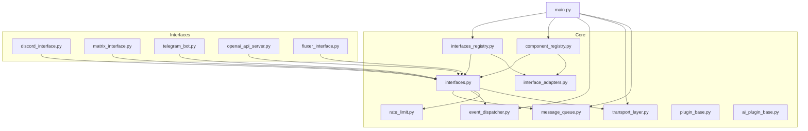

**Diagram sources**
- [interfaces.py:1-200](file://core/interfaces.py#L1-L200)
- [interface_adapters.py:1-200](file://core/interface_adapters.py#L1-L200)
- [interfaces_registry.py:1-200](file://core/interfaces_registry.py#L1-L200)
- [component_registry.py:1-200](file://core/component_registry.py#L1-L200)
- [message_queue.py:1-200](file://core/message_queue.py#L1-L200)
- [transport_layer.py:1-200](file://core/transport_layer.py#L1-L200)
- [rate_limit.py:1-200](file://core/rate_limit.py#L1-L200)
- [event_dispatcher.py:1-200](file://core/event_dispatcher.py#L1-L200)
- [plugin_base.py:1-200](file://core/plugin_base.py#L1-L200)
- [ai_plugin_base.py:1-200](file://core/ai_plugin_base.py#L1-L200)
- [main.py:1-200](file://main.py#L1-L200)
- [discord_interface.py:1-200](file://interface/discord_interface/discord_interface.py#L1-L200)
- [matrix_interface.py:1-200](file://interface/matrix_interface/matrix_interface.py#L1-L200)
- [telegram_bot.py:1-200](file://interface/telegram_bot/telegram_bot.py#L1-L200)
- [openai_api_server.py:1-200](file://interface/openai_api_server/openai_api_server.py#L1-L200)
- [fluxer_interface.py:1-200](file://interface/fluxer_interface/fluxer_interface.py#L1-L200)

**Section sources**
- [interfaces.py:1-200](file://core/interfaces.py#L1-L200)
- [interface_adapters.py:1-200](file://core/interface_adapters.py#L1-L200)
- [interfaces_registry.py:1-200](file://core/interfaces_registry.py#L1-L200)
- [component_registry.py:1-200](file://core/component_registry.py#L1-L200)
- [message_queue.py:1-200](file://core/message_queue.py#L1-L200)
- [transport_layer.py:1-200](file://core/transport_layer.py#L1-L200)
- [rate_limit.py:1-200](file://core/rate_limit.py#L1-L200)
- [event_dispatcher.py:1-200](file://core/event_dispatcher.py#L1-L200)
- [plugin_base.py:1-200](file://core/plugin_base.py#L1-L200)
- [ai_plugin_base.py:1-200](file://core/ai_plugin_base.py#L1-L200)
- [main.py:1-200](file://main.py#L1-L200)
- [discord_interface.py:1-200](file://interface/discord_interface/discord_interface.py#L1-L200)
- [matrix_interface.py:1-200](file://interface/matrix_interface/matrix_interface.py#L1-L200)
- [telegram_bot.py:1-200](file://interface/telegram_bot/telegram_bot.py#L1-L200)
- [openai_api_server.py:1-200](file://interface/openai_api_server/openai_api_server.py#L1-L200)
- [fluxer_interface.py:1-200](file://interface/fluxer_interface/fluxer_interface.py#L1-L200)

## Core Components
- Unified Message Format: A consistent payload structure used across all interfaces for inbound and outbound messages, including fields such as sender, content type, attachments, timestamps, and routing metadata.
- Interface Base Classes: Abstract contracts defining lifecycle methods (initialize, connect, send, receive, shutdown), capabilities, and configuration hooks.
- Component Registration System: Central registries for interfaces and components enabling discovery, dependency resolution, and hot-swapping.
- Message Queue: Asynchronous queueing for inbound/outbound messages with priority and backpressure support.
- Transport Layer: Connection management, retry, and transport-agnostic I/O primitives.
- Rate Limiting: Global and per-interface throttling to respect provider limits and avoid overuse.
- Event Dispatcher: Pub/sub mechanism for decoupled event propagation across components.
- Plugin Base Classes: Contracts for plugins to integrate with the interface layer and core engine.

**Section sources**
- [interfaces.py:1-200](file://core/interfaces.py#L1-L200)
- [interface_adapters.py:1-200](file://core/interface_adapters.py#L1-L200)
- [interfaces_registry.py:1-200](file://core/interfaces_registry.py#L1-L200)
- [component_registry.py:1-200](file://core/component_registry.py#L1-L200)
- [message_queue.py:1-200](file://core/message_queue.py#L1-L200)
- [transport_layer.py:1-200](file://core/transport_layer.py#L1-L200)
- [rate_limit.py:1-200](file://core/rate_limit.py#L1-L200)
- [event_dispatcher.py:1-200](file://core/event_dispatcher.py#L1-L200)
- [plugin_base.py:1-200](file://core/plugin_base.py#L1-L200)
- [ai_plugin_base.py:1-200](file://core/ai_plugin_base.py#L1-L200)

## Architecture Overview
At runtime, the main process initializes registries, loads interface implementations, and starts transports. Inbound messages from platforms are normalized into the unified format, routed through the core engine, and responses are dispatched back via the appropriate interface. Events propagate asynchronously, while rate limiting and transport retries ensure resilience.

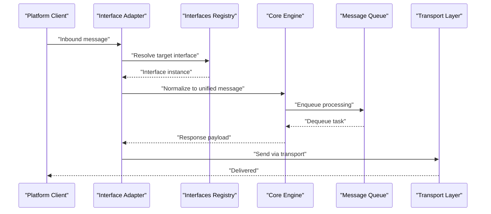

**Diagram sources**
- [interfaces_registry.py:1-200](file://core/interfaces_registry.py#L1-L200)
- [interface_adapters.py:1-200](file://core/interface_adapters.py#L1-L200)
- [message_queue.py:1-200](file://core/message_queue.py#L1-L200)
- [transport_layer.py:1-200](file://core/transport_layer.py#L1-L200)

## Detailed Component Analysis

### Unified Message Format
- Purpose: Standardize payloads across Discord, Matrix, Telegram, OpenAI API server, and Fluxer.
- Fields: Sender identity, channel/path, content type, text/media attachments, timestamps, correlation IDs, and routing hints.
- Validation: Enforced by adapters before normalization; errors are logged and rejected early.
- Transformation: Adapters convert platform-specific formats into the unified schema.

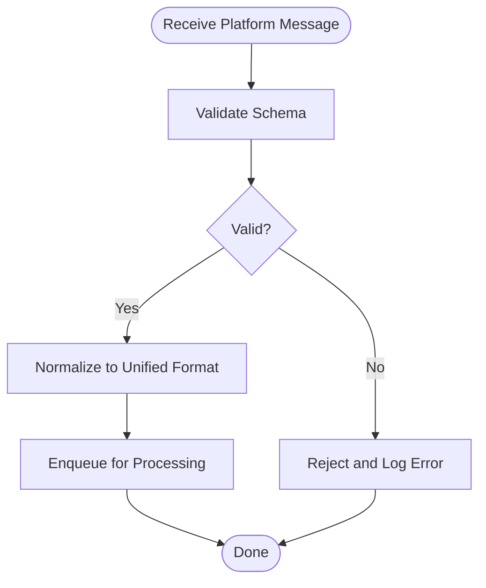

**Diagram sources**
- [interface_adapters.py:1-200](file://core/interface_adapters.py#L1-L200)
- [interfaces.py:1-200](file://core/interfaces.py#L1-L200)

**Section sources**
- [interface_adapters.py:1-200](file://core/interface_adapters.py#L1-L200)
- [interfaces.py:1-200](file://core/interfaces.py#L1-L200)

### Interface Base Classes
- Lifecycle: initialize(), connect(), send(), receive(), shutdown().
- Capabilities: Declares supported features like media, voice, reactions.
- Configuration: Accepts settings and secrets via dependency injection.
- Error Handling: Consistent exception types and retry policies.

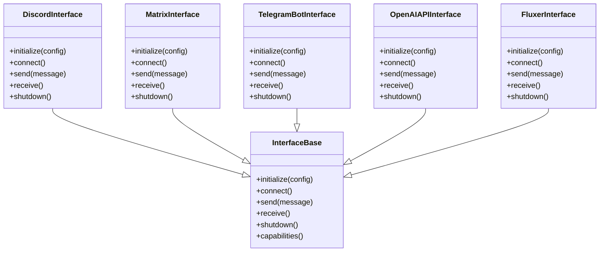

**Diagram sources**
- [interfaces.py:1-200](file://core/interfaces.py#L1-L200)
- [discord_interface.py:1-200](file://interface/discord_interface/discord_interface.py#L1-L200)
- [matrix_interface.py:1-200](file://interface/matrix_interface/matrix_interface.py#L1-L200)
- [telegram_bot.py:1-200](file://interface/telegram_bot/telegram_bot.py#L1-L200)
- [openai_api_server.py:1-200](file://interface/openai_api_server/openai_api_server.py#L1-L200)
- [fluxer_interface.py:1-200](file://interface/fluxer_interface/fluxer_interface.py#L1-L200)

**Section sources**
- [interfaces.py:1-200](file://core/interfaces.py#L1-L200)
- [discord_interface.py:1-200](file://interface/discord_interface/discord_interface.py#L1-L200)
- [matrix_interface.py:1-200](file://interface/matrix_interface/matrix_interface.py#L1-L200)
- [telegram_bot.py:1-200](file://interface/telegram_bot/telegram_bot.py#L1-L200)
- [openai_api_server.py:1-200](file://interface/openai_api_server/openai_api_server.py#L1-L200)
- [fluxer_interface.py:1-200](file://interface/fluxer_interface/fluxer_interface.py#L1-L200)

### Component Registration System
- Interfaces Registry: Discovers and instantiates interface implementations based on configuration.
- Component Registry: Manages lifecycle and dependencies of core components.
- Dependency Injection: Resolves services and passes them into interfaces and plugins.

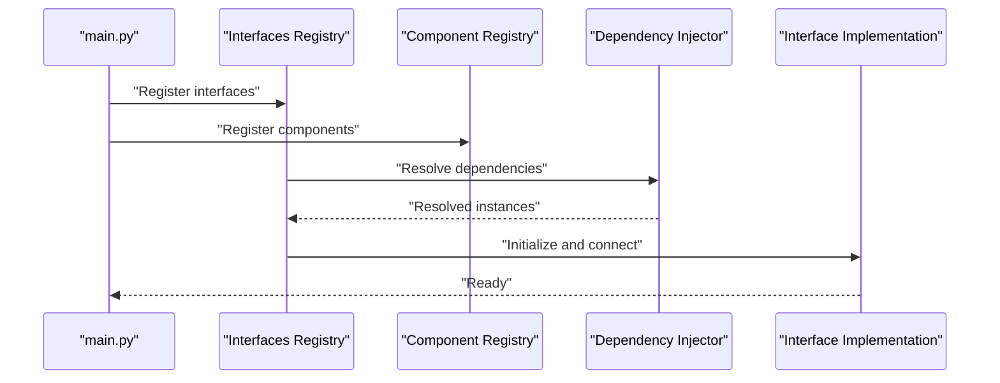

**Diagram sources**
- [interfaces_registry.py:1-200](file://core/interfaces_registry.py#L1-L200)
- [component_registry.py:1-200](file://core/component_registry.py#L1-L200)
- [main.py:1-200](file://main.py#L1-L200)

**Section sources**
- [interfaces_registry.py:1-200](file://core/interfaces_registry.py#L1-L200)
- [component_registry.py:1-200](file://core/component_registry.py#L1-L200)
- [main.py:1-200](file://main.py#L1-L200)

### Message Routing Mechanisms
- Normalization: Adapters convert platform messages to unified format.
- Routing: Core engine routes messages to handlers based on type, scope, and policy.
- Outbound Dispatch: Responses are sent back via the originating interface.

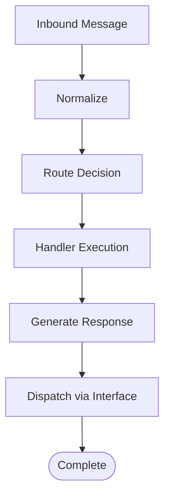

**Diagram sources**
- [interface_adapters.py:1-200](file://core/interface_adapters.py#L1-L200)
- [message_queue.py:1-200](file://core/message_queue.py#L1-L200)

**Section sources**
- [interface_adapters.py:1-200](file://core/interface_adapters.py#L1-L200)
- [message_queue.py:1-200](file://core/message_queue.py#L1-L200)

### Event Handling Patterns
- Pub/Sub: Event dispatcher emits typed events; subscribers react asynchronously.
- Decoupling: Interfaces emit lifecycle and operational events without tight coupling.
- Observability: Events can be logged or forwarded to monitoring systems.

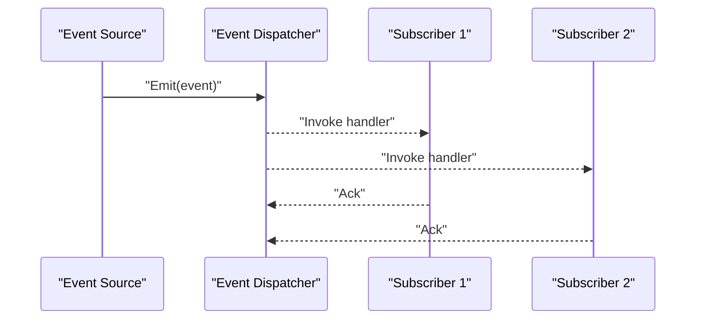

**Diagram sources**
- [event_dispatcher.py:1-200](file://core/event_dispatcher.py#L1-L200)

**Section sources**
- [event_dispatcher.py:1-200](file://core/event_dispatcher.py#L1-L200)

### Interface Lifecycle
- Initialization: Config validation, secret loading, capability negotiation.
- Connection: Establishes persistent connections or prepares request/response cycles.
- Operation: Handles inbound messages and sends outbound responses.
- Shutdown: Graceful teardown, resource cleanup, and state persistence.

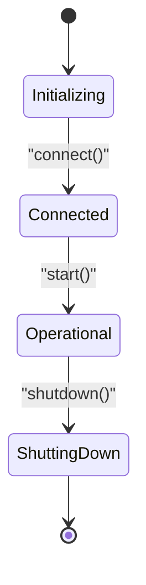

**Diagram sources**
- [interfaces.py:1-200](file://core/interfaces.py#L1-L200)

**Section sources**
- [interfaces.py:1-200](file://core/interfaces.py#L1-L200)

### Dependency Injection
- Service Resolution: Centralized container provides shared services (config, logging, DB, rate limiter).
- Interface Wiring: Interfaces receive injected dependencies during initialization.
- Plugin Integration: Plugins declare required services and receive them automatically.

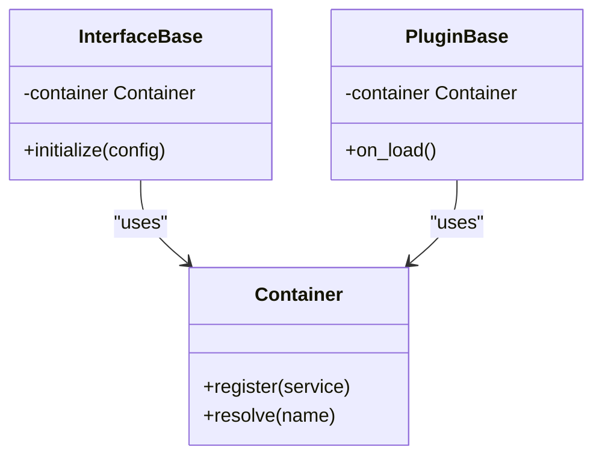

**Diagram sources**
- [interfaces.py:1-200](file://core/interfaces.py#L1-L200)
- [plugin_base.py:1-200](file://core/plugin_base.py#L1-L200)
- [ai_plugin_base.py:1-200](file://core/ai_plugin_base.py#L1-L200)

**Section sources**
- [interfaces.py:1-200](file://core/interfaces.py#L1-L200)
- [plugin_base.py:1-200](file://core/plugin_base.py#L1-L200)
- [ai_plugin_base.py:1-200](file://core/ai_plugin_base.py#L1-L200)

### Plugin Integration Points
- Extension Hooks: Plugins can subscribe to events, register commands, and extend behavior.
- Lifecycle Integration: Plugins follow the same initialization and shutdown patterns.
- Capability Exposure: Plugins expose new tools or actions to the core engine.

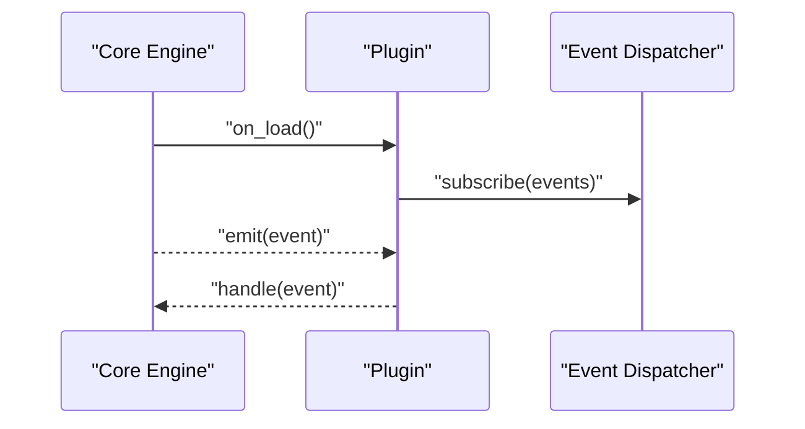

**Diagram sources**
- [plugin_base.py:1-200](file://core/plugin_base.py#L1-L200)
- [ai_plugin_base.py:1-200](file://core/ai_plugin_base.py#L1-L200)
- [event_dispatcher.py:1-200](file://core/event_dispatcher.py#L1-L200)

**Section sources**
- [plugin_base.py:1-200](file://core/plugin_base.py#L1-L200)
- [ai_plugin_base.py:1-200](file://core/ai_plugin_base.py#L1-L200)
- [event_dispatcher.py:1-200](file://core/event_dispatcher.py#L1-L200)

### Platform Adapters Implementation
- Discord Interface: Implements chat, reactions, and media handling for Discord.
- Matrix Interface: Supports rooms, threads, and rich media for Matrix homeservers.
- Telegram Bot Interface: Handles messages, commands, and file uploads for Telegram bots.
- OpenAI API Server Interface: Exposes REST endpoints compatible with OpenAI clients.
- Fluxer Interface: Integrates with Fluxer protocol for specialized workflows.

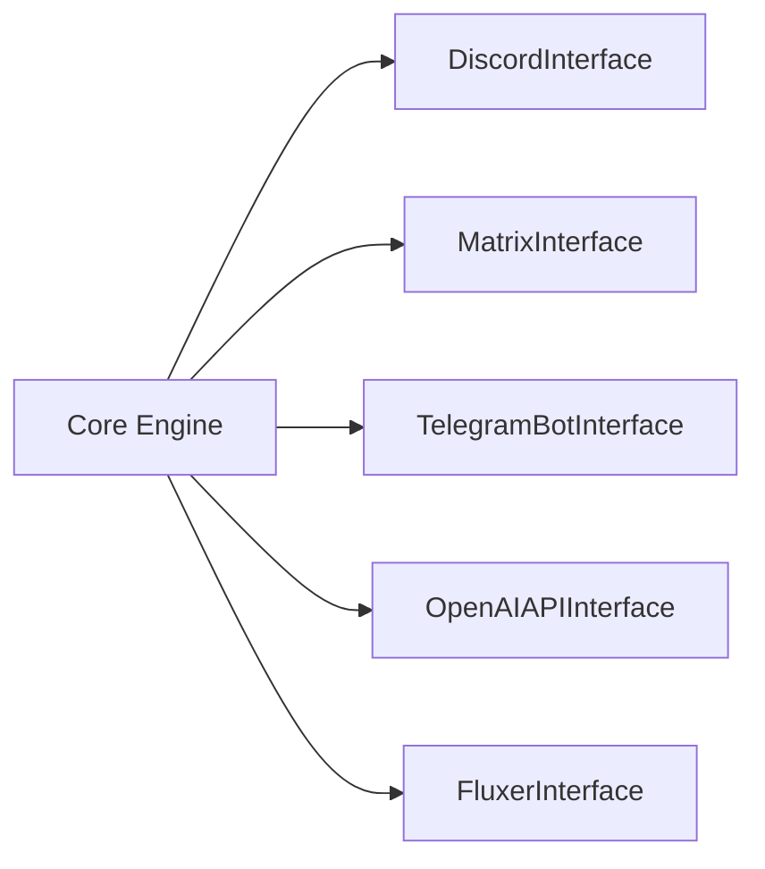

**Diagram sources**
- [discord_interface.py:1-200](file://interface/discord_interface/discord_interface.py#L1-L200)
- [matrix_interface.py:1-200](file://interface/matrix_interface/matrix_interface.py#L1-L200)
- [telegram_bot.py:1-200](file://interface/telegram_bot/telegram_bot.py#L1-L200)
- [openai_api_server.py:1-200](file://interface/openai_api_server/openai_api_server.py#L1-L200)
- [fluxer_interface.py:1-200](file://interface/fluxer_interface/fluxer_interface.py#L1-L200)

**Section sources**
- [discord_interface.py:1-200](file://interface/discord_interface/discord_interface.py#L1-L200)
- [matrix_interface.py:1-200](file://interface/matrix_interface/matrix_interface.py#L1-L200)
- [telegram_bot.py:1-200](file://interface/telegram_bot/telegram_bot.py#L1-L200)
- [openai_api_server.py:1-200](file://interface/openai_api_server/openai_api_server.py#L1-L200)
- [fluxer_interface.py:1-200](file://interface/fluxer_interface/fluxer_interface.py#L1-L200)

## Dependency Analysis
The interface layer depends on core infrastructure for messaging, transport, rate limiting, and events. Registries coordinate instantiation and wiring.

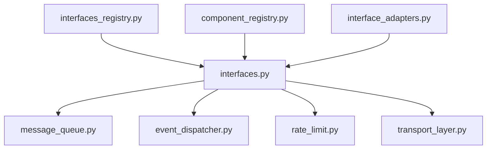

**Diagram sources**
- [interfaces.py:1-200](file://core/interfaces.py#L1-L200)
- [message_queue.py:1-200](file://core/message_queue.py#L1-L200)
- [event_dispatcher.py:1-200](file://core/event_dispatcher.py#L1-L200)
- [rate_limit.py:1-200](file://core/rate_limit.py#L1-L200)
- [transport_layer.py:1-200](file://core/transport_layer.py#L1-L200)
- [interfaces_registry.py:1-200](file://core/interfaces_registry.py#L1-L200)
- [component_registry.py:1-200](file://core/component_registry.py#L1-L200)
- [interface_adapters.py:1-200](file://core/interface_adapters.py#L1-L200)

**Section sources**
- [interfaces.py:1-200](file://core/interfaces.py#L1-L200)
- [message_queue.py:1-200](file://core/message_queue.py#L1-L200)
- [event_dispatcher.py:1-200](file://core/event_dispatcher.py#L1-L200)
- [rate_limit.py:1-200](file://core/rate_limit.py#L1-L200)
- [transport_layer.py:1-200](file://core/transport_layer.py#L1-L200)
- [interfaces_registry.py:1-200](file://core/interfaces_registry.py#L1-L200)
- [component_registry.py:1-200](file://core/component_registry.py#L1-L200)
- [interface_adapters.py:1-200](file://core/interface_adapters.py#L1-L200)

## Performance Considerations
- Asynchronous Processing: Use non-blocking queues and transports to handle high throughput.
- Backpressure: Implement queue size limits and adaptive throttling to prevent memory spikes.
- Connection Pooling: Reuse connections where possible to reduce overhead.
- Rate Limiting: Apply global and per-interface limits to avoid provider throttling.
- Caching: Cache frequently accessed data and responses when safe.

[No sources needed since this section provides general guidance]

## Troubleshooting Guide
- Connection Failures: Check transport logs, retry policies, and network connectivity.
- Rate Limit Errors: Inspect rate limiter counters and adjust quotas.
- Message Routing Issues: Verify normalization and routing rules; check event subscriptions.
- Lifecycle Problems: Ensure proper initialization order and graceful shutdown sequences.
- Plugin Errors: Validate plugin manifests and dependency declarations.

**Section sources**
- [transport_layer.py:1-200](file://core/transport_layer.py#L1-L200)
- [rate_limit.py:1-200](file://core/rate_limit.py#L1-L200)
- [event_dispatcher.py:1-200](file://core/event_dispatcher.py#L1-L200)
- [interfaces.py:1-200](file://core/interfaces.py#L1-L200)

## Conclusion
Synthetic Heart’s interface architecture provides a robust abstraction layer that unifies diverse platforms through a common message format, well-defined interface contracts, and a flexible registration system. By leveraging asynchronous messaging, event-driven design, dependency injection, and resilient transport mechanisms, it enables seamless communication between the core engine and various platforms while maintaining scalability, observability, and ease of extension.