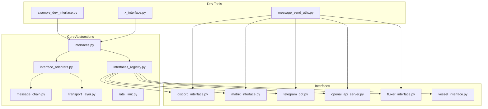
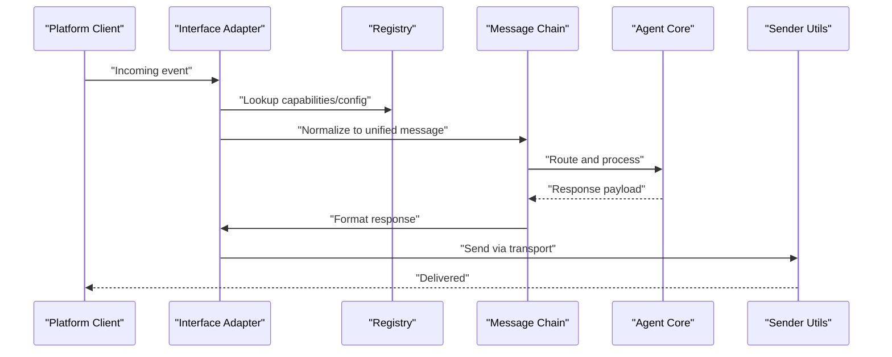
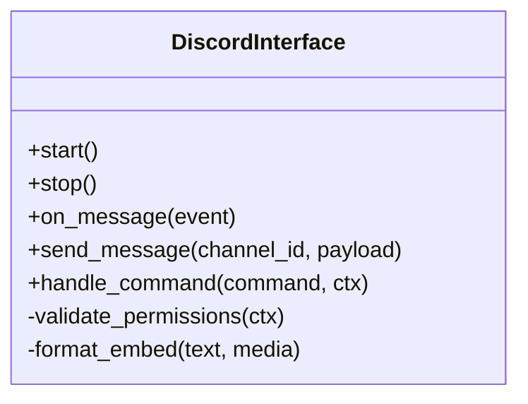
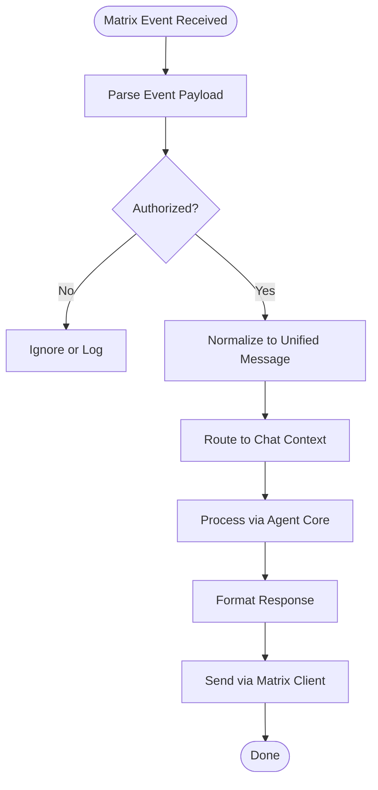
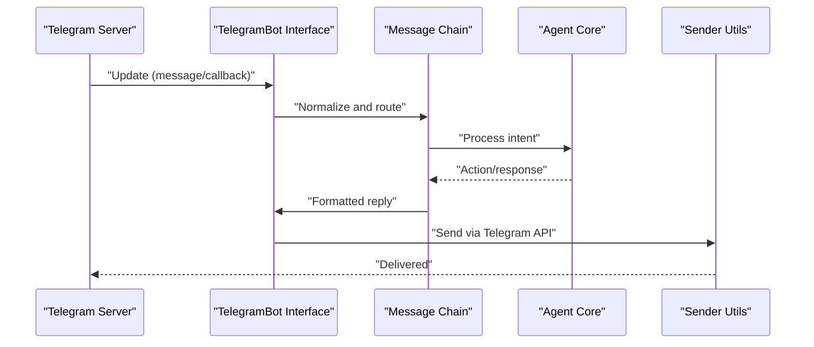
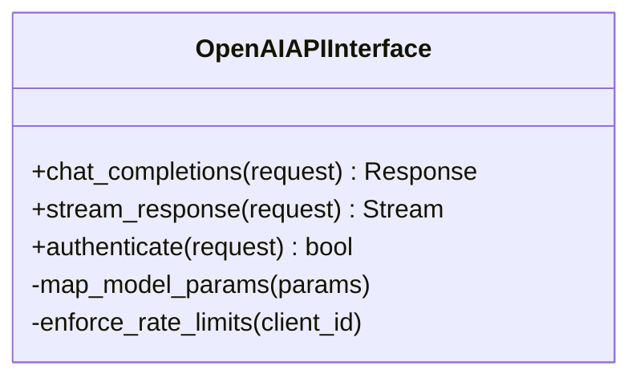
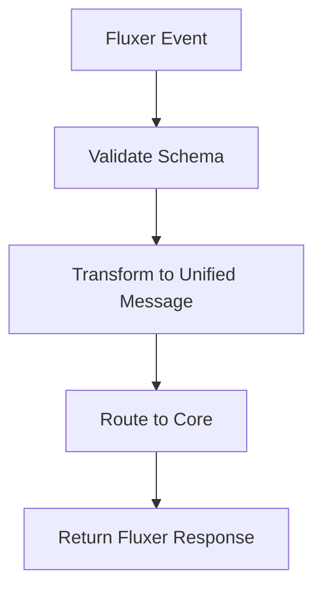
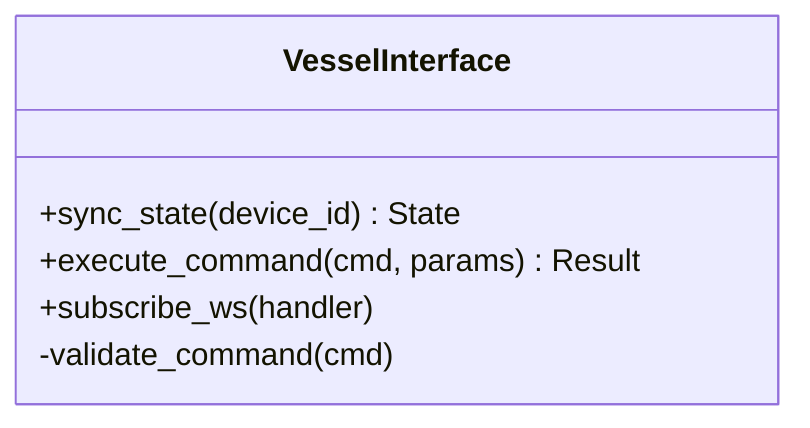
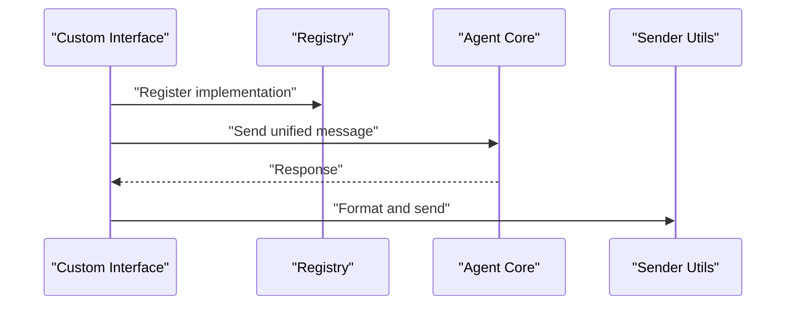
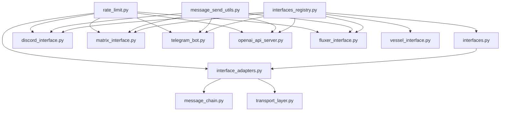

# Interface Layer

<cite>
**Referenced Files in This Document**
- [interfaces.py](file://core/interfaces.py)
- [interface_adapters.py](file://core/interface_adapters.py)
- [interfaces_registry.py](file://core/interfaces_registry.py)
- [message_chain.py](file://core/message_chain.py)
- [transport_layer.py](file://core/transport_layer.py)
- [rate_limit.py](file://core/rate_limit.py)
- [discord_interface/discord_interface.py](file://interface/discord_interface/discord_interface.py)
- [matrix_interface/matrix_interface.py](file://interface/matrix_interface/matrix_interface.py)
- [telegram_bot/telegram_bot.py](file://interface/telegram_bot/telegram_bot.py)
- [openai_api_server/openai_api_server.py](file://interface/openai_api_server/openai_api_server.py)
- [fluxer_interface/fluxer_interface.py](file://interface/fluxer_interface/fluxer_interface.py)
- [vessel_interface.py](file://interface/vessel_interface.py)
- [message_send_utils.py](file://interface/message_send_utils.py)
- [example_dev_interface.py](file://interface_dev/example_dev_interface.py)
- [x_interface.py](file://interface_dev/x_interface.py)
</cite>

## Table of Contents
1. [Introduction](#introduction)
2. [Project Structure](#project-structure)
3. [Core Components](#core-components)
4. [Architecture Overview](#architecture-overview)
5. [Detailed Component Analysis](#detailed-component-analysis)
6. [Dependency Analysis](#dependency-analysis)
7. [Performance Considerations](#performance-considerations)
8. [Troubleshooting Guide](#troubleshooting-guide)
9. [Conclusion](#conclusion)
10. [Appendices](#appendices)

## Introduction
This document explains Synthetic Heart’s multi-platform interface layer: how it normalizes messages across platforms, routes them to the core engine, and sends responses back. It covers the unified message format, platform-specific adapters (Discord, Matrix, Telegram, OpenAI API server, Fluxer), and the abstraction layer that enables custom interfaces. You will find setup guidance, configuration patterns, authentication methods, rate limiting, error handling, and message formatting specifics per platform. Scaling considerations, monitoring hooks, and troubleshooting strategies are included for each interface.

## Project Structure
The interface layer is organized into:
- Core abstractions and registry for interfaces
- Platform-specific implementations under interface/
- Development utilities and examples for building custom interfaces
- Shared utilities for message sending and transport

**Diagram sources**
- [interfaces.py](file://core/interfaces.py)
- [interface_adapters.py](file://core/interface_adapters.py)
- [interfaces_registry.py](file://core/interfaces_registry.py)
- [message_chain.py](file://core/message_chain.py)
- [transport_layer.py](file://core/transport_layer.py)
- [rate_limit.py](file://core/rate_limit.py)
- [discord_interface/discord_interface.py](file://interface/discord_interface/discord_interface.py)
- [matrix_interface/matrix_interface.py](file://interface/matrix_interface/matrix_interface.py)
- [telegram_bot/telegram_bot.py](file://interface/telegram_bot/telegram_bot.py)
- [openai_api_server/openai_api_server.py](file://interface/openai_api_server/openai_api_server.py)
- [fluxer_interface/fluxer_interface.py](file://interface/fluxer_interface/fluxer_interface.py)
- [vessel_interface.py](file://interface/vessel_interface.py)
- [example_dev_interface.py](file://interface_dev/example_dev_interface.py)
- [x_interface.py](file://interface_dev/x_interface.py)
- [message_send_utils.py](file://interface/message_send_utils.py)

**Section sources**
- [interfaces.py](file://core/interfaces.py)
- [interface_adapters.py](file://core/interface_adapters.py)
- [interfaces_registry.py](file://core/interfaces_registry.py)
- [message_chain.py](file://core/message_chain.py)
- [transport_layer.py](file://core/transport_layer.py)
- [rate_limit.py](file://core/rate_limit.py)
- [discord_interface/discord_interface.py](file://interface/discord_interface/discord_interface.py)
- [matrix_interface/matrix_interface.py](file://interface/matrix_interface/matrix_interface.py)
- [telegram_bot/telegram_bot.py](file://interface/telegram_bot/telegram_bot.py)
- [openai_api_server/openai_api_server.py](file://interface/openai_api_server/openai_api_server.py)
- [fluxer_interface/fluxer_interface.py](file://interface/fluxer_interface/fluxer_interface.py)
- [vessel_interface.py](file://interface/vessel_interface.py)
- [example_dev_interface.py](file://interface_dev/example_dev_interface.py)
- [x_interface.py](file://interface_dev/x_interface.py)
- [message_send_utils.py](file://interface/message_send_utils.py)

## Core Components
- Unified Message Format: A normalized representation used by all interfaces, including sender identity, channel context, text/media payloads, timestamps, and metadata.
- Interface Abstraction: Base classes and contracts that define lifecycle methods for starting, receiving, processing, and sending messages.
- Adapters and Registry: Centralized registration and discovery of interface implementations with capability negotiation and feature flags.
- Transport Layer: Pluggable transports for HTTP/WebSocket/long-polling, managing connection state and retries.
- Rate Limiting: Per-interface and per-channel throttling to respect provider quotas and avoid bans.
- Message Chain: Ordered pipeline for preprocessing, routing, enrichment, and postprocessing before delivery to the agent core.

Key responsibilities:
- Normalize incoming events from diverse platforms into a single schema
- Route messages to the appropriate chat/session context
- Apply rate limits and concurrency controls
- Enrich messages with metadata (language, attachments, mentions)
- Send responses back through the originating interface with platform-specific formatting

**Section sources**
- [interfaces.py](file://core/interfaces.py)
- [interface_adapters.py](file://core/interface_adapters.py)
- [interfaces_registry.py](file://core/interfaces_registry.py)
- [message_chain.py](file://core/message_chain.py)
- [transport_layer.py](file://core/transport_layer.py)
- [rate_limit.py](file://core/rate_limit.py)

## Architecture Overview
The interface layer sits between external platforms and the Synthetic Heart core. Each platform adapter implements the same interface contract, ensuring consistent behavior and routing. The registry discovers and manages instances, while the transport layer abstracts connectivity details.

**Diagram sources**
- [interfaces.py](file://core/interfaces.py)
- [interface_adapters.py](file://core/interface_adapters.py)
- [interfaces_registry.py](file://core/interfaces_registry.py)
- [message_chain.py](file://core/message_chain.py)
- [transport_layer.py](file://core/transport_layer.py)
- [message_send_utils.py](file://interface/message_send_utils.py)

## Detailed Component Analysis

### Discord Bot Interface
- Purpose: Connect Synthetic Heart to Discord channels, threads, and DMs.
- Authentication: Bot token via environment or config; optional OAuth scopes for richer interactions.
- Features:
  - Slash commands and button interactions
  - Thread support and mention handling
  - Attachment and embed formatting
  - Voice channel presence (if enabled)
- Rate Limiting: Respect Discord API limits; queue bursts and retry with backoff.
- Error Handling: Graceful fallbacks on rate-limits and network errors; log failures and notify admins if configured.
- Setup:
  - Create a Discord application and bot
  - Configure intents and permissions
  - Provide bot token and allowed channels
- Configuration Examples:
  - Token, intents, allowed channels, command prefixes, embed styles
- Scaling:
  - Shard-aware initialization when needed
  - Connection pooling for HTTP requests
  - Background workers for heavy tasks

**Diagram sources**
- [discord_interface/discord_interface.py](file://interface/discord_interface/discord_interface.py)

**Section sources**
- [discord_interface/discord_interface.py](file://interface/discord_interface/discord_interface.py)
- [message_send_utils.py](file://interface/message_send_utils.py)
- [rate_limit.py](file://core/rate_limit.py)

### Matrix Client Interface
- Purpose: Integrate with Matrix homeservers for chat rooms and direct messages.
- Authentication: Matrix user credentials or access tokens; supports E2EE where applicable.
- Features:
  - Room-based messaging and thread replies
  - Rich text and markdown rendering
  - Media upload/download via MSC
  - Presence and typing indicators
- Rate Limiting: Respect Matrix server limits; implement exponential backoff.
- Error Handling: Retry transient failures; handle room permission errors gracefully.
- Setup:
  - Install Matrix client library
  - Configure homeserver URL, user ID, and access token
  - Enable required MSC features for media
- Configuration Examples:
  - Homeserver, user ID, token, room IDs, MSC toggles
- Scaling:
  - Persistent connections with reconnection logic
  - Batched media uploads
  - Concurrency control per room

**Diagram sources**
- [matrix_interface/matrix_interface.py](file://interface/matrix_interface/matrix_interface.py)

**Section sources**
- [matrix_interface/matrix_interface.py](file://interface/matrix_interface/matrix_interface.py)
- [message_send_utils.py](file://interface/message_send_utils.py)
- [rate_limit.py](file://core/rate_limit.py)

### Telegram Bot Interface
- Purpose: Operate as a Telegram bot for groups, channels, and private chats.
- Authentication: Bot token via environment or config; optional webhook mode for high throughput.
- Features:
  - Inline keyboards and callback queries
  - File and media handling
  - MarkdownV2 and HTML formatting
  - Polls and reactions (where supported)
- Rate Limiting: Respect Telegram API constraints; queue messages and throttle replies.
- Error Handling: Handle network timeouts and rate limits; fallback to simpler formats.
- Setup:
  - Create a bot via BotFather
  - Set bot token and allowed chat IDs
  - Optionally configure webhook URL and certificate
- Configuration Examples:
  - Token, webhook settings, allowed chats, formatting mode
- Scaling:
  - Webhook mode for scalability
  - Concurrent request handling
  - Backpressure management

**Diagram sources**
- [telegram_bot/telegram_bot.py](file://interface/telegram_bot/telegram_bot.py)

**Section sources**
- [telegram_bot/telegram_bot.py](file://interface/telegram_bot/telegram_bot.py)
- [message_send_utils.py](file://interface/message_send_utils.py)
- [rate_limit.py](file://core/rate_limit.py)

### OpenAI API Server Interface
- Purpose: Expose Synthetic Heart as an OpenAI-compatible endpoint for clients expecting standard chat completions.
- Authentication: API key or bearer token; configurable per-route policies.
- Features:
  - Standard chat completions and streaming responses
  - Model selection and parameter mapping
  - Structured output and tool calls (when available)
- Rate Limiting: Enforce per-client quotas and global caps; integrate with upstream limits.
- Error Handling: Map upstream errors to OpenAI error codes; provide actionable messages.
- Setup:
  - Configure server host/port and auth method
  - Define allowed models and parameters
  - Enable logging and metrics endpoints
- Configuration Examples:
  - Auth scheme, model mappings, rate limits, CORS settings
- Scaling:
  - Stateless request handling
  - Horizontal scaling behind load balancer
  - Caching for repeated prompts

**Diagram sources**
- [openai_api_server/openai_api_server.py](file://interface/openai_api_server/openai_api_server.py)

**Section sources**
- [openai_api_server/openai_api_server.py](file://interface/openai_api_server/openai_api_server.py)
- [rate_limit.py](file://core/rate_limit.py)

### Fluxer Interface
- Purpose: Bridge Synthetic Heart with Fluxer systems for specialized workflows and integrations.
- Authentication: API keys or mutual TLS depending on deployment.
- Features:
  - Custom payload schemas
  - Event-driven pipelines
  - Plugin-like extensions
- Rate Limiting: Configurable per-endpoint; integrates with shared limiter.
- Error Handling: Detailed error payloads and retry strategies.
- Setup:
  - Configure endpoint URLs and credentials
  - Define payload mappings and transformations
- Configuration Examples:
  - Endpoint, auth type, payload schema, retry policy
- Scaling:
  - Async processing
  - Queue-backed workers

**Diagram sources**
- [fluxer_interface/fluxer_interface.py](file://interface/fluxer_interface/fluxer_interface.py)

**Section sources**
- [fluxer_interface/fluxer_interface.py](file://interface/fluxer_interface/fluxer_interface.py)
- [message_send_utils.py](file://interface/message_send_utils.py)
- [rate_limit.py](file://core/rate_limit.py)

### Vessel Interface
- Purpose: Internal interface for Synthetic Heart’s vessel subsystem, enabling device-level interactions and local APIs.
- Authentication: Local-only or token-based for containerized deployments.
- Features:
  - Device state synchronization
  - Real-time updates via WebSocket
  - Command execution with safety checks
- Rate Limiting: Local rate limiting to prevent overload.
- Error Handling: Immediate feedback and rollback on failures.
- Setup:
  - Configure local endpoints and permissions
  - Enable WebSocket if needed
- Configuration Examples:
  - Local host/port, token, allowed commands
- Scaling:
  - Single-node optimization
  - Event-driven architecture

**Diagram sources**
- [vessel_interface.py](file://interface/vessel_interface.py)

**Section sources**
- [vessel_interface.py](file://interface/vessel_interface.py)
- [rate_limit.py](file://core/rate_limit.py)

### Custom Interfaces
- How to create: Implement the base interface contract, register with the registry, and configure startup/shutdown hooks.
- Best practices:
  - Use unified message format
  - Respect rate limits and concurrency
  - Provide robust error handling and logging
  - Include health checks and metrics
- Example development interfaces:
  - Example dev interface template
  - X interface pattern for experimental protocols

**Diagram sources**
- [example_dev_interface.py](file://interface_dev/example_dev_interface.py)
- [x_interface.py](file://interface_dev/x_interface.py)
- [interfaces_registry.py](file://core/interfaces_registry.py)

**Section sources**
- [example_dev_interface.py](file://interface_dev/example_dev_interface.py)
- [x_interface.py](file://interface_dev/x_interface.py)
- [interfaces_registry.py](file://core/interfaces_registry.py)

## Dependency Analysis
The interface layer depends on core abstractions for consistency and shared functionality. Platform adapters rely on transport and rate limiting modules, while the registry orchestrates lifecycle and configuration.

**Diagram sources**
- [interfaces.py](file://core/interfaces.py)
- [interface_adapters.py](file://core/interface_adapters.py)
- [interfaces_registry.py](file://core/interfaces_registry.py)
- [message_chain.py](file://core/message_chain.py)
- [transport_layer.py](file://core/transport_layer.py)
- [rate_limit.py](file://core/rate_limit.py)
- [discord_interface/discord_interface.py](file://interface/discord_interface/discord_interface.py)
- [matrix_interface/matrix_interface.py](file://interface/matrix_interface/matrix_interface.py)
- [telegram_bot/telegram_bot.py](file://interface/telegram_bot/telegram_bot.py)
- [openai_api_server/openai_api_server.py](file://interface/openai_api_server/openai_api_server.py)
- [fluxer_interface/fluxer_interface.py](file://interface/fluxer_interface/fluxer_interface.py)
- [vessel_interface.py](file://interface/vessel_interface.py)
- [message_send_utils.py](file://interface/message_send_utils.py)

**Section sources**
- [interfaces.py](file://core/interfaces.py)
- [interface_adapters.py](file://core/interface_adapters.py)
- [interfaces_registry.py](file://core/interfaces_registry.py)
- [message_chain.py](file://core/message_chain.py)
- [transport_layer.py](file://core/transport_layer.py)
- [rate_limit.py](file://core/rate_limit.py)
- [discord_interface/discord_interface.py](file://interface/discord_interface/discord_interface.py)
- [matrix_interface/matrix_interface.py](file://interface/matrix_interface/matrix_interface.py)
- [telegram_bot/telegram_bot.py](file://interface/telegram_bot/telegram_bot.py)
- [openai_api_server/openai_api_server.py](file://interface/openai_api_server/openai_api_server.py)
- [fluxer_interface/fluxer_interface.py](file://interface/fluxer_interface/fluxer_interface.py)
- [vessel_interface.py](file://interface/vessel_interface.py)
- [message_send_utils.py](file://interface/message_send_utils.py)

## Performance Considerations
- Concurrency: Use async handlers where possible; limit concurrent requests per interface.
- Caching: Cache repeated prompts and responses at the adapter level when safe.
- Streaming: Prefer streaming for long-running responses to reduce latency.
- Backpressure: Implement queues and backpressure to handle spikes.
- Monitoring: Emit metrics for request rates, latencies, and error counts per interface.

[No sources needed since this section provides general guidance]

## Troubleshooting Guide
Common issues and resolutions:
- Authentication failures: Verify tokens, scopes, and permissions; check logs for detailed error messages.
- Rate limit exceeded: Adjust throttling settings; implement exponential backoff and retry policies.
- Message formatting errors: Ensure unified message fields are present; validate platform-specific constraints.
- Network timeouts: Configure retries and fallback transports; monitor upstream service health.
- Memory leaks: Inspect background workers and connection pools; ensure proper cleanup on shutdown.

**Section sources**
- [rate_limit.py](file://core/rate_limit.py)
- [transport_layer.py](file://core/transport_layer.py)
- [message_send_utils.py](file://interface/message_send_utils.py)

## Conclusion
Synthetic Heart’s interface layer provides a robust, extensible foundation for connecting to multiple platforms. By adhering to the unified message format and leveraging shared abstractions, developers can add new interfaces quickly while maintaining consistency and reliability. Proper configuration, rate limiting, and error handling ensure smooth operation across diverse environments.

[No sources needed since this section summarizes without analyzing specific files]

## Appendices
- Quick start checklist for each interface
- Configuration reference tables
- Monitoring and alerting recommendations
- Deployment best practices for containers and cloud environments

[No sources needed since this section provides general guidance]