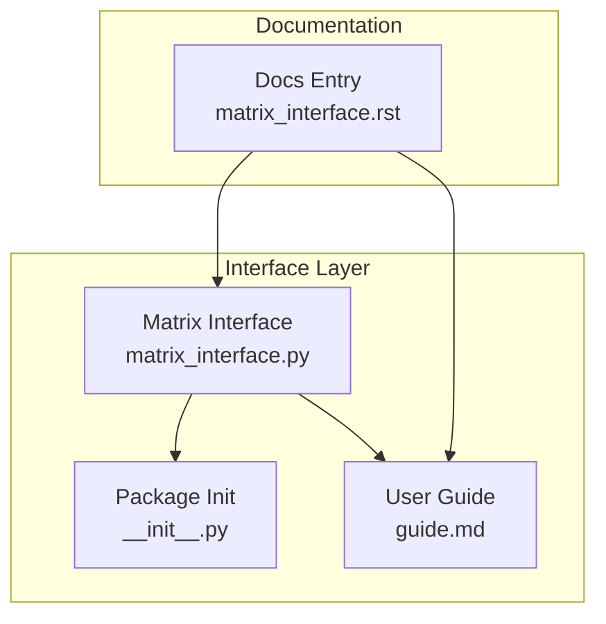
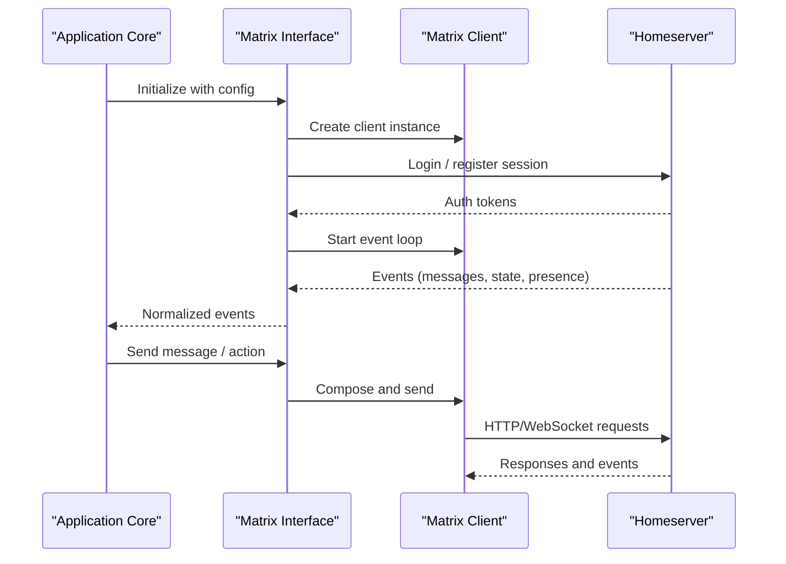
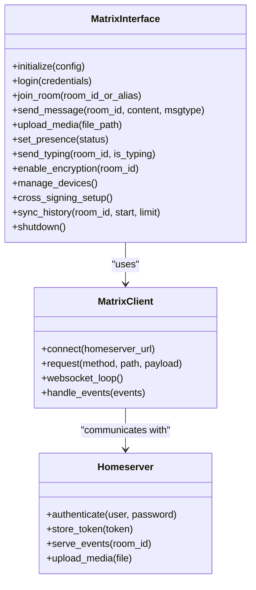
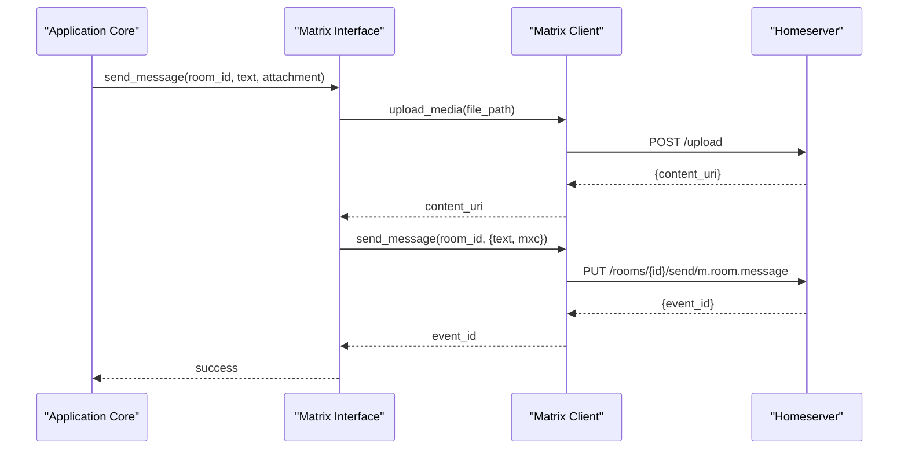
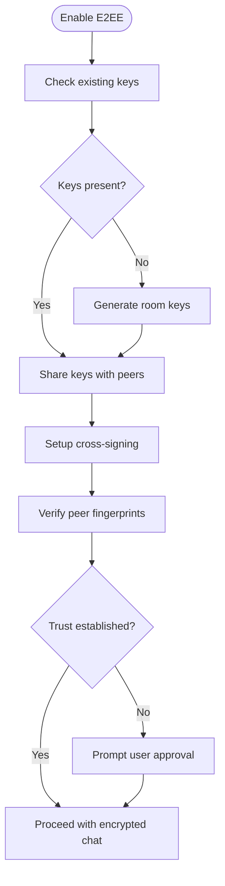
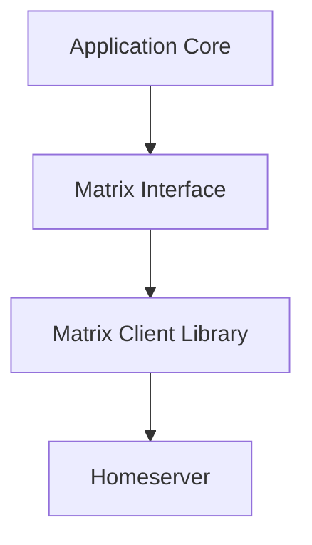

# Matrix Protocol Support

<cite>
**Referenced Files in This Document**
- [matrix_interface.py](file://interface/matrix_interface/matrix_interface.py)
- [guide.md](file://interface/matrix_interface/guide.md)
- [__init__.py](file://interface/matrix_interface/__init__.py)
- [matrix_interface.rst](file://docs/matrix_interface.rst)
</cite>

## Table of Contents
1. [Introduction](#introduction)
2. [Project Structure](#project-structure)
3. [Core Components](#core-components)
4. [Architecture Overview](#architecture-overview)
5. [Detailed Component Analysis](#detailed-component-analysis)
6. [Dependency Analysis](#dependency-analysis)
7. [Performance Considerations](#performance-considerations)
8. [Troubleshooting Guide](#troubleshooting-guide)
9. [Conclusion](#conclusion)

## Introduction
This document explains the Matrix protocol integration for the project, focusing on Homeserver setup, user authentication, room management, message formatting (HTML/Markdown), rich content types and file uploads, end-to-end encryption handling with device management and cross-signing, room state synchronization, presence updates, typing indicators, scaling considerations for large rooms, message history sync, performance optimization, and troubleshooting common connectivity issues.

## Project Structure
The Matrix integration is implemented under the interface layer and documented in both code and documentation files:
- Implementation: interface/matrix_interface/matrix_interface.py
- User guide: interface/matrix_interface/guide.md
- Package init: interface/matrix_interface/__init__.py
- Documentation entry: docs/matrix_interface.rst

**Diagram sources**
- [matrix_interface.py](file://interface/matrix_interface/matrix_interface.py)
- [__init__.py](file://interface/matrix_interface/__init__.py)
- [guide.md](file://interface/matrix_interface/guide.md)
- [matrix_interface.rst](file://docs/matrix_interface.rst)

**Section sources**
- [matrix_interface.py](file://interface/matrix_interface/matrix_interface.py)
- [guide.md](file://interface/matrix_interface/guide.md)
- [__init__.py](file://interface/matrix_interface/__init__.py)
- [matrix_interface.rst](file://docs/matrix_interface.rst)

## Core Components
- Matrix client lifecycle: initialization, connection to Homeserver, event loop, and graceful shutdown.
- Authentication: login flows, token storage, and session persistence.
- Room management: joining, leaving, creating rooms, and managing invites.
- Messaging: sending text (HTML/Markdown), rich content, attachments, and reactions.
- E2EE: key exchange, device management, cross-signing, and trust model.
- Presence and typing: publishing presence and typing indicators per room.
- History sync: pagination, backfill, and incremental updates.
- Scaling: large room strategies, batching, and resource controls.

**Section sources**
- [matrix_interface.py](file://interface/matrix_interface/matrix_interface.py)
- [guide.md](file://interface/matrix_interface/guide.md)

## Architecture Overview
The Matrix integration acts as a bridge between the application core and the Matrix ecosystem via a Matrix client library. It abstracts homeserver connectivity, authentication, room operations, and event processing into a cohesive interface consumed by higher-level components.

**Diagram sources**
- [matrix_interface.py](file://interface/matrix_interface/matrix_interface.py)
- [guide.md](file://interface/matrix_interface/guide.md)

## Detailed Component Analysis

### Homeserver Setup and Configuration
- Configure homeserver URL, TLS settings, and proxy if needed.
- Set up logging and retry policies for resilience.
- Validate connectivity during startup and fail fast on misconfiguration.

Key aspects:
- Connection parameters and environment variables.
- Proxy support and certificate handling.
- Health checks and readiness probes.

**Section sources**
- [guide.md](file://interface/matrix_interface/guide.md)
- [matrix_interface.rst](file://docs/matrix_interface.rst)

### User Authentication
- Supports username/password and token-based login.
- Persists access tokens securely and refreshes sessions.
- Handles 401/403 responses and re-authentication flows.

Operational notes:
- Store tokens in secure configuration or secret manager.
- Rotate credentials and handle expiration gracefully.
- Multi-user scenarios require per-user sessions.

**Section sources**
- [matrix_interface.py](file://interface/matrix_interface/matrix_interface.py)
- [guide.md](file://interface/matrix_interface/guide.md)

### Room Management
- Join rooms by ID or alias; create new rooms with appropriate power levels.
- Manage invites, bans, and member roles.
- Subscribe to room events and maintain local state cache.

Best practices:
- Cache room metadata to reduce server load.
- Use aliases for human-readable room references.
- Handle join errors and permission checks.

**Section sources**
- [matrix_interface.py](file://interface/matrix_interface/matrix_interface.py)
- [guide.md](file://interface/matrix_interface/guide.md)

### Message Formatting and Rich Content
- Text messages support HTML and Markdown; choose based on client capabilities.
- Rich content includes images, audio, video, and documents via mxc URIs.
- File upload flow: upload to server, obtain MXC URI, then send reference in message.

Guidelines:
- Sanitize HTML to prevent XSS.
- Prefer Markdown when clients lack HTML rendering.
- Validate media types and sizes before upload.

**Section sources**
- [matrix_interface.py](file://interface/matrix_interface/matrix_interface.py)
- [guide.md](file://interface/matrix_interface/guide.md)

### End-to-End Encryption (E2EE)
- Enable encryption per room; negotiate keys with peers.
- Device management: list devices, remove compromised ones, and rotate keys.
- Cross-signing: establish trust across devices and verify peer identities.

Security considerations:
- Verify fingerprint and cross-signing status.
- Prompt users to approve unknown devices.
- Back up recovery keys securely.

**Section sources**
- [matrix_interface.py](file://interface/matrix_interface/matrix_interface.py)
- [guide.md](file://interface/matrix_interface/guide.md)

### Presence Updates and Typing Indicators
- Publish presence (online, idle, busy, offline) per room or globally.
- Send typing indicators while composing messages; clear after send or timeout.
- Respect rate limits and avoid excessive signaling.

Implementation tips:
- Debounce typing events to minimize network traffic.
- Sync presence with UI state for consistency.

**Section sources**
- [matrix_interface.py](file://interface/matrix_interface/matrix_interface.py)
- [guide.md](file://interface/matrix_interface/guide.md)

### Room State Synchronization and History Sync
- Maintain room state cache; reconcile differences on events.
- Paginate history using start/limit parameters; handle gaps and duplicates.
- Optimize backfill by limiting frequency and caching results.

Performance advice:
- Batch state updates where possible.
- Use lazy loading for large rooms.

**Section sources**
- [matrix_interface.py](file://interface/matrix_interface/matrix_interface.py)
- [guide.md](file://interface/matrix_interface/guide.md)

### Scaling Considerations for Large Rooms
- Limit event processing scope; filter irrelevant events early.
- Use background workers for heavy tasks like media processing.
- Implement backpressure to avoid memory spikes.

Operational guidance:
- Monitor CPU, memory, and network usage.
- Tune concurrency and queue sizes per deployment.

**Section sources**
- [matrix_interface.py](file://interface/matrix_interface/matrix_interface.py)
- [guide.md](file://interface/matrix_interface/guide.md)

### Performance Optimization
- Reuse connections and sessions; avoid frequent reconnects.
- Cache frequently accessed data (room info, user profiles).
- Compress payloads where supported and enable keep-alive.

Metrics to track:
- Latency per request type.
- Error rates and timeouts.
- Event throughput and backlog size.

**Section sources**
- [matrix_interface.py](file://interface/matrix_interface/matrix_interface.py)
- [guide.md](file://interface/matrix_interface/guide.md)

### Class Diagram of Matrix Integration Components

**Diagram sources**
- [matrix_interface.py](file://interface/matrix_interface/matrix_interface.py)

### Sequence Diagram: Sending a Message with Attachment

**Diagram sources**
- [matrix_interface.py](file://interface/matrix_interface/matrix_interface.py)

### Flowchart: E2EE Key Exchange and Cross-Signing

**Diagram sources**
- [matrix_interface.py](file://interface/matrix_interface/matrix_interface.py)

## Dependency Analysis
The Matrix interface depends on a Matrix client library and communicates with the Homeserver over HTTP and WebSocket. Higher-level modules consume the interface for messaging and room operations.

**Diagram sources**
- [matrix_interface.py](file://interface/matrix_interface/matrix_interface.py)

**Section sources**
- [matrix_interface.py](file://interface/matrix_interface/matrix_interface.py)

## Performance Considerations
- Connection reuse and session caching reduce overhead.
- Event filtering minimizes unnecessary processing.
- Background queues decouple heavy tasks from request paths.
- Rate limiting prevents server throttling and improves stability.

[No sources needed since this section provides general guidance]

## Troubleshooting Guide
Common issues and resolutions:
- Connectivity failures: verify homeserver URL, TLS, and proxy settings; check firewall rules.
- Authentication errors: confirm credentials and token validity; re-login if expired.
- Room join failures: ensure permissions and correct room IDs/aliases.
- Message delivery problems: inspect error codes and retry logic; validate content types.
- E2EE issues: review device lists, cross-signing status, and trust prompts.
- Presence/typing not updating: check rate limits and client compatibility.

Debugging techniques:
- Enable verbose logging for HTTP and WebSocket traffic.
- Inspect event payloads and room state diffs.
- Use test endpoints to validate connectivity and auth.

**Section sources**
- [guide.md](file://interface/matrix_interface/guide.md)
- [matrix_interface.rst](file://docs/matrix_interface.rst)

## Conclusion
The Matrix integration provides a robust foundation for connecting the application to Matrix ecosystems. By following the setup, authentication, room management, and security guidelines outlined here, you can build reliable, scalable, and secure communication features. For advanced scenarios, consult the detailed documentation and implementation references.

[No sources needed since this section summarizes without analyzing specific files]